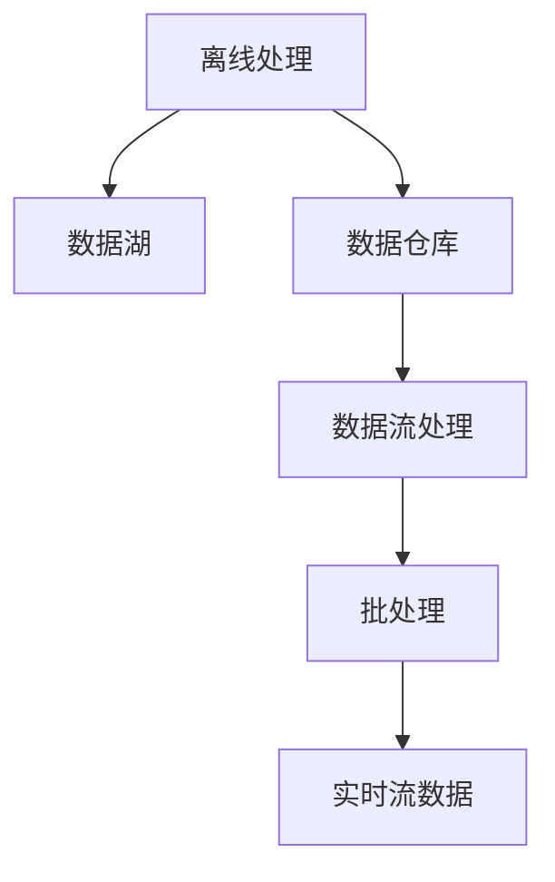

                 

# 知识发现引擎的离线处理与批处理技术

## 1. 背景介绍

### 1.1 问题由来
在大数据时代，知识发现(Knowledge Discovery, KDD)过程产生了海量数据和复杂计算任务，如何高效处理和分析这些数据，成为了KDD领域的一大挑战。传统的在线处理方式无法满足这种大规模数据的需求，因此离线处理和批处理技术应运而生。

### 1.2 问题核心关键点
离线处理和批处理技术的基本思路是将数据提前预处理存储，再使用专用计算资源进行离线分析。这一方法极大地提高了数据处理的效率和处理能力。

然而，如何保证离线处理与在线处理的性能差异最小化，避免数据一致性和业务影响，是实现离线处理的关键。批处理技术则解决了这一问题，通过合理调度批处理任务的执行时机，确保数据及时更新和业务流畅运行。

## 2. 核心概念与联系

### 2.1 核心概念概述

为更好地理解离线处理与批处理技术，本节将介绍几个密切相关的核心概念：

- 离线处理(Offline Processing)：指将数据提前从实时流中抽取、预处理并存储，再使用专用计算资源进行离线分析的技术。适用于需要大规模数据处理和复杂计算的任务。

- 批处理(Batch Processing)：指将数据按批处理的方式，批量输入计算模型，进行统一分析的技术。在离线处理中，通常采用批处理进行数据更新。

- 实时流数据(Real-time Stream Data)：指以时间序列为特点，持续产生并流动的数据流。例如日志、传感器数据等。

- 数据湖(Data Lake)：指集中存储海量原始数据，便于离线分析和数据挖掘的系统。一般包含传统关系型数据库和大规模分布式存储系统。

- 数据仓库(Data Warehouse)：指从数据湖中抽取数据，经过清洗、转换和加载后，存储到结构化数据库中，用于支持OLAP等高级分析。

- 数据流处理(Stream Processing)：指对实时流数据进行实时处理，例如Apache Kafka、Flink等。

这些核心概念之间的逻辑关系可以通过以下Mermaid流程图来展示：



这个流程图展示了大规模数据处理的基本框架：

1. 离线处理的数据从实时流中抽取，存储到数据湖。
2. 部分数据从数据湖抽取到数据仓库，进行结构化存储。
3. 数据仓库的数据经过批处理系统进行分析和计算。
4. 实时流数据通过数据流处理系统进行实时处理。

这些概念共同构成了大规模数据处理的整体框架，帮助开发者更好地设计和使用数据处理系统。

## 3. 核心算法原理 & 具体操作步骤

### 3.1 算法原理概述

离线处理与批处理技术的核心原理是通过批量处理来提高计算效率，而通过定期更新数据仓库来保证业务实时性。其具体步骤如下：

1. **数据采集**：从实时流中按时间间隔定期抽取数据，存入数据湖。
2. **数据预处理**：对数据湖中的数据进行清洗、去重、转换等预处理操作，生成初步分析结果。
3. **数据存储**：将初步分析结果存入数据仓库，便于后续批处理分析和查询。
4. **批处理分析**：在离线计算资源上，对数据仓库中的数据进行批量分析和计算，生成最终分析报告。
5. **数据更新**：定期将批处理分析结果写入数据仓库，保持数据的一致性和业务实时性。

### 3.2 算法步骤详解

下面详细介绍离线处理与批处理技术的详细步骤：

**Step 1: 数据采集与预处理**
- 设计数据采集流程，从实时流中定期抽取数据，存储到数据湖。
- 对数据湖中的数据进行预处理，包括清洗、去重、格式化、转换等操作。

**Step 2: 数据存储与批处理分析**
- 将预处理后的数据定期存入数据仓库。
- 设计批处理流程，使用离线计算资源对数据仓库中的数据进行批量分析和计算，生成分析报告。

**Step 3: 数据更新与系统集成**
- 定期将批处理分析结果写入数据仓库，更新数据仓库中的数据。
- 设计系统集成接口，将分析结果暴露给上层应用系统，实现数据实时化。

**Step 4: 监控与优化**
- 实时监控批处理分析任务的执行情况，记录和分析性能瓶颈。
- 定期优化批处理任务调度策略，确保任务高效运行。

### 3.3 算法优缺点

离线处理与批处理技术具有以下优点：
1. 高效性：通过批量处理提高计算效率，适合大规模数据分析任务。
2. 扩展性：数据采集和批处理任务可以并行处理，提高系统扩展性。
3. 灵活性：可以通过灵活调度批处理任务，避免高峰期资源紧张。
4. 可控性：通过批处理任务管理，可以轻松监控和优化系统性能。

然而，该方法也存在一些缺点：
1. 延迟性：数据更新会有一定的延迟，不能实时反映最新数据变化。
2. 数据一致性：数据更新需要在批处理任务执行结束后，才能保证数据一致性。
3. 存储成本：数据湖和数据仓库需要大量存储资源，存储成本较高。
4. 计算复杂性：数据预处理和批处理分析任务可能较为复杂，需要高级技术支持。

尽管存在这些局限性，但就目前而言，离线处理与批处理技术仍是大规模数据处理的最主流范式。未来相关研究的重点在于如何进一步降低数据处理延迟，提高数据实时性，同时兼顾可扩展性和灵活性等因素。

### 3.4 算法应用领域

离线处理与批处理技术在以下领域中得到了广泛应用：

- 金融风控：通过批量处理历史交易数据，进行风险评估和欺诈检测，确保资金安全。
- 网络安全：通过批量分析日志数据，检测异常流量和恶意攻击，防范网络安全威胁。
- 智能制造：通过批量处理生产数据，优化生产流程和设备维护，提升生产效率。
- 健康医疗：通过批量处理患者数据，进行疾病诊断和趋势分析，改善医疗服务。
- 社交媒体：通过批量处理用户数据，进行情感分析和社会关系挖掘，提升用户体验。

除了上述这些经典应用外，离线处理与批处理技术也被创新性地应用到更多场景中，如物联网数据处理、推荐系统数据建模等，为大数据技术带来了全新的突破。

## 4. 数学模型和公式 & 详细讲解 & 举例说明

### 4.1 数学模型构建

本节将使用数学语言对离线处理与批处理技术进行更加严格的刻画。

设数据流为 $X=\{X_t\}_{t=0}^T$，其中 $X_t$ 为时间 $t$ 时刻的输入数据。离线处理与批处理技术的基本模型如下：

1. **数据采集模型**：从实时流中按时间间隔 $d_t$ 抽取数据 $X_t$，存入数据湖 $D$。
2. **数据预处理模型**：对数据湖 $D$ 中的数据 $X_t$ 进行预处理 $P(X_t)$，生成初步分析结果 $Z_t$。
3. **数据存储模型**：将初步分析结果 $Z_t$ 定期存入数据仓库 $W$。
4. **批处理分析模型**：在离线计算资源上，对数据仓库 $W$ 中的数据进行批量分析和计算 $A(W)$，生成分析报告 $R_t$。
5. **数据更新模型**：定期将分析结果 $R_t$ 写入数据仓库 $W$，更新数据仓库中的数据。

### 4.2 公式推导过程

以一个简单的在线统计为例，介绍离线处理与批处理技术的基本推导过程。

假设实时流数据 $X_t$ 为一系列整数，离线处理的任务是计算 $X_t$ 的平均值 $\bar{X}$。

**Step 1: 数据采集模型**
- 设时间间隔 $d_t=1$，则每次从数据流 $X_t$ 中抽取 $X_t$。

**Step 2: 数据预处理模型**
- 设预处理操作为 $\sum_{i=1}^{t}X_i$，即累加数据流 $X_t$ 的各项值，生成初步分析结果 $Z_t=\sum_{i=1}^{t}X_i$。

**Step 3: 数据存储模型**
- 将 $Z_t$ 定期存入数据仓库 $W$，如每小时存入一次。

**Step 4: 批处理分析模型**
- 设离线计算资源的处理能力为 $C$，每小时可处理数据量 $D$，则批处理时间为 $T_h=\frac{Z_t}{D}$。
- 计算批处理分析结果 $R_t$，即 $\bar{X}=\frac{Z_t}{t}$。

**Step 5: 数据更新模型**
- 设数据更新周期为 $T_u$，则每 $T_u$ 小时更新一次数据仓库 $W$，确保数据一致性和业务实时性。

### 4.3 案例分析与讲解

假设某电商平台的交易数据流 $X_t$ 包含时间戳 $t$ 和交易金额 $x$，需要统计每小时的交易总金额和平均金额。

**Step 1: 数据采集模型**
- 假设数据采集间隔为每分钟抽取一次，即 $d_t=1$。

**Step 2: 数据预处理模型**
- 设预处理操作为 $\sum_{i=1}^{t}x_i$，生成初步分析结果 $Z_t=\sum_{i=1}^{t}x_i$。

**Step 3: 数据存储模型**
- 将 $Z_t$ 每小时存入数据仓库 $W$，即每小时更新一次数据仓库。

**Step 4: 批处理分析模型**
- 假设离线计算资源的处理能力为 $C$，每小时可处理数据量 $D=5\times 10^6$。
- 设每小时数据量为 $N=1\times 10^5$，则批处理时间为 $T_h=\frac{Z_t}{D}=1$ 小时。
- 计算批处理分析结果 $R_t$，即 $\bar{X}=\frac{Z_t}{t}$。

**Step 5: 数据更新模型**
- 设数据更新周期为 $T_u=1$ 小时，则每 $T_u$ 小时更新一次数据仓库 $W$，确保数据一致性和业务实时性。

通过这个案例，可以看到离线处理与批处理技术的基本流程和计算方式，能够较好地解决大规模数据处理的需求。

## 5. 项目实践：代码实例和详细解释说明

### 5.1 开发环境搭建

在进行离线处理与批处理技术实践前，我们需要准备好开发环境。以下是使用Python进行Apache Kafka和Apache Flink开发的离线处理与批处理环境配置流程：

1. 安装Apache Kafka：从官网下载并安装Apache Kafka，配置好Zookeeper和Kafka服务。

2. 安装Apache Flink：从官网下载并安装Apache Flink，配置好Yarn集群或本地模式。

3. 安装相关依赖库：
```bash
pip install apache-kafka-python apache-flink-connector flink-python
```

4. 创建Flink作业项目：
```bash
mkdir flink-project
cd flink-project
mvn archetype:generate -DgroupId=com.example -DartifactId=flink-batch-processing -DarchetypeArtifactId=maven-archetype-quickstart -DinteractiveMode=false
```

5. 配置项目依赖：
```xml
<dependencies>
    <dependency>
        <groupId>org.apache.flink</groupId>
        <artifactId>flink-connector-kafka</artifactId>
        <version>1.14.1</version>
    </dependency>
    <dependency>
        <groupId>org.apache.flink</groupId>
        <artifactId>flink-shaded-serialization</artifactId>
        <version>1.14.1</version>
    </dependency>
    <dependency>
        <groupId>org.apache.flink</groupId>
        <artifactId>flink-streaming-api</artifactId>
        <version>1.14.1</version>
    </dependency>
    <dependency>
        <groupId>org.apache.flink</groupId>
        <artifactId>flink-connector-local</artifactId>
        <version>1.14.1</version>
    </dependency>
</dependencies>
```

完成上述步骤后，即可在Flink作业中开始离线处理与批处理实践。

### 5.2 源代码详细实现

下面我们以统计每小时交易总金额和平均金额为例，给出使用Apache Flink对交易数据进行离线处理的Python代码实现。

首先，定义离线处理的输入和输出数据类型：

```python
from pyflink.datastream.api import StreamExecutionEnvironment
from pyflink.datastream.functions import SourceFunction, SinkFunction
from pyflink.common.time import TimeCharacteristic, WatermarkStrategy

class Transaction:
    def __init__(self, time: int, amount: int):
        self.time = time
        self.amount = amount

class TransactionSummary:
    def __init__(self, sum_amount: int, count: int):
        self.sum_amount = sum_amount
        self.count = count
```

然后，定义离线处理的输入和输出数据源：

```python
def create_transaction_source():
    return SourceFunction(Transaction, time_characteristic=TimeCharacteristic.EventTime)

def create_transaction_sink():
    return SinkFunction(TransactionSummary, time_characteristic=TimeCharacteristic.EventTime)

def create_summary_source():
    return SourceFunction(TransactionSummary, time_characteristic=TimeCharacteristic.EventTime)

def create_summary_sink():
    return SinkFunction(Transaction, time_characteristic=TimeCharacteristic.EventTime)
```

接着，定义离线处理的批处理函数：

```python
def batch_process(transactions):
    sum_amount = 0
    count = 0
    
    for transaction in transactions:
        sum_amount += transaction.amount
        count += 1
    
    return TransactionSummary(sum_amount, count)
```

最后，定义离线处理的Flink作业主程序：

```python
def batch_processing_main():
    env = StreamExecutionEnvironment.get_execution_environment()

    # 数据流读取
    transactions = env.from_collection(create_transaction_source())

    # 批处理分析
    transaction_summary = transactions.window(TimeCharacteristic.TIMESTAMP, 60).reduce(batch_process)

    # 数据流写入
    transaction_summary = env.from_collection(create_summary_source())
    transaction_summary.apply(lambda ts: batch_process(ts)).sink(create_summary_sink())

    env.execute("Batch Processing")

batch_processing_main()
```

以上就是使用Apache Flink进行离线处理与批处理的基本代码实现。可以看到，借助Flink的高效分布式计算能力，我们能够轻松实现大规模数据离线处理和批处理分析。

### 5.3 代码解读与分析

让我们再详细解读一下关键代码的实现细节：

**Transaction类**：
- 定义了一个包含时间戳和交易金额的交易对象。

**TransactionSummary类**：
- 定义了一个包含交易总金额和交易次数的统计结果对象。

**create_transaction_source函数**：
- 定义了一个生成交易数据的SourceFunction，每次生成一个Transaction对象。

**create_transaction_sink函数**：
- 定义了一个将统计结果写入Kafka的SinkFunction。

**create_summary_source函数**：
- 定义了一个生成统计结果的SourceFunction，每次生成一个TransactionSummary对象。

**create_summary_sink函数**：
- 定义了一个将统计结果写入Kafka的SinkFunction。

**batch_process函数**：
- 定义了一个批处理分析函数，用于计算交易总金额和交易次数。

**batch_processing_main函数**：
- 通过StreamExecutionEnvironment获取执行环境。
- 从数据源读取交易数据，进行批处理分析。
- 将统计结果写入Kafka。

通过这个代码实例，我们可以看到Flink如何轻松实现大规模数据的离线处理和批处理分析。Flink的流式处理和批处理能力，使其成为离线处理与批处理技术的理想工具。

当然，在实际应用中，还需要考虑更多的因素，如数据流量的峰值、数据一致性、系统容错性等。只有合理设计离线处理与批处理系统，才能保证高效可靠的数据处理能力。

## 6. 实际应用场景

### 6.1 智能推荐系统

离线处理与批处理技术在智能推荐系统中得到了广泛应用。智能推荐系统需要对用户行为数据进行分析和建模，以推荐用户可能感兴趣的商品或内容。

在实践过程中，可以定期从实时流中抽取用户行为数据，存入数据湖进行预处理和分析。将分析结果定期写入数据仓库，供批处理系统进行推荐算法训练和模型更新。

通过这种离线处理与批处理的方式，智能推荐系统能够基于历史数据进行稳定和高效的推荐，同时也能适应业务的变化和新数据的实时注入。

### 6.2 金融风控

金融风控系统需要对用户的交易行为进行实时监测和风险评估。但由于数据量大、处理复杂，传统的在线处理方式难以满足需求。

在金融风控系统中，可以设计离线处理与批处理流程，从实时流中定期抽取交易数据，存入数据湖进行预处理和分析。将分析结果定期写入数据仓库，供批处理系统进行风险评估和欺诈检测。

通过这种离线处理与批处理的方式，金融风控系统能够基于历史数据进行风险评估，同时也能及时更新模型以应对新业务和风险的变化。

### 6.3 智能制造

智能制造系统需要对生产数据进行实时处理和分析，以优化生产流程和设备维护。但由于数据量大、处理复杂，传统的在线处理方式难以满足需求。

在智能制造系统中，可以设计离线处理与批处理流程，从实时流中定期抽取生产数据，存入数据湖进行预处理和分析。将分析结果定期写入数据仓库，供批处理系统进行生产优化和设备维护。

通过这种离线处理与批处理的方式，智能制造系统能够基于历史数据进行生产优化，同时也能及时更新模型以应对新设备和生产线的变化。

### 6.4 未来应用展望

随着离线处理与批处理技术的不断发展，未来将在更多领域得到应用，为大数据技术带来新的突破。

在智慧城市治理中，离线处理与批处理技术可以用于智能交通、智慧能源、城市安全等领域，提升城市的智能化和精细化管理水平。

在智慧医疗中，离线处理与批处理技术可以用于电子病历分析、疾病预测、药物研发等领域，提升医疗服务的智能化和个性化水平。

在智慧教育中，离线处理与批处理技术可以用于学生行为分析、课程推荐、学习效果评估等领域，提升教育服务的智能化和个性化水平。

除此之外，离线处理与批处理技术还将应用于金融、安全、制造、物流、社交等多个领域，为大数据技术的落地应用提供新的解决方案。

## 7. 工具和资源推荐

### 7.1 学习资源推荐

为了帮助开发者系统掌握离线处理与批处理技术，这里推荐一些优质的学习资源：

1. 《Hadoop: The Definitive Guide》：Hadoop官方文档，详细介绍了Hadoop的架构和应用。
2. 《Spark: The Definitive Guide》：Spark官方文档，详细介绍了Spark的架构和应用。
3. 《Apache Kafka: The Definitive Guide》：Kafka官方文档，详细介绍了Kafka的架构和应用。
4. 《Apache Flink: The Definitive Guide》：Flink官方文档，详细介绍了Flink的架构和应用。
5. 《Hive: The Definitive Guide》：Hive官方文档，详细介绍了Hive的架构和应用。

通过这些资源的学习实践，相信你一定能够快速掌握离线处理与批处理技术的精髓，并用于解决实际的业务问题。

### 7.2 开发工具推荐

高效的开发离不开优秀的工具支持。以下是几款用于离线处理与批处理开发的常用工具：

1. Hadoop：Apache基金会开源的分布式存储和计算框架，适用于海量数据的离线处理。
2. Spark：Apache基金会开源的分布式计算框架，支持离线处理和实时流处理。
3. Kafka：Apache基金会开源的消息中间件，支持实时流数据的传输和处理。
4. Flink：Apache基金会开源的流处理框架，支持离线处理和实时流处理。
5. Hive：Apache基金会开源的数据仓库系统，支持大规模离线数据的ETL处理。

合理利用这些工具，可以显著提升离线处理与批处理任务的开发效率，加快创新迭代的步伐。

### 7.3 相关论文推荐

离线处理与批处理技术的发展源于学界的持续研究。以下是几篇奠基性的相关论文，推荐阅读：

1. "MapReduce: Simplified Data Processing on Large Clusters"（MapReduce论文）：提出了分布式处理框架MapReduce，奠定了大数据处理的基础。
2. "Pig Latin: A Platform for Exploring Large Datasets"（Pig论文）：提出了Pig语言，用于大规模数据处理。
3. "Yahoo! S4: Handling Trillions of Events per Second"（S4论文）：介绍了Yahoo! S4系统，用于大规模流数据的处理。
4. "Storm: Distributed Real-Time Computation"（Storm论文）：介绍了Storm流处理框架，用于大规模实时流数据的处理。
5. "Hadoop Streaming: Simplified Streaming with MapReduce"（Hadoop Streaming论文）：介绍了Hadoop Streaming，用于简单流处理的实现。

这些论文代表了大规模数据处理的发展脉络。通过学习这些前沿成果，可以帮助研究者把握学科前进方向，激发更多的创新灵感。

## 8. 总结：未来发展趋势与挑战

### 8.1 总结

本文对离线处理与批处理技术进行了全面系统的介绍。首先阐述了离线处理与批处理技术的背景和意义，明确了其在处理大规模数据方面的独特价值。其次，从原理到实践，详细讲解了离线处理与批处理技术的数学原理和关键步骤，给出了离线处理与批处理任务开发的完整代码实例。同时，本文还广泛探讨了离线处理与批处理技术在智能推荐系统、金融风控、智能制造等多个行业领域的应用前景，展示了技术的广泛影响力。

通过本文的系统梳理，可以看到，离线处理与批处理技术正在成为大数据处理的重要范式，极大地提升了数据处理的效率和处理能力。未来相关研究的重点在于如何进一步降低数据处理延迟，提高数据实时性，同时兼顾可扩展性和灵活性等因素。

### 8.2 未来发展趋势

展望未来，离线处理与批处理技术将呈现以下几个发展趋势：

1. 超大规模分布式计算：随着硬件性能的提升和云计算的普及，离线处理与批处理系统的分布式计算能力将进一步增强。超大规模集群将能够处理更复杂、更大规模的数据处理任务。
2. 实时流处理与离线处理的融合：结合流处理和批处理的技术优势，实现实时流数据的离线处理，确保数据一致性和业务实时性。
3. 智能化的数据处理：引入机器学习、深度学习等技术，提升数据处理和分析的智能化水平，实现自动化的数据清洗、转换和分析。
4. 跨云数据的处理：支持跨云平台的数据处理和分析，实现数据的高效迁移和计算。
5. 面向边缘的数据处理：通过边缘计算技术，实现本地数据的离线处理和实时分析，提升数据处理的效率和可靠性。

以上趋势凸显了离线处理与批处理技术的广阔前景。这些方向的探索发展，必将进一步提升大数据处理系统的性能和应用范围，为各行各业提供更高效、更智能的数据处理能力。

### 8.3 面临的挑战

尽管离线处理与批处理技术已经取得了显著成就，但在迈向更加智能化、普适化应用的过程中，它仍面临着诸多挑战：

1. 数据一致性：离线处理与批处理系统需要在批处理任务执行结束后才能保证数据一致性，可能导致业务延迟和数据滞后。
2. 延迟时间：数据处理延迟是离线处理与批处理技术的固有缺点，难以避免。如何在保证数据一致性的同时，尽量缩短延迟时间，是一个难题。
3. 存储成本：离线处理与批处理系统需要大量存储资源，存储成本较高。如何在保证数据一致性的同时，降低存储成本，是一个关键问题。
4. 系统复杂性：离线处理与批处理系统需要复杂的设计和部署，如何在确保系统可靠性的同时，简化系统设计和实现，是一个重要课题。
5. 实时性要求：部分业务需要实时处理数据，离线处理与批处理系统难以满足实时性的需求。如何在保证数据一致性的同时，提升系统的实时性，是一个挑战。

尽管存在这些挑战，但离线处理与批处理技术仍然是大数据处理的主流范式。未来相关研究需要在数据一致性、延迟时间、存储成本等方面进行更多的探索和优化。

### 8.4 研究展望

面对离线处理与批处理技术面临的挑战，未来的研究需要在以下几个方面寻求新的突破：

1. 引入实时流处理技术：通过引入实时流处理技术，实现数据处理的实时化和高效化。
2. 优化数据存储策略：通过优化数据存储策略，降低存储成本，提高数据处理效率。
3. 引入机器学习算法：通过引入机器学习算法，提升数据处理和分析的智能化水平，实现自动化的数据清洗、转换和分析。
4. 开发高性能计算框架：通过开发高性能计算框架，提升离线处理与批处理系统的分布式计算能力，支持更复杂、更大规模的数据处理任务。
5. 设计可扩展的架构：通过设计可扩展的架构，提升离线处理与批处理系统的扩展性和灵活性，支持多种数据源和数据处理场景。

这些研究方向的探索，必将引领离线处理与批处理技术迈向更高的台阶，为大数据处理系统提供新的解决方案，带来更高效、更智能的数据处理能力。

## 9. 附录：常见问题与解答

**Q1：离线处理与批处理系统能否支持实时性需求？**

A: 离线处理与批处理系统主要适用于处理大规模离线数据，不太适合实时性要求高的应用。但对于部分实时性要求不高，但数据量较大的应用，可以通过引入实时流处理技术，结合离线处理与批处理系统，实现实时流数据的离线处理。

**Q2：如何保证离线处理与批处理系统的一致性？**

A: 离线处理与批处理系统的一致性问题主要通过事务处理机制和数据快照机制来解决。在事务处理机制中，批处理任务被视为一个原子操作，保证数据的完整性。在数据快照机制中，数据快照可以用于恢复数据的最新状态，避免数据不一致的问题。

**Q3：离线处理与批处理系统如何实现高可用性？**

A: 离线处理与批处理系统的高可用性可以通过冗余设计和分布式计算来实现。在冗余设计中，系统中的每个节点都保存一份数据副本，当某个节点故障时，系统可以从冗余节点中恢复数据。在分布式计算中，系统将数据分布存储在不同的节点上，实现数据的并行处理和负载均衡。

**Q4：离线处理与批处理系统如何优化资源利用率？**

A: 离线处理与批处理系统的资源优化可以通过任务调度、任务并行、资源共享等技术来实现。任务调度技术可以自动根据资源使用情况和任务优先级，动态调整任务的执行顺序和资源分配。任务并行技术可以将任务拆分为多个子任务，并行处理以提高系统效率。资源共享技术可以实现计算资源的共享和复用，降低系统成本。

**Q5：离线处理与批处理系统如何实现数据的安全性？**

A: 离线处理与批处理系统可以通过数据加密、访问控制、审计日志等技术实现数据的安全性。数据加密技术可以对数据进行加密保护，防止数据泄露。访问控制技术可以限制对数据的访问权限，防止非法访问。审计日志技术可以记录数据的访问和使用情况，便于追踪和审计。

这些技术可以帮助离线处理与批处理系统在保证数据一致性的同时，提升系统的可用性、效率和安全性，满足不同业务场景的需求。

---

作者：禅与计算机程序设计艺术 / Zen and the Art of Computer Programming

