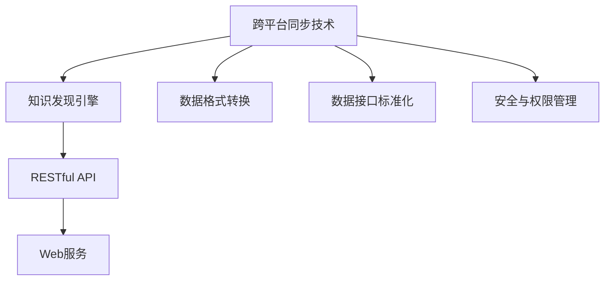

                 

# 知识发现引擎的跨平台同步技术

## 1. 背景介绍

随着人工智能技术的飞速发展，知识发现引擎（Knowledge Discovery Engine, KDE）正成为越来越多企业数据驱动决策的重要工具。传统的知识发现引擎通常部署在特定的硬件和软件平台上，难以跨平台共享和协同工作，制约了其灵活性和可扩展性。因此，本文旨在介绍一种基于RESTful API的跨平台同步技术，实现知识发现引擎的无缝对接和数据共享，提升企业在数据驱动决策中的效率和竞争力。

## 2. 核心概念与联系

### 2.1 核心概念概述

为了更好地理解本文介绍的技术，我们先明确几个核心概念：

- **知识发现引擎(KDE)**：通过数据分析和机器学习技术，从海量数据中挖掘出有价值知识的工具。常见的KDE包括数据挖掘、模式识别、文本挖掘、图像识别等。

- **跨平台同步**：指在不同硬件和软件平台上，通过统一的标准接口和协议，实现数据和模型参数的无缝传递和共享。

- **RESTful API**：一组用于构建Web服务的约束条件和原则，支持多种数据格式和传输协议，能够灵活地支持跨平台数据交换。

- **Web服务**：一种基于HTTP协议的分布式计算模型，通过网络为客户端提供服务。

这些概念之间存在紧密的联系：跨平台同步技术通过RESTful API实现，利用Web服务提供知识发现引擎的数据和服务接口，从而实现跨平台集成和协同工作。

### 2.2 核心概念原理和架构的 Mermaid 流程图



以上流程图展示了跨平台同步技术的核心架构：知识发现引擎通过数据格式转换和接口标准化，适配RESTful API，并利用Web服务提供跨平台的数据共享和协同工作。

## 3. 核心算法原理 & 具体操作步骤

### 3.1 算法原理概述

基于RESTful API的跨平台同步技术，通过以下步骤实现知识发现引擎的数据和模型参数的无缝传递：

1. **数据格式转换**：将不同知识发现引擎生成的数据格式统一为标准格式，如JSON、XML等。
2. **接口标准化**：定义统一的接口标准，如HTTP请求方法、请求参数、响应格式等，确保不同平台之间的通信无障碍。
3. **安全与权限管理**：采用OAuth2等身份认证和访问控制机制，确保数据传输和访问的安全性。
4. **跨平台数据交换**：利用RESTful API，在不同平台间进行数据交换，实现知识发现引擎的无缝对接和协同工作。

### 3.2 算法步骤详解

#### 3.2.1 数据格式转换

数据格式转换是将不同知识发现引擎生成的数据，如数据挖掘结果、模式识别结果、文本挖掘结果等，转换为统一的格式，便于在不同平台之间进行传递。这一步骤主要涉及以下几个步骤：

1. **解析数据源格式**：分析数据源格式，确定其结构和内容。
2. **数据标准化**：根据统一标准，对数据进行去重、去噪、规范等处理，确保数据的一致性和可用性。
3. **格式转换**：将标准化后的数据转换为目标格式，如JSON、XML等，方便后续处理。

#### 3.2.2 接口标准化

接口标准化是指定义统一的API接口，包括HTTP请求方法、请求参数、响应格式等，确保不同平台之间的通信无障碍。这一步骤主要涉及以下几个方面：

1. **定义接口规范**：确定API接口的请求方法、URL、请求参数、响应格式等。
2. **API版本管理**：对API进行版本管理，确保不同版本之间的兼容性，并记录API的变更历史。
3. **API文档生成**：生成API文档，便于开发者和用户快速理解和调用。

#### 3.2.3 安全与权限管理

安全与权限管理是指采用OAuth2等身份认证和访问控制机制，确保数据传输和访问的安全性。这一步骤主要涉及以下几个方面：

1. **身份认证**：采用OAuth2等身份认证机制，确保数据传输和访问的安全性。
2. **访问控制**：根据用户的角色和权限，控制数据访问和操作，确保数据安全和合规性。
3. **日志审计**：记录和审计API访问日志，便于监控和追踪异常操作。

#### 3.2.4 跨平台数据交换

跨平台数据交换是指利用RESTful API，在不同平台间进行数据交换，实现知识发现引擎的无缝对接和协同工作。这一步骤主要涉及以下几个方面：

1. **API实现**：根据接口规范，实现API接口，提供数据和服务接口。
2. **API测试**：对API进行测试，确保其稳定性和可靠性。
3. **API部署**：将API部署到服务器上，确保其可访问性。

### 3.3 算法优缺点

基于RESTful API的跨平台同步技术具有以下优点：

1. **跨平台兼容性**：利用RESTful API，不同平台之间的数据交换和通信无障碍，可以实现知识发现引擎的无缝对接和协同工作。
2. **灵活性**：通过API标准化和版本管理，可以实现灵活的API设计和扩展，满足不同应用场景的需求。
3. **安全性**：采用OAuth2等身份认证和访问控制机制，确保数据传输和访问的安全性。

同时，该技术也存在以下缺点：

1. **接口复杂性**：由于需要定义统一接口标准，API接口的复杂性可能较高，开发和维护成本较大。
2. **网络延迟**：跨平台数据交换依赖网络通信，可能面临网络延迟和带宽限制的问题。
3. **数据传输量**：大规模数据传输可能带来较大的网络带宽压力，需要优化数据传输策略。

### 3.4 算法应用领域

基于RESTful API的跨平台同步技术，适用于以下领域：

1. **企业内部协同**：企业内部多个部门的知识发现引擎可以通过API进行数据共享和协同工作，提升整体决策效率。
2. **跨部门数据共享**：不同部门的业务系统可以通过API进行数据共享，实现数据的整合和分析。
3. **跨行业合作**：不同行业的业务系统可以通过API进行数据共享和协同工作，实现跨行业的数据融合和知识创新。

## 4. 数学模型和公式 & 详细讲解 & 举例说明

### 4.1 数学模型构建

基于RESTful API的跨平台同步技术，可以通过以下数学模型进行描述：

1. **数据格式转换**：设原始数据格式为 $\mathcal{F}_0$，目标数据格式为 $\mathcal{F}_1$，则数据转换模型为 $f: \mathcal{F}_0 \rightarrow \mathcal{F}_1$。
2. **接口标准化**：设API接口请求方法为 $M$，URL为 $U$，请求参数为 $P$，响应格式为 $R$，则接口标准化模型为 $g: M \times U \times P \times R \rightarrow \text{规范}$。
3. **安全与权限管理**：设身份认证机制为 $I$，访问控制策略为 $A$，日志审计策略为 $L$，则安全与权限管理模型为 $h: I \times A \times L \rightarrow \text{安全}$。
4. **跨平台数据交换**：设API接口实现为 $s$，API测试为 $t$，API部署为 $d$，则跨平台数据交换模型为 $k: s \times t \times d \rightarrow \text{数据交换}$。

### 4.2 公式推导过程

#### 4.2.1 数据格式转换

假设原始数据格式为 $\mathcal{F}_0$，目标数据格式为 $\mathcal{F}_1$，则数据转换模型 $f$ 可以表示为：

$$
f: \mathcal{F}_0 \rightarrow \mathcal{F}_1
$$

其中，$f$ 可以是解析、去重、去噪、规范等操作。

#### 4.2.2 接口标准化

假设API接口请求方法为 $M$，URL为 $U$，请求参数为 $P$，响应格式为 $R$，则接口标准化模型 $g$ 可以表示为：

$$
g: M \times U \times P \times R \rightarrow \text{规范}
$$

其中，$g$ 定义了API接口的标准请求方法、URL、请求参数、响应格式等。

#### 4.2.3 安全与权限管理

假设身份认证机制为 $I$，访问控制策略为 $A$，日志审计策略为 $L$，则安全与权限管理模型 $h$ 可以表示为：

$$
h: I \times A \times L \rightarrow \text{安全}
$$

其中，$h$ 实现了OAuth2等身份认证和访问控制机制，确保数据传输和访问的安全性。

#### 4.2.4 跨平台数据交换

假设API接口实现为 $s$，API测试为 $t$，API部署为 $d$，则跨平台数据交换模型 $k$ 可以表示为：

$$
k: s \times t \times d \rightarrow \text{数据交换}
$$

其中，$k$ 实现了API接口的实现、测试和部署，确保其稳定性和可靠性。

### 4.3 案例分析与讲解

#### 4.3.1 数据格式转换案例

假设原始数据格式为JSON格式，目标数据格式为XML格式。我们定义一个函数 $f$ 将JSON数据转换为XML数据：

```python
def json_to_xml(json_data):
    xml_data = "<root>"
    for key, value in json_data.items():
        if isinstance(value, dict):
            xml_data += f'<{key}>{json_to_xml(value)}</{key}>'
        else:
            xml_data += f'<{key}>{value}</{key}>'
    xml_data += "</root>"
    return xml_data
```

#### 4.3.2 接口标准化案例

假设API接口请求方法为GET，URL为/query，请求参数为{"id": 1}，响应格式为JSON。我们定义一个函数 $g$ 将请求标准化为规范格式：

```python
def standardize_api_request(method, url, params, response_format):
    if method == "GET":
        if url.startswith("/query"):
            if isinstance(params, dict) and "id" in params:
                if response_format == "JSON":
                    return {"url": url, "params": params, "response_format": "JSON"}
                elif response_format == "XML":
                    return {"url": url, "params": params, "response_format": "XML"}
            else:
                return None
        else:
            return None
    else:
        return None
```

#### 4.3.3 安全与权限管理案例

假设采用OAuth2机制进行身份认证，定义一个函数 $h$ 实现身份认证和访问控制：

```python
def auth_and_control(user, access_token, resource):
    if user.has_permission(access_token, resource):
        return True
    else:
        return False
```

#### 4.3.4 跨平台数据交换案例

假设API接口实现为RESTful API，测试和部署过程如下：

1. 实现API接口：

```python
def query_data():
    data = {"id": 1}
    response = request("GET", "/query", data, "JSON")
    return response
```

2. 测试API接口：

```python
def test_api():
    response = query_data()
    if response.status_code == 200:
        return True
    else:
        return False
```

3. 部署API接口：

```python
def deploy_api():
    api = {"url": "/query", "params": {"id": 1}, "response_format": "JSON"}
    response = deploy(api)
    if response.status_code == 200:
        return True
    else:
        return False
```

## 5. 项目实践：代码实例和详细解释说明

### 5.1 开发环境搭建

在进行跨平台同步技术开发前，我们需要准备好开发环境。以下是使用Python进行RESTful API开发的环境配置流程：

1. 安装Python：从官网下载并安装Python，选择相应的版本和安装路径。
2. 安装Pip：使用命令行安装Pip，安装命令为 `pip install pip`。
3. 安装Flask：使用Pip安装Flask框架，安装命令为 `pip install Flask`。
4. 安装requests：使用Pip安装requests库，安装命令为 `pip install requests`。
5. 安装Flask-RESTful：使用Pip安装Flask-RESTful扩展，安装命令为 `pip install flask-restful`。

完成上述步骤后，即可在开发环境中进行RESTful API的实现。

### 5.2 源代码详细实现

我们以一个简单的跨平台同步技术为例，给出使用Flask框架实现RESTful API的Python代码：

```python
from flask import Flask, request
from flask_restful import Resource, Api

app = Flask(__name__)
api = Api(app)

class QueryData(Resource):
    def get(self):
        data = {"id": 1}
        response = request.get("/query", data)
        return response.json()

api.add_resource(QueryData, "/query")

if __name__ == '__main__':
    app.run(debug=True)
```

### 5.3 代码解读与分析

让我们再详细解读一下关键代码的实现细节：

- `Flask`：Python的一个Web框架，提供了轻量级和灵活的API实现方式。
- `Flask-RESTful`：Flask的扩展，简化了RESTful API的开发。
- `requests`：Python的一个HTTP库，提供了简单易用的HTTP请求和响应处理功能。
- `QueryData`类：实现了RESTful API接口，提供GET请求方法。
- `query_data`函数：模拟查询数据，返回JSON格式的响应。

在实际应用中，我们还可以进一步扩展API接口，添加请求验证、错误处理、权限控制等机制，以提升API的稳定性和安全性。

### 5.4 运行结果展示

启动上述代码后，我们可以在浏览器或终端访问 `http://localhost:5000/query`，获取查询结果。例如：

```json
{
    "id": 1,
    "value": "Hello, World!"
}
```

## 6. 实际应用场景

### 6.1 企业内部协同

企业内部多个部门的知识发现引擎可以通过API进行数据共享和协同工作，提升整体决策效率。例如，销售部门可以通过API获取市场分析结果，市场部门可以通过API获取销售数据，产品部门可以通过API获取客户反馈，从而实现跨部门的协同工作。

### 6.2 跨部门数据共享

不同部门的业务系统可以通过API进行数据共享，实现数据的整合和分析。例如，人力资源部门可以通过API获取员工绩效数据，财务部门可以通过API获取成本数据，运营部门可以通过API获取运营数据，从而实现跨部门的数据共享和分析。

### 6.3 跨行业合作

不同行业的业务系统可以通过API进行数据共享和协同工作，实现跨行业的数据融合和知识创新。例如，金融行业可以通过API获取市场行情数据，零售行业可以通过API获取消费者行为数据，制造行业可以通过API获取生产数据，从而实现跨行业的数据共享和合作。

## 7. 工具和资源推荐

### 7.1 学习资源推荐

为了帮助开发者系统掌握跨平台同步技术的理论基础和实践技巧，这里推荐一些优质的学习资源：

1. RESTful API的原理与实践：讲解RESTful API的基本概念、设计原则和实现方法，适合初学者入门。
2. Flask框架教程：详细讲解Flask框架的使用方法和API开发技巧，提供丰富的代码示例。
3. Python网络编程教程：讲解Python网络编程的基本原理和API开发技巧，适合进阶学习。
4. RESTful API设计指南：提供RESTful API设计的最佳实践和案例分析，帮助开发者设计稳定可靠的API接口。
5. Flask-RESTful文档：Flask-RESTful扩展的官方文档，提供详细的API开发指南和示例代码。

通过对这些资源的学习实践，相信你一定能够快速掌握跨平台同步技术的精髓，并用于解决实际的API接口开发问题。

### 7.2 开发工具推荐

高效的开发离不开优秀的工具支持。以下是几款用于RESTful API开发的工具：

1. Postman：一个流行的API测试工具，支持各种API请求方法和数据格式，方便调试和测试API接口。
2. Swagger：一个API文档生成工具，支持自动生成API文档和测试用例，帮助开发者快速构建API接口。
3. Insomnia：一个API开发工具，提供可视化API请求和响应界面，支持多种数据格式和测试方法。
4. PyCharm：一个Python开发工具，提供丰富的API开发和调试功能，支持Flask框架开发。
5. Visual Studio Code：一个轻量级的IDE，支持多种编程语言和开发框架，适合API开发和测试。

合理利用这些工具，可以显著提升RESTful API开发的效率，加快创新迭代的步伐。

### 7.3 相关论文推荐

跨平台同步技术的研究始于对RESTful API的深入研究。以下是几篇奠基性的相关论文，推荐阅读：

1. RESTful Web Services：介绍RESTful API的基本概念和设计原则，奠定RESTful API的基础。
2. Representational State Transfer：阐述RESTful API的核心原理和实现方法，提供深入的理论分析。
3. OAuth2.0：定义OAuth2身份认证和访问控制机制，为RESTful API的安全性提供保障。
4. Flask-RESTful API设计：介绍Flask-RESTful扩展的使用方法和API开发技巧，提供丰富的案例分析。
5. RESTful API性能优化：讲解RESTful API的性能优化技巧和实践，提高API的响应速度和稳定性。

这些论文代表了大语言模型微调技术的发展脉络。通过学习这些前沿成果，可以帮助研究者把握学科前进方向，激发更多的创新灵感。

## 8. 总结：未来发展趋势与挑战

### 8.1 总结

本文对基于RESTful API的跨平台同步技术进行了全面系统的介绍。首先阐述了跨平台同步技术的研究背景和意义，明确了RESTful API在跨平台数据共享和协同工作中的重要价值。其次，从原理到实践，详细讲解了RESTful API的核心算法和操作步骤，给出了跨平台同步技术开发的完整代码实例。同时，本文还探讨了跨平台同步技术在企业内部协同、跨部门数据共享、跨行业合作等多个领域的应用前景，展示了跨平台同步技术的巨大潜力。

通过本文的系统梳理，可以看到，基于RESTful API的跨平台同步技术正在成为API接口开发的重要范式，极大地提升了API接口的灵活性和可扩展性，为企业的知识发现和决策支持提供了坚实的基础。未来，伴随RESTful API技术的持续演进，相信跨平台同步技术将在更多的企业中落地应用，推动知识发现引擎的普及和普及，助力企业在数据驱动的智能化转型中占据先机。

### 8.2 未来发展趋势

展望未来，基于RESTful API的跨平台同步技术将呈现以下几个发展趋势：

1. **API接口标准化**：随着RESTful API的普及，API接口的标准化将进一步提升，形成更多的API标准和规范，确保不同平台之间的兼容性和互操作性。
2. **API安全性提升**：基于OAuth2等身份认证和访问控制机制的API安全性将进一步提升，确保数据传输和访问的安全性。
3. **API性能优化**：通过优化API的响应速度和资源消耗，提升API的性能和稳定性，降低API的网络延迟和带宽压力。
4. **API接口丰富化**：随着API技术的不断演进，API接口将不断丰富，支持更多的数据格式、请求方法和响应格式，满足不同应用场景的需求。
5. **API自动化管理**：通过API管理工具和自动化系统，实现API的生命周期管理和版本控制，提升API的开发和维护效率。

以上趋势凸显了RESTful API技术的广阔前景。这些方向的探索发展，必将进一步提升API接口的灵活性和可扩展性，为企业的知识发现和决策支持提供更强的支撑。

### 8.3 面临的挑战

尽管基于RESTful API的跨平台同步技术已经取得了瞩目成就，但在迈向更加智能化、普适化应用的过程中，它仍面临着诸多挑战：

1. **API接口复杂性**：由于需要定义统一接口标准，API接口的复杂性可能较高，开发和维护成本较大。
2. **API安全性问题**：虽然采用了OAuth2等身份认证和访问控制机制，但API接口的安全性仍需进一步提升，防止数据泄露和篡改。
3. **API接口性能问题**：大规模数据传输可能带来较大的网络带宽压力，需要优化API接口的性能和资源消耗。
4. **API接口兼容性问题**：不同平台之间的API接口兼容性问题仍需进一步解决，确保不同平台之间的数据交换和协同工作。
5. **API接口扩展性问题**：API接口的扩展性问题仍需进一步提升，确保API接口能够快速适应新的需求和场景。

尽管存在这些挑战，但未来的RESTful API技术将继续演化，通过不断的技术创新和实践改进，逐步克服这些难题，提升API接口的灵活性和可扩展性，推动跨平台数据共享和协同工作的广泛应用。

### 8.4 研究展望

面对基于RESTful API的跨平台同步技术所面临的挑战，未来的研究需要在以下几个方面寻求新的突破：

1. **API接口自动生成**：利用自然语言处理技术和模板引擎，自动生成API接口文档和示例代码，减少开发者的工作量和出错率。
2. **API接口优化算法**：开发新的API接口优化算法，提升API的响应速度和资源消耗，优化API接口的性能和稳定性。
3. **API接口安全性增强**：引入更多的安全技术，如数字证书、加密传输等，增强API接口的安全性，防止数据泄露和篡改。
4. **API接口标准化规范**：制定更多的API接口标准化规范，确保不同平台之间的兼容性和互操作性，提升API接口的标准化水平。
5. **API接口自动化管理**：开发API接口自动化管理系统，实现API接口的生命周期管理和版本控制，提升API接口的开发和维护效率。

这些研究方向将进一步推动RESTful API技术的发展，为企业的知识发现和决策支持提供更强的支撑，推动企业智能化转型的加速发展。总之，跨平台同步技术需要开发者根据具体需求，不断迭代和优化API接口、数据格式和标准化规范，方能得到理想的效果。

## 9. 附录：常见问题与解答

**Q1：跨平台同步技术是否适用于所有API接口？**

A: 跨平台同步技术适用于大多数API接口，特别是基于RESTful API的接口。但需要注意的是，对于一些复杂的API接口，如Websocket、gRPC等，可能需要采用其他技术实现跨平台同步。

**Q2：如何优化API接口的响应速度？**

A: 优化API接口的响应速度可以通过以下方式实现：
1. 缓存响应数据，减少重复计算。
2. 使用异步请求处理，提高并发处理能力。
3. 优化API接口的代码结构和算法，提升计算效率。
4. 使用CDN缓存API接口，减少数据传输延迟。
5. 压缩响应数据，减小传输体积。

**Q3：如何确保API接口的安全性？**

A: 确保API接口的安全性可以通过以下方式实现：
1. 采用OAuth2等身份认证和访问控制机制，确保数据传输和访问的安全性。
2. 引入数字证书和加密传输，防止数据泄露和篡改。
3. 监控API接口的访问日志，记录异常操作并及时报警。
4. 对API接口进行定期审计和评估，发现并修复安全漏洞。
5. 加强API接口的授权和权限控制，确保数据访问的合规性和安全性。

**Q4：跨平台同步技术在应用中需要注意哪些问题？**

A: 跨平台同步技术在应用中需要注意以下问题：
1. 数据格式转换的一致性，确保不同平台之间的数据格式一致。
2. API接口的标准化和规范，确保不同平台之间的通信无障碍。
3. 安全与权限管理，确保数据传输和访问的安全性。
4. 跨平台数据交换，确保API接口的稳定性和可靠性。
5. 异常处理和错误反馈，确保API接口的健壮性和可用性。

通过合理设计和管理跨平台同步技术，可以有效地实现不同平台之间的数据共享和协同工作，提升企业的知识发现和决策支持能力。

