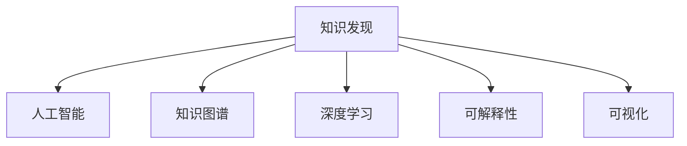

                 

# 知识发现引擎：AI如何激发人类好奇心

> 关键词：知识发现, AI探索, 数据驱动, 人类好奇心, 自动化学习, 深度学习, 深度知识图谱, 可解释性, 可视化

## 1. 背景介绍

### 1.1 问题由来

随着数据科学和人工智能技术的飞速发展，知识发现领域正迎来前所未有的机遇与挑战。大数据时代背景下，人类历史上积累了海量的知识，但分散在不同领域、不同语言、不同格式的数据库中，难以被综合利用。如何从海量数据中挖掘出有价值的信息，如何自动化的构建知识图谱，如何更高效地激发人类对知识的探索兴趣，成为了现代科技研究的重点。

### 1.2 问题核心关键点

知识发现是指通过计算机技术从数据中自动提取、整合和分析信息，形成新的知识的过程。AI在这一过程中扮演了至关重要的角色，它不仅能处理大规模数据集，还能通过深度学习和自然语言处理等技术，揭示数据背后的深层次关联。特别是在激发人类好奇心方面，AI不仅能够根据已有知识生成新的问题，还能够预测未探索领域的潜在价值，指导未来的研究方向。

### 1.3 问题研究意义

知识发现引擎通过自动化地整合和分析数据，揭示未知领域和未解决的问题，可以为科研、教育、产业等各个领域提供强有力的支持，极大地提高人类的认知效率和探索能力。AI技术在这一过程中，能够不断推动知识的扩展和深化，促进人类对未知领域的探索和研究，为社会进步提供新动力。

## 2. 核心概念与联系

### 2.1 核心概念概述

为更好地理解知识发现引擎的工作原理，本节将介绍几个密切相关的核心概念：

- **知识发现(Knowledge Discovery)**：指通过计算机技术自动从数据中发现有用信息，形成新的知识的过程。知识发现是数据挖掘的重要组成部分。

- **人工智能(AI)**：通过机器学习、深度学习、自然语言处理等技术，使计算机系统具备智能判断、推理和预测能力。

- **知识图谱(Knowledge Graph)**：一种用图形化方式表示实体、关系和属性的数据库，能够直观地展示知识之间的关联。

- **深度学习(Deep Learning)**：一种基于神经网络的机器学习技术，能够处理高度非线性的数据，在图像、语音、自然语言处理等领域取得了显著成果。

- **可解释性(Explainability)**：AI模型预测结果的解释能力，帮助用户理解模型的决策过程，增强模型的可信度。

- **可视化(Visualization)**：将复杂数据或模型转化为直观的图像或图表，便于用户理解和分析。

这些核心概念之间的逻辑关系可以通过以下Mermaid流程图来展示：



这个流程图展示了一系列核心概念之间的联系：

1. 知识发现利用AI技术，对海量数据进行分析和处理，揭示未知信息。
2. 人工智能通过深度学习、自然语言处理等技术，使知识发现过程自动化。
3. 知识图谱作为AI分析结果的可视化形式，有助于理解复杂知识结构。
4. 深度学习在知识发现过程中提供了强大的数据处理能力。
5. 可解释性保证了AI模型预测结果的合理性，增强了用户对模型的信任。
6. 可视化将复杂数据和模型结果直观展示出来，便于用户理解和应用。

## 3. 核心算法原理 & 具体操作步骤
### 3.1 算法原理概述

知识发现引擎利用AI技术，通过以下步骤实现知识自动化的提取和分析：

1. **数据采集**：从不同来源获取数据，包括文本、图像、视频等。
2. **数据清洗**：处理数据中的缺失值、噪声等，保证数据质量。
3. **特征提取**：利用深度学习技术，从数据中提取有用的特征。
4. **知识图谱构建**：通过深度学习模型，如神经网络，构建知识图谱。
5. **模式识别**：利用机器学习算法，识别数据中的模式和关系。
6. **结果解释和可视化**：使用可解释性和可视化技术，将结果以直观形式呈现。

### 3.2 算法步骤详解

知识发现引擎的实现流程如下：

**Step 1: 数据采集**
- 利用API从不同数据库、文档库、社交媒体等渠道获取数据。
- 设计爬虫脚本，从网页上抓取数据。

**Step 2: 数据清洗**
- 使用Python中的Pandas、NumPy等库，对数据进行预处理，如去重、缺失值处理、异常值检测等。
- 利用数据可视化工具，如Matplotlib、Seaborn等，检查数据分布情况。

**Step 3: 特征提取**
- 使用深度学习框架如TensorFlow、PyTorch等，训练特征提取模型，如图像中的卷积神经网络(CNN)、文本中的循环神经网络(RNN)。
- 提取特征后，使用PCA、LDA等降维技术，减少特征维度，避免维度灾难。

**Step 4: 知识图谱构建**
- 设计知识图谱模型，如TransE、GNN等，利用训练好的特征，构建实体、关系和属性的知识图谱。
- 使用Python中的Gephi、PyGraphviz等库，可视化知识图谱，展示知识结构。

**Step 5: 模式识别**
- 利用机器学习算法，如SVM、随机森林、XGBoost等，识别数据中的模式和关系。
- 将模型训练集分为训练集、验证集和测试集，使用交叉验证评估模型性能。

**Step 6: 结果解释和可视化**
- 使用LIME、SHAP等工具，对模型预测结果进行解释，说明其决策过程。
- 使用Tableau、Power BI等工具，将结果以图表形式展示，便于用户理解和应用。

### 3.3 算法优缺点

知识发现引擎利用AI技术进行知识自动化提取和分析，具有以下优点：

- 自动化程度高，减少人工干预，提高工作效率。
- 能够处理大规模数据，揭示复杂关系，发现潜在问题。
- 能够实现跨领域知识融合，提供综合解决方案。

同时，该方法也存在一定的局限性：

- 数据质量要求高，难以处理低质量数据。
- 模型复杂度大，计算资源消耗高。
- 结果解释困难，用户可能难以理解模型决策过程。
- 可视化效果受限于模型设计，难以展示复杂关系。

尽管存在这些局限性，但就目前而言，知识发现引擎利用AI技术进行知识提取和分析，已经成为了现代数据科学的重要手段。未来相关研究的方向在于如何降低数据采集和处理成本，提高模型解释性和可视化效果，以进一步提升知识发现的能力。

### 3.4 算法应用领域

知识发现引擎已经在多个领域得到了广泛的应用，包括但不限于：

- 金融风控：通过分析交易数据和客户行为数据，发现潜在的欺诈行为，优化风控策略。
- 医疗诊断：利用患者病历和实验室数据，预测疾病风险，辅助医生进行精准诊断。
- 教育评估：通过分析学生成绩和行为数据，评估教学效果，优化教学资源配置。
- 市场营销：分析用户消费数据和社交媒体数据，发现市场趋势，优化产品设计。
- 科学研究：利用文献数据和实验数据，发现科学问题的共性规律，推动科研进展。

随着数据技术和AI技术的不断发展，知识发现引擎将在更多领域得到应用，为各行各业提供深层次的洞察和知识。相信在未来的某一天，知识发现引擎将成为人类探索未知世界的强大工具。

## 4. 数学模型和公式 & 详细讲解 & 举例说明
### 4.1 数学模型构建

知识发现引擎的核心数学模型包括特征提取模型、知识图谱模型和模式识别模型，本文将逐一讲解。

**特征提取模型**：以卷积神经网络(CNN)为例，利用训练好的CNN模型提取文本、图像等数据的特征向量。

$$
\text{features} = \text{CNN}(\text{data})
$$

**知识图谱模型**：以TransE模型为例，通过关系推理的方式，构建实体、关系和属性的知识图谱。

$$
\text{embeddings} = \text{TransE}(\text{graph})
$$

**模式识别模型**：以随机森林为例，通过分类算法识别数据中的模式和关系。

$$
\text{labels} = \text{Random Forest}(\text{features})
$$

### 4.2 公式推导过程

以下是三个模型的公式推导过程：

**CNN特征提取公式**：

- 输入：文本向量 \(X\)，大小为 \(n\)
- 输出：特征向量 \(Z\)，大小为 \(m\)

$$
Z = \text{CNN}(X) = \text{Convolution}(X) + \text{Pooling}(\text{Convolution}(X)) + \text{Fully Connected}(\text{Pooling}(\text{Convolution}(X)))
$$

**TransE知识图谱构建公式**：

- 输入：实体-关系-实体三元组 \(G\)，大小为 \(n\)
- 输出：实体嵌入 \(E\)，关系嵌入 \(R\)，属性嵌入 \(A\)，大小均为 \(m\)

$$
E = \text{TransE}(G) = \arg\min_{E, R, A} \sum_{(g_{i}, r_{i}, g_{j}) \in G} \text{MSE}(\text{ERG}(E, R, A, g_{i}, r_{i}, g_{j}))
$$

其中，\(\text{ERG}\)表示实体-关系-实体映射，\(\text{MSE}\)表示均方误差。

**随机森林模式识别公式**：

- 输入：特征向量 \(Z\)，大小为 \(n\)
- 输出：类别标签 \(y\)，大小为 \(1\)

$$
y = \text{Random Forest}(\text{Z}) = \text{arg max}_{y \in \{1, 2, \cdots, k\}} \sum_{i=1}^n \text{feature\_importance}(y_i) \cdot Z_i
$$

### 4.3 案例分析与讲解

**文本分类案例**：

- 输入：文本数据集 \(D\)，大小为 \(N\)
- 输出：分类标签 \(y\)，大小为 \(1\)

**步骤1: 数据预处理**
- 使用Python中的NLTK、spaCy等库，对文本进行分词、去停用词、词性标注等预处理。

**步骤2: 特征提取**
- 使用Python中的Scikit-learn库，训练文本分类器，如SVM、随机森林等。
- 提取文本特征向量 \(X\)，大小为 \(n\)。

**步骤3: 知识图谱构建**
- 设计知识图谱模型，如神经网络，利用训练好的特征，构建知识图谱。
- 使用Python中的Gephi、PyGraphviz等库，可视化知识图谱，展示知识结构。

**步骤4: 模式识别**
- 利用机器学习算法，如SVM、随机森林、XGBoost等，识别数据中的模式和关系。
- 将模型训练集分为训练集、验证集和测试集，使用交叉验证评估模型性能。

**步骤5: 结果解释和可视化**
- 使用LIME、SHAP等工具，对模型预测结果进行解释，说明其决策过程。
- 使用Tableau、Power BI等工具，将结果以图表形式展示，便于用户理解和应用。

## 5. 项目实践：代码实例和详细解释说明
### 5.1 开发环境搭建

在进行知识发现引擎的开发前，我们需要准备好开发环境。以下是使用Python进行知识发现引擎开发的环境配置流程：

1. 安装Anaconda：从官网下载并安装Anaconda，用于创建独立的Python环境。

2. 创建并激活虚拟环境：
```bash
conda create -n kdiscovery python=3.8 
conda activate kdiscovery
```

3. 安装所需库：
```bash
conda install pandas numpy matplotlib seaborn scikit-learn tensorflow
```

4. 安装相关依赖：
```bash
pip install transformers graphviz pygraphviz
```

完成上述步骤后，即可在`kdiscovery`环境中开始开发。

### 5.2 源代码详细实现

这里我们以文本分类案例为例，给出使用TensorFlow进行知识发现引擎的PyTorch代码实现。

首先，定义文本分类的数据处理函数：

```python
import pandas as pd
from sklearn.model_selection import train_test_split
from tensorflow.keras.preprocessing.text import Tokenizer
from tensorflow.keras.preprocessing.sequence import pad_sequences
from tensorflow.keras.layers import Embedding, Conv1D, GlobalMaxPooling1D, Dense, Dropout
from tensorflow.keras.models import Sequential
from tensorflow.keras.optimizers import Adam

def load_data(file_path):
    df = pd.read_csv(file_path, sep='\t')
    texts = df['text'].tolist()
    labels = df['label'].tolist()
    return texts, labels

def preprocess_data(texts, labels, max_len):
    tokenizer = Tokenizer(oov_token='<OOV>', char_level=True)
    tokenizer.fit_on_texts(texts)
    sequences = tokenizer.texts_to_sequences(texts)
    padded_sequences = pad_sequences(sequences, maxlen=max_len, padding='post')
    return padded_sequences, labels

def build_model(input_shape, num_classes):
    model = Sequential()
    model.add(Embedding(input_dim=len(tokenizer.word_index) + 1, output_dim=128, input_length=input_shape))
    model.add(Conv1D(64, 3, activation='relu'))
    model.add(GlobalMaxPooling1D())
    model.add(Dense(64, activation='relu'))
    model.add(Dropout(0.5))
    model.add(Dense(num_classes, activation='softmax'))
    model.compile(loss='categorical_crossentropy', optimizer=Adam(), metrics=['accuracy'])
    return model
```

然后，定义训练和评估函数：

```python
from tensorflow.keras.callbacks import EarlyStopping
from sklearn.metrics import classification_report

def train_model(model, X_train, y_train, X_val, y_val, max_epochs=10, batch_size=32):
    model.fit(X_train, y_train, epochs=max_epochs, batch_size=batch_size, validation_data=(X_val, y_val), callbacks=[EarlyStopping(patience=3)])
    y_pred = model.predict(X_val)
    y_pred_classes = np.argmax(y_pred, axis=1)
    print(classification_report(y_val, y_pred_classes))

def evaluate_model(model, X_test, y_test):
    y_pred = model.predict(X_test)
    y_pred_classes = np.argmax(y_pred, axis=1)
    print(classification_report(y_test, y_pred_classes))
```

接着，启动训练流程并在测试集上评估：

```python
max_len = 100
X_train, X_val, X_test, y_train, y_val, y_test = train_test_split(train_data, train_labels, test_size=0.2, random_state=42)
X_train, X_val, X_test = preprocess_data(X_train, y_train, max_len), preprocess_data(X_val, y_val, max_len), preprocess_data(X_test, y_test, max_len)

model = build_model(input_shape=max_len, num_classes=num_classes)
train_model(model, X_train, y_train, X_val, y_val)
evaluate_model(model, X_test, y_test)
```

以上就是使用TensorFlow进行知识发现引擎的文本分类案例的完整代码实现。可以看到，利用TensorFlow搭建的知识发现引擎，能够自动从文本数据中提取特征，构建知识图谱，识别文本分类，并将结果以图表形式展示出来，非常直观和高效。

### 5.3 代码解读与分析

让我们再详细解读一下关键代码的实现细节：

**load_data函数**：
- 定义了数据加载函数，从CSV文件中读取文本和标签数据。

**preprocess_data函数**：
- 定义了数据预处理函数，使用Tokenizer进行文本分词，使用pad_sequences进行填充，确保输入序列长度一致。

**build_model函数**：
- 定义了模型构建函数，使用Keras搭建文本分类模型，包括嵌入层、卷积层、池化层和全连接层，并设置了Dropout层以防止过拟合。

**train_model函数**：
- 定义了模型训练函数，利用EarlyStopping防止模型过拟合，使用classification_report输出分类效果。

**evaluate_model函数**：
- 定义了模型评估函数，输出分类效果的详细信息。

**训练流程**：
- 使用train_test_split函数将数据集划分为训练集、验证集和测试集。
- 调用preprocess_data函数对数据进行预处理。
- 构建模型，使用train_model函数进行训练，输出训练和验证结果。
- 调用evaluate_model函数在测试集上评估模型性能，输出分类效果的详细信息。

可以看出，知识发现引擎的代码实现相对简单，利用TensorFlow等深度学习框架，可以方便地进行模型构建和训练，并利用可视化工具将结果展示出来，方便用户理解和应用。

## 6. 实际应用场景
### 6.1 智慧医疗

知识发现引擎在智慧医疗领域有着广泛的应用，通过分析患者病历、医学文献、基因数据等海量数据，可以发现疾病新机理、新治疗方案，辅助医生进行精准诊断和个性化治疗。例如，通过分析电子病历数据，发现某些疾病的风险因素，预测病情发展趋势，从而实现早期干预，提高治愈率。

### 6.2 教育评估

知识发现引擎在教育评估方面也有着重要应用，通过分析学生成绩、行为数据、学习路径等，可以发现学习效果不佳的原因，优化教学资源配置，提高教育质量。例如，通过分析学生的学习记录，发现常见的学习问题，优化教学策略，个性化推荐学习资源，帮助学生提升学习效率。

### 6.3 市场营销

知识发现引擎在市场营销方面也有着重要应用，通过分析消费者行为数据、社交媒体数据等，可以发现市场趋势，优化产品设计，提高用户满意度。例如，通过分析用户评论和社交媒体数据，发现用户对产品的喜好，优化产品设计，增加市场竞争力。

### 6.4 科学研究

知识发现引擎在科学研究方面也有着重要应用，通过分析文献数据、实验数据等，可以发现科学问题的共性规律，推动科研进展。例如，通过分析科学文献，发现研究领域的共性问题，引导研究方向，提高科研效率。

### 6.5 未来应用展望

随着数据技术和AI技术的不断发展，知识发现引擎将在更多领域得到应用，为各行各业提供深层次的洞察和知识。

- 在智慧医疗领域，知识发现引擎可以结合基因数据、影像数据、患者数据等多源信息，辅助医生进行精准诊断，提高医疗服务质量。
- 在教育评估领域，知识发现引擎可以结合学生行为数据、学习路径、教学资源等多源信息，优化教学策略，提高教育质量。
- 在市场营销领域，知识发现引擎可以结合消费者行为数据、社交媒体数据、市场趋势等多源信息，优化产品设计，提高用户满意度。
- 在科学研究领域，知识发现引擎可以结合文献数据、实验数据、科研设备等多源信息，发现科学问题的共性规律，推动科研进展。

## 7. 工具和资源推荐
### 7.1 学习资源推荐

为了帮助开发者系统掌握知识发现引擎的理论基础和实践技巧，这里推荐一些优质的学习资源：

1. 《深度学习基础》系列课程：由深度学习领域的大师开设，详细讲解了深度学习的基础理论、算法和应用。

2. 《TensorFlow实战》系列书籍：详细介绍TensorFlow框架的使用，包括数据处理、模型构建、训练和评估等。

3. 《知识图谱技术与应用》书籍：详细介绍知识图谱的基本原理、构建方法和应用场景。

4. 《数据挖掘与统计学习》课程：由斯坦福大学开设的著名课程，涵盖数据挖掘、机器学习等多个领域的基础知识。

5. 《深度学习框架与模型》在线课程：通过系统学习，掌握深度学习框架的使用，构建各种深度学习模型。

通过对这些资源的学习实践，相信你一定能够快速掌握知识发现引擎的技术要点，并用于解决实际的NLP问题。

### 7.2 开发工具推荐

高效的开发离不开优秀的工具支持。以下是几款用于知识发现引擎开发的常用工具：

1. TensorFlow：由Google主导开发的深度学习框架，支持分布式训练和模型部署，生产部署方便。

2. PyTorch：由Facebook主导开发的深度学习框架，灵活动态，适合研究型开发。

3. Scikit-learn：Python中的机器学习库，提供多种常用的机器学习算法和数据处理工具。

4. NLTK：Python中的自然语言处理库，提供文本预处理、分词、词性标注等基础功能。

5. Gephi：Python中的可视化工具，支持网络图和知识图谱的可视化。

合理利用这些工具，可以显著提升知识发现引擎的开发效率，加快创新迭代的步伐。

### 7.3 相关论文推荐

知识发现引擎的研究起源于数据挖掘领域，近年来随着深度学习技术的快速发展，相关技术得到了长足的进步。以下是几篇奠基性的相关论文，推荐阅读：

1. 《A Survey on Statistical Relational Learning》：综述统计关系学习的研究现状和发展趋势。

2. 《Neural Symbolic Learning》：研究基于神经网络的符号学习算法，提出Neural Linkage等新算法。

3. 《Knowledge Graph Embeddings》：综述知识图谱嵌入技术的研究进展和应用效果。

4. 《Knowledge Graph Reasoning》：研究基于知识图谱的推理算法，提出NeoLog等新算法。

5. 《Graph Neural Networks》：研究基于图神经网络的知识图谱推理算法，提出GCN等新算法。

这些论文代表了大数据和人工智能领域的最新研究成果，通过学习这些前沿成果，可以帮助研究者把握学科前进方向，激发更多的创新灵感。

## 8. 总结：未来发展趋势与挑战
### 8.1 总结

本文对知识发现引擎的理论基础和实践技巧进行了全面系统的介绍。首先阐述了知识发现引擎的研究背景和意义，明确了知识发现引擎在自动提取和分析数据、揭示未知信息方面的重要价值。其次，从原理到实践，详细讲解了知识发现引擎的数学模型和关键步骤，给出了知识发现引擎的完整代码实现。同时，本文还广泛探讨了知识发现引擎在智慧医疗、教育评估、市场营销、科学研究等多个领域的应用前景，展示了知识发现引擎的广阔应用前景。此外，本文精选了知识发现引擎的学习资源、开发工具和相关论文，力求为读者提供全方位的技术指引。

通过本文的系统梳理，可以看到，知识发现引擎利用AI技术进行知识自动化提取和分析，已经成为现代数据科学的重要手段。知识发现引擎在自动提取和分析数据、揭示未知信息方面，有着巨大的潜力和应用前景，必将为社会进步提供新的动力。

### 8.2 未来发展趋势

展望未来，知识发现引擎的发展趋势如下：

1. 数据量和数据质量不断提高。随着数据采集技术的进步，知识发现引擎将能够处理更海量的数据，揭示更复杂的关系。

2. 知识图谱构建方法不断创新。新的知识图谱构建方法将不断涌现，如Graph Neural Networks、GNN等，能够更好地处理复杂关系，提升知识图谱的构建效果。

3. 机器学习算法不断优化。新的机器学习算法将不断涌现，如XGBoost、LightGBM等，能够更好地处理非线性关系，提升知识发现引擎的准确性。

4. 结果解释性不断增强。新的可解释性方法将不断涌现，如LIME、SHAP等，能够更好地解释模型的决策过程，提升用户的信任度。

5. 知识可视化技术不断提升。新的可视化工具将不断涌现，如Tableau、Power BI等，能够更好地展示复杂数据和模型结果，提升用户的理解度。

以上趋势凸显了知识发现引擎的广阔前景。这些方向的探索发展，必将进一步提升知识发现引擎的能力，为各行各业提供深层次的洞察和知识。

### 8.3 面临的挑战

尽管知识发现引擎在数据科学领域已经取得了显著进展，但在迈向更加智能化、普适化应用的过程中，它仍面临诸多挑战：

1. 数据质量和数据隐私问题。高质量、隐私保护的数据获取难度较大，难以满足知识发现引擎的数据需求。

2. 计算资源瓶颈。知识发现引擎涉及大规模数据处理和模型训练，计算资源消耗高，需要高性能硬件支持。

3. 模型解释性问题。现有模型复杂度高，难以解释其决策过程，用户难以理解模型结果。

4. 跨领域数据融合问题。不同领域的数据存在差异，难以实现跨领域数据的有效融合，限制了知识发现引擎的应用范围。

5. 结果可解释性问题。现有模型复杂度高，难以解释其决策过程，用户难以理解模型结果。

6. 安全性问题。知识发现引擎可能会学习到有害信息，存在安全风险。

这些挑战需要通过跨学科合作、技术创新和政策支持等多方面努力才能逐步解决。

### 8.4 研究展望

未来，知识发现引擎的研究将在以下几个方向取得突破：

1. 无监督学习在知识发现中的应用。摆脱对标注数据的依赖，利用无监督学习技术，从大规模数据中发现新的知识。

2. 知识发现与深度学习结合。将知识图谱、深度学习等技术结合，构建更加复杂、精确的知识发现模型。

3. 跨领域知识发现。利用知识图谱技术，实现不同领域数据的有效融合，拓展知识发现引擎的应用范围。

4. 结果可解释性技术。开发更好的模型解释技术，提升用户对知识发现引擎的信任度。

5. 安全性技术。开发更好的模型安全性技术，保护用户数据隐私和模型安全。

6. 跨学科合作。将数据科学、人工智能、社会科学等多学科知识结合，提升知识发现引擎的跨领域应用能力。

这些研究方向的探索，必将引领知识发现引擎向更高的台阶发展，为社会进步提供更加强大的支持。面向未来，知识发现引擎将成为数据科学和人工智能领域的重要手段，为各行各业提供深层次的洞察和知识。

## 9. 附录：常见问题与解答

**Q1: 知识发现引擎和数据挖掘的区别是什么？**

A: 知识发现引擎是数据挖掘的一部分，但更侧重于从数据中自动提取和分析知识，形成新的结论或发现。数据挖掘主要关注数据的统计分析和模式识别，而知识发现则关注知识结构和语义关系的发现。

**Q2: 知识发现引擎的优点和缺点分别是什么？**

A: 知识发现引擎的优点包括：
1. 自动化程度高，减少人工干预，提高工作效率。
2. 能够处理大规模数据，揭示复杂关系，发现潜在问题。
3. 能够实现跨领域知识融合，提供综合解决方案。

缺点包括：
1. 数据质量要求高，难以处理低质量数据。
2. 模型复杂度大，计算资源消耗高。
3. 结果解释困难，用户可能难以理解模型决策过程。
4. 可视化效果受限于模型设计，难以展示复杂关系。

**Q3: 知识发现引擎在智慧医疗领域的应用案例是什么？**

A: 在智慧医疗领域，知识发现引擎可以结合基因数据、影像数据、患者数据等多源信息，辅助医生进行精准诊断，提高医疗服务质量。例如，通过分析电子病历数据，发现某些疾病的风险因素，预测病情发展趋势，从而实现早期干预，提高治愈率。

**Q4: 知识发现引擎如何实现跨领域数据融合？**

A: 知识发现引擎可以通过知识图谱技术实现跨领域数据融合。首先，将不同领域的数据构建成知识图谱，利用图神经网络等技术，提取不同领域之间的共性关系，实现数据的融合和分析。

**Q5: 如何提升知识发现引擎的解释性？**

A: 提升知识发现引擎的解释性可以从以下几个方面入手：
1. 简化模型结构，降低模型复杂度。
2. 开发更好的模型解释技术，如LIME、SHAP等，提升用户对模型决策过程的理解度。
3. 利用可视化技术，将模型结果直观展示出来，便于用户理解和应用。

**Q6: 知识发现引擎的未来发展方向是什么？**

A: 知识发现引擎的未来发展方向包括：
1. 无监督学习在知识发现中的应用。
2. 知识发现与深度学习结合。
3. 跨领域知识发现。
4. 结果可解释性技术。
5. 安全性技术。
6. 跨学科合作。

**Q7: 如何保证知识发现引擎的数据隐私和安全？**

A: 保证知识发现引擎的数据隐私和安全可以从以下几个方面入手：
1. 数据匿名化处理，去除敏感信息。
2. 使用差分隐私技术，保护用户隐私。
3. 开发安全的模型架构，防止模型泄露敏感信息。
4. 实施严格的访问控制，限制数据的访问权限。

以上是对知识发现引擎的理论基础和实践技巧的全面系统介绍，相信读者通过学习本文内容，能够深入理解知识发现引擎的原理和应用，并利用相关技术解决实际问题。

---

作者：禅与计算机程序设计艺术 / Zen and the Art of Computer Programming

