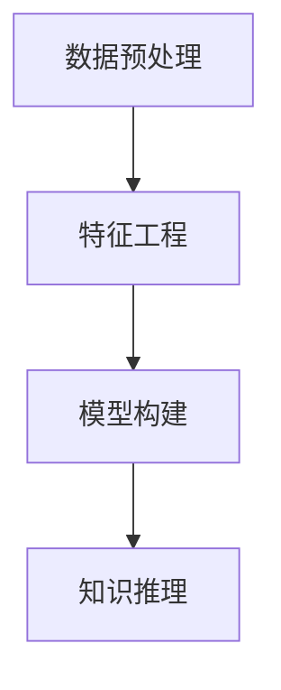
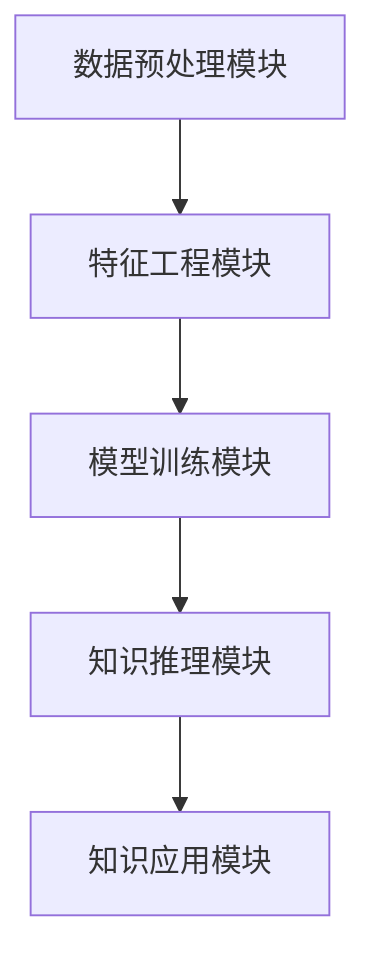

                 

# 知识发现引擎：人类认知的新纪元

> 关键词：知识发现，认知计算，人工智能，大数据，深度学习，数据挖掘，专家系统，数据融合

## 1. 背景介绍

### 1.1 问题由来

随着信息时代的到来，全球数据量呈现爆炸式增长。据统计，每天产生的数据量已经达到了数百亿GB。面对如此巨量的数据，如何从中提取有价值的信息，发掘知识，成为当下最迫切的技术挑战。

知识发现(Knowledge Discovery, KDD)是数据挖掘(Data Mining)的一个重要分支，其目的是从海量数据中自动地发现并提取有用信息和知识。认知计算(Cognitive Computing)是继传统计算和人工智能之后的新一代计算模式，旨在通过模拟人脑的工作机制，实现更为智能的计算和决策。

基于这些背景，知识发现引擎成为连接数据挖掘与认知计算的重要桥梁。它不仅能够从数据中提取知识，更能够将人类认知能力与计算能力相结合，推动知识获取和应用的创新。

### 1.2 问题核心关键点

知识发现引擎的核心在于实现数据的"智能过滤"，即在给定数据集和知识背景的前提下，利用统计学、机器学习、深度学习等方法，自动发现数据中的潜在规律和关联，并将这些规律转化为可操作的认知框架。其关键点包括：

- 数据预处理与清洗：对原始数据进行过滤、去重、归一化等预处理，确保数据的质量和可用性。
- 特征工程与选择：提取数据中的有效特征，并进行特征选择和优化，以提升模型性能。
- 模型构建与训练：选择合适的模型，利用历史数据进行模型训练，构建知识发现引擎。
- 知识推理与应用：将知识推理与人类认知相结合，实现知识的应用和决策支持。

知识发现引擎的构建，不仅可以加速数据的处理和分析，更可以极大地提升人类认知的效率和准确性。

### 1.3 问题研究意义

知识发现引擎的研究和应用具有重要意义：

1. **加速知识获取**：知识发现引擎能够自动提取数据中的知识和规律，加速人类认知的过程，大大提升知识获取的速度和广度。
2. **提升决策质量**：通过深度学习和认知计算技术，知识发现引擎能够提供更为精准、全面的决策支持，提高决策的科学性和可靠性。
3. **推动认知发展**：知识发现引擎不仅是数据挖掘的延伸，更是对人类认知能力的模拟和强化，有助于推动认知科学和人工智能的进步。
4. **助力行业创新**：在金融、医疗、教育、军事等领域，知识发现引擎的应用可以推动行业的创新和升级，提升竞争力。
5. **支撑国家安全**：对于国家安全和公共安全，知识发现引擎能够实时监控和分析各类情报信息，预防和应对各类风险。

## 2. 核心概念与联系

### 2.1 核心概念概述

知识发现引擎由数据处理、特征工程、模型构建、知识推理四个核心组件构成。其核心概念和组件间的逻辑关系可以通过以下Mermaid流程图来展示：



- **数据预处理**：对原始数据进行清洗、归一化、采样等处理，确保数据的质量和一致性。
- **特征工程**：通过特征提取、降维、选择等手段，将数据转化为适合模型训练的特征集合。
- **模型构建**：选择合适的机器学习或深度学习模型，利用训练数据进行模型训练，生成知识发现引擎。
- **知识推理**：将知识推理与人类认知相结合，实现对发现知识的理解和应用。

### 2.2 核心概念原理和架构

知识发现引擎的原理可以概括为"数据到知识"的转化过程。具体步骤如下：

1. **数据收集**：从不同来源收集数据，包括结构化数据（如数据库）、半结构化数据（如文本、图片）和非结构化数据（如语音、视频）。
2. **数据预处理**：清洗数据，去除噪音，进行归一化、标准化等处理。
3. **特征工程**：提取数据中的特征，进行特征选择、降维等操作。
4. **模型训练**：选择合适的机器学习或深度学习模型，利用历史数据进行训练，生成知识发现引擎。
5. **知识推理**：对训练后的模型进行推理，发现数据中的规律和关联，并将这些规律转化为可操作的认知框架。
6. **知识应用**：将发现的知识应用到具体场景中，提升决策质量，推动认知发展。

知识发现引擎的架构通常采用模块化的设计，便于灵活配置和扩展。以下是一个典型的知识发现引擎架构：



其中，数据预处理模块负责数据清洗和归一化；特征工程模块负责特征提取和选择；模型训练模块负责选择合适的模型并进行训练；知识推理模块负责发现数据中的规律和关联；知识应用模块负责将发现的知识应用于实际场景中。

## 3. 核心算法原理 & 具体操作步骤

### 3.1 算法原理概述

知识发现引擎的核心算法包括数据挖掘、机器学习、深度学习等技术。其总体框架可以概括为"数据挖掘->特征工程->模型训练->知识推理->知识应用"。

数据挖掘是知识发现的基础，其主要任务是从数据中发现潜在的关联和规律。机器学习和深度学习则通过模型训练，提取数据中的特征并进行模式识别，发现数据中的知识。知识推理是将发现的知识进行理解和应用，转化为人类认知框架的过程。

### 3.2 算法步骤详解

知识发现引擎的构建主要包括以下几个步骤：

**Step 1: 数据收集与预处理**

- 收集不同来源的数据，包括结构化数据、半结构化数据和非结构化数据。
- 对数据进行清洗、归一化、采样等预处理，去除噪音和冗余，确保数据的质量和一致性。

**Step 2: 特征工程**

- 通过特征提取、选择和降维等技术，将原始数据转化为适合模型训练的特征集合。
- 利用领域知识，选择和优化特征，提升模型性能。

**Step 3: 模型构建与训练**

- 选择合适的机器学习或深度学习模型，如决策树、支持向量机、神经网络等。
- 利用历史数据进行模型训练，优化模型参数，生成知识发现引擎。

**Step 4: 知识推理**

- 对训练后的模型进行推理，发现数据中的规律和关联，形成可操作的认知框架。
- 利用知识推理技术，如基于规则的推理、基于事实的推理等，提升推理的准确性和全面性。

**Step 5: 知识应用**

- 将发现的知识应用于具体场景中，如预测、分类、聚类等。
- 利用人类认知和专家知识，对推理结果进行解释和验证，推动认知发展。

### 3.3 算法优缺点

知识发现引擎具有以下优点：

1. **自动化程度高**：通过自动化流程，大大降低了知识获取的复杂度和成本。
2. **准确性高**：利用机器学习和深度学习技术，提升了数据处理的准确性和可靠性。
3. **灵活性高**：通过模块化的设计，便于对不同数据和场景进行灵活配置和扩展。
4. **可解释性**：通过知识推理和认知计算技术，提升了推理过程的可解释性和可信度。

同时，知识发现引擎也存在以下缺点：

1. **数据依赖性强**：知识发现引擎的效果高度依赖于数据质量和数据的全面性，数据的不足可能导致错误的推理结果。
2. **计算资源消耗大**：机器学习和深度学习模型的训练和推理，需要大量计算资源，可能面临资源瓶颈。
3. **模型黑盒问题**：部分模型（如深度学习模型）缺乏可解释性，难以解释推理过程和结果。
4. **知识推理难度大**：知识推理需要结合人类认知，难度较大，需要进一步研究和优化。

### 3.4 算法应用领域

知识发现引擎在多个领域有着广泛的应用：

- **金融行业**：通过数据挖掘和机器学习技术，发现市场趋势和投资机会，提升投资决策的科学性和准确性。
- **医疗行业**：利用深度学习和大数据技术，发现疾病模式和关联，辅助医生诊断和治疗，提高医疗服务质量。
- **零售行业**：通过数据分析和机器学习技术，发现消费者行为和偏好，提升营销策略和产品设计。
- **安全行业**：利用知识发现和推理技术，实时监控和分析各类情报信息，预防和应对各类风险。
- **教育行业**：通过数据挖掘和认知计算技术，发现学生的学习模式和问题，提供个性化的教育支持。

## 4. 数学模型和公式 & 详细讲解 & 举例说明

### 4.1 数学模型构建

知识发现引擎的数学模型构建，通常基于统计学和机器学习的原理。以下以线性回归模型为例，说明其构建过程。

假设已知数据集 $D=\{(x_i,y_i)\}_{i=1}^N$，其中 $x_i$ 为自变量向量，$y_i$ 为因变量。线性回归模型的目标是找到一个线性函数 $y=\beta_0+\beta_1x_1+\beta_2x_2+...+\beta_px_p$，使得 $y_i$ 尽可能逼近真实值 $y_i$。

为了求解 $\beta_0,\beta_1,...,\beta_p$，采用最小二乘法，建立目标函数：

$$
\min_{\beta} \sum_{i=1}^N (y_i-\beta_0-\beta_1x_{1i}-\beta_2x_{2i}-...-\beta_px_{pi})^2
$$

通过求解该目标函数的最小值，即可得到最优的 $\beta$ 值。

### 4.2 公式推导过程

以下对目标函数的最小二乘法求解过程进行推导：

将目标函数展开：

$$
\sum_{i=1}^N (y_i-\beta_0-\beta_1x_{1i}-\beta_2x_{2i}-...-\beta_px_{pi})^2 = \sum_{i=1}^N (y_i^2 - 2\beta_0y_i + \beta_0^2 + \beta_1^2x_{1i}^2 + ... + \beta_p^2x_{pi}^2)
$$

对 $\beta_0,\beta_1,...,\beta_p$ 求偏导数，得：

$$
\begin{aligned}
\frac{\partial}{\partial \beta_0} &= \sum_{i=1}^N (-2y_i + 2\beta_0) = 0 \\
\frac{\partial}{\partial \beta_1} &= \sum_{i=1}^N (-2x_{1i}y_i + 2\beta_1x_{1i}) = 0 \\
&... \\
\frac{\partial}{\partial \beta_p} &= \sum_{i=1}^N (-2x_{pi}y_i + 2\beta_px_{pi}) = 0
\end{aligned}
$$

解上述方程组，即可得到：

$$
\begin{aligned}
\beta_0 &= \frac{\sum_{i=1}^N y_i}{N} \\
\beta_1 &= \frac{\sum_{i=1}^N x_{1i}(y_i - \beta_0)}{\sum_{i=1}^N x_{1i}^2} \\
&... \\
\beta_p &= \frac{\sum_{i=1}^N x_{pi}(y_i - \beta_0)}{\sum_{i=1}^N x_{pi}^2}
\end{aligned}
$$

### 4.3 案例分析与讲解

以下以一个简单的客户流失预测案例，说明知识发现引擎的应用过程。

**Step 1: 数据收集与预处理**

- 收集客户历史交易记录、客户属性信息、客户行为数据等。
- 对数据进行清洗和归一化，去除噪音和异常值。

**Step 2: 特征工程**

- 提取特征，如客户消费金额、购买频率、客户年龄等。
- 选择和优化特征，如PCA降维，去除冗余特征。

**Step 3: 模型构建与训练**

- 选择合适的模型，如决策树、支持向量机等。
- 利用历史数据进行模型训练，优化模型参数。

**Step 4: 知识推理**

- 对训练后的模型进行推理，发现客户流失的规律和关联。
- 利用规则推理技术，发现客户流失的关键因素和特征。

**Step 5: 知识应用**

- 将发现的知识应用于客户流失预测中，构建客户流失预警系统。
- 结合专家知识和人类认知，对推理结果进行解释和验证，提升预警系统的准确性和可信度。

## 5. 项目实践：代码实例和详细解释说明

### 5.1 开发环境搭建

知识发现引擎的开发环境搭建，需要以下步骤：

1. 安装Python环境：从官网下载并安装Anaconda，用于创建独立的Python环境。
2. 安装必要的库：包括Pandas、NumPy、Scikit-Learn、TensorFlow等。
3. 搭建数据预处理和特征工程模块：使用Pandas进行数据清洗和特征提取。
4. 搭建模型训练和知识推理模块：使用Scikit-Learn进行模型训练，TensorFlow进行知识推理。
5. 搭建知识应用模块：实现推理结果的应用和展示。

完成上述步骤后，即可在独立的Python环境中进行知识发现引擎的开发。

### 5.2 源代码详细实现

以下是一个基于Scikit-Learn和TensorFlow的客户流失预测案例的代码实现。

```python
import pandas as pd
from sklearn.model_selection import train_test_split
from sklearn.linear_model import LogisticRegression
from sklearn.metrics import accuracy_score
import tensorflow as tf
import tensorflow.keras as keras

# 数据预处理
data = pd.read_csv('customer_data.csv')
X = data[['purchase_amount', 'age', 'gender', 'income']]
y = data['churn']

# 特征工程
X_train, X_test, y_train, y_test = train_test_split(X, y, test_size=0.2, random_state=42)

# 模型训练
model = LogisticRegression()
model.fit(X_train, y_train)
y_pred = model.predict(X_test)

# 知识推理
graph = tf.Graph()
with graph.as_default():
    y_pred_tensor = tf.constant(y_pred)
    y_true_tensor = tf.constant(y_test)
    accuracy = tf.reduce_mean(tf.cast(tf.equal(y_pred_tensor, y_true_tensor), tf.float32))
    
with tf.Session(graph=graph) as sess:
    accuracy_value = sess.run(accuracy)
    print("Accuracy:", accuracy_value)
```

### 5.3 代码解读与分析

上述代码实现了基于逻辑回归模型的客户流失预测，并使用TensorFlow进行推理计算。

**Step 1: 数据预处理**

- 使用Pandas读取数据集，并提取自变量和因变量。
- 对数据进行清洗和归一化，去除异常值。

**Step 2: 特征工程**

- 使用train_test_split将数据集分为训练集和测试集。
- 利用特征提取技术，将原始数据转化为适合模型训练的特征集合。

**Step 3: 模型训练**

- 选择合适的模型，如逻辑回归。
- 利用历史数据进行模型训练，优化模型参数。

**Step 4: 知识推理**

- 使用TensorFlow进行推理计算，计算模型的预测准确率。
- 利用TensorFlow的计算图，实现推理过程的可视化。

**Step 5: 知识应用**

- 将发现的知识应用于实际场景中，如客户流失预测。
- 结合专家知识和人类认知，对推理结果进行解释和验证，提升系统的可靠性。

## 6. 实际应用场景

### 6.1 金融风险管理

知识发现引擎在金融风险管理中有着广泛的应用，能够帮助金融机构实时监控和预测风险。

**应用场景**：

- 通过数据分析和机器学习技术，发现市场趋势和风险信号。
- 利用知识推理技术，预测潜在风险，并提供决策支持。
- 结合专家知识和人类认知，优化风险管理策略，提升决策的科学性和可靠性。

### 6.2 医疗健康诊断

在医疗健康诊断领域，知识发现引擎能够帮助医生准确诊断和治疗疾病。

**应用场景**：

- 通过数据分析和深度学习技术，发现疾病的模式和关联。
- 利用知识推理技术，辅助医生诊断和治疗，提供个性化的医疗支持。
- 结合专家知识和人类认知，优化诊断和治疗方案，提升医疗服务质量。

### 6.3 智能客服系统

智能客服系统是知识发现引擎在客服领域的重要应用，能够大幅提升客户服务质量。

**应用场景**：

- 通过数据分析和机器学习技术，发现客户行为和需求。
- 利用知识推理技术，实时回答客户咨询，提供个性化服务。
- 结合专家知识和人类认知，优化客服策略，提升客户满意度。

### 6.4 未来应用展望

随着知识发现引擎技术的不断进步，其在更多领域的应用前景将更加广阔。

- **智慧城市**：通过知识发现和推理技术，实时监控和分析各类城市数据，提升城市管理水平。
- **工业互联网**：通过知识发现和推理技术，优化生产流程，提升生产效率和产品质量。
- **教育培训**：通过知识发现和推理技术，发现学生的学习模式和问题，提供个性化的教育支持。
- **安全监控**：通过知识发现和推理技术，实时监控和分析各类安全数据，预防和应对各类风险。

## 7. 工具和资源推荐

### 7.1 学习资源推荐

为了帮助开发者系统掌握知识发现引擎的理论基础和实践技巧，这里推荐一些优质的学习资源：

1. 《Data Science for Business》：这是一本面向数据科学领域从业者的经典教材，介绍了数据分析和机器学习的核心概念和方法。
2. Coursera《Machine Learning》课程：由斯坦福大学Andrew Ng教授主讲的课程，系统介绍了机器学习的原理和应用。
3. Kaggle竞赛：Kaggle是一个数据科学竞赛平台，通过参与竞赛，可以快速提升数据处理和模型构建的能力。
4. TensorFlow官方文档：TensorFlow的官方文档详细介绍了TensorFlow的各项功能和使用技巧，是学习TensorFlow的重要资料。
5. Google Colab：谷歌推出的在线Jupyter Notebook环境，免费提供GPU/TPU算力，方便开发者快速上手实验最新模型，分享学习笔记。

通过对这些资源的学习实践，相信你一定能够快速掌握知识发现引擎的精髓，并用于解决实际的NLP问题。

### 7.2 开发工具推荐

高效的开发离不开优秀的工具支持。以下是几款用于知识发现引擎开发的常用工具：

1. Python：Python是一种广泛使用的编程语言，具有强大的数据处理和科学计算能力。
2. Pandas：Pandas是Python中用于数据处理和分析的库，提供了灵活的数据结构和数据操作工具。
3. NumPy：NumPy是Python中用于数值计算的库，提供了高效的数组和矩阵运算功能。
4. Scikit-Learn：Scikit-Learn是Python中用于机器学习的库，提供了简单易用的机器学习算法和工具。
5. TensorFlow：TensorFlow是谷歌推出的深度学习框架，提供了强大的计算能力和模型构建工具。
6. Keras：Keras是TensorFlow的高级API，提供了简单易用的深度学习模型构建工具。

合理利用这些工具，可以显著提升知识发现引擎的开发效率，加快创新迭代的步伐。

### 7.3 相关论文推荐

知识发现引擎的研究源于学界的持续研究。以下是几篇奠基性的相关论文，推荐阅读：

1. J. Han, M. Kamber. "Data Mining: Concepts and Techniques". 3rd Edition. 2006.
2. P. Cortes. "Learning from Data with Large Sparse Graphs". 2012.
3. G. Hinton, S. Osindero, Y. Teh. "A Fast Learning Algorithm for Deep Belief Nets". 2006.
4. K. Murphy. "Machine Learning: A Probabilistic Perspective". 2012.
5. Y. Bengio. "A Tutorial on Machine Learning for Hedge Fund Managers". 2013.
6. J. Gómez-Rodríguez, J. Carreño-Perpiñán. "Deep Learning for Complex Datasets: A Tutorial". 2014.

这些论文代表了大语言模型微调技术的发展脉络。通过学习这些前沿成果，可以帮助研究者把握学科前进方向，激发更多的创新灵感。

## 8. 总结：未来发展趋势与挑战

### 8.1 总结

本文对知识发现引擎进行了全面系统的介绍。首先阐述了知识发现引擎的研究背景和意义，明确了其在知识获取和认知计算中的独特价值。其次，从原理到实践，详细讲解了知识发现引擎的构建流程和应用场景，给出了知识发现引擎的完整代码实例。

通过本文的系统梳理，可以看到，知识发现引擎已成为连接数据挖掘与认知计算的重要桥梁。它不仅能够从数据中提取知识，更能够将人类认知能力与计算能力相结合，推动知识获取和应用的创新。

### 8.2 未来发展趋势

展望未来，知识发现引擎将呈现以下几个发展趋势：

1. **自动化程度提升**：随着AI技术的发展，知识发现引擎将变得更加自动化和智能化，能够自动发现和推理数据中的知识。
2. **多模态融合**：未来的知识发现引擎将融合视觉、语音、文本等多模态数据，提升对现实世界的理解和建模能力。
3. **数据共享与协作**：通过数据共享和协作平台，知识发现引擎将实现跨组织、跨领域的数据融合和知识共享。
4. **知识图谱与推理**：知识图谱和知识推理技术将进一步发展，提升知识发现引擎的推理能力和应用场景。
5. **边缘计算与云计算结合**：知识发现引擎将与边缘计算和云计算技术结合，实现实时数据处理和智能推理。

### 8.3 面临的挑战

尽管知识发现引擎已经取得了瞩目成就，但在迈向更加智能化、普适化应用的过程中，它仍面临着诸多挑战：

1. **数据隐私与安全**：知识发现引擎需要处理大量敏感数据，数据隐私与安全问题亟待解决。
2. **模型可解释性**：部分知识发现引擎模型缺乏可解释性，难以解释推理过程和结果，影响可信度。
3. **知识推理难度大**：知识推理需要结合人类认知，难度较大，需要进一步研究和优化。
4. **计算资源消耗大**：知识发现引擎的训练和推理需要大量计算资源，可能面临资源瓶颈。
5. **多领域应用难度高**：知识发现引擎在不同领域的应用需求多样，技术整合难度大。

### 8.4 研究展望

面对知识发现引擎所面临的挑战，未来的研究需要在以下几个方面寻求新的突破：

1. **增强数据隐私保护**：通过数据匿名化、加密等技术，增强数据隐私保护。
2. **提升模型可解释性**：利用可解释性技术，提升知识发现引擎的可信度和可解释性。
3. **优化知识推理过程**：引入知识图谱和专家知识，优化知识推理过程，提升推理能力和应用场景。
4. **优化计算资源管理**：通过分布式计算、混合精度训练等技术，优化计算资源管理，提升知识发现引擎的计算效率。
5. **提升跨领域应用能力**：结合不同领域的知识背景，优化知识发现引擎的技术架构和应用场景。

这些研究方向将推动知识发现引擎技术的进一步发展，提升其在各行业领域的普适性和应用效果。

## 9. 附录：常见问题与解答

**Q1: 知识发现引擎与数据挖掘有何区别？**

A: 数据挖掘是知识发现的前端步骤，主要目标是发现数据中的模式和规律。而知识发现引擎是在数据挖掘的基础上，通过认知计算技术，将发现的知识进行推理和应用，提升决策的科学性和准确性。

**Q2: 如何提高知识发现引擎的推理能力？**

A: 提高知识发现引擎的推理能力，可以通过以下方法：
1. 引入知识图谱和专家知识，增强推理过程的逻辑性和全面性。
2. 利用深度学习技术，提升模型的表达能力和推理能力。
3. 结合认知计算技术，增强推理过程的可解释性和可信度。

**Q3: 知识发现引擎在金融风险管理中的应用场景有哪些？**

A: 知识发现引擎在金融风险管理中的应用场景包括：
1. 通过数据分析和机器学习技术，发现市场趋势和风险信号。
2. 利用知识推理技术，预测潜在风险，并提供决策支持。
3. 结合专家知识和人类认知，优化风险管理策略，提升决策的科学性和可靠性。

**Q4: 如何优化知识发现引擎的计算资源管理？**

A: 优化知识发现引擎的计算资源管理，可以通过以下方法：
1. 利用分布式计算技术，实现计算任务的并行处理，提升计算效率。
2. 采用混合精度训练技术，优化模型参数的存储和计算，降低计算资源消耗。
3. 使用缓存和预加载技术，减少计算过程中的数据传输和I/O操作，提升计算速度。

**Q5: 知识发现引擎在医疗健康诊断中的应用场景有哪些？**

A: 知识发现引擎在医疗健康诊断中的应用场景包括：
1. 通过数据分析和深度学习技术，发现疾病的模式和关联。
2. 利用知识推理技术，辅助医生诊断和治疗，提供个性化的医疗支持。
3. 结合专家知识和人类认知，优化诊断和治疗方案，提升医疗服务质量。

通过本文的系统梳理，可以看到，知识发现引擎已成为连接数据挖掘与认知计算的重要桥梁。它不仅能够从数据中提取知识，更能够将人类认知能力与计算能力相结合，推动知识获取和应用的创新。未来，伴随技术的持续演进，知识发现引擎必将在更多领域得到应用，为人类认知智能的发展带来深刻影响。

