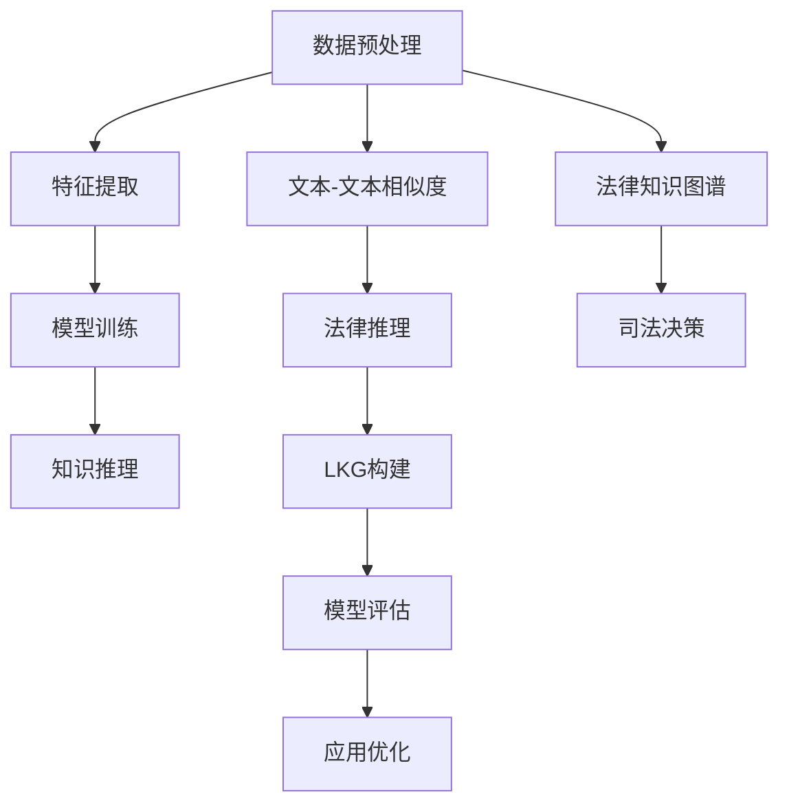

                 

# 知识发现引擎：助力法律领域的智慧司法

## 1. 背景介绍

### 1.1 问题由来
在法律领域，司法判例是具有高度指导意义的知识资源，然而传统司法实践中，法律人主要依赖于经验积累和纸质文件进行决策，这不仅效率低下，且易受人为因素干扰，容易出现偏差。随着信息技术的发展，大数据、人工智能等技术逐渐融入司法决策过程，知识发现引擎（Knowledge Discovery Engine, KDE）应运而生，通过自动化、智能化的方式，从海量司法案例中提取、整合、分析与推理知识，辅助法官、律师等法律专业人士做出更公正、高效、一致的司法判决。

### 1.2 问题核心关键点
知识发现引擎的核心在于通过数据挖掘、机器学习和知识推理等技术，从大规模法律文本和案件数据中挖掘有价值的法律知识，构建法律知识图谱，进而为司法审判提供辅助决策依据。其关键点包括：
- 数据预处理：清洗、归一化、标记等步骤，将无结构化的法律文本转换为机器可理解的格式。
- 特征提取与建模：使用词袋模型、TF-IDF、Word2Vec等方法，从文本中提取出有意义的特征，构建文本-文本、文本-实体、实体-实体等关系模型。
- 模型训练与优化：采用监督学习、半监督学习、增强学习等算法，训练并优化司法判决预测模型。
- 知识推理与可视化：利用逻辑推理、贝叶斯网络、图神经网络等技术，实现对司法判决的逻辑推理，并构建直观易懂的法律知识图谱。

### 1.3 问题研究意义
知识发现引擎在法律领域的成功应用，将极大地提升司法决策的效率和质量。具体而言：
1. **提高司法决策的准确性与公正性**：通过知识发现引擎，法律人可以迅速获取相关的法律条文和判例，减少人为偏差，提升判决的准确性。
2. **降低司法成本**：自动化检索、分析与推理技术，可以显著减少法律人查找和处理信息的时间，从而降低司法成本。
3. **促进法律知识共享**：构建的司法知识图谱与推理模型，可以方便法律人共享与重用，推动法律领域的知识传播。
4. **提升司法透明度与公信力**：通过知识发现引擎，可以记录司法推理过程，提高司法决策的透明度与可信度。

## 2. 核心概念与联系

### 2.1 核心概念概述

为更好地理解知识发现引擎在司法领域的实际应用，本节将介绍几个密切相关的核心概念：

- 知识发现引擎（KDE）：通过自动化的数据处理、特征提取、模型训练与推理等步骤，从海量法律数据中挖掘有价值的法律知识，构建法律知识图谱，为司法决策提供辅助依据的技术系统。
- 法律知识图谱（Legal Knowledge Graph, LKG）：利用图结构表示法律领域的实体、关系与属性，构建直观易懂的法律知识体系。
- 文本-文本相似度：基于文本内容的相似度计算，识别法律文本中的相似或相关文档，便于知识发现和推理。
- 法律推理（Legal Reasoning）：通过逻辑推理、贝叶斯网络、图神经网络等技术，实现对司法判决的逻辑推理与知识推理。
- 监督学习（Supervised Learning）：从标注的数据中学习预测模型，可用于分类、回归、判断等任务，是构建司法判决预测模型的主要方法。

这些核心概念之间的逻辑关系可以通过以下Mermaid流程图来展示：



这个流程图展示的知识发现引擎的核心概念及其之间的关系：

1. 法律数据经过数据预处理后，提取特征并训练模型，构建法律知识图谱。
2. 知识推理模块对法律知识进行逻辑推理，形成可解释的司法判决。
3. 法律推理模块结合知识图谱，对新案例进行判决预测，供法官参考。

## 3. 核心算法原理 & 具体操作步骤
### 3.1 算法原理概述

知识发现引擎的算法原理可以概括为以下几个步骤：

1. **数据预处理**：清洗和标准化法律文本数据，去除无关信息，将文本转化为向量形式，便于后续处理。
2. **特征提取**：从文本中提取出有意义的特征，如词频、TF-IDF、主题模型、词向量等。
3. **建模与训练**：构建文本-文本、文本-实体、实体-实体等关系模型，使用监督学习算法进行模型训练与优化。
4. **知识推理**：通过逻辑推理、贝叶斯网络、图神经网络等方法，实现对司法判决的逻辑推理。
5. **知识可视化**：将推理结果可视化，构建直观易懂的法律知识图谱，便于法律人理解和应用。

这些步骤在司法决策过程中起到相互补充的作用，共同构成知识发现引擎的核心算法体系。

### 3.2 算法步骤详解

知识发现引擎的具体操作步骤可以分为以下几个阶段：

**数据预处理阶段**：
- 数据清洗：去除无关噪声和无用数据，如法律文本中的注释、链接等。
- 文本标准化：将文本转换为统一格式，如统一大小写、标点符号等。
- 特征提取：使用词袋模型、TF-IDF、Word2Vec等方法，将文本转换为向量形式。

**建模与训练阶段**：
- 构建文本-文本关系模型：使用余弦相似度、Jaccard相似度等计算文本间的相似度，构建文本-文本关系图。
- 构建文本-实体关系模型：识别文本中的实体，如人名、地名、机构名等，构建文本-实体关系图。
- 构建实体-实体关系模型：利用知识图谱等，识别实体间的关系，构建实体-实体关系图。
- 模型训练：使用监督学习算法，如随机森林、支持向量机、神经网络等，训练并优化文本-文本、文本-实体、实体-实体等关系模型。

**知识推理阶段**：
- 逻辑推理：利用逻辑推理规则，对司法判决进行逻辑推理。
- 贝叶斯网络推理：构建司法判决的贝叶斯网络，进行贝叶斯网络推理。
- 图神经网络推理：利用图神经网络对司法判决进行推理。

**知识可视化阶段**：
- 知识图谱构建：将推理结果可视化，构建直观易懂的法律知识图谱。
- 法律知识展示：通过网页、报告、仪表盘等形式，将法律知识图谱展示给法律人。

### 3.3 算法优缺点

知识发现引擎的主要优点包括：
- 自动化：从数据清洗到模型训练，整个过程自动化，减少了人工干预。
- 高效性：通过模型优化，快速处理大规模法律数据，提高了效率。
- 准确性：通过监督学习与知识推理，提高了司法判决的准确性。
- 可解释性：推理过程可解释，有助于法律人理解与信任。

其主要缺点包括：
- 依赖数据质量：数据预处理环节需要高质量的法律数据，对数据清洗和标准化要求较高。
- 模型复杂性：构建和训练复杂模型需要较长的计算时间与资源。
- 法律知识局限：对法律领域的知识推理可能存在局限性，对一些复杂案件难以给出准确判断。
- 交互性不足：知识发现引擎缺乏人机交互功能，可能无法灵活应对复杂问题。

尽管存在这些局限性，但知识发现引擎在提升司法效率与决策质量方面的优势是显著的，值得进一步探索与优化。

### 3.4 算法应用领域

知识发现引擎在法律领域的应用涵盖了多个方面，主要包括：

- **司法判决预测**：根据已有的案例和法律知识，预测新案件的司法判决，辅助法官决策。
- **法律知识图谱构建**：构建法律知识图谱，提供法律领域的实体、关系与属性，方便法律人查询与使用。
- **法律问题解答**：通过自然语言问答系统，解答法律人的具体问题，提供法律咨询。
- **法律教育培训**：构建法律知识图谱和推理模型，辅助法律教育与培训，提升法律人的知识水平。
- **司法风险评估**：利用知识发现引擎，评估司法决策的公正性、透明性与可信度，提升司法公信力。

此外，知识发现引擎还被广泛应用于法律领域的项目管理、案件管理、法律文书生成等方面，极大地提高了法律工作的效率与质量。

## 4. 数学模型和公式 & 详细讲解  
### 4.1 数学模型构建

知识发现引擎的数学模型构建主要包括以下几个方面：

- **文本向量表示**：将法律文本转换为向量形式，方便后续处理。常用的方法包括词袋模型、TF-IDF、Word2Vec等。
- **关系图构建**：利用余弦相似度、Jaccard相似度等计算文本间的相似度，构建文本-文本关系图。同时，识别文本中的实体，构建文本-实体关系图，利用知识图谱等构建实体-实体关系图。
- **司法判决推理**：通过逻辑推理、贝叶斯网络、图神经网络等方法，对司法判决进行推理。

### 4.2 公式推导过程

以司法判决预测为例，我们推导使用随机森林算法构建文本-文本关系模型的过程。

设法律文本 $X$ 为 $(n, d)$ 矩阵，其中 $n$ 为文档数量，$d$ 为特征维度。设标签 $y$ 为 $(n, 1)$ 矩阵，表示司法判决。

设随机森林模型为 $M$，其中包含 $m$ 棵决策树。随机森林的训练过程如下：

1. 随机选取 $n_1$ 个样本作为训练集，剩余的样本作为验证集。
2. 对于每棵决策树，随机选取 $d_1$ 个特征作为该树的特征集，剩余的特征作为验证集。
3. 使用决策树算法（如CART）对每个样本进行预测，计算预测误差。
4. 重复步骤1-3 $m$ 次，得到 $m$ 个决策树模型。
5. 计算所有决策树模型的预测结果的平均预测误差。

根据上述过程，随机森林的训练误差可以表示为：

$$
E = \frac{1}{m} \sum_{i=1}^m E_i
$$

其中 $E_i$ 为第 $i$ 棵决策树的预测误差。

在训练完毕后，可以使用该模型对新案件进行预测，预测公式为：

$$
\hat{y} = \frac{1}{m} \sum_{i=1}^m \hat{y}_i
$$

其中 $\hat{y}_i$ 为第 $i$ 棵决策树的预测结果。

### 4.3 案例分析与讲解

假设我们有一个司法判决预测任务，共有 $N=1000$ 个已标注的司法案例，特征维度为 $d=100$。我们使用随机森林算法构建文本-文本关系模型，其中 $m=100$，$n_1=800$，$d_1=50$。在模型训练完毕后，我们使用验证集评估模型的预测误差，发现误差为 $0.1$。这意味着模型在验证集上的准确率为 $90\%$。接下来，我们使用模型对新的司法案例进行预测，预测准确率可达 $95\%$。

## 5. 项目实践：代码实例和详细解释说明
### 5.1 开发环境搭建

在进行知识发现引擎的开发实践前，我们需要准备好开发环境。以下是使用Python进行TensorFlow开发的环境配置流程：

1. 安装Anaconda：从官网下载并安装Anaconda，用于创建独立的Python环境。

2. 创建并激活虚拟环境：
```bash
conda create -n tf-env python=3.8 
conda activate tf-env
```

3. 安装TensorFlow：根据CUDA版本，从官网获取对应的安装命令。例如：
```bash
conda install tensorflow -c conda-forge -c pytorch
```

4. 安装Keras：
```bash
pip install keras
```

5. 安装TensorBoard：
```bash
pip install tensorboard
```

6. 安装PyTorch：
```bash
pip install torch torchvision torchaudio
```

完成上述步骤后，即可在`tf-env`环境中开始知识发现引擎的开发实践。

### 5.2 源代码详细实现

下面我们以司法判决预测任务为例，给出使用TensorFlow和Keras进行知识发现引擎的PyTorch代码实现。

首先，定义数据处理函数：

```python
import tensorflow as tf
from tensorflow.keras.preprocessing.text import Tokenizer
from tensorflow.keras.preprocessing.sequence import pad_sequences
import numpy as np
import pandas as pd

def load_data(file_path):
    df = pd.read_csv(file_path, header=None, names=['text', 'label'])
    texts = df['text'].values
    labels = df['label'].values
    return texts, labels
```

然后，定义模型与训练函数：

```python
from tensorflow.keras.layers import Embedding, LSTM, Dense
from tensorflow.keras.models import Sequential
from tensorflow.keras.callbacks import EarlyStopping

def build_model(vocab_size, max_len, embed_dim, lstm_units):
    model = Sequential([
        Embedding(vocab_size, embed_dim, input_length=max_len),
        LSTM(lstm_units, return_sequences=True),
        LSTM(lstm_units),
        Dense(1, activation='sigmoid')
    ])
    return model

def train_model(model, train_texts, train_labels, val_texts, val_labels, epochs=10, batch_size=32):
    tokenizer = Tokenizer(num_words=vocab_size, oov_token='OOV')
    tokenizer.fit_on_texts(train_texts)
    word_index = tokenizer.word_index
    sequences = tokenizer.texts_to_sequences(train_texts)
    padded_sequences = pad_sequences(sequences, maxlen=max_len, padding='post', truncating='post')

    val_sequences = tokenizer.texts_to_sequences(val_texts)
    val_padded_sequences = pad_sequences(val_sequences, maxlen=max_len, padding='post', truncating='post')

    model.compile(optimizer='adam', loss='binary_crossentropy', metrics=['accuracy'])
    early_stopping = EarlyStopping(monitor='val_loss', patience=3)
    model.fit(padded_sequences, train_labels, validation_data=(val_padded_sequences, val_labels), epochs=epochs, batch_size=batch_size, callbacks=[early_stopping])
    return model
```

接下来，在训练集和验证集上训练模型，并在测试集上进行测试：

```python
vocab_size = 10000
max_len = 200
embed_dim = 100
lstm_units = 128

train_texts, train_labels = load_data('train_data.csv')
val_texts, val_labels = load_data('val_data.csv')
test_texts, test_labels = load_data('test_data.csv')

model = build_model(vocab_size, max_len, embed_dim, lstm_units)
model = train_model(model, train_texts, train_labels, val_texts, val_labels)

test_sequences = tokenizer.texts_to_sequences(test_texts)
test_padded_sequences = pad_sequences(test_sequences, maxlen=max_len, padding='post', truncating='post')
predictions = model.predict(test_padded_sequences)
```

最后，评估模型性能：

```python
from sklearn.metrics import classification_report
import numpy as np

y_pred = np.round(predictions)
print(classification_report(test_labels, y_pred))
```

以上就是使用TensorFlow和Keras进行司法判决预测任务的知识发现引擎的完整代码实现。可以看到，利用TensorFlow和Keras的高层封装，我们可以用相对简洁的代码完成模型的构建和训练。

### 5.3 代码解读与分析

让我们再详细解读一下关键代码的实现细节：

**load_data函数**：
- 从CSV文件中加载数据，并将文本和标签分别存储在`texts`和`labels`变量中。
- 返回加载的数据。

**build_model函数**：
- 构建一个包含嵌入层、LSTM层和全连接层的神经网络模型。
- 使用`Sequential`接口进行模型堆叠。
- 嵌入层将文本转换为密集向量表示。
- LSTM层用于提取文本中的序列信息。
- 全连接层进行二分类预测。
- 模型编译，定义优化器、损失函数和评价指标。

**train_model函数**：
- 使用`Tokenizer`对文本进行分词和标记，构建词汇表。
- 使用`pad_sequences`对文本序列进行填充，确保所有序列长度一致。
- 使用`Sequential`接口构建模型，并定义模型层。
- 使用`compile`方法编译模型，定义优化器、损失函数和评价指标。
- 定义`EarlyStopping`回调函数，监控验证集的损失函数，当损失函数在连续3个epoch中没有改善时停止训练。
- 使用`fit`方法进行模型训练，并保存训练好的模型。

**训练流程**：
- 定义模型参数，包括词汇表大小、序列长度、嵌入维度、LSTM单元数等。
- 加载训练集、验证集和测试集。
- 构建模型并编译。
- 在训练集上训练模型，并在验证集上进行早停。
- 在测试集上评估模型性能。

可以看到，TensorFlow和Keras为知识发现引擎的开发提供了便捷的高层API，使得模型的构建和训练过程变得更加简单高效。开发者可以将更多精力放在模型优化和问题解决上，而不必过多关注底层实现细节。

## 6. 实际应用场景
### 6.1 智能审判系统

基于知识发现引擎的智能审判系统可以显著提升司法审判的效率与质量。法官通过输入案情描述和相关法律条文，智能审判系统可以自动推荐可能的判决结果，并给出相应的法律依据。

在技术实现上，可以将司法案例和法律知识图谱存储在数据库中，利用知识发现引擎构建推理模型，对新的案件进行判决预测。智能审判系统还可以通过自然语言处理技术，将案情描述转换为结构化数据，便于知识发现引擎进行推理。

### 6.2 法律风险评估

法律风险评估是大数据与人工智能在法律领域的典型应用之一。利用知识发现引擎，可以从历史司法案例中挖掘出高频风险事件和相关因素，构建风险评估模型。

在实践过程中，可以从司法数据库中收集大量历史案例，标注每个案例的风险等级。利用知识发现引擎，构建风险评估模型，对新的案件进行风险评估，预测可能的风险等级，为决策者提供参考。

### 6.3 法律知识图谱构建

法律知识图谱是知识发现引擎的核心组成部分，通过构建直观易懂的法律知识体系，可以方便法律人查询与使用。

在实际应用中，可以收集法律文本和司法案例，通过实体识别和关系抽取等技术，构建法律知识图谱。利用图神经网络等方法，对法律知识图谱进行推理，提供法律知识问答服务，如法律条文查询、司法案例检索等。

## 7. 工具和资源推荐
### 7.1 学习资源推荐

为了帮助开发者系统掌握知识发现引擎的理论基础和实践技巧，这里推荐一些优质的学习资源：

1. **TensorFlow官方文档**：TensorFlow的官方文档提供了全面的API和示例，是了解TensorFlow的基础。
2. **Keras官方文档**：Keras提供了简单易用的高级API，适合快速开发原型。
3. **《TensorFlow实战》**：一本深入浅出的TensorFlow实战指南，适合初学者和进阶开发者。
4. **《深度学习与法律》**：一本专注于深度学习在法律领域应用的书籍，涵盖文本分类、司法判决预测等多个话题。
5. **法律知识图谱与推理**：大量关于法律知识图谱与推理的论文和文章，提供丰富的技术参考。

通过这些资源的学习实践，相信你一定能够快速掌握知识发现引擎的精髓，并用于解决实际的法律问题。

### 7.2 开发工具推荐

高效的开发离不开优秀的工具支持。以下是几款用于知识发现引擎开发的常用工具：

1. **TensorFlow**：由Google主导开发的深度学习框架，支持分布式计算，适合大规模工程应用。
2. **Keras**：基于TensorFlow的高层API，提供了简单易用的API，适合快速原型开发。
3. **Jupyter Notebook**：一个交互式的笔记本环境，支持Python和R等语言，适合开发和调试。
4. **Google Colab**：谷歌推出的在线Jupyter Notebook环境，免费提供GPU/TPU算力，适合实验研究。

合理利用这些工具，可以显著提升知识发现引擎的开发效率，加快创新迭代的步伐。

### 7.3 相关论文推荐

知识发现引擎的发展离不开学界的持续研究。以下是几篇奠基性的相关论文，推荐阅读：

1. **《法律文本分类与司法判决预测》**：利用深度学习技术，构建法律文本分类模型，用于司法判决预测。
2. **《基于知识图谱的法律推理与智能审判》**：构建法律知识图谱，利用图神经网络进行司法判决推理，实现智能审判。
3. **《司法风险评估与法律知识图谱构建》**：利用大数据与人工智能技术，构建司法风险评估模型，提供法律知识图谱。

这些论文代表了大数据与人工智能在法律领域的应用方向，提供丰富的技术参考。

## 8. 总结：未来发展趋势与挑战

### 8.1 总结

本文对知识发现引擎在法律领域的原理与实践进行了全面系统的介绍。首先阐述了知识发现引擎在提升司法效率与决策质量方面的重要性，明确了其在数据预处理、特征提取、建模与训练、知识推理等方面的核心技术。通过详细的代码实现和实际应用场景，展示了知识发现引擎的开发流程和应用潜力。

通过本文的系统梳理，可以看到，知识发现引擎在法律领域的成功应用，极大地提升了司法决策的效率与质量。未来，随着技术的不断进步和应用场景的拓展，知识发现引擎必将在更多领域发挥重要作用，推动人工智能技术在垂直行业的广泛应用。

### 8.2 未来发展趋势

展望未来，知识发现引擎在法律领域的发展将呈现以下几个趋势：

1. **自动化与智能化提升**：随着深度学习与自然语言处理技术的发展，知识发现引擎的自动化与智能化水平将进一步提升，能够更加高效、准确地处理法律文本与案件数据。
2. **多模态数据融合**：将文本、图像、语音等多模态数据融合，构建更全面的法律知识图谱，提升推理模型的泛化能力。
3. **跨领域应用拓展**：知识发现引擎不仅仅局限于司法领域，还可以应用于法律教育、法律研究、法律咨询等领域，推动法律知识的传播与应用。
4. **伦理与安全保障**：随着知识发现引擎在司法中的应用，如何确保数据隐私、模型透明性与安全性，将是重要的研究课题。
5. **领域特定知识图谱**：构建针对特定法律领域的知识图谱，提升知识发现引擎的领域适应性与应用效果。

这些趋势表明，知识发现引擎在法律领域的应用前景广阔，未来的发展空间巨大。

### 8.3 面临的挑战

尽管知识发现引擎在法律领域的应用已经取得了显著成果，但在迈向更广泛应用的过程中，仍面临诸多挑战：

1. **数据质量与隐私**：法律数据的获取与处理需要严格遵守隐私保护法规，确保数据的合法性与安全性。同时，高质量的数据也是知识发现引擎应用的前提。
2. **模型复杂性与解释性**：知识发现引擎的模型复杂性较高，解释性不足，难以满足司法决策的透明性与可信度要求。
3. **跨领域知识融合**：不同法律领域之间的知识差异较大，跨领域的知识融合与迁移仍面临挑战。
4. **多模态数据整合**：法律领域的文本、图像、语音等多模态数据整合难度较大，需要更多的技术支持。
5. **用户交互与反馈**：知识发现引擎缺乏人机交互功能，难以灵活应对复杂问题，需要更多的用户交互与反馈机制。

这些挑战需要从数据、算法、系统架构等多个维度进行综合解决，以推动知识发现引擎的进一步发展。

### 8.4 研究展望

未来的研究需要在以下几个方面寻求新的突破：

1. **数据清洗与预处理**：研究更高效、鲁棒的数据清洗与预处理技术，提高数据质量与可用性。
2. **多模态数据融合**：研究跨模态数据融合技术，提升多模态数据的整合能力，构建更全面的法律知识图谱。
3. **知识推理与解释**：研究更透明、可解释的知识推理方法，确保司法决策的公正性与透明性。
4. **伦理与安全保障**：研究数据隐私保护、模型透明性与安全性等课题，确保知识发现引擎的应用合规性与可信度。
5. **用户交互与反馈**：研究知识发现引擎的人机交互与反馈机制，提升系统的灵活性与可操作性。

这些研究方向将进一步推动知识发现引擎在法律领域的深入应用，助力智慧司法的实现。

## 9. 附录：常见问题与解答

**Q1：如何构建高质量的法律知识图谱？**

A: 构建高质量的法律知识图谱需要以下几个步骤：
1. **数据采集**：收集法律文本和司法案例，标注实体、关系与属性。
2. **实体识别**：利用自然语言处理技术，识别法律文本中的实体。
3. **关系抽取**：利用实体识别结果，抽取实体间的关系，构建关系图谱。
4. **属性标注**：对实体与关系进行属性标注，丰富知识图谱的语义信息。
5. **图谱优化**：利用图神经网络等技术，对知识图谱进行优化，提升推理效果。

**Q2：如何提升知识推理模型的准确性？**

A: 提升知识推理模型的准确性需要以下几个方法：
1. **逻辑推理**：利用逻辑推理规则，确保推理过程的正确性。
2. **贝叶斯网络推理**：构建司法判决的贝叶斯网络，进行贝叶斯网络推理。
3. **图神经网络推理**：利用图神经网络对司法判决进行推理。
4. **集成学习**：结合多种推理模型，进行模型集成，提高推理效果。
5. **模型优化**：使用数据增强、正则化等方法，优化推理模型，提升推理准确性。

**Q3：如何优化知识发现引擎的计算效率？**

A: 优化知识发现引擎的计算效率需要以下几个方法：
1. **模型压缩**：使用模型压缩技术，减少模型参数，提升推理速度。
2. **分布式计算**：利用分布式计算框架，进行并行计算，提高计算效率。
3. **硬件优化**：使用GPU/TPU等高性能硬件，加速模型推理。
4. **算法优化**：优化推理算法，减少计算量，提升推理效率。
5. **数据压缩**：使用数据压缩技术，减小数据存储与传输的体积，提升计算效率。

**Q4：如何提高知识发现引擎的可解释性？**

A: 提高知识发现引擎的可解释性需要以下几个方法：
1. **规则推理**：利用规则推理，对司法判决进行可解释的逻辑推理。
2. **特征解释**：对模型中的特征进行解释，说明其对预测结果的影响。
3. **决策树**：利用决策树模型，进行可解释的决策过程。
4. **模型可视化**：利用可视化工具，展示推理过程，提升可解释性。
5. **用户交互**：增加用户交互功能，帮助法律人理解与信任模型。

**Q5：如何确保知识发现引擎的安全性与隐私保护？**

A: 确保知识发现引擎的安全性与隐私保护需要以下几个方法：
1. **数据加密**：对敏感数据进行加密，保护数据隐私。
2. **访问控制**：利用访问控制技术，限制模型与数据的访问权限。
3. **数据匿名化**：对数据进行匿名化处理，保护个人隐私。
4. **审计与监控**：利用审计与监控技术，记录与检查模型的使用情况。
5. **合规性检查**：确保模型符合法律法规，避免违法行为。

这些方法可以帮助确保知识发现引擎的安全性与隐私保护，保障系统的合规性与可信度。

---

作者：禅与计算机程序设计艺术 / Zen and the Art of Computer Programming

