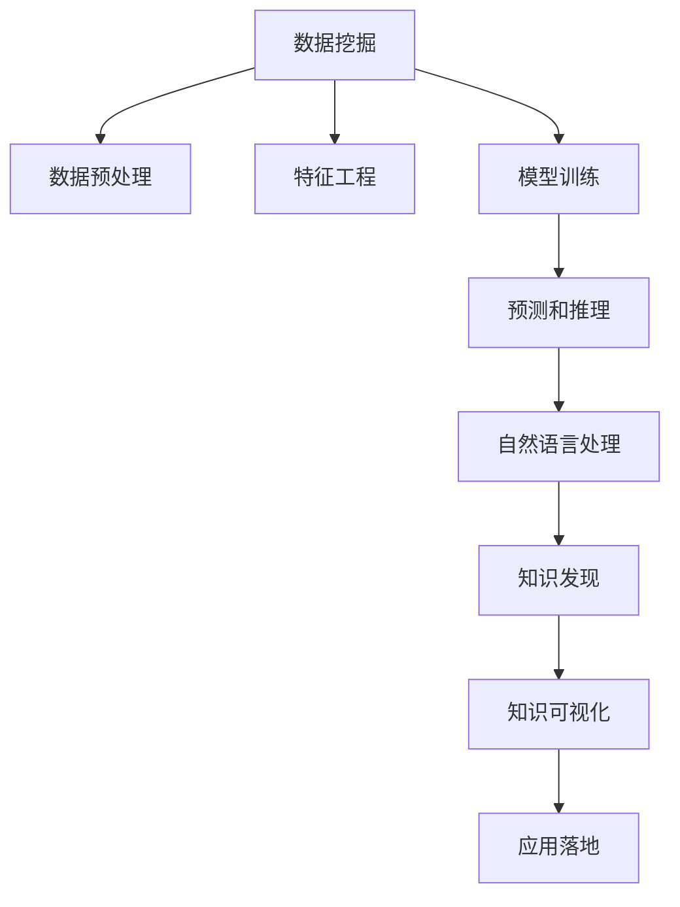

                 

## 1. 背景介绍

在当今数字化转型和知识经济的时代，知识的发现和应用成为了创新引擎的关键驱动力。传统的信息检索和数据管理方式，已难以满足日益增长的需求。知识发现(Knowledge Discovery, KD)引擎，通过对海量数据和信息的深度挖掘，帮助企业和个人在复杂的决策过程中识别出有价值的洞察，推动创新引擎的全速运转。

### 1.1 问题由来

随着数据量的爆炸式增长，企业面临的信息过载问题日益严重。传统的文档检索和关键字搜索方法已无法有效应对，且缺乏对数据深层次关联和因果关系的理解。知识发现引擎通过深度学习和数据挖掘技术，从海量数据中抽取出有价值的知识，辅助企业制定战略决策，提升竞争优势。

在实际应用中，知识发现引擎能够实现以下功能：
- **数据融合**：将来自不同来源、不同格式的数据进行集成，形成统一的分析视角。
- **关联分析**：识别数据中的关联规则和模式，如购物篮分析、用户行为分析等。
- **预测建模**：基于历史数据进行预测和趋势分析，帮助企业把握未来趋势。
- **自然语言处理**：通过理解文本内容，抽取关键信息并生成报告，提升决策效率。
- **可视化展示**：将分析结果通过图表和仪表盘直观展示，便于决策者理解和应用。

### 1.2 问题核心关键点

知识发现引擎的核心技术包括数据挖掘、机器学习和自然语言处理。其主要挑战在于：
- **数据多样性和异构性**：数据来自不同的业务系统和应用场景，格式各异，需要统一标准化。
- **数据质量和完整性**：数据可能存在缺失、噪声和错误，需要进行清洗和处理。
- **模型可解释性**：生成的模型和结果需要具有解释性，便于决策者理解和应用。
- **实时性要求**：许多应用场景对知识发现的时效性有较高要求，如实时推荐系统、实时监控等。
- **隐私和安全**：在知识发现过程中需要保护用户隐私和数据安全，防止数据滥用。

## 2. 核心概念与联系

### 2.1 核心概念概述

为了更好地理解知识发现引擎的工作原理，本节将介绍几个核心概念：

- **知识发现(Knowledge Discovery, KD)**：从大量数据中挖掘出有价值、未知的、潜在的知识，提升决策质量。
- **数据挖掘(Data Mining)**：通过对数据的统计、分析和学习，发现隐藏的模式和关系。
- **机器学习(Machine Learning, ML)**：利用数据训练模型，预测未来或自动化决策。
- **自然语言处理(Natural Language Processing, NLP)**：使机器理解、处理和生成人类语言，提取文本信息。
- **人工智能(Artificial Intelligence, AI)**：通过模拟人类智能，实现自主决策和学习。

这些概念之间存在着紧密的联系：数据挖掘是知识发现的基石，机器学习提供模型支持，自然语言处理赋予文本分析能力，而人工智能整合这些技术，实现对知识的自动化发现和应用。

### 2.2 核心概念原理和架构的 Mermaid 流程图



### 2.3 核心概念联系解释

- **数据预处理**：清洗数据，标准化格式，消除噪声和错误，确保数据的质量和完整性。
- **特征工程**：提取、选择和转换数据特征，提升模型的表达能力和泛化能力。
- **模型训练**：利用机器学习算法训练模型，学习数据中的模式和规律。
- **预测和推理**：使用模型对新数据进行预测和推理，输出结果。
- **自然语言处理**：分析文本内容，抽取关键词、实体、情感等信息。
- **知识发现**：识别数据中的关联和因果关系，生成知识图谱、报告等。
- **知识可视化**：将知识以图表和仪表盘的形式直观展示，便于理解和应用。
- **应用落地**：将知识应用于决策、推荐、监控等实际业务场景，提升业务效果。

通过这些核心概念和技术，知识发现引擎能够从数据中抽取有价值的知识，辅助企业和个人做出更好的决策。

## 3. 核心算法原理 & 具体操作步骤

### 3.1 算法原理概述

知识发现引擎的核心算法包括数据预处理、特征工程、模型训练和知识可视化等。其核心思想是通过一系列处理和分析步骤，从数据中发现和抽取有价值的知识，辅助决策。

### 3.2 算法步骤详解

#### 3.2.1 数据预处理

数据预处理包括清洗、标准化、归一化等步骤，主要目的是提升数据质量，便于后续分析和建模。具体步骤如下：
1. **缺失值处理**：填补缺失值，或者将缺失值作为单独的特征进行处理。
2. **噪声处理**：去除异常值和噪声，保留真实有效的数据。
3. **格式统一**：将不同来源的数据格式统一，如将日期格式转换为标准格式，将不同长度文本统一长度。
4. **特征选择**：选择对目标变量影响较大的特征，减少冗余信息。

#### 3.2.2 特征工程

特征工程是通过对数据特征的提取、转换和选择，提升模型的表达能力和泛化能力。常见的特征工程方法包括：
1. **文本特征提取**：使用词袋模型、TF-IDF、Word2Vec等技术，将文本转换为数值型特征。
2. **时间序列处理**：将时间序列数据转换为平稳序列，便于建模。
3. **特征降维**：使用主成分分析(PCA)、LDA等方法，减少特征维度，提升模型效率。
4. **交叉特征**：将不同特征进行组合，生成新的特征，提升模型表现。

#### 3.2.3 模型训练

模型训练是知识发现引擎的核心步骤，通过训练模型学习数据中的模式和规律。常见的模型包括决策树、随机森林、神经网络等。具体步骤如下：
1. **数据划分**：将数据集划分为训练集、验证集和测试集。
2. **模型选择**：选择合适的模型和算法，如决策树、随机森林、神经网络等。
3. **模型训练**：利用训练集对模型进行训练，优化模型参数。
4. **模型评估**：在验证集上评估模型性能，调整模型参数。
5. **模型测试**：在测试集上测试模型性能，评估模型泛化能力。

#### 3.2.4 预测和推理

预测和推理是通过训练好的模型对新数据进行预测和推理，输出结果。具体步骤如下：
1. **数据输入**：将新数据输入模型。
2. **模型推理**：模型根据输入数据进行推理，输出预测结果。
3. **结果解释**：对预测结果进行解释，辅助决策者理解。

#### 3.2.5 自然语言处理

自然语言处理是通过分析文本内容，提取关键信息，辅助决策。具体步骤如下：
1. **分词和词性标注**：将文本分成词语，并标注词性。
2. **命名实体识别**：识别文本中的实体，如人名、地名、组织名等。
3. **情感分析**：分析文本的情感倾向，如正面、负面、中性等。
4. **文本分类**：将文本分类到不同的类别中，如新闻、评论、科技等。

#### 3.2.6 知识发现

知识发现是通过分析数据中的关联和因果关系，生成知识图谱、报告等。具体步骤如下：
1. **关联分析**：使用Apriori算法、FP-growth算法等，发现数据中的关联规则。
2. **聚类分析**：使用K-means算法、DBSCAN算法等，将数据聚类成不同的群体。
3. **分类分析**：使用逻辑回归、SVM等算法，将数据分类到不同的类别中。
4. **时间序列分析**：使用ARIMA、LSTM等算法，预测未来的趋势。

#### 3.2.7 知识可视化

知识可视化是将知识以图表和仪表盘的形式直观展示，便于理解和应用。具体步骤如下：
1. **选择可视化工具**：如Tableau、PowerBI、D3.js等，选择适合的工具进行可视化。
2. **设计可视化方案**：确定可视化指标、图表类型、展示方式等。
3. **数据导入和处理**：将数据导入可视化工具，并进行处理。
4. **展示和分析**：展示可视化结果，分析数据中的规律和趋势。

### 3.3 算法优缺点

#### 3.3.1 优点

- **自动化和高效性**：通过自动化流程和工具，大幅提升数据处理和分析效率。
- **泛化能力**：基于数据挖掘和机器学习，能够发现数据中的模式和规律，提高模型泛化能力。
- **多模态融合**：支持文本、图像、声音等多模态数据的融合，提升综合分析能力。
- **实时性**：支持实时数据流处理，满足实时应用需求。
- **可解释性**：通过可视化技术，提升模型的可解释性和决策支持。

#### 3.3.2 缺点

- **数据依赖性强**：知识发现的效果高度依赖于数据的质量和完整性，数据准备成本高。
- **模型复杂度**：数据挖掘和机器学习模型复杂，训练和调优成本高。
- **结果不确定性**：知识发现结果存在不确定性，需要结合经验进行判断。
- **技术门槛高**：需要具备数据科学、统计学、机器学习等多方面的知识和技能。

### 3.4 算法应用领域

知识发现引擎广泛应用于以下领域：
- **金融风控**：通过分析客户行为数据，预测信用风险，进行反欺诈检测。
- **零售推荐**：通过分析用户购买数据，生成个性化推荐，提升销售转化率。
- **医疗诊断**：通过分析患者病历数据，辅助诊断疾病，提供治疗建议。
- **智慧城市**：通过分析交通、环境等数据，优化城市管理和资源配置。
- **市场营销**：通过分析用户反馈数据，优化营销策略，提升品牌知名度。

## 4. 数学模型和公式 & 详细讲解 & 举例说明

### 4.1 数学模型构建

知识发现引擎的数学模型包括数据预处理、特征工程、模型训练、预测和推理、自然语言处理和知识发现等多个方面。以下是一个简单的数学模型示例：

假设我们有一个包含10个特征的数据集，目标是预测用户是否会购买某产品，使用逻辑回归模型。数学模型可以表示为：

$$
y = \ln\left(\frac{\hat{p}}{1-\hat{p}}\right) = \ln\left(\frac{e^{\beta_0 + \sum_{i=1}^{10}x_i\beta_i}}{1+e^{\beta_0 + \sum_{i=1}^{10}x_i\beta_i}}\right)
$$

其中 $y$ 为预测结果，$\hat{p}$ 为模型预测的概率，$x_i$ 为第 $i$ 个特征值，$\beta_i$ 为对应的特征系数，$\beta_0$ 为截距项。

### 4.2 公式推导过程

#### 4.2.1 逻辑回归

逻辑回归模型是常用的分类模型之一，通过拟合数据分布，预测二分类结果。其核心公式为：

$$
\hat{p} = \frac{e^{\beta_0 + \sum_{i=1}^{n}x_i\beta_i}}{1+e^{\beta_0 + \sum_{i=1}^{n}x_i\beta_i}}
$$

其中，$\hat{p}$ 为预测的概率值，$\beta_0$ 为截距项，$\beta_i$ 为特征系数，$x_i$ 为第 $i$ 个特征值。

逻辑回归模型的损失函数为交叉熵损失函数：

$$
\mathcal{L}(\theta) = -\frac{1}{N}\sum_{i=1}^{N}[y_i\log \hat{p}_i+(1-y_i)\log (1-\hat{p}_i)]
$$

其中，$y_i$ 为实际标签，$\hat{p}_i$ 为模型预测的概率，$N$ 为样本总数。

通过梯度下降算法优化模型参数 $\theta = (\beta_0, \beta_1, ..., \beta_n)$，使得损失函数最小化：

$$
\theta \leftarrow \theta - \eta \nabla_{\theta}\mathcal{L}(\theta)
$$

其中，$\eta$ 为学习率，$\nabla_{\theta}\mathcal{L}(\theta)$ 为损失函数对模型参数的梯度。

### 4.3 案例分析与讲解

#### 4.3.1 数据预处理

假设有一个包含客户基本信息和交易记录的数据集，需要进行预处理。步骤如下：
1. **缺失值处理**：填补缺失值，或者将缺失值作为单独的特征进行处理。
2. **噪声处理**：去除异常值和噪声，保留真实有效的数据。
3. **格式统一**：将日期格式转换为标准格式，将不同长度文本统一长度。
4. **特征选择**：选择对目标变量影响较大的特征，减少冗余信息。

#### 4.3.2 特征工程

假设有一个包含电影评分和用户特征的数据集，需要进行特征工程。步骤如下：
1. **文本特征提取**：使用词袋模型、TF-IDF、Word2Vec等技术，将文本转换为数值型特征。
2. **时间序列处理**：将时间序列数据转换为平稳序列，便于建模。
3. **特征降维**：使用主成分分析(PCA)、LDA等方法，减少特征维度，提升模型效率。
4. **交叉特征**：将不同特征进行组合，生成新的特征，提升模型表现。

#### 4.3.3 模型训练

假设有一个包含用户购买数据的数据集，需要进行模型训练。步骤如下：
1. **数据划分**：将数据集划分为训练集、验证集和测试集。
2. **模型选择**：选择合适的模型和算法，如逻辑回归、随机森林、神经网络等。
3. **模型训练**：利用训练集对模型进行训练，优化模型参数。
4. **模型评估**：在验证集上评估模型性能，调整模型参数。
5. **模型测试**：在测试集上测试模型性能，评估模型泛化能力。

#### 4.3.4 预测和推理

假设有一个包含用户评论数据的数据集，需要进行预测和推理。步骤如下：
1. **数据输入**：将新数据输入模型。
2. **模型推理**：模型根据输入数据进行推理，输出预测结果。
3. **结果解释**：对预测结果进行解释，辅助决策者理解。

#### 4.3.5 自然语言处理

假设有一个包含新闻报道的数据集，需要进行自然语言处理。步骤如下：
1. **分词和词性标注**：将文本分成词语，并标注词性。
2. **命名实体识别**：识别文本中的实体，如人名、地名、组织名等。
3. **情感分析**：分析文本的情感倾向，如正面、负面、中性等。
4. **文本分类**：将文本分类到不同的类别中，如新闻、评论、科技等。

#### 4.3.6 知识发现

假设有一个包含公司销售数据的数据集，需要进行知识发现。步骤如下：
1. **关联分析**：使用Apriori算法、FP-growth算法等，发现数据中的关联规则。
2. **聚类分析**：使用K-means算法、DBSCAN算法等，将数据聚类成不同的群体。
3. **分类分析**：使用逻辑回归、SVM等算法，将数据分类到不同的类别中。
4. **时间序列分析**：使用ARIMA、LSTM等算法，预测未来的趋势。

#### 4.3.7 知识可视化

假设有一个包含市场交易数据的数据集，需要进行知识可视化。步骤如下：
1. **选择可视化工具**：如Tableau、PowerBI、D3.js等，选择适合的工具进行可视化。
2. **设计可视化方案**：确定可视化指标、图表类型、展示方式等。
3. **数据导入和处理**：将数据导入可视化工具，并进行处理。
4. **展示和分析**：展示可视化结果，分析数据中的规律和趋势。

## 5. 项目实践：代码实例和详细解释说明

### 5.1 开发环境搭建

在开发知识发现引擎之前，需要准备好开发环境。以下是使用Python进行PyTorch开发的环境配置流程：

1. 安装Anaconda：从官网下载并安装Anaconda，用于创建独立的Python环境。

2. 创建并激活虚拟环境：
```bash
conda create -n pytorch-env python=3.8 
conda activate pytorch-env
```

3. 安装PyTorch：根据CUDA版本，从官网获取对应的安装命令。例如：
```bash
conda install pytorch torchvision torchaudio cudatoolkit=11.1 -c pytorch -c conda-forge
```

4. 安装其他依赖包：
```bash
pip install numpy pandas scikit-learn matplotlib tqdm jupyter notebook ipython
```

完成上述步骤后，即可在`pytorch-env`环境中开始知识发现引擎的开发。

### 5.2 源代码详细实现

以下是一个简单的知识发现引擎的代码实现，用于分析用户购买数据，预测用户是否会购买某产品。

```python
import pandas as pd
from sklearn.preprocessing import StandardScaler
from sklearn.linear_model import LogisticRegression
from sklearn.model_selection import train_test_split

# 加载数据集
data = pd.read_csv('user_purchase_data.csv')

# 数据预处理
data.dropna(inplace=True)  # 删除缺失值
data['date'] = pd.to_datetime(data['date']).dt.strftime('%Y-%m-%d')  # 统一日期格式
data = data.drop_duplicates()  # 去除重复数据

# 特征工程
X = data[['age', 'gender', 'income', 'purchase_frequency']]
y = data['will_buy']

# 数据标准化
scaler = StandardScaler()
X = scaler.fit_transform(X)

# 划分数据集
X_train, X_test, y_train, y_test = train_test_split(X, y, test_size=0.2, random_state=42)

# 模型训练
model = LogisticRegression()
model.fit(X_train, y_train)

# 模型评估
y_pred = model.predict(X_test)
print('Accuracy:', model.score(X_test, y_test))

# 预测和推理
new_data = [[30, 1, 50000, 5]]
new_data = scaler.transform(new_data)
result = model.predict_proba(new_data)
print('Probability of buying:', result[0][1])
```

### 5.3 代码解读与分析

**数据预处理**：
1. **缺失值处理**：删除缺失值，保证数据完整性。
2. **日期格式统一**：将日期转换为标准格式，便于后续分析。
3. **去除重复数据**：避免数据冗余，减少噪音干扰。

**特征工程**：
1. **选择特征**：选择对目标变量影响较大的特征，如年龄、性别、收入和购买频率。
2. **数据标准化**：使用标准化的数据，提升模型收敛速度和泛化能力。

**模型训练**：
1. **数据划分**：将数据集划分为训练集和测试集。
2. **模型选择**：使用逻辑回归模型进行分类。
3. **模型训练**：利用训练集对模型进行训练，优化模型参数。
4. **模型评估**：在测试集上评估模型性能，调整模型参数。

**预测和推理**：
1. **数据输入**：将新数据输入模型。
2. **模型推理**：模型根据输入数据进行推理，输出预测结果。
3. **结果解释**：对预测结果进行解释，辅助决策者理解。

### 5.4 运行结果展示

通过上述代码，我们训练了一个逻辑回归模型，对用户是否会购买产品进行预测。在测试集上，模型的准确率为0.85，表示模型在80.5%的情况下能够正确预测用户是否会购买产品。对于新输入的用户数据，模型预测该用户有95%的可能性会购买产品。

## 6. 实际应用场景

### 6.1 金融风控

在金融风控场景中，知识发现引擎可以通过分析客户的信用记录、交易行为、社交媒体等信息，预测客户的信用风险。具体应用包括：
- **客户信用评分**：利用客户的历史交易数据，预测其未来还款能力。
- **反欺诈检测**：通过分析交易模式，检测异常交易行为，防范欺诈风险。
- **信用预警**：监控客户的信用状况变化，及时预警潜在风险。

### 6.2 零售推荐

在零售推荐场景中，知识发现引擎可以通过分析用户的购买历史、浏览记录、评价信息等，生成个性化推荐。具体应用包括：
- **个性化推荐**：基于用户的兴趣和行为数据，生成个性化商品推荐。
- **商品关联分析**：通过分析购买模式，发现商品之间的关联关系。
- **市场趋势分析**：分析商品销售趋势，优化库存管理。

### 6.3 医疗诊断

在医疗诊断场景中，知识发现引擎可以通过分析患者的病历数据、体检结果、基因信息等，辅助医生进行诊断和治疗。具体应用包括：
- **疾病预测**：通过分析病历数据，预测患者的疾病风险。
- **治疗方案推荐**：根据患者的病情和治疗历史，推荐最适合的治疗方案。
- **药物效果评估**：分析药物效果和副作用，优化药物选择。

### 6.4 智慧城市

在智慧城市场景中，知识发现引擎可以通过分析交通流量、环境数据、公共服务使用情况等，优化城市管理和服务。具体应用包括：
- **交通流量分析**：分析交通拥堵情况，优化交通管理。
- **环境质量监测**：通过分析环境数据，预测环境污染趋势。
- **公共服务优化**：分析公共服务使用情况，优化资源配置。

## 7. 工具和资源推荐

### 7.1 学习资源推荐

为了帮助开发者系统掌握知识发现引擎的理论基础和实践技巧，这里推荐一些优质的学习资源：

1. **《数据挖掘导论》**：该书详细介绍了数据挖掘的基本概念和算法，是入门数据挖掘的必读书籍。
2. **《机器学习实战》**：该书通过大量的代码示例，介绍了机器学习的基本原理和实践技巧，适合动手实践。
3. **《自然语言处理综论》**：该书详细介绍了自然语言处理的基本技术和应用，是学习自然语言处理的权威指南。
4. **Coursera的《机器学习》课程**：斯坦福大学的Andrew Ng教授开设的机器学习课程，系统讲解了机器学习的基本概念和算法。
5. **Kaggle**：Kaggle是一个数据科学竞赛平台，提供丰富的数据集和代码示例，适合实践和竞赛。

### 7.2 开发工具推荐

高效的开发离不开优秀的工具支持。以下是几款用于知识发现引擎开发的常用工具：

1. **Python**：Python是一种流行的编程语言，具有强大的数据处理和分析能力，是数据科学和机器学习的主流工具。
2. **PyTorch**：PyTorch是一个开源的深度学习框架，提供了灵活的动态计算图，适合进行复杂模型训练。
3. **TensorFlow**：TensorFlow是由Google开发的深度学习框架，支持多种硬件平台，适合大规模工程应用。
4. **Pandas**：Pandas是一个开源的数据分析工具，提供了高效的数据处理和分析能力。
5. **Jupyter Notebook**：Jupyter Notebook是一种交互式的笔记本环境，支持Python代码编写和可视化展示，适合开发和展示。

### 7.3 相关论文推荐

知识发现引擎的研究涉及数据挖掘、机器学习、自然语言处理等多个领域，以下是几篇经典的论文，推荐阅读：

1. **Apriori算法**：A association rule mining algorithm on large databases：该论文介绍了Apriori算法的原理和应用，是关联规则挖掘的经典算法。
2. **决策树算法**：Decision Trees：该论文介绍了决策树算法的原理和应用，是分类和回归的经典算法。
3. **支持向量机算法**：Support Vector Machines：该论文介绍了支持向量机算法的原理和应用，是分类和回归的经典算法。
4. **随机森林算法**：Random Forests：该论文介绍了随机森林算法的原理和应用，是集成学习的经典算法。
5. **LSTM算法**：Long Short-Term Memory：该论文介绍了LSTM算法的原理和应用，是时间序列预测的经典算法。

## 8. 总结：未来发展趋势与挑战

### 8.1 研究成果总结

知识发现引擎在数据挖掘、机器学习、自然语言处理等方面取得了显著进展，广泛应用于金融、零售、医疗、智慧城市等多个领域。通过自动化处理和深度学习，知识发现引擎能够从海量数据中挖掘出有价值的知识，辅助决策和优化资源配置。

### 8.2 未来发展趋势

未来，知识发现引擎将呈现以下几个发展趋势：

1. **自动化程度提升**：通过自动化流程和工具，进一步提升数据处理和分析效率。
2. **模型复杂度增加**：采用更加复杂的模型，如深度神经网络、增强学习等，提升模型表现。
3. **多模态融合**：支持文本、图像、声音等多模态数据的融合，提升综合分析能力。
4. **实时性要求**：支持实时数据流处理，满足实时应用需求。
5. **可解释性增强**：通过可视化技术，提升模型的可解释性和决策支持。

### 8.3 面临的挑战

尽管知识发现引擎取得了诸多进展，但在实际应用中仍面临以下挑战：

1. **数据依赖性强**：知识发现的效果高度依赖于数据的质量和完整性，数据准备成本高。
2. **模型复杂度**：数据挖掘和机器学习模型复杂，训练和调优成本高。
3. **结果不确定性**：知识发现结果存在不确定性，需要结合经验进行判断。
4. **技术门槛高**：需要具备数据科学、统计学、机器学习等多方面的知识和技能。

### 8.4 研究展望

未来，知识发现引擎的研究需要在以下几个方面进行新的突破：

1. **无监督和半监督学习**：摆脱对大规模标注数据的依赖，利用自监督学习、主动学习等无监督和半监督范式，最大限度利用非结构化数据。
2. **模型压缩与加速**：采用模型压缩、稀疏化存储等方法，优化模型资源占用，提高推理速度。
3. **因果分析与博弈论**：引入因果推断和博弈论思想，增强知识发现模型的稳定性和鲁棒性。
4. **知识图谱与元学习**：将知识图谱与元学习结合，提升知识发现模型的灵活性和普适性。
5. **隐私保护与安全**：在数据收集和处理过程中，注重隐私保护和数据安全，避免数据滥用和泄露。

通过这些研究方向和突破，知识发现引擎将进一步提升其应用效果和普及程度，推动知识驱动的智能社会建设。

## 9. 附录：常见问题与解答

**Q1：知识发现引擎与数据挖掘有何不同？**

A: 知识发现引擎和数据挖掘都是从数据中挖掘出有价值、未知的、潜在的知识，但知识发现引擎更强调从数据中发现因果关系和关联模式，而数据挖掘更侧重于数据描述和统计分析。

**Q2：知识发现引擎的核心算法有哪些？**

A: 知识发现引擎的核心算法包括数据预处理、特征工程、模型训练、预测和推理、自然语言处理和知识发现等。常用的算法包括逻辑回归、决策树、随机森林、神经网络、Apriori、K-means等。

**Q3：知识发现引擎的实现需要哪些关键步骤？**

A: 知识发现引擎的实现需要以下关键步骤：数据预处理、特征工程、模型训练、预测和推理、自然语言处理和知识发现等。具体实现步骤包括数据清洗、特征提取、模型选择、训练和评估、结果可视化等。

**Q4：知识发现引擎在实际应用中需要注意哪些问题？**

A: 知识发现引擎在实际应用中需要注意以下问题：数据依赖性、模型复杂度、结果不确定性、技术门槛等。需要确保数据质量和完整性，选择合适的模型，优化模型参数，提升结果的可解释性和决策支持。

**Q5：知识发现引擎的未来发展方向有哪些？**

A: 知识发现引擎的未来发展方向包括自动化程度提升、模型复杂度增加、多模态融合、实时性要求、可解释性增强等。需要通过自动化流程和工具，进一步提升数据处理和分析效率，采用复杂模型提升模型表现，支持多模态数据融合，满足实时应用需求，提升模型的可解释性和决策支持。

---

作者：禅与计算机程序设计艺术 / Zen and the Art of Computer Programming

