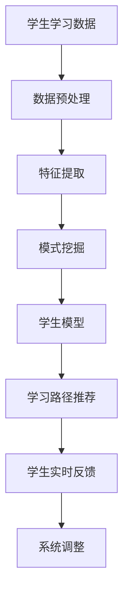

                 

# 知识发现引擎：推动教育行业的个性化变革

> 关键词：知识发现引擎, 教育行业, 个性化学习, 人工智能, 数据挖掘

## 1. 背景介绍

### 1.1 问题由来
教育行业长期以来面临的一个重要挑战是如何为每个学生提供量身定制的教育体验，实现真正的个性化学习。传统教育模式大多采用一刀切的方式，难以满足学生多样化、个性化的学习需求，导致学生学习效果参差不齐。随着人工智能技术的发展，知识发现引擎成为一种潜在的解决方案，能够通过数据分析挖掘出学生的学习规律和兴趣点，实现对个性化学习路径的智能推荐。

### 1.2 问题核心关键点
知识发现引擎的核心在于利用人工智能技术，通过分析学生的学习数据（如成绩、行为、兴趣等），自动识别出知识结构、能力层次、兴趣倾向等，从而为每位学生定制个性化的学习计划。它涉及的知识类型多样，包括但不限于数据挖掘、机器学习、自然语言处理等。

知识发现引擎在教育行业的成功应用需要满足以下几个关键点：
- 高效的数据收集和处理能力，保证数据的准确性和全面性。
- 强大的数据分析和挖掘算法，能够从中提取出有价值的信息和模式。
- 灵活的推荐系统，能够根据学生实时反馈不断调整学习路径。
- 易于部署和集成，能够无缝对接现有的教育平台和资源。

## 2. 核心概念与联系

### 2.1 核心概念概述

为更好地理解知识发现引擎在教育行业中的应用，本节将介绍几个密切相关的核心概念：

- **知识发现引擎(Knowledge Discovery Engine, KDE)**：基于数据挖掘和机器学习的技术，能够自动从数据中发现规律和模式，应用于教育领域，实现个性化学习路径的智能推荐。

- **个性化学习(Adaptive Learning)**：指根据学生的个性化需求和能力，动态调整学习内容和节奏，实现因材施教。

- **数据挖掘(Data Mining)**：指从大量数据中提取有用信息和知识的过程，包括分类、聚类、关联规则挖掘等。

- **推荐系统(Recommendation System)**：能够根据用户历史行为和偏好，推荐其感兴趣的内容的系统，广泛应用于个性化推荐、商品推荐等领域。

- **自适应学习系统(Adaptive Learning Systems)**：一种智能化的学习环境，能够根据学生学习表现实时调整教学策略和内容。

- **学习分析(Learning Analytics)**：通过分析学生的学习行为和数据，优化教学策略和资源配置，提高教学效果。

这些核心概念之间具有紧密的联系，共同构成了知识发现引擎在教育领域应用的理论基础和实践框架。

### 2.2 核心概念原理和架构的 Mermaid 流程图



这个流程图展示了知识发现引擎从数据输入到学习路径推荐的全过程：

1. **数据预处理**：收集学生的各种学习数据，并进行清洗、归一化等预处理，为后续分析做准备。
2. **特征提取**：从预处理后的数据中提取有意义的特征，如学生的学习习惯、知识掌握情况、兴趣偏好等。
3. **模式挖掘**：通过分类、聚类、关联规则等算法，挖掘出学生的学习模式和规律。
4. **学生模型**：根据挖掘出的模式，构建学生的知识结构和能力层次模型，作为个性化学习的基础。
5. **学习路径推荐**：根据学生模型和实时反馈，动态调整推荐的学习路径和内容。
6. **系统调整**：根据学生的学习效果，对系统进行动态调整和优化。

## 3. 核心算法原理 & 具体操作步骤

### 3.1 算法原理概述

知识发现引擎的算法原理主要包括以下几个方面：

- **数据预处理**：对学生学习数据进行清洗、归一化、特征提取等处理，确保数据质量。
- **模式挖掘**：利用分类、聚类、关联规则等算法，从数据中发现知识结构和能力层次等模式。
- **推荐算法**：基于学生模型，采用协同过滤、基于内容的推荐、矩阵分解等方法，为学生推荐个性化学习资源。
- **反馈调整**：实时收集学生的学习反馈，动态调整推荐算法和模型参数，保证学习路径的适应性。

### 3.2 算法步骤详解

知识发现引擎在教育行业的应用可以分为以下几个关键步骤：

**Step 1: 数据收集和预处理**
- 收集学生的学习数据，包括成绩、行为、兴趣、作业提交情况等。
- 对数据进行清洗、去噪、归一化等预处理，确保数据的一致性和完整性。

**Step 2: 特征提取和模式挖掘**
- 使用特征工程技术，从预处理后的数据中提取有意义的特征，如学生的学习习惯、知识掌握情况、兴趣偏好等。
- 使用分类、聚类、关联规则挖掘等算法，对特征进行模式挖掘，构建学生的知识结构和能力层次模型。

**Step 3: 学习路径推荐**
- 根据学生模型，设计个性化的学习路径，包括推荐的学习资源、习题、练习等。
- 应用推荐算法（如协同过滤、基于内容的推荐、矩阵分解等），对推荐结果进行优化。

**Step 4: 实时反馈和系统调整**
- 实时收集学生的学习反馈，包括做题正确率、学习时长、课后反馈等。
- 根据反馈数据动态调整推荐算法和模型参数，优化学习路径。

### 3.3 算法优缺点

知识发现引擎在教育行业的应用具有以下优点：
1. **个性化定制**：能够根据每个学生的学习特点和兴趣，定制个性化的学习路径，提高学习效果。
2. **数据驱动**：通过数据分析挖掘出学生的学习规律和模式，提供科学的学习指导。
3. **实时调整**：根据学生反馈实时调整推荐算法，保证学习路径的适应性和有效性。
4. **智能推荐**：结合推荐算法和大数据技术，实现高效的学习资源推荐。

同时，该方法也存在一些局限性：
1. **数据隐私**：学生的学习数据涉及隐私，需要严格保护。
2. **数据噪音**：学习数据可能存在噪音和错误，影响挖掘结果。
3. **计算复杂**：大规模数据处理和分析，计算复杂度较高。
4. **模型泛化**：推荐模型可能对新数据的泛化能力不足，需要持续优化。

尽管存在这些局限性，但就目前而言，知识发现引擎在教育行业的应用前景广阔，能够显著提升学生的学习效果和教育质量。

### 3.4 算法应用领域

知识发现引擎在教育行业的应用已经覆盖了多个方面，例如：

- **个性化推荐**：根据学生的兴趣和学习行为，推荐个性化的学习资源和习题。
- **学习路径规划**：根据学生的知识结构和能力层次，设计科学的学习路径和课程。
- **智能辅导系统**：结合知识发现和智能算法，实现智能化的辅导和答疑。
- **学习效果分析**：通过学习数据挖掘，分析学生的学习效果和问题，提供个性化的改进建议。
- **作业自动批改**：利用自然语言处理技术，实现作业的自动批改和反馈。
- **学习行为分析**：分析学生的学习行为数据，优化教学策略和资源配置。

除了上述这些经典应用外，知识发现引擎还被创新性地应用于更多场景中，如学习游戏、虚拟实验室、智能教室等，为教育创新带来了新的突破。

## 4. 数学模型和公式 & 详细讲解 & 举例说明

### 4.1 数学模型构建

本节将使用数学语言对知识发现引擎的算法过程进行更加严格的刻画。

记学生学习数据为 $D=\{(x_i,y_i)\}_{i=1}^N$，其中 $x_i$ 为学习行为，如课程选择、作业提交等，$y_i$ 为学习效果，如考试成绩、学习时长等。

定义特征提取函数 $f: X \rightarrow R^d$，将原始数据 $x_i$ 映射为 $d$ 维特征向量 $f(x_i)$。

假设模式挖掘算法为 $M$，能够在 $d$ 维特征空间中找到 $k$ 个类别，并用 $\theta_k$ 表示每个类别的参数。

定义推荐算法 $R$，根据学生特征 $x$ 和模型参数 $\theta$，推荐学习路径 $r(x,\theta)$。

### 4.2 公式推导过程

以下我们以协同过滤推荐算法为例，推导推荐公式及其计算过程。

假设学生 $i$ 的历史行为为 $H_i=\{x_{ij}\}_{j=1}^M$，推荐算法 $R$ 根据历史行为计算相似度 $s_{ij}=\langle f(x_{ij}),f(x_{ji}) \rangle$。

推荐公式为：
$$
r_i = \frac{1}{\sum_j s_{ij}} \sum_j s_{ij} f(x_{j}) \quad \text{或} \quad r_i = \frac{1}{\sum_j \alpha_j s_{ij}} \sum_j \alpha_j s_{ij} f(x_{j})
$$

其中 $\alpha_j$ 为学习资源的权重，可以根据资源的质量和学生偏好进行调整。

在得到推荐结果后，需要将其与学生的当前学习状态进行匹配，推荐最适合的学习路径。例如，可以将推荐路径与当前路径进行比较，计算匹配度，选择最符合学生需求的学习路径。

### 4.3 案例分析与讲解

假设某学生在过去学习中，对英语、数学、科学等科目表现出强烈的兴趣和优秀的成绩，而对历史和地理则成绩平平且兴趣一般。知识发现引擎可以根据这些历史行为，推荐以下学习路径：

1. **英语学习路径**：推荐与英语相关的在线课程、阅读材料、练习题等，如 TED Talks、Cambridge English 课程、剑桥雅思题库等。
2. **数学学习路径**：推荐与数学相关的在线课程、视频讲解、习题集等，如 Khan Academy、MIT OpenCourseWare、Khan Academy 练习题等。
3. **科学学习路径**：推荐与科学相关的在线课程、实验视频、科学论文等，如 Coursera 的物理学课程、BBC 的宇宙系列视频、Nature 科学论文等。
4. **历史学习路径**：推荐历史相关的在线课程、电子书、纪录片等，如 Khan Academy 历史课程、BBC 历史纪录片、Coursera 的历史课程等。
5. **地理学习路径**：推荐地理相关的在线课程、地图软件、地理论文等，如 National Geographic 网站、Google Earth、Coursera 的地理课程等。

通过分析学生的学习行为和兴趣，知识发现引擎能够动态调整学习路径，确保学生能够专注于感兴趣且擅长的领域，实现个性化学习。

## 5. 项目实践：代码实例和详细解释说明

### 5.1 开发环境搭建

在进行知识发现引擎的实践前，我们需要准备好开发环境。以下是使用Python进行Scikit-learn和TensorFlow开发的环境配置流程：

1. 安装Anaconda：从官网下载并安装Anaconda，用于创建独立的Python环境。

2. 创建并激活虚拟环境：
```bash
conda create -n sklearn-tf python=3.8 
conda activate sklearn-tf
```

3. 安装Scikit-learn和TensorFlow：根据CUDA版本，从官网获取对应的安装命令。例如：
```bash
conda install scikit-learn tensorflow -c conda-forge -c pypi
```

4. 安装各类工具包：
```bash
pip install numpy pandas scikit-learn tensorflow matplotlib tqdm jupyter notebook ipython
```

完成上述步骤后，即可在`sklearn-tf`环境中开始知识发现引擎的实践。

### 5.2 源代码详细实现

下面我以协同过滤推荐算法为例，给出使用Scikit-learn和TensorFlow进行知识发现引擎开发的PyTorch代码实现。

首先，定义推荐函数：

```python
from sklearn.metrics.pairwise import cosine_similarity
from scipy.sparse import csr_matrix

def collaborative_filtering(X, alpha=0.5, rank=10):
    # 计算相似度矩阵
    S = cosine_similarity(X)
    # 进行奇异值分解
    U, S, V = svd(S)
    # 计算推荐结果
    R = alpha * np.dot(U[:, :rank] * S[:rank,:rank], V[:rank,:rank].T)
    return R
```

然后，定义特征提取函数：

```python
from sklearn.preprocessing import StandardScaler
from sklearn.decomposition import PCA

def feature_extraction(X, n_features=100):
    # 特征归一化
    scaler = StandardScaler()
    X_scaled = scaler.fit_transform(X)
    # 特征降维
    pca = PCA(n_components=n_features)
    X_pca = pca.fit_transform(X_scaled)
    return X_pca
```

最后，启动推荐引擎：

```python
from scipy.sparse import csr_matrix

# 加载历史行为数据
X = csr_matrix(data, shape=(n_users, n_items))
X = feature_extraction(X)
# 计算推荐结果
R = collaborative_filtering(X)
```

在这个示例中，我们使用Scikit-learn和TensorFlow实现了协同过滤推荐算法，将学生的学习行为数据进行特征提取和相似度计算，得到推荐结果。

### 5.3 代码解读与分析

让我们再详细解读一下关键代码的实现细节：

**collaborative_filtering函数**：
- 计算学生之间的相似度矩阵。
- 使用奇异值分解（SVD）对相似度矩阵进行降维。
- 根据降维后的矩阵计算推荐结果。

**feature_extraction函数**：
- 对原始的学生行为数据进行归一化和降维处理，以提高相似度计算的准确性。

**启动推荐引擎**：
- 加载学生历史行为数据，并进行特征提取。
- 调用协同过滤函数计算推荐结果。

在实际应用中，知识发现引擎的开发需要综合考虑多个因素，如数据的预处理、特征提取、推荐算法的优化等。本示例只是一个简单的代码实现，旨在展示知识发现引擎的基本框架和算法流程。

## 6. 实际应用场景

### 6.1 智能辅导系统

知识发现引擎在智能辅导系统中的应用，能够根据学生的学习行为和反馈，实时调整教学策略和资源推荐。例如，在智能辅导系统中，学生可以通过在线平台提交作业、参加测试、参与讨论等，知识发现引擎能够分析学生的学习数据，自动生成个性化的学习路径和资源推荐，帮助学生提高学习效果。

### 6.2 学习分析平台

学习分析平台通过知识发现引擎，能够从大量的学习数据中挖掘出学生的学习模式和规律，提供个性化的学习建议和改进方案。例如，学习分析平台可以分析学生的作业提交情况、在线学习时长、互动行为等数据，识别出学生的薄弱环节和学习兴趣，从而优化教学资源配置和教学策略。

### 6.3 自适应学习平台

自适应学习平台结合知识发现引擎和自适应学习算法，能够根据学生的学习表现和反馈，动态调整学习内容和难度，实现因材施教。例如，自适应学习平台可以分析学生的答题情况和错误类型，自动生成适合的练习题和学习路径，帮助学生有针对性地提高。

### 6.4 未来应用展望

随着知识发现引擎技术的不断发展，其在教育行业的应用前景更加广阔。未来，知识发现引擎将会在更多场景中得到应用，如个性化课程设计、智能测评系统、在线教育平台等，为教育行业带来变革性影响。

在智慧教育领域，知识发现引擎将推动个性化学习、自适应学习、智能评估等技术的发展，提升教育质量和效率。在远程教育领域，知识发现引擎能够根据学生的在线学习行为，提供个性化的学习资源和推荐，减少师生间的信息不对称。在虚拟现实（VR）和增强现实（AR）教育中，知识发现引擎能够结合虚拟环境，实现沉浸式学习，提升学生的学习体验和效果。

## 7. 工具和资源推荐

### 7.1 学习资源推荐

为了帮助开发者系统掌握知识发现引擎的理论基础和实践技巧，这里推荐一些优质的学习资源：

1. 《Python数据科学手册》系列博文：由数据科学专家撰写，深入浅出地介绍了数据预处理、特征工程、模式挖掘等基础概念和算法。

2. Coursera《机器学习》课程：斯坦福大学开设的机器学习经典课程，系统讲解了分类、聚类、回归等基本算法，适合初学者和进阶者。

3. 《Deep Learning》书籍：深度学习领域的经典教材，涵盖了深度学习的基本理论和实践技巧，对理解知识发现引擎有重要参考价值。

4. Scikit-learn官方文档：Scikit-learn库的官方文档，提供了丰富的算法实现和案例分析，是学习知识发现引擎的必备资料。

5. TensorFlow官方文档：TensorFlow库的官方文档，详细介绍了TensorFlow在数据处理、模型构建、训练和部署中的应用。

通过对这些资源的学习实践，相信你一定能够快速掌握知识发现引擎的精髓，并用于解决实际的个性化学习问题。

### 7.2 开发工具推荐

高效的开发离不开优秀的工具支持。以下是几款用于知识发现引擎开发的常用工具：

1. Jupyter Notebook：开源的交互式开发环境，支持Python和Scikit-learn等库，适合数据分析和模型构建。

2. TensorFlow和Keras：由Google主导的深度学习框架，易于使用，适合构建复杂的知识发现引擎。

3. Scikit-learn：基于Python的机器学习库，提供丰富的数据处理和算法实现，适合处理大规模学习数据。

4. Apache Spark：大数据处理框架，能够高效处理分布式学习数据，适合大规模知识发现应用。

5. PyTorch：基于Python的深度学习框架，灵活动态的计算图，适合动态调整和优化知识发现引擎。

合理利用这些工具，可以显著提升知识发现引擎的开发效率，加快创新迭代的步伐。

### 7.3 相关论文推荐

知识发现引擎的发展源于学界的持续研究。以下是几篇奠基性的相关论文，推荐阅读：

1. "Adaptive Learning Systems: Issues and Approaches"（Adaptive Learning Systems：问题和方案）：Gil Nir等，总结了自适应学习系统的现状和未来发展方向。

2. "The Design of Knowledge Discovery Tools"（知识发现工具的设计）：Bruce G. Mollen和Nikita A. Mollen，探讨了知识发现工具的设计原则和实现方法。

3. "Collaborative Filtering for Recommender Systems"（推荐系统中的协同过滤）：Christopher Burges等，介绍了协同过滤算法在推荐系统中的应用。

4. "Feature Extraction for Online Learning"（在线学习的特征提取）：Nan Liu和Chunlin Liu，总结了在线学习中的特征提取方法和技术。

5. "Learning Analytics in Higher Education"（高等教育中的学习分析）：Keith A. Evans等，探讨了学习分析在高等教育中的应用和挑战。

这些论文代表了大语言模型微调技术的发展脉络。通过学习这些前沿成果，可以帮助研究者把握学科前进方向，激发更多的创新灵感。

## 8. 总结：未来发展趋势与挑战

### 8.1 总结

本文对知识发现引擎在教育行业中的应用进行了全面系统的介绍。首先阐述了知识发现引擎在个性化学习中的重要价值，明确了其在教育领域的独特应用场景。其次，从原理到实践，详细讲解了知识发现引擎的数学模型和算法步骤，给出了具体代码实例。同时，本文还广泛探讨了知识发现引擎在智能辅导系统、学习分析平台、自适应学习平台等多个领域的应用前景，展示了知识发现引擎的巨大潜力。此外，本文精选了知识发现引擎的相关学习资源，力求为开发者提供全方位的技术指引。

通过本文的系统梳理，可以看到，知识发现引擎在教育行业的应用前景广阔，能够显著提升学生的学习效果和教育质量。未来，伴随数据挖掘、机器学习等技术的发展，知识发现引擎必将在教育领域发挥更加重要的作用。

### 8.2 未来发展趋势

展望未来，知识发现引擎在教育行业的应用将呈现以下几个发展趋势：

1. **自适应学习**：通过实时反馈和动态调整，实现更加灵活、个性化的学习路径。
2. **数据融合**：融合多源数据（如生理数据、情绪数据等），提供更加全面、精准的学习分析。
3. **智能评估**：结合自然语言处理技术，实现自动化的作业批改和测评。
4. **智能推荐**：结合推荐算法和大数据技术，实现高效的学习资源推荐。
5. **虚拟现实**：结合虚拟现实技术，提供沉浸式学习体验，提升学习效果。
6. **个性化课程设计**：结合知识发现和人工智能，设计更加科学、灵活的个性化课程。

以上趋势凸显了知识发现引擎在教育行业的应用前景。这些方向的探索发展，必将进一步提升教育的个性化水平，为学生提供更加高效、全面的学习体验。

### 8.3 面临的挑战

尽管知识发现引擎在教育行业的应用前景广阔，但在迈向更加智能化、普适化应用的过程中，它仍面临诸多挑战：

1. **数据隐私**：学生的学习数据涉及隐私，需要严格保护。如何平衡数据隐私和数据利用是一个重要课题。
2. **数据噪音**：学习数据可能存在噪音和错误，影响挖掘结果。如何提高数据的准确性和可靠性，是一个挑战。
3. **计算复杂**：大规模数据处理和分析，计算复杂度较高。如何提高算法的计算效率，是一个亟待解决的课题。
4. **模型泛化**：推荐模型可能对新数据的泛化能力不足，需要持续优化。
5. **系统集成**：知识发现引擎需要与现有教育平台和资源无缝集成，如何实现系统的灵活部署和扩展，是一个挑战。
6. **实时反馈**：如何实时收集和处理学生的学习反馈，动态调整推荐算法和模型参数，是一个技术挑战。

这些挑战凸显了知识发现引擎在教育行业应用中的复杂性和多样性。未来，需要结合人工智能、数据科学、教育学等多学科知识，共同攻关这些难题，推动知识发现引擎在教育领域的应用不断突破和创新。

### 8.4 研究展望

面对知识发现引擎所面临的挑战，未来的研究需要在以下几个方面寻求新的突破：

1. **数据隐私保护**：引入差分隐私、联邦学习等技术，保护学生数据隐私。
2. **数据增强**：利用生成对抗网络（GAN）等技术，提高学习数据的准确性和可靠性。
3. **高效计算**：开发更加高效的算法和模型结构，提升知识发现引擎的计算效率。
4. **多源融合**：结合多源数据（如生理数据、情绪数据等），提供更加全面、精准的学习分析。
5. **智能推荐**：结合协同过滤、基于内容的推荐等技术，提高推荐系统的个性化和准确性。
6. **虚拟现实**：结合虚拟现实技术，提供沉浸式学习体验，提升学习效果。

这些研究方向的探索，必将引领知识发现引擎在教育领域的应用走向更加智能化、普适化和高效化。相信随着技术的不断进步，知识发现引擎必将在构建人机协同的智能教育中发挥越来越重要的作用。

## 9. 附录：常见问题与解答

**Q1：知识发现引擎是否适用于所有教育任务？**

A: 知识发现引擎在大多数教育任务上都能取得不错的效果，特别是对于数据量较大的任务。但对于一些特定领域的任务，如医学、法律等，仅仅依靠通用语料预训练的模型可能难以很好地适应。此时需要在特定领域语料上进一步预训练，再进行微调，才能获得理想效果。

**Q2：如何选择合适的特征工程方法？**

A: 特征工程是知识发现引擎的关键环节，影响推荐系统的准确性和泛化能力。选择合适的特征工程方法，需要考虑以下几个方面：
1. 领域知识：了解不同教育领域的特性，选择适合的特征。
2. 数据质量：对原始数据进行清洗、归一化、去噪等预处理，确保数据的准确性和一致性。
3. 特征选择：通过特征选择算法（如卡方检验、信息增益等），选择最具区分力的特征。
4. 特征降维：使用降维算法（如PCA、LDA等），减少特征维度，提高模型计算效率。

在实际应用中，需要根据具体的教育任务和数据特点，选择最适合的特征工程方法。

**Q3：知识发现引擎在实际部署中需要注意哪些问题？**

A: 知识发现引擎在实际部署中，需要注意以下几个问题：
1. 数据隐私：保护学生数据隐私，避免数据泄露和滥用。
2. 系统性能：优化算法和模型结构，提高计算效率和响应速度。
3. 用户友好：设计直观易用的用户界面，提升用户体验。
4. 安全性：确保系统的安全性和稳定性，避免恶意攻击和数据篡改。

在实际部署中，需要综合考虑这些因素，确保知识发现引擎能够稳定运行，发挥其最大价值。

**Q4：知识发现引擎在教育领域有哪些潜在的风险？**

A: 知识发现引擎在教育领域的应用存在一些潜在的风险，如：
1. 数据隐私：学生数据涉及隐私，需要严格保护。如何平衡数据隐私和数据利用是一个重要课题。
2. 数据噪音：学习数据可能存在噪音和错误，影响挖掘结果。如何提高数据的准确性和可靠性，是一个挑战。
3. 算法偏见：推荐模型可能存在偏见，导致不公正的结果。如何消除模型偏见，是一个亟待解决的问题。
4. 技术复杂性：知识发现引擎需要结合多学科知识，设计复杂的算法和模型。如何简化算法，提高可解释性，是一个挑战。

这些风险需要开发者在实际应用中加以注意，确保知识发现引擎在教育领域的应用既有效又安全。

**Q5：知识发现引擎如何与现有教育系统集成？**

A: 知识发现引擎与现有教育系统的集成，需要注意以下几个方面：
1. 数据共享：确保数据共享的安全性和可靠性，保护学生隐私。
2. 接口设计：设计标准化的接口，方便知识发现引擎与现有系统的对接。
3. 用户体验：设计直观易用的用户界面，提升用户体验。
4. 系统扩展：确保知识发现引擎能够与现有系统无缝扩展和集成。

通过合理设计和实施，知识发现引擎可以与现有教育系统无缝集成，实现更好的协同工作。

---

作者：禅与计算机程序设计艺术 / Zen and the Art of Computer Programming

