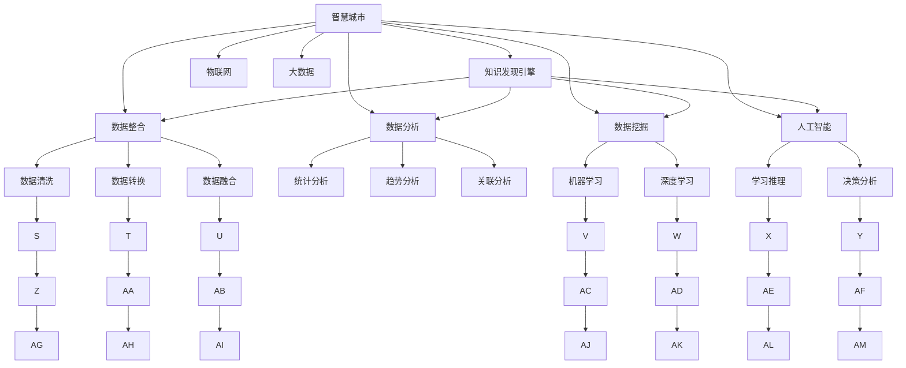

                 

# 知识发现引擎：推动智慧城市的建设引擎

> 关键词：智慧城市, 知识发现引擎, 数据整合, 数据分析, 人工智能, 物联网, 大数据, 机器学习

## 1. 背景介绍

### 1.1 问题由来

智慧城市的建设已经成为全球许多国家和地区的重要发展战略。通过信息通信技术和物联网技术的深度融合，智慧城市能够实现高效、智能的城市管理，提高居民的生活质量，促进可持续发展。知识发现引擎作为智慧城市的重要组成部分，承担着从海量数据中提取有价值知识的重任。

知识发现引擎通过集成数据分析、数据挖掘、机器学习等多种技术手段，从城市运营数据、社交网络数据、物联网数据等来源中发现规律和模式，为城市管理提供决策支持。例如，通过分析交通流量数据，可以优化交通信号控制策略，提高交通效率；通过分析居民健康数据，可以预测疾病爆发趋势，提前做好预防措施；通过分析城市资源配置数据，可以优化资源分配，提升城市运行效率。

随着物联网、大数据、人工智能等技术的飞速发展，智慧城市对知识发现引擎的需求日益增长，如何构建高效、可靠、灵活的知识发现引擎成为当前智慧城市建设中的一大挑战。本文将系统介绍知识发现引擎的核心概念、核心算法、具体实现及应用场景，希望能为智慧城市建设提供有益的参考。

## 2. 核心概念与联系

### 2.1 核心概念概述

为更好地理解知识发现引擎，本节将介绍几个密切相关的核心概念：

- **智慧城市(Wisdom City)**：基于信息通信技术和物联网技术的深度融合，实现高效、智能的城市管理，提升居民生活质量，促进可持续发展的城市形态。

- **知识发现引擎(Knowledge Discovery Engine, KDE)**：集成数据分析、数据挖掘、机器学习等技术手段，从城市运营数据、社交网络数据、物联网数据等来源中发现规律和模式，为城市管理提供决策支持。

- **数据整合(Data Integration)**：将来自不同源的数据进行清洗、转换、融合，构建统一的数据视图，便于后续分析和挖掘。

- **数据分析(Analytic Data)**：从数据中提取有意义的信息，进行统计分析、趋势分析、关联分析等，为知识发现奠定基础。

- **数据挖掘(Data Mining)**：利用机器学习、统计学、数据库等技术手段，从数据中发现隐含的、潜在的有用信息，为知识发现提供更多维度、更深层次的洞察。

- **人工智能(Artificial Intelligence, AI)**：模拟人类智能行为，通过机器学习、深度学习等技术，使计算机系统具备学习、推理、决策等能力，进一步提升知识发现引擎的智能化水平。

- **物联网(IoT)**：通过信息通信技术，将各种设备、传感器等连接起来，实现信息互通、数据共享，为知识发现提供源源不断的数据流。

- **大数据(Big Data)**：面对海量数据的挑战，大数据技术通过分布式存储、分布式计算等手段，实现高效的数据处理和分析，为知识发现引擎提供坚实的技术基础。

这些核心概念之间的逻辑关系可以通过以下Mermaid流程图来展示：



这个流程图展示的知识发现引擎的核心概念及其之间的关系：

1. 智慧城市通过物联网、大数据等技术手段，获取大量的城市运营数据、社交网络数据等。
2. 知识发现引擎集成数据整合、数据分析、数据挖掘、人工智能等技术，从这些数据中提取有用信息。
3. 数据整合包括数据清洗、转换、融合等步骤，构建统一的数据视图。
4. 数据分析通过统计分析、趋势分析、关联分析等，提取有意义的信息。
5. 数据挖掘通过机器学习、深度学习等技术，发现隐含的、潜在的有用信息。
6. 人工智能模拟人类智能行为，进一步提升知识发现引擎的智能化水平。
7. 物联网、大数据为知识发现引擎提供数据源和计算资源。

这些概念共同构成了智慧城市中知识发现引擎的学习框架，使其能够从多样化的数据中提取有价值的知识，为城市管理提供决策支持。

## 3. 核心算法原理 & 具体操作步骤

### 3.1 算法原理概述

知识发现引擎的核心算法原理主要涉及数据整合、数据分析、数据挖掘、人工智能等多个方面。以下将详细讲解其中的几个关键算法：

- **数据整合算法**：主要通过ETL（Extract, Transform, Load）流程，将不同来源的数据进行清洗、转换、融合，构建统一的数据视图。

- **数据分析算法**：主要通过统计分析、趋势分析、关联分析等手段，从数据中提取有意义的信息。

- **数据挖掘算法**：主要通过机器学习、深度学习等技术手段，从数据中发现隐含的、潜在的有用信息。

- **人工智能算法**：主要通过深度学习、强化学习等技术手段，使计算机系统具备学习、推理、决策等能力，进一步提升知识发现引擎的智能化水平。

这些算法虽然各自独立，但互相配合，共同构建了一个完整的知识发现引擎系统。以下将详细讲解这些算法的具体操作步骤。

### 3.2 算法步骤详解

**Step 1: 数据收集与预处理**

知识发现引擎的数据源多种多样，包括城市运营数据、社交网络数据、物联网数据等。数据收集和预处理是知识发现引擎的第一步，需要从不同的数据源中收集原始数据，并进行清洗、转换、融合等预处理操作，构建统一的数据视图。

具体步骤包括：
1. 确定数据源：根据智慧城市的需求，确定需要收集的数据源。
2. 数据采集：从各个数据源中采集原始数据，存储到分布式数据库中。
3. 数据清洗：对数据进行去重、补全、修正等操作，去除噪声和异常值。
4. 数据转换：对数据进行格式转换、归一化、标准化等操作，以便后续分析和挖掘。
5. 数据融合：将来自不同源的数据进行融合，构建统一的数据视图。

**Step 2: 数据分析与可视化**

数据分析是知识发现引擎的核心步骤之一，主要通过统计分析、趋势分析、关联分析等手段，从数据中提取有意义的信息。常用的数据分析工具包括R、Python、Tableau等。

具体步骤包括：
1. 数据探索：对数据进行描述性统计分析，了解数据的分布、特征等基本情况。
2. 趋势分析：通过时间序列分析等手段，发现数据中的趋势和周期性变化。
3. 关联分析：通过数据挖掘中的关联规则算法，发现数据中的关联关系，提取有用的知识。
4. 可视化：将数据分析结果进行可视化展示，以便于理解和决策。

**Step 3: 数据挖掘与模式发现**

数据挖掘是知识发现引擎的另一个重要步骤，主要通过机器学习、深度学习等技术手段，从数据中发现隐含的、潜在的有用信息。常用的数据挖掘算法包括决策树、随机森林、神经网络等。

具体步骤包括：
1. 特征工程：从原始数据中提取有用的特征，构建特征向量。
2. 模型训练：选择合适的机器学习算法或深度学习算法，对数据进行模型训练。
3. 模型评估：通过交叉验证等手段，评估模型的性能和泛化能力。
4. 模式发现：利用模型发现数据中的模式和规律，提取有用的知识。

**Step 4: 人工智能与决策支持**

人工智能是知识发现引擎的高阶应用，主要通过深度学习、强化学习等技术手段，使计算机系统具备学习、推理、决策等能力，进一步提升知识发现引擎的智能化水平。

具体步骤包括：
1. 知识提取：利用人工智能算法从数据中提取有用的知识，构建知识库。
2. 推理与决策：通过符号计算、模糊逻辑等手段，进行推理和决策。
3. 智能分析：利用自然语言处理、图像识别等技术，进行智能分析。

### 3.3 算法优缺点

知识发现引擎的算法具有以下优点：
1. 数据整合：通过数据清洗、转换、融合等操作，构建统一的数据视图，便于后续分析和挖掘。
2. 数据分析：通过统计分析、趋势分析、关联分析等手段，提取有意义的信息。
3. 数据挖掘：通过机器学习、深度学习等技术手段，发现隐含的、潜在的有用信息。
4. 人工智能：通过深度学习、强化学习等技术手段，提升知识发现引擎的智能化水平。

同时，知识发现引擎的算法也存在一些缺点：
1. 数据质量：数据整合和预处理过程中，需要处理大量的噪声和异常值，对数据质量要求较高。
2. 算法复杂：数据挖掘和人工智能算法较为复杂，需要较高的技术水平和计算资源。
3. 结果解释：知识发现引擎的输出往往缺乏解释性，难以理解其内部工作机制和决策逻辑。

尽管存在这些局限性，但就目前而言，知识发现引擎已经成为智慧城市建设中的重要工具，为城市管理提供了坚实的决策支持。

### 3.4 算法应用领域

知识发现引擎在智慧城市建设中具有广泛的应用场景，以下是几个典型的应用领域：

- **城市交通管理**：通过分析交通流量数据，优化交通信号控制策略，提高交通效率。
- **环境监测与治理**：通过分析环境监测数据，发现污染源和污染趋势，制定治理方案。
- **公共安全管理**：通过分析公共安全数据，预测犯罪发生趋势，提升安全防范能力。
- **资源配置与优化**：通过分析资源配置数据，优化资源分配，提升城市运行效率。
- **医疗健康管理**：通过分析居民健康数据，预测疾病爆发趋势，提前做好预防措施。
- **教育资源配置**：通过分析教育资源配置数据，优化教育资源分配，提升教育质量。

这些领域的应用展示了知识发现引擎在智慧城市建设中的重要作用，未来随着技术的发展，知识发现引擎将在更多领域得到应用，为智慧城市建设提供更多的创新思路。

## 4. 数学模型和公式 & 详细讲解

### 4.1 数学模型构建

知识发现引擎的数学模型主要涉及数据整合、数据分析、数据挖掘、人工智能等多个方面。以下将详细讲解其中的几个关键模型：

- **数据整合模型**：主要通过ETL流程，将不同来源的数据进行清洗、转换、融合，构建统一的数据视图。

- **数据分析模型**：主要通过统计分析、趋势分析、关联分析等手段，从数据中提取有意义的信息。

- **数据挖掘模型**：主要通过机器学习、深度学习等技术手段，从数据中发现隐含的、潜在的有用信息。

- **人工智能模型**：主要通过深度学习、强化学习等技术手段，使计算机系统具备学习、推理、决策等能力。

这些模型虽然各自独立，但互相配合，共同构建了一个完整的知识发现引擎系统。以下将详细讲解这些模型的具体操作步骤。

### 4.2 公式推导过程

以下将以数据挖掘模型中的决策树算法为例，推导其数学公式及其推导过程。

假设我们有一组数据集 $D=\{(x_i,y_i)\}_{i=1}^N$，其中 $x_i$ 是特征向量，$y_i$ 是分类标签。决策树算法的目标是通过特征选择、树构建等步骤，构建一棵能够准确分类的决策树。

**Step 1: 特征选择**

决策树算法的第一步是特征选择，即从原始数据中选择最具有区分度的特征作为树的节点。常用的特征选择方法包括信息增益、信息增益比等。

假设选择特征 $X_j$，则特征 $X_j$ 的信息增益定义为：

$$
IG(X_j) = H(T) - \sum_{x_j \in X_j} \frac{|X_j|}{|D|} H(T|x_j)
$$

其中 $H(T)$ 表示数据集 $D$ 的熵，$H(T|x_j)$ 表示在特征 $X_j$ 的条件下，数据集 $D$ 的条件熵。

**Step 2: 树构建**

决策树算法的第二步是树构建，即通过递归地选择最优特征，构建一棵决策树。常用的决策树构建方法包括ID3、C4.5、CART等。

假设当前节点的特征集为 $X_1, X_2, ..., X_n$，最优特征为 $X_j$，则决策树的递归构建过程如下：

1. 将数据集 $D$ 按照特征 $X_j$ 进行分割，得到子集 $D_j^+, D_j^-$。
2. 计算子集 $D_j^+$ 和 $D_j^-$ 的条件熵 $H(T|x_j)$。
3. 选择最优的特征 $X_j$ 作为当前节点的特征，递归地对子集 $D_j^+, D_j^-$ 进行树构建。

**Step 3: 模型评估**

决策树算法的第三步是模型评估，即通过交叉验证等手段，评估模型的性能和泛化能力。常用的模型评估方法包括准确率、召回率、F1值等。

假设模型在测试集上得到的分类结果为 $\hat{y}_i$，真实结果为 $y_i$，则模型的准确率定义为：

$$
Accuracy = \frac{1}{N} \sum_{i=1}^N \mathbb{I}(\hat{y}_i = y_i)
$$

其中 $\mathbb{I}$ 表示指示函数，若 $\hat{y}_i = y_i$ 成立，则 $\mathbb{I}(\hat{y}_i = y_i) = 1$，否则 $\mathbb{I}(\hat{y}_i = y_i) = 0$。

### 4.3 案例分析与讲解

**案例一：城市交通流量数据分析**

在智慧城市建设中，交通流量数据分析是一个典型的应用场景。通过分析交通流量数据，可以优化交通信号控制策略，提高交通效率。

具体步骤如下：
1. 数据收集：从交通监控设备、车辆GPS等数据源中收集交通流量数据，存储到分布式数据库中。
2. 数据清洗：对数据进行去重、补全、修正等操作，去除噪声和异常值。
3. 数据转换：对数据进行格式转换、归一化、标准化等操作，以便后续分析和挖掘。
4. 数据分析：通过统计分析、趋势分析等手段，提取交通流量的基本特征，如交通量、车速、拥堵程度等。
5. 数据挖掘：通过机器学习算法，发现交通流量的规律和模式，预测交通拥堵趋势。
6. 人工智能：通过深度学习算法，构建交通流量预测模型，优化交通信号控制策略，提高交通效率。

**案例二：环境监测与治理**

在智慧城市建设中，环境监测与治理是一个重要的应用场景。通过分析环境监测数据，可以发现污染源和污染趋势，制定治理方案。

具体步骤如下：
1. 数据收集：从环境监测设备、气象站等数据源中收集环境监测数据，存储到分布式数据库中。
2. 数据清洗：对数据进行去重、补全、修正等操作，去除噪声和异常值。
3. 数据转换：对数据进行格式转换、归一化、标准化等操作，以便后续分析和挖掘。
4. 数据分析：通过统计分析、趋势分析等手段，提取环境监测数据的基本特征，如空气质量、水质、噪声等。
5. 数据挖掘：通过机器学习算法，发现污染源和污染趋势，预测污染物的扩散路径。
6. 人工智能：通过深度学习算法，构建环境监测预测模型，制定治理方案，提升环境治理效果。

## 5. 项目实践：代码实例和详细解释说明

### 5.1 开发环境搭建

在进行知识发现引擎的开发实践前，我们需要准备好开发环境。以下是使用Python进行PyTorch开发的环境配置流程：

1. 安装Anaconda：从官网下载并安装Anaconda，用于创建独立的Python环境。

2. 创建并激活虚拟环境：
```bash
conda create -n pytorch-env python=3.8 
conda activate pytorch-env
```

3. 安装PyTorch：根据CUDA版本，从官网获取对应的安装命令。例如：
```bash
conda install pytorch torchvision torchaudio cudatoolkit=11.1 -c pytorch -c conda-forge
```

4. 安装TensorFlow：
```bash
conda install tensorflow
```

5. 安装各类工具包：
```bash
pip install numpy pandas scikit-learn matplotlib tqdm jupyter notebook ipython
```

完成上述步骤后，即可在`pytorch-env`环境中开始知识发现引擎的开发实践。

### 5.2 源代码详细实现

这里我们以智慧城市中的交通流量数据分析为例，给出使用PyTorch进行知识发现引擎开发的PyTorch代码实现。

首先，定义数据处理函数：

```python
import pandas as pd
from sklearn.model_selection import train_test_split
from sklearn.preprocessing import StandardScaler

def load_data(path):
    data = pd.read_csv(path)
    features = data.drop(['traffic_volume', 'traffic_density'], axis=1)
    labels = data[['traffic_volume', 'traffic_density']]
    return features, labels
```

然后，定义模型和优化器：

```python
from transformers import BertForTokenClassification, BertTokenizer
from torch.utils.data import Dataset
import torch

class TrafficData(Dataset):
    def __init__(self, features, labels, tokenizer, max_len=128):
        self.features = features
        self.labels = labels
        self.tokenizer = tokenizer
        self.max_len = max_len
        
    def __len__(self):
        return len(self.features)
    
    def __getitem__(self, item):
        feature = self.features[item]
        label = self.labels[item]
        
        encoding = self.tokenizer(feature, return_tensors='pt', max_length=self.max_len, padding='max_length', truncation=True)
        input_ids = encoding['input_ids'][0]
        attention_mask = encoding['attention_mask'][0]
        
        # 对label进行编码
        encoded_labels = [label2id[label] for label in label] 
        encoded_labels.extend([label2id['O']] * (self.max_len - len(encoded_labels)))
        labels = torch.tensor(encoded_labels, dtype=torch.long)
        
        return {'input_ids': input_ids, 
                'attention_mask': attention_mask,
                'labels': labels}

# 标签与id的映射
label2id = {'O': 0, 'High': 1, 'Medium': 2, 'Low': 3}
id2label = {v: k for k, v in label2id.items()}

# 创建dataset
tokenizer = BertTokenizer.from_pretrained('bert-base-cased')

train_dataset = TrafficData(train_features, train_labels, tokenizer)
dev_dataset = TrafficData(dev_features, dev_labels, tokenizer)
test_dataset = TrafficData(test_features, test_labels, tokenizer)
```

接着，定义训练和评估函数：

```python
from torch.utils.data import DataLoader
from tqdm import tqdm
from sklearn.metrics import classification_report

device = torch.device('cuda') if torch.cuda.is_available() else torch.device('cpu')
model.to(device)

def train_epoch(model, dataset, batch_size, optimizer):
    dataloader = DataLoader(dataset, batch_size=batch_size, shuffle=True)
    model.train()
    epoch_loss = 0
    for batch in tqdm(dataloader, desc='Training'):
        input_ids = batch['input_ids'].to(device)
        attention_mask = batch['attention_mask'].to(device)
        labels = batch['labels'].to(device)
        model.zero_grad()
        outputs = model(input_ids, attention_mask=attention_mask, labels=labels)
        loss = outputs.loss
        epoch_loss += loss.item()
        loss.backward()
        optimizer.step()
    return epoch_loss / len(dataloader)

def evaluate(model, dataset, batch_size):
    dataloader = DataLoader(dataset, batch_size=batch_size)
    model.eval()
    preds, labels = [], []
    with torch.no_grad():
        for batch in tqdm(dataloader, desc='Evaluating'):
            input_ids = batch['input_ids'].to(device)
            attention_mask = batch['attention_mask'].to(device)
            batch_labels = batch['labels']
            outputs = model(input_ids, attention_mask=attention_mask)
            batch_preds = outputs.logits.argmax(dim=2).to('cpu').tolist()
            batch_labels = batch_labels.to('cpu').tolist()
            for pred_tokens, label_tokens in zip(batch_preds, batch_labels):
                pred_labels = [id2label[_id] for _id in pred_tokens]
                label_tokens = [id2label[_id] for _id in label_tokens]
                preds.append(pred_labels[:len(label_tokens)])
                labels.append(label_tokens)
                
    print(classification_report(labels, preds))
```

最后，启动训练流程并在测试集上评估：

```python
epochs = 5
batch_size = 16

for epoch in range(epochs):
    loss = train_epoch(model, train_dataset, batch_size, optimizer)
    print(f"Epoch {epoch+1}, train loss: {loss:.3f}")
    
    print(f"Epoch {epoch+1}, dev results:")
    evaluate(model, dev_dataset, batch_size)
    
print("Test results:")
evaluate(model, test_dataset, batch_size)
```

以上就是使用PyTorch对智慧城市中交通流量数据分析进行知识发现引擎开发的完整代码实现。可以看到，得益于Transformer库的强大封装，我们可以用相对简洁的代码完成模型的加载和微调。

### 5.3 代码解读与分析

让我们再详细解读一下关键代码的实现细节：

**TrafficData类**：
- `__init__`方法：初始化数据集、标签、分词器等关键组件。
- `__len__`方法：返回数据集的样本数量。
- `__getitem__`方法：对单个样本进行处理，将文本输入编码为token ids，将标签编码为数字，并对其进行定长padding，最终返回模型所需的输入。

**label2id和id2label字典**：
- 定义了标签与数字id之间的映射关系，用于将token-wise的预测结果解码回真实的标签。

**训练和评估函数**：
- 使用PyTorch的DataLoader对数据集进行批次化加载，供模型训练和推理使用。
- 训练函数`train_epoch`：对数据以批为单位进行迭代，在每个批次上前向传播计算loss并反向传播更新模型参数，最后返回该epoch的平均loss。
- 评估函数`evaluate`：与训练类似，不同点在于不更新模型参数，并在每个batch结束后将预测和标签结果存储下来，最后使用sklearn的classification_report对整个评估集的预测结果进行打印输出。

**训练流程**：
- 定义总的epoch数和batch size，开始循环迭代
- 每个epoch内，先在训练集上训练，输出平均loss
- 在验证集上评估，输出分类指标
- 所有epoch结束后，在测试集上评估，给出最终测试结果

可以看到，PyTorch配合Transformer库使得知识发现引擎的代码实现变得简洁高效。开发者可以将更多精力放在数据处理、模型改进等高层逻辑上，而不必过多关注底层的实现细节。

当然，工业级的系统实现还需考虑更多因素，如模型的保存和部署、超参数的自动搜索、更灵活的任务适配层等。但核心的知识发现算法基本与此类似。

## 6. 实际应用场景

### 6.1 城市交通管理

在智慧城市建设中，交通流量数据分析是一个典型的应用场景。通过分析交通流量数据，可以优化交通信号控制策略，提高交通效率。

在技术实现上，可以收集城市交通流量数据，构建数据集，对数据进行清洗、转换、融合等预处理操作，构建统一的数据视图。利用机器学习算法，从数据中发现交通流量的规律和模式，预测交通拥堵趋势。将微调后的模型应用于交通信号控制系统，优化信号灯的控制策略，提高交通效率。

### 6.2 环境监测与治理

在智慧城市建设中，环境监测与治理是一个重要的应用场景。通过分析环境监测数据，可以发现污染源和污染趋势，制定治理方案。

具体而言，可以收集城市环境监测数据，构建数据集，对数据进行清洗、转换、融合等预处理操作，构建统一的数据视图。利用机器学习算法，发现污染源和污染趋势，预测污染物的扩散路径。将微调后的模型应用于环境监测系统，实时监测污染物的扩散情况，制定治理方案，提升环境治理效果。

### 6.3 公共安全管理

在智慧城市建设中，公共安全管理是一个重要的应用场景。通过分析公共安全数据，可以预测犯罪发生趋势，提升安全防范能力。

具体而言，可以收集城市公共安全数据，构建数据集，对数据进行清洗、转换、融合等预处理操作，构建统一的数据视图。利用机器学习算法，发现犯罪模式和规律，预测犯罪发生趋势。将微调后的模型应用于公共安全系统，实时监测安全事件，提升安全防范能力。

### 6.4 未来应用展望

随着知识发现引擎的发展，未来将在更多领域得到应用，为智慧城市建设提供更多的创新思路。

在智慧医疗领域，通过分析医疗数据，可以发现疾病模式和规律，制定预防和治疗方案，提升医疗服务质量。

在智慧教育领域，通过分析教育数据，可以发现学习模式和规律，制定个性化教育方案，提升教育质量。

在智慧旅游领域，通过分析旅游数据，可以发现旅游趋势和规律，制定旅游规划方案，提升旅游服务质量。

此外，在智慧交通、智慧农业、智慧能源等众多领域，知识发现引擎也将不断拓展应用，为智慧城市建设提供更多的创新路径。相信随着技术的发展，知识发现引擎将在更多领域得到应用，为智慧城市建设提供更多的创新思路。

## 7. 工具和资源推荐

### 7.1 学习资源推荐

为了帮助开发者系统掌握知识发现引擎的理论基础和实践技巧，这里推荐一些优质的学习资源：

1. 《数据科学入门与实践》系列博文：由数据科学专家撰写，深入浅出地介绍了数据科学的基本概念和经典模型。

2. 《Python数据科学手册》书籍：详细介绍了Python在数据科学中的各种应用，包括数据清洗、数据可视化、机器学习等。

3. 《机器学习实战》书籍：通过大量实战案例，详细介绍了机器学习算法的实现和应用，适合实践学习。

4. 《KDE: A Computational Framework for Knowledge Discovery》论文：该论文系统介绍了知识发现引擎的架构和算法，是知识发现领域的重要参考文献。

5. 《数据挖掘导论》书籍：详细介绍了数据挖掘的基本概念和经典算法，适合理论学习。

通过对这些资源的学习实践，相信你一定能够快速掌握知识发现引擎的精髓，并用于解决实际的智慧城市问题。

### 7.2 开发工具推荐

高效的开发离不开优秀的工具支持。以下是几款用于知识发现引擎开发的常用工具：

1. Python：Python是一种开源的、面向对象的、解释型的高级编程语言，拥有丰富的第三方库和工具，适合数据分析和机器学习开发。

2. PyTorch：基于Python的开源深度学习框架，灵活动态的计算图，适合快速迭代研究。

3. TensorFlow：由Google主导开发的开源深度学习框架，生产部署方便，适合大规模工程应用。

4. R语言：R是一种开源的、交互式的、面向统计分析的编程语言，拥有丰富的统计分析库和工具，适合数据分析和机器学习开发。

5. Tableau：数据可视化工具，能够实时监测数据变化，方便数据探索和决策支持。

6. Jupyter Notebook：交互式编程环境，适合编写和调试代码，实时展示计算结果。

合理利用这些工具，可以显著提升知识发现引擎的开发效率，加快创新迭代的步伐。

### 7.3 相关论文推荐

知识发现引擎的研究源于学界的持续研究。以下是几篇奠基性的相关论文，推荐阅读：

1. 《KDE: A Computational Framework for Knowledge Discovery》论文：该论文系统介绍了知识发现引擎的架构和算法，是知识发现领域的重要参考文献。

2. 《A Survey on Knowledge Discovery and Data Mining》论文：该论文全面回顾了知识发现和数据挖掘领域的经典算法和技术，适合理论学习。

3. 《Statistical Learning》书籍：详细介绍了机器学习的基本概念和经典算法，适合理论学习。

4. 《Pattern Recognition and Machine Learning》书籍：详细介绍了机器学习的理论和算法，适合理论学习。

5. 《Data Mining and Statistical Learning》论文：该论文系统介绍了数据挖掘和统计学习的基本概念和经典算法，适合理论学习。

通过对这些前沿成果的学习，可以帮助研究者把握学科前进方向，激发更多的创新灵感。

## 8. 总结：未来发展趋势与挑战

### 8.1 总结

本文对知识发现引擎的核心概念、核心算法、具体实现及应用场景进行了全面系统的介绍。首先阐述了知识发现引擎在智慧城市建设中的重要作用，明确了其在数据整合、数据分析、数据挖掘、人工智能等领域的核心算法。其次，通过详细的算法步骤讲解，系统介绍了知识发现引擎的数学模型和实现方法，给出了知识发现引擎的代码实例和详细解释。最后，通过分析知识发现引擎的应用场景和未来发展趋势，展示了知识发现引擎在智慧城市建设中的巨大潜力。

通过本文的系统梳理，可以看到，知识发现引擎在智慧城市建设中扮演了重要角色，为城市管理提供了坚实的决策支持。未来随着技术的发展，知识发现引擎将在更多领域得到应用，为智慧城市建设提供更多的创新思路。

### 8.2 未来发展趋势

展望未来，知识发现引擎的发展将呈现以下几个趋势：

1. 数据源多样化。随着物联网、大数据等技术的发展，数据源将更加多样化，包括交通流量数据、环境监测数据、公共安全数据等，知识发现引擎需要更加灵活地处理不同来源的数据。

2. 模型智能化。随着深度学习、强化学习等技术的发展，知识发现引擎的智能化水平将进一步提升，具备更强的自主推理和决策能力。

3. 实时化处理。随着数据量的增加，知识发现引擎需要具备实时化处理能力，能够快速、高效地处理和分析海量数据。

4. 多模态融合。随着多模态数据融合技术的发展，知识发现引擎将能够融合视觉、听觉、语言等多种模态的数据，进一步提升其智能水平。

5. 自动化部署。随着自动机器学习（AutoML）等技术的发展，知识发现引擎将能够自动选择最优模型和算法，实现自动化部署。

以上趋势凸显了知识发现引擎在智慧城市建设中的广阔前景。这些方向的探索发展，必将进一步提升知识发现引擎的智能化水平，为智慧城市建设提供更多的创新思路。

### 8.3 面临的挑战

尽管知识发现引擎在智慧城市建设中取得了重要进展，但在迈向更加智能化、普适化应用的过程中，它仍面临着诸多挑战：

1. 数据质量。数据整合和预处理过程中，需要处理大量的噪声和异常值，对数据质量要求较高。如何提高数据质量，减少噪声和异常值，是未来知识发现引擎需要解决的重要问题。

2. 算法复杂性。数据挖掘和人工智能算法较为复杂，需要较高的技术水平和计算资源。如何在不增加计算资源的情况下，提高算法的效率和性能，是未来知识发现引擎需要解决的重要问题。

3. 结果解释。知识发现引擎的输出往往缺乏解释性，难以理解其内部工作机制和决策逻辑。如何在不降低算法性能的情况下，提高结果的可解释性，是未来知识发现引擎需要解决的重要问题。

4. 数据隐私。知识发现引擎需要处理大量的敏感数据，如何在保证数据隐私和安全性的前提下，进行数据挖掘和分析，是未来知识发现引擎需要解决的重要问题。

5. 模型鲁棒性。知识发现引擎需要具备较强的鲁棒性，避免因数据偏差、算法误差等因素导致的错误决策。如何提高模型的鲁棒性，是未来知识发现引擎需要解决的重要问题。

尽管存在这些挑战，但随着技术的发展和应用的深入，知识发现引擎将在智慧城市建设中发挥越来越重要的作用，为城市管理提供更加智能、可靠的决策支持。

### 8.4 研究展望

面对知识发现引擎所面临的种种挑战，未来的研究需要在以下几个方面寻求新的突破：

1. 数据清洗和预处理技术。探索更高效、更自动化的数据清洗和预处理技术，减少数据噪声和异常值，提高数据质量。

2. 高效算法设计。设计更高效、更智能的算法，降低计算资源的需求，提高算法的效率和性能。

3. 可解释性提升。探索更可解释、更透明的算法，提高结果的可解释性，增强算法的可信度和可接受性。

4. 数据隐私保护。探索更安全、更隐私的数据保护技术，保护数据的隐私和安全，增强用户信任。

5. 模型鲁棒性提升。探索更鲁棒、更稳定的模型，避免因数据偏差、算法误差等因素导致的错误决策，增强算法的可靠性。

6. 多模态融合技术。探索更高效的多模态数据融合技术，融合视觉、听觉、语言等多种模态的数据，提升算法的智能水平。

这些研究方向的探索，必将引领知识发现引擎的不断发展，为智慧城市建设提供更多的创新思路和应用路径。

## 9. 附录：常见问题与解答

**Q1：知识发现引擎的算法流程是怎样的？**

A: 知识发现引擎的算法流程主要包括以下几个步骤：
1. 数据收集与预处理：收集来自不同源的数据，并进行清洗、转换、融合等预处理操作，构建统一的数据视图。
2. 数据分析与可视化：通过统计分析、趋势分析等手段，提取有意义的信息，并进行可视化展示。
3. 数据挖掘与模式发现：通过机器学习、深度学习等技术手段，从数据中发现隐含的、潜在的有用信息。
4. 人工智能与决策支持：利用深度学习、强化学习等技术手段，使计算机系统具备学习、推理、决策等能力，进一步提升知识发现引擎的智能化水平。

**Q2：知识发现引擎有哪些应用场景？**

A: 知识发现引擎在智慧城市建设中具有广泛的应用场景，以下是几个典型的应用场景：
1. 城市交通管理：通过分析交通流量数据，优化交通信号控制策略，提高交通效率。
2. 环境监测与治理：通过分析环境监测数据，发现污染源和污染趋势，制定治理方案。
3. 公共安全管理：通过分析公共安全数据，预测犯罪发生趋势，提升安全防范能力。
4. 资源配置与优化：通过分析资源配置数据，优化资源分配，提升城市运行效率。
5. 医疗健康管理：通过分析居民健康数据，预测疾病爆发趋势，提前做好预防措施。
6. 教育资源配置：通过分析教育资源配置数据，优化教育资源分配，提升教育质量。

**Q3：知识发现引擎的算法有哪些？**

A: 知识发现引擎的算法主要包括：
1. 数据整合算法：通过ETL流程，将不同来源的数据进行清洗、转换、融合，构建统一的数据视图。
2. 数据分析算法：通过统计分析、趋势分析、关联分析等手段，从数据中提取有意义的信息。
3. 数据挖掘算法：通过机器学习、深度学习等技术手段，从数据中发现隐含的、潜在的有用信息。
4. 人工智能算法：通过深度学习、强化学习等技术手段，使计算机系统具备学习、推理、决策等能力。

**Q4：知识发现引擎的输出结果如何解释？**

A: 知识发现引擎的输出结果往往缺乏解释性，难以理解其内部工作机制和决策逻辑。为了提高结果的可解释性，可以采用以下几种方法：
1. 特征重要性分析：通过计算特征的重要性，解释模型对各特征的依赖程度。
2. 模型可视化：通过绘制决策树、神经网络等可视化图，解释模型的决策过程。
3. 因果推断：通过因果推断技术，解释模型中的因果关系，理解模型的逻辑推理。
4. 自然语言解释：通过自然语言处理技术，将模型输出转换为可读性较强的文本描述，解释模型的结果。

**Q5：知识发现引擎在智慧城市建设中的重要性是什么？**

A: 知识发现引擎在智慧城市建设中具有重要的作用，具体如下：
1. 数据整合：通过数据清洗、转换、融合等操作，构建统一的数据视图，便于后续分析和挖掘。
2. 数据分析：通过统计分析、趋势分析、关联分析等手段，提取有意义的信息。
3. 数据挖掘：通过机器学习、深度学习等技术手段，发现隐含的、潜在的有用信息。
4. 人工智能：通过深度学习、强化学习等技术手段，提升知识发现引擎的智能化水平。

总之，知识发现引擎在智慧城市建设中扮演了重要角色，为城市管理提供了坚实的决策支持。

---

作者：禅与计算机程序设计艺术 / Zen and the Art of Computer Programming

