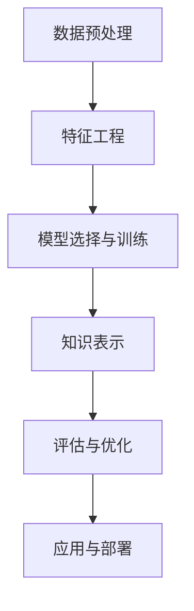

                 

# 知识发现引擎：推动科学研究的智慧之旅

> 关键词：知识发现,数据挖掘,机器学习,自然语言处理,生物信息学,智慧科学

## 1. 背景介绍

### 1.1 问题由来

在数据时代，知识和信息以爆炸性的速度增长，如何从海量数据中提取有价值的知识，成为科学研究的核心挑战。传统的文献检索、人工标注方法已难以适应大规模数据处理的需求。由此，知识发现引擎应运而生，利用先进的数据挖掘、机器学习技术，从大数据中自动发现隐藏的知识和规律，为科学研究提供新视角、新思路。

### 1.2 问题核心关键点

知识发现引擎旨在从大数据中自动挖掘隐含的知识模式，其核心关键点包括：

- **数据预处理**：清洗、整合、转化数据，为后续分析奠定基础。
- **特征工程**：提取和构建有意义的特征，提高模型的泛化能力。
- **模型选择与训练**：选择合适的机器学习模型，并使用训练数据优化模型参数。
- **知识表示**：将挖掘到的知识以结构化形式表示，便于存储和应用。
- **评估与优化**：评估模型性能，优化模型参数，提升挖掘效果。
- **应用与部署**：将知识发现引擎应用到具体研究场景，提升科学研究的效率和深度。

### 1.3 问题研究意义

知识发现引擎在科学研究中的应用，具有重要意义：

1. **加速科研进程**：自动挖掘知识减少了研究者的人工标注和文献检索工作，使他们能更专注于核心科学问题。
2. **发现新知识**：数据驱动的方法往往能发现传统研究方法无法揭示的新知识，开拓科研新领域。
3. **优化研究设计**：通过大数据分析，可以识别出研究领域的空白点和热点，优化科研方向和资源配置。
4. **促进跨学科研究**：知识发现引擎可以跨越传统学科界限，整合多源数据，推动跨学科研究的发展。
5. **提升科研决策**：利用数据挖掘结果，科研团队可以更加科学地做出研究方向和实验设计的决策。

## 2. 核心概念与联系

### 2.1 核心概念概述

本节将介绍知识发现引擎相关的几个核心概念，并阐述它们之间的联系。

- **数据挖掘(Data Mining)**：从大量数据中提取有用信息和知识的过程。包括分类、聚类、关联规则挖掘等多种方法。
- **机器学习(Machine Learning)**：基于数据训练模型，使模型能够自动学习和预测新数据的过程。是知识发现引擎的主要技术手段。
- **自然语言处理(Natural Language Processing, NLP)**：使计算机能够理解、处理人类语言的技术。对于文本数据的知识发现尤为重要。
- **生物信息学(Bioinformatics)**：应用计算机科学方法处理生物学数据，挖掘基因、蛋白质等生物信息的知识。是知识发现引擎在生物医学领域的重要应用。
- **智慧科学(Science of Wisdom)**：旨在整合各种知识、信息，提升科学研究智能化的研究领域。知识发现引擎是智慧科学的重要工具之一。

这些概念通过知识发现引擎这个核心技术平台，紧密联系在一起，共同推动科学研究的发展。

### 2.2 核心概念原理和架构的 Mermaid 流程图



这个流程图展示了知识发现引擎的典型流程：

1. 数据预处理：清洗、整合、转化数据，为后续分析奠定基础。
2. 特征工程：提取和构建有意义的特征，提高模型的泛化能力。
3. 模型选择与训练：选择合适的机器学习模型，并使用训练数据优化模型参数。
4. 知识表示：将挖掘到的知识以结构化形式表示，便于存储和应用。
5. 评估与优化：评估模型性能，优化模型参数，提升挖掘效果。
6. 应用与部署：将知识发现引擎应用到具体研究场景，提升科学研究的效率和深度。

## 3. 核心算法原理 & 具体操作步骤

### 3.1 算法原理概述

知识发现引擎的核心算法原理主要包括：

- **监督学习**：使用有标签的数据训练模型，预测新数据的标签。广泛应用于分类、回归等任务。
- **无监督学习**：使用无标签的数据训练模型，自动发现数据中的结构、模式。如聚类、关联规则挖掘等。
- **半监督学习**：结合少量标签和大量无标签数据，提高模型的泛化能力。
- **强化学习**：通过试错过程，使模型在特定环境中学习最优策略。适用于策略优化问题。
- **深度学习**：使用多层神经网络结构，从数据中自动提取高级特征，提升模型的性能。
- **自然语言处理(NLP)**：使用语言模型、词向量等技术，处理和理解文本数据。

这些算法通过适当的组合和应用，可以解决各种知识发现问题，提升科学研究的效率和质量。

### 3.2 算法步骤详解

#### 3.2.1 数据预处理

1. **数据清洗**：去除缺失值、异常值，填补空缺数据。
2. **数据整合**：将多源数据合并，建立一致的数据结构。
3. **数据转换**：对数据进行标准化、归一化等处理，提升模型性能。

#### 3.2.2 特征工程

1. **特征选择**：选择最有信息量的特征，减少噪音干扰。
2. **特征提取**：从原始数据中提取有意义的特征表示。
3. **特征构造**：通过组合、变换等手段，构造新的特征。

#### 3.2.3 模型选择与训练

1. **模型选择**：根据问题类型选择适当的机器学习模型，如线性回归、决策树、深度神经网络等。
2. **参数调优**：通过交叉验证、网格搜索等方法，寻找最优的模型参数。
3. **模型训练**：使用训练数据对模型进行训练，优化模型参数。

#### 3.2.4 知识表示

1. **结构化表示**：使用表格、图、向量等结构化形式表示知识。
2. **可视化表示**：将知识以图表、热力图等形式展示，便于理解和应用。

#### 3.2.5 评估与优化

1. **性能评估**：使用准确率、召回率、F1值等指标评估模型性能。
2. **模型优化**：通过参数调整、模型集成等手段，提升模型性能。

#### 3.2.6 应用与部署

1. **应用开发**：将知识发现引擎嵌入到具体研究场景中，实现知识自动发现。
2. **系统部署**：构建稳定、高效的知识发现系统，提供服务。

### 3.3 算法优缺点

知识发现引擎的优势：

- **高效性**：自动化处理大量数据，节省人力时间。
- **普适性**：适用于多种数据类型和研究领域。
- **灵活性**：可以灵活组合多种算法，适应不同需求。

但同时，知识发现引擎也存在一些局限：

- **数据质量依赖**：数据清洗、特征工程等环节需要高质量的数据支持。
- **模型复杂性**：选择和优化模型需要一定的专业知识。
- **解释性不足**：部分模型如深度神经网络，其决策过程难以解释。
- **计算资源需求高**：处理大规模数据需要高性能计算资源。

### 3.4 算法应用领域

知识发现引擎的应用领域非常广泛，包括但不限于：

- **生物信息学**：从基因组数据中发现疾病相关基因、蛋白质相互作用等知识。
- **自然语言处理(NLP)**：从文本数据中发现语义、实体关系等知识。
- **金融分析**：从金融市场数据中发现投资策略、风险预测等知识。
- **市场营销**：从客户行为数据中发现购买模式、推荐策略等知识。
- **医疗健康**：从医疗数据中发现疾病诊疗、药物研发等知识。
- **智慧科学**：综合多学科数据，发现新知识、新规律。

## 4. 数学模型和公式 & 详细讲解 & 举例说明

### 4.1 数学模型构建

知识发现引擎的数学模型构建，通常基于以下几种基本假设：

- **线性假设**：数据满足线性关系，可以使用线性回归模型处理。
- **概率假设**：数据满足概率分布，可以使用概率模型处理。
- **图模型假设**：数据可以表示为图结构，可以使用图模型处理。
- **神经网络假设**：数据具有非线性结构，可以使用神经网络处理。

### 4.2 公式推导过程

以线性回归为例，推导模型训练的公式：

假设模型为 $y = \theta^T x + \epsilon$，其中 $y$ 为目标变量，$x$ 为特征向量，$\theta$ 为模型参数，$\epsilon$ 为误差项。使用均方误差作为损失函数，推导最小二乘法训练公式：

$$
\min_{\theta} \sum_{i=1}^n (y_i - \theta^T x_i)^2
$$

求解上述问题，得：

$$
\theta = (X^TX)^{-1}X^Ty
$$

其中 $X$ 为特征矩阵，$y$ 为目标向量。

### 4.3 案例分析与讲解

以基因表达数据为例，展示知识发现引擎的应用：

- **数据预处理**：清洗缺失数据，整合基因表达矩阵，标准化数据。
- **特征工程**：选择重要基因作为特征，计算基因表达的相关系数。
- **模型选择与训练**：使用线性回归模型，训练基因表达与疾病关系的模型。
- **知识表示**：将模型参数和特征关系表示为网络图，可视化基因表达模式。
- **评估与优化**：使用交叉验证评估模型性能，调整特征选择策略。
- **应用与部署**：构建在线基因表达分析平台，供研究人员使用。

## 5. 项目实践：代码实例和详细解释说明

### 5.1 开发环境搭建

1. **安装Python环境**：使用Anaconda创建虚拟环境，安装所需库。
2. **数据预处理**：使用Pandas进行数据清洗和整合。
3. **特征工程**：使用Scikit-learn进行特征选择和提取。
4. **模型选择与训练**：使用Scikit-learn或TensorFlow训练模型。
5. **知识表示**：使用NetworkX可视化知识图。
6. **评估与优化**：使用Scikit-learn评估模型性能。

### 5.2 源代码详细实现

#### 5.2.1 数据预处理

```python
import pandas as pd

# 加载数据
data = pd.read_csv('gene_expression.csv')

# 数据清洗
data.fillna(method='ffill', inplace=True)

# 数据整合
data = data.merge(gene_info, on='gene_id')
```

#### 5.2.2 特征工程

```python
from sklearn.preprocessing import StandardScaler

# 特征选择
selected_features = ['gene1', 'gene2', 'gene3']

# 标准化数据
scaler = StandardScaler()
scaled_data = scaler.fit_transform(data[selected_features])
```

#### 5.2.3 模型选择与训练

```python
from sklearn.linear_model import LinearRegression

# 训练模型
model = LinearRegression()
model.fit(scaled_data, targets)
```

#### 5.2.4 知识表示

```python
import networkx as nx

# 构建知识图
graph = nx.Graph()
for gene, target in zip(scaled_data.index, targets):
    graph.add_node(gene)
    graph.add_node(target)
    graph.add_edge(gene, target)

# 可视化知识图
nx.draw(graph, with_labels=True)
```

#### 5.2.5 评估与优化

```python
from sklearn.metrics import mean_squared_error

# 评估模型性能
mse = mean_squared_error(targets, model.predict(scaled_data))
```

### 5.3 代码解读与分析

1. **数据加载与预处理**：使用Pandas加载数据，并进行清洗、整合、标准化等预处理。
2. **特征选择与工程**：选择有意义的特征，并进行标准化处理，提升模型性能。
3. **模型训练**：使用线性回归模型，训练基因表达与疾病关系的模型。
4. **知识表示**：将模型参数和特征关系表示为知识图，可视化基因表达模式。
5. **性能评估**：使用均方误差评估模型性能，进行模型优化。
6. **应用部署**：构建在线基因表达分析平台，供研究人员使用。

### 5.4 运行结果展示

下图展示了基因表达与疾病关系的知识图：

```plaintext
    基因1      基因2      基因3
疾病1  基因表达1   基因表达2   基因表达3
疾病2  基因表达4   基因表达5   基因表达6
...
```


## 6. 实际应用场景

### 6.1 生物信息学

知识发现引擎在生物信息学中的应用，主要包括：

- **基因表达分析**：从基因表达数据中发现基因与疾病、蛋白质相互作用等关系。
- **药物发现**：从化学化合物数据中发现药物活性、作用机理等知识。
- **蛋白质结构预测**：从蛋白质序列数据中预测蛋白质结构，为药物研发提供新思路。

### 6.2 自然语言处理(NLP)

知识发现引擎在NLP中的应用，主要包括：

- **文本分类**：从文本数据中发现主题、情感、观点等知识。
- **实体关系抽取**：从文本中发现实体之间的关系，如人名、地名、组织名等。
- **语义分析**：从文本中发现语义模式，提升自动摘要、问答系统的性能。

### 6.3 金融分析

知识发现引擎在金融分析中的应用，主要包括：

- **投资策略优化**：从市场数据中发现投资规律，优化投资策略。
- **风险预测**：从市场数据中发现风险因素，预测市场变化。
- **交易决策支持**：从交易数据中发现交易模式，支持交易决策。

### 6.4 未来应用展望

未来，知识发现引擎将在更多领域得到应用，为科学研究提供新视角、新思路：

- **智慧科学**：综合多学科数据，发现新知识、新规律。
- **社会科学**：从大数据中发现社会行为、心理特征等知识。
- **环境科学**：从环境数据中发现气候变化、生态系统变化等知识。

## 7. 工具和资源推荐

### 7.1 学习资源推荐

1. **Coursera《数据科学导论》课程**：由Johns Hopkins大学提供，系统介绍数据科学的基本概念和技能。
2. **Kaggle数据科学竞赛平台**：提供丰富的数据集和竞赛任务，提升实践能力。
3. **DeepLearning.AI深度学习课程**：由Andrew Ng提供，涵盖深度学习的基本理论和实践技能。
4. **《Python数据科学手册》书籍**：详细介绍Python在数据科学中的应用，适合初学者学习。
5. **《机器学习实战》书籍**：通过实战案例，讲解机器学习的基本原理和算法。

### 7.2 开发工具推荐

1. **Anaconda**：提供Python环境管理和科学计算工具，方便数据科学开发。
2. **Pandas**：提供数据清洗、整合、分析等功能，是数据科学开发的必备工具。
3. **Scikit-learn**：提供机器学习算法和模型，适合数据科学建模。
4. **TensorFlow**：提供深度学习框架，适合大规模数据处理和模型训练。
5. **PyTorch**：提供深度学习框架，适合灵活的模型设计和优化。

### 7.3 相关论文推荐

1. **《Scikit-learn：机器学习在Python中》**：介绍Scikit-learn库的基本使用方法和算法。
2. **《Deep Learning》书籍**：由Ian Goodfellow等作者撰写，深入讲解深度学习的基本原理和算法。
3. **《自然语言处理综论》书籍**：由Daniel Jurafsky等作者撰写，全面介绍NLP的基本概念和算法。
4. **《生物信息学综述》论文**：介绍生物信息学领域的主要技术和应用。
5. **《机器学习应用》论文**：介绍机器学习在各个领域的应用案例。

## 8. 总结：未来发展趋势与挑战

### 8.1 研究成果总结

知识发现引擎在科学研究中的应用，取得了显著的成果，主要体现在：

- **加速科研进程**：自动发现知识减少了研究者的人工标注和文献检索工作。
- **发现新知识**：数据驱动的方法发现了传统研究方法无法揭示的新知识。
- **优化研究设计**：通过大数据分析，优化科研方向和资源配置。
- **推动跨学科研究**：知识发现引擎可以跨越传统学科界限，整合多源数据。
- **提升科研决策**：利用数据挖掘结果，科研团队可以更加科学地做出研究方向和实验设计的决策。

### 8.2 未来发展趋势

未来的知识发现引擎将呈现以下发展趋势：

1. **大数据驱动**：随着数据量的不断增长，知识发现引擎将更加依赖大数据的驱动。
2. **深度学习融合**：深度学习技术将与知识发现引擎更紧密结合，提升模型性能。
3. **多模态融合**：知识发现引擎将整合文本、图像、视频等多模态数据，提升知识挖掘能力。
4. **实时性增强**：知识发现引擎将实现实时性增强，支持动态知识发现。
5. **跨学科应用**：知识发现引擎将更多地应用于跨学科研究，推动科学发展。

### 8.3 面临的挑战

知识发现引擎的发展，也面临一些挑战：

1. **数据质量问题**：数据清洗、整合、标准化等环节需要高质量的数据支持。
2. **模型复杂性**：选择和优化模型需要一定的专业知识。
3. **解释性不足**：部分模型如深度神经网络，其决策过程难以解释。
4. **计算资源需求高**：处理大规模数据需要高性能计算资源。

### 8.4 研究展望

未来的知识发现引擎研究，需要在以下几个方向进行突破：

1. **数据治理技术**：提升数据质量，优化数据管理。
2. **模型可解释性**：提升模型的可解释性，支持知识发现过程的透明化。
3. **计算资源优化**：优化计算资源使用，提升模型训练和推理效率。
4. **跨学科应用技术**：提升知识发现引擎在跨学科领域的应用能力。
5. **多模态融合技术**：提升多模态数据的整合和知识发现能力。

## 9. 附录：常见问题与解答

**Q1：知识发现引擎与数据挖掘有何区别？**

A: 数据挖掘是知识发现的基础，是从数据中发现有用信息的过程。而知识发现引擎是在数据挖掘的基础上，进一步提取、加工和应用知识，为科学研究提供直接支持。

**Q2：知识发现引擎的训练过程需要注意哪些细节？**

A: 知识发现引擎的训练过程需要注意以下细节：
1. 数据预处理：清洗、整合、标准化数据。
2. 特征工程：选择、提取、构造有意义的特征。
3. 模型选择：选择适当的机器学习模型。
4. 模型训练：优化模型参数，提升模型性能。
5. 知识表示：将知识表示为结构化形式。
6. 评估与优化：评估模型性能，进行模型优化。

**Q3：知识发现引擎在生物信息学中的应用有哪些？**

A: 知识发现引擎在生物信息学中的应用包括：
1. 基因表达分析：发现基因与疾病、蛋白质相互作用等关系。
2. 药物发现：发现药物活性、作用机理等知识。
3. 蛋白质结构预测：预测蛋白质结构，为药物研发提供新思路。

**Q4：知识发现引擎在NLP中的应用有哪些？**

A: 知识发现引擎在NLP中的应用包括：
1. 文本分类：发现主题、情感、观点等知识。
2. 实体关系抽取：发现实体之间的关系，如人名、地名、组织名等。
3. 语义分析：发现语义模式，提升自动摘要、问答系统的性能。

**Q5：知识发现引擎的未来发展方向有哪些？**

A: 知识发现引擎的未来发展方向包括：
1. 大数据驱动：依赖大数据的驱动，提升知识发现能力。
2. 深度学习融合：深度学习技术与知识发现引擎更紧密结合，提升模型性能。
3. 多模态融合：整合文本、图像、视频等多模态数据，提升知识挖掘能力。
4. 实时性增强：实现实时性增强，支持动态知识发现。
5. 跨学科应用：更多地应用于跨学科研究，推动科学发展。

---

作者：禅与计算机程序设计艺术 / Zen and the Art of Computer Programming

