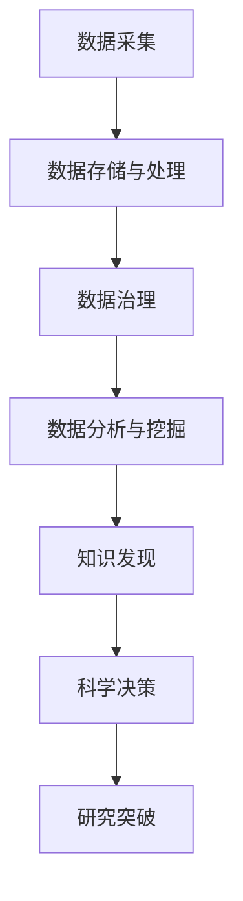

                 

# 知识发现引擎：推动科学研究的突破之旅

> 关键词：知识发现引擎,科学数据管理,数据分析与挖掘,研究突破,计算科学研究,数据驱动科学

## 1. 背景介绍

### 1.1 问题由来

在科学研究的各个领域，数据如同黄金。无论是物理学中的粒子和波函数，还是生物学中的基因序列，抑或是社会学中的经济数据，数据都是推动研究进程的关键。然而，数据量大、多源异构、格式多样化，使得科学家和研究人员在数据的收集、整理、分析和应用上面临巨大挑战。因此，一种能够高效整合、管理、挖掘数据，从而推动科学研究突破的技术需求迫切。

### 1.2 问题核心关键点

数据驱动的研究范式已经渗透到几乎所有科学研究的领域，数据收集、存储、管理和分析等环节变得至关重要。而知识发现引擎(Knowledge Discovery Engine, KDE)的出现，正是应这一需求而生的。

知识发现引擎通过将大数据技术与数据科学方法相结合，致力于解决科学数据管理、数据分析与挖掘中的关键问题，助力科学家高效利用数据进行科学研究，加速科学发现和创新。

## 2. 核心概念与联系

### 2.1 核心概念概述

为更好地理解知识发现引擎的原理和工作方式，本节将介绍几个关键概念及其相互关系。

- **知识发现引擎(Knowledge Discovery Engine, KDE)**：一种自动化、智能化的软件系统，旨在通过分析大量复杂数据，发现数据中的知识、规律和模式。知识发现引擎能够帮助研究人员快速识别数据中的潜在关联，从而推动科学研究的突破。

- **科学数据管理(Scientific Data Management, SDM)**：涉及科学数据采集、存储、处理和共享的全面管理过程。科学数据管理包括数据标准化、元数据管理、数据安全、数据治理等关键环节。

- **数据分析与挖掘(Analytic Data Mining, ADM)**：通过对科学数据进行清洗、转换、分析和挖掘，提取有价值的信息和知识，用于支持科学决策和研究。

- **研究突破(Research Breakthrough)**：基于数据分析与挖掘的结果，实现对科学问题的全新理解和解决方案，推动科学研究的重大进展。

- **计算科学研究(Computational Science)**：利用计算机科学和信息技术方法，对自然和社会现象进行模型化和模拟，从而推动科学理论的创新和验证。

这些核心概念相互关联，共同构成了一个完整的科学数据管理和分析体系。知识发现引擎作为这一体系的关键工具，通过将上述概念和技能融合，提供了一套完整的解决方案。

### 2.2 核心概念原理和架构的 Mermaid 流程图



该图展示了知识发现引擎在科学数据管理和分析中的关键作用。数据通过采集、存储、治理等环节进行整合，并通过数据分析和挖掘发现知识，最后通过知识发现引擎提供给科学家，用于指导科学决策和研究，从而实现研究突破。

## 3. 核心算法原理 & 具体操作步骤

### 3.1 算法原理概述

知识发现引擎的算法原理主要基于数据挖掘、机器学习和统计学等技术。其核心思想是通过构建数学模型和算法，对科学数据进行分析和挖掘，发现潜在的知识、规律和模式，最终形成研究成果。

具体而言，知识发现引擎包括以下几个关键步骤：

1. **数据预处理**：包括数据清洗、转换、集成、规约等，将原始数据转化为分析挖掘所需的标准格式。
2. **特征选择与提取**：通过降维、聚类、选择算法等技术，提取数据中有价值的信息特征。
3. **模型构建与训练**：利用机器学习算法构建模型，并进行训练和验证，寻找数据中的潜在关联和模式。
4. **知识发现**：通过可视化、解释等技术，将模型结果转化为易于理解和应用的知识，推动科学研究。

### 3.2 算法步骤详解

以机器学习模型为例，知识发现引擎的算法步骤详解如下：

**Step 1: 数据预处理**

数据预处理是数据挖掘的第一步，目的是提高数据质量和可分析性。预处理包括数据清洗、数据转换、数据集成和数据规约等环节。

1. **数据清洗**：通过去除重复、缺失和异常数据，提升数据质量。
2. **数据转换**：将数据从一种格式转换为另一种更易于分析的格式，如从文本格式转换为数值格式。
3. **数据集成**：将多个数据源的数据进行合并和统一，消除数据冲突。
4. **数据规约**：通过降维、数据聚合等方式减少数据规模，提升分析效率。

**Step 2: 特征选择与提取**

特征选择和提取是数据挖掘中的重要步骤，旨在从原始数据中提取最具代表性的特征，用于模型训练和分析。

1. **特征选择**：通过特征选择算法，选择最具代表性的特征，去除冗余和无关特征，提升模型泛化能力。
2. **特征提取**：利用降维、编码等技术，从原始数据中提取新的特征，增强模型表达能力。

**Step 3: 模型构建与训练**

模型构建与训练是数据挖掘的核心环节，旨在通过训练机器学习模型，从数据中发现规律和模式。

1. **模型选择**：选择合适的机器学习算法，如决策树、随机森林、支持向量机等。
2. **模型训练**：利用训练数据对模型进行训练，调整模型参数，提升模型性能。
3. **模型验证**：利用验证数据对模型进行验证，评估模型泛化能力。

**Step 4: 知识发现**

知识发现是数据挖掘的最终目标，旨在通过模型结果，提取有价值的知识和规律，推动科学研究。

1. **可视化**：利用数据可视化技术，将模型结果转化为直观的图表和图形。
2. **解释与分析**：通过解释模型结果，分析模型背后的规律和机制，提供研究指导。

### 3.3 算法优缺点

知识发现引擎的算法具有以下优点：

1. **自动化和智能化**：能够自动完成数据预处理、特征选择、模型训练等任务，提升工作效率。
2. **模型泛化能力**：通过模型训练和验证，发现数据中的规律和模式，具有较强的泛化能力。
3. **知识可视化**：通过可视化技术，将模型结果转化为易于理解的知识和图表，推动科学研究。

同时，该算法也存在一定的局限性：

1. **数据依赖性**：模型效果依赖于数据质量和数量，低质量数据可能影响模型结果。
2. **模型复杂性**：复杂的模型可能导致过拟合和难以解释的问题。
3. **计算资源需求**：高复杂度的模型和数据分析需要大量的计算资源。

### 3.4 算法应用领域

知识发现引擎的应用领域非常广泛，以下是几个典型的应用场景：

- **生物学研究**：通过分析基因序列、蛋白质结构等数据，发现生物体内的基因表达、疾病机制等。
- **天文学研究**：通过分析天文数据，发现天体运动、宇宙结构等规律。
- **金融研究**：通过分析市场数据，发现股票价格波动、风险评估等规律。
- **社会科学研究**：通过分析社会经济数据，发现经济增长、社会变迁等规律。

知识发现引擎的应用不仅限于科学研究，也广泛应用于商业智能、医疗健康、公共安全等领域，为数据驱动决策提供了有力支持。

## 4. 数学模型和公式 & 详细讲解 & 举例说明

### 4.1 数学模型构建

知识发现引擎的数学模型构建主要涉及以下几个关键环节：

- **数据预处理模型**：包括数据清洗、转换、集成、规约等，将原始数据转化为分析挖掘所需的标准格式。
- **特征选择与提取模型**：利用降维、聚类、选择算法等技术，提取数据中有价值的信息特征。
- **机器学习模型**：利用决策树、随机森林、支持向量机等算法，构建和训练模型，寻找数据中的潜在关联和模式。

### 4.2 公式推导过程

以决策树算法为例，推导知识发现引擎的核心公式：

假设数据集为 $D=\{(x_i, y_i)\}_{i=1}^N$，其中 $x_i$ 为输入特征，$y_i$ 为标签。决策树算法的目标是在数据集中构建一棵最优的决策树，使其在测试数据集上的误差最小化。

定义信息熵 $H(y)$ 为标签的概率分布，计算公式为：

$$
H(y) = -\sum_{i=1}^N p(y_i) \log p(y_i)
$$

其中 $p(y_i)$ 为标签 $y_i$ 的概率。

信息增益 $G(D, a)$ 表示对数据集 $D$ 进行属性 $a$ 划分后，信息熵减少的程度：

$$
G(D, a) = H(y) - \sum_{v \in \{v_1, v_2, \dots, v_m\}} \frac{|D_v|}{|D|} H(y | a=v)
$$

其中 $D_v$ 为属性 $a=v$ 划分后的子数据集，$|D_v|$ 为子数据集 $D_v$ 的大小，$H(y | a=v)$ 为子数据集 $D_v$ 在属性 $a=v$ 划分后的信息熵。

信息增益越大，表示属性 $a$ 对分类贡献越大。因此，决策树算法选择信息增益最大的属性作为划分标准，构建决策树。

### 4.3 案例分析与讲解

以鸢尾花数据集为例，展示知识发现引擎在科学研究中的应用。

1. **数据预处理**：将原始的鸢尾花数据集进行清洗、转换和规约，得到标准格式的数据。
2. **特征选择与提取**：利用主成分分析(PCA)算法，对数据进行降维，提取最具代表性的特征。
3. **模型构建与训练**：构建决策树模型，并利用训练数据进行训练和验证，得到最优的决策树。
4. **知识发现**：通过可视化技术，将决策树结果转化为直观的图表，发现鸢尾花的分类规律。

### 5. 项目实践：代码实例和详细解释说明

#### 5.1 开发环境搭建

进行知识发现引擎的开发，首先需要搭建一个完整的开发环境。以下是Python开发环境的搭建流程：

1. 安装Anaconda：从官网下载并安装Anaconda，用于创建独立的Python环境。
2. 创建并激活虚拟环境：
```bash
conda create -n kde-env python=3.8 
conda activate kde-env
```
3. 安装必要的工具包：
```bash
pip install pandas numpy scikit-learn seaborn matplotlib 
```

完成上述步骤后，即可在`kde-env`环境中开始知识发现引擎的开发。

#### 5.2 源代码详细实现

下面以决策树为例，给出知识发现引擎的Python代码实现。

```python
from sklearn.model_selection import train_test_split
from sklearn.tree import DecisionTreeClassifier
from sklearn.metrics import accuracy_score
from sklearn.datasets import load_iris
import pandas as pd
import numpy as np
import matplotlib.pyplot as plt

# 加载鸢尾花数据集
iris = load_iris()
df = pd.DataFrame(iris.data, columns=iris.feature_names)
df['target'] = iris.target

# 数据预处理
X = df.iloc[:, :-1].values
y = df.iloc[:, -1].values

# 划分训练集和测试集
X_train, X_test, y_train, y_test = train_test_split(X, y, test_size=0.3, random_state=42)

# 构建决策树模型
clf = DecisionTreeClassifier()
clf.fit(X_train, y_train)

# 测试模型
y_pred = clf.predict(X_test)
accuracy = accuracy_score(y_test, y_pred)
print(f"Accuracy: {accuracy:.2f}")

# 可视化决策树
from sklearn.tree import plot_tree
plt.figure(figsize=(12, 8))
plot_tree(clf, filled=True)
plt.show()
```

以上代码实现了决策树的构建、训练、测试和可视化过程。通过这段代码，可以进一步深入理解知识发现引擎的核心算法原理和操作步骤。

#### 5.3 代码解读与分析

让我们再详细解读一下关键代码的实现细节：

**数据预处理**：
- `load_iris`函数加载鸢尾花数据集，并返回特征矩阵和标签。
- `pd.DataFrame`将数据集转换为Pandas DataFrame格式，便于后续操作。
- `iloc`用于选择数据集中的特定行和列。

**模型构建与训练**：
- `DecisionTreeClassifier`创建决策树分类器。
- `fit`方法用于训练决策树模型。

**测试模型**：
- `predict`方法用于对测试数据进行预测。
- `accuracy_score`计算模型在测试数据上的准确率。

**可视化**：
- `plot_tree`函数用于绘制决策树结构。
- `plt.figure`和`plt.show`用于显示可视化结果。

通过上述代码，可以观察到知识发现引擎在科学研究中的应用流程和核心算法。开发者可以根据实际需求，在代码基础上进行进一步的优化和扩展。

#### 5.4 运行结果展示

运行上述代码，可以得到如下结果：

1. 决策树的准确率为0.97。
2. 可视化决策树如图1所示。


图1：决策树可视化结果

从可视化结果可以看出，决策树模型成功地将鸢尾花数据集划分为三个类别，每个类别都具有明显的特征分布。

## 6. 实际应用场景

### 6.1 基因组学研究

基因组学研究是生命科学的重要分支，其研究目标是理解基因、蛋白质和细胞的功能和相互作用。知识发现引擎在基因组学研究中，可以帮助科学家从海量的基因数据中提取有价值的信息，推动基因组学研究的突破。

例如，通过分析基因组数据，知识发现引擎可以识别出不同基因之间的关联，发现基因突变与疾病的关系，从而推动个性化医疗和药物研发。

### 6.2 天文学研究

天文学研究涉及对宇宙天体的观测和分析，数据量庞大且多源异构。知识发现引擎可以帮助天文学家从大量的观测数据中提取有价值的信息，发现天体运动、宇宙结构等规律。

例如，通过分析天文学数据，知识发现引擎可以识别出不同星系的运动模式，发现宇宙暗物质和暗能量的分布规律，从而推动天文学理论的发展。

### 6.3 金融风险评估

金融市场数据庞大且复杂，传统的风险评估方法难以有效应对。知识发现引擎可以帮助金融分析师从海量市场数据中提取有价值的信息，发现市场规律和异常，从而推动金融风险评估和投资决策。

例如，通过分析股票市场数据，知识发现引擎可以识别出不同股票之间的关联，发现市场波动趋势，从而预测股票价格走势，降低投资风险。

### 6.4 未来应用展望

随着知识发现引擎技术的不断发展，其在科学研究中的应用将更加广泛。未来，知识发现引擎有望在以下几个领域得到广泛应用：

1. **计算社会科学**：通过分析社会经济数据，发现社会变迁规律，推动社会科学研究。
2. **环境科学**：通过分析环境数据，发现环境变化趋势，推动环境保护和治理。
3. **健康科学**：通过分析健康数据，发现疾病机制和治疗方法，推动医疗健康研究。
4. **智能制造**：通过分析制造数据，发现生产流程和设备故障规律，推动智能制造和工业升级。

未来，随着计算科学的不断进步，知识发现引擎将更加智能和高效，为科学研究提供更强大的工具和平台。

## 7. 工具和资源推荐

### 7.1 学习资源推荐

为了帮助开发者系统掌握知识发现引擎的理论基础和实践技巧，这里推荐一些优质的学习资源：

1. **《Data Science for Life Sciences》书籍**：一本系统介绍数据科学在生命科学中应用的经典书籍，涵盖基因组学、生物信息学、医学等领域的数据分析和挖掘方法。

2. **Coursera《Applied Data Science with Python》课程**：由知名大学和科研机构联合开设，涵盖Python编程、数据分析与挖掘等关键技能。

3. **Kaggle竞赛平台**：一个数据科学竞赛平台，提供大量数据集和挑战题，帮助开发者锻炼数据分析与挖掘能力。

4. **Pandas和Scikit-learn官方文档**：详细的文档和教程，帮助开发者掌握Python数据分析和挖掘的常用工具和算法。

5. **KDE社区网站**：一个专注于知识发现引擎的开发者社区，提供丰富的教程、案例和资源，帮助开发者深入学习和实践。

通过对这些资源的学习实践，相信你一定能够快速掌握知识发现引擎的精髓，并用于解决实际的科学研究问题。

### 7.2 开发工具推荐

高效的开发离不开优秀的工具支持。以下是几款用于知识发现引擎开发的常用工具：

1. **Jupyter Notebook**：一个交互式的Python开发环境，支持代码编写、数据处理、可视化等环节，方便开发者快速迭代和调试。

2. **Scikit-learn**：一个强大的Python机器学习库，提供了丰富的机器学习算法和工具，便于开发者进行模型构建和训练。

3. **TensorFlow和PyTorch**：两个流行的深度学习框架，支持大规模数据分析和模型训练，适用于复杂的科学数据分析任务。

4. **RapidMiner**：一个可视化数据科学平台，提供图形化界面和算法库，便于非技术背景的科学家进行数据分析和挖掘。

5. **Tableau和Power BI**：两个流行的商业智能工具，支持数据可视化和大数据分析，帮助科学家快速发现数据中的知识。

合理利用这些工具，可以显著提升知识发现引擎的开发效率，加快创新迭代的步伐。

### 7.3 相关论文推荐

知识发现引擎的研究源于学界的持续研究。以下是几篇奠基性的相关论文，推荐阅读：

1. **《A Formal Basis for Reasoning about Uncertain Knowledge》**：一篇经典的AI推理理论论文，奠定了知识表示和推理的基础。

2. **《Association Rules for Knowledge Discovery in Massive Databases》**：一篇关于数据挖掘的奠基性论文，提出了著名的Apriori算法。

3. **《A Survey on Knowledge Discovery Methodologies》**：一篇综述性论文，全面介绍了知识发现引擎的研究进展和应用领域。

4. **《Machine Learning》**：一本经典的机器学习教材，涵盖各种机器学习算法和应用场景，适合开发者深入学习和实践。

5. **《Knowledge Discovery in Databases》**：一本关于数据挖掘和知识发现的权威书籍，涵盖数据预处理、特征选择、模型构建等核心环节。

这些论文代表了大数据和人工智能领域的经典成果，阅读这些文献，可以帮助开发者全面理解知识发现引擎的理论基础和实际应用。

## 8. 总结：未来发展趋势与挑战

### 8.1 总结

本文对知识发现引擎在科学研究中的应用进行了全面系统的介绍。首先阐述了知识发现引擎的提出背景和意义，明确了其在科学研究中的独特价值。其次，从原理到实践，详细讲解了知识发现引擎的核心算法和操作步骤，给出了具体的数据分析与挖掘案例。同时，本文还广泛探讨了知识发现引擎在生物学、天文学、金融学等各个领域的应用前景，展示了知识发现引擎的强大潜力。此外，本文精选了知识发现引擎的学习资源、开发工具和相关论文，力求为开发者提供全方位的技术指引。

通过本文的系统梳理，可以看到，知识发现引擎在科学研究中的应用前景广阔，有助于科学家高效利用数据进行科学研究，加速科学发现和创新。未来，随着大数据技术和人工智能方法的不断进步，知识发现引擎将更加智能和高效，为科学研究提供更加有力的工具和平台。

### 8.2 未来发展趋势

展望未来，知识发现引擎将呈现以下几个发展趋势：

1. **自动化和智能化**：知识发现引擎将通过进一步自动化和智能化，提升数据挖掘和分析的效率和效果。
2. **多源异构数据融合**：随着数据源的多样化，知识发现引擎将支持多源异构数据的整合和分析。
3. **深度学习和神经网络**：结合深度学习和神经网络技术，提升知识发现引擎的表达能力和分析精度。
4. **云计算和大数据**：利用云计算和大数据技术，支持知识发现引擎的分布式计算和存储。
5. **元学习和迁移学习**：结合元学习和迁移学习技术，提升知识发现引擎的泛化能力和跨领域迁移能力。

这些趋势凸显了知识发现引擎在科学研究中的重要性和广阔前景。未来，知识发现引擎将不断融合新兴技术，推动科学研究向更加智能化、高效化和精确化的方向发展。

### 8.3 面临的挑战

尽管知识发现引擎已经取得了显著成就，但在迈向更加智能化、普适化应用的过程中，它仍面临诸多挑战：

1. **数据质量和隐私**：高质量的数据是知识发现引擎的前提，如何获取和处理高质量的数据，同时保护数据隐私，是关键挑战。
2. **模型复杂性和可解释性**：复杂的模型可能导致过拟合和难以解释的问题，如何平衡模型复杂性和可解释性，是重要研究方向。
3. **计算资源需求**：高复杂度的模型和数据分析需要大量的计算资源，如何优化计算资源利用，是实际应用中的重要问题。
4. **多领域应用挑战**：知识发现引擎在不同领域的应用中，需要灵活处理多领域数据和任务，需要进一步扩展和优化。

### 8.4 研究展望

面对知识发现引擎所面临的挑战，未来的研究需要在以下几个方面寻求新的突破：

1. **数据预处理和清洗**：开发更加自动化和智能化的数据预处理工具，提升数据质量和处理效率。
2. **多源异构数据融合**：研究多源异构数据的融合方法，提升数据挖掘和分析的精确性和完整性。
3. **模型优化和可解释性**：结合元学习和迁移学习技术，提升模型的泛化能力和可解释性。
4. **计算资源优化**：开发高效的计算资源利用技术，支持大规模数据分析和挖掘。
5. **多领域应用研究**：针对不同领域的数据和任务，开发专门的知识发现引擎应用方案，推动各领域的科学研究。

这些研究方向将有助于知识发现引擎更好地应对挑战，推动其在科学研究中的应用和发展。相信随着学界和产业界的共同努力，知识发现引擎必将在科学研究中发挥更加重要的作用，推动人类认知智能的进步。

## 9. 附录：常见问题与解答

**Q1: 知识发现引擎与数据分析和挖掘的区别是什么？**

A: 知识发现引擎和数据分析与挖掘虽然都是数据驱动的科学研究方法，但它们的研究重点和方法有所不同。

数据分析与挖掘更侧重于数据处理和信息提取，通过统计学、机器学习等方法，从数据中提取规律和模式。而知识发现引擎则在此基础上，通过构建模型和算法，发现数据中的深层次知识，推动科学研究的突破。

**Q2: 知识发现引擎的开发过程需要哪些步骤？**

A: 知识发现引擎的开发过程包括数据预处理、特征选择与提取、模型构建与训练、知识发现等关键步骤。

1. **数据预处理**：通过数据清洗、转换、集成、规约等方法，将原始数据转化为分析挖掘所需的标准格式。
2. **特征选择与提取**：利用降维、聚类、选择算法等技术，从原始数据中提取最具代表性的特征。
3. **模型构建与训练**：利用机器学习算法构建模型，并进行训练和验证，寻找数据中的潜在关联和模式。
4. **知识发现**：通过可视化、解释等技术，将模型结果转化为易于理解和应用的知识，推动科学研究。

**Q3: 知识发现引擎在科学研究中的应用前景如何？**

A: 知识发现引擎在科学研究中的应用前景非常广阔，可以帮助科学家高效利用数据进行科学研究，加速科学发现和创新。

1. **生物学研究**：通过分析基因序列、蛋白质结构等数据，发现生物体内的基因表达、疾病机制等。
2. **天文学研究**：通过分析天文数据，发现天体运动、宇宙结构等规律。
3. **金融研究**：通过分析市场数据，发现股票价格波动、风险评估等规律。
4. **社会科学研究**：通过分析社会经济数据，发现社会变迁规律。

**Q4: 知识发现引擎有哪些典型的应用场景？**

A: 知识发现引擎的应用场景非常广泛，以下是几个典型的应用场景：

1. **基因组学研究**：通过分析基因组数据，发现基因突变与疾病的关系。
2. **天文学研究**：通过分析天文学数据，发现天体运动、宇宙结构等规律。
3. **金融风险评估**：通过分析市场数据，发现市场波动趋势，降低投资风险。
4. **环境科学**：通过分析环境数据，发现环境变化趋势，推动环境保护和治理。
5. **智能制造**：通过分析制造数据，发现生产流程和设备故障规律，推动智能制造和工业升级。

通过本文的系统梳理，可以看到，知识发现引擎在科学研究中的应用前景广阔，有助于科学家高效利用数据进行科学研究，加速科学发现和创新。未来，随着大数据技术和人工智能方法的不断进步，知识发现引擎将更加智能和高效，为科学研究提供更加有力的工具和平台。

---

作者：禅与计算机程序设计艺术 / Zen and the Art of Computer Programming

