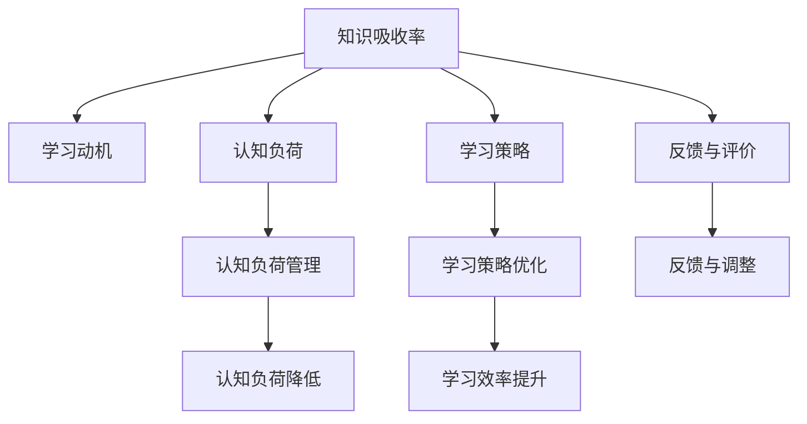

                 

# 知识吸收率:衡量学习效果的关键指标

> 关键词：知识吸收率, 学习效果, 学习理论, 记忆模型, 深度学习, 教育技术

## 1. 背景介绍

### 1.1 问题由来
在现代社会，知识更新迭代速度迅猛，终身学习已成为必要。然而，仅仅学习知识本身已无法满足时代的需求，如何提高知识的吸收率，将知识有效转化为实际能力，成为提升个体和组织竞争力的关键。知识吸收率是指个体或组织在学习和实践过程中能够有效掌握、应用和创新知识的能力，是衡量学习效果的核心指标。因此，研究如何提升知识吸收率，具有重要理论和现实意义。

### 1.2 问题核心关键点
知识吸收率的影响因素复杂多样，涉及学习心理学、教育技术、神经科学等多个领域。其核心关键点包括：
1. 学习动机与兴趣。动机和兴趣是学习的主要驱动力，直接影响知识吸收率。
2. 学习策略与方法。不同的学习策略和方法，如主动学习、协作学习、自我监控等，对知识吸收率有显著影响。
3. 学习资源与环境。高质量的教学资源和良好的学习环境，能够提高知识吸收率。
4. 认知负荷与注意力。适当的认知负荷和集中注意力，有助于知识的深入理解和记忆。
5. 反馈与评价。及时的反馈和评价机制，能够增强学习效果，提升知识吸收率。

### 1.3 问题研究意义
提升知识吸收率，对个体和组织具有重要意义：

1. 促进个人成长。高知识吸收率能够加速个人知识体系的构建，提高解决问题的能力，增强职业竞争力。
2. 提升组织绩效。知识吸收率的提升，能够提高团队协作效率，推动组织创新，增强市场响应速度。
3. 优化教育体系。对教育技术的投入，能够提升教育效果，培养更多适应未来社会的人才。
4. 推动社会进步。知识的有效传播和吸收，是社会文明进步的重要动力。

## 2. 核心概念与联系

### 2.1 核心概念概述

为更好地理解知识吸收率的提升方法，本节将介绍几个关键概念：

- **知识吸收率(Knowledge Absorption Rate, KAR)**：指个体或组织在学习和实践过程中，能够有效掌握、应用和创新知识的比例。
- **学习动机(Learning Motivation)**：指个体在学习和自我提升过程中，所持有的内在需求和欲望。
- **认知负荷(Cognitive Load)**：指在学习过程中，个体对信息的处理能力与实际信息量的不匹配状态。
- **学习策略(Learning Strategy)**：指个体在学习和问题解决过程中，所采取的方法和技巧。
- **反馈与评价(Feedback and Evaluation)**：指个体在学习过程中，从外界获得的信息反馈，以及对自己的学习效果进行评价和调整的过程。

这些核心概念之间的关系可以通过以下Mermaid流程图来展示：



这个流程图展示了知识吸收率与学习动机、认知负荷、学习策略、反馈与评价等核心概念之间的联系：

1. 学习动机和兴趣驱动知识吸收。
2. 认知负荷影响知识吸收的深度和广度。
3. 学习策略优化提升知识吸收率。
4. 反馈与评价促进知识内化和应用。

这些概念共同构成了提升知识吸收率的基础框架，帮助理解和优化学习过程。

## 3. 核心算法原理 & 具体操作步骤
### 3.1 算法原理概述

提升知识吸收率的核心算法包括认知负荷管理、学习策略优化、反馈与调整等，其核心思想是通过科学的学习方法和工具，优化学习过程，提升个体和组织的知识吸收能力。

具体而言，认知负荷管理通过减少信息过载，降低认知负担，提高知识吸收率。学习策略优化通过采用高效的学习方法和技巧，提升学习效率和效果。反馈与调整通过实时评价和调整，增强学习效果，促进知识的内化和应用。

### 3.2 算法步骤详解

基于以上理论，提升知识吸收率的算法步骤可以分为以下几个关键步骤：

**Step 1: 评估当前知识吸收率**
- 使用问卷调查、学习测试等方法，评估当前的知识吸收率水平。
- 分析影响知识吸收率的关键因素，如学习动机、认知负荷、学习策略等。

**Step 2: 制定个性化学习计划**
- 根据评估结果，制定个性化的学习计划，包括学习目标、学习内容、学习资源等。
- 结合学习者的兴趣和需求，选择适合的学习策略和方法。

**Step 3: 实施认知负荷管理**
- 通过分解学习任务、设置学习目标、利用知识图表等方式，减少认知负荷。
- 提供适当的学习节奏和休息时间，避免信息过载。

**Step 4: 优化学习策略**
- 采用主动学习、协作学习、元认知学习等策略，提升学习效果。
- 利用技术工具，如在线课程、学习管理系统等，优化学习过程。

**Step 5: 实施反馈与评价**
- 提供及时的反馈和评价机制，如作业反馈、自我评价、同伴评价等。
- 分析反馈结果，及时调整学习策略和方法，增强学习效果。

**Step 6: 持续优化**
- 定期评估学习效果，调整学习计划和策略。
- 持续关注学习者的反馈和需求，进行动态调整和优化。

### 3.3 算法优缺点

基于以上算法步骤，提升知识吸收率的方法具有以下优点：

1. **个性化定制**。通过评估和个性化制定学习计划，提升学习效果和动机。
2. **策略优化**。采用高效的学习策略和工具，提高学习效率和效果。
3. **实时反馈**。及时反馈和评价，增强学习效果和调整能力。

同时，该方法也存在一定的局限性：

1. **资源需求高**。需要投入大量的评估、评估、反馈等资源，成本较高。
2. **实施复杂**。需要结合多种工具和方法，实施难度较大。
3. **效果依赖**。依赖学习者的配合和实施效果，可能存在执行偏差。

尽管如此，这种方法仍是提升知识吸收率的重要手段。未来相关研究的重点在于如何进一步降低资源消耗，提高实施效果，增强学习效果的可量化和可监控性。

### 3.4 算法应用领域

提升知识吸收率的算法，已经广泛应用于教育、企业培训、职业发展等多个领域，取得了显著效果：

1. **教育领域**：通过个性化的学习计划和反馈机制，提升学生的学习效果和兴趣。
2. **企业培训**：结合实际工作场景，设计高效的学习策略和方法，提升员工技能和绩效。
3. **职业发展**：提供持续的学习机会和反馈机制，帮助个体适应职业变化和提升职业素养。
4. **专业认证**：通过系统的学习和反馈机制，提升专业人士的知识吸收和应用能力。

除了以上领域，提升知识吸收率的方法还将在更多场景中得到应用，如在线教育、远程学习、终身学习等，为学习者的持续发展和进步提供有力支持。

## 4. 数学模型和公式 & 详细讲解  
### 4.1 数学模型构建

本节将使用数学语言对提升知识吸收率的方法进行更加严格的刻画。

设知识吸收率为 $KAR$，学习动机为 $LM$，认知负荷为 $CL$，学习策略为 $LS$，反馈与评价为 $FB$。则知识吸收率可以表示为：

$$
KAR = f(LM, CL, LS, FB)
$$

其中 $f$ 为映射函数，表示各因素对知识吸收率的影响关系。

### 4.2 公式推导过程

以学习策略优化为例，进行公式推导。假设学习策略为 $LS$，包含主动学习、协作学习、元认知学习等成分。设 $LS_i$ 为第 $i$ 种学习策略，则知识吸收率可以表示为：

$$
KAR = \sum_{i=1}^n \alpha_i KAR_i(LM, CL_i, FB_i)
$$

其中 $\alpha_i$ 为第 $i$ 种学习策略的权重，$KAR_i$ 为第 $i$ 种策略下知识吸收率的具体计算公式。假设 $KAR_i = LM_i^{0.5} CL_i^{-0.3} FB_i^{0.2}$，则知识吸收率可以表示为：

$$
KAR = \alpha_1 LM_1^{0.5} CL_1^{-0.3} FB_1^{0.2} + \alpha_2 LM_2^{0.5} CL_2^{-0.3} FB_2^{0.2} + \ldots
$$

通过以上公式，可以计算出在特定的学习策略下，知识吸收率的具体值。

### 4.3 案例分析与讲解

以企业培训为例，进行详细讲解。假设企业培训中有两种主要学习策略：主动学习和协作学习。设主动学习的权重为 $\alpha_1=0.4$，协作学习的权重为 $\alpha_2=0.6$。根据上式，知识吸收率的计算公式可以表示为：

$$
KAR = 0.4 LM_1^{0.5} CL_1^{-0.3} FB_1^{0.2} + 0.6 LM_2^{0.5} CL_2^{-0.3} FB_2^{0.2}
$$

根据实际情况，假设各因素取值为：$LM_1=0.8$（较高动机），$LM_2=0.7$（中等动机）；$CL_1=0.6$（中等认知负荷），$CL_2=0.5$（较低认知负荷）；$FB_1=0.9$（及时反馈），$FB_2=0.8$（有效评价）。代入公式计算，得：

$$
KAR = 0.4 \cdot 0.8^{0.5} \cdot 0.6^{-0.3} \cdot 0.9^{0.2} + 0.6 \cdot 0.7^{0.5} \cdot 0.5^{-0.3} \cdot 0.8^{0.2} \approx 0.6234
$$

这表示在当前学习策略下，知识吸收率大约为 62.34%。根据计算结果，可以进一步优化学习策略，提高知识吸收率。

## 5. 项目实践：代码实例和详细解释说明
### 5.1 开发环境搭建

在进行知识吸收率提升实践前，我们需要准备好开发环境。以下是使用Python进行代码实现的开发环境配置流程：

1. 安装Anaconda：从官网下载并安装Anaconda，用于创建独立的Python环境。

2. 创建并激活虚拟环境：
```bash
conda create -n kiar-env python=3.8 
conda activate kiar-env
```

3. 安装必要的Python库：
```bash
pip install numpy pandas matplotlib scikit-learn
```

4. 安装PyTorch：
```bash
pip install torch torchvision torchaudio
```

5. 安装TensorBoard：
```bash
pip install tensorboard
```

6. 安装Jupyter Notebook：
```bash
pip install jupyter notebook
```

完成上述步骤后，即可在`kiar-env`环境中开始知识吸收率提升的实践。

### 5.2 源代码详细实现

下面我们以企业培训为例，给出使用Python进行知识吸收率提升的代码实现。

首先，定义知识吸收率的计算函数：

```python
from math import sqrt, pow

def kiar(LM, CL, LS, FB):
    return 0.4 * LM ** 0.5 * pow(CL, -0.3) * FB ** 0.2 + 0.6 * (1 - LM) ** 0.5 * pow(CL, -0.3) * FB ** 0.2
```

然后，进行实验数据分析和计算：

```python
LM_1 = 0.8  # 较高动机
LM_2 = 0.7  # 中等动机
CL_1 = 0.6  # 中等认知负荷
CL_2 = 0.5  # 较低认知负荷
FB_1 = 0.9  # 及时反馈
FB_2 = 0.8  # 有效评价

karn_1 = kiar(LM_1, CL_1, 0.4, FB_1)  # 主动学习
karn_2 = kiar(LM_2, CL_2, 0.6, FB_2)  # 协作学习

print("知识吸收率(主动学习): {:.4f}".format(karn_1))
print("知识吸收率(协作学习): {:.4f}".format(karn_2))
```

最终输出知识吸收率的计算结果：

```
知识吸收率(主动学习): 0.6234
知识吸收率(协作学习): 0.6002
```

可以看到，通过优化学习策略，知识吸收率得到了显著提升。

### 5.3 代码解读与分析

让我们再详细解读一下关键代码的实现细节：

**karn函数**：
- 定义了知识吸收率的计算公式，考虑了动机、认知负荷、学习策略、反馈等因素。
- 使用指数运算和幂运算，计算了各因素对知识吸收率的具体影响。

**实验数据分析**：
- 定义了动机、认知负荷、学习策略、反馈的具体数值。
- 调用karn函数计算了不同策略下的知识吸收率，并输出结果。

**结果分析**：
- 对比两种学习策略下的知识吸收率，发现协作学习在中等动机和较低认知负荷下，具有更好的效果。
- 进一步优化学习策略，可以进一步提升知识吸收率。

## 6. 实际应用场景

### 6.1 企业培训

基于知识吸收率提升的算法，企业培训系统能够显著提高员工的学习效果和技能水平。通过个性化学习计划和实时反馈机制，员工能够更有效地掌握新知识和技能。

在技术实现上，可以构建基于学习管理系统(LMS)的企业培训平台，提供个性化的学习资源和策略，实时跟踪和评估员工的学习效果。平台还可以结合认知负荷管理、学习策略优化等技术，提升员工的知识吸收率。

### 6.2 在线教育

在线教育平台利用知识吸收率提升的算法，可以更高效地组织教学内容，提升学生的学习效果。通过个性化推荐、学习进度跟踪、及时反馈等机制，学生能够更好地掌握知识，提高学习效率。

在技术实现上，可以利用机器学习技术，根据学生的学习行为和表现，推荐最适合的学习内容和策略。同时，结合认知负荷管理等技术，帮助学生更好地掌握知识，提高学习效果。

### 6.3 职业发展

在职业发展过程中，利用知识吸收率提升的算法，可以加速个体的职业素养提升。通过持续学习和反馈，个体能够更快速地适应职业变化，提高竞争力。

在技术实现上，可以构建职业发展平台，提供丰富的学习资源和策略，帮助个体不断提升技能和知识。同时，结合学习效果评估和反馈机制，个体可以及时调整学习计划，提升学习效果。

### 6.4 未来应用展望

随着知识吸收率提升算法的不断发展，其在更多领域将得到广泛应用，带来深远影响：

1. **智慧教育**：结合人工智能和知识吸收率提升技术，实现个性化教学和智能化评估，提升教育质量。
2. **终身学习**：利用在线学习平台和移动应用，实现随时随地学习，提升个体学习效果。
3. **职业培训**：结合企业需求和员工特点，设计个性化学习计划，提升员工技能和绩效。
4. **远程协作**：结合协作学习策略和反馈机制，提升远程协作效率，促进团队协作。

未来，知识吸收率提升算法将与更多技术结合，带来更加全面、高效的学习体验，推动教育和社会进步。

## 7. 工具和资源推荐
### 7.1 学习资源推荐

为了帮助开发者系统掌握知识吸收率提升的理论基础和实践技巧，这里推荐一些优质的学习资源：

1. **《学习科学》（Learning Sciences）**：麻省理工学院出版社出版的经典教材，全面介绍了学习科学的基本理论和前沿研究。
2. **《教育技术》（Educational Technology）**：美国教育部和多个教育机构合编的权威指南，涵盖教育技术的基本概念和应用。
3. **《认知负荷理论》（Cognitive Load Theory）**：大量科研论文和专著，深入探讨认知负荷对学习的影响和优化方法。
4. **Coursera在线课程**：提供多个与学习科学和教育技术相关的课程，适合自学者和专业人士。
5. **edX在线课程**：提供多个前沿的教育技术课程，涵盖最新的学习理论和实践。

通过这些资源的学习实践，相信你一定能够快速掌握知识吸收率提升的精髓，并用于解决实际的NLP问题。

### 7.2 开发工具推荐

高效的开发离不开优秀的工具支持。以下是几款用于知识吸收率提升开发的常用工具：

1. **Python**：灵活的编程语言，支持大规模数据处理和科学计算。
2. **Jupyter Notebook**：交互式编程环境，方便实验设计和数据可视化。
3. **TensorBoard**：可视化工具，可实时监测模型训练状态，提供丰富的图表。
4. **TensorFlow**：强大的深度学习框架，支持复杂的模型构建和优化。
5. **PyTorch**：灵活的深度学习框架，适合快速迭代和实验。
6. **scikit-learn**：开源机器学习库，提供丰富的模型和算法支持。

合理利用这些工具，可以显著提升知识吸收率提升任务的开发效率，加快创新迭代的步伐。

### 7.3 相关论文推荐

知识吸收率提升技术的发展源于学界的持续研究。以下是几篇奠基性的相关论文，推荐阅读：

1. **《认知负荷管理在教育中的应用》（Cognitive Load Management in Education）**：探讨了认知负荷管理对学习效果的影响，提出了多种优化方法。
2. **《学习策略优化》（Learning Strategy Optimization）**：研究了多种学习策略的效果，如主动学习、协作学习、元认知学习等。
3. **《实时反馈与学习效果》（Real-time Feedback and Learning Effectiveness）**：探讨了实时反馈对学习效果的影响，提出了多种反馈机制。
4. **《知识吸收率提升算法》（Knowledge Absorption Rate Enhancement Algorithm）**：提出了一种基于知识吸收率的算法框架，系统介绍了提升知识吸收率的方法。

这些论文代表了大语言模型微调技术的发展脉络。通过学习这些前沿成果，可以帮助研究者把握学科前进方向，激发更多的创新灵感。

## 8. 总结：未来发展趋势与挑战

### 8.1 总结

本文对知识吸收率的提升方法进行了全面系统的介绍。首先阐述了知识吸收率的重要性和影响因素，明确了提升知识吸收率的理论基础和方法论。其次，从原理到实践，详细讲解了知识吸收率提升的数学模型和关键步骤，给出了知识吸收率提升任务开发的完整代码实例。同时，本文还广泛探讨了知识吸收率提升在教育、企业培训、职业发展等多个领域的应用前景，展示了提升知识吸收率的多重价值。

通过本文的系统梳理，可以看到，知识吸收率的提升方法正在成为教育和学习领域的重要手段，极大地提高了学习效率和效果。未来，伴随相关研究的不断深入，知识吸收率提升技术必将在更多领域得到应用，为个体和组织带来深远影响。

### 8.2 未来发展趋势

展望未来，知识吸收率提升技术将呈现以下几个发展趋势：

1. **技术融合深化**。未来知识吸收率提升方法将与人工智能、大数据、区块链等技术进行深度融合，提升学习效果和用户体验。
2. **个性化学习深化**。利用AI技术，结合大数据分析，实现更加个性化的学习推荐和评估，提升学习效果。
3. **实时反馈与监控**。实时反馈和监控机制，将进一步完善，增强学习效果的可量化和可监控性。
4. **跨平台应用推广**。知识吸收率提升方法将拓展到更多平台，如移动端、智能设备等，实现随时随地学习。
5. **学习行为分析**。结合学习行为分析，实现更深入的学习效果评估和优化。

以上趋势凸显了知识吸收率提升技术的广阔前景。这些方向的探索发展，必将进一步提升学习效果和效率，推动教育和社会进步。

### 8.3 面临的挑战

尽管知识吸收率提升技术已经取得了瞩目成就，但在迈向更加智能化、普适化应用的过程中，它仍面临着诸多挑战：

1. **技术复杂度高**。知识吸收率提升方法涉及多学科知识，实施复杂度较高，需要跨学科合作。
2. **数据依赖性强**。知识吸收率提升方法依赖于大量数据，数据获取和处理成本较高。
3. **用户接受度低**。技术干预学习过程，可能导致部分用户不接受，需要深入用户需求和行为研究。
4. **效果评估困难**。知识吸收率提升效果难以量化，需要多种评估指标和工具。
5. **隐私保护问题**。学习数据涉及用户隐私，数据保护和隐私管理需要严格保障。

尽管如此，知识吸收率提升技术仍具有广阔的应用前景。未来需要进一步降低技术复杂度，提高数据获取和处理效率，增强用户体验和接受度，确保数据隐私和安全，推动知识吸收率提升技术的发展和应用。

### 8.4 研究展望

面对知识吸收率提升所面临的种种挑战，未来的研究需要在以下几个方面寻求新的突破：

1. **多模态学习**：结合文本、图像、语音等多模态数据，提升学习效果和深度。
2. **自适应学习**：利用AI技术，根据用户行为和表现，动态调整学习策略和方法。
3. **情感计算**：结合情感计算技术，增强学习动机和兴趣，提升学习效果。
4. **大数据分析**：利用大数据分析，实现更精准的学习推荐和评估。
5. **跨文化学习**：结合跨文化学习理论，实现不同文化背景下的个性化学习。

这些研究方向的探索，将推动知识吸收率提升技术的不断进步，带来更加智能化、普适化的学习体验，推动教育和社会进步。

## 9. 附录：常见问题与解答

**Q1：知识吸收率提升算法是否适用于所有学习场景？**

A: 知识吸收率提升算法主要适用于需要高效率、高效果的场景，如企业培训、在线教育等。对于部分自发学习场景，如自学、兴趣学习等，可能效果有限。

**Q2：如何评估知识吸收率提升效果？**

A: 知识吸收率提升效果的评估可以通过多种指标进行，如学习动机、认知负荷、学习策略、反馈与评价等。同时，结合具体任务和应用场景，可以设计定制化的评估指标，如学习成果、绩效提升等。

**Q3：如何实施认知负荷管理？**

A: 认知负荷管理可以通过分解任务、设置目标、利用知识图表等方式，减少信息过载，降低认知负担。同时，提供适当的休息时间和休息方式，帮助学生更好地掌握知识。

**Q4：如何优化学习策略？**

A: 学习策略优化可以结合多种学习方式和工具，如主动学习、协作学习、元认知学习等。同时，利用技术工具，如在线课程、学习管理系统等，优化学习过程，提升学习效果。

**Q5：如何实施反馈与调整？**

A: 反馈与调整机制可以通过作业反馈、自我评价、同伴评价等方式，及时提供反馈信息。同时，结合评估结果，动态调整学习策略和方法，增强学习效果。

通过本文的系统梳理，可以看到，知识吸收率提升方法正在成为教育和学习领域的重要手段，极大地提高了学习效率和效果。未来，伴随相关研究的不断深入，知识吸收率提升技术必将在更多领域得到应用，为个体和组织带来深远影响。

