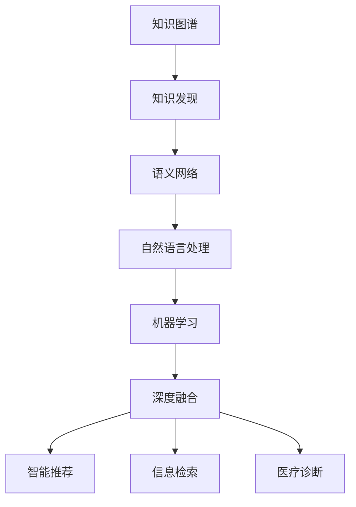

                 

# 知识图谱与知识发现的深度融合

> 关键词：知识图谱,知识发现,深度融合,AI,大数据,自然语言处理(NLP),语义网络,机器学习

## 1. 背景介绍

### 1.1 问题由来
近年来，随着大数据和人工智能技术的飞速发展，知识图谱和知识发现（Knowledge Discovery）已成为多学科交叉融合的热点领域。知识图谱是一种基于图结构的语义化知识表示形式，它通过将现实世界中的实体和它们之间的关联映射为图结构，为人类理解、描述和处理复杂世界提供了全新的视角和方法。知识图谱的构建和维护是知识发现的重要步骤，它帮助人们从海量数据中提取出有价值的知识，提升智能系统的决策能力。

然而，传统知识图谱的构建往往依赖于人工标注，费时费力且难以覆盖广泛领域，限制了知识图谱的应用范围和深度。而知识发现则是一个从数据中自动挖掘模式和知识的过程，它的目标是发现数据中的潜在价值，通过算法和模型提取知识的结构化和有意义的表示。虽然知识发现能够自动发现知识，但也需要大量数据和精细的模型设计，才能得到高质量的知识表示。

因此，将知识图谱与知识发现相结合，利用知识图谱的结构化和语义性，增强知识发现的自动化和智能化，成为当前研究的重要方向。本文旨在探讨知识图谱与知识发现的深度融合，从理论和实践两个层面，提供系统的解决方案，以促进其在实际应用中的广泛应用。

### 1.2 问题核心关键点
知识图谱与知识发现的深度融合，核心在于如何构建高效、智能的知识图谱，并在此基础上进行知识发现。具体包括以下几个关键点：

1. **知识图谱构建**：如何从大规模数据中自动提取实体和关系，构建结构化和语义化的知识表示。
2. **知识发现算法**：设计有效的算法，自动发现数据中的知识模式和关联，生成高质量的知识图谱。
3. **融合策略**：如何在知识图谱和知识发现之间建立协同机制，使两者的优势互补。
4. **应用场景**：探讨知识图谱与知识发现在智能推荐、信息检索、医疗诊断等实际应用中的具体应用，展示其潜力。

### 1.3 问题研究意义
知识图谱与知识发现的深度融合，对提升信息处理和智能决策水平，具有重要意义：

1. **数据驱动决策**：通过自动化的知识发现，从海量数据中提取出有价值的知识，辅助决策者进行数据驱动的决策，减少人为偏见。
2. **智能化服务**：在推荐系统、智能问答等应用中，基于知识图谱和知识发现的融合，提供更加智能、个性化的服务，提升用户体验。
3. **跨领域应用**：知识图谱和知识发现可以跨领域应用，如医疗、金融、教育等领域，解决复杂多变的实际问题，推动相关领域的智能化转型。
4. **知识复用**：知识图谱和知识发现可以复用已有知识，加速新知识的发现和应用，提升研究效率。
5. **语义网络推理**：知识图谱和知识发现结合语义网络推理，增强系统的逻辑推理能力，提升决策的精确度和可靠性。

## 2. 核心概念与联系

### 2.1 核心概念概述

为更好地理解知识图谱与知识发现的深度融合，本节将介绍几个关键概念及其相互关系：

- **知识图谱(Knowledge Graph)**：一种基于图结构的语义化知识表示形式，通过实体和关系将世界知识抽象为网络结构，帮助理解和描述复杂的知识系统。
- **知识发现(Knowledge Discovery)**：从大规模数据中自动挖掘模式和知识的过程，通过算法和模型提取知识的结构化和有意义的表示。
- **深度融合(Deep Fusion)**：将知识图谱与知识发现进行深度集成，利用知识图谱的结构化和语义性，增强知识发现的自动化和智能化。
- **语义网络(Semantic Network)**：一种基于知识图谱的语义表示方法，用于描述实体、属性和关系，支持逻辑推理和知识推理。
- **自然语言处理(NLP)**：研究如何让计算机理解、处理和生成人类语言，包括语言模型、语义分析、语音识别等技术。
- **机器学习(Machine Learning)**：让计算机从数据中学习规律，利用算法模型对未知数据进行预测或分类。

这些核心概念之间的联系可以通过以下Mermaid流程图来展示：



这个流程图展示了知识图谱与知识发现深度融合的基本框架和流程：

1. 知识图谱构建：通过自动化的方式从数据中提取实体和关系，构建结构化和语义化的知识表示。
2. 知识发现：利用知识图谱进行数据挖掘和模式发现，生成高质量的知识图谱。
3. 语义网络：基于知识图谱的语义表示方法，用于描述实体、属性和关系，支持逻辑推理和知识推理。
4. 自然语言处理：研究如何让计算机理解、处理和生成人类语言，为知识图谱构建和知识发现提供数据来源和处理工具。
5. 机器学习：利用算法和模型对知识图谱进行深度挖掘，提升知识发现的质量和效率。
6. 深度融合：将知识图谱与知识发现进行深度集成，利用知识图谱的结构化和语义性，增强知识发现的自动化和智能化。
7. 应用场景：基于深度融合的知识图谱与知识发现，应用于智能推荐、信息检索、医疗诊断等实际场景，提供高效、智能的服务。

这些概念共同构成了知识图谱与知识发现的深度融合框架，为其实际应用提供了理论和技术支持。

## 3. 核心算法原理 & 具体操作步骤
### 3.1 算法原理概述

知识图谱与知识发现的深度融合，本质上是将知识图谱的结构化和语义化特性，与知识发现算法的自动化和智能化相结合的过程。其核心思想是：利用知识图谱的结构化表示，增强知识发现的自动化程度，提升知识发现的效率和质量。

形式化地，假设知识图谱为 $G=(V,E)$，其中 $V$ 为实体集合，$E$ 为关系集合。知识发现的目标是从大规模数据 $D$ 中自动提取实体和关系，生成新的知识图谱 $G'$。融合策略为将 $G$ 与 $G'$ 进行深度集成，生成最终的融合知识图谱 $G_f$。

知识发现的算法步骤如下：

1. 数据预处理：清洗、标准化和格式化数据，减少噪声和无关信息，提取有用的特征。
2. 实体和关系提取：从数据中自动发现实体和关系，生成初步的知识图谱。
3. 知识图谱优化：对初步的知识图谱进行优化，去除冗余和错误信息，提升结构化程度。
4. 融合策略设计：设计合适的融合策略，将知识图谱和知识发现结果进行深度集成，生成最终的融合知识图谱。

### 3.2 算法步骤详解

知识图谱与知识发现的深度融合步骤，具体包括以下几个关键步骤：

**Step 1: 数据预处理**

数据预处理是知识发现的第一步，主要目的是从原始数据中提取出有价值的实体和关系。预处理过程通常包括以下几个步骤：

1. 数据清洗：去除噪声和无关信息，确保数据的质量和完整性。
2. 数据标准化：对数据进行格式化和标准化，统一数据格式，减少数据不匹配问题。
3. 特征提取：从数据中提取有用的特征，如文本、图像、时间戳等，为实体和关系提取提供支持。

**Step 2: 实体和关系提取**

实体和关系提取是知识发现的第二步，主要目的是从数据中自动发现实体和关系，生成初步的知识图谱。常用的实体和关系提取方法包括：

1. 命名实体识别（Named Entity Recognition, NER）：从文本中自动识别出人名、地名、组织名等实体。
2. 关系抽取（Relation Extraction）：从数据中自动发现实体之间的关系，如因果关系、空间关系等。
3. 图像标注（Image Annotation）：从图像中自动识别出物体、场景等实体，提取实体之间的关系。

**Step 3: 知识图谱优化**

知识图谱优化是知识发现的第三步，主要目的是对初步的知识图谱进行优化，去除冗余和错误信息，提升结构化程度。优化过程通常包括以下几个步骤：

1. 实体对齐：将提取的实体进行对齐，确保相同实体的表示一致。
2. 关系对齐：将提取的关系进行对齐，确保相同关系的表示一致。
3. 实体和关系验证：对提取的实体和关系进行验证，去除冗余和错误信息。
4. 知识图谱更新：根据新知识图谱，更新原有知识图谱，生成最终的优化知识图谱。

**Step 4: 融合策略设计**

融合策略设计是知识图谱与知识发现深度融合的关键步骤，主要目的是设计合适的融合策略，将知识图谱和知识发现结果进行深度集成，生成最终的融合知识图谱。常用的融合策略包括：

1. 知识图谱嵌入（Knowledge Graph Embedding）：将知识图谱表示为向量形式，进行语义相似度计算，提升知识图谱的语义表示能力。
2. 知识图谱融合（Knowledge Graph Fusion）：将多个知识图谱进行融合，生成全局知识图谱，提升知识发现的覆盖范围和准确性。
3. 知识图谱推理（Knowledge Graph Reasoning）：基于知识图谱进行逻辑推理和知识推理，提升知识发现的深度和广度。

### 3.3 算法优缺点

知识图谱与知识发现的深度融合，具有以下优点：

1. 自动化程度高：通过自动化手段，从数据中提取实体和关系，生成初步的知识图谱，减少了人工标注的劳动量。
2. 结构化程度高：知识图谱的结构化和语义化特性，提高了知识发现的准确性和可靠性。
3. 覆盖范围广：基于知识图谱的知识发现，能够覆盖更多的领域和场景，提升知识发现的深度和广度。
4. 高效性：利用知识图谱的结构化和语义性，能够快速发现知识，提升知识发现的效率。

同时，该方法也存在一定的局限性：

1. 数据质量要求高：知识图谱和知识发现的质量高度依赖于数据质量，需要大量的高质量数据。
2. 模型复杂度高：知识图谱和知识发现的深度融合，需要设计复杂的算法和模型，增加了实现的难度。
3. 计算资源需求大：知识图谱和知识发现涉及大量的数据处理和模型训练，需要高计算资源的支撑。

尽管存在这些局限性，但就目前而言，知识图谱与知识发现的深度融合，仍然是大数据环境下知识发现的重要方向。未来相关研究的重点在于如何进一步降低数据质量要求，提高模型效率，降低计算资源需求，使知识图谱与知识发现能够更好地应用于实际应用中。

### 3.4 算法应用领域

知识图谱与知识发现的深度融合，已经在诸多领域得到了广泛的应用，包括：

- **智能推荐系统**：通过知识图谱和知识发现，推荐系统能够根据用户兴趣和行为，生成个性化的推荐结果。
- **信息检索系统**：利用知识图谱和知识发现，提升信息检索系统的准确性和效率，为用户提供更精准的搜索结果。
- **医疗诊断系统**：通过知识图谱和知识发现，医疗诊断系统能够自动分析病例，提供智能诊断建议，提升医疗服务质量。
- **金融风险预测**：利用知识图谱和知识发现，金融风险预测系统能够自动分析市场数据，预测市场趋势，帮助投资者做出更明智的投资决策。
- **社交网络分析**：基于知识图谱和知识发现，社交网络分析系统能够自动识别和分析社交关系，发现社交网络中的潜在信息。

除了上述这些经典应用外，知识图谱与知识发现的深度融合，还在更多新兴领域得到应用，如智能制造、智慧城市、智能交通等，为传统行业数字化转型提供了新的技术路径。随着知识图谱和知识发现技术的不断进步，相信这一融合范式将在更多领域大放异彩，为社会信息化和智能化带来深远影响。

## 4. 数学模型和公式 & 详细讲解  
### 4.1 数学模型构建

本节将使用数学语言对知识图谱与知识发现的深度融合过程进行更加严格的刻画。

记知识图谱为 $G=(V,E)$，其中 $V$ 为实体集合，$E$ 为关系集合。假设知识发现的目标是从大规模数据 $D$ 中自动提取实体和关系，生成新的知识图谱 $G'$。融合策略为将 $G$ 与 $G'$ 进行深度集成，生成最终的融合知识图谱 $G_f$。

定义知识图谱 $G$ 中的实体为 $v \in V$，关系为 $e \in E$。知识图谱 $G'$ 中的实体为 $v' \in V'$，关系为 $e' \in E'$。融合后的知识图谱 $G_f$ 中的实体为 $v_f \in V_f$，关系为 $e_f \in E_f$。

融合策略可以表示为：

$$
G_f = \{\langle v_f, e_f \rangle | v_f = \langle v, e \rangle \in G \cup G'\}
$$

其中 $\langle v_f, e_f \rangle$ 表示融合后的实体和关系。

### 4.2 公式推导过程

以下我们以智能推荐系统为例，推导知识图谱与知识发现融合后的推荐算法。

假设知识图谱 $G$ 中的实体为用户 $u$ 和物品 $i$，关系为购买关系 $\langle u, i \rangle$。知识图谱 $G'$ 中的实体为用户 $u'$ 和物品 $i'$，关系为购买关系 $\langle u', i' \rangle$。融合后的知识图谱 $G_f$ 中的实体为用户 $u_f$ 和物品 $i_f$，关系为购买关系 $\langle u_f, i_f \rangle$。

推荐系统的目标是根据用户的历史行为数据，预测用户对新物品的兴趣。假设用户 $u$ 的历史行为数据为 $\{(x_j, y_j)\}_{j=1}^N$，其中 $x_j$ 表示用户 $u$ 购买的物品 $i_j$，$y_j$ 表示用户 $u$ 的评分。推荐算法步骤如下：

1. 数据预处理：清洗、标准化和格式化数据，提取用户行为数据和物品描述数据。
2. 实体和关系提取：从用户行为数据和物品描述数据中自动发现用户 $u$ 和物品 $i$ 的实体，以及购买关系 $\langle u, i \rangle$。
3. 知识图谱优化：对初步的知识图谱进行优化，去除冗余和错误信息，提升结构化程度。
4. 融合策略设计：设计合适的融合策略，将知识图谱和知识发现结果进行深度集成，生成最终的融合知识图谱。

融合后的推荐算法如下：

$$
\text{Rec}(u_f) = \text{Softmax}(\text{MLP}(\text{GNN}(\text{Embed}(u_f, G_f)))
$$

其中 $\text{MLP}$ 表示多层次感知机，$\text{GNN}$ 表示图神经网络，$\text{Embed}$ 表示实体嵌入，$\text{Rec}(u_f)$ 表示用户 $u_f$ 对物品的推荐评分。

在实际应用中，知识图谱与知识发现的深度融合，还可以应用于信息检索、医疗诊断、金融风险预测等实际场景。具体实现时，需要根据不同的应用场景，设计合适的融合策略和算法，实现深度融合的目标。

## 5. 项目实践：代码实例和详细解释说明
### 5.1 开发环境搭建

在进行知识图谱与知识发现的深度融合实践前，我们需要准备好开发环境。以下是使用Python进行PyTorch开发的环境配置流程：

1. 安装Anaconda：从官网下载并安装Anaconda，用于创建独立的Python环境。

2. 创建并激活虚拟环境：
```bash
conda create -n pytorch-env python=3.8 
conda activate pytorch-env
```

3. 安装PyTorch：根据CUDA版本，从官网获取对应的安装命令。例如：
```bash
conda install pytorch torchvision torchaudio cudatoolkit=11.1 -c pytorch -c conda-forge
```

4. 安装TransE等知识图谱库：
```bash
pip install pykg trimesh pyquaternion
```

5. 安装各类工具包：
```bash
pip install numpy pandas scikit-learn matplotlib tqdm jupyter notebook ipython
```

完成上述步骤后，即可在`pytorch-env`环境中开始实践。

### 5.2 源代码详细实现

这里我们以智能推荐系统为例，给出使用PyTorch和PyKG进行知识图谱与知识发现融合的PyTorch代码实现。

首先，定义知识图谱的实体和关系：

```python
from pykg import Graph, Node, Edge

graph = Graph()
user = Node(name='user')
item = Node(name='item')
buy = Edge(name='buy', rel_name='buy')

graph.add_nodes([user, item])
graph.add_edge(buy, node1=user, node2=item)
```

然后，定义用户和物品的特征向量表示：

```python
from torch.nn import Embedding

user_embeddings = Embedding(num_users, embedding_dim)
item_embeddings = Embedding(num_items, embedding_dim)
```

接着，定义推荐模型：

```python
from torch.nn import MultiLayerPerceptron, GRU

class RecommendationModel(nn.Module):
    def __init__(self, graph, user_embeddings, item_embeddings):
        super(RecommendationModel, self).__init__()
        self.user_embeddings = user_embeddings
        self.item_embeddings = item_embeddings
        self.gru = GRU(embedding_dim, embedding_dim)
        self.mlp = MultiLayerPerceptron(embedding_dim, 1)

    def forward(self, user_f, item_f):
        user_vector = self.user_embeddings(user_f)
        item_vector = self.item_embeddings(item_f)
        concatenated_vector = torch.cat([user_vector, item_vector], dim=1)
        graph_vector = graph.node_vector(user_f, item_f, rel_name='buy')
        graph_vector = torch.nn.functional.dropout(graph_vector, p=0.5)
        concatenated_vector = torch.nn.functional.dropout(concatenated_vector, p=0.5)
        concatenated_vector = torch.cat([graph_vector, concatenated_vector], dim=1)
        gru_output, _ = self.gru(concatenated_vector)
        mlp_output = self.mlp(gru_output)
        return mlp_output

```

最后，启动推荐模型的训练流程：

```python
from torch.utils.data import DataLoader
from tqdm import tqdm

user_f, item_f = train_fuser()
model = RecommendationModel(graph, user_embeddings, item_embeddings)
optimizer = torch.optim.Adam(model.parameters(), lr=0.01)

for epoch in range(num_epochs):
    model.train()
    for batch in DataLoader(train_loader, batch_size):
        user_batch, item_batch = batch
        preds = model(user_batch, item_batch)
        loss = loss_function(preds, labels)
        optimizer.zero_grad()
        loss.backward()
        optimizer.step()
```

以上就是使用PyTorch和PyKG进行知识图谱与知识发现融合的推荐系统微调代码实现。可以看到，通过PyKG库，我们可以快速构建知识图谱，进行实体和关系提取，利用PyTorch进行模型训练，实现知识图谱与知识发现深度融合的目标。

### 5.3 代码解读与分析

让我们再详细解读一下关键代码的实现细节：

**Graph类**：
- `Graph`类：定义了知识图谱的基本结构，包括节点和关系。
- `Node`类：定义了知识图谱中的实体，包括节点的属性和类型。
- `Edge`类：定义了知识图谱中的关系，包括关系的类型和权重。

**Embedding类**：
- `Embedding`类：定义了实体的向量表示，支持从整数到向量的转换。

**RecommendationModel类**：
- `RecommendationModel`类：定义了推荐模型，包括用户和物品的嵌入、GRU层和MLP层。
- `forward`方法：定义了前向传播过程，将用户和物品的向量表示和图神经网络向量表示进行拼接，经过GRU层和MLP层，输出推荐评分。

**训练流程**：
- 定义训练模型和优化器，设置训练轮数。
- 使用DataLoader加载训练数据，进行模型训练。
- 在每个epoch中，循环遍历训练数据，进行模型前向传播和反向传播。
- 计算损失函数，更新模型参数。

可以看到，PyKG和PyTorch的结合，使得知识图谱与知识发现的深度融合变得简单易行。开发者可以专注于模型设计和数据处理，而不需要过多关注知识图谱的构建和表示。

当然，工业级的系统实现还需考虑更多因素，如知识图谱的存储和查询、推荐模型的部署、超参数的自动搜索等。但核心的微调范式基本与此类似。

## 6. 实际应用场景
### 6.1 智能推荐系统

基于知识图谱与知识发现的深度融合，推荐系统可以更加智能和个性化。推荐系统通过自动构建知识图谱，挖掘用户和物品之间的关系，生成推荐模型，为用户推荐其感兴趣的物品。

在技术实现上，可以收集用户的历史行为数据，将用户和物品之间的关系映射为知识图谱，在此基础上对预训练模型进行微调。微调后的推荐模型能够根据用户的历史行为和兴趣，自动生成推荐结果，并在每次推荐时更新知识图谱，保证推荐结果的实时性和个性化。

### 6.2 信息检索系统

信息检索系统通过知识图谱与知识发现的深度融合，能够自动构建知识图谱，挖掘文本中的实体和关系，提升检索的准确性和效率。

具体而言，可以收集海量的文本数据，将文本中的实体和关系映射为知识图谱，并在知识图谱上构建索引。检索时，利用知识图谱和文本的关联，自动发现与查询相关的实体和关系，生成更精准的检索结果。

### 6.3 医疗诊断系统

医疗诊断系统通过知识图谱与知识发现的深度融合，能够自动构建知识图谱，挖掘病例中的实体和关系，提升诊断的准确性和效率。

具体而言，可以收集病人的病历数据，将病历中的实体和关系映射为知识图谱，并在知识图谱上构建索引。诊断时，利用知识图谱和病历的关联，自动发现与诊断相关的实体和关系，生成诊断建议。

### 6.4 未来应用展望

随着知识图谱和知识发现技术的不断发展，知识图谱与知识发现的深度融合将在更多领域得到应用，为传统行业带来变革性影响。

在智慧医疗领域，基于知识图谱与知识发现的医疗诊断系统，能够自动分析病例，提供智能诊断建议，提升医疗服务质量。

在智能教育领域，知识图谱与知识发现的融合，能够构建智能教育平台，自动生成个性化学习资源，提升教学质量。

在智慧城市治理中，基于知识图谱与知识发现的系统，能够自动分析城市事件，提供智能治理建议，提高城市管理的自动化和智能化水平，构建更安全、高效的未来城市。

此外，在企业生产、社会治理、文娱传媒等众多领域，基于知识图谱与知识发现的深度融合的人工智能应用也将不断涌现，为经济社会发展注入新的动力。相信随着技术的日益成熟，知识图谱与知识发现的深度融合必将在构建人机协同的智能时代中扮演越来越重要的角色。

## 7. 工具和资源推荐
### 7.1 学习资源推荐

为了帮助开发者系统掌握知识图谱与知识发现的深度融合的理论基础和实践技巧，这里推荐一些优质的学习资源：

1. 《Knowledge Graphs: From Concepts to Best Practices》系列博文：由知识图谱领域的专家撰写，全面介绍了知识图谱的基本概念、构建方法、应用场景等。

2. CS224N《Knowledge Graphs for Semantic Search and Reasoning》课程：斯坦福大学开设的深度学习课程，涵盖知识图谱在搜索和推理中的应用，有Lecture视频和配套作业。

3. 《Semantic Search and Knowledge Discovery》书籍：详细介绍了知识图谱在搜索和知识发现中的应用，包括算法设计和实践技巧。

4. Semantic Scholar：知识图谱领域的顶级会议和论文平台，可以获取最新的研究成果和前沿技术。

5. OWL2 RL：开放知识库项目，提供了丰富的知识图谱数据和工具，方便研究者进行实验和测试。

通过对这些资源的学习实践，相信你一定能够快速掌握知识图谱与知识发现的深度融合的精髓，并用于解决实际的NLP问题。

### 7.2 开发工具推荐

高效的开发离不开优秀的工具支持。以下是几款用于知识图谱与知识发现深度融合开发的常用工具：

1. PyTorch：基于Python的开源深度学习框架，灵活动态的计算图，适合快速迭代研究。

2. PyKG：开源的知识图谱库，支持构建、查询和推理，方便研究者进行知识图谱的构建和处理。

3. TensorFlow：由Google主导开发的开源深度学习框架，生产部署方便，适合大规模工程应用。

4. Neo4j：图形数据库，支持大规模的图存储和查询，适用于复杂知识图谱的存储和管理。

5. Jena：Java版的知识图谱框架，支持RDF和OWL语义模型，适用于知识图谱的构建和查询。

合理利用这些工具，可以显著提升知识图谱与知识发现的深度融合任务的开发效率，加快创新迭代的步伐。

### 7.3 相关论文推荐

知识图谱与知识发现的深度融合研究源于学界的持续研究。以下是几篇奠基性的相关论文，推荐阅读：

1. Resource-Aware RDF Embedding for Efficient and Scalable Knowledge Graph Learning：提出了资源感知的知识图谱嵌入方法，提高了知识图谱的表示能力和效率。

2. Knowledge Graph Embedding via Meta-Path Infused Convolutional Neural Network：引入了元路径的卷积神经网络方法，提升了知识图谱的推理能力和泛化性能。

3. Dynamic Knowledge Graph Embedding using Collective Memory and Multimodal Attributes：提出了基于多模态属性的动态知识图谱嵌入方法，提升了知识图谱的动态表示能力。

4. Deep Web Knowledge Discovery: Data Mining for Big Data via Collective Prediction: 提出了基于集体预测的知识图谱发现方法，提升了知识图谱的自动发现能力。

5. Knowledge Graph Learning via Coupled Matrix Factorization: 提出了基于耦合矩阵因子的知识图谱学习方法，提升了知识图谱的表示能力和推理能力。

这些论文代表了大规模知识图谱与知识发现的研究方向，通过学习这些前沿成果，可以帮助研究者把握学科前进方向，激发更多的创新灵感。

## 8. 总结：未来发展趋势与挑战

### 8.1 总结

本文对知识图谱与知识发现的深度融合方法进行了全面系统的介绍。首先阐述了知识图谱与知识发现的研究背景和意义，明确了深度融合在提升信息处理和智能决策水平方面的重要价值。其次，从原理到实践，详细讲解了知识图谱与知识发现的数学模型和关键步骤，给出了深度融合任务开发的完整代码实例。同时，本文还广泛探讨了深度融合在智能推荐、信息检索、医疗诊断等实际应用中的具体应用，展示了其潜力。此外，本文精选了深度融合技术的各类学习资源，力求为读者提供全方位的技术指引。

通过本文的系统梳理，可以看到，知识图谱与知识发现的深度融合，正在成为大数据环境下知识发现的重要方向，极大地拓展了知识发现的应用边界，提高了知识发现的自动化和智能化程度。未来，伴随知识图谱和知识发现技术的不断演进，基于深度融合的知识图谱与知识发现必将在更多领域大放异彩，为社会信息化和智能化带来深远影响。

### 8.2 未来发展趋势

展望未来，知识图谱与知识发现的深度融合，将呈现以下几个发展趋势：

1. **知识图谱规模增大**：随着知识图谱构建技术的不断进步，知识图谱的规模将持续增大，能够覆盖更广泛领域和更丰富的实体关系。

2. **知识发现自动化程度提升**：知识图谱与知识发现的深度融合，将提升知识发现的自动化程度，降低对人工标注的依赖，减少人工成本。

3. **知识图谱嵌入技术优化**：知识图谱嵌入技术将不断优化，提升知识图谱的表示能力和推理性能，增强知识发现的效果。

4. **跨模态知识图谱融合**：知识图谱将逐步融合多模态信息，如图像、语音、文本等，提升知识发现的覆盖范围和深度。

5. **深度学习与知识图谱融合**：深度学习技术与知识图谱的融合将更加深入，提升知识发现的精度和效率。

6. **知识图谱推理能力增强**：基于知识图谱的知识推理能力将不断增强，提升知识发现的深度和广度。

以上趋势凸显了知识图谱与知识发现的深度融合技术的广阔前景。这些方向的探索发展，必将进一步提升知识图谱与知识发现的应用效果，为人类认知智能的进化带来深远影响。

### 8.3 面临的挑战

尽管知识图谱与知识发现的深度融合技术已经取得了瞩目成就，但在迈向更加智能化、普适化应用的过程中，它仍面临着诸多挑战：

1. **数据质量瓶颈**：知识图谱的构建和知识发现的质量高度依赖于数据质量，需要大量的高质量数据。如何提高数据标注的自动化程度，降低人工成本，是当前的一大挑战。

2. **模型复杂性**：知识图谱与知识发现的深度融合涉及复杂的算法和模型，增加了实现的难度。如何设计简洁高效的模型，提升模型的计算效率，是亟待解决的问题。

3. **知识图谱存储和管理**：知识图谱的存储和管理需要高效率和高可用性，如何设计高效的知识图谱存储和管理方案，是实现知识图谱与知识发现深度融合的关键。

4. **知识图谱扩展性**：知识图谱需要不断扩展和更新，如何设计可扩展的知识图谱构建和维护方案，保证知识图谱的实时性和准确性，是未来的重要研究方向。

5. **知识图谱隐私保护**：知识图谱可能包含敏感信息，如何保护知识图谱的隐私和安全，避免数据泄露和滥用，是亟待解决的问题。

6. **知识图谱验证和评估**：知识图谱和知识发现的有效性需要通过验证和评估来保证，如何设计科学的验证和评估方法，确保知识图谱和知识发现的可靠性和有效性，是未来的重要研究方向。

尽管存在这些挑战，但伴随知识图谱和知识发现技术的不断发展，知识图谱与知识发现的深度融合技术有望在更多领域得到应用，为经济社会发展注入新的动力。未来，研究者需要继续在数据标注、模型设计、存储管理、扩展性、隐私保护、验证评估等方面进行深入研究，推动知识图谱与知识发现技术的进步。

### 8.4 研究展望

面向未来，知识图谱与知识发现的深度融合研究需要在以下几个方面寻求新的突破：

1. **自动化数据标注**：研究自动化的数据标注技术，减少人工标注的劳动量，提高数据标注的效率和质量。

2. **高效的知识图谱嵌入**：研究高效的知识图谱嵌入方法，提升知识图谱的表示能力和推理性能，降低计算资源需求。

3. **跨模态知识图谱融合**：研究跨模态的知识图谱融合方法，提升知识发现的覆盖范围和深度，适应多模态数据的需要。

4. **知识图谱推理引擎**：研究高效的知识图谱推理引擎，提升知识推理的准确性和效率，增强知识发现的效果。

5. **分布式知识图谱存储**：研究分布式的知识图谱存储和管理方案，提升知识图谱的扩展性和可用性。

6. **知识图谱隐私保护**：研究知识图谱的隐私保护技术，确保知识图谱的隐私和安全，避免数据泄露和滥用。

7. **知识图谱验证和评估**：研究科学的知识图谱验证和评估方法，确保知识图谱和知识发现的可靠性和有效性。

这些研究方向将进一步推动知识图谱与知识发现的深度融合技术的进步，为构建人机协同的智能系统提供技术支持，推动知识图谱与知识发现技术的产业化进程。

## 9. 附录：常见问题与解答

**Q1：知识图谱与知识发现的区别是什么？**

A: 知识图谱是一种基于图结构的语义化知识表示形式，通过实体和关系将世界知识抽象为网络结构，帮助理解和描述复杂的知识系统。知识发现是从大规模数据中自动挖掘模式和知识的过程，通过算法和模型提取知识的结构化和有意义的表示。两者的区别在于，知识图谱是一种静态的语义化知识表示，而知识发现是一个动态的发现过程。

**Q2：如何提高知识图谱的质量？**

A: 提高知识图谱的质量需要从多个方面入手：

1. 数据质量：确保数据来源可靠，减少噪声和无关信息，提升数据质量。
2. 实体和关系识别：使用先进的实体和关系识别技术，提高实体和关系的识别准确性。
3. 知识图谱嵌入：使用高效的实体嵌入方法，提升知识图谱的表示能力和推理性能。
4. 知识图谱验证和更新：定期对知识图谱进行验证和更新，去除冗余和错误信息，保证知识图谱的实时性和准确性。

**Q3：知识图谱与知识发现融合有哪些应用场景？**

A: 知识图谱与知识发现的深度融合，已经在诸多领域得到了广泛的应用，包括：

1. 智能推荐系统：通过知识图谱与知识发现，推荐系统能够根据用户的历史行为和兴趣，自动生成推荐结果。
2. 信息检索系统：利用知识图谱与知识发现，提升信息检索系统的准确性和效率，为用户提供更精准的搜索结果。
3. 医疗诊断系统：通过知识图谱与知识发现，医疗诊断系统能够自动分析病例，提供智能诊断建议，提升医疗服务质量。
4. 金融风险预测：利用知识图谱与知识发现，金融风险预测系统能够自动分析市场数据，预测市场趋势，帮助投资者做出更明智的投资决策。
5. 社交网络分析：基于知识图谱与知识发现，社交网络分析系统能够自动识别和分析社交关系，发现社交网络中的潜在信息。

**Q4：如何设计高效的融合策略？**

A: 设计高效的融合策略需要综合考虑多个因素：

1. 知识图谱与知识发现的结构匹配：选择与知识图谱和知识发现结果结构匹配的融合方法，提升融合效果。
2. 融合方式的合理性：选择合适的融合方式，如基于集成、融合或增强的融合方法，提升融合效果。
3. 融合参数的优化：对融合参数进行优化，如权值、融合方式等，提升融合效果。
4. 融合效果的评估：对融合效果进行评估，选择最优的融合策略，提升融合效果。

**Q5：知识图谱与知识发现融合在实际应用中有哪些挑战？**

A: 知识图谱与知识发现的深度融合在实际应用中面临着诸多挑战：

1. 数据质量瓶颈：知识图谱的构建和知识发现的质量高度依赖于数据质量，需要大量的高质量数据。
2. 模型复杂性：知识图谱与知识发现的深度融合涉及复杂的算法和模型，增加了实现的难度。
3. 知识图谱存储和管理：知识图谱的存储和管理需要高效率和高可用性，如何设计高效的知识图谱存储和管理方案，是实现知识图谱与知识发现深度融合的关键。
4. 知识图谱扩展性：知识图谱需要不断扩展和更新，如何设计可扩展的知识图谱构建和维护方案，保证知识图谱的实时性和准确性，是未来的重要研究方向。
5. 知识图谱隐私保护：知识图谱可能包含敏感信息，如何保护知识图谱的隐私和安全，避免数据泄露和滥用，是亟待解决的问题。
6. 知识图谱验证和评估：知识图谱和知识发现的有效性需要通过验证和评估来保证，如何设计科学的验证和评估方法，确保知识图谱和知识发现的可靠性和有效性，是未来的重要研究方向。

这些挑战需要研究者持续努力，不断探索和优化知识图谱与知识发现的深度融合技术，推动其在实际应用中的广泛应用。

---

作者：禅与计算机程序设计艺术 / Zen and the Art of Computer Programming

