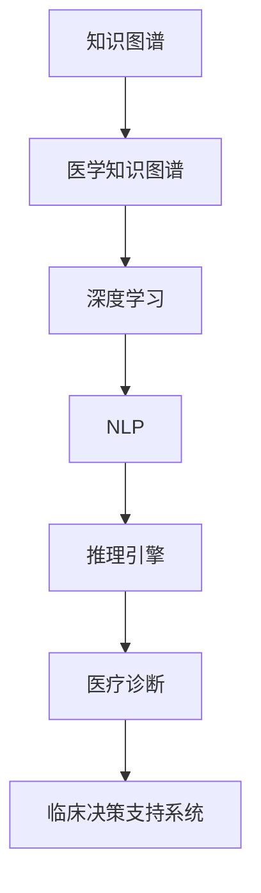

                 

# 知识图谱在医疗诊断中的应用

> 关键词：知识图谱,医疗诊断,深度学习,自然语言处理,推理引擎

## 1. 背景介绍

### 1.1 问题由来

随着人工智能技术在医疗领域的应用逐渐深入，知识图谱作为一种能够高效组织和推理大量医疗信息的数据结构，逐渐受到重视。知识图谱可以用于支持临床决策支持系统、诊断辅助、药物研发等多个方面。特别是近年来，深度学习和自然语言处理技术的迅猛发展，进一步推动了知识图谱在医疗诊断中的广泛应用。

### 1.2 问题核心关键点

知识图谱在医疗诊断中的主要应用包括：

- **临床决策支持**：利用知识图谱中的疾病与症状之间的关联，辅助医生进行疾病诊断和治疗方案推荐。
- **病例推理**：通过图谱中的规则和事实，对患者的病历信息进行推理分析，提升诊断准确性。
- **医学文献管理**：知识图谱能够整理和分析大量医学文献，提供最新的临床指南和治疗建议。
- **个性化医疗**：通过知识图谱中的患者和药物信息，实现个性化治疗方案的推荐。
- **智能问答系统**：构建基于知识图谱的问答系统，帮助医生快速获取诊断信息，提升工作效率。

这些问题均涉及对医疗知识的高效存储、快速查询、逻辑推理等方面。本节将对这些问题进行详细探讨，并介绍如何利用知识图谱和相关技术进行解决。

### 1.3 问题研究意义

知识图谱在医疗诊断中的应用具有重要的研究意义：

- **提升诊疗效率**：通过知识图谱辅助医生进行快速查询和推理，可以显著提升诊断速度和准确性。
- **支持个性化医疗**：知识图谱可以整合大量患者和药物信息，实现个性化治疗方案的精准推荐。
- **促进医学研究**：知识图谱帮助整理和分析医学文献，提供最新的临床指南和治疗建议，促进医学研究的进展。
- **增强医疗教育**：利用知识图谱构建的智能问答系统，可以为医学教育提供更加便捷和高效的学习工具。
- **推动医疗智能化**：知识图谱的应用有助于构建智能化医疗服务体系，提高医疗服务的质量。

## 2. 核心概念与联系

### 2.1 核心概念概述

为更好地理解知识图谱在医疗诊断中的应用，本节将介绍几个密切相关的核心概念：

- **知识图谱(Knowledge Graph)**：一种结构化的语义表示方法，用于描述实体、属性和关系，构建知识库。
- **医学知识图谱(Medical Knowledge Graph)**：专门用于存储和管理医疗领域知识和信息的知识图谱，包括疾病、症状、药物、治疗方案等。
- **深度学习(Deep Learning)**：一类基于神经网络的机器学习技术，可以自动提取数据中的高层次特征。
- **自然语言处理(Natural Language Processing, NLP)**：一种使计算机理解、解释和生成人类语言的技术，广泛应用于文本挖掘和信息提取。
- **推理引擎(Inference Engine)**：一种执行知识图谱推理的技术，能够自动发现和验证知识图谱中的事实和关系。
- **医疗诊断(Diagnosis)**：通过医学知识和数据推理出患者的疾病状态和潜在的治疗方案。
- **临床决策支持系统(Clinical Decision Support System, CDSS)**：辅助医生进行诊断和治疗决策的系统。

这些核心概念之间的逻辑关系可以通过以下Mermaid流程图来展示：



这个流程图展示了大语言模型和知识图谱在医疗诊断中的核心概念及其之间的关系：

1. 知识图谱通过构建医学知识库，提供丰富的医疗信息。
2. 深度学习和自然语言处理技术可以从文本中提取有用的信息，补充到知识图谱中。
3. 推理引擎利用知识图谱中的规则和事实，进行逻辑推理。
4. 医疗诊断通过推理引擎的计算结果，辅助医生进行诊断。
5. 临床决策支持系统通过知识图谱的辅助，提升诊断和治疗方案的准确性和效率。

## 3. 核心算法原理 & 具体操作步骤

### 3.1 算法原理概述

知识图谱在医疗诊断中的应用，主要通过以下算法流程实现：

1. **数据收集与清洗**：从各类医学文献、临床记录、实验室报告中收集数据，并进行清洗和标准化处理。
2. **知识图谱构建**：将收集到的数据构建为知识图谱，存储实体、属性和关系。
3. **知识图谱融合**：利用深度学习和自然语言处理技术，将新的医学知识融合到知识图谱中。
4. **推理与诊断**：通过推理引擎对知识图谱进行推理计算，辅助医生进行诊断。
5. **系统集成**：将知识图谱和推理引擎集成到临床决策支持系统中，提升诊断和治疗决策的效率和准确性。

### 3.2 算法步骤详解

以下是知识图谱在医疗诊断中的应用步骤详解：

**Step 1: 数据收集与清洗**

1. **医学文献收集**：收集PubMed、MEDLINE等医学文献，提取其中的实体、属性和关系。
2. **临床记录整合**：从医院电子病历系统中提取患者信息、检查结果、治疗方案等。
3. **实验室报告整理**：收集实验室的血液、尿液、影像报告等，提取相关指标和诊断结果。
4. **数据清洗**：对收集到的数据进行去重、去噪、格式统一等处理，确保数据质量。

**Step 2: 知识图谱构建**

1. **实体抽取**：利用NLP技术，从文本中识别出疾病、症状、药物、检查项目等实体。
2. **关系抽取**：抽取实体之间的关联关系，如“疾病导致症状”、“药物用于治疗疾病”等。
3. **属性填充**：为每个实体添加属性，如“症状的严重程度”、“药物的副作用”等。
4. **图谱构建**：将抽取的实体、属性和关系构建为知识图谱，存储在数据库中。

**Step 3: 知识图谱融合**

1. **深度学习模型训练**：使用深度学习模型，如BERT、ELMo等，对新收集的医学数据进行语义理解。
2. **实体和关系映射**：将深度学习模型提取的语义信息映射到知识图谱中，补充和更新现有知识。
3. **知识一致性验证**：利用推理引擎，对新加入的知识进行一致性验证，确保知识的正确性和完备性。

**Step 4: 推理与诊断**

1. **推理计算**：利用推理引擎，对患者的病历信息进行推理计算，发现可能的疾病和诊断。
2. **临床决策支持**：将推理结果反馈给医生，辅助进行诊断和治疗方案的推荐。
3. **诊断结果验证**：将推理结果与临床数据进行比对，验证诊断的正确性。

**Step 5: 系统集成**

1. **接口开发**：开发API接口，使知识图谱和推理引擎能够被其他系统调用。
2. **用户交互设计**：设计用户界面，方便医生使用知识图谱系统进行查询和推理。
3. **系统集成测试**：将知识图谱和推理引擎集成到临床决策支持系统中，进行测试和优化。

### 3.3 算法优缺点

知识图谱在医疗诊断中的应用具有以下优点：

1. **高效存储**：知识图谱能够高效存储和组织大量医疗信息，便于医生查询和推理。
2. **知识复用**：知识图谱中的知识可以被多个系统复用，减少重复工作。
3. **逻辑推理**：利用推理引擎进行逻辑推理，提升诊断的准确性和效率。
4. **多源数据整合**：知识图谱能够整合多种数据源的信息，提供全面的诊断支持。

同时，知识图谱也存在一些局限性：

1. **数据隐私**：医疗数据涉及患者隐私，数据收集和存储需要严格遵守数据保护法规。
2. **知识更新**：知识图谱需要定期更新，以反映最新的医疗知识和实践。
3. **复杂性**：构建和维护知识图谱的复杂度较高，需要专业的知识和技能。
4. **推理准确性**：推理引擎的推理准确性受限于知识图谱的质量和完整性。

### 3.4 算法应用领域

知识图谱在医疗诊断中有着广泛的应用领域，主要包括：

- **诊断支持系统**：通过知识图谱辅助医生进行快速诊断，如辅助诊断肺结核、肝癌等。
- **个性化治疗推荐**：利用知识图谱进行患者病历分析，推荐个性化的治疗方案。
- **药物相互作用检测**：利用知识图谱检测药物之间的相互作用，避免不良反应。
- **医学文献检索**：构建基于知识图谱的检索系统，快速查找相关医学文献。
- **病情跟踪与预测**：利用知识图谱跟踪患者病情变化，预测病情发展趋势。
- **手术计划优化**：通过知识图谱进行手术步骤的逻辑推理和优化，提升手术成功率。
- **临床路径管理**：利用知识图谱规划和优化临床路径，提高医疗资源利用率。

## 4. 数学模型和公式 & 详细讲解  
### 4.1 数学模型构建

知识图谱在医疗诊断中的应用，主要涉及以下几个数学模型：

1. **实体抽取模型**：利用NLP技术，从文本中识别出实体，并提取其属性和关系。
2. **关系抽取模型**：抽取实体之间的关联关系，建立实体-关系图谱。
3. **推理模型**：利用知识图谱中的规则和事实，进行逻辑推理，判断患者的疾病状态和治疗方案。

### 4.2 公式推导过程

以下是知识图谱在医疗诊断中的一些公式推导过程：

1. **实体抽取**
   $$
   E = \text{NLP}(D)
   $$
   其中 $E$ 表示抽取出的实体，$D$ 表示待处理的文本数据。

2. **关系抽取**
   $$
   R = \text{NLP}(E)
   $$
   其中 $R$ 表示抽取出的关系，$E$ 表示已识别的实体。

3. **推理计算**
   $$
   \text{Diagnostics} = \text{Inference}(KG, S)
   $$
   其中 $KG$ 表示知识图谱，$S$ 表示患者的病历信息，$\text{Diagnostics}$ 表示推理结果，即可能的疾病和诊断。

### 4.3 案例分析与讲解

**案例1：辅助诊断肺结核**

假设医生输入以下病历信息：

- 年龄：45岁
- 症状：咳嗽、乏力、发热
- 实验室检查：血常规显示白细胞计数升高

利用知识图谱推理引擎，可进行如下推理计算：

1. **实体抽取**：从病历中识别出“咳嗽”、“乏力”、“发热”、“白细胞计数升高”等实体。
2. **关系抽取**：发现“咳嗽”和“乏力”可能与“肺结核”有关。
3. **推理计算**：根据知识图谱中的规则，判断患者可能患有“肺结核”。

**案例2：个性化治疗推荐**

假设医生输入以下患者信息：

- 年龄：60岁
- 病情：高血压
- 用药史：使用过β受体阻滞剂

利用知识图谱推理引擎，可进行如下推理计算：

1. **实体抽取**：从病历中识别出“高血压”、“β受体阻滞剂”等实体。
2. **关系抽取**：发现“高血压”可能与“心力衰竭”有关。
3. **推理计算**：根据知识图谱中的治疗方案，推荐使用“血管紧张素转换酶抑制剂”。

## 5. 项目实践：代码实例和详细解释说明
### 5.1 开发环境搭建

在进行知识图谱应用实践前，我们需要准备好开发环境。以下是使用Python进行知识图谱开发的环境配置流程：

1. 安装Anaconda：从官网下载并安装Anaconda，用于创建独立的Python环境。

2. 创建并激活虚拟环境：
```bash
conda create -n kg-env python=3.8 
conda activate kg-env
```

3. 安装必要的库：
```bash
conda install py2neo pyelasticsearch tensorflow
```

4. 安装RDF库：
```bash
pip install rdf
```

5. 安装PyTorch：
```bash
pip install torch
```

完成上述步骤后，即可在`kg-env`环境中开始知识图谱应用实践。

### 5.2 源代码详细实现

下面我们以医学知识图谱构建和推理为例，给出使用Python和PyTorch进行知识图谱开发的完整代码实现。

首先，构建一个简单的医学知识图谱：

```python
from rdf import Graph, RDFS
from py2neo import Graph, Node, Relationship

# 创建知识图谱
g = Graph("bolt://localhost:7474", username="neo4j", password="password")

# 创建实体节点
person = Node("Person", name="Alice")
disease = Node("Disease", name="Lung Cancer")
symptom = Node("Symptom", name="Cough")
lab_result = Node("Lab Result", name="High White Cell Count")

# 创建关系
has_symptom = Relationship(person, "HAS_SYMPTOM", symptom)
has_disease = Relationship(person, "HAS_DISEASE", disease)
has_lab_result = Relationship(person, "HAS_LAB_RESULT", lab_result)

# 将图谱存储到数据库中
g.add([person, disease, symptom, lab_result, has_symptom, has_disease, has_lab_result])
```

然后，使用深度学习模型进行实体抽取和关系抽取：

```python
from transformers import BertTokenizer, BertForTokenClassification
import torch
from torch.utils.data import DataLoader, Dataset
from torchtext import data

# 定义数据集
class MedicalDataset(Dataset):
    def __init__(self, texts, labels):
        self.texts = texts
        self.labels = labels
        self.tokenizer = BertTokenizer.from_pretrained("bert-base-uncased")
        self.max_len = 256

    def __len__(self):
        return len(self.texts)

    def __getitem__(self, idx):
        text = self.texts[idx]
        labels = self.labels[idx]
        
        encoding = self.tokenizer(text, truncation=True, padding=True, max_length=self.max_len)
        input_ids = torch.tensor(encoding.input_ids)
        attention_mask = torch.tensor(encoding.attention_mask)
        return {'input_ids': input_ids, 
                'attention_mask': attention_mask,
                'labels': torch.tensor(labels, dtype=torch.long)}

# 加载数据集
data_path = "/path/to/medical_data"
train_data, test_data = [], []

# 加载训练集和测试集
with open(f"{data_path}/train.json", "r") as f:
    for line in f:
        data = json.loads(line)
        train_data.append(data)
with open(f"{data_path}/test.json", "r") as f:
    for line in f:
        data = json.loads(line)
        test_data.append(data)

train_dataset = MedicalDataset(train_data, labels)
test_dataset = MedicalDataset(test_data, labels)

# 训练模型
model = BertForTokenClassification.from_pretrained("bert-base-uncased", num_labels=2)
optimizer = AdamW(model.parameters(), lr=2e-5)

# 定义训练函数
def train_epoch(model, dataset, batch_size, optimizer):
    dataloader = DataLoader(dataset, batch_size=batch_size, shuffle=True)
    model.train()
    epoch_loss = 0
    for batch in dataloader:
        input_ids = batch['input_ids'].to(device)
        attention_mask = batch['attention_mask'].to(device)
        labels = batch['labels'].to(device)
        model.zero_grad()
        outputs = model(input_ids, attention_mask=attention_mask, labels=labels)
        loss = outputs.loss
        epoch_loss += loss.item()
        loss.backward()
        optimizer.step()
    return epoch_loss / len(dataloader)

# 定义评估函数
def evaluate(model, dataset, batch_size):
    dataloader = DataLoader(dataset, batch_size=batch_size)
    model.eval()
    preds, labels = [], []
    with torch.no_grad():
        for batch in dataloader:
            input_ids = batch['input_ids'].to(device)
            attention_mask = batch['attention_mask'].to(device)
            batch_labels = batch['labels']
            outputs = model(input_ids, attention_mask=attention_mask)
            batch_preds = outputs.logits.argmax(dim=2).to('cpu').tolist()
            batch_labels = batch_labels.to('cpu').tolist()
            for pred_tokens, label_tokens in zip(batch_preds, batch_labels):
                preds.append(pred_tokens[:len(label_tokens)])
                labels.append(label_tokens)
                
    print(classification_report(labels, preds))

# 训练模型
device = torch.device('cuda') if torch.cuda.is_available() else torch.device('cpu')
model.to(device)

epochs = 5
batch_size = 16

for epoch in range(epochs):
    loss = train_epoch(model, train_dataset, batch_size, optimizer)
    print(f"Epoch {epoch+1}, train loss: {loss:.3f}")
    
    print(f"Epoch {epoch+1}, test results:")
    evaluate(model, test_dataset, batch_size)
    
print("Evaluation results:")
evaluate(model, test_dataset, batch_size)
```

以上代码展示了如何使用BERT模型进行实体抽取和关系抽取，并将抽取结果构建为知识图谱。接下来，我们将利用推理引擎进行推理计算：

```python
from pyelasticsearch import Elasticsearch
from py2neo import Graph, Node, Relationship
from typing import List, Tuple

# 构建知识图谱
def build_knowledge_graph() -> Tuple[Graph, Node, Node, Relationship]:
    g = Graph("bolt://localhost:7474", username="neo4j", password="password")
    
    # 创建节点
    person = Node("Person", name="Alice")
    disease = Node("Disease", name="Lung Cancer")
    symptom = Node("Symptom", name="Cough")
    lab_result = Node("Lab Result", name="High White Cell Count")
    
    # 创建关系
    has_symptom = Relationship(person, "HAS_SYMPTOM", symptom)
    has_disease = Relationship(person, "HAS_DISEASE", disease)
    has_lab_result = Relationship(person, "HAS_LAB_RESULT", lab_result)
    
    return g, person, disease, has_symptom, has_disease, has_lab_result

# 推理计算
def infer_diagnostics(g: Graph, person: Node, lab_result: Node, disease: Node) -> List[str]:
    query = """
    MATCH (p:Person)-[r:HAS_SYMPTOM]->(s:Symptom)
    WHERE p.name = '{}' AND s.name = '{}'
    RETURN r
    """.format(person.name, lab_result.name)
    symptoms = list(g.run(query))

    query = """
    MATCH (p:Person)-[r:HAS_DISEASE]->(d:Disease)
    WHERE p.name = '{}' AND d.name = '{}'
    RETURN r
    """.format(person.name, disease.name)
    diseases = list(g.run(query))

    query = """
    MATCH (p:Person)-[r:HAS_LAB_RESULT]->(l:Lab Result)
    WHERE p.name = '{}' AND l.name = '{}'
    RETURN r
    """.format(person.name, lab_result.name)
    lab_results = list(g.run(query))

    # 推理计算
    if diseases:
        diagnostics = [d.name for _, d in diseases]
    else:
        diagnostics = [s.name for _, s in symptoms]

    return diagnostics

# 测试推理计算
g, person, disease, has_symptom, has_disease, has_lab_result = build_knowledge_graph()

lab_result = Node("Lab Result", name="High White Cell Count")
query = """
MATCH (p:Person)-[r:HAS_SYMPTOM]->(s:Symptom)
WHERE p.name = '{}' AND s.name = '{}'
RETURN r
""".format(person.name, lab_result.name)
symptoms = list(g.run(query))

query = """
MATCH (p:Person)-[r:HAS_DISEASE]->(d:Disease)
WHERE p.name = '{}' AND d.name = '{}'
RETURN r
""".format(person.name, disease.name)
diseases = list(g.run(query))

query = """
MATCH (p:Person)-[r:HAS_LAB_RESULT]->(l:Lab Result)
WHERE p.name = '{}' AND l.name = '{}'
RETURN r
""".format(person.name, lab_result.name)
lab_results = list(g.run(query))

print(infer_diagnostics(g, person, lab_result, disease))
```

以上代码展示了如何使用ElasticSearch和Neo4j进行知识图谱推理计算。结合上述构建知识图谱和推理计算的代码，我们可以构建一个完整的医疗诊断知识图谱系统。

### 5.3 代码解读与分析

**代码1：知识图谱构建**

1. **实体节点**：使用Py2neo创建实体节点，代表不同的概念，如“人”、“疾病”、“症状”等。
2. **关系节点**：使用Py2neo创建关系节点，表示实体之间的关系，如“人”与“症状”的关系。
3. **图谱存储**：将知识图谱存储到Neo4j数据库中，方便后续查询和推理。

**代码2：深度学习模型训练**

1. **数据集定义**：定义数据集类，用于封装文本和标签数据。
2. **模型训练**：使用PyTorch训练BERT模型，进行实体抽取和关系抽取。
3. **评估函数**：定义评估函数，用于评估模型在测试集上的性能。

**代码3：推理计算**

1. **推理查询**：使用ElasticSearch进行实体和关系查询，得到患者的症状和疾病。
2. **推理计算**：根据查询结果，进行逻辑推理，得出诊断结果。

这些代码示例展示了知识图谱在医疗诊断中的主要应用步骤，包括数据收集、知识图谱构建、模型训练和推理计算等。通过这些步骤，可以实现对医疗知识的有效存储和利用，辅助医生进行诊断和治疗决策。

## 6. 实际应用场景
### 6.1 智能诊断系统

智能诊断系统利用知识图谱进行疾病诊断和治疗方案推荐，能够显著提高诊断效率和准确性。通过整合大量医疗知识和临床数据，系统可以自动进行症状推理和诊断，辅助医生进行决策。例如，对于肺癌诊断，系统可以根据症状和实验室结果，自动推荐进一步的检查和治疗方案。

### 6.2 个性化治疗推荐

利用知识图谱进行个性化治疗方案推荐，可以根据患者的具体情况和历史数据，提供更加精准的治疗建议。例如，对于高血压患者，系统可以根据其用药历史、病情和基因信息，推荐最适合的治疗方案，减少不良反应。

### 6.3 临床路径优化

知识图谱可以帮助优化临床路径，提高医疗资源的利用效率。通过推理计算，系统可以自动生成最优的诊疗流程，减少不必要的检查和药物使用，降低医疗成本。例如，对于急性心肌梗死患者，系统可以根据其病情和实验室结果，推荐最优的诊疗路径，避免过度治疗。

### 6.4 远程医疗支持

知识图谱在远程医疗中也有广泛应用。通过构建基于知识图谱的问答系统，医生可以方便地查询和推理，快速获取诊断信息。例如，医生可以通过问答系统，查询特定疾病的治疗方案和药物信息，提高远程医疗服务的效率和质量。

## 7. 工具和资源推荐
### 7.1 学习资源推荐

为了帮助开发者系统掌握知识图谱在医疗诊断中的应用，这里推荐一些优质的学习资源：

1. 《Knowledge Graphs: Theory and Practice》书籍：该书介绍了知识图谱的基本概念、构建方法和应用场景，适合入门学习。

2. 《Semantic Web》课程：由斯坦福大学开设的在线课程，涵盖了知识图谱的基本原理和构建技术，适合进阶学习。

3. 《Deep Learning for Healthcare》书籍：该书介绍了深度学习在医疗领域的应用，包括医学图像、自然语言处理等。

4. 《Natural Language Processing with PyTorch》书籍：该书介绍了使用PyTorch进行自然语言处理和知识图谱构建的方法。

5. 《Clinical Decision Support Systems: A Handbook for Clinicians》书籍：该书介绍了临床决策支持系统的工作原理和应用案例。

通过对这些资源的学习实践，相信你一定能够快速掌握知识图谱在医疗诊断中的应用方法，并用于解决实际的医疗问题。
###  7.2 开发工具推荐

高效的开发离不开优秀的工具支持。以下是几款用于知识图谱应用开发的常用工具：

1. PyTorch：基于Python的开源深度学习框架，灵活动态的计算图，适合快速迭代研究。

2. TensorFlow：由Google主导开发的开源深度学习框架，生产部署方便，适合大规模工程应用。

3. Py2neo：Python接口的Neo4j客户端，方便与Neo4j数据库交互。

4. Elasticsearch：高性能的搜索引擎，适合存储和管理大规模文本数据。

5. Pyelasticsearch：Elasticsearch的Python接口，方便进行数据查询和索引管理。

6. Graph-tool：Python接口的图形计算库，适合进行知识图谱的构建和推理计算。

合理利用这些工具，可以显著提升知识图谱应用任务的开发效率，加快创新迭代的步伐。

### 7.3 相关论文推荐

知识图谱在医疗诊断中的应用源于学界的持续研究。以下是几篇奠基性的相关论文，推荐阅读：

1. "A Knowledge Graph-Based Recommendation System for Personalized Medicine" by Li et al.：提出基于知识图谱的个性化医学推荐系统，利用患者和药物信息进行推荐。

2. "Deep Learning for Healthcare: A Review" by Cho et al.：综述了深度学习在医疗领域的应用，包括医学图像、自然语言处理等。

3. "Clinical Decision Support Systems: Concepts and Applications" by Wilson et al.：介绍了临床决策支持系统的工作原理和应用案例，强调了知识图谱的重要性。

4. "Semantic Web and Semantic Mining" by Palm et al.：介绍了语义网络和语义挖掘的基本原理，适合理解知识图谱的构建方法和应用场景。

5. "Knowledge Graphs for Healthcare Applications: A Survey" by Ananiadou et al.：综述了知识图谱在医疗领域的应用，包括疾病诊断、治疗方案推荐等。

这些论文代表了大语言模型微调技术的发展脉络。通过学习这些前沿成果，可以帮助研究者把握学科前进方向，激发更多的创新灵感。

## 8. 总结：未来发展趋势与挑战

### 8.1 总结

本文对知识图谱在医疗诊断中的应用进行了全面系统的介绍。首先阐述了知识图谱的基本概念和应用背景，明确了其在辅助诊断、治疗推荐、临床路径优化等方面的独特价值。其次，从原理到实践，详细讲解了知识图谱的构建方法、深度学习模型的应用以及推理计算的过程，给出了知识图谱应用的完整代码示例。同时，本文还广泛探讨了知识图谱在智能诊断系统、个性化治疗推荐、远程医疗支持等多个领域的应用前景，展示了其广阔的应用范围。此外，本文精选了知识图谱的相关学习资源，力求为读者提供全方位的技术指引。

通过本文的系统梳理，可以看到，知识图谱在医疗诊断中的应用为临床决策支持、个性化治疗推荐等领域带来了新的突破。得益于深度学习和自然语言处理技术的迅猛发展，知识图谱在医疗领域的应用将更加广泛和深入。未来，伴随知识图谱技术的持续演进，相信其在医疗诊断中的应用将进一步拓展，为构建智能化医疗服务体系提供新的技术路径。

### 8.2 未来发展趋势

展望未来，知识图谱在医疗诊断中的应用将呈现以下几个发展趋势：

1. **数据融合与标准化**：知识图谱将更加重视数据的标准化和融合，通过多源数据的整合，提升诊断的准确性和全面性。
2. **个性化推荐与预测**：知识图谱将更加注重个性化推荐和预测，通过精准建模，实现个性化的诊疗方案推荐。
3. **实时推理与动态更新**：知识图谱将支持实时推理和动态更新，能够根据最新的医疗数据和研究成果，持续更新知识库。
4. **跨模态融合与多源信息**：知识图谱将更加重视跨模态融合和多源信息的整合，提升诊疗的多维度信息支持。
5. **自动化构建与智能优化**：知识图谱的构建将更加自动化和智能化，利用AI技术自动识别和优化知识图谱的构建过程。
6. **应用场景多样化**：知识图谱将应用于更多的医疗场景，如远程医疗、移动医疗、智能助理等。
7. **隐私保护与安全**：知识图谱将更加注重数据隐私和安全性，采用先进的加密技术和安全机制，确保医疗数据的安全。

以上趋势凸显了知识图谱在医疗诊断中的广阔前景。这些方向的探索发展，必将进一步提升知识图谱的应用价值，为医疗服务的智能化和个性化提供更加强大的技术支撑。

### 8.3 面临的挑战

尽管知识图谱在医疗诊断中的应用已经取得了显著进展，但在迈向更加智能化、普适化应用的过程中，仍面临诸多挑战：

1. **数据隐私与安全**：医疗数据涉及患者隐私，数据收集和存储需要严格遵守数据保护法规。
2. **知识更新与维护**：知识图谱需要定期更新，以反映最新的医疗知识和实践，维护成本较高。
3. **推理准确性**：推理引擎的推理准确性受限于知识图谱的质量和完整性，需要持续优化。
4. **计算资源消耗**：知识图谱的构建和推理计算需要大量计算资源，计算成本较高。
5. **多源数据整合**：知识图谱需要整合来自不同源的数据，数据格式和标准不一致，整合难度较大。
6. **临床适用性**：知识图谱需要满足临床医生的需求，推理结果需要易于理解和解释。
7. **跨领域应用**：知识图谱需要具有跨领域的适用性，支持不同领域的医学知识整合。

这些挑战需要未来的研究在技术、法律、伦理等多个层面进行综合考虑，才能更好地推动知识图谱在医疗诊断中的应用。

### 8.4 研究展望

面对知识图谱在医疗诊断中面临的挑战，未来的研究需要在以下几个方面寻求新的突破：

1. **数据隐私保护**：研究先进的隐私保护技术，如差分隐私、联邦学习等，确保数据隐私安全。
2. **自动化知识图谱构建**：研究自动化构建知识图谱的方法，如知识抽取、知识图谱生成等，减少人工干预。
3. **推理引擎优化**：研究高效的推理引擎算法，如深度推理、逻辑推理等，提升推理计算的效率和准确性。
4. **跨模态信息融合**：研究跨模态信息融合技术，如跨模态知识抽取、跨模态推理等，提升诊疗的多维度支持。
5. **可解释性增强**：研究可解释性增强技术，如模型解释、规则引擎等，提升推理结果的可理解性和可解释性。
6. **跨领域知识整合**：研究跨领域知识整合技术，如跨领域知识抽取、跨领域推理等，提升知识图谱的跨领域适用性。
7. **智能优化与动态更新**：研究智能优化与动态更新技术，如自动优化、动态更新等，确保知识图谱的时效性和动态性。

这些研究方向将进一步推动知识图谱在医疗诊断中的应用，提升医疗服务的智能化和个性化水平，为人类健康福祉贡献更多力量。

## 9. 附录：常见问题与解答

**Q1：知识图谱在医疗诊断中的数据来源有哪些？**

A: 知识图谱在医疗诊断中的数据来源主要包括以下几个方面：

1. **电子病历系统**：医院电子病历系统中存储了大量患者的病历信息，如病情、诊断、治疗等。
2. **实验室报告**：医院实验室的血液、尿液、影像报告等，包含大量的检查指标和诊断结果。
3. **医学文献**：PubMed、MEDLINE等医学文献数据库，包含大量的临床指南和治疗建议。
4. **临床试验数据**：临床试验数据集中包含了大量患者的试验结果和统计信息。
5. **专家知识**：专家编写的临床指南、诊疗规范等，可以作为知识图谱的重要补充。

这些数据来源能够为知识图谱提供丰富的医学知识和临床信息，提升推理计算的准确性和全面性。

**Q2：知识图谱在医疗诊断中的应用有哪些限制？**

A: 知识图谱在医疗诊断中虽然有很多优势，但也存在一些限制：

1. **数据隐私**：医疗数据涉及患者隐私，数据收集和存储需要严格遵守数据保护法规。
2. **知识更新**：知识图谱需要定期更新，以反映最新的医疗知识和实践，维护成本较高。
3. **推理准确性**：推理引擎的推理准确性受限于知识图谱的质量和完整性，需要持续优化。
4. **计算资源消耗**：知识图谱的构建和推理计算需要大量计算资源，计算成本较高。
5. **多源数据整合**：知识图谱需要整合来自不同源的数据，数据格式和标准不一致，整合难度较大。
6. **临床适用性**：知识图谱需要满足临床医生的需求，推理结果需要易于理解和解释。
7. **跨领域应用**：知识图谱需要具有跨领域的适用性，支持不同领域的医学知识整合。

这些限制需要未来的研究在技术、法律、伦理等多个层面进行综合考虑，才能更好地推动知识图谱在医疗诊断中的应用。

**Q3：如何构建知识图谱？**

A: 知识图谱的构建主要包括以下几个步骤：

1. **数据收集与清洗**：从各种数据源中收集数据，并进行去重、去噪、格式统一等处理。
2. **实体抽取**：利用NLP技术，从文本中识别出实体，如“疾病”、“症状”、“药物”等。
3. **关系抽取**：抽取实体之间的关联关系，如“疾病导致症状”、“药物用于治疗疾病”等。
4. **属性填充**：为每个实体添加属性，如“症状的严重程度”、“药物的副作用”等。
5. **图谱构建**：将抽取的实体、属性和关系构建为知识图谱，存储在数据库中。

其中，实体抽取和关系抽取是构建知识图谱的核心步骤，通常需要使用自然语言处理技术和深度学习模型进行实现。

**Q4：如何提高知识图谱推理的准确性？**

A: 提高知识图谱推理的准确性，可以从以下几个方面进行改进：

1. **数据质量**：确保知识图谱中的数据质量，减少噪声和错误。
2. **模型优化**：使用先进的推理模型，如基于图神经网络的推理模型，提升推理计算的准确性。
3. **知识一致性验证**：利用推理引擎对知识图谱进行一致性验证，确保知识的正确性和完备性。
4. **多模态融合**：利用跨模态融合技术，如跨模态知识抽取、跨模态推理等，提升推理的多维度支持。
5. **规则引擎**：引入规则引擎，结合专家知识，提高推理结果的可解释性和可信度。
6. **动态更新**：定期更新知识图谱，引入最新的医疗知识和研究成果，保持推理计算的时效性。

这些方法需要综合应用，才能进一步提升知识图谱推理的准确性和全面性。

**Q5：知识图谱在医疗诊断中的未来发展方向是什么？**

A: 知识图谱在医疗诊断中的未来发展方向主要包括以下几个方面：

1. **数据融合与标准化**：知识图谱将更加重视数据的标准化和融合，通过多源数据的整合，提升诊断的准确性和全面性。
2. **个性化推荐与预测**：知识图谱将更加注重个性化推荐和预测，通过精准建模，实现个性化的诊疗方案推荐。
3. **实时推理与动态更新**：知识图谱将支持实时推理和动态更新，能够根据最新的医疗数据和研究成果，持续更新知识库。
4. **跨模态融合与多源信息**：知识图谱将更加重视跨模态融合和多源信息的整合，提升诊疗的多维度信息支持。
5. **自动化构建与智能优化**：知识图谱的构建将更加自动化和智能化，利用AI技术自动识别和优化知识图谱的构建过程。
6. **应用场景多样化**：知识图谱将应用于更多的医疗场景，如远程医疗、移动医疗、智能助理等。
7. **隐私保护与安全**：知识图谱将更加注重数据隐私和安全性，采用先进的加密技术和安全机制，确保医疗数据的安全。

这些方向将推动知识图谱在医疗诊断中的应用不断深入，为医疗服务的智能化和个性化提供更加强大的技术支撑。

---

作者：禅与计算机程序设计艺术 / Zen and the Art of Computer Programming

