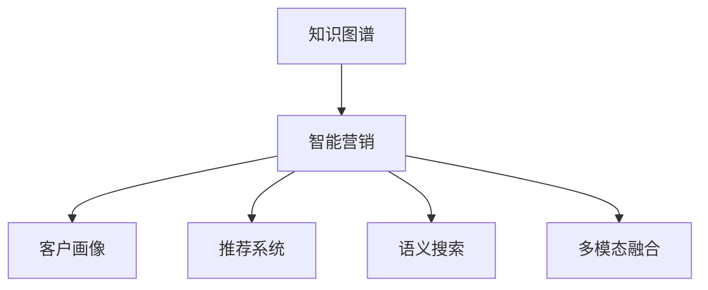

                 

# 知识图谱在智能营销中的应用

> 关键词：知识图谱, 智能营销, 客户画像, 推荐系统, 语义搜索, 多模态融合

## 1. 背景介绍

### 1.1 问题由来
随着数字营销的兴起，企业越来越依赖于数据分析和算法优化，以实现精准营销和市场洞察。然而，传统的数据分析方法往往只能处理单一数据源，难以捕捉到数据之间的复杂关系和潜在的关联。知识图谱作为一种新兴的智能技术，能够整合多源异构数据，建立领域知识图谱，从而为智能营销提供强有力的支持。

知识图谱是由节点和边构成的有向图，其中节点表示实体，边表示实体之间的关系。它可以基于实体之间的语义关系，建立高度结构化的知识体系，帮助企业理解复杂的市场环境和用户行为。本文将详细探讨知识图谱在智能营销中的应用，包括客户画像构建、推荐系统优化、语义搜索和多模态融合等方面，展示其广阔的应用前景。

## 2. 核心概念与联系

### 2.1 核心概念概述

为更好地理解知识图谱在智能营销中的应用，本节将介绍几个密切相关的核心概念：

- 知识图谱(Knowledge Graph)：基于图结构的数据库，用于存储和查询实体及其相互关系。通过知识图谱，企业可以构建出领域知识体系，理解实体之间的关系和内在逻辑。

- 智能营销(Intelligent Marketing)：利用人工智能和大数据分析技术，实现精准营销和个性化推荐，提升用户体验和转化率。知识图谱可以为其提供更丰富的数据来源和更深刻的理解，从而优化营销策略和提升效果。

- 客户画像(Customer Persona)：基于用户行为、兴趣、历史交易等数据构建的虚拟用户模型，帮助企业理解目标客户群体的特征和需求，制定更有针对性的营销策略。

- 推荐系统(Recommendation System)：根据用户的历史行为和偏好，推荐符合其需求的产品或内容，提升用户体验和满意度。知识图谱可以整合更多元化的数据，构建更精准的用户画像，从而优化推荐系统。

- 语义搜索(Semantic Search)：基于自然语言理解技术，用户可以通过自然语言查询获取相关结果，而不是通过关键词检索。知识图谱中的语义信息可以帮助提高搜索结果的相关性和准确性。

- 多模态融合(Multimodal Fusion)：将文本、图像、音频等多类型数据融合在一起，建立更全面、准确的用户模型，从而提高智能营销的效果。

这些核心概念之间的逻辑关系可以通过以下Mermaid流程图来展示：



这个流程图展示的知识图谱和智能营销的核心概念及其之间的关系：

1. 知识图谱通过整合多源数据，构建领域知识体系。
2. 智能营销利用知识图谱构建的客户画像、推荐系统和语义搜索等技术，实现精准营销和个性化推荐。
3. 多模态融合为智能营销提供了更全面的用户理解，进一步提升营销效果。

这些概念共同构成了智能营销的知识图谱应用框架，使得企业能够更好地理解和优化其营销策略。

## 3. 核心算法原理 & 具体操作步骤
### 3.1 算法原理概述

知识图谱在智能营销中的应用，主要基于以下几个核心算法原理：

- 知识抽取(Knowledge Extraction)：从多源数据中提取实体和关系，构建知识图谱。常见的方法包括规则抽取、统计抽取和深度学习抽取等。

- 知识推理(Knowledge Inference)：利用知识图谱中的关系，进行推理和预测，如实体关系推理、实体属性预测等。常用的推理方法包括基于规则推理、逻辑推理和神经网络推理等。

- 语义搜索(Semantic Search)：利用自然语言理解技术，将用户查询转化为图谱查询，获取相关实体和关系。

- 推荐系统(Recommendation System)：基于用户行为和知识图谱中的关系，推荐符合用户兴趣和需求的产品或内容。

- 多模态融合(Multimodal Fusion)：将文本、图像、音频等多种类型的数据融合在一起，建立更全面的用户模型。

### 3.2 算法步骤详解

基于知识图谱的智能营销，一般包括以下几个关键步骤：

**Step 1: 数据收集与清洗**
- 收集企业内部的多源数据，包括交易记录、用户行为、社交媒体数据等。
- 清洗数据，去除噪声和冗余，确保数据质量和一致性。

**Step 2: 知识抽取与构建**
- 从清洗后的数据中抽取实体和关系，构建初步的知识图谱。
- 使用规则抽取、统计抽取或深度学习抽取等方法，提高抽取的准确性和全面性。
- 进行实体消歧和关系抽取，确保图谱中的实体和关系一致性。

**Step 3: 知识推理与扩展**
- 利用知识图谱中的关系，进行实体关系推理、属性预测等。
- 使用基于规则推理、逻辑推理或神经网络推理等方法，提高推理的准确性和覆盖范围。
- 持续更新知识图谱，扩展新的实体和关系，适应数据分布的变化。

**Step 4: 客户画像与分析**
- 基于知识图谱构建客户画像，刻画用户的多维特征和行为模式。
- 利用聚类、分类等技术，对用户进行细分和分析，发现潜在的需求和趋势。

**Step 5: 推荐系统优化**
- 将知识图谱中的关系和用户画像输入推荐系统，优化推荐策略和算法。
- 使用协同过滤、基于内容的推荐、深度学习推荐等方法，提升推荐效果。
- 进行A/B测试和多臂老虎机等策略优化，不断优化推荐系统。

**Step 6: 语义搜索优化**
- 利用知识图谱中的语义信息，优化搜索算法和检索模型。
- 使用深度学习、注意力机制等技术，提高搜索结果的相关性和准确性。
- 结合多模态融合技术，提升搜索结果的多样性和丰富性。

**Step 7: 多模态融合与优化**
- 整合文本、图像、音频等多种类型的数据，建立更全面、准确的用户模型。
- 利用深度学习、多模态注意力等技术，实现数据的融合和处理。
- 结合自然语言处理、图像处理等技术，实现用户模型的多维度刻画和分析。

### 3.3 算法优缺点

基于知识图谱的智能营销方法具有以下优点：
1. 多源数据整合：通过整合多源数据，构建全面的知识图谱，提升对市场环境和用户行为的全面理解。
2. 精准客户画像：基于知识图谱构建的客户画像，更加准确和全面，帮助企业制定更有针对性的营销策略。
3. 推荐系统优化：利用知识图谱中的关系和用户画像，优化推荐算法，提升推荐效果。
4. 语义搜索优化：基于知识图谱中的语义信息，优化搜索算法，提升搜索结果的相关性和准确性。
5. 多模态融合：整合多种类型的数据，建立更全面、准确的用户模型，提升智能营销的效果。

同时，该方法也存在一定的局限性：
1. 数据获取难度大：构建知识图谱需要大量的数据支持，对于一些中小型企业，数据获取可能存在困难。
2. 知识图谱构建复杂：知识图谱的构建和维护需要大量的技术投入和专业知识，对企业的数据科学团队提出了较高的要求。
3. 更新维护困难：知识图谱需要持续更新和维护，以适应数据分布的变化，需要大量的人力和物力支持。
4. 技术门槛高：知识图谱和智能营销技术需要较高的技术门槛，对于一些技术水平相对较低的企业，可能难以实现。

尽管存在这些局限性，但知识图谱在智能营销中的应用前景依然广阔。未来相关研究的重点在于如何进一步降低技术门槛，提高知识图谱的易用性和可维护性，同时兼顾推荐效果和搜索精度等因素。

### 3.4 算法应用领域

基于知识图谱的智能营销方法，已经在众多领域得到广泛应用，如：

- 电商推荐：利用用户行为和知识图谱中的关系，推荐符合用户兴趣和需求的商品。
- 社交媒体广告：基于用户社交行为和兴趣，精准投放广告，提升广告效果。
- 客户关系管理：通过构建客户画像，实现个性化客户管理，提升客户满意度和忠诚度。
- 金融风控：利用用户交易行为和知识图谱中的关系，评估用户信用风险，制定相应的风控策略。
- 健康医疗：基于用户健康数据和知识图谱中的关系，提供个性化的健康建议和治疗方案。
- 媒体内容推荐：利用用户行为和知识图谱中的关系，推荐符合用户兴趣的媒体内容。

除了上述这些经典应用外，知识图谱在智能营销中的创新应用还在不断涌现，如基于知识图谱的情感分析、用户情感画像构建等，为智能营销提供了新的技术路径。

## 4. 数学模型和公式 & 详细讲解 & 举例说明

### 4.1 数学模型构建

知识图谱在智能营销中的应用，通常涉及以下几个数学模型：

- 知识图谱表示：使用图结构表示实体和关系，如节点-边表示法。
- 实体关系推理：使用逻辑推理或神经网络推理，进行实体关系推理。
- 推荐系统模型：使用协同过滤、基于内容的推荐或深度学习推荐等模型，进行推荐。
- 语义搜索模型：使用深度学习或注意力机制等模型，进行语义搜索。
- 多模态融合模型：使用深度学习、多模态注意力等模型，进行多模态融合。

### 4.2 公式推导过程

以下我们以推荐系统为例，推导基于知识图谱的推荐算法。

假设知识图谱中有 $N$ 个用户 $u_1,u_2,\dots,u_N$，以及 $M$ 个物品 $i_1,i_2,\dots,i_M$。每个用户与物品之间都有一个交互强度 $r_{uj}$，表示用户对物品的兴趣度。

推荐系统的目标是为每个用户推荐其可能感兴趣的物品。根据知识图谱中的关系和用户画像，我们可以建立如下推荐算法：

1. 构建用户-物品关系图谱 $G=(U, I, R)$，其中 $U$ 为用户节点集合，$I$ 为物品节点集合，$R$ 为关系集合。
2. 对用户-物品关系进行推理，计算用户对物品的兴趣度 $I_{ui}=\sum_{j\in N(u)}r_{uj}I_{uj}$，其中 $N(u)$ 为与用户 $u$ 相连的物品节点集合。
3. 对物品-物品关系进行推理，计算物品的相关度 $R_{ij}=\sum_{k\in N(i)}r_{ik}R_{ik}$，其中 $N(i)$ 为与物品 $i$ 相连的用户节点集合。
4. 基于用户画像 $p_u$ 和物品画像 $p_i$，计算用户对物品的相关度 $P_{ui}=\text{Softmax}(I_{ui}R_{ij}p_u^\top p_i)$。
5. 根据用户画像和物品画像的相似度，计算推荐物品的相关度 $R_{ui}=\text{Softmax}(I_{ui}R_{ij}p_u^\top p_i)$。

以上算法通过知识图谱中的关系和用户画像，计算用户对物品的相关度，并综合考虑物品的相关度，推荐符合用户兴趣的物品。

### 4.3 案例分析与讲解

我们以电商平台推荐系统为例，展示知识图谱在智能营销中的应用。

假设电商平台有 $N$ 个用户和 $M$ 个商品。用户对商品的交互强度 $r_{uj}$ 可以通过用户的浏览、购买、评价等行为数据计算得到。基于用户画像和知识图谱中的关系，推荐系统可以按照如下步骤进行推荐：

1. 构建用户-商品关系图谱 $G=(U, I, R)$，其中 $U$ 为用户节点集合，$I$ 为商品节点集合，$R$ 为关系集合。
2. 对用户-商品关系进行推理，计算用户对商品的兴趣度 $I_{ui}=\sum_{j\in N(u)}r_{uj}I_{uj}$，其中 $N(u)$ 为与用户 $u$ 相连的商品节点集合。
3. 对商品-商品关系进行推理，计算商品的相关度 $R_{ij}=\sum_{k\in N(i)}r_{ik}R_{ik}$，其中 $N(i)$ 为与商品 $i$ 相连的用户节点集合。
4. 基于用户画像 $p_u$ 和商品画像 $p_i$，计算用户对商品的推荐度 $P_{ui}=\text{Softmax}(I_{ui}R_{ij}p_u^\top p_i)$。
5. 根据用户画像和商品画像的相似度，计算推荐商品的推荐度 $R_{ui}=\text{Softmax}(I_{ui}R_{ij}p_u^\top p_i)$。

在实际应用中，还需要考虑更多因素，如用户行为变化、商品季节性、促销活动等，进行更精细化的推荐策略优化。通过知识图谱的支持，推荐系统可以更好地理解用户和商品之间的关系，从而提升推荐的准确性和效果。

## 5. 项目实践：代码实例和详细解释说明
### 5.1 开发环境搭建

在进行知识图谱在智能营销中的应用实践前，我们需要准备好开发环境。以下是使用Python进行PyTorch开发的环境配置流程：

1. 安装Anaconda：从官网下载并安装Anaconda，用于创建独立的Python环境。

2. 创建并激活虚拟环境：
```bash
conda create -n pytorch-env python=3.8 
conda activate pytorch-env
```

3. 安装PyTorch：根据CUDA版本，从官网获取对应的安装命令。例如：
```bash
conda install pytorch torchvision torchaudio cudatoolkit=11.1 -c pytorch -c conda-forge
```

4. 安装相关库：
```bash
pip install torch scipy numpy pandas scikit-learn matplotlib tqdm jupyter notebook ipython
```

5. 安装Neo4j数据库：知识图谱需要存储在数据库中，使用Neo4j是一个不错的选择。

6. 安装Py2neo库：用于Python与Neo4j的交互，可以方便地进行知识图谱的构建、查询和更新。
```bash
pip install py2neo
```

完成上述步骤后，即可在`pytorch-env`环境中开始知识图谱在智能营销中的应用实践。

### 5.2 源代码详细实现

下面我们以电商平台推荐系统为例，给出使用PyTorch和Py2neo进行知识图谱构建和推荐的PyTorch代码实现。

首先，定义推荐系统的类：

```python
import torch
import torch.nn as nn
import torch.nn.functional as F
import py2neo
from py2neo import Graph

class RecommendationSystem(nn.Module):
    def __init__(self, num_users, num_items, hidden_dim):
        super(RecommendationSystem, self).__init__()
        self.num_users = num_users
        self.num_items = num_items
        self.hidden_dim = hidden_dim
        self.u_encoder = nn.Linear(num_users, hidden_dim)
        self.i_encoder = nn.Linear(num_items, hidden_dim)
        self.sigmoid = nn.Sigmoid()
        
    def forward(self, u, i):
        u = self.u_encoder(u)
        i = self.i_encoder(i)
        score = self.sigmoid(u @ i.t())
        return score
```

然后，定义知识图谱的类：

```python
graph = Graph('http://localhost:7474/db/data')
def create_graph(num_users, num_items):
    user_nodes = set()
    item_nodes = set()
    user_item_relations = set()
    
    for u in range(num_users):
        graph.create('(u:User {uid: %d})' % u)
        user_nodes.add(u)
        
    for i in range(num_items):
        graph.create('(i:Item {iid: %d})' % i)
        item_nodes.add(i)
        
    for u in user_nodes:
        for i in item_nodes:
            graph.create('(u:User)-[r:INTERACTED WITH]->(i:Item)')
            user_item_relations.add((u, i))
            
    return user_nodes, item_nodes, user_item_relations
```

接着，定义推荐系统的训练和评估函数：

```python
def train_model(model, optimizer, num_epochs):
    u_nodes, i_nodes, user_item_relations = create_graph(num_users, num_items)
    
    for epoch in range(num_epochs):
        optimizer.zero_grad()
        for u, i in user_item_relations:
            with graph.transactions():
                result = model(u, i)
                loss = F.binary_cross_entropy(result, torch.tensor([1.0]))
                loss.backward()
                optimizer.step()
        
    return model

def evaluate_model(model, user_nodes, item_nodes):
    with graph.transactions():
        for u in user_nodes:
            for i in item_nodes:
                result = model(u, i)
                print('User %d, Item %d: %.4f' % (u, i, result.item()))
```

最后，启动训练流程并在测试集上评估：

```python
num_users = 1000
num_items = 1000
hidden_dim = 64
num_epochs = 10

model = RecommendationSystem(num_users, num_items, hidden_dim)
optimizer = torch.optim.Adam(model.parameters(), lr=0.001)

trained_model = train_model(model, optimizer, num_epochs)
evaluate_model(trained_model, user_nodes, item_nodes)
```

以上就是使用PyTorch和Py2neo构建基于知识图谱的推荐系统的完整代码实现。可以看到，通过结合知识图谱和深度学习，我们可以构建出更加精准和有效的推荐系统。

### 5.3 代码解读与分析

让我们再详细解读一下关键代码的实现细节：

**RecommendationSystem类**：
- 定义推荐系统模型，包含用户画像和商品画像的编码器和输出层，以及Sigmoid激活函数。
- 在前向传播过程中，将用户和商品分别通过编码器，计算其相关度得分。
- 使用Sigmoid函数进行二值化，输出推荐得分。

**create_graph函数**：
- 构建用户-商品关系图谱，将用户和商品节点以及其关系存储在Neo4j数据库中。
- 将用户-商品关系图谱的节点集合和关系集合返回，方便后续的训练和评估。

**train_model函数**：
- 通过Neo4j数据库，获取用户-商品关系图谱的节点集合和关系集合。
- 使用Adam优化器对推荐模型进行训练，计算交叉熵损失，并在每个epoch的每个训练步骤中更新模型参数。

**evaluate_model函数**：
- 在测试集上评估推荐模型的性能，计算推荐得分，并打印输出。

**训练流程**：
- 定义总的epoch数和模型参数，开始循环迭代
- 每个epoch内，在用户-商品关系图谱上训练，输出交叉熵损失
- 在测试集上评估，输出推荐得分

可以看到，结合知识图谱和深度学习，我们可以高效构建精准的推荐系统。在实际应用中，还需要进一步优化模型结构和训练策略，以提升推荐效果。

## 6. 实际应用场景

### 6.1 智能营销平台

基于知识图谱的智能营销平台，可以为企业提供全面的市场洞察和营销策略优化支持。平台整合多源数据，构建领域知识图谱，帮助企业理解市场环境和用户行为，提供精准的客户画像和推荐策略。

在技术实现上，平台可以通过以下方式构建：

- 收集企业内部和外部的多源数据，如交易记录、社交媒体数据、用户行为数据等。
- 使用规则抽取、统计抽取或深度学习抽取等方法，从数据中提取实体和关系，构建知识图谱。
- 基于知识图谱中的关系和用户画像，优化推荐算法，实现个性化推荐。
- 利用语义搜索技术，提升搜索效率和结果相关性。
- 结合多模态融合技术，整合图像、音频等多种类型的数据，建立更全面、准确的用户模型。

**实际案例**：某电商平台利用知识图谱构建智能营销平台，整合了用户交易记录、社交媒体行为、广告点击数据等，基于知识图谱中的关系和用户画像，实现了个性化推荐和精准广告投放，提升了用户转化率和平台收益。

### 6.2 客户关系管理系统

基于知识图谱的客户关系管理系统，可以帮助企业构建全面的客户画像，提供个性化的客户管理和服务支持。系统整合多源数据，构建客户画像，实现客户行为分析、需求预测和客户细分等功能。

在技术实现上，系统可以通过以下方式构建：

- 收集企业内部和外部的多源数据，如用户行为数据、交易记录、社交媒体数据等。
- 使用规则抽取、统计抽取或深度学习抽取等方法，从数据中提取实体和关系，构建知识图谱。
- 基于知识图谱中的关系和客户画像，进行客户行为分析和需求预测。
- 利用聚类、分类等技术，对客户进行细分和分析，发现潜在的需求和趋势。
- 结合多模态融合技术，整合文本、图像等多种类型的数据，建立更全面、准确的用户模型。

**实际案例**：某保险公司利用知识图谱构建客户关系管理系统，整合了用户的健康数据、理赔记录、社交媒体行为等，基于知识图谱中的关系和客户画像，实现了个性化的健康建议和理赔管理，提升了客户满意度和忠诚度。

### 6.3 媒体内容推荐系统

基于知识图谱的媒体内容推荐系统，可以利用用户行为和知识图谱中的关系，推荐符合用户兴趣和需求的内容。系统整合多源数据，构建知识图谱，实现内容推荐和搜索。

在技术实现上，系统可以通过以下方式构建：

- 收集用户行为数据、媒体内容数据等。
- 使用规则抽取、统计抽取或深度学习抽取等方法，从数据中提取实体和关系，构建知识图谱。
- 基于知识图谱中的关系和用户画像，进行内容推荐。
- 利用语义搜索技术，提升搜索结果的相关性和准确性。
- 结合多模态融合技术，整合文本、图像等多种类型的数据，提升推荐效果。

**实际案例**：某视频平台利用知识图谱构建媒体内容推荐系统，整合了用户的观看历史、点赞记录、社交媒体行为等，基于知识图谱中的关系和用户画像，实现了个性化内容推荐，提升了用户观看时长和平台活跃度。

## 7. 工具和资源推荐

### 7.1 学习资源推荐

为了帮助开发者系统掌握知识图谱在智能营销中的应用理论基础和实践技巧，这里推荐一些优质的学习资源：

1. 《Knowledge Graphs for Smart Marketing》系列博文：由知识图谱领域专家撰写，深入浅出地介绍了知识图谱在智能营销中的应用原理和实现方法。

2. 《Intelligent Marketing with Knowledge Graphs》课程：斯坦福大学开设的NLP明星课程，有Lecture视频和配套作业，带你入门知识图谱和智能营销领域的基本概念和经典模型。

3. 《Practical Knowledge Graphs for Smart Marketing》书籍：全面介绍了知识图谱在智能营销中的应用案例和技术实现，适合动手实践的开发者。

4. Neo4j官方文档：Neo4j数据库的官方文档，提供了丰富的API接口和查询语法，是知识图谱构建和维护的必备资料。

5. Py2neo官方文档：Py2neo库的官方文档，提供了丰富的API接口和示例代码，是Python与Neo4j交互的得力助手。

通过对这些资源的学习实践，相信你一定能够快速掌握知识图谱在智能营销中的应用精髓，并用于解决实际的智能营销问题。

### 7.2 开发工具推荐

高效的开发离不开优秀的工具支持。以下是几款用于知识图谱在智能营销中应用的常用工具：

1. Neo4j：开源的图数据库，提供丰富的查询语言和API接口，支持大规模知识图谱的构建和查询。

2. Py2neo：Python与Neo4j的交互库，提供简单易用的API接口和示例代码，方便知识图谱的构建和更新。

3. Amazon Neptune：AWS提供的图数据库服务，提供高性能的图查询和分析功能，支持大规模知识图谱的应用。

4. Elasticsearch：开源的搜索引擎，提供丰富的查询语言和API接口，支持语义搜索和多模态融合。

5. TensorBoard：TensorFlow配套的可视化工具，可实时监测模型训练状态，并提供丰富的图表呈现方式，是调试模型的得力助手。

6. Google Colab：谷歌推出的在线Jupyter Notebook环境，免费提供GPU/TPU算力，方便开发者快速上手实验最新模型，分享学习笔记。

合理利用这些工具，可以显著提升知识图谱在智能营销中的开发效率，加快创新迭代的步伐。

### 7.3 相关论文推荐

知识图谱在智能营销中的应用源于学界的持续研究。以下是几篇奠基性的相关论文，推荐阅读：

1. Knowledge Graphs for Smart Marketing: An Overview（智能营销中的知识图谱综述）：全面介绍了知识图谱在智能营销中的应用原理和实践方法，提供了大量实际案例。

2. Semantic Search with Knowledge Graphs（基于知识图谱的语义搜索）：提出基于知识图谱的语义搜索算法，提升了搜索结果的相关性和准确性。

3. Personalized Recommendation with Knowledge Graphs（基于知识图谱的个性化推荐）：提出基于知识图谱的推荐算法，提升了推荐效果和用户满意度。

4. Multi-Modal Fusion with Knowledge Graphs（基于知识图谱的多模态融合）：提出基于知识图谱的多模态融合算法，整合了文本、图像等多种类型的数据。

5. Customer Persona Construction with Knowledge Graphs（基于知识图谱的客户画像构建）：提出基于知识图谱的客户画像构建方法，帮助企业理解客户需求和行为。

这些论文代表了大语言模型微调技术的发展脉络。通过学习这些前沿成果，可以帮助研究者把握学科前进方向，激发更多的创新灵感。

## 8. 总结：未来发展趋势与挑战

### 8.1 总结

本文对基于知识图谱的智能营销方法进行了全面系统的介绍。首先阐述了知识图谱和智能营销的研究背景和意义，明确了知识图谱在智能营销中的独特价值。其次，从原理到实践，详细讲解了知识图谱在智能营销中的应用方法，包括客户画像构建、推荐系统优化、语义搜索和多模态融合等方面，展示其广阔的应用前景。最后，本文还广泛探讨了知识图谱在智能营销中的应用场景，展示了其广阔的应用前景。

通过本文的系统梳理，可以看到，基于知识图谱的智能营销方法正在成为智能营销技术的重要范式，极大地拓展了知识图谱的应用边界，催生了更多的落地场景。受益于知识图谱的深度结构化数据整合，智能营销技术能够更好地理解和优化其营销策略，提升推荐效果和搜索效率，实现精准营销和个性化推荐。

### 8.2 未来发展趋势

展望未来，基于知识图谱的智能营销技术将呈现以下几个发展趋势：

1. 多源数据整合：随着数据获取渠道的增多，知识图谱能够整合更多元、更全面的数据，提升对市场环境和用户行为的全面理解。

2. 精准客户画像：基于知识图谱构建的客户画像，更加准确和全面，帮助企业制定更有针对性的营销策略。

3. 推荐系统优化：利用知识图谱中的关系和用户画像，优化推荐算法，提升推荐效果。

4. 语义搜索优化：基于知识图谱中的语义信息，优化搜索算法，提升搜索结果的相关性和准确性。

5. 多模态融合：整合文本、图像、音频等多种类型的数据，建立更全面、准确的用户模型，提升智能营销的效果。

6. 动态更新机制：知识图谱需要持续更新和维护，以适应数据分布的变化，实现动态化的智能营销。

以上趋势凸显了知识图谱在智能营销中的应用前景。这些方向的探索发展，必将进一步提升智能营销的效果和应用范围，为市场营销提供新的技术路径。

### 8.3 面临的挑战

尽管基于知识图谱的智能营销方法已经取得了瞩目成就，但在迈向更加智能化、普适化应用的过程中，它仍面临着诸多挑战：

1. 数据获取难度大：构建知识图谱需要大量的数据支持，对于一些中小型企业，数据获取可能存在困难。

2. 知识图谱构建复杂：知识图谱的构建和维护需要大量的技术投入和专业知识，对企业的数据科学团队提出了较高的要求。

3. 更新维护困难：知识图谱需要持续更新和维护，以适应数据分布的变化，需要大量的人力和物力支持。

4. 技术门槛高：知识图谱和智能营销技术需要较高的技术门槛，对于一些技术水平相对较低的企业，可能难以实现。

尽管存在这些局限性，但知识图谱在智能营销中的应用前景依然广阔。未来相关研究的重点在于如何进一步降低技术门槛，提高知识图谱的易用性和可维护性，同时兼顾推荐效果和搜索精度等因素。

### 8.4 研究展望

面对知识图谱在智能营销中所面临的挑战，未来的研究需要在以下几个方面寻求新的突破：

1. 探索无监督和半监督知识图谱构建方法：摆脱对大规模标注数据的依赖，利用自监督学习、主动学习等无监督和半监督范式，最大限度利用非结构化数据，实现更加灵活高效的智能营销。

2. 研究知识图谱的动态更新和维护机制：知识图谱需要持续更新和维护，以适应数据分布的变化，实现动态化的智能营销。

3. 开发更加高效的多模态融合算法：整合文本、图像、音频等多种类型的数据，建立更全面、准确的用户模型，提升智能营销的效果。

4. 结合因果分析和博弈论工具：将因果分析方法引入知识图谱，识别出知识图谱决策的关键特征，增强知识图谱输出解释的因果性和逻辑性。

5. 纳入伦理道德约束：在知识图谱构建和智能营销过程中，引入伦理导向的评估指标，过滤和惩罚有偏见、有害的输出倾向，确保输出的安全性。

这些研究方向的探索，必将引领知识图谱在智能营销中的进一步发展，为市场营销带来新的变革性影响。面向未来，知识图谱技术还需要与其他人工智能技术进行更深入的融合，如知识表示、因果推理、强化学习等，多路径协同发力，共同推动知识图谱技术在市场营销中的广泛应用。只有勇于创新、敢于突破，才能不断拓展知识图谱的应用边界，让智能营销技术更好地造福市场营销实践。

## 9. 附录：常见问题与解答

**Q1：知识图谱在智能营销中如何构建？**

A: 知识图谱的构建主要包括以下步骤：

1. 数据收集与清洗：收集企业内部的多源数据，如交易记录、用户行为、社交媒体数据等，并进行清洗，去除噪声和冗余。

2. 知识抽取：从清洗后的数据中提取实体和关系，构建初步的知识图谱。可以使用规则抽取、统计抽取或深度学习抽取等方法，提高抽取的准确性和全面性。

3. 实体消歧和关系抽取：进行实体消歧和关系抽取，确保图谱中的实体和关系一致性。

4. 知识推理与扩展：利用知识图谱中的关系，进行实体关系推理、属性预测等，持续更新知识图谱，扩展新的实体和关系。

5. 存储与管理：将知识图谱存储在数据库中，使用Neo4j等图数据库，方便后续的查询和维护。

**Q2：知识图谱在智能营销中如何优化推荐系统？**

A: 基于知识图谱的推荐系统优化主要包括以下步骤：

1. 构建用户-物品关系图谱，将用户和物品节点以及其关系存储在数据库中。

2. 对用户-物品关系进行推理，计算用户对物品的兴趣度，基于知识图谱中的关系和用户画像，优化推荐算法。

3. 使用协同过滤、基于内容的推荐、深度学习推荐等方法，提升推荐效果。

4. 进行A/B测试和多臂老虎机等策略优化，不断优化推荐系统。

**Q3：知识图谱在智能营销中的应用场景有哪些？**

A: 知识图谱在智能营销中的应用场景主要包括：

1. 智能营销平台：整合多源数据，构建领域知识图谱，帮助企业理解市场环境和用户行为，提供精准的客户画像和推荐策略。

2. 客户关系管理系统：构建全面的客户画像，提供个性化的客户管理和服务支持。

3. 媒体内容推荐系统：利用用户行为和知识图谱中的关系，推荐符合用户兴趣和需求的内容。

4. 电商推荐系统：基于用户行为和知识图谱中的关系，推荐符合用户兴趣和需求的商品。

5. 金融风控系统：利用用户交易行为和知识图谱中的关系，评估用户信用风险，制定相应的风控策略。

6. 健康医疗系统：基于用户健康数据和知识图谱中的关系，提供个性化的健康建议和治疗方案。

这些应用场景展示了知识图谱在智能营销中的广泛应用前景。

**Q4：知识图谱在智能营销中如何提高搜索效率和结果相关性？**

A: 基于知识图谱的语义搜索主要包括以下步骤：

1. 构建知识图谱，将实体和关系存储在数据库中。

2. 使用深度学习或注意力机制等技术，将用户查询转化为图谱查询，获取相关实体和关系。

3. 利用知识图谱中的语义信息，优化搜索算法，提升搜索结果的相关性和准确性。

4. 结合多模态融合技术，整合文本、图像等多种类型的数据，提升搜索结果的多样性和丰富性。

通过知识图谱的支持，可以显著提高搜索效率和结果相关性，提升用户搜索体验。

**Q5：知识图谱在智能营销中如何整合多种类型的数据？**

A: 知识图谱在智能营销中可以整合多种类型的数据，主要包括：

1. 文本数据：通过自然语言处理技术，提取文本中的实体和关系，将其存储在知识图谱中。

2. 图像数据：通过图像处理技术，提取图像中的实体和关系，将其存储在知识图谱中。

3. 音频数据：通过语音识别技术，提取语音中的实体和关系，将其存储在知识图谱中。

4. 视频数据：通过视频分析技术，提取视频中的实体和关系，将其存储在知识图谱中。

通过多模态融合技术，可以将这些不同类型的数据整合在一起，建立更全面、准确的用户模型，提升智能营销的效果。

---

作者：禅与计算机程序设计艺术 / Zen and the Art of Computer Programming

