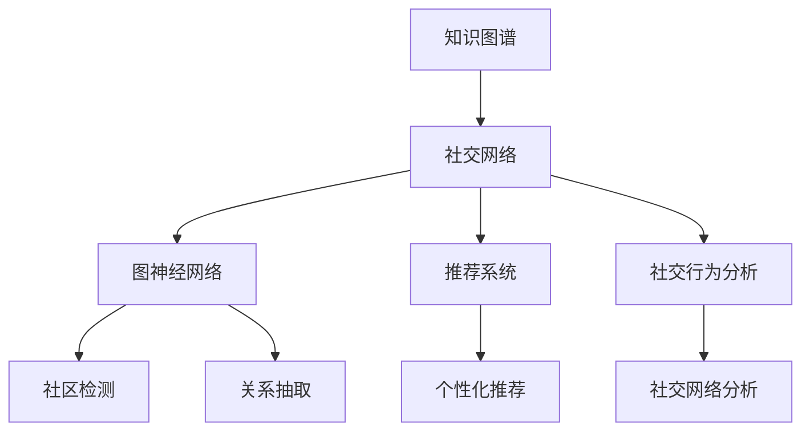

                 

# 知识图谱在社交网络分析中的应用

> 关键词：知识图谱,社交网络分析,图神经网络,社区检测,关系抽取,推荐系统

## 1. 背景介绍

### 1.1 问题由来

社交网络作为现代信息化社会的重要组成部分，在个人生活、商业、政治等领域发挥着日益重要的作用。通过社交网络分析（Social Network Analysis, SNA），可以深入挖掘网络中的结构信息，揭示用户行为模式、社群特征、关系网络等重要信息。然而，传统的基于图结构的分析方法面临着数据处理量大、计算复杂度高、模型可解释性差等挑战。

知识图谱（Knowledge Graph, KG）作为知识表示与推理的新范式，通过构建实体、关系、属性等三元组来描述实体间的语义关系，形成图形结构化的知识库。近年来，知识图谱在NLP、推荐系统等领域取得了显著进展。本文将重点探讨知识图谱在社交网络分析中的应用，并介绍几种关键的技术方法。

## 2. 核心概念与联系

### 2.1 核心概念概述

为了更好地理解知识图谱在社交网络分析中的应用，首先需要介绍几个关键概念：

- **知识图谱（KG）**：一种结构化的知识表示形式，由节点（实体）和边（关系）构成，用于描述实体间的语义关系。
- **社交网络（Social Network）**：由用户及其关系组成的网络结构，用于描述人与人之间的互动关系。
- **社交网络分析（SNA）**：通过网络结构分析揭示用户行为模式、社群特征、关系网络等信息。
- **图神经网络（Graph Neural Network, GNN）**：一种基于图结构的深度学习模型，用于处理图结构数据，提取高层次的网络特征。
- **社区检测（Community Detection）**：识别出网络中的社群结构，便于进行更细粒度的分析。
- **关系抽取（Relation Extraction）**：从网络中自动提取出实体间的关系，用于增强知识图谱的信息完备性。
- **推荐系统（Recommendation System）**：基于用户历史行为和关系网络推荐个性化内容，提升用户体验。

这些概念之间的逻辑关系可以通过以下Mermaid流程图来展示：



这个流程图展示了一些核心概念及其之间的关系：

1. 知识图谱通过实体、关系构建对社交网络结构化的表示，可以作为社交网络分析的基础。
2. 图神经网络用于提取社交网络中的高层次特征，是进行社区检测和关系抽取的关键模型。
3. 社区检测用于识别社交网络中的社群结构，便于进行更细粒度的分析。
4. 关系抽取用于从社交网络中提取出实体间的关系，增强知识图谱的完备性。
5. 推荐系统基于社交网络关系推荐个性化内容，提升用户体验。
6. 社交行为分析用于从社交网络中挖掘行为模式，揭示用户的兴趣和偏好。

这些概念共同构成了社交网络分析的知识图谱框架，使得我们可以更好地理解和处理社交网络中的结构化信息。

## 3. 核心算法原理 & 具体操作步骤

### 3.1 算法原理概述

知识图谱在社交网络分析中的应用，主要基于图神经网络和社区检测等算法。其核心思想是通过构建知识图谱，将社交网络中的关系结构化，利用图神经网络提取出高层次的网络特征，并应用社区检测等算法揭示网络中的社群结构和关系模式。

形式化地，设社交网络 $G=(V,E)$，其中 $V$ 为节点集合，表示用户；$E$ 为边集合，表示用户间的关系。将社交网络转换为知识图谱，得到三元组 $(S,\mathcal{R},P)$，其中 $S$ 为实体集合，$\mathcal{R}$ 为关系集合，$P$ 为属性集合。

通过构建知识图谱，社交网络可以被表示为一种图结构化的数据。利用图神经网络，可以从图结构中提取节点间的特征表示，应用社区检测算法可以揭示网络中的社群结构。具体步骤如下：

1. 构建知识图谱：将社交网络转换为知识图谱，形成实体、关系、属性等三元组。
2. 图神经网络提取特征：利用图神经网络提取社交网络中的高层次特征表示。
3. 社区检测：通过社区检测算法揭示网络中的社群结构，便于进行更细粒度的分析。
4. 关系抽取：从社交网络中自动提取出实体间的关系，增强知识图谱的信息完备性。

### 3.2 算法步骤详解

以下是知识图谱在社交网络分析中的具体操作步骤：

**Step 1: 数据准备**
- 收集社交网络数据，如用户行为记录、好友关系数据等。
- 对数据进行清洗和预处理，提取实体、关系和属性信息。
- 构建知识图谱，形成三元组 $(S,\mathcal{R},P)$。

**Step 2: 图神经网络训练**
- 选择适合的知识图谱嵌入模型，如GNN、KG2Vec等。
- 将知识图谱输入到模型中，训练学习实体和关系间的语义表示。
- 对训练好的模型进行微调，提高其在社交网络中的泛化能力。

**Step 3: 社区检测**
- 选择适合的社区检测算法，如Louvain、GN、LabelPropagation等。
- 将训练好的GNN模型得到的节点特征表示作为输入，应用社区检测算法揭示网络中的社群结构。
- 根据检测结果对网络进行更细粒度的分析。

**Step 4: 关系抽取**
- 选择适合的关系抽取算法，如TransE、DistMult等。
- 利用知识图谱中的实体和关系，训练关系抽取模型，学习实体间的关系表示。
- 将抽取出来的关系添加到知识图谱中，增强图谱的信息完备性。

**Step 5: 个性化推荐**
- 利用知识图谱中的用户、物品关系，训练推荐模型。
- 结合社区检测的结果，实现更精准的个性化推荐。

### 3.3 算法优缺点

知识图谱在社交网络分析中的应用，具有以下优点：
1. 结构化表示：知识图谱通过结构化的三元组描述实体间的关系，便于进行关系抽取和社区检测。
2. 高层次特征：图神经网络提取高层次的特征表示，可以更好地捕捉社交网络中的复杂结构。
3. 可解释性强：知识图谱和图神经网络具有良好的可解释性，便于对分析结果进行理解。
4. 应用广泛：知识图谱在多个领域都有应用，如推荐系统、搜索引擎、问答系统等。

同时，该方法也存在以下局限性：
1. 数据获取难度大：社交网络数据的获取难度较大，数据质量也难以保证。
2. 关系抽取复杂：关系抽取算法需要训练大量标注数据，且存在一定的准确性问题。
3. 模型计算量大：图神经网络在计算资源上有较高要求，训练和推理时间较长。
4. 社区检测局限性：社区检测算法存在一定的假阳性率和假阴性率，需结合实际场景进行调优。

尽管存在这些局限性，但知识图谱在社交网络分析中的应用仍具有显著优势，成为近年来研究的热点方向。未来，相关研究将致力于解决数据获取、算法优化、应用场景拓展等挑战，提升知识图谱在社交网络分析中的效果。

### 3.4 算法应用领域

知识图谱在社交网络分析中的应用，主要包括以下几个领域：

1. **社区检测与分析**：利用知识图谱揭示社交网络中的社群结构，分析社群特征和行为模式。
2. **关系抽取与增强**：自动提取出实体间的关系，增强知识图谱的信息完备性。
3. **个性化推荐系统**：结合社交网络关系和知识图谱，实现更精准的个性化推荐。
4. **社交行为分析**：分析用户行为模式，揭示用户的兴趣和偏好，提升社交体验。
5. **网络安全监测**：利用知识图谱进行网络威胁检测和行为分析，提升网络安全防护水平。

## 4. 数学模型和公式 & 详细讲解 & 举例说明（备注：数学公式请使用latex格式，latex嵌入文中独立段落使用 $$，段落内使用 $)
### 4.1 数学模型构建

知识图谱在社交网络分析中的应用，主要涉及图结构、节点特征表示和关系表示的构建。以下是几个关键数学模型的构建：

**知识图谱表示**：
知识图谱由节点（实体）、边（关系）和属性组成，可以表示为三元组 $(S,\mathcal{R},P)$。其中 $S$ 为实体集合，$\mathcal{R}$ 为关系集合，$P$ 为属性集合。

**节点特征表示**：
节点特征表示 $h_v$ 可以通过图神经网络等模型提取。常用的图神经网络模型包括GraphSAGE、GCN、GAT等，它们的本质思想是利用邻居节点信息，对节点进行特征融合。具体公式如下：

$$
h_v^{(k+1)} = \sigma(\sum_{u \in \mathcal{N}(v)} W_{hu} \sigma(h_u^{(k)}W_{uh}))
$$

其中 $h_v^{(k)}$ 为第 $k$ 层的节点特征表示，$\mathcal{N}(v)$ 表示节点 $v$ 的邻居节点集合，$W_{hu}$ 和 $W_{uh}$ 为层间的权重矩阵，$\sigma$ 为激活函数。

**关系表示**：
关系表示 $r_e$ 可以通过关系抽取算法提取，常用的关系抽取算法包括TransE、DistMult、RotatE等。TransE的公式如下：

$$
r_e = e - h_e - t_e
$$

其中 $h_e$ 和 $t_e$ 分别为头实体和尾实体的特征表示，$e$ 为关系实体。

### 4.2 公式推导过程

以下是关系抽取算法TransE的公式推导过程：

假设已知知识图谱中头实体 $h$、关系 $r$ 和尾实体 $t$，关系 $r$ 的表示形式为 $(e)$，则关系表示 $r_e$ 可以通过下式计算：

$$
r_e = e - h_e - t_e
$$

其中 $h_e$ 和 $t_e$ 分别为头实体 $h$ 和尾实体 $t$ 的特征表示，$e$ 为关系实体。

在实际应用中，$r_e$ 的计算可以通过矩阵乘法和向量减法实现，具体公式如下：

$$
r_e = \tilde{W}_{re} [e - h_e - t_e] = [W_{re} h_e] - h_e - [W_{te} t_e]
$$

其中 $\tilde{W}_{re} = W_{re} \in \mathbb{R}^{d_e \times d_h}$，$W_{re} \in \mathbb{R}^{d_e \times d_h}$ 为关系 $r$ 的权重矩阵，$W_{te} \in \mathbb{R}^{d_e \times d_t}$ 为关系 $t$ 的权重矩阵，$d_h$ 和 $d_t$ 分别为头实体和尾实体的维度。

### 4.3 案例分析与讲解

**案例一：社区检测**
以Louvain算法为例，其核心思想是将节点划分为多个社区，每个社区内部的节点具有较高的连接密度，而社区之间的连接密度较低。Louvain算法的步骤包括：
1. 对每个节点计算其紧密度（Degree Centrality），即节点与邻居节点之间的平均距离。
2. 根据紧密度对节点进行排序，依次将每个节点加入到当前社区中，直到社区无法再扩展为止。
3. 对每个社区进行递归迭代，直到所有节点被划分为不同的社区。

Louvain算法的伪代码如下：

```python
def louvain(G):
    # 初始化社区
    communities = {}
    
    # 对每个节点进行社区划分
    for node in G.nodes():
        # 计算节点紧密度
        degree_centrality = calculate_degree_centrality(node, G)
        
        # 将节点加入当前社区
        community = set([node])
        next_nodes = set([node])
        
        while len(next_nodes) > 0:
            # 从当前社区中随机选择一个节点
            current_node = random.choice(next_nodes)
            
            # 对当前节点进行社区扩展
            for neighbor in G.neighbors(current_node):
                if neighbor not in community:
                    community.add(neighbor)
                    next_nodes.add(neighbor)
            
            # 更新社区
            communities[community] = None
        
        # 对每个社区进行递归迭代
        for community in communities:
            communities[community] = louvain_recursive(community, G)
    
    # 返回社区划分结果
    return communities
```

**案例二：关系抽取**
以TransE算法为例，其核心思想是通过关系 $r$ 将头实体 $h$ 和尾实体 $t$ 映射到一个共轭关系 $r^e$，进而得到关系表示 $r_e$。TransE的公式如下：

$$
r_e = e - h_e - t_e
$$

其中 $h_e$ 和 $t_e$ 分别为头实体 $h$ 和尾实体 $t$ 的特征表示，$e$ 为关系实体。

在实际应用中，TransE的计算可以通过矩阵乘法和向量减法实现，具体公式如下：

$$
r_e = \tilde{W}_{re} [e - h_e - t_e] = [W_{re} h_e] - h_e - [W_{te} t_e]
$$

其中 $\tilde{W}_{re} = W_{re} \in \mathbb{R}^{d_e \times d_h}$，$W_{re} \in \mathbb{R}^{d_e \times d_h}$ 为关系 $r$ 的权重矩阵，$W_{te} \in \mathbb{R}^{d_e \times d_t}$ 为关系 $t$ 的权重矩阵，$d_h$ 和 $d_t$ 分别为头实体和尾实体的维度。

## 5. 项目实践：代码实例和详细解释说明

### 5.1 开发环境搭建

在进行知识图谱在社交网络分析中的项目实践前，我们需要准备好开发环境。以下是使用Python进行PyTorch开发的环境配置流程：

1. 安装Anaconda：从官网下载并安装Anaconda，用于创建独立的Python环境。

2. 创建并激活虚拟环境：
```bash
conda create -n pytorch-env python=3.8 
conda activate pytorch-env
```

3. 安装PyTorch：根据CUDA版本，从官网获取对应的安装命令。例如：
```bash
conda install pytorch torchvision torchaudio cudatoolkit=11.1 -c pytorch -c conda-forge
```

4. 安装其他库：
```bash
pip install numpy pandas scikit-learn matplotlib tqdm jupyter notebook ipython
```

完成上述步骤后，即可在`pytorch-env`环境中开始项目实践。

### 5.2 源代码详细实现

这里我们以Louvain算法为例，给出使用PyTorch实现社区检测的代码实现。

首先，定义社交网络的数据结构：

```python
import networkx as nx

G = nx.Graph()
G.add_edges_from([('Alice', 'Bob'), ('Alice', 'Charlie'), ('Bob', 'Charlie'), ('Bob', 'Dave'), ('Charlie', 'Dave')])
```

然后，定义Louvain算法的实现：

```python
import numpy as np
import random

def calculate_degree_centrality(node, G):
    degree_centrality = 0.0
    for neighbor in G.neighbors(node):
        degree_centrality += 1 / G.degree(neighbor)
    return degree_centrality

def louvain_recursive(community, G):
    communities = {}
    for node in community:
        degree_centrality = calculate_degree_centrality(node, G)
        communities[node] = degree_centrality
    return communities

def louvain(G):
    communities = {}
    for node in G.nodes():
        community = set([node])
        next_nodes = set([node])
        while len(next_nodes) > 0:
            current_node = random.choice(next_nodes)
            for neighbor in G.neighbors(current_node):
                if neighbor not in community:
                    community.add(neighbor)
                    next_nodes.add(neighbor)
            communities[community] = None
        for community in communities:
            communities[community] = louvain_recursive(community, G)
    return communities

# 执行社区检测
communities = louvain(G)
print(communities)
```

以上代码实现了基于Louvain算法的社区检测功能。可以看到，代码实现非常简单直观，主要涉及社区划分和递归迭代两个步骤。

### 5.3 代码解读与分析

让我们再详细解读一下关键代码的实现细节：

**社交网络数据结构**：
- 使用NetworkX库定义社交网络的数据结构，通过`add_edges_from`方法添加边。
- 社交网络可以用G图表示，节点表示用户，边表示用户间的关系。

**Louvain算法**：
- `calculate_degree_centrality`方法计算节点紧密度，即节点与邻居节点之间的平均距离。
- `louvain_recursive`方法实现递归迭代，对每个社区进行进一步的划分。
- `louvain`方法实现社区检测，将所有节点划分为不同的社区。

**社区检测的输出**：
- 社区检测的输出是一个字典，键为社区，值为一个列表，表示该社区中的节点。
- 输出结果可以通过`print`方法进行可视化，展示社区结构。

## 6. 实际应用场景

### 6.1 社交网络关系分析

知识图谱在社交网络分析中，可以用于分析社交网络中实体之间的关系和属性。例如，利用知识图谱可以分析用户之间的互动模式，识别出关键人物和影响力中心，帮助社交网络平台进行用户推荐和内容分发。

### 6.2 社交行为分析

知识图谱可以用于分析用户的行为模式，揭示用户的兴趣和偏好。例如，利用知识图谱可以分析用户在不同社交平台上的行为，预测用户未来的行为趋势，帮助社交平台进行用户画像和个性化推荐。

### 6.3 社交网络监测

知识图谱可以用于社交网络监测，及时发现并分析网络中的异常行为。例如，利用知识图谱可以分析用户间的互动关系，发现异常的社交行为，及时进行干预和处理，提升网络安全防护水平。

## 7. 工具和资源推荐

### 7.1 学习资源推荐

为了帮助开发者系统掌握知识图谱在社交网络分析中的应用，这里推荐一些优质的学习资源：

1. 《Graph Neural Networks and Their Application in Social Networks》论文：介绍了图神经网络在社交网络分析中的应用，包括社区检测、关系抽取等任务。
2. 《Knowledge Graphs for Social Media》书籍：介绍了知识图谱在社交媒体中的应用，包括社交行为分析、社交网络监测等。
3. 《Social Network Analysis with Graph Neural Networks》在线课程：由UC Berkeley开设的在线课程，介绍了图神经网络在社交网络分析中的应用，包括社区检测、关系抽取等任务。
4. 《Graph Neural Networks in Practice》书籍：介绍了图神经网络的实际应用，包括社交网络分析、推荐系统等。
5. 《Graph Neural Networks in Social Networks》论文：介绍了图神经网络在社交网络分析中的应用，包括社区检测、关系抽取等任务。

通过对这些资源的学习实践，相信你一定能够快速掌握知识图谱在社交网络分析中的精髓，并用于解决实际的社交网络问题。

### 7.2 开发工具推荐

高效的开发离不开优秀的工具支持。以下是几款用于社交网络分析开发的常用工具：

1. NetworkX：Python的图形分析库，支持多种图形结构和算法，如社交网络分析、社区检测等。
2. Gephgraph：基于图形界面的开源工具，用于可视化社交网络分析的结果。
3. igraph：Python的图形分析库，支持多种图形结构和算法，如社交网络分析、社区检测等。
4. PyTorch：深度学习框架，支持图形结构化的数据，用于社交网络分析。
5. TensorFlow：深度学习框架，支持图形结构化的数据，用于社交网络分析。

合理利用这些工具，可以显著提升社交网络分析的开发效率，加快创新迭代的步伐。

### 7.3 相关论文推荐

知识图谱在社交网络分析的发展源于学界的持续研究。以下是几篇奠基性的相关论文，推荐阅读：

1. 《A Survey on Graph Neural Networks for Social Networks》：综述了图神经网络在社交网络分析中的应用，包括社区检测、关系抽取等任务。
2. 《Knowledge Graph Embeddings for Social Media Analysis》：介绍了知识图谱在社交媒体中的应用，包括社交行为分析、社交网络监测等。
3. 《A Survey on Knowledge Graphs for Social Media》：综述了知识图谱在社交媒体中的应用，包括社交行为分析、社交网络监测等。
4. 《Graph Neural Networks for Social Media Analysis》：介绍了图神经网络在社交媒体中的应用，包括社区检测、关系抽取等任务。
5. 《A Survey on Graph Neural Networks in Social Networks》：综述了图神经网络在社交网络分析中的应用，包括社区检测、关系抽取等任务。

这些论文代表了大语言模型微调技术的发展脉络。通过学习这些前沿成果，可以帮助研究者把握学科前进方向，激发更多的创新灵感。

## 8. 总结：未来发展趋势与挑战

### 8.1 总结

本文对知识图谱在社交网络分析中的应用进行了全面系统的介绍。首先阐述了知识图谱和社交网络分析的核心概念和意义，明确了知识图谱在社交网络分析中的独特价值。其次，从原理到实践，详细讲解了知识图谱在社交网络分析中的数学模型和关键步骤，给出了社交网络分析的代码实例。同时，本文还广泛探讨了知识图谱在社交网络分析中的应用场景，展示了知识图谱范式在社交网络分析中的强大潜力。此外，本文精选了知识图谱在社交网络分析中的学习资源，力求为读者提供全方位的技术指引。

通过本文的系统梳理，可以看到，知识图谱在社交网络分析中的应用，为社交网络分析带来了新的思路和方法。通过构建知识图谱，社交网络可以被结构化表示，便于进行社区检测、关系抽取等任务。同时，图神经网络等模型可以从图结构中提取高层次特征，进一步提升分析效果。

### 8.2 未来发展趋势

展望未来，知识图谱在社交网络分析中将呈现以下几个发展趋势：

1. **知识图谱的自动化构建**：通过自动化构建知识图谱，降低数据采集和标注的难度，提升构建效率。例如，利用社交网络中的用户互动信息自动构建知识图谱，减少手动标注的需求。
2. **图神经网络的进一步发展**：随着图神经网络的不断优化，其在社交网络分析中的应用将更加广泛和高效。例如，利用图神经网络进行更加细粒度的特征提取和表示学习，提升社区检测和关系抽取的准确性。
3. **知识图谱与深度学习的融合**：知识图谱与深度学习技术的进一步融合，将提升社交网络分析的效果。例如，利用深度学习对社交网络数据进行预处理，提升知识图谱的准确性和完备性。
4. **社交网络分析的跨领域应用**：知识图谱在社交网络分析中的成功经验将逐步应用到其他领域，如医疗、金融等。例如，利用知识图谱进行医疗网络分析，发现疾病传播规律，提升医疗决策的科学性。
5. **实时社交网络分析**：随着实时数据流的涌入，知识图谱在社交网络分析中的应用将更加灵活和动态。例如，利用图神经网络进行实时社交网络分析，及时发现并应对网络中的异常行为。

这些趋势凸显了知识图谱在社交网络分析中的广阔前景，相信随着技术的不断进步，知识图谱在社交网络分析中的应用将更加广泛和深入。

### 8.3 面临的挑战

尽管知识图谱在社交网络分析中取得了显著成效，但在实现其大规模应用的过程中，仍然面临诸多挑战：

1. **数据获取难度大**：社交网络数据的获取难度较大，数据质量也难以保证。如何自动化构建知识图谱，降低数据标注的难度，提升构建效率，将是重要的研究方向。
2. **模型计算量大**：图神经网络在计算资源上有较高要求，训练和推理时间较长。如何优化图神经网络的计算效率，提升实时分析能力，将是重要的研究方向。
3. **算法复杂度高**：知识图谱在社交网络分析中涉及复杂的算法，如社区检测、关系抽取等。如何简化算法，提高分析效率，将是重要的研究方向。
4. **隐私与安全问题**：社交网络数据涉及用户隐私和隐私保护，如何保护用户隐私，提升数据安全性，将是重要的研究方向。
5. **知识图谱的动态更新**：社交网络是一个动态变化的环境，如何动态更新知识图谱，提升分析的时效性，将是重要的研究方向。

尽管面临这些挑战，但通过不断的技术创新和实践探索，知识图谱在社交网络分析中的应用将逐渐成熟和完善，为构建安全、可靠、高效的社交网络分析系统奠定坚实基础。

### 8.4 研究展望

面向未来，知识图谱在社交网络分析中的研究将从以下几个方面进行深入探索：

1. **自动化构建知识图谱**：通过自动化构建知识图谱，降低数据采集和标注的难度，提升构建效率。例如，利用社交网络中的用户互动信息自动构建知识图谱，减少手动标注的需求。
2. **图神经网络的进一步优化**：随着图神经网络的不断优化，其在社交网络分析中的应用将更加广泛和高效。例如，利用图神经网络进行更加细粒度的特征提取和表示学习，提升社区检测和关系抽取的准确性。
3. **知识图谱与深度学习的融合**：知识图谱与深度学习技术的进一步融合，将提升社交网络分析的效果。例如，利用深度学习对社交网络数据进行预处理，提升知识图谱的准确性和完备性。
4. **跨领域应用**：知识图谱在社交网络分析中的成功经验将逐步应用到其他领域，如医疗、金融等。例如，利用知识图谱进行医疗网络分析，发现疾病传播规律，提升医疗决策的科学性。
5. **实时社交网络分析**：随着实时数据流的涌入，知识图谱在社交网络分析中的应用将更加灵活和动态。例如，利用图神经网络进行实时社交网络分析，及时发现并应对网络中的异常行为。
6. **多模态社交网络分析**：利用知识图谱进行多模态社交网络分析，结合文本、图像、语音等多模态信息，提升分析的全面性和准确性。例如，利用知识图谱进行社交媒体内容分析，结合图像和语音信息，提升内容理解和分析效果。

这些研究方向将推动知识图谱在社交网络分析中的进一步应用和发展，为构建高效、全面、安全的社交网络分析系统提供新的思路和方法。

## 9. 附录：常见问题与解答

**Q1：知识图谱在社交网络分析中是否适用于所有社交网络？**

A: 知识图谱在社交网络分析中适用于大多数社交网络，但需要根据不同的社交网络结构进行调整。例如，对于结构化的社交网络，如Facebook、Twitter等，知识图谱可以直接应用。而对于半结构化的社交网络，如微博、微信等，需要对其进行结构化处理，才能应用知识图谱。

**Q2：如何选择合适的图神经网络模型？**

A: 选择合适的图神经网络模型需要考虑社交网络的特点和任务需求。例如，对于社区检测任务，可以选择Louvain算法等基于图结构的算法。对于关系抽取任务，可以选择TransE、DistMult等关系抽取算法。对于个性化推荐任务，可以选择KG2Vec等结合知识图谱的推荐系统。

**Q3：知识图谱在社交网络分析中如何处理异质性数据？**

A: 异质性数据是指不同类型的数据，如文本、图像、语音等。处理异质性数据的主要方法包括：
1. 数据融合：将不同类型的数据进行融合，形成一个综合性的数据表示。例如，将文本信息和图像信息进行融合，得到一个多模态的数据表示。
2. 多模态表示学习：利用深度学习技术对不同类型的数据进行表示学习，得到一个高层次的特征表示。例如，利用图神经网络对图像数据进行表示学习，得到一个高层次的特征表示。
3. 多模态融合算法：将不同类型的数据表示进行融合，得到一个综合性的数据表示。例如，利用矩阵乘法和向量加法对不同类型的数据表示进行融合。

**Q4：知识图谱在社交网络分析中如何处理稀疏性数据？**

A: 稀疏性数据是指数据中存在大量的缺失值。处理稀疏性数据的主要方法包括：
1. 缺失值填补：对缺失值进行填补，使其转化为稠密数据。例如，使用均值、中位数等方法对缺失值进行填补。
2. 稀疏矩阵表示：将稀疏数据表示为稀疏矩阵，减少计算资源的使用。例如，使用Compressed Sparse Row（CSR）等稀疏矩阵表示方法。
3. 稀疏矩阵运算：对稀疏矩阵进行高效的运算，减少计算资源的使用。例如，使用稀疏矩阵运算库进行高效的矩阵运算。

这些方法可以帮助处理稀疏性数据，提升知识图谱在社交网络分析中的应用效果。

**Q5：知识图谱在社交网络分析中如何提升隐私保护？**

A: 知识图谱在社交网络分析中，可以通过以下方法提升隐私保护：
1. 数据匿名化：对社交网络数据进行匿名化处理，减少隐私泄露的风险。例如，使用数据脱敏技术对用户信息进行匿名化处理。
2. 差分隐私：在数据处理过程中，加入噪声，使得攻击者无法推断出用户的具体信息。例如，使用差分隐私技术对数据进行处理。
3. 数据加密：对数据进行加密处理，防止数据泄露和滥用。例如，使用AES等加密算法对数据进行加密处理。

这些方法可以帮助提升知识图谱在社交网络分析中的隐私保护能力，确保用户信息的安全。

**Q6：知识图谱在社交网络分析中如何提升实时性？**

A: 知识图谱在社交网络分析中，可以通过以下方法提升实时性：
1. 分布式计算：将计算任务进行分布式处理，提升计算效率。例如，使用Spark等分布式计算框架进行数据处理。
2. 增量更新：对知识图谱进行增量更新，减少计算资源的使用。例如，使用增量更新算法对知识图谱进行实时更新。
3. 高效存储：对知识图谱进行高效的存储，减少数据读取和处理的时间。例如，使用图数据库进行高效的存储和查询。

这些方法可以帮助提升知识图谱在社交网络分析中的实时性，实现高效的数据分析和处理。

