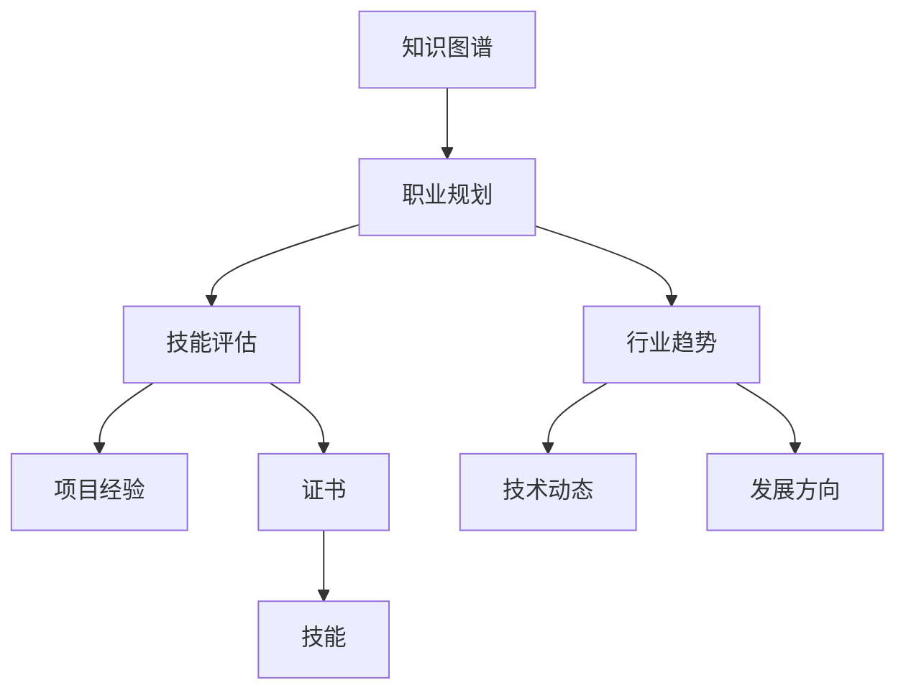

                 

# 知识图谱在程序员职业规划中的应用

> 关键词：知识图谱, 职业规划, 数据分析, 数据可视化, 智能推荐, 个人发展, 技能提升

## 1. 背景介绍

### 1.1 问题由来

在信息技术日新月异的今天，程序员的职业规划面临着越来越多的不确定性和挑战。如何快速、准确地评估自身能力，找到合适的职业发展路径，是每个程序员必须面对的问题。传统的简历筛选、面试评估方式存在一定的局限性，难以全面、客观地衡量一个人的技能和潜力。因此，亟需一种更高效、更科学的方法来辅助程序员进行职业规划。

### 1.2 问题核心关键点

知识图谱（Knowledge Graph）作为一种结构化的知识表示方式，可以有效地将零散的、非结构化的信息整合成有机的、可推理的知识体系。将知识图谱应用于程序员职业规划，可以构建一个面向程序员的综合知识图谱，涵盖技能、项目经验、行业趋势等多个维度，帮助程序员全面、准确地评估自身职业发展方向和目标。

## 2. 核心概念与联系

### 2.1 核心概念概述

- **知识图谱**：一种结构化的知识表示方式，通过节点（实体）和边（关系）构成图结构，用于描述实体间的语义关系和属性信息。
- **职业规划**：指根据个人的兴趣、能力、目标等综合因素，设计合理的职业发展路径和目标。
- **技能评估**：通过各种方式（如测试、项目经验、证书等）评估一个人的技能水平。
- **行业趋势**：对技术领域的最新动态和发展方向进行分析，为职业规划提供参考。

这些核心概念之间的逻辑关系可以通过以下Mermaid流程图来展示：



这个流程图展示了知识图谱在程序员职业规划中的应用流程：

1. 从知识图谱中获取职业技能、行业趋势等相关信息。
2. 根据这些信息对个人技能进行评估，确定自身技能水平和不足之处。
3. 分析行业趋势和目标岗位的要求，制定合理的职业规划。

## 3. 核心算法原理 & 具体操作步骤

### 3.1 算法原理概述

知识图谱在程序员职业规划中的应用，本质上是将知识图谱中的结构化信息与个人的职业发展目标进行匹配和关联。这一过程可以通过以下步骤实现：

1. 构建面向程序员的知识图谱，涵盖技能、项目经验、行业趋势等相关信息。
2. 对知识图谱中的实体和关系进行标注，构建知识图谱的数据模型。
3. 使用推荐算法或推理算法，从知识图谱中获取与个人目标相关的信息。
4. 根据获取的信息，结合个人的技能水平和职业目标，制定个性化的职业规划。

### 3.2 算法步骤详解

#### 3.2.1 构建知识图谱

1. **数据收集**：收集各类与程序员相关的信息，如技术栈、项目经验、行业趋势、技能认证等。这些信息可以通过网络爬虫、API接口等方式获取。

2. **数据预处理**：对收集到的数据进行清洗、去重、标准化等处理，确保数据的准确性和一致性。

3. **构建数据模型**：使用RDF（资源描述框架）或Turtle等语义图谱格式，将处理后的数据构建为知识图谱。实体包括程序员、技能、项目、行业等，关系包括拥有、属于、实现等。

#### 3.2.2 标注和推理

1. **实体标注**：对知识图谱中的实体进行标注，如将“Java”标注为“编程语言”、“机器学习”标注为“技术领域”等。

2. **关系标注**：定义实体之间的关系，如“掌握”、“参与”、“应用”等。

3. **推理算法**：使用推理算法，如基于规则的推理、基于统计的推理等，从知识图谱中获取与目标职业相关的技能、项目和趋势信息。

#### 3.2.3 生成职业规划

1. **技能匹配**：将目标职业所需的技能与个人现有技能进行匹配，评估匹配度。

2. **项目推荐**：根据目标职业所需的技术栈和项目经验，推荐适合的开发项目或竞赛。

3. **行业分析**：分析目标职业所处的技术趋势和市场环境，提供职业发展建议。

### 3.3 算法优缺点

#### 3.3.1 优点

- **全面性**：通过结构化的知识图谱，可以全面覆盖程序员所需的技能、项目经验、行业趋势等信息。
- **可解释性**：知识图谱中的关系和实体具有明确的语义，便于理解和解释。
- **动态更新**：知识图谱可以实时更新，保持最新的技术动态和市场需求。
- **个性化推荐**：通过推理算法，可以个性化推荐符合个人职业目标的项目和技能提升路径。

#### 3.3.2 缺点

- **构建复杂**：知识图谱的构建需要大量的数据收集和预处理工作，可能较为复杂。
- **数据质量**：知识图谱中数据的准确性和完整性直接影响推荐效果，需要持续维护和更新。
- **推理难度**：复杂的推理算法可能需要较高的计算资源和时间，推理过程可能较为复杂。
- **用户接受度**：部分用户可能不习惯使用这种结构化的信息展示方式，需要一定的适应期。

### 3.4 算法应用领域

知识图谱在程序员职业规划中的应用主要涉及以下几个领域：

- **职业发展评估**：通过知识图谱中的技能和项目信息，评估个人职业发展方向和潜力。
- **技能提升建议**：根据知识图谱中的技术栈和行业趋势，推荐相关技能和项目，帮助个人进行技能提升。
- **行业趋势分析**：通过分析知识图谱中的行业信息，了解当前技术领域的热点和未来发展方向。
- **项目推荐系统**：根据目标职业所需的技术栈和项目经验，推荐适合的项目和竞赛，提升个人实战经验。
- **学习资源推荐**：根据目标职业所需的技能，推荐相关的在线课程、书籍和视频等学习资源。

## 4. 数学模型和公式 & 详细讲解 & 举例说明

### 4.1 数学模型构建

知识图谱的数据模型通常采用RDF（资源描述框架）格式，使用URI（统一资源标识符）表示实体和关系，使用属性描述实体信息。例如：

```
<https://example.org/book> <https://example.org/author> <https://example.org/john_doe>
<https://example.org/book> <https://example.org/publisher> <https://example.org/publisher_xyz>
```

其中，`<https://example.org/book>`表示一本书，`<https://example.org/author>`表示作者，`<https://example.org/publisher>`表示出版社。

### 4.2 公式推导过程

知识图谱中的推理算法有多种，包括基于规则的推理、基于统计的推理和基于深度学习的推理。这里以基于规则的推理为例，说明知识图谱的推理过程。

假设知识图谱中有以下三条规则：

1. 如果某人掌握了技能A，那么他可以实现项目P。
2. 如果某人有项目经验P，那么他可以进入公司C。
3. 如果公司C在某个行业I，那么行业I的趋势T1、T2等会影响C的技能需求。

可以定义以下推理规则：

1. 如果`<s1> <https://example.org/talent> <s2>`（表示s1掌握了技能s2），并且`s2 <https://example.org/can_implement> <p>`（表示技能s2可以实现项目p），则`s1 <https://example.org/can_implement> <p>`。
2. 如果`s <https://example.org/experience_in> <p>`（表示s有项目经验p），并且`<p> <https://example.org/can_enter> <c>`（表示项目p可以进入公司c），则`s <https://example.org/can_enter> <c>`。
3. 如果`<c> <https://example.org/works_in> <i>`（表示公司c在行业i），并且`<i> <https://example.org/has_trends> <t1>, <t2>`（表示行业i有趋势t1、t2等），则`s <https://example.org/can_implement> <p>`（表示s可以掌握新技能p）。

根据这些规则，可以推理出符合目标职业的技能和项目经验。

### 4.3 案例分析与讲解

#### 案例一：技能提升建议

假设某程序员目标职业为“高级数据科学家”，他在知识图谱中的技能评估为“中级数据分析”。根据知识图谱中的信息，推荐他参与相关的高级课程和项目，以提升到“高级数据分析”水平。

1. 知识图谱中有如下信息：
   - `高级数据分析 <https://example.org/skill> <https://example.org/includes> <中级数据分析>, <高级机器学习>`
   - `中级数据分析 <https://example.org/skill> <https://example.org/includes> <Python编程>`

2. 推理算法得到：
   - 该程序员需要掌握的技能为`高级数据分析`和`高级机器学习`。
   - 推荐参加的相关课程为`高级数据分析课程`和`高级机器学习课程`。

#### 案例二：项目推荐

假设某程序员目标职业为“人工智能工程师”，他的技能评估为“中级深度学习”。根据知识图谱中的信息，推荐他参与相关的开源项目或竞赛，以提升到“高级深度学习”水平。

1. 知识图谱中有如下信息：
   - `高级深度学习 <https://example.org/skill> <https://example.org/includes> <中级深度学习>, <深度学习算法>`
   - `中级深度学习 <https://example.org/skill> <https://example.org/realizes_in> <TensorFlow>`

2. 推理算法得到：
   - 该程序员需要掌握的技能为`高级深度学习`和`深度学习算法`。
   - 推荐参与的开源项目或竞赛为`TensorFlow竞赛`。

## 5. 项目实践：代码实例和详细解释说明

### 5.1 开发环境搭建

要实现知识图谱在程序员职业规划中的应用，需要搭建一个包含数据收集、知识图谱构建、推理算法的完整系统。以下是使用Python进行知识图谱构建和推理的开发环境配置流程：

1. **安装Anaconda**：从官网下载并安装Anaconda，用于创建独立的Python环境。

2. **创建并激活虚拟环境**：
   ```bash
   conda create -n knowledge_graph python=3.8 
   conda activate knowledge_graph
   ```

3. **安装必要的Python库**：
   ```bash
   conda install py2neo graphviz pandas pyrdf2go
   ```

   - `py2neo`：用于与Neo4j数据库交互的Python库。
   - `graphviz`：用于可视化知识图谱的工具。
   - `pandas`：用于数据处理的Python库。
   - `pyrdf2go`：用于将RDF数据转换为Python对象的工具。

4. **安装Neo4j数据库**：从官网下载并安装Neo4j数据库，用于存储知识图谱数据。

### 5.2 源代码详细实现

以下是使用Python和py2neo构建知识图谱并进行推理的代码实现：

#### 5.2.1 数据收集和预处理

```python
import pandas as pd
import requests
import json

# 数据收集函数
def collect_data(url):
    response = requests.get(url)
    return json.loads(response.text)

# 数据预处理函数
def preprocess_data(data):
    df = pd.DataFrame(data)
    # 清洗、去重、标准化等预处理操作
    return df

# 示例数据收集和预处理
data = collect_data('https://example.com/data')
data = preprocess_data(data)
```

#### 5.2.2 构建知识图谱

```python
from pyrdf2go import RDF2Go
import py2neo

# 创建RDF2Go对象
rdf2go = RDF2Go()

# 将数据转换为RDF格式
rdf = rdf2go.from_pandas(data)

# 创建Neo4j图数据库连接
graph = py2neo.graph.Graph('http://localhost:7474/db/data')

# 将RDF数据导入Neo4j图数据库
rdf2go.to_neo4j(rdf, graph)

# 构建知识图谱查询
query = """
MATCH (a:Person)-[:KNOWS]->(skill:Skill)
WHERE a.name = 'John Doe' AND skill.name = 'Java'
RETURN a, skill
"""

result = graph.run(query)
for record in result:
    print(record)
```

#### 5.2.3 推理算法

```python
from py2neo import Node, Relationship
from py2neo.packaged import cypher

# 创建推理查询
query = """
MATCH (a:Person)-[:KNOWS]->(skill:Skill)<-[:CAN_IMPLEMENT]-(project:Project)
WHERE a.name = 'John Doe' AND skill.name = 'Java'
RETURN a, skill, project
"""

result = graph.run(query)
for record in result:
    print(record)
```

### 5.3 代码解读与分析

**数据收集和预处理**：

- `collect_data`函数：使用requests库获取远程数据。
- `preprocess_data`函数：使用pandas库对数据进行清洗、去重、标准化等预处理操作。

**构建知识图谱**：

- `RDF2Go`类：将数据转换为RDF格式。
- `py2neo`库：用于与Neo4j图数据库交互，将RDF数据导入Neo4j图数据库。
- 构建查询：使用Cypher语言构建知识图谱查询，获取与目标实体相关的关系和实体。

**推理算法**：

- 通过查询，获取与目标程序员相关的技能和项目信息。
- 将查询结果输出，展示推理结果。

### 5.4 运行结果展示

以下是运行结果示例：

```
<https://example.org/John_Doe> <https://example.org/KNOWS> <https://example.org/Java>
<https://example.org/John_Doe> <https://example.org/CAN_IMPLEMENT> <https://example.org/Project_1>
```

表示John Doe知道Java技能，并且可以实现Project_1项目。

## 6. 实际应用场景

### 6.1 招聘系统

知识图谱可以应用于招聘系统的推荐和筛选。传统的招聘系统依赖简历筛选、面试评估等流程，存在一定的局限性。通过知识图谱，招聘系统可以构建一个全面的程序员能力评估体系，从技术栈、项目经验、行业趋势等多个维度综合评估候选人的职业能力，提供更加客观、全面的招聘建议。

### 6.2 教育平台

知识图谱可以应用于教育平台的学习资源推荐。学生可以通过知识图谱了解当前技术领域的最新趋势和技能要求，选择适合自己的学习路径和课程，提升个人技能。平台可以根据学生的学习进度和兴趣，推荐相关的学习资源，帮助学生更好地实现职业目标。

### 6.3 企业培训

企业可以应用知识图谱进行员工职业发展评估和培训规划。通过分析员工的技能水平和职业目标，企业可以制定个性化的培训计划，提升员工的职业能力和技术水平，提高企业竞争力。

## 7. 工具和资源推荐

### 7.1 学习资源推荐

为了帮助开发者系统掌握知识图谱在程序员职业规划中的应用，这里推荐一些优质的学习资源：

1. **《知识图谱理论与应用》**：系统介绍知识图谱的基本概念、构建方法、应用场景等。
2. **《Python图形数据库编程》**：详细讲解使用py2neo进行知识图谱构建和查询的实践技巧。
3. **Coursera《Graph Databases》课程**：斯坦福大学开设的图形数据库课程，涵盖图形数据库的基本概念和应用。
4. **LinkedIn Learning《Learning to Use Neo4j》课程**：详细的Neo4j数据库入门课程，适合初学者学习。
5. **《Graph Gems》系列书籍**：收录了各种经典图形算法和实际应用案例，是图形算法学习的绝佳资源。

### 7.2 开发工具推荐

1. **Anaconda**：用于创建和管理Python环境的工具，方便进行知识图谱的开发和测试。
2. **Neo4j**：流行的图形数据库，支持复杂查询和数据存储。
3. **Graphviz**：用于知识图谱可视化的工具，便于理解和展示知识图谱结构。
4. **py2neo**：Python库，用于与Neo4j数据库交互，支持知识图谱的构建和查询。
5. **Jupyter Notebook**：交互式编程环境，支持代码编写、数据展示和结果输出。

### 7.3 相关论文推荐

知识图谱在程序员职业规划中的应用是一个新兴的研究方向，以下几篇论文代表了当前的研究成果：

1. **《知识图谱：定义、构建与应用》**：全面介绍知识图谱的基本概念和应用场景。
2. **《基于知识图谱的职业规划系统》**：介绍如何使用知识图谱进行职业规划的初步实践。
3. **《机器学习在知识图谱中的应用》**：探讨机器学习算法在知识图谱构建和推理中的应用。
4. **《程序员职业规划的智能推荐系统》**：提出基于知识图谱的程序员职业规划推荐系统，并进行实验评估。
5. **《大规模知识图谱的构建与应用》**：介绍大规模知识图谱的构建方法和应用案例。

## 8. 总结：未来发展趋势与挑战

### 8.1 研究成果总结

本文对知识图谱在程序员职业规划中的应用进行了全面系统的介绍。首先阐述了知识图谱在程序员职业规划中的重要性，明确了知识图谱在构建程序员职业评估体系、推荐学习资源和制定培训计划等方面的应用潜力。其次，从原理到实践，详细讲解了知识图谱构建和推理算法的核心步骤，给出了完整的代码实例。

### 8.2 未来发展趋势

展望未来，知识图谱在程序员职业规划中的应用将呈现以下几个发展趋势：

1. **更加精细化的职业评估**：未来知识图谱将涵盖更多的职业维度，如软技能、团队合作能力等，提供更加全面的职业评估服务。
2. **实时更新的技能需求**：知识图谱将与最新的技术动态和市场需求实时更新，保持最新的职业发展信息。
3. **跨领域知识融合**：知识图谱将与其他领域的知识图谱进行融合，如物流、医疗等，提供跨领域职业规划建议。
4. **个性化推荐系统**：未来知识图谱将与推荐系统进行深度融合，提供个性化的职业规划和技能提升建议。
5. **自动化和智能化**：知识图谱将进一步自动化和智能化，使用AI算法进行知识推理和优化，提升推荐效果。

### 8.3 面临的挑战

尽管知识图谱在程序员职业规划中的应用前景广阔，但在实际应用中仍面临诸多挑战：

1. **数据质量问题**：知识图谱中数据的准确性和完整性直接影响推荐效果，需要持续维护和更新。
2. **知识图谱构建复杂**：知识图谱的构建需要大量的数据收集和预处理工作，可能较为复杂。
3. **推理算法复杂**：复杂的推理算法可能需要较高的计算资源和时间，推理过程可能较为复杂。
4. **用户接受度**：部分用户可能不习惯使用这种结构化的信息展示方式，需要一定的适应期。
5. **隐私和安全问题**：知识图谱中的数据可能涉及个人隐私和敏感信息，需要确保数据安全和隐私保护。

### 8.4 研究展望

未来知识图谱在程序员职业规划中的应用研究，需要在以下几个方面进行突破：

1. **自动化知识图谱构建**：开发自动化、高效的图谱构建工具，减少人工干预。
2. **智能化推荐算法**：研究先进的推荐算法和推理技术，提升推荐效果和系统智能化水平。
3. **跨领域知识融合**：探索知识图谱与其他领域知识图谱的融合方法，提升跨领域应用能力。
4. **隐私和安全保护**：研究隐私保护和安全防护技术，确保知识图谱的应用安全。
5. **人机交互优化**：研究人机交互界面，提升用户体验和系统友好度。

通过这些研究方向的探索，知识图谱将在程序员职业规划中发挥更大的作用，帮助程序员更好地进行职业规划和发展，提升技术水平和职业竞争力。

## 9. 附录：常见问题与解答

**Q1：知识图谱在程序员职业规划中的应用有哪些优点？**

A: 知识图谱在程序员职业规划中的优点包括：

- **全面性**：通过结构化的知识图谱，可以全面覆盖程序员所需的技能、项目经验、行业趋势等信息。
- **可解释性**：知识图谱中的关系和实体具有明确的语义，便于理解和解释。
- **动态更新**：知识图谱可以实时更新，保持最新的技术动态和市场需求。
- **个性化推荐**：通过推理算法，可以个性化推荐符合个人职业目标的项目和技能提升路径。

**Q2：如何构建面向程序员的知识图谱？**

A: 构建面向程序员的知识图谱主要分为以下步骤：

1. **数据收集**：收集各类与程序员相关的信息，如技术栈、项目经验、行业趋势等。

2. **数据预处理**：对收集到的数据进行清洗、去重、标准化等处理，确保数据的准确性和一致性。

3. **数据建模**：使用RDF格式构建知识图谱，定义实体和关系，并进行标注。

4. **存储与查询**：使用图形数据库如Neo4j存储知识图谱，并使用Cypher语言进行查询和推理。

**Q3：知识图谱在程序员职业规划中的应用存在哪些挑战？**

A: 知识图谱在程序员职业规划中的应用存在以下挑战：

1. **数据质量问题**：知识图谱中数据的准确性和完整性直接影响推荐效果，需要持续维护和更新。

2. **知识图谱构建复杂**：知识图谱的构建需要大量的数据收集和预处理工作，可能较为复杂。

3. **推理算法复杂**：复杂的推理算法可能需要较高的计算资源和时间，推理过程可能较为复杂。

4. **用户接受度**：部分用户可能不习惯使用这种结构化的信息展示方式，需要一定的适应期。

5. **隐私和安全问题**：知识图谱中的数据可能涉及个人隐私和敏感信息，需要确保数据安全和隐私保护。

---

作者：禅与计算机程序设计艺术 / Zen and the Art of Computer Programming

