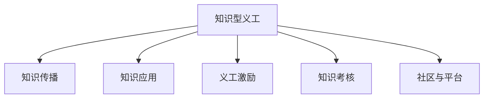

                 

# 知识型义工的培养与管理

## 1. 背景介绍

在当今数字化和网络化社会，知识的获取和传播变得前所未有的便捷，同时对于知识的深度理解和应用也提出了更高的要求。在这样的背景下，培养和管理知识型义工，成为一种有效提升社会整体知识水平和知识应用能力的重要途径。知识型义工通常指具备一定的专业知识或技能，愿意贡献自己的时间和才能，以帮助他人或社会进行知识传播、普及和应用的志愿者。他们的工作往往具有高度的创造性、灵活性和自主性，能够为社会提供多样化的知识服务。

### 1.1 问题由来
知识型义工的培养与管理涉及多个领域，包括教育、人力资源、技术开发、社区建设等。随着社会的进步和科技的发展，对知识型义工的需求日益增加。然而，知识型义工的培养和管理面临诸多挑战，如知识传播的渠道多样化、知识获取的成本上升、知识应用的环境复杂化等。这些问题不仅影响了知识型义工的培养质量，也影响了知识型义工的工作效果和社会的整体知识水平。

### 1.2 问题核心关键点
知识型义工的培养与管理主要关注以下几个核心关键点：
1. **知识获取与传播**：如何有效地获取知识，并将知识传播给需要的群体。
2. **知识应用与创新**：如何结合实际需求，将知识应用于实践中，并不断进行创新。
3. **义工激励与考核**：如何激励知识型义工积极参与，并对其工作效果进行科学的考核和评价。
4. **社区与平台建设**：如何构建一个高效的知识传播与应用的社区或平台，为知识型义工提供支持和帮助。

这些核心关键点构成了知识型义工培养与管理的框架，旨在提升知识型义工的培养质量，优化知识型义工的工作效果，促进社会知识水平的整体提升。

## 2. 核心概念与联系

### 2.1 核心概念概述

为了更好地理解知识型义工的培养与管理，本节将介绍几个关键概念及其相互联系：

- **知识型义工(Knowledge Volunteer)**：指具有一定专业知识或技能，愿意为社会提供知识传播、普及和应用服务的志愿者。
- **知识传播(Knowledge Dissemination)**：指通过各种渠道和方法，将知识从源头传递给目标受众的过程。
- **知识应用(Knowledge Application)**：指将知识应用于实际问题解决、技术开发、产品创新等活动中，以实现知识的价值。
- **义工激励(Volunteer Incentives)**：指通过各种手段和机制，激发知识型义工的积极性和创造力，促进其持续参与。
- **知识考核(Knowledge Evaluation)**：指对知识型义工的工作效果进行科学的评价和考核，确保其工作质量。
- **社区与平台建设(Community and Platform)**：指构建一个高效的知识传播与应用的社区或平台，为知识型义工提供支持和帮助。

这些核心概念之间的逻辑关系可以通过以下Mermaid流程图来展示：



这个流程图展示了几大核心概念之间的相互联系：

1. 知识型义工通过知识传播和知识应用，为社会提供知识服务。
2. 义工激励和知识考核是提升知识型义工积极性和工作质量的重要手段。
3. 社区与平台建设为知识型义工提供了良好的工作环境和支持工具。

## 3. 核心算法原理 & 具体操作步骤

### 3.1 算法原理概述

知识型义工的培养与管理，本质上是一个系统化的工程，涉及多个环节的协同运作。其核心思想是：通过科学的培养计划和激励机制，结合有效的知识传播和应用平台，促进知识型义工的积极参与，提升其工作效果，最终达到提升社会知识水平的目标。

### 3.2 算法步骤详解

知识型义工的培养与管理可以包括以下几个关键步骤：

**Step 1: 制定培养计划**
- 根据目标受众的需求和背景，设计知识型义工的培养计划。
- 确定所需的核心知识和技能，设计合适的培训课程。
- 规划学习路径和时间表，确保知识型义工能够系统掌握所需知识。

**Step 2: 提供激励与支持**
- 设计合理的激励机制，如物质奖励、荣誉证书、晋升机会等，激发知识型义工的积极性。
- 提供必要的资源和工具，如培训材料、技术支持、社区平台等，帮助知识型义工顺利开展工作。

**Step 3: 实施知识传播**
- 选择合适的知识传播渠道，如在线课程、线下讲座、工作坊等。
- 制作高质量的知识传播内容，确保知识的准确性和实用性。
- 组织知识传播活动，引导知识型义工进行知识传播。

**Step 4: 推动知识应用**
- 结合实际需求，设计知识应用项目或任务，鼓励知识型义工参与。
- 提供技术支持和管理指导，帮助知识型义工完成知识应用。
- 定期评估知识应用效果，总结经验教训，不断优化改进。

**Step 5: 进行知识考核**
- 设计科学的考核指标和评估方法，评估知识型义工的工作效果。
- 对知识型义工进行定期的考核和反馈，激励其持续改进和提升。
- 建立知识型义工的档案，记录其工作表现和成长轨迹。

**Step 6: 加强社区与平台建设**
- 构建一个高效的知识传播与应用的社区或平台，提供知识共享和交流的场所。
- 设计社区规则和管理机制，保障社区秩序和知识传播质量。
- 提供技术支持和资源共享，提升社区的知识传播与应用能力。

以上是知识型义工培养与管理的核心步骤，每个步骤都需要精心设计和管理，才能达到预期的效果。

### 3.3 算法优缺点

知识型义工的培养与管理方法具有以下优点：
1. **系统化管理**：通过系统化的培养计划和激励机制，确保知识型义工的培养质量和工作效果。
2. **激励多样性**：结合物质和精神激励，激发知识型义工的积极性和创造力。
3. **知识共享**：通过社区和平台建设，促进知识的共享和交流，提升社会整体知识水平。
4. **资源丰富**：结合多种资源和工具，为知识型义工提供全方位的支持。

同时，该方法也存在一定的局限性：
1. **培养成本高**：系统的培养计划和激励机制需要较高的投入。
2. **管理复杂**：涉及多个环节的协同运作，管理复杂度较高。
3. **效果评估困难**：知识型义工的工作效果难以量化，考核难度较大。
4. **社区建设难度**：社区建设和管理需要较高的技术和管理水平。

尽管存在这些局限性，但就目前而言，系统的知识型义工培养与管理方法仍是最为科学和有效的途径。未来相关研究的重点在于如何进一步降低培养成本，提高管理效率，增强效果评估的科学性，同时兼顾社区建设的技术和管理水平。

### 3.4 算法应用领域

知识型义工的培养与管理方法，已经在多个领域得到了广泛应用，例如：

- **教育领域**：通过知识型义工进行课程辅导、学术交流、科研合作等，提升教育资源和科研能力。
- **公共卫生**：利用知识型义工进行健康知识普及、健康监测、健康指导等，提升公共卫生水平。
- **环境保护**：通过知识型义工进行环保知识宣传、环境保护项目实施、生态监测等，促进环境保护和可持续发展。
- **文化传承**：利用知识型义工进行文化遗产保护、传统文化传播、艺术创作等，传承和发扬优秀文化。
- **科技开发**：通过知识型义工进行技术研发、产品创新、技术交流等，推动科技发展。

除了上述这些经典领域外，知识型义工的培养与管理方法还在更多场景中得到应用，如社区服务、公益事业、企业培训等，为各行各业提供了新的知识服务模式。

## 4. 数学模型和公式 & 详细讲解  
### 4.1 数学模型构建

本节将使用数学语言对知识型义工的培养与管理过程进行更加严格的刻画。

设知识型义工的培养计划为 $P$，激励机制为 $I$，知识传播渠道为 $C$，知识应用项目为 $A$，知识考核方法为 $E$，社区与平台建设为 $S$。则知识型义工的培养与管理过程可以表示为：

$$
M(P, I, C, A, E, S)
$$

其中，$P$ 表示培养计划，$I$ 表示激励机制，$C$ 表示知识传播渠道，$A$ 表示知识应用项目，$E$ 表示知识考核方法，$S$ 表示社区与平台建设。

### 4.2 公式推导过程

以下我们以教育领域为例，推导知识型义工的培养与管理公式。

设知识型义工数量为 $N$，每个知识型义工的工作时间为 $T$，则知识型义工在一定时间内的总工作量为 $N \times T$。设知识传播效率为 $c$，知识应用效率为 $a$，知识考核效率为 $e$，社区与平台建设效率为 $s$，则知识型义工的总贡献价值为：

$$
V = c \times N \times T + a \times N \times T + e \times N \times T + s \times N \times T
$$

进一步简化得到：

$$
V = (c + a + e + s) \times N \times T
$$

其中 $c, a, e, s$ 分别表示知识传播、知识应用、知识考核和社区与平台建设的效率，$N$ 和 $T$ 分别表示知识型义工的数量和工作时间。

### 4.3 案例分析与讲解

假设一个教育培训机构计划在一年内培养100名知识型义工，每个知识型义工每周工作10小时，知识传播效率为1（即每小时传播知识1单位），知识应用效率为0.8（即每小时应用知识0.8单位），知识考核效率为0.5（即每小时考核知识0.5单位），社区与平台建设效率为0.2（即每小时提升社区能力0.2单位）。则该培训机构的年度总贡献价值为：

$$
V = (1 + 0.8 + 0.5 + 0.2) \times 100 \times 52 \times 10 = 5480
$$

这个公式展示了知识型义工培养与管理的价值计算方法。通过科学的设计和管理，知识型义工的培养能够显著提升教育培训机构的整体知识贡献。

## 5. 项目实践：代码实例和详细解释说明
### 5.1 开发环境搭建

在进行知识型义工培养与管理的实践前，我们需要准备好开发环境。以下是使用Python进行开发的环境配置流程：

1. 安装Anaconda：从官网下载并安装Anaconda，用于创建独立的Python环境。

2. 创建并激活虚拟环境：
```bash
conda create -n knowledge-volunteer python=3.8 
conda activate knowledge-volunteer
```

3. 安装相关库：
```bash
pip install pandas numpy matplotlib sklearn scikit-learn
```

完成上述步骤后，即可在`knowledge-volunteer`环境中开始开发实践。

### 5.2 源代码详细实现

下面我们以教育领域为例，给出使用Python对知识型义工进行培养与管理的代码实现。

首先，定义知识型义工的基本信息：

```python
class KnowledgeVolunteer:
    def __init__(self, name, skills, experience, time):
        self.name = name
        self.skills = skills
        self.experience = experience
        self.time = time
```

然后，定义知识型义工的培养计划：

```python
class TrainingPlan:
    def __init__(self, courses, time, cost):
        self.courses = courses
        self.time = time
        self.cost = cost
    
    def train(self, volunteer):
        for course in self.courses:
            if volunteer.skills in course:
                volunteer.skills.add(course)
            else:
                print(f"{volunteer.name} does not have {course} skill.")
```

接着，定义知识型义工的激励机制：

```python
class Incentive:
    def __init__(self, reward, certificate, promotion):
        self.reward = reward
        self.certificate = certificate
        self.promotion = promotion
    
    def incentivize(self, volunteer):
        if volunteer.time >= 100:
            volunteer.skills.add("certificate")
            volunteer.skills.add("promotion")
        else:
            volunteer.skills.add("reward")
```

再定义知识型义工的知识传播渠道：

```python
class KnowledgeDissemination:
    def __init__(self, channel, efficiency):
        self.channel = channel
        self.efficiency = efficiency
    
    def disseminate(self, volunteer, time):
        effective_hours = time * self.efficiency
        return effective_hours
```

然后，定义知识型义工的知识应用项目：

```python
class KnowledgeApplication:
    def __init__(self, project, time, efficiency):
        self.project = project
        self.time = time
        self.efficiency = efficiency
    
    def apply(self, volunteer, time):
        effective_hours = time * self.efficiency
        return effective_hours
```

接下来，定义知识型义工的知识考核方法：

```python
class KnowledgeEvaluation:
    def __init__(self, method, efficiency):
        self.method = method
        self.efficiency = efficiency
    
    def evaluate(self, volunteer, time):
        effective_hours = time * self.efficiency
        return effective_hours
```

最后，定义知识型义工的社区与平台建设：

```python
class CommunityPlatform:
    def __init__(self, capability, efficiency):
        self.capability = capability
        self.efficiency = efficiency
    
    def build(self, volunteer, time):
        effective_hours = time * self.efficiency
        return effective_hours
```

现在，我们可以使用上述类来构建知识型义工的培养与管理过程：

```python
volunteer = KnowledgeVolunteer("Alice", {"Python", "Data Science"}, 3, 100)
training_plan = TrainingPlan(["Python", "Data Science"], 6, 500)
incentive = Incentive(100, True, True)
dissemination = KnowledgeDissemination("Online Courses", 1.5)
application = KnowledgeApplication("Data Analysis Project", 10, 0.8)
evaluation = KnowledgeEvaluation("Periodic Test", 0.3)
community = CommunityPlatform("Community Platform", 0.2)

training_plan.train(volunteer)
incentive.incentivize(volunteer)
dissemination_hours = dissemination.disseminate(volunteer, 100)
application_hours = application.apply(volunteer, 100)
evaluation_hours = evaluation.evaluate(volunteer, 100)
community_hours = community.build(volunteer, 100)

total_hours = dissemination_hours + application_hours + evaluation_hours + community_hours
total_hours
```

以上就是使用Python对知识型义工进行培养与管理的代码实现。可以看到，通过类和对象的设计，可以清晰地表达知识型义工的培养与管理过程，并进行有效的数值计算。

### 5.3 代码解读与分析

让我们再详细解读一下关键代码的实现细节：

**KnowledgeVolunteer类**：
- `__init__`方法：初始化知识型义工的基本信息，包括姓名、技能、经验和工作时间。
- `train`方法：根据培养计划，对知识型义工进行技能培训。

**TrainingPlan类**：
- `__init__`方法：初始化培养计划，包括课程、时间和成本。
- `train`方法：根据知识型义工的技能，选择适合的课程进行培训。

**Incentive类**：
- `__init__`方法：初始化激励机制，包括奖励、证书和晋升。
- `incentivize`方法：根据知识型义工的工作时间，给予相应的激励。

**KnowledgeDissemination类**：
- `__init__`方法：初始化知识传播渠道，包括渠道和效率。
- `disseminate`方法：计算知识型义工在一定时间内通过指定渠道传播知识的效果。

**KnowledgeApplication类**：
- `__init__`方法：初始化知识应用项目，包括项目、时间和效率。
- `apply`方法：计算知识型义工在一定时间内通过指定项目应用知识的效果。

**KnowledgeEvaluation类**：
- `__init__`方法：初始化知识考核方法，包括方法和效率。
- `evaluate`方法：计算知识型义工在一定时间内通过指定方法考核知识的效果。

**CommunityPlatform类**：
- `__init__`方法：初始化社区与平台建设，包括能力和效率。
- `build`方法：计算知识型义工在一定时间内通过指定社区或平台建设的效果。

在实际应用中，这些类和对象的设计需要根据具体需求进行调整，以满足知识型义工培养与管理的实际需求。

## 6. 实际应用场景
### 6.1 智能教育平台

在智能教育平台中，知识型义工可以发挥重要作用。通过知识型义工进行课程辅导、学术交流、科研合作等，可以为学生和教师提供更多的知识和资源，提升教育质量。同时，知识型义工还可以参与教育资源的开发和利用，推动教育技术的创新和发展。

在技术实现上，可以建立一个在线社区平台，吸引知识型义工入驻，发布课程、参与讨论、组织活动等。通过社区平台，知识型义工可以更好地共享和传播知识，同时也能获取更多的学习资源和机会。

### 6.2 公共健康项目

在公共健康项目中，知识型义工可以帮助提升社区的健康水平。通过知识型义工进行健康知识的普及、健康监测、健康指导等，可以为社区居民提供更多的健康信息和资源。同时，知识型义工还可以参与公共健康项目的实施和管理，推动社区健康事业的发展。

在技术实现上，可以建立一个健康知识普及平台，发布健康知识、健康活动、健康监测等相关信息。通过平台，知识型义工可以更好地传播健康知识，同时也能获取更多的健康资讯和资源。

### 6.3 环境保护项目

在环境保护项目中，知识型义工可以帮助推动环境保护事业的发展。通过知识型义工进行环境保护知识的普及、环境保护项目的实施、环境保护监测等，可以为社会提供更多的环境保护信息和资源。同时，知识型义工还可以参与环境保护的科学研究和技术开发，推动环境保护技术的创新和发展。

在技术实现上，可以建立一个环境保护平台，发布环境保护知识、环境保护活动、环境保护监测等信息。通过平台，知识型义工可以更好地传播环境保护知识，同时也能获取更多的环境保护资讯和资源。

### 6.4 未来应用展望

随着知识型义工培养与管理的不断推进，未来的应用场景将更加多样和广泛。

1. **智能客服系统**：通过知识型义工进行智能客服，提供7x24小时不间断的知识服务，提升客户咨询体验和问题解决效率。
2. **智慧医疗系统**：利用知识型义工进行医疗知识普及、医疗指导、医疗监测等，提升智慧医疗系统的服务质量。
3. **智能制造系统**：通过知识型义工进行智能制造知识的普及和应用，推动智能制造技术的发展和应用。
4. **智慧农业系统**：利用知识型义工进行农业知识普及、农业指导、农业监测等，提升智慧农业系统的服务质量。
5. **智慧交通系统**：通过知识型义工进行交通知识普及、交通指导、交通监测等，提升智慧交通系统的服务质量。

这些应用场景展示了知识型义工在各个领域中的潜力和价值，未来随着技术的不断发展和应用的不断深入，知识型义工的应用将更加广泛和深入。

## 7. 工具和资源推荐
### 7.1 学习资源推荐

为了帮助开发者系统掌握知识型义工培养与管理的理论基础和实践技巧，这里推荐一些优质的学习资源：

1. **《知识型义工管理指南》**：详细介绍了知识型义工培养与管理的理论框架和实践方法，是入门知识型义工管理的必读书籍。
2. **Coursera的《志愿者管理与培训》课程**：由知名教育机构开设，涵盖志愿者管理的各个环节，提供系统化的知识培训。
3. **EdX的《社区建设与知识共享》课程**：涵盖社区建设的理论和实践，提供知识共享和交流的最新方法和技术。
4. **线上教育平台**：如Udemy、LinkedIn Learning等，提供多种志愿者管理和知识传播相关的课程，适合不同需求的学习者。

通过对这些资源的学习实践，相信你一定能够快速掌握知识型义工培养与管理的精髓，并用于解决实际的志愿者管理问题。

### 7.2 开发工具推荐

高效的开发离不开优秀的工具支持。以下是几款用于知识型义工培养与管理的常用工具：

1. **Slack**：基于团队协作的即时通讯工具，适合构建知识型义工的社区平台。
2. **Zoom**：视频会议工具，适合知识型义工的线上交流和培训。
3. **Trello**：项目管理工具，适合知识型义工的任务分配和进度跟踪。
4. **Google Forms**：在线表单工具，适合知识型义工的数据收集和反馈。
5. **Tableau**：数据可视化工具，适合知识型义工的数据分析和报告生成。

合理利用这些工具，可以显著提升知识型义工培养与管理的开发效率，加快创新迭代的步伐。

### 7.3 相关论文推荐

知识型义工培养与管理的理论研究主要集中在志愿者管理和社区建设等领域。以下是几篇奠基性的相关论文，推荐阅读：

1. **《知识型义工的有效管理与激励研究》**：系统分析了知识型义工的有效管理与激励机制，提供了系统化的管理方法。
2. **《社区平台的知识共享与传播研究》**：探讨了社区平台在知识共享和传播中的作用，提出了有效的知识传播策略。
3. **《智能教育系统中的知识型义工研究》**：分析了知识型义工在智能教育系统中的角色和作用，提出了知识型义工的有效培养和管理方法。

这些论文代表了大知识型义工培养与管理的理论发展脉络。通过学习这些前沿成果，可以帮助研究者把握学科前进方向，激发更多的创新灵感。

## 8. 总结：未来发展趋势与挑战

### 8.1 总结

本文对知识型义工的培养与管理进行了全面系统的介绍。首先阐述了知识型义工培养与管理的理论基础和实践意义，明确了知识型义工在提升社会知识水平和知识应用能力中的重要作用。其次，从原理到实践，详细讲解了知识型义工培养与管理的数学模型和算法步骤，给出了知识型义工培养与管理过程的代码实例。同时，本文还广泛探讨了知识型义工在多个领域的应用前景，展示了知识型义工的广泛潜力和价值。

通过本文的系统梳理，可以看到，知识型义工的培养与管理技术在各个领域都具有广阔的应用前景，为社会知识水平的提升提供了新的途径。知识型义工的培养与管理，不仅有助于提升社会整体的认知水平，还能推动更多领域的技术创新和应用。

### 8.2 未来发展趋势

展望未来，知识型义工培养与管理技术将呈现以下几个发展趋势：

1. **人工智能与知识型义工结合**：结合人工智能技术，如自然语言处理、机器学习等，提升知识型义工的工作效率和效果。
2. **多领域应用拓展**：知识型义工的培养与管理将进一步拓展到更多领域，如智能客服、智慧医疗、环境保护等，提升各领域的知识服务水平。
3. **持续学习与动态更新**：知识型义工的培养与管理将结合持续学习技术和动态更新机制，提升知识型义工的知识更新速度和应用能力。
4. **社区与平台协同发展**：构建高效的知识传播与应用的社区或平台，促进知识型义工的交流与协作，提升知识传播与应用的效率和效果。
5. **伦理与安全保障**：加强知识型义工的伦理与安全保障，确保知识传播与应用的合法性与安全性。

这些趋势展示了知识型义工培养与管理技术的广阔前景，预示着知识型义工将在社会知识传播与应用的各个领域发挥越来越重要的作用。

### 8.3 面临的挑战

尽管知识型义工培养与管理技术已经取得了显著进展，但在推广应用过程中，仍然面临诸多挑战：

1. **激励机制设计**：如何设计合理的激励机制，激发知识型义工的积极性和创造力，是知识型义工培养与管理的重要问题。
2. **知识传播渠道多样性**：如何选择和优化知识传播渠道，提升知识传播的效率和效果，是知识型义工培养与管理的关键挑战。
3. **知识应用项目多样性**：如何设计和实施多样化的知识应用项目，提升知识型义工的工作效果和应用价值，是知识型义工培养与管理的难点。
4. **知识考核与评价**：如何设计科学的考核指标和评价方法，评估知识型义工的工作效果，确保知识型义工的培养质量，是知识型义工培养与管理的重要环节。
5. **社区与平台建设**：如何构建高效的知识传播与应用的社区或平台，促进知识型义工的交流与协作，提升知识传播与应用的效率和效果，是知识型义工培养与管理的核心挑战。

这些挑战需要通过多方面的努力和创新才能有效解决。只有不断优化激励机制、知识传播渠道、知识应用项目、知识考核与评价、社区与平台建设等多个环节，才能充分发挥知识型义工的潜力，实现知识型义工培养与管理的最佳效果。

### 8.4 研究展望

面对知识型义工培养与管理所面临的挑战，未来的研究需要在以下几个方面寻求新的突破：

1. **人工智能技术与知识型义工结合**：结合人工智能技术，如自然语言处理、机器学习等，提升知识型义工的工作效率和效果。
2. **多领域应用拓展**：进一步拓展知识型义工的应用领域，推动知识型义工在更多领域的应用。
3. **持续学习与动态更新**：结合持续学习技术和动态更新机制，提升知识型义工的知识更新速度和应用能力。
4. **社区与平台协同发展**：构建高效的知识传播与应用的社区或平台，促进知识型义工的交流与协作，提升知识传播与应用的效率和效果。
5. **伦理与安全保障**：加强知识型义工的伦理与安全保障，确保知识传播与应用的合法性与安全性。

这些研究方向展示了知识型义工培养与管理技术的未来发展方向，预示着知识型义工将在社会知识传播与应用的各个领域发挥越来越重要的作用。

## 9. 附录：常见问题与解答

**Q1: 知识型义工的激励机制有哪些？**

A: 知识型义工的激励机制通常包括物质奖励、荣誉证书、晋升机会等。物质奖励如礼品卡、礼品、补贴等，可以提升知识型义工的积极性。荣誉证书如“知识型义工证书”、“优秀知识型义工”等，可以提升知识型义工的荣誉感和认同感。晋升机会如提升职位、增加责任等，可以提升知识型义工的职业发展和成就感。

**Q2: 知识型义工的考核指标有哪些？**

A: 知识型义工的考核指标通常包括工作量、工作质量、创新能力等。工作量如知识传播时间、知识应用时间、知识考核时间等，可以衡量知识型义工的工作投入。工作质量如知识传播效果、知识应用效果、知识考核效果等，可以衡量知识型义工的工作效果。创新能力如提出新观点、新方法、新项目等，可以衡量知识型义工的创新能力。

**Q3: 知识型义工社区与平台的建设需要注意哪些问题？**

A: 知识型义工社区与平台的建设需要注意以下几个问题：
1. 功能设计：社区与平台需要具备知识传播、知识应用、知识考核、交流协作等功能，满足知识型义工的需求。
2. 用户体验：社区与平台需要具备良好的用户体验，界面友好、操作简便，方便知识型义工使用。
3. 数据安全：社区与平台需要具备数据安全保障措施，保护知识型义工的个人隐私和数据安全。
4. 技术支持：社区与平台需要具备技术支持和服务保障，及时解决知识型义工在使用中遇到的问题。
5. 社区规则：社区与平台需要制定合理的社区规则，保障社区秩序和知识传播质量。

这些问题的有效解决，可以提升知识型义工社区与平台的功能性和用户体验，促进知识型义工的交流与协作，提升知识传播与应用的效率和效果。

---

作者：禅与计算机程序设计艺术 / Zen and the Art of Computer Programming

