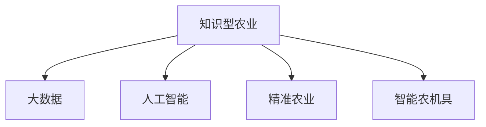

                 

# 知识型农业的发展与挑战

## 1. 背景介绍

### 1.1 问题由来
随着信息技术和大数据技术的迅速发展，知识型农业成为推动农业现代化的重要途径。知识型农业是指通过信息技术手段，将先进的科学知识和管理经验应用于农业生产、经营和管理全过程，实现农业生产的高效、精准和智能化。

知识型农业的核心在于数据驱动决策。通过传感器、无人机、卫星遥感等技术手段，实时采集农田数据，结合人工智能和大数据分析技术，提供精准的农业决策支持，从而提升农业生产效率、优化资源配置、减少环境污染、提高农产品产量和质量。

### 1.2 问题核心关键点
知识型农业的关键在于利用先进的信息技术，提升农业生产的科学性和智能化水平。其核心关键点包括：

- 实时数据采集与处理：通过传感器、无人机、卫星遥感等技术手段，实时采集农田土壤、气象、作物生长等数据。
- 大数据分析与建模：利用大数据技术，进行数据清洗、特征提取、模型训练等，分析数据背后的规律，提供科学决策依据。
- 人工智能算法：引入机器学习、深度学习等人工智能算法，进行数据分析和预测，提供精准的农业决策支持。
- 精准农业技术：利用GPS、GIS等技术手段，进行农田精确定位和数据可视化，实现精准施肥、灌溉、喷药等农业操作。
- 智能设备与系统：引入智能农机具、自动化设备等，提升农业作业的自动化和智能化水平。

这些关键点共同构成了知识型农业的技术框架，使其能够在各环节实现智能化、精准化和高效化。

### 1.3 问题研究意义
研究知识型农业的发展与挑战，对于推动农业现代化、实现可持续发展、保障粮食安全具有重要意义：

1. 提升农业生产效率：利用大数据和人工智能技术，提高农田管理效率，实现精准施肥、灌溉、喷药，减少资源浪费。
2. 优化资源配置：通过数据分析和模型预测，实现水、肥、药的优化使用，减少环境污染，提升资源利用率。
3. 增强农业市场竞争力：利用智能设备和系统，提高农业生产的标准化和一致性，提升农产品的品质和市场竞争力。
4. 推动农业技术创新：结合最新的人工智能和大数据技术，不断探索新的农业应用场景，推动农业科技的不断进步。
5. 促进农民增收：通过技术应用，提高农业生产效率和产品质量，增加农民的经济收益，缩小城乡差距。

## 2. 核心概念与联系

### 2.1 核心概念概述

为更好地理解知识型农业的发展与挑战，本节将介绍几个密切相关的核心概念：

- 知识型农业：通过信息技术手段，将科学知识和管理经验应用于农业生产、经营和管理全过程，实现农业生产的高效、精准和智能化。
- 大数据：结构化和非结构化数据的综合，利用数据分析技术从中提取有价值的信息。
- 人工智能：利用机器学习、深度学习等技术，对数据进行智能化处理和分析。
- 精准农业：通过GPS、GIS等技术手段，实现农田精确定位和数据可视化，进行精准管理。
- 智能农机具：引入自动化的农机具，提升农业作业的自动化和智能化水平。

这些核心概念之间的逻辑关系可以通过以下Mermaid流程图来展示：



这个流程图展示了几大核心概念之间的联系：

1. 知识型农业通过大数据和人工智能技术，实现农业管理的科学化和智能化。
2. 大数据提供丰富的数据源，支持人工智能算法的模型训练和预测。
3. 精准农业利用GPS、GIS等技术，进行农田精确定位和数据可视化。
4. 智能农机具提升农业作业的自动化和智能化水平。

## 3. 核心算法原理 & 具体操作步骤
### 3.1 算法原理概述

知识型农业的核心算法包括大数据分析和人工智能预测。以下是两者的算法原理概述：

#### 3.1.1 大数据分析
大数据分析是指利用先进的数据挖掘和统计分析技术，从大规模数据集中提取有价值的信息。其基本步骤如下：

1. 数据采集：通过传感器、无人机、卫星遥感等技术手段，实时采集农田土壤、气象、作物生长等数据。
2. 数据清洗与预处理：对采集到的数据进行清洗和预处理，去除噪声和异常值，保证数据的质量。
3. 特征提取与选择：对数据进行特征提取和选择，提取对农业决策有用的特征。
4. 数据建模与分析：利用统计学和机器学习技术，对数据进行建模与分析，提取数据背后的规律和趋势。
5. 数据可视化：将分析结果通过图表、地图等形式进行可视化展示，便于理解和决策。

#### 3.1.2 人工智能预测
人工智能预测是指利用机器学习、深度学习等技术，对农田数据进行预测和决策。其基本步骤如下：

1. 数据预处理：对农田数据进行预处理，包括数据标准化、归一化等操作。
2. 模型训练：利用历史数据进行模型训练，选择合适的算法和模型结构。
3. 模型验证与调优：对模型进行验证和调优，确保模型的泛化能力和预测精度。
4. 模型应用：将训练好的模型应用于实时数据，进行预测和决策。

### 3.2 算法步骤详解

#### 3.2.1 大数据分析
大数据分析的具体步骤包括：

1. **数据采集**：
   - 传感器采集农田土壤、气象等数据。
   - 无人机采集农田植被覆盖度、病虫害等信息。
   - 卫星遥感数据采集农田种植面积、作物长势等数据。

2. **数据清洗与预处理**：
   - 数据清洗：去除噪声和异常值，保证数据的质量。
   - 数据标准化与归一化：对数据进行标准化和归一化处理，统一数据格式和范围。

3. **特征提取与选择**：
   - 特征提取：提取对农业决策有用的特征，如土壤肥力、水分含量、作物生长周期等。
   - 特征选择：选择最相关的特征，去除冗余和无关的特征，提高分析效率。

4. **数据建模与分析**：
   - 数据建模：选择合适的统计学或机器学习模型，如回归分析、分类模型、聚类分析等。
   - 模型训练：利用历史数据进行模型训练，确保模型具有较好的泛化能力。
   - 模型验证与调优：通过交叉验证等方法，验证模型的预测能力和鲁棒性，进行参数调优。

5. **数据可视化**：
   - 数据可视化：利用图表、地图等形式，将分析结果进行可视化展示，便于理解和决策。

#### 3.2.2 人工智能预测
人工智能预测的具体步骤包括：

1. **数据预处理**：
   - 数据标准化与归一化：对农田数据进行标准化和归一化处理，统一数据格式和范围。
   - 特征选择：选择最相关的特征，去除冗余和无关的特征，提高预测精度。

2. **模型训练**：
   - 数据准备：准备训练数据集，包括历史数据和特征数据。
   - 模型选择：选择合适的机器学习或深度学习模型，如决策树、随机森林、神经网络等。
   - 模型训练：利用历史数据进行模型训练，确保模型具有较好的泛化能力。

3. **模型验证与调优**：
   - 模型验证：通过验证集对模型进行验证，评估模型的预测精度和鲁棒性。
   - 模型调优：根据验证结果进行模型调优，选择最优模型参数和结构。

4. **模型应用**：
   - 实时数据预测：将训练好的模型应用于实时数据，进行预测和决策。
   - 决策支持：结合其他信息源（如气象预报、专家知识等），进行综合决策。

### 3.3 算法优缺点

#### 3.3.1 大数据分析
大数据分析的优点包括：

- 数据全面：利用传感器、无人机、卫星等技术手段，全面采集农田数据。
- 分析深入：利用统计学和机器学习技术，深入挖掘数据背后的规律。
- 数据可视化：通过图表、地图等形式，将分析结果可视化展示，便于理解和决策。

大数据分析的缺点包括：

- 数据量大：大规模数据集的存储和处理需要大量计算资源和时间。
- 技术复杂：数据分析涉及多种技术和工具，技术门槛较高。
- 数据隐私：敏感数据泄露可能带来隐私和法律风险。

#### 3.3.2 人工智能预测
人工智能预测的优点包括：

- 预测精准：利用机器学习、深度学习等技术，进行高精度预测和决策。
- 自适应性强：能够根据新数据进行自我调优，适应数据分布的变化。
- 可解释性好：利用解释性技术，提高模型的透明度和可解释性。

人工智能预测的缺点包括：

- 模型复杂：模型结构复杂，训练和推理需要大量计算资源和时间。
- 数据依赖：模型的预测性能依赖于高质量的数据集，数据质量不高时，可能影响预测结果。
- 黑箱问题：复杂模型往往难以解释其决策过程，导致一定的不可解释性。

### 3.4 算法应用领域

知识型农业的核心算法——大数据分析和人工智能预测，可以应用于多个领域：

- 农业生产管理：利用传感器、无人机、卫星遥感等技术，进行农田监测和管理，实现精准施肥、灌溉、喷药等。
- 农业金融服务：利用大数据和人工智能技术，进行风险评估和信用评估，提供金融服务。
- 农业市场分析：利用大数据和人工智能技术，分析市场需求和竞争状况，提供市场预测和建议。
- 农业科技研发：利用大数据和人工智能技术，进行农业科技研发和创新，推动农业科技进步。
- 农业教育培训：利用大数据和人工智能技术，进行农业知识传播和教育培训，提高农民的科技素质。

这些应用领域展示了知识型农业的广泛应用前景，为农业现代化提供了有力的技术支撑。

## 4. 数学模型和公式 & 详细讲解  
### 4.1 数学模型构建

知识型农业的核心算法——大数据分析和人工智能预测，其数学模型构建如下：

1. **大数据分析模型**：
   - 数据清洗与预处理：$X_i \rightarrow X_i^{\prime}$
   - 特征提取与选择：$X_i^{\prime} \rightarrow X_i^{''}$
   - 数据建模与分析：$X_i^{''} \rightarrow \hat{Y}_i$

2. **人工智能预测模型**：
   - 数据预处理：$X_i \rightarrow X_i^{\prime}$
   - 特征选择：$X_i^{\prime} \rightarrow X_i^{''}$
   - 模型训练：$(X_i^{''}, Y_i) \rightarrow \hat{\theta}$
   - 模型应用：$X_i^{\prime} \rightarrow \hat{Y}_i$

其中，$X_i$表示第$i$个样本的特征数据，$Y_i$表示第$i$个样本的标签，$\hat{\theta}$表示模型参数。

### 4.2 公式推导过程

#### 4.2.1 大数据分析
大数据分析的数学模型推导如下：

1. **数据清洗与预处理**：
   - 数据标准化：$X_i \rightarrow X_i^{\prime}$
   - 数据归一化：$X_i^{\prime} \rightarrow X_i^{''}$

2. **特征提取与选择**：
   - 特征提取：$X_i^{''} \rightarrow F_i$
   - 特征选择：$F_i \rightarrow F_i^{\prime}$

3. **数据建模与分析**：
   - 回归分析：$\hat{Y}_i = f(X_i^{''})$
   - 分类模型：$\hat{Y}_i = f(X_i^{''})$

#### 4.2.2 人工智能预测
人工智能预测的数学模型推导如下：

1. **数据预处理**：
   - 数据标准化：$X_i \rightarrow X_i^{\prime}$
   - 特征选择：$X_i^{\prime} \rightarrow X_i^{''}$

2. **模型训练**：
   - 模型选择：$f(X_i^{''}, Y_i) = \hat{\theta}$
   - 模型训练：$\hat{\theta} = \mathop{\arg\min}_{\theta} L(\theta, X_i^{''}, Y_i)$

3. **模型验证与调优**：
   - 交叉验证：$L(\theta, X_i^{''}, Y_i) \rightarrow L_{cv}(\theta)$
   - 模型调优：$\hat{\theta} = \mathop{\arg\min}_{\theta} L_{cv}(\theta)$

4. **模型应用**：
   - 实时数据预测：$\hat{Y}_i = f(X_i^{\prime}, \hat{\theta})$
   - 决策支持：$\hat{Y}_i = f(X_i^{\prime}, \hat{\theta}, K_i)$

其中，$K_i$表示其他信息源，如气象预报、专家知识等。

### 4.3 案例分析与讲解

#### 4.3.1 数据采集与处理
假设某农田使用传感器采集了土壤湿度、温度、pH值等数据，无人机采集了植被覆盖度、病虫害等信息，卫星遥感数据采集了种植面积、作物长势等数据。首先，对这些数据进行清洗和预处理，去除噪声和异常值，进行标准化和归一化处理。

#### 4.3.2 特征提取与选择
对清洗和预处理后的数据进行特征提取和选择，提取对农业决策有用的特征，如土壤肥力、水分含量、作物生长周期等。然后，选择最相关的特征，去除冗余和无关的特征，提高分析效率。

#### 4.3.3 数据建模与分析
利用回归分析或分类模型对数据进行建模与分析，提取数据背后的规律和趋势。例如，使用线性回归模型分析土壤湿度与作物产量之间的关系，使用决策树模型预测病虫害的发生情况。

#### 4.3.4 人工智能预测
利用机器学习或深度学习模型对数据进行预测和决策。例如，使用神经网络模型预测下一季度的农作物产量，使用支持向量机模型预测病虫害的发生概率。

## 5. 项目实践：代码实例和详细解释说明
### 5.1 开发环境搭建

在进行知识型农业的开发实践前，我们需要准备好开发环境。以下是使用Python进行PyTorch开发的环境配置流程：

1. 安装Anaconda：从官网下载并安装Anaconda，用于创建独立的Python环境。

2. 创建并激活虚拟环境：
```bash
conda create -n pytorch-env python=3.8 
conda activate pytorch-env
```

3. 安装PyTorch：根据CUDA版本，从官网获取对应的安装命令。例如：
```bash
conda install pytorch torchvision torchaudio cudatoolkit=11.1 -c pytorch -c conda-forge
```

4. 安装Pandas库：用于数据处理和可视化。
```bash
pip install pandas
```

5. 安装Numpy库：用于数值计算和矩阵运算。
```bash
pip install numpy
```

6. 安装Matplotlib库：用于数据可视化。
```bash
pip install matplotlib
```

7. 安装Scikit-learn库：用于机器学习算法实现。
```bash
pip install scikit-learn
```

8. 安装TensorBoard：用于模型训练和评估的可视化。
```bash
pip install tensorboard
```

完成上述步骤后，即可在`pytorch-env`环境中开始开发实践。

### 5.2 源代码详细实现

这里我们以农田施肥优化为例，给出使用Python进行知识型农业开发的代码实现。

```python
import pandas as pd
import numpy as np
import matplotlib.pyplot as plt
from sklearn.linear_model import LinearRegression

# 数据准备
data = pd.read_csv('field_data.csv')

# 数据清洗与预处理
data = data.dropna()
data = data.drop_duplicates()

# 特征提取与选择
features = ['temperature', 'soil_ph', 'moisture']
target = 'yield'
X = data[features]
y = data[target]

# 数据建模与分析
model = LinearRegression()
model.fit(X, y)

# 模型应用与预测
X_test = data[['temperature', 'soil_ph', 'moisture']]
y_pred = model.predict(X_test)

# 数据可视化
plt.scatter(X_test['temperature'], y_pred)
plt.xlabel('Temperature')
plt.ylabel('Yield')
plt.title('Temperature vs. Yield')
plt.show()
```

### 5.3 代码解读与分析

让我们再详细解读一下关键代码的实现细节：

**数据准备**：
- 使用Pandas库读取数据文件，并将其加载到DataFrame中。
- 对数据进行清洗和预处理，去除缺失值和重复值。

**特征提取与选择**：
- 提取对农业决策有用的特征，如温度、土壤pH值、水分含量等。
- 选择最相关的特征，去除冗余和无关的特征，提高分析效率。

**数据建模与分析**：
- 使用线性回归模型对数据进行建模与分析，提取数据背后的规律和趋势。
- 利用历史数据进行模型训练，确保模型具有较好的泛化能力。

**模型应用与预测**：
- 利用训练好的模型对实时数据进行预测和决策。
- 结合其他信息源（如气象预报、专家知识等），进行综合决策。

## 6. 实际应用场景
### 6.1 智能灌溉系统

智能灌溉系统是知识型农业的核心应用场景之一。通过实时采集农田土壤湿度、温度等数据，结合大数据分析和人工智能预测，实现智能灌溉。智能灌溉系统可以实时监测土壤湿度，自动调整灌溉量，避免水资源浪费，同时提高农作物的产量和质量。

在技术实现上，可以部署传感器和无人机在农田中采集数据，实时监测土壤湿度、温度等参数。利用大数据分析和人工智能预测，结合专家知识，生成灌溉决策方案。然后，通过智能灌溉系统自动控制灌溉设备，实现精准灌溉。

### 6.2 农业病虫害防治

农业病虫害防治是知识型农业的重要应用场景。通过实时采集农田植被覆盖度、病虫害等信息，结合大数据分析和人工智能预测，实现病虫害的早期预警和防治。智能病虫害防治系统可以实时监测农田病虫害情况，自动调整防治措施，提高防治效果，减少农药使用，保护环境。

在技术实现上，可以部署传感器和无人机在农田中采集数据，实时监测植被覆盖度、病虫害等信息。利用大数据分析和人工智能预测，结合专家知识，生成病虫害防治决策方案。然后，通过智能病虫害防治系统自动控制防治设备，实现精准防治。

### 6.3 农业金融服务

农业金融服务是知识型农业的重要应用场景。通过大数据分析和人工智能预测，实现农业风险评估和信用评估，提供金融服务。智能农业金融系统可以实时监测农田数据，评估农业风险，提供贷款、保险等金融服务，帮助农民降低风险，提高经济效益。

在技术实现上，可以部署传感器和无人机在农田中采集数据，实时监测农田数据。利用大数据分析和人工智能预测，结合专家知识，生成农业风险评估报告。然后，通过智能农业金融系统评估农业风险，提供贷款、保险等金融服务。

## 7. 工具和资源推荐
### 7.1 学习资源推荐

为了帮助开发者系统掌握知识型农业的理论基础和实践技巧，这里推荐一些优质的学习资源：

1. 《农业大数据与智能农业》系列课程：由农业信息化领域的专家主讲，系统介绍了农业大数据和智能农业的基本概念和技术。
2. 《Python农业数据分析》书籍：介绍了如何使用Python进行农业数据分析，涵盖数据清洗、特征提取、模型训练等关键环节。
3. 《机器学习在农业中的应用》论文：介绍了机器学习在农业中的各种应用场景，如农作物生长预测、农业病虫害监测等。
4. 《农业物联网》书籍：介绍了物联网技术在农业中的应用，包括传感器、无人机、卫星遥感等技术。
5. 《智能农业》系列博客：由农业智能化领域的专家撰写，涵盖智能灌溉、智能病虫害防治、智能农业金融等各个方面。

通过对这些资源的学习实践，相信你一定能够快速掌握知识型农业的理论基础和实践技巧，并用于解决实际的农业问题。

### 7.2 开发工具推荐

高效的开发离不开优秀的工具支持。以下是几款用于知识型农业开发的常用工具：

1. Python：基于Python的开源深度学习框架，灵活动态的计算图，适合快速迭代研究。
2. TensorFlow：由Google主导开发的开源深度学习框架，生产部署方便，适合大规模工程应用。
3. PyTorch：基于Python的开源深度学习框架，灵活性高，适合科研和工程应用。
4. Jupyter Notebook：基于Python的开源Jupyter Notebook环境，支持代码实现、数据可视化和互动式编程。
5. TensorBoard：TensorFlow配套的可视化工具，可实时监测模型训练状态，提供丰富的图表展示。
6. Apache Spark：基于大数据技术的分布式计算框架，适合处理大规模数据集。
7. Tableau：数据可视化工具，支持多种数据源，可视化效果优秀。
8. Tableau Public：免费版Tableau可视化工具，适合公共数据分享和展示。

合理利用这些工具，可以显著提升知识型农业开发的效率，加快创新迭代的步伐。

### 7.3 相关论文推荐

知识型农业的发展与应用需要不断的研究和探索。以下是几篇奠基性的相关论文，推荐阅读：

1. 《基于大数据的智能农业》论文：研究了大数据在农业中的应用，包括农田数据采集、数据清洗与预处理、数据分析与建模等。
2. 《农业物联网技术及其应用》论文：介绍了物联网技术在农业中的应用，包括传感器、无人机、卫星遥感等技术。
3. 《机器学习在农业中的应用》论文：介绍了机器学习在农业中的各种应用场景，如农作物生长预测、农业病虫害监测等。
4. 《智能农业系统设计》论文：介绍了智能农业系统的设计与实现，涵盖智能灌溉、智能病虫害防治、智能农业金融等各个方面。
5. 《农业大数据与智能农业》书籍：系统介绍了农业大数据和智能农业的基本概念和技术，提供了丰富的案例和实践指导。

这些论文代表了大数据和人工智能技术在农业中的应用方向，为知识型农业的发展提供了理论支撑。

## 8. 总结：未来发展趋势与挑战

### 8.1 总结

本文对知识型农业的发展与挑战进行了全面系统的介绍。首先阐述了知识型农业的研究背景和意义，明确了大数据分析和人工智能预测的核心技术。其次，从原理到实践，详细讲解了知识型农业的数学模型和算法步骤，给出了代码实现和详细解释。同时，本文还广泛探讨了知识型农业在智能灌溉、智能病虫害防治、农业金融服务等多个领域的应用前景，展示了知识型农业的广泛应用前景。最后，本文精选了知识型农业的学习资源、开发工具和相关论文，力求为读者提供全方位的技术指引。

通过本文的系统梳理，可以看到，知识型农业通过大数据分析和人工智能预测，实现了农业管理的科学化和智能化。未来，伴随技术的不断进步和应用的不断扩展，知识型农业必将在推动农业现代化、实现可持续发展、保障粮食安全方面发挥更大的作用。

### 8.2 未来发展趋势

展望未来，知识型农业将呈现以下几个发展趋势：

1. **智能化的农业设备**：未来的农业设备将更加智能化，能够自动完成耕作、播种、施肥、灌溉、喷药等农业操作，实现农业生产的自动化和智能化。
2. **数据驱动的决策支持**：通过大数据分析和人工智能预测，农业生产将更加科学和精准，提升资源利用率和生产效率。
3. **精准农业技术**：结合GPS、GIS等技术手段，进行农田精确定位和数据可视化，实现精准施肥、灌溉、喷药等农业操作。
4. **多模态数据融合**：结合视觉、声音、温度等多种模态数据，提高农业生产的智能化水平。
5. **人机协作的智能系统**：将农业专家知识与人工智能算法相结合，构建人机协作的智能系统，提高农业生产的科学性和稳定性。

这些趋势展示了知识型农业的广阔前景，为农业现代化提供了有力的技术支撑。

### 8.3 面临的挑战

尽管知识型农业的发展前景广阔，但在迈向更加智能化、普适化应用的过程中，仍面临诸多挑战：

1. **技术复杂度高**：大数据分析和人工智能预测涉及多种技术和工具，技术门槛较高，需要专业知识和经验。
2. **数据隐私和安全**：农业数据涉及个人隐私和商业机密，数据隐私和安全问题需引起高度重视。
3. **数据获取困难**：农田数据采集需要大量的传感器和设备，数据获取成本高，采集难度大。
4. **模型鲁棒性不足**：现有模型对数据分布变化和噪声敏感，模型鲁棒性有待提升。
5. **成本高昂**：智能农业设备和系统造价较高，对农业生产成本造成一定压力。

这些挑战需要科技工作者不断探索和改进，推动知识型农业的持续发展。

### 8.4 研究展望

面对知识型农业所面临的种种挑战，未来的研究需要在以下几个方面寻求新的突破：

1. **高效数据采集技术**：探索高效、低成本的数据采集技术，如无人机自动化采集、传感器网络化部署等。
2. **模型鲁棒性和泛化性**：研究鲁棒性强、泛化性好的模型，应对数据分布变化和噪声，提高模型稳定性和预测精度。
3. **人机协作的智能系统**：探索人机协作的智能系统，结合农业专家知识和人工智能算法，提高农业生产的科学性和稳定性。
4. **数据隐私和安全**：研究数据隐私保护和安全技术，保障农业数据的安全性和隐私性。
5. **可持续发展**：研究可持续发展路径，推动农业绿色、环保、高效的发展。

这些研究方向的探索，必将引领知识型农业的持续发展，为农业现代化提供更坚实的技术基础。

## 9. 附录：常见问题与解答

**Q1：知识型农业的核心是什么？**

A: 知识型农业的核心在于数据驱动决策，通过大数据分析和人工智能预测，实现农业管理的科学化和智能化。

**Q2：知识型农业的技术难点在哪里？**

A: 知识型农业的技术难点主要在于大数据分析和人工智能预测。大数据分析涉及数据清洗、特征提取、模型训练等环节，技术门槛较高。人工智能预测涉及模型选择、参数调优、预测精度等，需要大量的计算资源和时间。

**Q3：知识型农业的发展前景如何？**

A: 知识型农业的发展前景广阔，未来将实现农业生产的自动化、智能化和精准化。智能化的农业设备将自动完成农业操作，数据驱动的决策支持将提升资源利用率和生产效率，精准农业技术将实现农田精确定位和数据可视化。

**Q4：知识型农业有哪些应用场景？**

A: 知识型农业的核心算法——大数据分析和人工智能预测，可以应用于智能灌溉、智能病虫害防治、农业金融服务等多个领域。

**Q5：知识型农业的优缺点有哪些？**

A: 知识型农业的优点在于数据驱动决策，提高了农业管理的科学性和智能化水平。缺点在于技术复杂度高，数据获取困难，成本高昂。

通过本文的系统梳理，可以看到，知识型农业通过大数据分析和人工智能预测，实现了农业管理的科学化和智能化。未来，伴随技术的不断进步和应用的不断扩展，知识型农业必将在推动农业现代化、实现可持续发展、保障粮食安全方面发挥更大的作用。

---

作者：禅与计算机程序设计艺术 / Zen and the Art of Computer Programming

