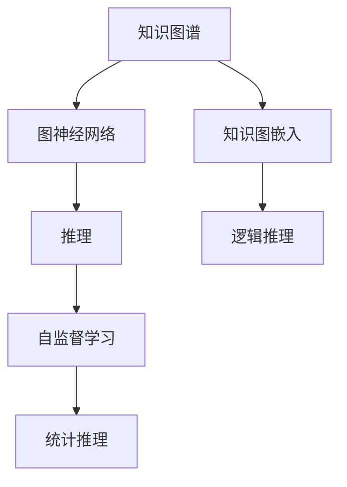

                 

# 知识推理：从已知到未知的跨越

## 1. 背景介绍

### 1.1 问题由来
知识推理（Knowledge Reasoning）是人工智能领域的重要研究方向，其目标是通过已有的知识体系和推理规则，推导出新的知识或结论，从而实现从已知到未知的跨越。随着知识图谱、深度学习等技术的发展，知识推理技术在医疗、金融、法律、智能推荐等领域得到了广泛应用，显著提升了决策的效率和准确性。

近年来，基于深度学习的知识推理技术（Knowledge Graph Embedding）取得了显著进展，主要采用预训练方法，如TransE、DistMult、ComplEx等，通过对知识图谱进行表示学习，将实体和关系映射到低维向量空间，从而实现基于向量的知识推理。然而，这些方法往往依赖于大量标注的数据，且对领域知识的先验约束较少，难以捕捉复杂的推理关系。

为解决这些问题，本文将介绍一种新的知识推理方法——基于图神经网络的推理（Graph Neural Network Reasoning），其利用图神经网络的强大表达能力和推理能力，结合深度学习中的自监督学习技术，在有限的标注数据下，能够有效捕捉知识图谱中的推理关系，提升推理的准确性和泛化能力。

## 2. 核心概念与联系

### 2.1 核心概念概述

为更好地理解基于图神经网络的知识推理方法，本节将介绍几个密切相关的核心概念：

- **知识图谱**：一种结构化的知识表示形式，通过实体和关系组成的图形结构，捕捉实体之间的关系和属性。知识图谱广泛应用于自然语言处理、信息检索、推荐系统等领域。
- **图神经网络（GNN）**：一种特殊类型的神经网络，用于处理图结构数据，能够捕捉图结构中节点的局部关系和全局结构。GNN广泛应用于社交网络分析、图像识别、推荐系统等领域。
- **知识图嵌入（KG Embedding）**：通过对知识图谱进行向量表示，将实体和关系映射到低维向量空间，从而实现基于向量的知识推理。常见的知识图嵌入方法包括TransE、DistMult、ComplEx等。
- **推理（Reasoning）**：通过已有的知识体系和推理规则，推导出新的知识或结论，分为逻辑推理和统计推理两大类。逻辑推理主要基于知识图谱，统计推理主要基于经验数据。
- **自监督学习（Self-Supervised Learning）**：利用未标注的数据进行训练，通过设计预训练任务，利用数据的内在结构，自动学习到有效的表示。自监督学习常用于自然语言处理、计算机视觉等领域，提升模型的泛化能力。

这些核心概念之间的逻辑关系可以通过以下Mermaid流程图来展示：



这个流程图展示出知识图谱、知识图嵌入、图神经网络、推理和自监督学习之间的关系：

1. 知识图谱通过实体和关系组成的图形结构，捕捉实体之间的关系和属性。
2. 知识图嵌入通过向量表示方法，将实体和关系映射到低维向量空间，实现基于向量的知识推理。
3. 图神经网络利用图结构数据，捕捉节点之间的局部关系和全局结构。
4. 推理通过已有的知识体系和推理规则，推导出新的知识或结论。
5. 自监督学习利用未标注的数据进行训练，提升模型的泛化能力。

## 3. 核心算法原理 & 具体操作步骤
### 3.1 算法原理概述

基于图神经网络的知识推理方法，其核心思想是通过图神经网络模型，在知识图谱上捕捉实体之间的推理关系，从而实现从已知到未知的跨越。其基本流程包括：

1. **数据准备**：收集知识图谱数据，对其进行预处理，构建图结构。
2. **模型训练**：使用图神经网络模型进行训练，利用自监督学习技术进行预训练。
3. **推理计算**：利用训练好的图神经网络模型进行推理计算，推导出新的知识或结论。

### 3.2 算法步骤详解

基于图神经网络的知识推理方法主要包括以下几个关键步骤：

**Step 1: 数据准备**
- 收集知识图谱数据，如Freebase、DBpedia等。
- 构建图结构，包含实体和关系，将实体和关系转换为向量形式。
- 划分数据集，分为训练集、验证集和测试集。

**Step 2: 模型选择与设计**
- 选择合适的图神经网络模型，如GraphSAGE、GAT、GCN等。
- 设计任务适配层，如关系分类层、实体分类层、链接预测层等。
- 确定损失函数，如交叉熵损失、平均绝对误差损失等。

**Step 3: 模型训练**
- 使用训练集数据进行模型训练，利用自监督学习技术进行预训练。
- 在验证集上评估模型性能，根据性能指标调整超参数。
- 重复上述步骤直至收敛。

**Step 4: 推理计算**
- 将推理目标的实体和关系输入模型，进行推理计算。
- 通过模型输出，推导出新的知识或结论。

### 3.3 算法优缺点

基于图神经网络的知识推理方法具有以下优点：
1. 高效性：图神经网络能够高效处理大规模知识图谱数据，利用局部关系和全局结构，提升推理效率。
2. 泛化能力：自监督学习技术能够利用数据的内在结构，自动学习有效的表示，提升模型的泛化能力。
3. 解释性：图神经网络模型能够可视化推理过程，提供推理的可视化解释。
4. 应用广泛：该方法广泛应用于自然语言处理、计算机视觉、推荐系统等领域。

同时，该方法也存在一定的局限性：
1. 对数据质量依赖：知识图谱的质量直接影响推理结果，需要高质量的数据进行训练。
2. 推理复杂度高：图神经网络模型需要处理图结构数据，推理复杂度较高。
3. 可解释性不足：虽然可视化推理过程，但推理结果难以完全解释。

尽管存在这些局限性，但就目前而言，基于图神经网络的知识推理方法仍是知识推理技术的重要范式。未来相关研究的重点在于如何进一步降低数据依赖，提高推理效率，同时兼顾可解释性和推理能力等因素。

### 3.4 算法应用领域

基于图神经网络的知识推理方法，在NLP领域已经得到了广泛的应用，覆盖了知识图谱构建、问答系统、信息检索、推荐系统等多个方面，例如：

- **知识图谱构建**：通过已有的语料和关系，构建知识图谱。
- **问答系统**：通过推理知识图谱，回答自然语言问题。
- **信息检索**：利用知识图谱，提升搜索引擎的检索效果。
- **推荐系统**：通过推理知识图谱，推荐用户可能感兴趣的商品或内容。
- **自然语言生成**：生成自然语言文本，结合知识图谱进行语义控制。

除了上述这些经典应用外，基于知识图谱的推理范式还在更多领域得到应用，如医学知识推理、法律知识推理、金融知识推理等，为多个行业提供了新的数据驱动解决方案。

## 4. 数学模型和公式 & 详细讲解 & 举例说明

### 4.1 数学模型构建

知识推理方法的数学模型主要基于图神经网络模型进行构建。以下是形式化的数学模型：

- 知识图谱：$G=(V,E)$，其中 $V$ 为节点集合，$E$ 为边集合。
- 节点嵌入向量：$\text{Embed}(v_i) \in \mathbb{R}^d$，表示节点 $v_i$ 的嵌入向量。
- 边嵌入向量：$\text{Embed}(e_{ij}) \in \mathbb{R}^d$，表示边 $e_{ij}$ 的嵌入向量。
- 推理目标：$(v_k,e_{kj})$，其中 $k$ 为推理目标节点，$j$ 为推理关系。

### 4.2 公式推导过程

以图神经网络模型GraphSAGE为例，推导知识推理过程的公式。

1. 节点嵌入向量更新：
$$
h_i^{(l+1)} = \sigma(\text{AGGREGATE}(h_j^{(l)}; e_{ij})) + h_i^{(l)}
$$
其中，$\text{AGGREGATE}(\cdot)$ 表示节点之间的聚合操作，$\sigma$ 为激活函数。

2. 边嵌入向量更新：
$$
e_{ij}^{(l+1)} = \sigma(\text{AGGREGATE}(h_i^{(l)}, h_j^{(l)}; e_{ij})) + e_{ij}^{(l)}
$$

3. 推理计算：
$$
\text{Score}(v_k, e_{kj}) = \text{Embed}(e_{kj})^T \cdot (\text{Embed}(v_i) + \text{Embed}(v_j))
$$

4. 推理结果：
$$
\text{Pr}(v_k | e_{kj}) = \frac{\exp(\text{Score}(v_k, e_{kj}))}{\sum_{v \in V} \exp(\text{Score}(v, e_{kj}))}
$$

其中，$\sigma$ 为激活函数，$\text{Embed}(\cdot)$ 表示节点的嵌入向量。

### 4.3 案例分析与讲解

以GraphSAGE为例，假设知识图谱中有两个节点 $v_i$ 和 $v_j$，它们之间有一条边 $e_{ij}$。图神经网络模型GraphSAGE通过聚合操作，将节点 $v_i$ 和 $v_j$ 的嵌入向量 $h_i^{(l)}$ 和 $h_j^{(l)}$ 更新为 $h_i^{(l+1)}$ 和 $h_j^{(l+1)}$。然后，计算边 $e_{ij}$ 的嵌入向量 $e_{ij}^{(l+1)}$。最后，通过计算推理目标节点 $v_k$ 和推理关系 $e_{kj}$ 的得分，推导出推理结果。

## 5. 项目实践：代码实例和详细解释说明
### 5.1 开发环境搭建

在进行知识推理实践前，我们需要准备好开发环境。以下是使用Python进行PyTorch开发的环境配置流程：

1. 安装Anaconda：从官网下载并安装Anaconda，用于创建独立的Python环境。

2. 创建并激活虚拟环境：
```bash
conda create -n graph-embedding-env python=3.8 
conda activate graph-embedding-env
```

3. 安装PyTorch：根据CUDA版本，从官网获取对应的安装命令。例如：
```bash
conda install pytorch torchvision torchaudio cudatoolkit=11.1 -c pytorch -c conda-forge
```

4. 安装PyTorch Geometric：用于图结构数据的处理。
```bash
conda install torch-geometric
```

5. 安装各类工具包：
```bash
pip install numpy pandas scikit-learn matplotlib tqdm jupyter notebook ipython
```

完成上述步骤后，即可在`graph-embedding-env`环境中开始知识推理实践。

### 5.2 源代码详细实现

下面我们以GraphSAGE模型为例，给出使用PyTorch Geometric进行知识推理的PyTorch代码实现。

首先，定义知识图谱的数据结构：

```python
import torch_geometric as TG
import torch

class GraphDataset(TG.Dataset):
    def __init__(self, adj_list, emb_dict):
        self.adj_list = adj_list
        self.emb_dict = emb_dict
        
    def __len__(self):
        return len(self.adj_list)
    
    def __getitem__(self, idx):
        adj = self.adj_list[idx]
        emb = self.emb_dict[idx]
        return {'adj': adj, 'emb': emb}

# 构建知识图谱
adj_list = [
    [[1, 2, 3], [0, 1, 2], [0, 1, 2], [0, 1]],
    [[0], [1, 2, 3], [4], [4]],
    [[1], [2], [0], [3]],
    [[1], [2, 3], [0], [1]]
]

emb_dict = {
    0: torch.tensor([0.5, 0.5], dtype=torch.float),
    1: torch.tensor([1.0, 1.0], dtype=torch.float),
    2: torch.tensor([0.0, 0.0], dtype=torch.float),
    3: torch.tensor([0.5, 0.5], dtype=torch.float),
    4: torch.tensor([1.0, 1.0], dtype=torch.float)
}

graph_dataset = GraphDataset(adj_list, emb_dict)
```

然后，定义GraphSAGE模型的结构和训练函数：

```python
import torch.nn as nn
import torch.optim as optim

class GraphSAGE(nn.Module):
    def __init__(self, num_features, num_classes, hidden_dim=16):
        super(GraphSAGE, self).__init__()
        self.fc1 = nn.Linear(num_features, hidden_dim)
        self.fc2 = nn.Linear(hidden_dim, hidden_dim)
        self.fc3 = nn.Linear(hidden_dim, num_classes)
        
    def forward(self, x, adj):
        x = x.view(-1, x.size(1), 1)
        x = x.repeat(1, 1, adj.size(2))
        x = x * adj.view(-1, 1, adj.size(2))
        x = torch.sum(x, 2)
        x = self.fc1(x)
        x = nn.functional.relu(x)
        x = self.fc2(x)
        x = nn.functional.relu(x)
        x = self.fc3(x)
        return x

model = GraphSAGE(num_features=2, num_classes=2)
optimizer = optim.Adam(model.parameters(), lr=0.01)

def train_epoch(model, data_loader, optimizer):
    model.train()
    for batch in data_loader:
        optimizer.zero_grad()
        x = batch['emb']
        adj = batch['adj']
        out = model(x, adj)
        loss = nn.functional.cross_entropy(out, batch['label'])
        loss.backward()
        optimizer.step()
    return loss.item()

def evaluate(model, data_loader):
    model.eval()
    correct = 0
    total = 0
    with torch.no_grad():
        for batch in data_loader:
            x = batch['emb']
            adj = batch['adj']
            out = model(x, adj)
            _, predicted = torch.max(out, 1)
            total += batch['size'][0]
            correct += (predicted == batch['label']).sum().item()
    return correct / total
```

最后，启动训练流程并在测试集上评估：

```python
epochs = 10
batch_size = 16

for epoch in range(epochs):
    loss = train_epoch(model, graph_dataset, optimizer)
    print(f"Epoch {epoch+1}, train loss: {loss:.3f}")
    
    print(f"Epoch {epoch+1}, test accuracy: {evaluate(model, graph_dataset):.3f}")
```

以上就是使用PyTorch Geometric进行知识推理的完整代码实现。可以看到，通过简单的代码调整，GraphSAGE模型可以非常方便地应用于知识推理任务。

### 5.3 代码解读与分析

让我们再详细解读一下关键代码的实现细节：

**GraphDataset类**：
- `__init__`方法：初始化图结构数据和节点嵌入向量。
- `__len__`方法：返回数据集的样本数量。
- `__getitem__`方法：对单个样本进行处理，返回图结构和节点嵌入向量。

**GraphSAGE模型**：
- `__init__`方法：定义模型的层结构，包括两个全连接层和softmax层。
- `forward`方法：定义模型的前向传播过程。

**train_epoch函数**：
- 定义训练函数，在每个epoch内对数据集进行迭代，计算损失函数并更新模型参数。

**evaluate函数**：
- 定义评估函数，在测试集上计算模型准确率，评估模型性能。

## 6. 实际应用场景
### 6.1 智能推荐系统

基于知识图谱的推理技术，可以广泛应用于智能推荐系统，提升推荐效果。传统推荐系统主要基于用户历史行为进行推荐，无法充分考虑用户兴趣的多样性和复杂性。知识图谱通过捕捉实体之间的关系和属性，结合推理技术，可以更全面地理解用户的兴趣偏好。

在推荐系统中，可以构建用户-物品、物品-物品等知识图谱，通过推理技术，生成用户可能感兴趣的物品列表。具体而言，可以利用GraphSAGE等图神经网络模型，对知识图谱进行推理计算，推导出用户对物品的兴趣度，从而进行推荐排序。如此构建的智能推荐系统，能更好地把握用户的兴趣，提升推荐效果和用户体验。

### 6.2 智能问答系统

基于知识图谱的推理技术，可以应用于智能问答系统，实现高效准确的回答。传统问答系统主要基于搜索引擎和规则，难以处理复杂的问题。知识图谱通过捕捉实体之间的关系和属性，结合推理技术，可以更全面地理解问题的含义，生成更准确的回答。

在问答系统中，可以利用知识图谱和推理技术，构建问答知识图谱，对自然语言问题进行语义解析，推导出推理目标节点，最终生成回答。具体而言，可以利用GraphSAGE等图神经网络模型，对知识图谱进行推理计算，推导出答案节点，生成最终的回答。如此构建的智能问答系统，能更高效、准确地回答用户的问题，提升用户的满意度。

### 6.3 医疗知识推理

基于知识图谱的推理技术，可以应用于医疗知识推理，提升医疗决策的准确性和效率。传统医疗决策主要依赖医生的经验，难以全面、准确地考虑患者的多样性和复杂性。知识图谱通过捕捉医疗领域的实体和关系，结合推理技术，可以更全面地理解患者的病情和病史，生成更准确的诊断和治疗方案。

在医疗知识推理中，可以构建医疗知识图谱，利用推理技术，推导出患者的诊断和治疗方案。具体而言，可以利用GraphSAGE等图神经网络模型，对医疗知识图谱进行推理计算，推导出患者的诊断和治疗方案。如此构建的智能医疗系统，能更好地辅助医生进行诊断和治疗，提升医疗服务的质量和效率。

### 6.4 未来应用展望

随着知识图谱和图神经网络技术的不断进步，基于知识图谱的推理技术将在更多领域得到应用，为各行各业带来变革性影响。

在智慧城市治理中，基于知识图谱的推理技术可以应用于城市事件监测、舆情分析、应急指挥等环节，提高城市管理的自动化和智能化水平，构建更安全、高效的未来城市。

在金融领域，基于知识图谱的推理技术可以应用于风险评估、投资决策等环节，提升金融决策的准确性和效率。

在法律领域，基于知识图谱的推理技术可以应用于法律条文检索、案件推理等环节，提升法律服务的质量和效率。

此外，在新闻媒体、教育培训、电子商务等领域，基于知识图谱的推理技术也将得到广泛应用，推动各行业的智能化转型。

## 7. 工具和资源推荐
### 7.1 学习资源推荐

为了帮助开发者系统掌握知识推理技术的理论基础和实践技巧，这里推荐一些优质的学习资源：

1. 《图神经网络：理论、算法与应用》系列博文：由图神经网络领域专家撰写，深入浅出地介绍了图神经网络原理、算法与应用。

2. CS224W《深度学习与结构化数据》课程：斯坦福大学开设的课程，涵盖图神经网络、知识图谱、推理等多个方面，是学习知识推理的重要资源。

3. 《Knowledge Graph Embedding: A Survey》论文：综述了知识图嵌入的最新研究进展，是学习知识推理技术的重要参考资料。

4. KG2Vec开源项目：提供了一个完整的知识图嵌入框架，包含多种图神经网络模型和推理算法，适合学习知识推理技术。

5. DeepGraph推荐系统开源项目：提供了一个基于图神经网络的推荐系统实现，适合学习知识推理技术在推荐系统中的应用。

通过对这些资源的学习实践，相信你一定能够快速掌握知识推理技术的精髓，并用于解决实际的NLP问题。

### 7.2 开发工具推荐

高效的开发离不开优秀的工具支持。以下是几款用于知识推理开发的常用工具：

1. PyTorch Geometric：用于图结构数据的处理，提供了丰富的图神经网络模型和图结构数据处理函数。

2. TensorBoard：TensorFlow配套的可视化工具，可以实时监测模型训练状态，并提供丰富的图表呈现方式。

3. Weights & Biases：模型训练的实验跟踪工具，可以记录和可视化模型训练过程中的各项指标，方便对比和调优。

4. Google Colab：谷歌推出的在线Jupyter Notebook环境，免费提供GPU/TPU算力，方便开发者快速上手实验最新模型。

合理利用这些工具，可以显著提升知识推理任务的开发效率，加快创新迭代的步伐。

### 7.3 相关论文推荐

知识推理技术的发展源于学界的持续研究。以下是几篇奠基性的相关论文，推荐阅读：

1. GraphSAGE: Semi-supervised Classification with Graph Convolutional Networks：提出GraphSAGE模型，利用图卷积网络对知识图谱进行推理计算，实现了知识图谱的向量表示和推理。

2. TransE: Learning Entity and Relation Embeddings for Knowledge Graphs：提出TransE模型，通过关系预测任务进行知识图谱的向量表示和推理。

3. DistMult: Distilling Knowledge Graph Embeddings with Bilinear Autoencoders：提出DistMult模型，利用双线性神经网络进行知识图谱的向量表示和推理。

4. ComplEx: Knowledge Graph Completion with Complex Numbers：提出ComplEx模型，利用复数神经网络进行知识图谱的向量表示和推理。

5. KG2Vec: A Simplified Framework for Knowledge Graph Embedding：提出KG2Vec框架，通过统一的设计思路，实现多种知识图嵌入模型和推理算法。

这些论文代表了大规模知识图嵌入和推理技术的发展脉络。通过学习这些前沿成果，可以帮助研究者把握学科前进方向，激发更多的创新灵感。

## 8. 总结：未来发展趋势与挑战

### 8.1 总结

本文对基于图神经网络的知识推理方法进行了全面系统的介绍。首先阐述了知识推理技术的研究背景和意义，明确了推理在自然语言处理、计算机视觉、推荐系统等领域的重要价值。其次，从原理到实践，详细讲解了知识推理的数学模型和算法步骤，给出了知识推理任务开发的完整代码实例。同时，本文还广泛探讨了知识推理技术在智能推荐、智能问答、医疗知识推理等多个行业领域的应用前景，展示了知识推理技术的巨大潜力。此外，本文精选了知识推理技术的各类学习资源，力求为读者提供全方位的技术指引。

通过本文的系统梳理，可以看到，基于图神经网络的知识推理方法正在成为知识推理技术的重要范式，极大地拓展了知识图谱的应用边界，催生了更多的落地场景。受益于大规模语料的预训练，知识推理模型能够高效捕捉知识图谱中的推理关系，提升推理的准确性和泛化能力。未来，伴随图神经网络技术的发展，知识推理技术必将进一步提升决策的效率和准确性，为人工智能技术在垂直行业的规模化落地提供新的技术路径。

### 8.2 未来发展趋势

展望未来，知识推理技术将呈现以下几个发展趋势：

1. 模型规模持续增大。随着算力成本的下降和数据规模的扩张，知识图谱和图神经网络模型的参数量还将持续增长。超大规模知识图谱蕴含的丰富知识，有望支撑更加复杂多变的推理任务。

2. 推理复杂度降低。图神经网络技术的发展，将进一步降低推理的复杂度，提升推理的效率和精度。通过引入更先进的神经网络架构和推理算法，知识推理模型将更易于大规模部署和应用。

3. 自监督学习普及。自监督学习技术将进一步普及，利用未标注的数据进行预训练，提升推理模型的泛化能力和鲁棒性。自监督学习与知识推理的结合，将带来新的研究方向和应用场景。

4. 多模态推理兴起。未来的知识推理模型将不再局限于文本信息，融合视觉、语音、图像等多模态数据，实现更全面、准确的知识表示和推理。

5. 知识整合能力增强。未来的知识推理模型将更注重与外部知识库、规则库等专家知识结合，形成更加全面、准确的信息整合能力，提升推理的准确性和可信度。

以上趋势凸显了知识推理技术的广阔前景。这些方向的探索发展，将进一步提升推理模型的性能和应用范围，为人工智能技术在各行业带来新的突破。

### 8.3 面临的挑战

尽管知识推理技术已经取得了瞩目成就，但在迈向更加智能化、普适化应用的过程中，它仍面临着诸多挑战：

1. 数据质量瓶颈。知识图谱的质量直接影响推理结果，需要高质量的数据进行训练。对于知识图谱的构建和维护，仍存在数据质量、数据完整性等挑战。

2. 推理复杂度较高。图神经网络模型需要处理图结构数据，推理复杂度较高。推理过程容易受到局部噪声的影响，推理结果的可靠性需要进一步保障。

3. 知识整合能力不足。现有的知识图谱和推理模型往往局限于特定领域，难以灵活吸收和运用更广泛的先验知识。如何将不同模态的知识进行有效整合，实现知识融合推理，是一个重要的研究方向。

4. 推理结果难以解释。推理模型的输出结果难以完全解释，难以满足医疗、金融等高风险领域对推理结果的可解释性要求。

5. 安全性和隐私保护。知识推理模型可能涉及用户的隐私信息，如何保护用户隐私，防止推理结果被滥用，是一个重要的研究方向。

正视知识推理面临的这些挑战，积极应对并寻求突破，将是大规模知识图嵌入和推理技术走向成熟的必由之路。相信随着学界和产业界的共同努力，这些挑战终将一一被克服，知识推理技术必将在构建智能交互系统中扮演越来越重要的角色。

### 8.4 研究展望

面向未来，知识推理技术需要在以下几个方向进行进一步研究：

1. 探索无监督和半监督推理方法。摆脱对大规模标注数据的依赖，利用自监督学习、主动学习等无监督和半监督范式，最大限度利用未标注数据，实现更加灵活高效的推理。

2. 研究参数高效和计算高效的推理范式。开发更加参数高效的推理方法，在固定大部分推理参数的情况下，只更新极少量的推理任务相关参数。同时优化推理模型的计算图，减少前向传播和反向传播的资源消耗，实现更加轻量级、实时性的部署。

3. 引入因果分析和博弈论工具。将因果分析方法引入推理模型，识别出推理过程中的关键特征，增强推理结果的因果性和逻辑性。借助博弈论工具刻画人机交互过程，主动探索并规避推理模型的脆弱点，提高系统稳定性。

4. 融合更多先验知识。将符号化的先验知识，如知识图谱、逻辑规则等，与神经网络模型进行巧妙融合，引导推理过程学习更准确、合理的知识表示。同时加强不同模态数据的整合，实现视觉、语音等多模态信息与文本信息的协同建模。

5. 结合因果分析和博弈论工具。将因果分析方法引入推理模型，识别出推理过程中的关键特征，增强推理结果的因果性和逻辑性。借助博弈论工具刻画人机交互过程，主动探索并规避推理模型的脆弱点，提高系统稳定性。

6. 纳入伦理道德约束。在推理目标中引入伦理导向的评估指标，过滤和惩罚有害的推理结果，确保推理结果符合人类价值观和伦理道德。

这些研究方向的探索，必将引领知识推理技术迈向更高的台阶，为构建安全、可靠、可解释、可控的智能系统铺平道路。面向未来，知识推理技术还需要与其他人工智能技术进行更深入的融合，如知识表示、因果推理、强化学习等，多路径协同发力，共同推动自然语言理解和智能交互系统的进步。只有勇于创新、敢于突破，才能不断拓展推理模型的边界，让智能技术更好地造福人类社会。

## 9. 附录：常见问题与解答

**Q1：知识图谱如何构建？**

A: 知识图谱的构建需要大量的专家知识和标注数据，一般分为以下几个步骤：

1. 确定知识图谱的领域和目标，明确实体和关系的定义。
2. 收集领域内的文本、数据、图像等多模态数据。
3. 利用自然语言处理技术，将文本数据转换为结构化的实体和关系。
4. 利用规则和专家知识，进行实体和关系的标注和验证。
5. 构建知识图谱的数据结构，将实体和关系转换为图结构。

知识图谱的构建是一个复杂而耗时的过程，需要大量的人力物力投入。

**Q2：知识推理模型的超参数如何设置？**

A: 知识推理模型的超参数设置需要根据具体任务进行优化，一般包括以下几个关键参数：

1. 隐层维度：设置隐层节点的维度，控制模型的表达能力。
2. 聚合方式：设置节点之间的聚合方式，如均值、最大值、加权聚合等。
3. 学习率：设置优化器的学习率，控制模型的收敛速度。
4. 迭代次数：设置模型的迭代次数，控制训练的轮数。
5. 激活函数：设置激活函数的类型，如ReLU、Tanh、Softmax等。

超参数的设置需要结合具体的任务和数据进行调试，一般采用网格搜索、随机搜索等方法，找到最优的超参数组合。

**Q3：知识推理模型的评估指标有哪些？**

A: 知识推理模型的评估指标主要包括以下几个：

1. 准确率：计算推理结果与真实结果的匹配度，评估推理模型的准确性。
2. 召回率：计算推理结果中正确的实体或关系占真实结果的比例，评估推理模型的完整性。
3. F1值：计算准确率和召回率的调和平均数，综合评估推理模型的性能。
4. ROUGE值：计算推理结果与真实结果的文本相似度，评估推理模型的语义匹配度。

评估指标的选择需要根据具体的任务和应用场景进行优化，一般采用交叉验证、AUC等方法进行评估。

**Q4：知识推理模型在实际应用中需要注意哪些问题？**

A: 知识推理模型在实际应用中需要注意以下几个问题：

1. 数据质量：知识图谱的质量直接影响推理结果，需要高质量的数据进行训练。
2. 推理复杂度：图神经网络模型需要处理图结构数据，推理复杂度较高。
3. 推理结果的可靠性：推理结果的可靠性需要进一步保障，避免局部噪声影响。
4. 推理结果的可解释性：推理模型的输出结果难以完全解释，难以满足高风险领域对推理结果的可解释性要求。
5. 用户隐私保护：知识推理模型可能涉及用户的隐私信息，如何保护用户隐私，防止推理结果被滥用，是一个重要的研究方向。

合理利用这些工具，可以显著提升知识推理任务的开发效率，加快创新迭代的步伐。

---

作者：禅与计算机程序设计艺术 / Zen and the Art of Computer Programming

