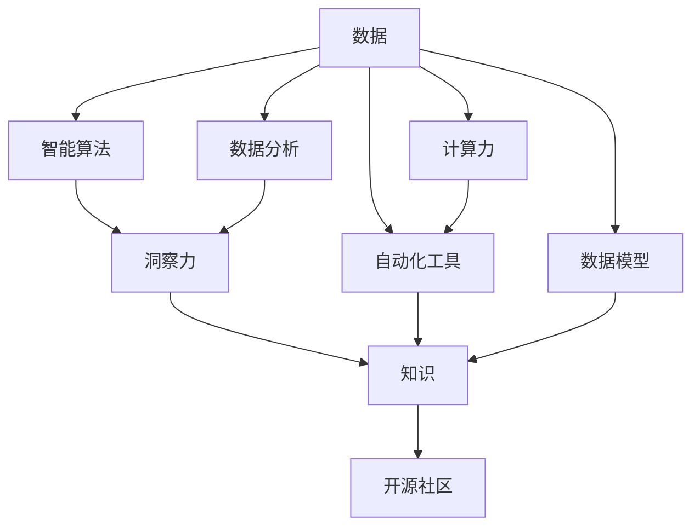

                 

# 知识的传承与创新：洞察力的重要作用

> 关键词：知识传承, 创新驱动, 洞察力, 数据驱动, 智能算法, 自动化, 开源社区, 计算力, 数据模型

## 1. 背景介绍

### 1.1 问题由来
人类文明的发展历程，是一部知识的积累与传承史。从古代的口口相传，到现代的数字化存储，知识的传播和继承方式一直在演变。但无论形式如何变化，其核心都在于“知”的积累和“传”的应用。

现代信息技术特别是互联网技术的发展，极大地加速了知识的获取和传播，同时也为知识的创新提供了前所未有的条件。人工智能(AI)技术的崛起，更是将知识传承与创新的结合推向了一个新的高度。

### 1.2 问题核心关键点
在信息化时代，知识传承和创新的关键在于洞察力。洞察力是指从海量数据中提取有用信息的能力，它是智能算法、数据分析和自动化工具的核心驱动力。洞察力不仅决定了知识的获取效率，也决定了知识的应用深度。

1. **智能算法**：算法是知识传承与创新的重要工具。通过算法，数据被转化为可理解、可操作的知识，为决策和创新提供支持。

2. **数据分析**：数据是知识的源泉。通过对数据进行分析，可以发现数据间的关联和规律，为知识传承和创新提供依据。

3. **自动化工具**：自动化工具可以提升知识传承的效率，降低人工操作成本，使知识传承和创新更加高效。

4. **开源社区**：开源社区汇聚了全球的智慧，提供了丰富的知识资源和创新的平台。

5. **计算力**：计算力是知识传承与创新的基础设施。强大的计算能力可以加速算法的训练和优化，提高数据分析的效率。

6. **数据模型**：数据模型是知识传承与创新的框架。构建有效的数据模型，可以将数据转化为知识，为决策提供支持。

以上这些因素共同构成了知识的传承与创新的生态系统，而洞察力是这个生态系统的核心。

### 1.3 问题研究意义
洞察力在知识传承与创新中扮演着至关重要的角色。通过洞察力，我们可以：

1. **提升效率**：洞察力帮助我们在海量数据中快速发现有用信息，减少人工操作，提高知识获取和传承的效率。

2. **促进创新**：洞察力能从数据中提取新的见解，激发新的想法和创新，推动技术进步和社会发展。

3. **支持决策**：洞察力提供的知识，能帮助我们做出更加明智的决策，优化资源配置，提高管理效能。

4. **降低风险**：洞察力通过数据分析，可以提前识别潜在的风险点，采取预防措施，减少损失。

5. **增强适应性**：洞察力使我们能够及时调整策略，应对环境变化，保持竞争力。

因此，洞察力不仅是知识传承与创新的重要工具，也是人工智能技术发展的核心驱动力。

## 2. 核心概念与联系

### 2.1 核心概念概述

为更好地理解洞察力在知识传承与创新中的作用，本节将介绍几个密切相关的核心概念：

- **知识**：数据经过分析、整理和转换后，形成的可被理解和利用的信息。
- **数据**：信息的表现形式，可以是数字、文本、图像等。
- **洞察力**：通过数据分析发现数据间关联和规律的能力，是智能算法和决策支持的核心。
- **智能算法**：用于数据分析和知识提取的工具，如机器学习、深度学习等。
- **数据分析**：通过统计、挖掘等方法，从数据中提取有用信息的过程。
- **自动化工具**：用于自动化处理数据、分析结果和应用结果的工具，如Python、R等。
- **开源社区**：共享知识和技术资源的社区，如GitHub、Stack Overflow等。
- **计算力**：执行数据处理和算法计算所需的计算资源。
- **数据模型**：用于描述数据结构和关系的模型，如数据仓库、知识图谱等。

这些核心概念之间的逻辑关系可以通过以下Mermaid流程图来展示：



这个流程图展示了大数据时代知识传承与创新的核心概念及其之间的关系：

1. 数据是知识传承与创新的基础。
2. 数据分析和智能算法是洞察力的关键工具。
3. 洞察力通过数据分析提炼出有用信息，是知识传承与创新的核心。
4. 自动化工具提高了知识获取和传承的效率。
5. 开源社区汇聚了全球智慧，促进了知识的共享和创新。
6. 计算力为知识传承与创新提供了必要的资源。
7. 数据模型为知识组织和传递提供了框架。

这些概念共同构成了知识传承与创新的生态系统，洞察力是这个生态系统的核心。

## 3. 核心算法原理 & 具体操作步骤
### 3.1 算法原理概述

洞察力是通过数据分析和智能算法，从数据中提取有用信息的能力。其核心在于发现数据间的关联和规律，从而为决策和创新提供支持。

形式化地，假设有一组数据集 $D = \{(x_i, y_i)\}_{i=1}^N$，其中 $x_i$ 为输入特征，$y_i$ 为输出标签。洞察力的目标是从 $D$ 中提取有用信息 $I$，使得 $I$ 能够支持后续的决策和创新。

洞察力的算法通常包括以下几个步骤：

1. **数据预处理**：清洗、归一化、标准化数据，去除噪声和异常值，为后续分析做准备。
2. **特征提取**：从原始数据中提取特征，以降低维度，提高分析效率。
3. **模型训练**：使用机器学习、深度学习等算法训练模型，从数据中学习规律和模式。
4. **洞察力生成**：通过模型输出，从数据中提取有用信息，用于支持决策和创新。
5. **知识应用**：将洞察力转化为可操作的知识，应用于实际场景，推动业务发展和创新。

### 3.2 算法步骤详解

**Step 1: 数据预处理**

数据预处理是洞察力的第一步。其目标是通过清洗、归一化等方法，使数据满足模型训练的要求，提高后续分析的准确性。

具体步骤包括：
- 数据清洗：去除缺失值、异常值和重复值，确保数据的完整性和一致性。
- 数据归一化：将数据缩放到[0,1]或[-1,1]之间，使不同特征之间的数据具有可比性。
- 特征工程：通过特征组合、特征选择等方法，提取对模型有用的特征。

**Step 2: 特征提取**

特征提取是从原始数据中提取有用特征的过程，降低数据的维度，提高模型的训练效率。

常见特征提取方法包括：
- 主成分分析(PCA)：通过线性变换，将高维数据映射到低维空间。
- 因子分析(FA)：通过寻找因子，将多个特征合并为少数几个因子，减少特征数量。
- 自然语言处理(NLP)：从文本数据中提取关键词、情感等特征。

**Step 3: 模型训练**

模型训练是洞察力的核心步骤。通过训练模型，从数据中学习规律和模式，生成洞察力。

常见模型训练方法包括：
- 监督学习：使用带有标签的数据集，训练模型预测标签。
- 无监督学习：使用无标签的数据集，训练模型发现数据间的内在关系。
- 半监督学习：结合有标签和无标签数据，训练模型提高性能。

**Step 4: 洞察力生成**

洞察力生成是通过模型输出，从数据中提取有用信息的过程。

常见洞察力生成方法包括：
- 预测结果：通过模型预测结果，发现数据间的规律和趋势。
- 异常检测：通过模型检测异常值，发现数据中的异常情况。
- 聚类分析：通过模型将数据分群，发现数据间的关联和分类。

**Step 5: 知识应用**

知识应用是将洞察力转化为可操作的知识，推动业务发展的过程。

常见知识应用方法包括：
- 业务决策：将洞察力应用于业务决策，优化资源配置，提高效率。
- 产品创新：通过洞察力发现市场需求，创新产品设计，提高竞争力。
- 市场营销：通过洞察力了解客户行为，优化营销策略，提高转化率。

### 3.3 算法优缺点

洞察力算法具有以下优点：
1. **效率高**：通过自动化工具和机器算法，提高数据分析和知识提取的效率。
2. **可扩展性强**：算法可以处理大规模数据集，适用于各种业务场景。
3. **结果准确**：通过模型训练，提高洞察力的准确性和可靠性。
4. **灵活性高**：算法可以根据不同的业务需求进行调整，灵活性高。

同时，该算法也存在一定的局限性：
1. **数据依赖性高**：洞察力算法依赖于高质量的数据，数据质量差会影响分析结果。
2. **模型复杂度高**：算法需要复杂的模型和大量的计算资源，对硬件要求高。
3. **过拟合风险高**：模型在训练集上表现良好，但在新数据上可能出现过拟合现象。
4. **解释性差**：算法的决策过程缺乏可解释性，难以理解模型输出的原因。

尽管存在这些局限性，但总体而言，洞察力算法在知识传承与创新中发挥了重要作用，已成为数据驱动决策的重要工具。

### 3.4 算法应用领域

洞察力算法在多个领域都有广泛应用，例如：

- **金融分析**：通过分析股票、基金等金融数据，发现市场趋势，优化投资策略。
- **医疗健康**：通过分析病人数据，发现疾病规律，优化诊疗方案。
- **零售销售**：通过分析消费者行为数据，发现购买模式，优化库存管理。
- **物流管理**：通过分析物流数据，发现运输效率，优化路线规划。
- **电子商务**：通过分析用户数据，发现购买倾向，优化产品推荐。
- **能源管理**：通过分析能源数据，发现能源消耗规律，优化能源利用。
- **环境保护**：通过分析环境数据，发现污染规律，优化环保措施。

这些领域中的洞察力应用，极大地提高了业务效率，推动了技术创新和业务发展。

## 4. 数学模型和公式 & 详细讲解  
### 4.1 数学模型构建

本节将使用数学语言对洞察力算法的数学模型进行更加严格的刻画。

假设有一组数据集 $D = \{(x_i, y_i)\}_{i=1}^N$，其中 $x_i$ 为输入特征，$y_i$ 为输出标签。

定义模型 $M_{\theta}$ 在输入 $x$ 上的输出为 $y$，即 $y = M_{\theta}(x)$。

洞察力的目标是找到最优的模型参数 $\theta^*$，使得模型输出 $y$ 与真实标签 $y_i$ 的误差最小化。

形式化地，洞察力的目标是求解以下优化问题：

$$
\theta^* = \mathop{\arg\min}_{\theta} \frac{1}{N} \sum_{i=1}^N \ell(y_i, M_{\theta}(x_i))
$$

其中 $\ell(y_i, M_{\theta}(x_i))$ 为损失函数，通常使用均方误差或交叉熵等。

### 4.2 公式推导过程

以下我们以线性回归模型为例，推导其优化目标函数及其梯度的计算公式。

假设模型 $M_{\theta}$ 为线性回归模型，其参数 $\theta$ 包括偏置 $b$ 和权重 $w$，即 $y = \theta^T x + b$。

在给定训练集 $D = \{(x_i, y_i)\}_{i=1}^N$ 的情况下，模型损失函数为均方误差：

$$
\ell(y_i, M_{\theta}(x_i)) = (y_i - M_{\theta}(x_i))^2
$$

则整个数据集上的平均损失函数为：

$$
\mathcal{L}(\theta) = \frac{1}{N} \sum_{i=1}^N (y_i - \theta^T x_i - b)^2
$$

将上述公式展开，得：

$$
\mathcal{L}(\theta) = \frac{1}{N} \sum_{i=1}^N \left( y_i^2 - 2y_i(\theta^T x_i + b) + (\theta^T x_i)^2 + b^2 \right)
$$

进一步简化，得：

$$
\mathcal{L}(\theta) = \frac{1}{N} \left( \sum_{i=1}^N y_i^2 + 2\theta^T \sum_{i=1}^N y_i x_i + \sum_{i=1}^N (\theta^T x_i)^2 + Nb^2 \right) - \frac{2}{N} \sum_{i=1}^N y_i \theta^T x_i - \frac{1}{N} \sum_{i=1}^N (\theta^T x_i)^2 - \frac{1}{N} \sum_{i=1}^N b^2
$$

对 $\theta$ 求偏导，得：

$$
\frac{\partial \mathcal{L}(\theta)}{\partial \theta} = -2\frac{1}{N} \sum_{i=1}^N \theta^T x_i + 2\frac{1}{N} \sum_{i=1}^N y_i x_i
$$

化简，得：

$$
\frac{\partial \mathcal{L}(\theta)}{\partial \theta} = \frac{2}{N} \sum_{i=1}^N (y_i - \theta^T x_i) x_i
$$

根据链式法则，损失函数对模型参数 $\theta$ 的梯度为：

$$
\frac{\partial \mathcal{L}(\theta)}{\partial \theta} = -2\frac{1}{N} \sum_{i=1}^N \theta^T x_i + 2\frac{1}{N} \sum_{i=1}^N y_i x_i
$$

在得到损失函数的梯度后，即可带入参数更新公式，完成模型的迭代优化。重复上述过程直至收敛，最终得到适应数据集 $D$ 的最优模型参数 $\theta^*$。

## 5. 项目实践：代码实例和详细解释说明
### 5.1 开发环境搭建

在进行洞察力算法实践前，我们需要准备好开发环境。以下是使用Python进行Scikit-learn开发的环境配置流程：

1. 安装Anaconda：从官网下载并安装Anaconda，用于创建独立的Python环境。

2. 创建并激活虚拟环境：
```bash
conda create -n sklearn-env python=3.8 
conda activate sklearn-env
```

3. 安装Scikit-learn：
```bash
conda install scikit-learn
```

4. 安装各类工具包：
```bash
pip install numpy pandas matplotlib scikit-learn ipython
```

完成上述步骤后，即可在`sklearn-env`环境中开始洞察力算法的实践。

### 5.2 源代码详细实现

下面我们以线性回归模型为例，给出使用Scikit-learn对数据集进行洞察力分析的Python代码实现。

首先，定义数据集和标签：

```python
from sklearn.datasets import load_boston
from sklearn.linear_model import LinearRegression
import numpy as np
import pandas as pd

# 加载波士顿房价数据集
boston = load_boston()
X = boston.data
y = boston.target
```

然后，定义训练集和测试集：

```python
# 划分训练集和测试集
from sklearn.model_selection import train_test_split

X_train, X_test, y_train, y_test = train_test_split(X, y, test_size=0.2, random_state=42)
```

接着，定义线性回归模型并训练：

```python
# 定义线性回归模型
model = LinearRegression()

# 训练模型
model.fit(X_train, y_train)
```

最后，在测试集上评估模型：

```python
# 在测试集上评估模型
y_pred = model.predict(X_test)
r_squared = model.score(X_test, y_test)

print("R-squared:", r_squared)
```

以上就是一个简单的洞察力算法实践过程。可以看到，Scikit-learn库提供了丰富的机器学习模型和工具，使得洞察力算法的实现变得非常便捷。

### 5.3 代码解读与分析

让我们再详细解读一下关键代码的实现细节：

**load_boston函数**：
- 从Scikit-learn库中加载波士顿房价数据集，返回特征和标签。

**train_test_split函数**：
- 将数据集划分为训练集和测试集，比例为80%训练集和20%测试集，随机状态为42，确保每次实验结果一致。

**LinearRegression类**：
- 定义线性回归模型，使用梯度下降算法训练模型。

**fit方法**：
- 在训练集上训练模型，优化模型参数。

**predict方法**：
- 在测试集上对新数据进行预测，返回预测结果。

**score方法**：
- 计算模型在测试集上的决定系数（R-squared），评估模型性能。

可以看到，Scikit-learn库使得洞察力算法的实现变得非常简洁高效。开发者可以将更多精力放在算法选择、数据预处理、模型调优等高层逻辑上，而不必过多关注底层的实现细节。

当然，工业级的系统实现还需考虑更多因素，如模型的保存和部署、超参数的自动搜索、更灵活的任务适配层等。但核心的洞察力算法基本与此类似。

## 6. 实际应用场景
### 6.1 智能推荐系统

洞察力算法在智能推荐系统中的应用非常广泛。通过分析用户的历史行为数据，洞察力算法可以发现用户的偏好和兴趣，从而推荐符合用户口味的内容。

具体而言，可以收集用户浏览、点击、购买等行为数据，提取其中的特征，如商品类别、价格、评分等。通过洞察力算法，模型可以学习用户行为规律，生成个性化的推荐结果。例如，Amazon的推荐系统就广泛应用了洞察力算法，通过分析用户的浏览和购买历史，推荐符合用户兴趣的商品，极大地提高了用户满意度。

### 6.2 风险评估

金融行业需要实时评估金融产品的风险，以保障金融安全。通过分析历史数据和市场情况，洞察力算法可以发现潜在的风险点，提供风险评估报告。

具体而言，可以收集金融产品的历史交易数据、市场行情、新闻事件等，提取其中的特征，如产品价格、波动率、新闻情感等。通过洞察力算法，模型可以学习金融产品的风险特征，生成风险评估报告，帮助金融机构做出更明智的投资决策。例如，量化交易策略中就广泛应用了洞察力算法，通过分析历史数据和实时市场情况，预测股票价格波动，优化交易策略，降低风险。

### 6.3 供应链管理

供应链管理中，洞察力算法可以用于优化库存管理和物流调度。通过分析历史订单和物流数据，洞察力算法可以发现供应链中的瓶颈和效率问题，提出改进方案。

具体而言，可以收集历史订单数据、物流数据、供应商数据等，提取其中的特征，如订单量、到货时间、供应商响应时间等。通过洞察力算法，模型可以学习供应链的运作规律，生成优化方案，提高供应链效率。例如，京东的供应链管理中就广泛应用了洞察力算法，通过分析历史订单和物流数据，优化库存管理和物流调度，降低物流成本，提高配送效率。

### 6.4 未来应用展望

随着洞察力算法的不断发展，未来的应用领域将更加广泛，为各行各业带来更多价值：

- **医疗健康**：通过分析病人数据，洞察力算法可以发现疾病规律，优化诊疗方案，提高医疗服务质量。例如，通过分析病人的电子病历和实验室数据，洞察力算法可以预测病人疾病风险，提前采取预防措施。
- **环境保护**：通过分析环境数据，洞察力算法可以发现污染规律，优化环保措施，保护生态环境。例如，通过分析大气污染数据和水质数据，洞察力算法可以预测环境污染趋势，提出改进建议。
- **智能家居**：通过分析用户行为数据，洞察力算法可以发现用户的喜好和习惯，提供个性化的家居服务。例如，通过分析用户对智能家居设备的控制记录，洞察力算法可以推荐符合用户喜好的智能家居设备。
- **智能交通**：通过分析交通数据，洞察力算法可以发现交通拥堵规律，优化交通调度，提高交通效率。例如，通过分析交通流量数据和道路状况数据，洞察力算法可以预测交通拥堵情况，提前采取缓解措施。

以上这些应用场景都展示了洞察力算法的广泛应用，极大地推动了各行业的智能化发展。未来，随着计算力和数据量的不断增长，洞察力算法将在更多领域得到应用，为各行各业带来新的机遇和挑战。

## 7. 工具和资源推荐
### 7.1 学习资源推荐

为了帮助开发者系统掌握洞察力算法的理论基础和实践技巧，这里推荐一些优质的学习资源：

1. **《Python机器学习》书籍**：由Sebastian Raschka撰写，全面介绍了机器学习和数据分析的基础知识和常用算法。

2. **Coursera《机器学习》课程**：由Andrew Ng教授讲授，涵盖了机器学习的各个方面，包括监督学习、无监督学习和深度学习等。

3. **Kaggle机器学习竞赛**：Kaggle是一个数据科学竞赛平台，通过参与比赛，可以积累实战经验，了解最新算法和技术。

4. **Kaggle数据分析竞赛**：Kaggle还提供了数据分析竞赛，可以锻炼数据处理和洞察力分析的能力。

5. **Scikit-learn官方文档**：Scikit-learn库的官方文档，提供了丰富的算法和工具，适合初学者和进阶者学习。

通过对这些资源的学习实践，相信你一定能够快速掌握洞察力算法的精髓，并用于解决实际的业务问题。

### 7.2 开发工具推荐

高效的开发离不开优秀的工具支持。以下是几款用于洞察力算法开发的常用工具：

1. **Jupyter Notebook**：一个开源的交互式编程环境，支持Python、R等多种语言，适合数据科学研究和实践。

2. **PyCharm**：一款功能强大的Python IDE，提供代码编辑、调试、测试、部署等全流程支持，适合开发复杂算法。

3. **RStudio**：一款专业的R语言IDE，支持数据科学和统计分析，提供丰富的工具和插件，适合数据科学研究和实践。

4. **Tableau**：一款数据可视化工具，支持从数据中提取洞察力，适合数据可视化和探索性分析。

5. **Google Colab**：谷歌推出的在线Jupyter Notebook环境，免费提供GPU/TPU算力，适合进行大规模数据处理和算法实验。

合理利用这些工具，可以显著提升洞察力算法的开发效率，加快创新迭代的步伐。

### 7.3 相关论文推荐

洞察力算法的研究始于上世纪60年代，经过多年的发展，已经成为数据科学和人工智能的重要分支。以下是几篇奠基性的相关论文，推荐阅读：

1. **A New Algorithm for Stochastic Optimization**：Friedman（1975）提出随机梯度下降算法，为机器学习提供了基础的算法支持。

2. **The Elements of Statistical Learning**：Hastie、Tibshirani和Friedman（2009）系统介绍了统计学习理论和算法，是数据科学领域的经典教材。

3. **Deep Learning**：Goodfellow、Bengio和Courville（2016）全面介绍了深度学习理论和实践，是深度学习领域的经典教材。

4. **TensorFlow for Deep Learning**：Abadi等人（2016）介绍了TensorFlow框架的使用方法和实践案例，是深度学习实践的必备资源。

5. **Scikit-learn用户指南**：Bre Breuleux和Pedregosa（2014）详细介绍了Scikit-learn库的使用方法和实践案例，是机器学习实践的必备资源。

这些论文代表了大数据时代的算法发展脉络。通过学习这些前沿成果，可以帮助研究者把握学科前进方向，激发更多的创新灵感。

## 8. 总结：未来发展趋势与挑战

### 8.1 总结

本文对洞察力算法在知识传承与创新中的应用进行了全面系统的介绍。首先阐述了洞察力算法的核心思想和在知识传承与创新中的重要性，明确了洞察力算法在数据分析、决策支持、创新驱动等方面的关键作用。其次，从原理到实践，详细讲解了洞察力算法的数学模型和关键步骤，给出了洞察力算法任务开发的完整代码实例。同时，本文还广泛探讨了洞察力算法在智能推荐、风险评估、供应链管理等诸多领域的应用前景，展示了洞察力算法的巨大潜力。此外，本文精选了洞察力算法的各类学习资源，力求为读者提供全方位的技术指引。

通过本文的系统梳理，可以看到，洞察力算法在知识传承与创新中扮演了至关重要的角色。通过洞察力算法，我们可以从海量数据中提取有用信息，为决策和创新提供支持，推动各行业的智能化发展。未来，随着计算力和数据量的不断增长，洞察力算法必将在更多领域得到应用，为人类认知智能的进化带来深远影响。

### 8.2 未来发展趋势

展望未来，洞察力算法的不断发展将呈现以下几个趋势：

1. **算法复杂度增加**：随着深度学习和神经网络的发展，洞察力算法将变得更加复杂。未来的洞察力算法将融合深度学习、自然语言处理等技术，提高分析精度和效率。

2. **多模态分析**：传统的洞察力算法主要处理单一类型的数据，未来的洞察力算法将融合多模态数据，如图像、文本、音频等，提供更全面的分析能力。

3. **实时计算**：实时数据流的分析和洞察力提取，对洞察力算法提出了新的挑战。未来的洞察力算法将具备更强的实时计算能力，能够及时响应用户需求。

4. **自动化**：自动化洞察力提取和决策支持，是洞察力算法的未来方向。未来的洞察力算法将具备更强的自主学习和优化能力，提高数据处理效率。

5. **跨领域应用**：跨领域的洞察力分析，将促进不同领域之间的知识融合和创新。未来的洞察力算法将融合不同领域的数据和知识，提供更全面的分析能力。

6. **隐私保护**：数据隐私和安全是洞察力算法面临的重要问题。未来的洞察力算法将更加注重数据隐私保护，防止数据泄露和滥用。

以上趋势凸显了洞察力算法在数据驱动决策中的重要作用，未来洞察力算法的研究将不断拓展应用范围，提升数据分析的深度和广度。

### 8.3 面临的挑战

尽管洞察力算法在知识传承与创新中发挥了重要作用，但在迈向更加智能化、普适化应用的过程中，它仍面临着诸多挑战：

1. **数据质量问题**：数据质量差是洞察力算法面临的主要问题。数据中的噪声、缺失值、异常值等会影响分析结果，需要投入大量精力进行数据清洗和预处理。

2. **模型复杂性高**：洞察力算法的模型往往比较复杂，需要大量的计算资源和时间进行训练和优化。如何降低模型复杂度，提高计算效率，是未来的一个重要研究方向。

3. **解释性不足**：洞察力算法的决策过程缺乏可解释性，难以理解模型输出的原因，影响模型的可信度和可接受性。如何提高模型的可解释性，是未来的一个重要研究方向。

4. **多目标优化**：洞察力算法通常需要同时考虑多个目标，如效率、准确性、可解释性等。如何在多目标之间进行权衡和优化，是未来的一个重要研究方向。

5. **隐私保护**：洞察力算法需要处理大量敏感数据，如何在保护数据隐私的同时，提取有用信息，是未来的一个重要研究方向。

6. **跨领域应用**：跨领域的洞察力分析，需要融合不同领域的数据和知识，提高分析的复杂度和难度。如何提高跨领域分析的准确性和效率，是未来的一个重要研究方向。

7. **自动化和智能化**：自动化和智能化是洞察力算法的未来方向，但自动化的过程需要大量的人工干预和优化，如何降低人工干预，提高自动化程度，是未来的一个重要研究方向。

这些挑战凸显了洞察力算法在知识传承与创新中的重要性和复杂性，未来需要在算法设计、数据处理、模型优化等方面进行全面研究。

### 8.4 研究展望

面对洞察力算法所面临的诸多挑战，未来的研究需要在以下几个方面寻求新的突破：

1. **数据质量提升**：通过数据预处理和清洗技术，提升数据质量，减少噪声和异常值的影响，提高分析结果的准确性。

2. **模型简化**：通过模型简化和优化技术，降低模型复杂度，提高计算效率，降低对计算资源的需求。

3. **可解释性增强**：通过可解释性算法和技术，提高模型的可解释性，使模型输出的决策过程透明化，提高模型的可信度和可接受性。

4. **多目标优化**：通过多目标优化算法和技术，在效率、准确性、可解释性等目标之间进行权衡和优化，提高洞察力算法的整体性能。

5. **隐私保护技术**：通过隐私保护技术和方法，保护数据隐私和安全，防止数据泄露和滥用。

6. **跨领域分析**：通过跨领域分析技术，融合不同领域的数据和知识，提高分析的准确性和效率。

7. **自动化技术**：通过自动化技术和方法，降低人工干预，提高自动化程度，推动洞察力算法的智能化发展。

这些研究方向将引领洞察力算法的未来发展，为知识传承与创新提供更强大的工具和方法。相信随着学界和产业界的共同努力，这些研究方向必将在未来取得新的突破，推动洞察力算法的发展和应用。

## 9. 附录：常见问题与解答

**Q1：洞察力算法是否适用于所有数据类型？**

A: 洞察力算法适用于多种数据类型，包括数字数据、文本数据、图像数据等。但不同类型的数据需要进行不同的预处理和特征提取，才能被洞察力算法识别和分析。

**Q2：洞察力算法是否需要大量的标注数据？**

A: 大多数洞察力算法不需要标注数据，可以通过无监督学习或半监督学习从数据中提取有用信息。但在某些特定任务中，如分类、回归等，需要标注数据进行监督学习，提高分析精度。

**Q3：洞察力算法是否容易过拟合？**

A: 洞察力算法容易过拟合，尤其是在数据量小、特征维度高的情况下。为了防止过拟合，可以引入正则化技术、交叉验证等方法，降低模型复杂度，提高泛化性能。

**Q4：洞察力算法的计算资源需求高吗？**

A: 洞察力算法的计算资源需求较高，尤其是在处理大规模数据集时。但通过优化算法和模型结构，可以降低计算资源的消耗，提高效率。

**Q5：洞察力算法的可解释性如何？**

A: 洞察力算法的可解释性较差，其决策过程难以理解，缺乏透明性。但可以通过可解释性算法和技术，提高模型的可解释性，使其决策过程透明化，提高可信度。

通过这些常见问题的解答，可以看到，洞察力算法在数据驱动决策中具有重要应用，但也面临着数据质量、模型复杂性、可解释性等诸多挑战。未来需要在算法设计、数据处理、模型优化等方面进行全面研究，推动洞察力算法的发展和应用。

---

作者：禅与计算机程序设计艺术 / Zen and the Art of Computer Programming

