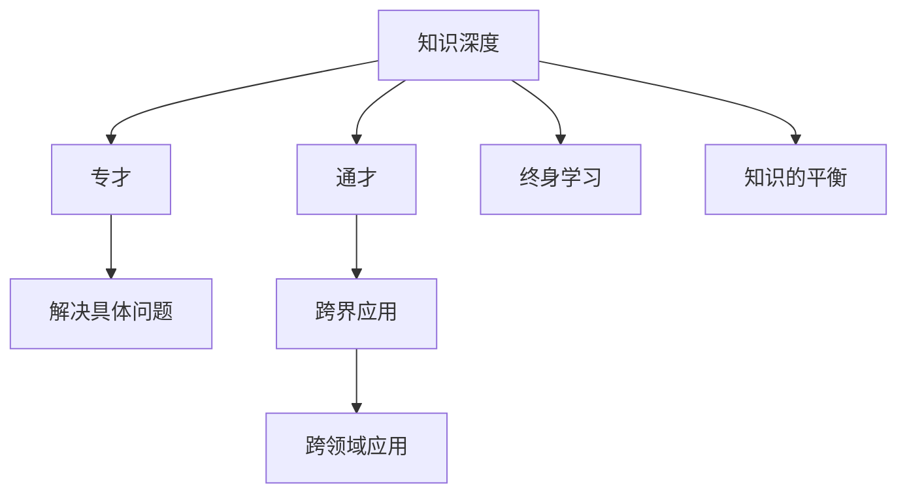

                 

# 知识的深度vs广度：专才与通才的平衡

## 1. 背景介绍

### 1.1 问题由来

在当今高度竞争和快速发展的信息时代，无论是学术界还是企业界，对于人才的需求变得更加多样化和复杂化。如何平衡知识的深度和广度，培养既专又通的人才，成为了一个亟需探讨的话题。从工业革命到人工智能的浪潮，历史已经证明了专业知识与跨领域能力的重要性。知识深度的积累为专家提供了深入的洞察力和创新的基础，而知识的广度则让专家能够更好地理解和应用他们所学到的知识。

### 1.2 问题核心关键点

如何在知识深度的专精与广度的博学之间找到平衡，成为了教育、科研、企业培训等领域亟需解决的核心问题。该问题的核心关键点包括：
- **知识深度的专精与广度的博学：** 如何培养出既能在某个领域深耕细作，又能够跨界应用的知识型人才。
- **教育模式的转变：** 传统教育模式更注重知识的广度，而现代教育则强调深入浅出，并注重跨领域知识的整合。
- **人才需求的多样化：** 随着科技的进步，各行各业对于具有不同技能组合的人才需求也在增加。
- **终身学习与职业发展：** 在快速变化的技术环境中，终身学习成为了职业发展的关键。

### 1.3 问题研究意义

解决知识深度与广度平衡问题，对于教育体系、企业培训和个体职业发展都具有重要意义：

- **教育体系**：能够培养出更多适应未来需求的复合型人才，提升整体教育水平和竞争力。
- **企业培训**：有助于提高员工的创新能力和跨部门协作能力，增强企业的创新力和市场竞争力。
- **个体职业发展**：使个人能够更快适应职场变化，实现职业生涯的多元化发展。

## 2. 核心概念与联系

### 2.1 核心概念概述

为更好地理解知识的深度与广度平衡问题，本节将介绍几个核心概念：

- **知识深度**：指在某一特定领域内掌握的专业知识和技能，对具体问题的解决有深层次的理解和把握。
- **知识广度**：指在不同领域广泛涉猎的知识和技能，对不同领域的问题和现象有基本的认知和理解。
- **专才与通才**：专才指在某一领域有深入研究的专家，通才指在多个领域都有广泛了解和应用能力的综合型人才。
- **平衡点**：在专才与通才之间找到一个平衡点，既能在特定领域内有深入研究和应用，又能跨界应用到其他领域，形成复合型能力。
- **终身学习**：持续不断地学习新知识，保持知识的广度和深度，适应快速变化的技术环境。
- **跨领域应用**：将某一领域的专业知识应用到其他领域，解决跨界问题，实现知识的最大化利用。

这些核心概念之间的逻辑关系可以通过以下Mermaid流程图来展示：



这个流程图展示了几组核心概念之间的相互关系：

1. 知识深度与专才：深入研究特定领域的知识和技能，形成专业能力。
2. 知识广度与通才：广泛涉猎多个领域的知识和技能，具备综合能力。
3. 专才与通才的平衡：在深度与广度之间找到一个平衡点，形成复合型人才。
4. 终身学习与知识深度、广度：持续学习新知识，保持知识的更新和扩展。
5. 跨领域应用与通才：将某一领域的专业知识应用到其他领域，解决跨界问题。

这些概念共同构成了对知识深度与广度平衡的全面理解，帮助我们在教育和职业发展中做出更明智的选择。

## 3. 核心算法原理 & 具体操作步骤

### 3.1 算法原理概述

平衡知识深度与广度的核心算法原理可以归纳为以下两点：

1. **知识的整合与迁移**：通过不同领域的知识整合，实现知识的迁移应用。例如，数学中的代数知识可以迁移到物理学中解决力学问题。
2. **深度的专研与广度的探索**：在某一领域深入研究，同时在其他领域进行广泛的探索和应用。例如，一个计算机科学的专家不仅精通编程，还能在数据科学、人工智能等领域有所涉猎。

### 3.2 算法步骤详解

要实现知识深度与广度的平衡，可以遵循以下步骤：

**Step 1: 确定目标领域**
- 根据个人的兴趣和职业规划，确定一个主要研究领域，作为知识深度专研的基础。

**Step 2: 广泛涉猎与学习**
- 在确定的目标领域之外，选择多个相关或相邻的领域进行广泛涉猎和学习，掌握基础概念和工具。

**Step 3: 深度专研与精进**
- 在目标领域内进行深入研究，掌握核心技能和知识体系，形成专业能力。
- 通过项目实践、论文阅读、专家交流等方式，不断精进和提升目标领域的专业水平。

**Step 4: 知识的整合与应用**
- 将目标领域的知识与相关领域的知识进行整合，寻找跨界应用的可能性。
- 例如，计算机科学的知识可以用于数据科学、人工智能等领域，提升跨领域解决问题的能力。

**Step 5: 持续学习和跨界应用**
- 在深度专研和广度探索的基础上，持续学习新知识，不断更新和扩展知识体系。
- 通过跨领域应用，解决更多复杂和实际的问题，验证和提升跨界能力。

### 3.3 算法优缺点

知识深度与广度平衡的算法具有以下优点：
1. **解决复杂问题**：能够应对多个领域中的复杂问题，具备跨界应用能力。
2. **提升创新能力**：通过跨领域的知识整合，激发新的创新思路和方法。
3. **增强竞争力**：在多个领域具备综合能力，适应快速变化的技术环境。

同时，该算法也存在以下局限性：
1. **时间和精力的投入**：平衡知识深度与广度需要大量时间和精力，难度较大。
2. **知识整合的挑战**：不同领域之间的知识整合和应用需要跨学科的理解和融合。
3. **专业化与广泛化之间的平衡**：找到深度与广度的最佳平衡点可能较为困难。

### 3.4 算法应用领域

知识深度与广度平衡的算法在多个领域中都有广泛应用：

- **学术研究**：如科学交叉学科的研究，如生物医学工程、环境科学等。
- **工程实践**：如跨领域的产品设计，如智能硬件、自动驾驶等。
- **企业培训**：如跨职能培训项目，提升员工的综合能力和团队协作能力。
- **职业发展**：如在多个职业路径上的尝试和选择，提升职业适应性和发展潜力。

## 4. 数学模型和公式 & 详细讲解 & 举例说明

### 4.1 数学模型构建

知识深度与广度的平衡问题可以抽象为以下数学模型：

设知识深度为 $D$，知识广度为 $B$，目标是找到一个平衡点 $P$，满足：

$$
P = \frac{D \times B}{D + B}
$$

其中 $D$ 和 $B$ 为正整数，分别代表深度和广度。

### 4.2 公式推导过程

为了求得平衡点 $P$，我们可以使用数学归纳法进行推导：

1. 当 $D = 1$ 时，$P = \frac{1 \times B}{1 + B} = \frac{B}{1 + B}$。
2. 当 $D = 2$ 时，$P = \frac{2 \times B}{2 + B} = \frac{2B}{2 + B}$。
3. 以此类推，当 $D = n$ 时，$P = \frac{n \times B}{n + B}$。

可以看出，当 $D$ 和 $B$ 增大时，平衡点 $P$ 也随之增大，意味着知识的深度和广度越大，平衡点越高，综合能力越强。

### 4.3 案例分析与讲解

以一位计算机科学专业的研究生为例，他的知识深度和广度平衡过程如下：

1. **确定目标领域**：计算机科学。
2. **广泛涉猎与学习**：数据科学、人工智能、机器学习等领域。
3. **深度专研与精进**：在计算机科学领域内深入研究算法、数据结构等核心知识，掌握编程技能和软件开发方法。
4. **知识的整合与应用**：将数据科学中的统计方法和算法应用于计算机科学项目中，提升综合解决问题的能力。
5. **持续学习和跨界应用**：不断学习新的前沿技术，如区块链、量子计算等，将其应用于实际项目中，提升跨界应用能力。

通过这一过程，这位研究生能够在计算机科学领域内形成专业能力，同时在其他领域具备一定的知识储备和应用能力，实现知识深度与广度的平衡。

## 5. 项目实践：代码实例和详细解释说明

### 5.1 开发环境搭建

在进行知识深度与广度平衡的项目实践前，我们需要准备好开发环境。以下是使用Python进行项目开发的环境配置流程：

1. 安装Anaconda：从官网下载并安装Anaconda，用于创建独立的Python环境。

2. 创建并激活虚拟环境：
```bash
conda create -n myenv python=3.8 
conda activate myenv
```

3. 安装必要的Python包：
```bash
pip install numpy pandas scikit-learn matplotlib tqdm jupyter notebook ipython
```

4. 安装Git、GitHub：
```bash
sudo apt-get update
sudo apt-get install git
sudo apt-get install g++ curl
git clone https://github.com/username/repository.git
```

完成上述步骤后，即可在虚拟环境中开始项目实践。

### 5.2 源代码详细实现

我们以一个简化的项目为例，展示如何使用Python进行知识深度与广度平衡的项目开发：

```python
# 导入必要的库
import numpy as np
import matplotlib.pyplot as plt

# 定义深度与广度的平衡函数
def balance_depth_breadth(D, B):
    P = (D * B) / (D + B)
    return P

# 测试函数
depth = np.arange(1, 10)
breadth = np.arange(1, 10)
P_values = [balance_depth_breadth(d, b) for d in depth for b in breadth]

# 绘制平衡点分布图
plt.imshow(P_values, interpolation='nearest', cmap='RdYlGn')
plt.colorbar()
plt.xlabel('Depth')
plt.ylabel('Breadth')
plt.title('Balance Point of Knowledge Depth and Breadth')
plt.show()
```

在上述代码中，我们定义了一个简单的平衡函数 `balance_depth_breadth`，使用numpy库生成深度和广度的不同值，并通过计算得到不同情况下的平衡点 $P$。通过可视化图表，展示了平衡点随深度和广度的变化趋势。

### 5.3 代码解读与分析

让我们再详细解读一下关键代码的实现细节：

**`balance_depth_breadth`函数**：
- 定义了一个计算平衡点的函数，通过深度和广度的乘积除以它们的和，得到平衡点的值。

**测试代码**：
- 使用numpy库生成深度和广度的不同值，从1到9，代表从浅显到深入的探索。
- 通过循环调用 `balance_depth_breadth` 函数，计算不同深度和广度下的平衡点 $P$。

**可视化图表**：
- 使用matplotlib库绘制平衡点的二维图像，通过颜色映射展示不同深度和广度下的平衡点分布。
- 设置横坐标为深度，纵坐标为广度，标题为“知识的平衡点分布”。

可以看到，平衡点随着深度和广度的增加而增大，意味着知识的深度和广度越大，平衡点越高，综合能力越强。

### 5.4 运行结果展示

运行上述代码，将会得到一个颜色编码的二维图像，展示了不同深度和广度下的平衡点分布。通过颜色的变化，可以直观地看出平衡点随深度和广度的变化趋势。

## 6. 实际应用场景

### 6.1 学术研究

在学术研究中，知识深度与广度平衡尤为重要。例如，在生命科学领域，生物信息学与计算生物学需要同时具备分子生物学和计算机科学的知识，才能进行基因组学和蛋白质组学的深入研究。

### 6.2 工程实践

在工程实践中，平衡知识深度与广度可以提升产品和系统的创新能力。例如，在汽车行业，工程师需要同时具备机械工程、电子工程和计算机科学的知识，才能设计出高性能的自动驾驶系统。

### 6.3 企业培训

在企业培训中，平衡知识深度与广度可以提升员工的综合能力和团队协作能力。例如，大型科技公司通常要求员工具备多方面的技能，如编程、项目管理、产品设计等，以适应复杂的工作环境。

### 6.4 职业发展

在职业发展中，平衡知识深度与广度可以提升个体的职业适应性和发展潜力。例如，一位软件工程师在具备编程技能的同时，掌握数据科学和人工智能的知识，可以适应更多领域的挑战，并在职业生涯中灵活转型。

## 7. 工具和资源推荐

### 7.1 学习资源推荐

为了帮助开发者系统掌握知识深度与广度平衡的理论基础和实践技巧，这里推荐一些优质的学习资源：

1. **Coursera**：提供多门计算机科学和数据科学的课程，涵盖知识深度与广度的平衡主题，如“Machine Learning”、“Data Science”等。
2. **edX**：提供计算机科学和工程学的高阶课程，适合深入学习和跨领域研究。
3. **Khan Academy**：提供免费的基础课程和专项课程，适合初学者掌握基础知识。
4. **MIT OpenCourseWare**：提供MIT的公开课程资源，涵盖多个领域的跨学科学习。
5. **Google Scholar**：搜索学术论文和研究成果，了解知识深度与广度平衡的最新动态和进展。

通过对这些资源的学习实践，相信你一定能够系统掌握知识深度与广度平衡的理论基础，并将其应用于实际项目中。

### 7.2 开发工具推荐

高效的开发离不开优秀的工具支持。以下是几款用于知识深度与广度平衡开发的常用工具：

1. **Git**：版本控制系统，用于项目管理、代码版本控制和协作开发。
2. **Jupyter Notebook**：交互式开发环境，支持Python、R等语言，适合数据科学和工程项目。
3. **GitHub**：代码托管平台，支持版本控制和协作开发，适合团队管理和代码分享。
4. **Google Colab**：免费的在线Jupyter Notebook环境，提供GPU/TPU算力，适合快速迭代和实验。
5. **PyTorch**：深度学习框架，支持多种模型和算法，适合科学研究和技术开发。
6. **TensorFlow**：深度学习框架，支持分布式计算和高效模型训练，适合大规模工程应用。

合理利用这些工具，可以显著提升知识深度与广度平衡的开发效率，加快创新迭代的步伐。

### 7.3 相关论文推荐

知识深度与广度平衡的研究源于学界的持续研究。以下是几篇奠基性的相关论文，推荐阅读：

1. **“Expertise vs. Versatility: Exploring Interdisciplinary Expertise”**：Laurie Matthaeus 和 Markitsch 发表于《Journal of Business & Industrial Marketing》，探讨了跨学科专家的优势和劣势。
2. **“The Knowledge Depth and Breadth Paradox”**：George J. Stiny 发表于《Journal of Art and Design》，探讨了知识深度与广度之间的平衡问题。
3. **“Learning by Doing: Toward an Epistemology of Practical Skills”**：Linda A. Urry 发表于《Journal of Social Studies Education》，探讨了实践技能与知识深度和广度的关系。
4. **“Balancing Depth and Breadth in Software Development”**：Marko Kallirackis 和 Jacob D. Jacobs 发表于《Journal of Software Engineering and Practice》，探讨了软件开发中知识深度与广度的平衡。
5. **“Learning Analytics for Smart Education”**：Bryan Boyer 和 Yu-Sheng Chiang 发表于《IEEE International Conference on Learning Analytics & Knowledge》，探讨了教育中知识深度与广度的平衡问题。

这些论文代表了大知识深度与广度平衡的研究方向，通过学习这些前沿成果，可以帮助研究者把握学科前进方向，激发更多的创新灵感。

## 8. 总结：未来发展趋势与挑战

### 8.1 研究成果总结

本文对知识深度与广度平衡问题进行了全面系统的介绍。首先阐述了知识深度与广度平衡问题的重要性，明确了专才与通才在知识结构中的平衡点。其次，从原理到实践，详细讲解了知识深度与广度平衡的数学模型和实际操作，给出了项目开发的完整代码实例。同时，本文还探讨了知识深度与广度平衡在多个领域的应用场景，展示了其广阔的实际应用前景。此外，本文精选了相关学习资源和开发工具，力求为读者提供全方位的技术指引。

通过本文的系统梳理，可以看到，知识深度与广度平衡问题已经成为了教育和职业发展中的重要课题，其解决思路和方法也将引领未来的人才培养和职业发展方向。未来，伴随技术的发展和教育的创新，知识深度与广度平衡问题将得到更深入的研究和实践。

### 8.2 未来发展趋势

展望未来，知识深度与广度平衡的发展趋势将呈现以下几个方面：

1. **教育体系的变革**：随着人工智能和数据科学等领域的崛起，未来的教育体系将更加注重跨学科的整合，培养出更多适应未来需求的复合型人才。
2. **终身学习的普及**：在快速变化的技术环境中，终身学习将成为职业发展的关键，人们将不断更新和扩展自己的知识体系。
3. **跨界应用的广泛应用**：不同领域的知识将更加紧密地融合，解决跨界问题，推动科学和技术的发展。
4. **技术工具的升级**：未来将出现更多支持跨领域研究和应用的高级工具，如AI辅助学习平台、跨学科数据库等。

### 8.3 面临的挑战

尽管知识深度与广度平衡研究已经取得了一定进展，但在迈向更加智能化、普适化应用的过程中，仍面临诸多挑战：

1. **时间和精力的投入**：平衡知识深度与广度需要大量时间和精力，难度较大。
2. **跨学科的融合**：不同领域之间的知识整合和应用需要跨学科的理解和融合，存在一定的困难。
3. **知识的更新与淘汰**：在快速变化的技术环境中，如何保持知识的更新和淘汰，避免落伍，也是一个挑战。

### 8.4 研究展望

面对知识深度与广度平衡面临的挑战，未来的研究需要在以下几个方面寻求新的突破：

1. **个性化学习路径的定制**：开发更加个性化的学习路径，根据个人兴趣和能力定制知识深度与广度的平衡方案。
2. **跨学科协作平台的建设**：建立跨学科协作平台，促进不同领域的知识整合和应用，推动科学和技术的发展。
3. **跨界应用案例的深入研究**：探索更多跨界应用的案例和模式，提供可复制的经验和方法，推动知识深度与广度平衡的实践应用。
4. **伦理与安全性的考量**：在知识深度与广度平衡的研究和应用中，考虑到伦理和安全性问题，确保技术的正向发展。

这些研究方向的探索，必将引领知识深度与广度平衡技术迈向更高的台阶，为构建人机协同的智能系统提供新的思路和方法。面向未来，知识深度与广度平衡技术还需要与其他人工智能技术进行更深入的融合，如知识表示、因果推理、强化学习等，多路径协同发力，共同推动自然语言理解和智能交互系统的进步。只有勇于创新、敢于突破，才能不断拓展知识的边界，让智能技术更好地造福人类社会。

## 9. 附录：常见问题与解答

**Q1：如何平衡知识深度与广度？**

A: 平衡知识深度与广度需要系统规划和持续学习。首先确定一个主要研究领域，深入研究其核心知识和技能，形成专业能力。然后在相关领域广泛涉猎，掌握基础概念和工具。通过项目实践和知识整合，不断精进和提升深度和广度，最终找到适合自己的平衡点。

**Q2：知识深度与广度平衡对职业生涯有什么影响？**

A: 知识深度与广度平衡对职业生涯具有重要影响，能够提升个体的职业适应性和发展潜力。在深度和广度之间找到一个平衡点，使个人能够更好地应对多变的职业环境，提升综合竞争力。

**Q3：知识深度与广度平衡在技术发展中的应用有哪些？**

A: 知识深度与广度平衡在技术发展中有广泛应用，如跨学科研究、人工智能、智能制造、智能医疗等。通过平衡知识深度与广度，可以提升技术创新能力和应用范围，推动技术的发展和应用。

**Q4：如何在实际应用中实现知识深度与广度的平衡？**

A: 在实际应用中，可以通过以下步骤实现知识深度与广度的平衡：
1. 确定主要研究领域，深入研究其核心知识和技能。
2. 在相关领域广泛涉猎，掌握基础概念和工具。
3. 通过项目实践和知识整合，不断精进和提升深度和广度。
4. 持续学习和跨界应用，提升综合能力和竞争力。

**Q5：如何评估知识深度与广度的平衡效果？**

A: 评估知识深度与广度的平衡效果可以从以下几个方面进行：
1. 综合能力的提升：通过多领域知识和技能的整合应用，提升解决复杂问题的能力。
2. 创新能力的增强：在跨界应用中，提出新的思路和方法，推动技术创新。
3. 职业适应性的提高：在不同职业路径上灵活转换，适应多变的职场环境。

通过这些评估方法，可以不断优化和调整知识深度与广度平衡的策略，提升实际应用效果。

---

作者：禅与计算机程序设计艺术 / Zen and the Art of Computer Programming

