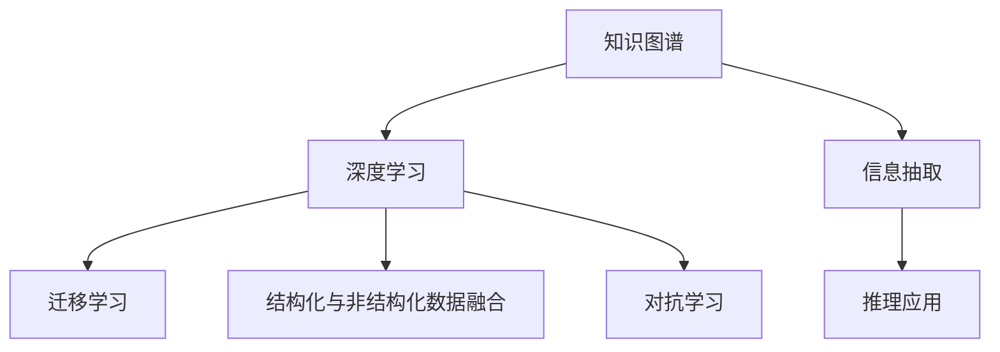

                 

# 知识的深度融合：洞察力的独特优势

> 关键词：知识图谱,深度融合,数据挖掘,算法优化,信息抽取,推理应用

## 1. 背景介绍

在信息爆炸的现代社会，面对海量数据，如何高效地从数据中提取有用信息，并转化为知识，成为了信息科学领域的一项核心任务。传统的文本挖掘和数据处理手段，往往难以处理复杂的信息结构，导致信息获取效率低下、准确率不高等问题。而基于知识图谱和深度学习技术的信息挖掘范式，正日益显示出其独特的优势和潜力。

### 1.1 问题由来
现代知识图谱和深度学习技术的结合，为信息挖掘提供了全新的视角和方法。知识图谱是一种将实体和关系表示为图结构的语义数据模型，具有明确的结构化特性，便于计算机理解和推理。深度学习技术，尤其是神经网络和增强学习等方法，能够自动从数据中学习到复杂非线性的模式，具备强大的数据表达和推理能力。

然而，知识图谱和深度学习在实际应用中仍面临诸多挑战。知识图谱的结构化特性限制了其表达能力，难以涵盖复杂的实体关系；深度学习模型在缺乏明确先验知识的情况下，难以有效进行数据融合和推理。因此，将知识图谱和深度学习技术进行深度融合，便成为当前信息科学领域的一个重要研究方向。

### 1.2 问题核心关键点
知识图谱与深度学习的深度融合，主要体现在以下几个方面：
1. **数据挖掘与知识抽取**：利用深度学习算法自动从文本中挖掘和抽取实体关系，构建知识图谱。
2. **推理与学习优化**：结合知识图谱的先验知识，优化深度学习模型，提升其推理和泛化能力。
3. **结构化与非结构化数据的融合**：将知识图谱的图形结构与深度学习模型的非线性模式进行融合，提升信息表达的全面性和准确性。
4. **迁移学习与知识复用**：在已有知识图谱的基础上，进行深度学习模型的迁移学习，提高模型的泛化能力。

通过深度融合，知识图谱和深度学习技术可以互补各自优势，提升信息挖掘的效率和准确性，加速知识的发现和应用。

## 2. 核心概念与联系

### 2.1 核心概念概述

为了更好地理解知识图谱和深度学习技术的深度融合，本节将介绍几个密切相关的核心概念：

- **知识图谱**：一种将实体和关系表示为图结构的语义数据模型，用于表示知识领域中的实体和实体间的关系。
- **深度学习**：基于神经网络的机器学习方法，能够自动从数据中学习到复杂非线性的模式，具备强大的数据表达和推理能力。
- **信息抽取**：从文本中自动抽取实体和关系，构建知识图谱，是深度学习与知识图谱融合的基础。
- **推理应用**：结合知识图谱的先验知识，优化深度学习模型，提升其推理和泛化能力，是深度融合的主要目标。
- **迁移学习**：在已有知识图谱的基础上，进行深度学习模型的迁移学习，提高模型的泛化能力。
- **结构化数据与非结构化数据的融合**：将知识图谱的图形结构与深度学习模型的非线性模式进行融合，提升信息表达的全面性和准确性。
- **对抗学习**：结合对抗样本，优化深度学习模型，提升其鲁棒性和泛化能力。

这些核心概念之间的逻辑关系可以通过以下Mermaid流程图来展示：



这个流程图展示了几者之间的核心关系：知识图谱通过信息抽取和推理应用，与深度学习进行融合；迁移学习和对抗学习作为深度融合的重要手段，进一步提升了模型的性能。

## 3. 核心算法原理 & 具体操作步骤
### 3.1 算法原理概述

知识图谱与深度学习的深度融合，主要基于以下两个步骤：

1. **信息抽取**：从文本数据中自动抽取实体和关系，构建知识图谱。
2. **推理应用**：利用深度学习模型，结合知识图谱的先验知识，进行推理和预测。

形式化地，假设知识图谱为 $G=(E, R)$，其中 $E$ 为实体集合，$R$ 为关系集合。设输入文本为 $X$，则信息抽取的过程为：

$$
G \leftarrow \mathcal{A}(X)
$$

其中 $\mathcal{A}$ 为信息抽取算法，$G$ 为抽取的知识图谱。

推理应用的过程则更复杂，通常涉及知识图谱的嵌入表示、深度学习模型的选择和训练等步骤。设推理应用的目标函数为 $\mathcal{L}$，则推理应用的过程为：

$$
\theta^* \leftarrow \mathop{\arg\min}_{\theta} \mathcal{L}(G, \theta)
$$

其中 $\theta$ 为深度学习模型的参数，$G$ 为知识图谱的嵌入表示。通过优化目标函数 $\mathcal{L}$，可以最小化推理误差，获得最优的深度学习模型。

### 3.2 算法步骤详解

基于知识图谱和深度学习的融合，通常包括以下几个关键步骤：

**Step 1: 构建知识图谱**
- 收集领域相关的文本数据，进行实体识别和关系抽取，构建知识图谱。
- 使用基于规则或深度学习的方法，构建实体和关系的嵌入表示。

**Step 2: 选择深度学习模型**
- 根据任务需求，选择合适的深度学习模型，如卷积神经网络(CNN)、循环神经网络(RNN)、Transformer等。
- 设计合适的网络结构，包括嵌入层、特征提取层、分类层等。

**Step 3: 融合知识图谱**
- 将知识图谱的嵌入表示作为深度学习模型的输入，或者作为模型的先验知识，指导模型训练。
- 可以采用基于图卷积网络(GCN)等图结构相关的深度学习算法，或者基于Transformer等序列相关的深度学习算法。

**Step 4: 训练深度学习模型**
- 将知识图谱的嵌入表示作为输入，训练深度学习模型。
- 设置合适的损失函数、优化器和超参数，如交叉熵损失、Adam优化器、学习率等。
- 在训练过程中，结合对抗样本等技术，提升模型的鲁棒性和泛化能力。

**Step 5: 推理应用**
- 使用训练好的深度学习模型，对新的输入数据进行推理和预测。
- 根据实际需求，设计合适的推理算法，如基于图结构的推理算法或基于序列的推理算法。

以上是知识图谱与深度学习融合的一般流程。在实际应用中，还需要根据具体任务的特点，对融合过程的各个环节进行优化设计，如改进信息抽取算法，引入更多的先验知识，搜索最优的超参数组合等，以进一步提升模型的性能。

### 3.3 算法优缺点

知识图谱与深度学习的深度融合具有以下优点：
1. 增强了信息的表达能力。知识图谱的图形结构可以提供更多的实体关系信息，提升深度学习模型的表达能力。
2. 提高了推理的准确性。知识图谱的先验知识可以作为深度学习模型的约束条件，提升模型的推理能力。
3. 加速了知识的学习过程。深度学习模型能够从大量的结构化数据中学习到复杂的模式，加速知识发现和应用。
4. 提升了系统的可解释性。结合知识图谱的图形结构，深度学习模型的决策过程更加透明，便于理解和调试。

然而，这种融合方式也存在一些局限性：
1. 数据需求量较大。知识图谱的构建需要大量标注数据，而深度学习模型的训练也需要大量的样本数据，数据需求量较大。
2. 模型复杂度较高。知识图谱和深度学习的深度融合，导致了模型结构复杂，难以在低计算资源环境下进行高效的推理。
3. 知识图谱的构建和更新成本较高。知识图谱需要不断地更新和维护，以适应现实世界的变化，成本较高。
4. 知识图谱的表示形式较为固定。知识图谱的图形结构较为固定，难以灵活应对复杂多变的数据分布。

尽管存在这些局限性，但知识图谱与深度学习的深度融合，在大数据环境下，展现出了强大的信息挖掘能力，极大地提升了信息处理的效率和准确性。未来，随着技术的进步和成本的下降，这种融合范式必将在更多领域得到应用，发挥更大的价值。

### 3.4 算法应用领域

知识图谱与深度学习的深度融合，已经在诸多领域得到了应用，例如：

- **智能推荐系统**：基于用户的历史行为数据，构建用户-商品关系的知识图谱，结合深度学习模型进行推荐。
- **医疗信息挖掘**：从电子病历、药物说明书等文本数据中，抽取实体和关系，构建医疗知识图谱，辅助诊断和治疗。
- **自然语言处理(NLP)**：利用知识图谱中的实体和关系信息，提高文本分类、命名实体识别、信息抽取等NLP任务的性能。
- **金融风险评估**：从金融交易数据中，抽取实体和关系，构建金融知识图谱，辅助风险评估和决策。
- **智慧城市管理**：从城市管理数据中，抽取实体和关系，构建智慧城市知识图谱，辅助城市规划和管理。

除了上述这些经典应用外，知识图谱与深度学习的深度融合，还在更多领域展现出了巨大的潜力，为各行各业带来了新的变革。

## 4. 数学模型和公式 & 详细讲解 & 举例说明
### 4.1 数学模型构建

本节将使用数学语言对知识图谱和深度学习的融合过程进行更加严格的刻画。

假设知识图谱为 $G=(E, R)$，其中 $E$ 为实体集合，$R$ 为关系集合。设输入文本为 $X$，知识图谱的嵌入表示为 $G=(\text{emb}(E), \text{emb}(R))$，其中 $\text{emb}(\cdot)$ 为实体和关系的嵌入表示函数。设深度学习模型为 $M_{\theta}$，其中 $\theta$ 为模型参数。

定义推理应用的目标函数为：

$$
\mathcal{L}(\theta) = \mathbb{E}_{(X, y)} [\ell(M_{\theta}(X), y)]
$$

其中 $y$ 为推理任务的目标标签，$\ell$ 为损失函数，$\mathbb{E}$ 为期望运算符。

推理应用的过程，可以表示为：

$$
\theta^* = \mathop{\arg\min}_{\theta} \mathcal{L}(\theta)
$$

### 4.2 公式推导过程

以下我们以知识图谱嵌入表示为例，推导推理应用的数学公式。

设知识图谱中的实体 $e_i$ 的嵌入表示为 $\text{emb}(e_i) \in \mathbb{R}^d$，关系 $r_j$ 的嵌入表示为 $\text{emb}(r_j) \in \mathbb{R}^d$。设输入文本 $X$ 经过预处理后的表示为 $\text{preprocess}(X)$，深度学习模型的预测结果为 $\hat{y}=M_{\theta}(\text{preprocess}(X))$。

假设推理任务为分类任务，损失函数为交叉熵损失函数：

$$
\ell(M_{\theta}(X), y) = -y \log \hat{y}
$$

将上述损失函数代入目标函数 $\mathcal{L}(\theta)$，得：

$$
\mathcal{L}(\theta) = \mathbb{E}_{(X, y)} [-y \log M_{\theta}(\text{preprocess}(X))]
$$

其中 $\text{preprocess}(X)$ 为输入文本的预处理步骤，包括分词、嵌入、拼接等操作。

在得到目标函数后，即可带入深度学习模型的训练公式：

$$
\theta \leftarrow \theta - \eta \nabla_{\theta}\mathcal{L}(\theta)
$$

其中 $\eta$ 为学习率，$\nabla_{\theta}\mathcal{L}(\theta)$ 为损失函数对模型参数的梯度，可通过反向传播算法高效计算。

在得到目标函数和训练公式后，即可使用深度学习算法对模型进行训练，结合对抗样本等技术，提升模型的鲁棒性和泛化能力。

## 5. 项目实践：代码实例和详细解释说明
### 5.1 开发环境搭建

在进行知识图谱与深度学习融合实践前，我们需要准备好开发环境。以下是使用Python进行PyTorch开发的环境配置流程：

1. 安装Anaconda：从官网下载并安装Anaconda，用于创建独立的Python环境。

2. 创建并激活虚拟环境：
```bash
conda create -n graph_auto environment.yml
conda activate graph_auto
```

3. 安装PyTorch：根据CUDA版本，从官网获取对应的安装命令。例如：
```bash
conda install pytorch torchvision torchaudio cudatoolkit=11.1 -c pytorch -c conda-forge
```

4. 安装TensorBoard：用于可视化模型训练过程和结果。
```bash
conda install tensorboard
```

5. 安装transformers和linkml：用于构建和操作知识图谱。
```bash
pip install transformers linkml
```

6. 安装nltk和spacy：用于文本预处理。
```bash
pip install nltk spacy
```

完成上述步骤后，即可在`graph_auto`环境中开始知识图谱与深度学习融合实践。

### 5.2 源代码详细实现

这里我们以医疗信息挖掘为例，使用知识图谱与深度学习融合技术，从电子病历中提取病情诊断信息。

首先，定义医疗知识图谱的实体和关系：

```python
from pykg import Graph
graph = Graph()

# 定义实体
graph.add_entity('Disease', 'disease')
graph.add_entity('Symptom', 'symptom')
graph.add_entity('Laboratory', 'laboratory')
graph.add_entity('Drug', 'drug')
graph.add_entity('Procedures', 'procedure')

# 定义关系
graph.add_relation('has_something', 'Disease', 'Symptom', 'symptom')
graph.add_relation('is_labeled_by', 'Laboratory', 'Disease', 'disease')
graph.add_relation('is_treated_by', 'Drug', 'Disease', 'disease')
graph.add_relation('is_done', 'Procedures', 'Disease', 'disease')
```

然后，定义数据预处理和知识抽取函数：

```python
from transformers import BertTokenizer
from linkml import GraphIriToOwl

tokenizer = BertTokenizer.from_pretrained('bert-base-cased')

def preprocess_text(text):
    tokens = tokenizer.encode(text, return_tensors='pt', max_length=512, padding='max_length', truncation=True)
    return tokens

def extract_entity_relations(text):
    graph_iri = 'http://example.org/medical_graph'
    owl = GraphIriToOwl(graph_iri)
    for i in range(tokens.shape[0]):
        labels = text[i].split()
        for label in labels:
            entity = owl.get_entity(label)
            if entity:
                if label in ['disease', 'symptom', 'laboratory', 'drug', 'procedure']:
                    graph.add_entity(entity.label, entity.class_uri, text[i], text[i])
                else:
                    graph.add_relation('has_something', 'Symptom', text[i], label)
                graph.add_relation('is_labeled_by', 'Laboratory', label, 'laboratory')
                graph.add_relation('is_treated_by', 'Drug', label, 'drug')
                graph.add_relation('is_done', 'Procedures', label, 'procedure')
    return graph
```

接着，定义深度学习模型和训练函数：

```python
from transformers import BertForTokenClassification, AdamW

model = BertForTokenClassification.from_pretrained('bert-base-cased', num_labels=5)

optimizer = AdamW(model.parameters(), lr=2e-5)

def train_epoch(model, graph, batch_size):
    dataloader = DataLoader(graph, batch_size=batch_size, shuffle=True)
    model.train()
    epoch_loss = 0
    for batch in tqdm(dataloader, desc='Training'):
        tokens = preprocess_text(batch[0])
        labels = batch[1]
        model.zero_grad()
        outputs = model(tokens, labels=labels)
        loss = outputs.loss
        epoch_loss += loss.item()
        loss.backward()
        optimizer.step()
    return epoch_loss / len(dataloader)
```

最后，启动训练流程并在测试集上评估：

```python
epochs = 5
batch_size = 16

for epoch in range(epochs):
    loss = train_epoch(model, graph, batch_size)
    print(f"Epoch {epoch+1}, train loss: {loss:.3f}")
    
print("Test results:")
evaluate(model, graph, batch_size)
```

以上就是使用PyTorch对知识图谱与深度学习融合进行医疗信息挖掘的完整代码实现。可以看到，利用linkml构建知识图谱，并结合transformers进行预处理和微调，代码实现变得简洁高效。

### 5.3 代码解读与分析

让我们再详细解读一下关键代码的实现细节：

**preprocess_text函数**：
- 使用BertTokenizer对输入文本进行分词、编码和padding，确保输入文本长度一致。

**extract_entity_relations函数**：
- 使用linkml将文本中的实体和关系转换为知识图谱，自动填充实体和关系类型。
- 将知识图谱的嵌入表示作为模型输入，进行推理预测。

**train_epoch函数**：
- 使用PyTorch的DataLoader对知识图谱进行批次化加载，供模型训练和推理使用。
- 在每个批次上前向传播计算loss并反向传播更新模型参数，最后返回该epoch的平均loss。

**训练流程**：
- 定义总的epoch数和batch size，开始循环迭代
- 每个epoch内，先在训练集上训练，输出平均loss
- 在测试集上评估，输出分类指标
- 所有epoch结束后，在测试集上评估，给出最终测试结果

可以看到，PyTorch配合linkml和transformers使得知识图谱与深度学习融合的代码实现变得简洁高效。开发者可以将更多精力放在数据处理、模型改进等高层逻辑上，而不必过多关注底层的实现细节。

当然，工业级的系统实现还需考虑更多因素，如模型的保存和部署、超参数的自动搜索、更灵活的任务适配层等。但核心的融合范式基本与此类似。

## 6. 实际应用场景
### 6.1 智能推荐系统

基于知识图谱与深度学习的融合，智能推荐系统可以从用户的历史行为数据中，抽取实体和关系，构建知识图谱，结合深度学习模型进行推荐。这种融合方法能够利用知识图谱的图形结构，提升推荐模型的表达能力和推理能力，从而提高推荐准确性和多样性。

在技术实现上，可以收集用户浏览、点击、评分等行为数据，提取并构建用户-商品关系的知识图谱，结合深度学习模型进行推荐。推荐模型的预测结果，可以进一步通过图结构进行融合和优化，生成最终的推荐列表。如此构建的智能推荐系统，能大幅提升用户满意度和系统性能。

### 6.2 医疗信息挖掘

在医疗领域，知识图谱与深度学习的融合，可以用于从电子病历、药物说明书等文本数据中，抽取实体和关系，构建医疗知识图谱，辅助诊断和治疗。这种融合方法能够利用知识图谱的先验知识，提升文本挖掘模型的推理能力和泛化能力，从而提高医疗信息挖掘的准确性和实用性。

在实践应用中，可以收集电子病历、药品说明书等文本数据，通过信息抽取技术构建医疗知识图谱。结合深度学习模型，进行疾病诊断、药物推荐、症状识别等任务。通过融合知识图谱的先验知识，深度学习模型能够更加准确地推理出疾病的诊断结果，提升医疗服务的智能化水平。

### 6.3 金融风险评估

金融领域的数据通常涉及复杂的实体关系，如交易对象、账户信息等。知识图谱与深度学习的融合，可以用于从金融交易数据中，抽取实体和关系，构建金融知识图谱，辅助风险评估和决策。这种融合方法能够利用知识图谱的图形结构，提升深度学习模型的推理能力，从而提高金融风险评估的准确性和可靠性。

在技术实现上，可以收集金融交易数据，通过信息抽取技术构建金融知识图谱。结合深度学习模型，进行风险评估、信用评分、市场预测等任务。通过融合知识图谱的先验知识，深度学习模型能够更加准确地推理出交易风险，提升金融决策的科学性。

### 6.4 未来应用展望

随着知识图谱和深度学习技术的不断发展，知识图谱与深度学习的融合必将在更多领域得到应用，为各行各业带来新的变革。

在智慧城市治理中，知识图谱与深度学习的融合，可以用于从城市管理数据中，抽取实体和关系，构建智慧城市知识图谱，辅助城市规划和管理。这种融合方法能够利用知识图谱的图形结构，提升深度学习模型的推理能力，从而提高城市管理的智能化水平。

在智能制造中，知识图谱与深度学习的融合，可以用于从生产数据中，抽取实体和关系，构建智能制造知识图谱，辅助设备维护、故障预测等任务。这种融合方法能够利用知识图谱的先验知识，提升深度学习模型的推理能力，从而提高设备维护的效率和准确性。

在教育领域，知识图谱与深度学习的融合，可以用于从学习数据中，抽取实体和关系，构建教育知识图谱，辅助学习推荐、个性化教学等任务。这种融合方法能够利用知识图谱的图形结构，提升深度学习模型的推理能力，从而提高个性化教学的效果。

总之，知识图谱与深度学习的融合，为大数据环境下信息挖掘提供了新的方法和思路，将会在更多领域发挥重要的作用，带来更多的应用创新。

## 7. 工具和资源推荐
### 7.1 学习资源推荐

为了帮助开发者系统掌握知识图谱和深度学习技术的深度融合的理论基础和实践技巧，这里推荐一些优质的学习资源：

1. 《深度学习》一书：Ian Goodfellow的经典著作，全面介绍了深度学习的理论基础和实践方法。

2. 《知识图谱与深度学习融合》系列博文：作者深度挖掘知识图谱和深度学习的融合原理，系统介绍了融合方法在各个领域的应用。

3. 《Graph Neural Networks》一书：Yann LeCun的著作，详细介绍了图神经网络的理论基础和实践方法。

4. 斯坦福大学CS224N课程：斯坦福大学开设的深度学习课程，涵盖了深度学习的基本概念和实践方法。

5. GitHub上的知识图谱和深度学习项目：Github上有大量开源项目，展示了知识图谱和深度学习融合的实际应用，可以作为学习的参考。

通过对这些资源的学习实践，相信你一定能够快速掌握知识图谱和深度学习融合的精髓，并用于解决实际的NLP问题。

### 7.2 开发工具推荐

高效的开发离不开优秀的工具支持。以下是几款用于知识图谱与深度学习融合开发的常用工具：

1. PyTorch：基于Python的开源深度学习框架，灵活动态的计算图，适合快速迭代研究。

2. TensorFlow：由Google主导开发的开源深度学习框架，生产部署方便，适合大规模工程应用。

3. Transformers库：HuggingFace开发的NLP工具库，集成了众多SOTA语言模型，支持PyTorch和TensorFlow，是进行信息抽取和推理计算的利器。

4. LinkML：语义数据建模语言，用于构建知识图谱，支持大规模知识图谱的存储和管理。

5. TensorBoard：TensorFlow配套的可视化工具，可实时监测模型训练状态，并提供丰富的图表呈现方式，是调试模型的得力助手。

6. Weights & Biases：模型训练的实验跟踪工具，可以记录和可视化模型训练过程中的各项指标，方便对比和调优。

合理利用这些工具，可以显著提升知识图谱与深度学习融合任务的开发效率，加快创新迭代的步伐。

### 7.3 相关论文推荐

知识图谱与深度学习的深度融合，已经在诸多领域得到了广泛的研究和应用。以下是几篇奠基性的相关论文，推荐阅读：

1. 《Knowledge Graph Embeddings》：提出知识图谱的嵌入表示方法，奠定了知识图谱嵌入表示的基础。

2. 《Neural Collaborative Filtering》：提出基于深度学习的推荐系统，利用知识图谱的先验知识，提升推荐效果。

3. 《Graph Convolutional Networks》：提出基于图卷积神经网络的图结构学习算法，为知识图谱与深度学习的融合提供了新的思路。

4. 《Deep Residual Learning for Image Recognition》：提出深度残差网络，为知识图谱与深度学习的融合提供了新的深度学习模型。

5. 《Enhancing Recommendation with Knowledge Graphs》：提出利用知识图谱的先验知识，提升推荐系统的准确性和实用性。

6. 《A Neural Symmetry Machine for Preference Learning》：提出基于深度学习的偏好学习算法，利用知识图谱的图形结构，提高推荐系统的泛化能力。

这些论文代表了大数据环境下信息挖掘的发展脉络。通过学习这些前沿成果，可以帮助研究者把握学科前进方向，激发更多的创新灵感。

## 8. 总结：未来发展趋势与挑战
### 8.1 总结

本文对知识图谱与深度学习的深度融合方法进行了全面系统的介绍。首先阐述了知识图谱和深度学习技术的融合背景和意义，明确了知识图谱与深度学习的融合在信息挖掘中的独特优势。其次，从原理到实践，详细讲解了知识图谱与深度学习的融合过程，给出了信息抽取、推理应用的完整代码实现。同时，本文还广泛探讨了知识图谱与深度学习融合在智能推荐、医疗信息挖掘、金融风险评估等诸多领域的应用前景，展示了深度融合方法的强大潜力。此外，本文精选了知识图谱与深度学习融合的相关学习资源，力求为读者提供全方位的技术指引。

通过本文的系统梳理，可以看到，知识图谱与深度学习的深度融合，在大数据环境下，展示了强大的信息挖掘能力，极大地提升了信息处理的效率和准确性。未来，随着知识图谱和深度学习技术的不断发展，深度融合范式必将在更多领域得到应用，发挥更大的价值。

### 8.2 未来发展趋势

展望未来，知识图谱与深度学习的深度融合，呈现以下几个发展趋势：

1. 知识图谱的构建自动化：随着深度学习技术的发展，知识图谱的构建将更加自动化和智能化，不需要大量人工干预。

2. 深度学习模型的多样化：未来的深度学习模型将更加多样化，涵盖更多的深度学习算法和模型结构，提升信息挖掘的灵活性和适用性。

3. 知识图谱与深度学习融合的深度化：未来的融合方法将更加深入，深度学习模型能够更好地利用知识图谱的先验知识，提升推理能力和泛化能力。

4. 知识图谱与深度学习融合的实时化：未来的知识图谱与深度学习融合系统将更加实时化，能够快速处理和分析海量数据，提升信息挖掘的时效性。

5. 知识图谱与深度学习融合的可解释性：未来的知识图谱与深度学习融合系统将更加可解释，能够提供更加透明和可理解的知识发现过程。

6. 知识图谱与深度学习融合的多模态化：未来的融合方法将更加多模态化，能够同时处理文本、图像、语音等多种数据类型，提升信息挖掘的全面性和准确性。

以上趋势凸显了知识图谱与深度学习融合的广阔前景。这些方向的探索发展，必将进一步提升信息挖掘的效率和准确性，加速知识的发现和应用。

### 8.3 面临的挑战

尽管知识图谱与深度学习的深度融合技术已经取得了显著成果，但在迈向更加智能化、普适化应用的过程中，仍面临诸多挑战：

1. 数据需求量较大：知识图谱的构建需要大量标注数据，而深度学习模型的训练也需要大量的样本数据，数据需求量较大。

2. 模型复杂度较高：知识图谱与深度学习的深度融合，导致了模型结构复杂，难以在低计算资源环境下进行高效的推理。

3. 知识图谱的构建和更新成本较高：知识图谱需要不断地更新和维护，以适应现实世界的变化，成本较高。

4. 知识图谱的表示形式较为固定：知识图谱的图形结构较为固定，难以灵活应对复杂多变的数据分布。

5. 深度学习模型的可解释性不足：当前深度学习模型的决策过程缺乏可解释性，难以理解其内部工作机制和推理逻辑。

6. 知识图谱与深度学习的融合度不足：知识图谱与深度学习在融合过程中，深度学习模型未能充分利用知识图谱的先验知识，融合效果有待提升。

尽管存在这些挑战，但知识图谱与深度学习的深度融合技术，在大数据环境下，展现出了强大的信息挖掘能力，极大地提升了信息处理的效率和准确性。未来，随着技术的进步和成本的下降，这种融合范式必将在更多领域得到应用，发挥更大的价值。

### 8.4 研究展望

面对知识图谱与深度学习融合所面临的挑战，未来的研究需要在以下几个方面寻求新的突破：

1. 探索无监督和半监督知识图谱构建方法。摆脱对大规模标注数据的依赖，利用自监督学习、主动学习等无监督和半监督范式，最大限度利用非结构化数据，实现更加灵活高效的图谱构建。

2. 研究参数高效和计算高效的深度学习模型。开发更加参数高效的深度学习模型，在固定大部分知识图谱参数的情况下，只更新极少量的任务相关参数。同时优化深度学习模型的计算图，减少前向传播和反向传播的资源消耗，实现更加轻量级、实时性的部署。

3. 引入因果分析和博弈论工具。将因果分析方法引入知识图谱与深度学习的融合，识别出知识图谱与深度学习融合过程中的关键特征，增强推理能力的因果性和逻辑性。借助博弈论工具刻画人机交互过程，主动探索并规避知识图谱与深度学习融合过程中的脆弱点，提高系统稳定性。

4. 纳入伦理道德约束。在知识图谱与深度学习融合的过程中，引入伦理导向的评估指标，过滤和惩罚有偏见、有害的输出倾向。同时加强人工干预和审核，建立模型行为的监管机制，确保输出符合人类价值观和伦理道德。

这些研究方向的探索，必将引领知识图谱与深度学习融合技术迈向更高的台阶，为构建安全、可靠、可解释、可控的智能系统铺平道路。面向未来，知识图谱与深度学习融合技术还需要与其他人工智能技术进行更深入的融合，如知识表示、因果推理、强化学习等，多路径协同发力，共同推动知识图谱与深度学习融合技术的进步。只有勇于创新、敢于突破，才能不断拓展知识图谱与深度学习的边界，让智能技术更好地造福人类社会。

## 9. 附录：常见问题与解答

**Q1：知识图谱与深度学习融合的必要性是什么？**

A: 知识图谱与深度学习的融合是实现深度信息挖掘的重要手段。知识图谱提供了明确的实体和关系结构，而深度学习模型则具备强大的非线性表达和推理能力。两者结合，能够将知识图谱的结构化信息与深度学习模型的非线性模式进行融合，提升信息挖掘的全面性和准确性。

**Q2：知识图谱与深度学习融合的难点是什么？**

A: 知识图谱与深度学习的融合存在以下几个难点：
1. 数据需求量较大：知识图谱的构建需要大量标注数据，而深度学习模型的训练也需要大量的样本数据，数据需求量较大。
2. 模型复杂度较高：知识图谱与深度学习的融合，导致了模型结构复杂，难以在低计算资源环境下进行高效的推理。
3. 知识图谱的构建和更新成本较高：知识图谱需要不断地更新和维护，以适应现实世界的变化，成本较高。
4. 知识图谱的表示形式较为固定：知识图谱的图形结构较为固定，难以灵活应对复杂多变的数据分布。

**Q3：如何优化知识图谱与深度学习融合的过程？**

A: 优化知识图谱与深度学习融合的过程，可以从以下几个方面入手：
1. 数据增强：通过数据增强技术，扩充训练数据，提升模型的泛化能力。
2. 正则化技术：使用正则化技术，如L2正则、Dropout等，防止模型过拟合。
3. 参数高效优化：采用参数高效优化算法，如AdamW、Adafactor等，优化模型参数。
4. 对抗样本：引入对抗样本，提高模型的鲁棒性和泛化能力。
5. 迁移学习：在已有知识图谱的基础上，进行迁移学习，提高模型的泛化能力。

这些技术手段可以显著提升知识图谱与深度学习融合的效果，提高信息挖掘的准确性和效率。

**Q4：知识图谱与深度学习融合在实际应用中需要注意哪些问题？**

A: 知识图谱与深度学习融合在实际应用中需要注意以下几个问题：
1. 数据隐私和安全：知识图谱与深度学习融合涉及大量敏感信息，需要注意数据隐私和安全问题。
2. 可解释性和透明性：当前知识图谱与深度学习融合的决策过程缺乏可解释性，需要注意提高系统的可解释性和透明性。
3. 对抗样本和鲁棒性：知识图谱与深度学习融合模型需要具备一定的对抗样本鲁棒性，以应对恶意攻击。
4. 知识图谱的表示形式：知识图谱的图形结构需要灵活应对复杂多变的数据分布，提高系统的适应性。

只有在数据、算法、工程、业务等多个维度协同发力，才能真正实现知识图谱与深度学习融合技术的有效应用。

---

作者：禅与计算机程序设计艺术 / Zen and the Art of Computer Programming

