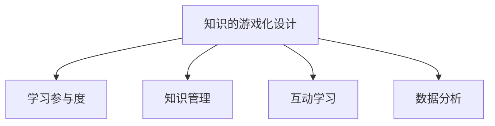

                 

# 知识的游戏化设计：提高学习参与度的策略

> 关键词：游戏化设计, 学习参与度, 知识管理, 互动学习, 数据分析, 教育技术

## 1. 背景介绍

在信息爆炸的时代，知识学习与传播面临着前所未有的挑战。传统课堂教育模式已无法满足日益增长的知识获取和应用需求。在此背景下，将知识学习与游戏设计结合，探索知识的游戏化设计（Gamified Learning Design），成为了提高学习参与度，激发学习兴趣的热门话题。本博客将系统介绍知识的游戏化设计原理，提供实用的操作步骤，并深入分析其优缺点，展望未来的发展趋势。

## 2. 核心概念与联系

### 2.1 核心概念概述

知识的游戏化设计是一种将学习过程融入游戏元素的创新教学方法，通过引入任务挑战、角色扮演、反馈系统等机制，激发学生的内在动机，提高学习参与度和效果。核心概念包括：

- **游戏化设计**：结合游戏机制，如积分、排名、奖励等，构建学习激励体系。
- **学习参与度**：描述学生在知识学习过程中的投入与互动程度。
- **知识管理**：通过有效的学习策略和工具，帮助学生更高效地掌握和应用知识。
- **互动学习**：利用实时互动和协作，增强学生间的沟通与合作。
- **数据分析**：借助学习平台提供的数据统计与分析，实时反馈学习进度与效果。

通过以下Mermaid流程图，可以更清晰地理解这些概念之间的逻辑关系：



这个流程图展示了知识游戏化设计的核心概念及其之间的关联。通过有效的游戏化设计，能够提升学生的学习参与度，促进知识的有效管理，增强互动学习的体验，并利用数据分析优化学习效果。

## 3. 核心算法原理 & 具体操作步骤

### 3.1 算法原理概述

知识的游戏化设计主要通过以下几种机制来提高学生的学习参与度：

- **任务挑战**：通过设计具有挑战性和目标导向的任务，激发学生的好胜心和成就感。
- **角色扮演**：赋予学生特定的角色，增强其对任务的认同感和责任感。
- **即时反馈**：通过及时的正面或负面反馈，引导学生调整学习策略和行为。
- **协作学习**：鼓励学生间合作完成任务，培养团队精神和沟通技巧。

### 3.2 算法步骤详解

知识的游戏化设计可以分为以下五个步骤：

1. **需求分析**：
   - 明确目标学生的特征与学习需求。
   - 确定课程的目标与核心知识点。
   - 分析学生的学习偏好与动机。

2. **游戏化要素设计**：
   - 设计任务与挑战，确保其具有吸引力且与学习目标相关。
   - 创建角色和故事背景，增加学习的沉浸感。
   - 规划奖励和积分系统，提供正向激励。

3. **互动学习机制**：
   - 整合讨论区、论坛等协作工具，促进学生间的交流。
   - 利用实时协作工具，如在线白板、团队编辑等，支持共同解决问题。
   - 实施小组合作学习项目，培养学生的团队合作能力。

4. **反馈系统建设**：
   - 建立即时反馈机制，如自动评分、老师评价等，提供及时的反馈。
   - 设计个性化的学习报告，分析学生的学习进展与成效。
   - 引入自适应学习算法，根据学生的表现动态调整学习内容与难度。

5. **评估与优化**：
   - 定期收集学生与教师的反馈，优化游戏化设计。
   - 分析学习数据，识别问题与改进点。
   - 进行持续迭代，提高学习系统的稳定性和用户满意度。

### 3.3 算法优缺点

**优点**：
- 提升学习参与度：游戏化机制激发学生的学习兴趣和参与感。
- 增强互动学习：协作与反馈系统促进学生间的沟通与合作。
- 优化学习路径：通过数据分析和反馈，个性化调整学习内容。
- 强化知识管理：学生可以更系统地管理与利用所学知识。

**缺点**：
- 资源投入大：设计游戏化学习系统需要较多的时间和资源。
- 设计复杂度：需要精心设计才能有效结合教育学和游戏设计原理。
- 学生分化问题：游戏化设计可能加剧学生之间的成绩差距。
- 教师培训要求高：教师需要掌握新的教学方法和技术。

### 3.4 算法应用领域

知识的游戏化设计在多个教育领域中具有广泛应用：

- **基础教育**：小学到高中阶段，利用游戏化设计提升学生的数学、科学、语文等学科学习兴趣。
- **高等教育**：大学课程中融入游戏化元素，增强学生的自主学习与研究能力。
- **职业教育**：通过角色扮演与任务挑战，帮助学生掌握实用技能与工作流程。
- **成人教育**：利用游戏化学习平台，提升成人学习者参与度和完成率。

## 4. 数学模型和公式 & 详细讲解 & 举例说明

### 4.1 数学模型构建

知识的游戏化设计可以构建多种数学模型，如期望效用模型（Expected Utility Model）、强化学习模型（Reinforcement Learning Model）等。以下以期望效用模型为例，介绍其构建过程。

假设学生在学习任务中的效用函数为 $U(s_t)$，其中 $s_t$ 表示在第 $t$ 步的学习状态。学生选择下一个学习行动 $a_t$ 的期望效用为：

$$E[U(s_{t+1})] = \sum_{s_{t+1}} P(s_{t+1}|s_t,a_t)U(s_{t+1})$$

其中 $P(s_{t+1}|s_t,a_t)$ 表示在状态 $s_t$ 下，采取行动 $a_t$ 转移到状态 $s_{t+1}$ 的概率。

### 4.2 公式推导过程

在期望效用模型中，学生选择学习行动的目标是最大化期望效用。通过迭代求解，可以找到最优的学习路径。具体推导过程如下：

设 $\pi^*$ 表示最优策略，则：

$$\pi^* = \arg\max_{\pi} \sum_{t=1}^{\infty} \beta^{t-1} \mathbb{E}[U(s_t)|s_0,\pi]$$

其中 $\beta$ 为折扣因子，通常取值在0到1之间。

通过求解上述优化问题，可以确定最优策略 $\pi^*$，即在每个学习步骤中，学生应采取何种行动以最大化长期效用。

### 4.3 案例分析与讲解

以编程课程为例，设计一个基于Python的代码挑战游戏：

1. **任务挑战**：通过编程解决实际问题，如设计一个简单的网站或者小游戏。
2. **角色扮演**：每个学生扮演不同的角色，如开发者、设计师、测试员等，共同完成项目。
3. **即时反馈**：使用代码自动评分工具，及时评估代码质量并提供改进建议。
4. **互动学习**：学生通过讨论区分享学习心得，互相解答疑惑。

通过上述案例，可以看出，知识的游戏化设计不仅提升了学生的学习参与度，还培养了他们的协作与创新能力。

## 5. 项目实践：代码实例和详细解释说明

### 5.1 开发环境搭建

为了实现知识的游戏化设计，需要搭建一个支持游戏化机制的学习平台。以下是一个基于Python和Web开发框架Django的简单示例：

1. 安装Python和Django。
2. 创建虚拟环境，并安装必要的库，如Django、Flask、SQLite等。
3. 设计数据库模型，创建任务、角色、反馈等表。
4. 搭建Web界面，使用前端框架如Bootstrap或React，增强用户体验。

### 5.2 源代码详细实现

以下是一个基于Django的代码挑战游戏示例：

```python
from django.http import JsonResponse
from .models import Task, Student

def task_detail(request, task_id):
    task = Task.objects.get(id=task_id)
    student = Student.objects.get(user=request.user)
    
    return JsonResponse({
        'task_name': task.name,
        'task_description': task.description,
        'student_role': student.role,
        'student_score': student.score,
    })
```

### 5.3 代码解读与分析

**代码说明**：
- `task_detail` 函数用于展示特定任务的信息，返回JSON格式的数据。
- `Task` 和 `Student` 模型分别代表任务和学生，包含基本信息和积分等属性。
- 用户通过访问 `task_detail` 接口，可以获取当前任务的具体信息。

**运行结果展示**：
```json
{
    "task_name": "Python编程挑战",
    "task_description": "设计一个简单的网站，并测试其功能",
    "student_role": "开发者",
    "student_score": 80
}
```

通过上述代码，可以实时展示学生当前的任务信息和积分情况，为学生提供即时的反馈和激励。

## 6. 实际应用场景

### 6.1 学习兴趣激发

在基础教育中，知识的游戏化设计可以显著激发学生的学习兴趣。例如，通过数学应用游戏，让学生在解决实际问题的同时，掌握数学知识。

### 6.2 提高学习参与度

在大学课程中，通过角色扮演和任务挑战，学生可以更加主动地参与学习过程。例如，利用编程项目，让学生以项目经理、开发人员等角色合作完成任务，增强学习投入感。

### 6.3 强化知识管理

在职业教育中，知识游戏化设计帮助学生更好地管理与利用所学知识。例如，通过设计工作模拟场景，让学生在实际操作中应用所学技能。

### 6.4 未来应用展望

随着技术的进步，知识的游戏化设计将进一步智能化和个性化。未来的发展趋势包括：

- **自适应学习**：利用AI技术，根据学生的学习进度和表现，动态调整学习内容与难度。
- **混合学习**：结合线上与线下教学，提供更加灵活和多样化的学习体验。
- **虚拟现实（VR）和增强现实（AR）**：利用VR和AR技术，创建沉浸式的学习环境，增强学习体验。
- **个性化推荐**：通过数据分析，为学生推荐最适合的学习路径和资源。

## 7. 工具和资源推荐

### 7.1 学习资源推荐

为了帮助开发者掌握知识游戏化设计，以下推荐一些优质资源：

1. **《Gamification by Design》**：介绍游戏化设计的原理与实践，帮助理解如何结合教育学和游戏学。
2. **Coursera上的《Gamification Specialization》**：多门课程，涵盖游戏化设计的基本概念、技术实现与案例分析。
3. **EdTech Industry News**：提供最新的教育技术新闻和趋势，了解知识游戏化设计的最新动态。
4. **Khan Academy**：提供丰富的教育资源和工具，支持各种知识游戏化设计实践。

### 7.2 开发工具推荐

知识游戏化设计需要借助各种工具和平台来实现。以下推荐几款常用工具：

1. **Django和Flask**：常用的Web开发框架，支持快速搭建互动学习平台。
2. **Unity和Unreal Engine**：支持创建虚拟现实和增强现实游戏，提供沉浸式学习体验。
3. **Khan Academy**：提供在线学习平台，支持多种互动学习功能。
4. **Google Classroom**：提供在线课堂工具，支持学生和教师互动与协作。

### 7.3 相关论文推荐

以下是几篇重要论文，推荐阅读：

1. **《Gamification in Learning: A Review of the Literature》**：回顾游戏化学习的理论基础与实践案例，提供全面的知识体系。
2. **《Gamification and Learning: A Qualitative and Quantitative Case Study》**：分析多个游戏化学习项目的效果，提供实证数据支持。
3. **《Game-Based Learning: Exploring the Educational Potential of Computer Games》**：探讨游戏化学习对教育的影响，提出未来研究方向。

## 8. 总结：未来发展趋势与挑战

### 8.1 研究成果总结

知识的游戏化设计已经成为提高学习参与度的重要手段。通过引入游戏化机制，能够显著提升学生的学习兴趣和效果。然而，实现有效的知识游戏化设计仍面临诸多挑战，如资源投入大、设计复杂等。

### 8.2 未来发展趋势

未来知识游戏化设计的发展方向包括：

- **自适应学习系统**：利用AI技术，实现个性化学习路径设计。
- **多模态学习**：结合文本、图像、视频等多模态信息，增强学习体验。
- **社区化学习**：构建在线学习社区，促进学生之间的交流与合作。
- **持续学习**：支持终身学习，帮助学生持续提升知识和技能。

### 8.3 面临的挑战

知识游戏化设计在实践中仍需克服以下挑战：

- **技术实现难度**：需要高度融合教育学和游戏设计原理。
- **数据隐私与安全**：收集和分析学生数据时，需确保数据隐私和安全。
- **教师培训要求高**：教师需掌握新的教学方法和技术。
- **学生差异问题**：游戏化设计可能加剧学生之间的成绩差距。

### 8.4 研究展望

知识游戏化设计的研究将围绕以下方向展开：

- **个性化学习路径**：利用数据分析，为每个学生设计最合适的学习路径。
- **智能反馈系统**：实时分析学生表现，提供个性化的反馈与建议。
- **跨学科融合**：将知识游戏化设计与跨学科知识整合，提升学习效果。
- **社会化学习**：促进学生之间的社交与合作，培养团队精神和沟通技巧。

总之，知识的游戏化设计是一个多学科交叉的研究领域，需要教育学家、心理学家、游戏设计师、计算机科学家等多方协作，共同推动其发展。通过不断探索和实践，知识游戏化设计必将为教育带来革命性的变革，为学生的全面发展提供强有力的支持。

## 9. 附录：常见问题与解答

**Q1：如何设计有效的游戏化任务？**

A: 设计有效的游戏化任务需满足以下原则：
- 任务应具有挑战性和趣味性，激发学生的好胜心。
- 任务应与学习目标相关，帮助学生掌握核心知识。
- 任务应具有可扩展性，支持不同难度和层次的挑战。

**Q2：游戏化设计中应如何考虑学生的差异？**

A: 针对学生之间的差异，可采用以下策略：
- 设计多样化任务，满足不同兴趣和能力的学生需求。
- 利用数据分析，识别学生的强项和弱点，进行个性化推荐。
- 建立分层学习机制，确保不同水平的学生都能获得合适的挑战。

**Q3：如何评估知识游戏化设计的有效性？**

A: 评估知识游戏化设计的有效性需考虑以下指标：
- 学习参与度：如任务完成率、学习时间等。
- 知识掌握度：如考试成绩、项目评估等。
- 互动与合作：如讨论区活跃度、团队协作效果等。
- 学生反馈：如满意度调查、课程评价等。

**Q4：知识游戏化设计如何结合教育学原理？**

A: 结合教育学原理，需注意以下方面：
- 明确学习目标，设计有针对性的任务和挑战。
- 考虑认知负荷理论，避免任务过于复杂或单一。
- 运用社会学习理论，通过榜样和模仿促进学习。
- 利用自我决定理论，增强学生的内在动机和自主性。

通过不断优化与实践，知识游戏化设计将为教育带来更多的创新和突破，为学生的学习与成长提供更广阔的平台。

