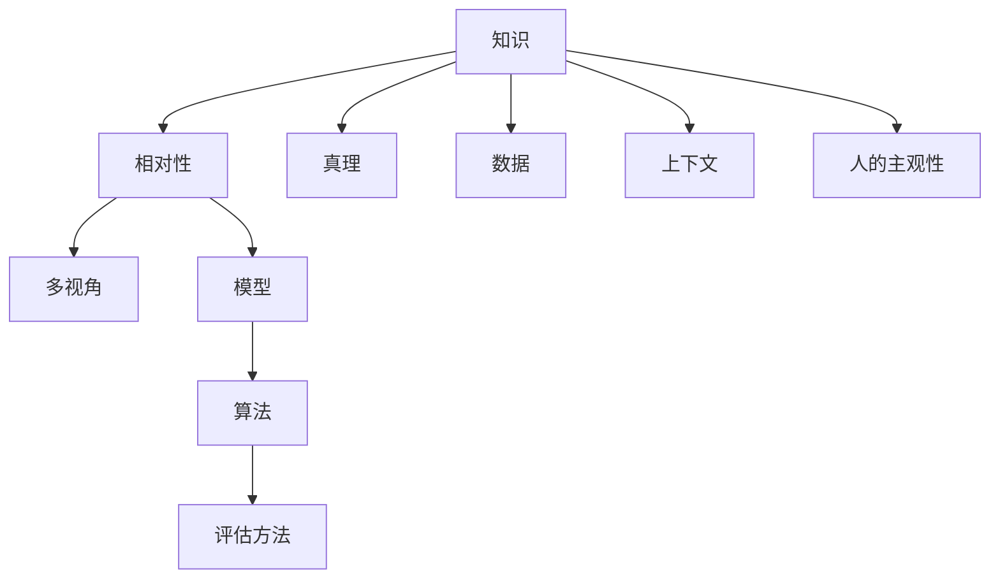

                 

# 知识的相对性：不同视角下的真理

> 关键词：知识相对性,真理多视角,计算机科学,认知科学,人工智能

## 1. 背景介绍

### 1.1 问题由来

在人工智能领域，知识及其相对性是一个永恒且复杂的话题。随着深度学习技术和大规模数据的应用，我们发现，即使同一模型、同一算法，在不同上下文、不同时间、不同人的使用中，表现出的性能和效果可能大相径庭。这在很大程度上体现了知识的多维性和相对性。

这些现象不仅引起了学术界的浓厚兴趣，也促使从业者重新思考如何更科学、更理性地理解和运用知识。在人工智能领域，这一问题尤其显著，因为该领域涉及的算法和模型日益复杂，不同算法之间的对比和选择成为技术创新的重要考量。

### 1.2 问题核心关键点

知识相对性的核心关键点包括：

1. 数据的多样性和分布特性
2. 模型的泛化能力和结构设计
3. 算法的性能评估和对比方法
4. 上下文和环境的影响
5. 人的主观性和偏见

这些问题不仅仅是理论上的探讨，更关系到实际应用中的效果和效果评价。

## 2. 核心概念与联系

### 2.1 核心概念概述

要理解知识的相对性，首先需要明确几个核心概念：

- **知识（Knowledge）**：在人工智能领域，知识通常指代机器通过学习获得的规律、模式和能力，包括但不限于语义理解、图像识别、自然语言处理等。
- **相对性（Relativity）**：指知识在不同的环境和条件下的表现差异，这种差异性来源于数据的分布特性、模型的复杂度、算法的选择以及上下文的影响。
- **真理（Truth）**：真理在哲学和科学中常被理解为符合现实和逻辑的一致性。但在人工智能中，真理更多体现为模型在特定场景下表现出的稳定性和有效性。
- **多视角（Multi-perspective）**：不同视角涉及观察问题、设计模型、评估效果等多个方面。多视角分析有助于全面理解知识的相对性，避免单一视角的偏颇。

这些概念之间的逻辑关系可以通过以下Mermaid流程图来展示：



这个流程图展示了几组概念之间的关联：

1. 知识通过数据获取，并在相对性、真理、多视角等多维角度下被理解和应用。
2. 模型和算法是知识获取和应用的工具，其设计合理性和选择恰当性直接影响知识的表现。
3. 上下文和人的主观性影响知识的有效性和公平性。
4. 评估方法是检验真理的重要手段，通过多视角方法，可以更全面地评估知识的价值。

## 3. 核心算法原理 & 具体操作步骤

### 3.1 算法原理概述

基于知识相对性的算法设计，关键在于通过多样化和可解释性的方法，在不同的环境和条件下，确保知识获取和应用的一致性和公平性。

知识的相对性原理可以总结为以下几点：

1. **数据的多样性**：不同来源、不同格式、不同分布的数据对模型的训练有着不同的影响。
2. **模型的泛化能力**：模型的泛化能力决定了其在新的环境下的表现。
3. **算法的公平性和解释性**：算法的选择和设计需考虑其公平性和可解释性，避免偏见和歧义。
4. **上下文的影响**：上下文的多样性要求模型具备环境适应能力。
5. **人的主观性**：算法的设计和评估需考虑人的主观性，避免偏差和误导。

### 3.2 算法步骤详解

基于知识相对性的算法设计主要分为以下几个步骤：

1. **数据准备**：收集多样化的数据，确保数据的多样性和分布特性。
2. **模型选择**：选择合适的模型和算法，确保模型的泛化能力和公平性。
3. **算法评估**：设计多种评估方法，多视角检验模型的表现和效果。
4. **上下文适应**：在模型设计和评估中考虑上下文的影响，提高模型的环境适应能力。
5. **主观性处理**：在设计算法时，考虑人的主观性，避免偏见和误导。

### 3.3 算法优缺点

基于知识相对性的算法设计具有以下优点：

1. **全面性**：通过多视角评估，可以更全面地理解模型的表现和效果。
2. **公平性**：考虑数据多样性和上下文影响，确保模型在不同环境下的公平性和一致性。
3. **可解释性**：提高算法的可解释性，帮助用户更好地理解模型的决策过程。

但同时也存在一些缺点：

1. **复杂性**：多视角评估增加了设计和实现复杂性。
2. **计算成本**：多视角评估增加了计算成本，特别是在大规模数据集上。
3. **解释难度**：提高可解释性可能降低模型的灵活性和预测精度。

### 3.4 算法应用领域

基于知识相对性的算法设计在多个领域都有广泛的应用，包括但不限于：

- **自然语言处理（NLP）**：不同语言、不同文化背景下的语义理解。
- **计算机视觉（CV）**：不同场景、不同光照条件下的图像识别。
- **智能推荐系统**：不同用户、不同时间点的兴趣分析。
- **医疗健康**：不同患者、不同病情的疾病诊断和治疗方案。

## 4. 数学模型和公式 & 详细讲解 & 举例说明

### 4.1 数学模型构建

基于知识相对性的数学模型构建主要涉及以下要素：

- **数据表示**：将数据转化为机器可处理的形式，如词向量、图像像素矩阵等。
- **模型定义**：定义模型结构和损失函数，如神经网络、卷积神经网络等。
- **算法设计**：选择合适的算法和优化策略，如梯度下降、Adam等。

### 4.2 公式推导过程

以下以神经网络模型为例，展示其基本原理：

假设输入数据为 $x$，模型参数为 $\theta$，输出为 $y$。神经网络模型的损失函数为均方误差损失（Mean Squared Error，MSE），即：

$$
L = \frac{1}{n} \sum_{i=1}^n (y_i - f(x_i, \theta))^2
$$

其中 $f(x_i, \theta)$ 表示输入 $x_i$ 通过模型 $\theta$ 的预测输出。优化目标是使得 $L$ 最小化。

### 4.3 案例分析与讲解

以一个简单的线性回归模型为例：

假设有一个线性回归模型 $f(x, \theta) = \theta_0 + \theta_1 x$，其中 $\theta_0$ 和 $\theta_1$ 为模型的参数，$x$ 为输入特征。已知数据集为 $\{(x_1, y_1), (x_2, y_2), \ldots, (x_n, y_n)\}$，其中 $y_i = \theta_0 + \theta_1 x_i + \epsilon_i$，$\epsilon_i$ 为随机误差。

目标是通过最小化损失函数 $L(\theta) = \frac{1}{n} \sum_{i=1}^n (y_i - \theta_0 - \theta_1 x_i)^2$ 来拟合模型参数 $\theta$。

使用梯度下降算法，求导得：

$$
\frac{\partial L}{\partial \theta_0} = -\frac{2}{n} \sum_{i=1}^n (y_i - \theta_0 - \theta_1 x_i)
$$

$$
\frac{\partial L}{\partial \theta_1} = -\frac{2}{n} \sum_{i=1}^n (y_i - \theta_0 - \theta_1 x_i) x_i
$$

通过迭代更新 $\theta_0$ 和 $\theta_1$，使得损失函数 $L(\theta)$ 最小化，从而获得模型参数。

## 5. 项目实践：代码实例和详细解释说明

### 5.1 开发环境搭建

为了验证上述算法，需要搭建一个开发环境。以下是使用Python进行TensorFlow开发的流程：

1. 安装Anaconda：从官网下载并安装Anaconda，用于创建独立的Python环境。

2. 创建并激活虚拟环境：
```bash
conda create -n tf-env python=3.8 
conda activate tf-env
```

3. 安装TensorFlow：根据CUDA版本，从官网获取对应的安装命令。例如：
```bash
pip install tensorflow-gpu==2.6
```

4. 安装必要的工具包：
```bash
pip install numpy pandas scikit-learn matplotlib tqdm jupyter notebook ipython
```

完成上述步骤后，即可在`tf-env`环境中进行模型开发和实验。

### 5.2 源代码详细实现

下面以一个简单的线性回归模型为例，展示如何使用TensorFlow进行模型训练和评估。

```python
import tensorflow as tf
import numpy as np

# 数据集
x_data = np.array([[1.0, 2.0, 3.0], [4.0, 5.0, 6.0], [7.0, 8.0, 9.0], [10.0, 11.0, 12.0]])
y_data = np.array([[2.0], [4.0], [6.0], [8.0]])

# 定义模型
x = tf.placeholder(tf.float32, shape=[None, 3])
y = tf.placeholder(tf.float32, shape=[None, 1])
W = tf.Variable(tf.random_normal([3, 1]))
b = tf.Variable(tf.zeros([1]))
y_pred = tf.matmul(x, W) + b

# 定义损失函数
loss = tf.reduce_mean(tf.square(y - y_pred))

# 定义优化器
optimizer = tf.train.AdamOptimizer().minimize(loss)

# 训练模型
with tf.Session() as sess:
    sess.run(tf.global_variables_initializer())
    for i in range(1000):
        sess.run(optimizer, feed_dict={x: x_data, y: y_data})
        if i % 100 == 0:
            print("Epoch:", i, "Loss:", sess.run(loss, feed_dict={x: x_data, y: y_data}))
    
    # 评估模型
    y_pred_value = sess.run(y_pred, feed_dict={x: x_data})
    print("Predictions:", y_pred_value)
```

### 5.3 代码解读与分析

让我们详细解读上述代码的关键部分：

**数据准备**：
- 使用NumPy创建输入特征 $x$ 和输出标签 $y$ 的二维数组。

**模型定义**：
- 定义输入占位符 $x$ 和 $y$，模型参数 $W$ 和 $b$。
- 使用矩阵乘法和向量加法计算模型输出 $y_{pred}$。

**损失函数**：
- 定义均方误差损失函数 $loss$。

**优化器**：
- 定义Adam优化器，最小化损失函数。

**模型训练**：
- 在会话中运行优化器，每次迭代更新模型参数。
- 每100次迭代打印一次损失函数值，观察模型训练的收敛情况。

**模型评估**：
- 在会话中运行模型输出 $y_{pred}$，得到预测值。
- 打印预测值，观察模型在训练集上的表现。

## 6. 实际应用场景

### 6.1 智能推荐系统

基于知识相对性的智能推荐系统可以更全面地考虑用户的多样性和上下文信息，从而提供更个性化的推荐结果。

在技术实现上，可以收集用户的历史行为数据，包括浏览记录、购买历史等，并结合上下文信息（如时间、地点、设备等）进行多维度特征工程。在此基础上，选择合适的模型和算法，对用户进行兴趣分析和推荐生成。通过多视角评估，确保模型在不同时间和场景下都能保持一致性和公平性。

### 6.2 医疗健康

基于知识相对性的医疗健康应用可以更全面地考虑患者的病情、病史和心理状态，从而提供更准确和人性化的诊疗方案。

在技术实现上，可以收集患者的历史病历、生理指标和心理评估数据，并结合上下文信息（如季节、天气等）进行特征工程。在此基础上，选择合适的模型和算法，对患者的疾病进行诊断和治疗方案生成。通过多视角评估，确保模型在不同患者和不同病况下都能保持一致性和公平性。

### 6.3 金融风控

基于知识相对性的金融风控系统可以更全面地考虑交易的历史数据和环境因素，从而更准确地评估风险和进行决策。

在技术实现上，可以收集金融交易的历史数据和市场信息，并结合上下文信息（如经济周期、政策变化等）进行特征工程。在此基础上，选择合适的模型和算法，对交易风险进行评估和决策生成。通过多视角评估，确保模型在不同市场环境和不同交易类型下都能保持一致性和公平性。

### 6.4 未来应用展望

随着数据和算法的发展，基于知识相对性的技术将在更多领域得到应用，为人类认知智能的进化带来深远影响。

- **智慧城市**：基于知识相对性的城市管理系统可以更全面地考虑市民的多样性和上下文信息，从而提供更智慧和高效的城市服务。
- **教育领域**：基于知识相对性的教育系统可以更全面地考虑学生的个体差异和上下文信息，从而提供更因材施教的教育方案。
- **农业领域**：基于知识相对性的农业管理系统可以更全面地考虑环境因素和作物生长规律，从而提供更科学和可持续的农业生产方案。

## 7. 工具和资源推荐

### 7.1 学习资源推荐

为了帮助开发者系统掌握知识相对性的理论基础和实践技巧，这里推荐一些优质的学习资源：

1. **《深度学习》课程**：斯坦福大学开设的深度学习课程，深入浅出地介绍了深度学习的基本概念和常用模型。
2. **《人工智能导论》书籍**：全面介绍了人工智能的基本原理和应用，特别是多视角分析和知识相对性的话题。
3. **《自然语言处理综论》书籍**：涵盖了自然语言处理的基本原理和应用，特别是多视角分析和知识相对性的话题。
4. **《机器学习实战》书籍**：结合实际案例，介绍了机器学习的基本原理和实践技巧。
5. **Coursera和Udacity课程**：提供大量高质量的深度学习和人工智能课程，涵盖从基础到前沿的各种主题。

通过对这些资源的学习实践，相信你一定能够快速掌握知识相对性的精髓，并用于解决实际的NLP问题。

### 7.2 开发工具推荐

高效的开发离不开优秀的工具支持。以下是几款用于深度学习和人工智能开发的常用工具：

1. **TensorFlow**：由Google主导开发的深度学习框架，支持分布式计算和模型部署，广泛应用于学术研究和工业应用。
2. **PyTorch**：由Facebook开发的高效深度学习框架，支持动态计算图和GPU加速，广泛应用于研究机构和学术界。
3. **Keras**：基于TensorFlow和Theano的高级神经网络API，支持快速原型设计和模型部署。
4. **MXNet**：由Apache开发的高效深度学习框架，支持多种编程语言和分布式计算，广泛应用于工业应用。
5. **JAX**：由Google开发的基于JIT编译的高效深度学习框架，支持动态计算图和自动微分，广泛应用于研究机构和学术界。

合理利用这些工具，可以显著提升深度学习和人工智能任务的开发效率，加快创新迭代的步伐。

### 7.3 相关论文推荐

知识相对性的研究源于学界的持续研究。以下是几篇奠基性的相关论文，推荐阅读：

1. **《深度学习》书籍**：Yoshua Bengio等人所著，全面介绍了深度学习的基本原理和应用，特别是多视角分析和知识相对性的话题。
2. **《机器学习：理论与算法》书籍**：Tom Mitchell所著，涵盖了机器学习的基本原理和应用，特别是多视角分析和知识相对性的话题。
3. **《自然语言处理综论》书籍**：Jurafsky和Martin所著，涵盖了自然语言处理的基本原理和应用，特别是多视角分析和知识相对性的话题。
4. **《认知科学与人工智能》期刊**：收录了认知科学和人工智能领域的前沿研究，涉及知识相对性、多视角分析等话题。
5. **《AI Magazine》期刊**：收录了人工智能领域的前沿研究，涉及知识相对性、多视角分析等话题。

这些论文代表了大规模学习模型和知识相对性技术的发展脉络。通过学习这些前沿成果，可以帮助研究者把握学科前进方向，激发更多的创新灵感。

## 8. 总结：未来发展趋势与挑战

### 8.1 总结

本文对基于知识相对性的算法设计进行了全面系统的介绍。首先阐述了知识相对性的研究背景和意义，明确了知识相对性在不同领域中的应用价值。其次，从原理到实践，详细讲解了基于知识相对性的算法设计过程，给出了完整的代码实例。同时，本文还探讨了知识相对性在不同领域的应用场景，展示了其在实际应用中的潜力。此外，本文精选了知识相对性的学习资源，力求为读者提供全方位的技术指引。

通过本文的系统梳理，可以看到，基于知识相对性的算法设计正在成为深度学习和人工智能领域的重要范式，极大地拓展了模型的应用边界，催生了更多的落地场景。未来，伴随深度学习技术的不断演进，基于知识相对性的算法设计必将在更广泛的领域发挥重要作用。

### 8.2 未来发展趋势

展望未来，基于知识相对性的算法设计将呈现以下几个发展趋势：

1. **数据驱动的泛化能力**：未来的模型设计将更加注重数据的多样性和泛化能力，确保模型在不同环境和场景下都能保持一致性和公平性。
2. **可解释性和透明度**：未来的模型设计将更加注重可解释性和透明度，帮助用户更好地理解模型的决策过程，增强信任度和可接受性。
3. **多视角融合的模型**：未来的模型设计将更加注重多视角融合，结合符号化知识和专家规则，提升模型的全面性和准确性。
4. **公平性和包容性**：未来的模型设计将更加注重公平性和包容性，避免偏见和歧视，确保模型在不同群体和环境下都能保持一致性和公平性。
5. **自动化和智能化**：未来的模型设计将更加注重自动化和智能化，利用智能算法和大数据技术，实现更高效和精准的模型设计。

以上趋势凸显了基于知识相对性的算法设计的广阔前景。这些方向的探索发展，必将进一步提升深度学习和人工智能系统的性能和应用范围，为人类认知智能的进化带来深远影响。

### 8.3 面临的挑战

尽管基于知识相对性的算法设计已经取得了不少进展，但在迈向更加智能化、普适化应用的过程中，它仍面临诸多挑战：

1. **数据多样性和泛化能力**：不同来源、不同格式、不同分布的数据对模型的训练有着不同的影响，如何处理和融合这些数据，提升模型的泛化能力，是一个重要挑战。
2. **可解释性和透明度**：提高模型的可解释性可能降低模型的灵活性和预测精度，如何在保持模型准确性的同时，增强其可解释性，是一个重要挑战。
3. **公平性和包容性**：避免偏见和歧视，确保模型在不同群体和环境下都能保持一致性和公平性，是一个重要挑战。
4. **资源消耗和计算成本**：多视角评估增加了计算成本，特别是在大规模数据集上，如何降低计算成本，提高模型效率，是一个重要挑战。
5. **自动化和智能化**：利用智能算法和大数据技术，实现更高效和精准的模型设计，是一个重要挑战。

这些挑战需要研究者和从业者不断探索和解决，才能使基于知识相对性的算法设计走向成熟。

### 8.4 研究展望

面向未来，基于知识相对性的算法设计需要在以下几个方面寻求新的突破：

1. **自动化和智能化**：结合自动化和智能化技术，提升模型的设计效率和应用效果。
2. **多视角融合**：结合符号化知识和专家规则，提升模型的全面性和准确性。
3. **公平性和包容性**：避免偏见和歧视，确保模型在不同群体和环境下都能保持一致性和公平性。
4. **资源消耗和计算成本**：降低计算成本，提高模型效率，提升模型的实际应用价值。
5. **可解释性和透明度**：增强模型的可解释性，帮助用户更好地理解模型的决策过程，增强信任度和可接受性。

这些研究方向将引领基于知识相对性的算法设计走向更高的台阶，为构建安全、可靠、可解释、可控的智能系统铺平道路。面向未来，基于知识相对性的算法设计还需要与其他人工智能技术进行更深入的融合，如知识表示、因果推理、强化学习等，多路径协同发力，共同推动自然语言理解和智能交互系统的进步。

## 9. 附录：常见问题与解答

**Q1：知识相对性对模型的影响是什么？**

A: 知识相对性对模型的影响主要体现在以下几个方面：

1. 模型泛化能力：知识相对性要求模型具备良好的泛化能力，能够在不同环境和数据集上保持一致性。
2. 模型公平性：知识相对性要求模型在不同群体和环境下保持公平性，避免偏见和歧视。
3. 模型可解释性：知识相对性要求模型具备良好的可解释性，帮助用户理解模型的决策过程。
4. 模型效率：知识相对性要求模型在保持准确性的同时，具备高效的计算和存储能力。

**Q2：如何提高模型的泛化能力？**

A: 提高模型的泛化能力可以通过以下方法：

1. 数据多样性：收集多样化的数据，确保数据的多样性和分布特性。
2. 模型复杂度：选择合适的模型结构和参数，避免模型过拟合。
3. 正则化技术：使用L2正则、Dropout等正则化技术，防止模型过拟合。
4. 对抗训练：引入对抗样本，提高模型鲁棒性。
5. 多模型集成：训练多个模型，取平均输出，抑制过拟合。

**Q3：如何增强模型的可解释性？**

A: 增强模型的可解释性可以通过以下方法：

1. 模型压缩：减少模型的参数量和结构复杂度，简化模型输出。
2. 特征可视化：通过可视化模型特征，帮助用户理解模型的决策过程。
3. 交互式解释：提供交互式解释界面，让用户可以逐步查看模型的决策过程。
4. 规则约束：结合符号化知识和专家规则，增强模型的可解释性。

**Q4：如何处理模型的公平性问题？**

A: 处理模型的公平性问题可以通过以下方法：

1. 数据公平性：确保训练数据的多样性和公平性，避免数据偏见。
2. 模型公平性：选择合适的算法和优化策略，避免模型偏见。
3. 解释模型：增强模型的可解释性，帮助用户理解模型的决策过程。
4. 用户监督：通过用户反馈和监督，及时调整和优化模型。

**Q5：如何降低模型的计算成本？**

A: 降低模型的计算成本可以通过以下方法：

1. 模型剪枝：减少模型的参数量和结构复杂度，提高计算效率。
2. 量化加速：将浮点模型转为定点模型，压缩存储空间，提高计算效率。
3. 模型并行：利用分布式计算和多核并行，提高模型训练和推理效率。
4. 动态计算图：利用动态计算图技术，减少计算和存储开销。

---

作者：禅与计算机程序设计艺术 / Zen and the Art of Computer Programming

