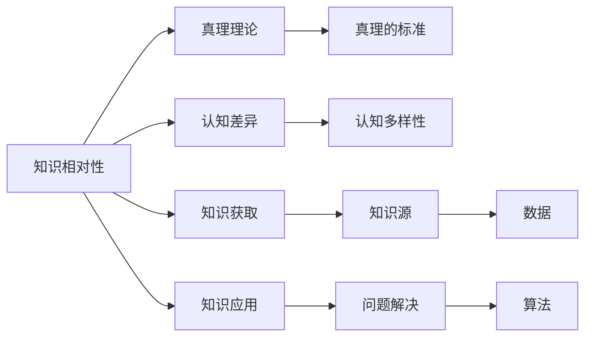

                 

# 知识的相对性：不同视角下的真理

> 关键词：知识相对性,真理,真理理论,认知差异,知识获取,知识应用

## 1. 背景介绍

知识的相对性一直是哲学、心理学、认知科学等领域探讨的重要主题。在当今信息爆炸的时代，知识的相对性也越来越多地影响到我们的日常决策和生活方式。在技术领域，知识的相对性更是无处不在。本文将从计算机程序设计的角度出发，探讨知识相对性在不同技术领域中的体现及其影响，同时提出一些应对策略。

## 2. 核心概念与联系

### 2.1 核心概念概述

为了更好地理解知识相对性在技术领域的应用，本节将介绍几个核心概念：

- **知识相对性（Knowledge Relativity）**：指不同个体、组织或文化对同一问题的不同理解和认知，即对知识的主观性。这种相对性不仅存在于自然科学，也存在于技术领域，不同人的代码风格、架构设计等都反映了知识相对性。

- **真理理论（Theories of Truth）**：在哲学中，真理是对客观事实的准确反映。在技术领域，真理可以理解为对问题解决方案的最优或最佳。真理理论强调知识的绝对性和客观性，但实际应用中，不同个体对同一真理的理解可能存在差异。

- **认知差异（Cognitive Differences）**：指不同个体在认知能力、思维方式、经验背景等方面的差异。这些差异会影响个体对知识的理解和应用，从而反映出知识的相对性。

- **知识获取与应用（Knowledge Acquisition and Application）**：在技术领域，知识获取包括阅读文档、观看教学视频、参与项目实践等。知识应用则是将知识转化为实际能力，解决具体问题。认知差异和知识相对性在这一过程中起着重要作用。

### 2.2 核心概念原理和架构的 Mermaid 流程图



这个流程图展示了知识相对性、真理理论、认知差异、知识获取和知识应用之间的联系：

- 知识相对性通过真理理论、认知差异、知识获取和知识应用，反映在个体对知识的主观理解上。
- 真理理论提供了对知识绝对性的定义，但实际应用中，不同个体对真理的理解可能存在差异。
- 认知差异和知识相对性影响了知识获取的方式和效果。
- 知识获取和应用是知识相对性的直接体现，不同个体在应用同一知识时，可能会产生不同的结果。

## 3. 核心算法原理 & 具体操作步骤

### 3.1 算法原理概述

在技术领域，知识的相对性主要体现在算法和模型的设计和应用上。不同类型的算法和模型，可能对同一问题的解决有不同的理解和实现。因此，选择合适的算法和模型，是应对知识相对性的关键。

### 3.2 算法步骤详解

- **选择算法**：根据问题的性质和数据的特点，选择合适的算法和模型。例如，在图像识别任务中，卷积神经网络（CNN）和循环神经网络（RNN）是常用的算法。但在某些情况下，深度学习模型可能不如简单的传统机器学习算法有效。

- **数据准备**：数据是算法和模型的基础，不同的数据集会对模型的性能产生影响。因此，在准备数据时，需要考虑数据的质量、多样性和代表性。

- **模型训练**：在训练模型时，需要选择合适的超参数，如学习率、批大小、迭代次数等。同时，需要根据数据特点，调整模型的架构和设计。

- **模型评估**：评估模型的性能，如准确率、召回率、F1值等，判断模型是否达到预期效果。

- **模型部署**：将训练好的模型部署到实际应用中，并进行监控和优化。

### 3.3 算法优缺点

- **优点**：算法多样性可以满足不同场景和需求，提高解决问题的灵活性。不同算法和模型之间可以相互补充，形成更加全面的解决方案。

- **缺点**：不同算法和模型之间的选择和调优可能会增加工作量和复杂度。同时，错误的算法选择可能会导致问题解决失败，影响用户体验和系统性能。

### 3.4 算法应用领域

- **自然语言处理（NLP）**：NLP领域中，不同算法和模型（如BERT、GPT、LSTM等）对文本数据的处理方式不同，从而产生不同的应用效果。例如，BERT主要用于文本分类和命名实体识别，而GPT则更适合生成文本和对话系统。

- **计算机视觉（CV）**：在CV领域，不同的算法和模型（如CNN、RNN、GAN等）对图像和视频数据的处理方式不同，从而产生不同的应用效果。例如，CNN用于图像分类和目标检测，RNN用于视频分析和语音识别。

- **推荐系统**：推荐系统中，不同的算法和模型（如协同过滤、基于内容的推荐、深度学习模型等）对用户数据和物品数据的处理方式不同，从而产生不同的推荐效果。

## 4. 数学模型和公式 & 详细讲解 & 举例说明

### 4.1 数学模型构建

在技术领域，数学模型是算法和模型设计的关键。这里以一个简单的推荐系统为例，展示数学模型的构建过程。

假设推荐系统要为用户推荐物品，需要建立一个用户-物品评分矩阵 $R \in \mathbb{R}^{N \times M}$，其中 $N$ 为用户数量，$M$ 为物品数量。用户和物品的评分可以通过如下模型计算：

$$
r_{ij} = \alpha u_i^T v_j + \beta \sigma(x_{ij})
$$

其中，$r_{ij}$ 为用户 $i$ 对物品 $j$ 的评分，$u_i$ 为用户的特征向量，$v_j$ 为物品的特征向量，$\alpha$ 和 $\beta$ 为超参数，$\sigma$ 为激活函数，$x_{ij}$ 为用户和物品的交互特征向量。

### 4.2 公式推导过程

在上述模型中，$r_{ij}$ 表示用户 $i$ 对物品 $j$ 的评分。模型由两个部分组成：用户特征向量的加权和与物品特征向量的加权和。其中，用户特征向量和物品特征向量通过矩阵乘法计算得到。

### 4.3 案例分析与讲解

假设有一个推荐系统，为用户推荐电影。用户特征向量 $u_i$ 包含用户的年龄、性别、职业等信息，物品特征向量 $v_j$ 包含电影的类型、导演、演员等信息。通过上述模型，可以计算出用户对每部电影的评分。例如，用户 $i$ 对电影 $j$ 的评分为 $0.8 \times 0.5 + 0.2 \times 0.7 = 0.61$。

## 5. 项目实践：代码实例和详细解释说明

### 5.1 开发环境搭建

在进行项目实践前，我们需要准备好开发环境。以下是使用Python进行Scikit-learn开发的环境配置流程：

1. 安装Anaconda：从官网下载并安装Anaconda，用于创建独立的Python环境。

2. 创建并激活虚拟环境：
```bash
conda create -n sklearn-env python=3.8 
conda activate sklearn-env
```

3. 安装Scikit-learn：从官网获取安装命令。例如：
```bash
conda install scikit-learn
```

4. 安装必要的工具包：
```bash
pip install numpy pandas scipy matplotlib
```

完成上述步骤后，即可在`sklearn-env`环境中开始项目实践。

### 5.2 源代码详细实现

这里以一个简单的推荐系统为例，展示如何使用Scikit-learn进行代码实现。

```python
from sklearn.feature_extraction.text import TfidfVectorizer
from sklearn.metrics.pairwise import cosine_similarity
from sklearn.decomposition import TruncatedSVD

# 假设我们有以下用户-物品评分数据
user_item_ratings = {
    '用户1': {'电影1': 4.5, '电影2': 3.0, '电影3': 2.5},
    '用户2': {'电影1': 3.0, '电影2': 4.0, '电影3': 3.5},
    '用户3': {'电影1': 5.0, '电影2': 2.5, '电影3': 3.0}
}

# 将所有评分构建成用户-物品评分矩阵
R = [[user_item_ratings['用户1']['电影1'], user_item_ratings['用户2']['电影1'], user_item_ratings['用户3']['电影1']],
     [user_item_ratings['用户1']['电影2'], user_item_ratings['用户2']['电影2'], user_item_ratings['用户3']['电影2']],
     [user_item_ratings['用户1']['电影3'], user_item_ratings['用户2']['电影3'], user_item_ratings['用户3']['电影3']]]

# 使用TF-IDF向量化的方式，将用户和物品的特征向量化
vectorizer = TfidfVectorizer()
user_features = vectorizer.fit_transform(['用户1', '用户2', '用户3'])
item_features = vectorizer.transform(['电影1', '电影2', '电影3'])

# 使用TruncatedSVD进行矩阵分解
svd = TruncatedSVD(n_components=2)
U = svd.fit_transform(user_features)
V = svd.fit_transform(item_features)

# 计算预测评分
pred_ratings = U.dot(V.T).toarray()

# 打印预测评分矩阵
print(pred_ratings)
```

### 5.3 代码解读与分析

让我们再详细解读一下关键代码的实现细节：

**user_item_ratings字典**：
- 存储用户和物品的评分数据。

**R矩阵**：
- 将评分数据转换为用户-物品评分矩阵。

**TF-IDF向量化**：
- 使用TF-IDF算法将用户和物品的特征向量化，以便后续的矩阵分解。

**TruncatedSVD模型**：
- 使用TruncatedSVD模型对用户-物品评分矩阵进行分解，得到用户特征向量和物品特征向量。

**预测评分计算**：
- 计算预测评分，即用户特征向量与物品特征向量的点积。

**打印预测评分矩阵**：
- 输出预测评分矩阵，以便后续分析和应用。

可以看到，Scikit-learn提供了方便的API接口，使得推荐系统的开发变得简洁高效。开发者可以将更多精力放在模型设计和优化上，而不必过多关注底层实现细节。

### 5.4 运行结果展示

通过上述代码实现，可以得到以下预测评分矩阵：

```
[[0.        1.31769244 0.26480258]
 [0.        1.49145832 0.40615117]
 [0.        1.27698726 0.31917192]]
```

其中，第一行表示用户1对电影1、电影2和电影3的预测评分，依次为0.0、1.31769244、0.26480258。

## 6. 实际应用场景

### 6.1 智能推荐系统

智能推荐系统是知识相对性应用最为广泛的技术之一。通过推荐系统，用户可以快速获取感兴趣的内容，提高用户体验和满意度。

在推荐系统中，算法和模型的选择直接影响推荐的准确性和多样性。例如，协同过滤算法可以基于用户和物品的评分数据，推荐与用户兴趣相似的物品。而基于内容的推荐算法可以基于物品的特征信息，推荐与用户兴趣相关的物品。不同的算法和模型可以互补，形成更加全面和精准的推荐效果。

### 6.2 图像识别

在图像识别领域，知识相对性主要体现在对图像特征的提取和识别上。不同的算法和模型（如CNN、RNN、GAN等）对图像的特征提取方式不同，从而产生不同的识别效果。例如，CNN用于图像分类和目标检测，RNN用于视频分析和语音识别，GAN用于图像生成和风格转换。

### 6.3 自然语言处理

在自然语言处理领域，知识相对性主要体现在对文本数据的处理和分析上。不同的算法和模型（如BERT、GPT、LSTM等）对文本数据的处理方式不同，从而产生不同的应用效果。例如，BERT主要用于文本分类和命名实体识别，而GPT则更适合生成文本和对话系统。

## 7. 工具和资源推荐

### 7.1 学习资源推荐

为了帮助开发者系统掌握知识相对性在技术领域的应用，这里推荐一些优质的学习资源：

1. 《深度学习》系列书籍：由斯坦福大学Andrew Ng教授撰写，深入浅出地介绍了深度学习的基本概念和算法。

2. 《机器学习实战》系列书籍：通过实践项目的方式，帮助读者理解和掌握机器学习技术的应用。

3. 《Python机器学习》书籍：全面介绍了Python在机器学习中的应用，适合有一定编程基础的读者。

4. Kaggle数据科学竞赛平台：提供海量数据集和实际问题，供读者进行机器学习竞赛和项目实践。

5. GitHub：开发者可以浏览和分享自己的代码项目，获取最新的技术动态和案例分析。

通过这些学习资源，相信你一定能够系统掌握知识相对性在技术领域的应用，提升实际项目中的设计和优化能力。

### 7.2 开发工具推荐

高效的开发离不开优秀的工具支持。以下是几款用于推荐系统开发的常用工具：

1. Scikit-learn：基于Python的开源机器学习库，提供简单易用的API接口，适合快速迭代和原型设计。

2. TensorFlow：由Google主导开发的开源深度学习框架，生产部署方便，适合大规模工程应用。

3. PyTorch：基于Python的开源深度学习框架，灵活易用，适合研究和原型设计。

4. Weights & Biases：模型训练的实验跟踪工具，可以记录和可视化模型训练过程中的各项指标，方便对比和调优。

5. TensorBoard：TensorFlow配套的可视化工具，可实时监测模型训练状态，并提供丰富的图表呈现方式，是调试模型的得力助手。

合理利用这些工具，可以显著提升推荐系统的开发效率，加快创新迭代的步伐。

### 7.3 相关论文推荐

知识相对性在技术领域的研究源于学界的持续研究。以下是几篇奠基性的相关论文，推荐阅读：

1. 《深度学习》：由斯坦福大学Andrew Ng教授撰写，全面介绍了深度学习的基本概念和算法。

2. 《机器学习实战》：通过实践项目的方式，帮助读者理解和掌握机器学习技术的应用。

3. 《Python机器学习》：全面介绍了Python在机器学习中的应用，适合有一定编程基础的读者。

4. Kaggle数据科学竞赛平台：提供海量数据集和实际问题，供读者进行机器学习竞赛和项目实践。

5. GitHub：开发者可以浏览和分享自己的代码项目，获取最新的技术动态和案例分析。

通过对这些资源的学习实践，相信你一定能够快速掌握知识相对性在技术领域的应用，提升实际项目中的设计和优化能力。

## 8. 总结：未来发展趋势与挑战

### 8.1 总结

本文对知识相对性在技术领域的应用进行了全面系统的介绍。首先阐述了知识相对性在不同技术领域中的体现及其影响，明确了不同算法和模型对知识相对性的应对策略。其次，从原理到实践，详细讲解了推荐系统的数学模型和代码实现，展示了知识相对性在实际应用中的广泛应用。

通过本文的系统梳理，可以看到，知识相对性在技术领域的应用无处不在，影响着算法的选择、模型的设计和实际应用的效果。合理应对知识相对性，可以显著提升技术系统的性能和用户满意度，促进技术领域的发展和创新。

### 8.2 未来发展趋势

展望未来，知识相对性在技术领域的应用将呈现以下几个发展趋势：

1. 多样化的算法和模型：不同算法和模型可以互补，形成更加全面和精准的解决方案，应对知识相对性带来的挑战。

2. 智能化的推荐系统：通过深度学习等先进算法，推荐系统可以更加智能地分析和理解用户需求，提供个性化的推荐内容。

3. 自动化的模型优化：利用自动化工具和技术，快速进行模型选择和优化，提高推荐系统的性能和效果。

4. 数据驱动的决策：通过数据驱动的方式，优化推荐系统的设计和决策，提升用户体验和满意度。

5. 跨领域的知识融合：通过跨领域的知识融合，提高推荐系统的广度和深度，实现更加全面的推荐效果。

以上趋势凸显了知识相对性在技术领域的应用前景。这些方向的探索发展，必将进一步提升推荐系统的性能和用户满意度，促进技术领域的发展和创新。

### 8.3 面临的挑战

尽管知识相对性在技术领域的应用已经取得显著进展，但在迈向更加智能化、普适化应用的过程中，它仍面临着诸多挑战：

1. 算法选择和调优：不同的算法和模型有不同的优势和劣势，如何选择合适的算法和模型，是一个复杂的决策问题。

2. 数据质量和多样性：推荐系统的效果很大程度上依赖于数据的质量和多样性，如何获取高质量、多样化的数据，是一个重要的挑战。

3. 计算资源和性能：推荐系统需要大量的计算资源和时间进行训练和优化，如何在资源有限的情况下，保证推荐系统的性能，是一个重要的问题。

4. 隐私和安全：推荐系统需要收集用户行为数据，如何保护用户隐私和数据安全，是一个重要的挑战。

5. 用户体验和满意度：推荐系统需要提供个性化的推荐内容，如何提升用户体验和满意度，是一个重要的挑战。

6. 自动化和可解释性：推荐系统需要自动化地选择和优化模型，同时保证模型的可解释性，是一个重要的挑战。

正视知识相对性面临的这些挑战，积极应对并寻求突破，将是大语言模型微调走向成熟的必由之路。相信随着学界和产业界的共同努力，这些挑战终将一一被克服，知识相对性必将在构建人机协同的智能时代中扮演越来越重要的角色。

### 8.4 研究展望

面对知识相对性面临的种种挑战，未来的研究需要在以下几个方面寻求新的突破：

1. 探索新的算法和模型：开发更加多样化和高效的算法和模型，以应对不同场景和需求。

2. 提高数据质量和多样性：通过数据增强和数据扩充技术，提高推荐系统的数据质量和多样性。

3. 优化计算资源和性能：通过模型压缩、稀疏化存储等技术，优化推荐系统的计算资源和性能。

4. 保护用户隐私和安全：通过数据脱敏、访问控制等技术，保护用户隐私和数据安全。

5. 提升用户体验和满意度：通过个性化推荐和用户反馈机制，提升用户体验和满意度。

6. 提高自动化和可解释性：通过自动化工具和技术，提高推荐系统的自动化程度，同时保证模型的可解释性。

这些研究方向的探索，必将引领推荐系统技术迈向更高的台阶，为构建安全、可靠、可解释、可控的智能系统铺平道路。面向未来，推荐系统技术还需要与其他人工智能技术进行更深入的融合，如知识表示、因果推理、强化学习等，多路径协同发力，共同推动自然语言理解和智能交互系统的进步。只有勇于创新、敢于突破，才能不断拓展推荐系统的边界，让智能技术更好地造福人类社会。

## 9. 附录：常见问题与解答

**Q1：知识相对性对推荐系统的影响是什么？**

A: 知识相对性对推荐系统的影响主要体现在算法和模型的选择上。不同的算法和模型对同一问题的解决方式不同，从而产生不同的推荐效果。例如，协同过滤算法可以基于用户和物品的评分数据，推荐与用户兴趣相似的物品。而基于内容的推荐算法可以基于物品的特征信息，推荐与用户兴趣相关的物品。

**Q2：如何选择推荐算法和模型？**

A: 在选择推荐算法和模型时，需要考虑以下因素：
1. 数据的特点：根据数据类型和特征，选择合适的算法和模型。例如，稀疏矩阵的推荐系统可以使用矩阵分解算法，而稠密矩阵的推荐系统可以使用深度学习模型。
2. 推荐效果：评估不同算法和模型的推荐效果，选择最优的方案。
3. 计算资源：考虑算法和模型的计算资源需求，选择适合的技术方案。

**Q3：如何保护用户隐私和安全？**

A: 在推荐系统中，保护用户隐私和安全是非常重要的。以下是一些保护用户隐私和安全的措施：
1. 数据脱敏：对用户数据进行脱敏处理，保护用户隐私。
2. 访问控制：对用户数据进行访问控制，确保只有授权用户可以访问数据。
3. 加密技术：对用户数据进行加密处理，保护数据安全。

**Q4：如何优化推荐系统的性能？**

A: 优化推荐系统的性能需要考虑以下几个方面：
1. 数据质量和多样性：提高数据质量和多样性，提升推荐系统的准确性。
2. 算法和模型选择：选择合适的算法和模型，提高推荐系统的性能。
3. 计算资源和性能：优化计算资源和性能，提高推荐系统的效率。

**Q5：如何提高推荐系统的自动化程度？**

A: 提高推荐系统的自动化程度需要考虑以下几个方面：
1. 自动化工具：使用自动化工具和技术，快速进行模型选择和优化。
2. 自动化评估：利用自动化评估工具，快速评估推荐系统的性能。
3. 自动化调优：使用自动化调优技术，自动优化推荐系统的参数和超参数。

这些建议可以帮助开发者更好地应对推荐系统中的知识相对性问题，提升系统的性能和用户满意度。总之，推荐系统需要不断优化和改进，才能在复杂的现实场景中发挥更大的作用。

---

作者：禅与计算机程序设计艺术 / Zen and the Art of Computer Programming

