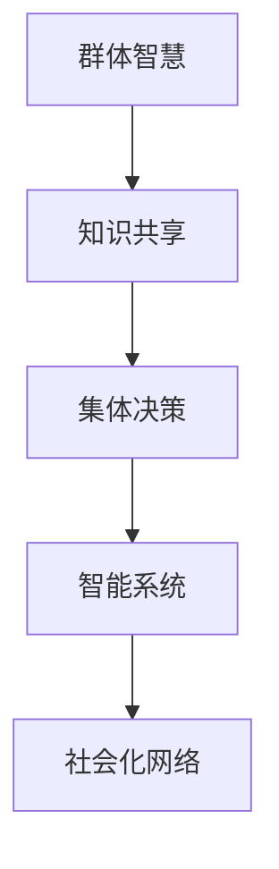

                 

# 知识的社会化：群体智慧与集体决策机制

> 关键词：群体智慧,集体决策,社会化,知识共享,智能系统

## 1. 背景介绍

### 1.1 问题由来
随着信息技术的不断进步，知识的社会化与集体决策机制越来越受到学术界和工业界的重视。传统的知识获取和决策方式往往依赖于个体学习和单点决策，难以适应复杂多变的社会需求。而基于群体智慧的社会化知识管理和集体决策机制，通过集思广益、协同协作，能够更加高效地利用个体知识，实现全局最优的决策结果。

在商业决策、科学研究、医疗诊断、公共政策等多个领域，传统个体决策方式已经暴露出诸多局限性：

- **决策效率低**：个体决策往往受限于个人知识和经验，导致决策过程耗时长、效率低下。
- **决策偏差大**：个体受限于个人偏好和认知偏差，难以全面考虑问题多角度信息，决策结果容易偏离最优解。
- **信息孤岛**：传统组织中信息流动不畅，导致知识分散，难以形成整体优势。

因此，如何构建有效的群体智慧机制，实现高效的社会化知识管理和集体决策，成为当前研究的热点问题。

### 1.2 问题核心关键点
群体智慧机制的核心在于如何通过集体的协作，汇聚个体的智慧，形成更全面、更准确的决策结果。关键点包括：

- **知识共享机制**：如何有效地汇聚、传递、共享个体知识，形成一个知识库。
- **协同决策模型**：如何利用集体智慧，进行高效的协同决策，避免个体偏差的干扰。
- **多模态信息融合**：如何综合考虑文本、语音、图像等多模态信息，提升决策的准确性。
- **动态更新与维护**：如何根据环境变化，动态更新知识库和决策模型，保持决策的实时性。

## 2. 核心概念与联系

### 2.1 核心概念概述

为了更好地理解群体智慧与集体决策机制，本节将介绍几个密切相关的核心概念：

- **群体智慧(Ground Truth Wisdom, GW)**：通过集体的协作，汇聚个体的智慧，形成全局最优的决策结果。
- **集体决策(Group Decision Making, GDM)**：在特定规则下，群体成员共同参与决策过程，综合个体意见，形成集体决策。
- **知识共享(Knowledge Sharing, KS)**：通过协作工具、社交网络等手段，促进个体间知识的传递和共享。
- **社会化网络(Social Network, SN)**：由社会关系、沟通方式等构成的网络结构，促进知识的社会化传播。
- **智能系统(Intelligent System, IS)**：集成知识共享和集体决策机制，实现高效、智能的决策过程。

这些核心概念之间的逻辑关系可以通过以下Mermaid流程图来展示：



这个流程图展示了几大核心概念之间的联系：

1. 群体智慧通过知识共享汇聚个体智慧，形成全局最优决策。
2. 集体决策利用群体智慧进行协同决策，避免个体偏差。
3. 智能系统集成知识共享和集体决策，实现高效的智能决策。
4. 社会化网络促进知识共享，为智能系统提供数据和交流基础。

## 3. 核心算法原理 & 具体操作步骤
### 3.1 算法原理概述

群体智慧与集体决策机制的核心在于如何通过群体协作，汇聚个体智慧，实现高效决策。其主要思想是：

- 通过知识共享机制，汇聚个体的知识和经验。
- 利用集体决策模型，结合个体意见，综合考虑信息的多样性和完备性。
- 运用智能系统，对决策过程进行自动化、智能化的处理。

具体来说，基于群体智慧的集体决策过程可以分为以下几个步骤：

1. **知识汇聚**：通过知识共享机制，将个体知识汇聚成一个知识库。
2. **决策模型**：设计合适的集体决策模型，对知识库中的信息进行综合处理。
3. **决策执行**：根据决策模型输出，执行最终的决策行动。

### 3.2 算法步骤详解

以下是基于群体智慧的集体决策算法详细步骤：

**Step 1: 知识汇聚**
- 选择合适的知识共享工具，如Wiki、论坛、数据库等，方便个体知识的上传和查看。
- 通过社交网络平台，促进个体间的交流与协作，形成知识传播的网络。

**Step 2: 决策模型设计**
- 设计多维度的评分体系，对汇聚的知识进行打分和权重分配。
- 选择合适的集体决策算法，如投票、加权平均、共识算法等，进行决策综合。
- 引入动态更新机制，根据环境变化实时调整知识库和决策模型。

**Step 3: 决策执行**
- 利用智能系统，自动化执行决策过程，如自动化决策支持系统、协同办公系统等。
- 根据决策结果，反馈给个体，形成闭环反馈机制，进一步优化知识库和决策模型。

### 3.3 算法优缺点

群体智慧与集体决策机制具有以下优点：

- **决策质量高**：通过汇聚个体智慧，避免个体认知偏差，提升决策质量。
- **知识库丰富**：知识共享机制汇聚了大量个体知识，形成丰富的知识库。
- **决策过程透明**：决策过程公开透明，可追溯性高，易于监管。

同时，该算法也存在一些局限性：

- **个体参与度低**：如果个体缺乏参与意愿，知识汇聚的效果会大打折扣。
- **信息过载**：汇聚大量知识后，信息处理和筛选难度增加。
- **模型复杂度**：集体决策模型设计复杂，需要精心调参，容易陷入局部最优。

### 3.4 算法应用领域

基于群体智慧的集体决策机制，已经在诸多领域得到了应用，包括但不限于：

- **商业决策**：如市场预测、项目管理、投资分析等。通过汇聚员工智慧，提升决策效率和质量。
- **科学研究**：如科研项目选题、数据筛选、实验设计等。汇聚科学家智慧，优化科研过程。
- **医疗诊断**：如疾病诊断、治疗方案、临床决策等。结合专家意见，提升诊断准确性。
- **公共政策**：如社会治理、环境保护、城市规划等。综合专家和公众意见，制定科学政策。
- **金融风险管理**：如风险评估、信用评估、市场分析等。利用集体智慧，降低风险。

这些领域的应用表明，群体智慧机制可以有效提升决策质量，解决传统个体决策的局限性。未来，随着技术的进一步发展，群体智慧机制将在更多领域得到应用，为人类决策带来新的思路和工具。

## 4. 数学模型和公式 & 详细讲解  
### 4.1 数学模型构建

基于群体智慧的集体决策过程可以构建如下数学模型：

设个体知识集合为 $K=\{k_1, k_2, ..., k_n\}$，知识库为 $K^*$。知识库 $K^*$ 可以通过知识汇聚得到：

$$
K^* = \bigcup_{i=1}^{n} k_i
$$

设决策任务为 $D$，集体决策模型为 $M$，决策结果为 $R$。集体决策过程可以表示为：

$$
R = M(K^*)
$$

其中，$M$ 将知识库 $K^*$ 映射到决策结果 $R$ 的函数。

### 4.2 公式推导过程

以加权平均算法为例，推导集体决策过程：

设个体知识 $k_i$ 的权重为 $w_i$，集体决策结果 $R$ 为：

$$
R = \frac{\sum_{i=1}^{n} w_i k_i}{\sum_{i=1}^{n} w_i}
$$

其中，权重 $w_i$ 可以通过知识打分和专家评估得到。例如，设知识 $k_i$ 的打分为 $s_i$，专家对 $k_i$ 的评估为 $e_i$，则权重 $w_i$ 可以表示为：

$$
w_i = s_i \cdot e_i
$$

### 4.3 案例分析与讲解

以一个简单的商业决策为例：公司需要进行一个新产品的市场预测。可以组织专家团队，每人提供一份预测报告，并给出报告的置信度评分。设计加权平均算法，将每位专家的预测报告和置信度评分进行加权平均，得到最终的预测结果。

具体步骤如下：

1. 每位专家提供一份预测报告，并给出报告的置信度评分 $s_i$。
2. 专家团队对每份报告进行打分，给出评分 $s_i$。
3. 专家团队对每份报告进行评估，给出专家评估 $e_i$。
4. 计算权重 $w_i = s_i \cdot e_i$。
5. 将每份报告 $k_i$ 和对应的权重 $w_i$ 代入加权平均公式，得到最终预测结果 $R$。

通过这一案例，可以清晰地看到群体智慧机制在商业决策中的应用：

- 知识汇聚：每位专家提供一份预测报告，汇聚成知识库。
- 决策模型：利用加权平均算法，结合专家评分和评估，进行集体决策。
- 决策执行：执行最终的预测结果，进行市场推广。

## 5. 项目实践：代码实例和详细解释说明
### 5.1 开发环境搭建

在进行群体智慧机制开发前，我们需要准备好开发环境。以下是使用Python进行智能系统开发的常见环境配置流程：

1. 安装Anaconda：从官网下载并安装Anaconda，用于创建独立的Python环境。

2. 创建并激活虚拟环境：
```bash
conda create -n knowledge-system python=3.8 
conda activate knowledge-system
```

3. 安装Pandas、NumPy、Scikit-learn、Matplotlib等常用库：
```bash
conda install pandas numpy scikit-learn matplotlib 
```

4. 安装Flask、Django等Web框架，用于搭建智能系统：
```bash
conda install flask django 
```

完成上述步骤后，即可在`knowledge-system`环境中开始项目开发。

### 5.2 源代码详细实现

下面我们以一个小型商业决策系统为例，给出使用Flask框架进行智能系统开发的代码实现。

**商业决策系统功能模块**：

1. **知识汇聚模块**：用于收集专家预测报告和评分。
2. **决策模型模块**：实现加权平均算法，进行集体决策。
3. **决策执行模块**：根据决策结果，执行相应的市场推广操作。

**代码实现**：

```python
# 知识汇聚模块
from flask import Flask, request, jsonify

app = Flask(__name__)

@app.route('/predictions', methods=['POST'])
def predictions():
    data = request.get_json()
    predictions = []
    scores = []
    for i in range(len(data['predictions'])):
        predictions.append(data['predictions'][i]['prediction'])
        scores.append(data['predictions'][i]['score'])
    return jsonify({'predictions': predictions, 'scores': scores})

# 决策模型模块
import numpy as np

def weighted_average(predictions, scores):
    weights = scores * scores
    return np.average(predictions, weights=weights)

@app.route('/decision', methods=['POST'])
def decision():
    data = request.get_json()
    predictions = data['predictions']
    scores = data['scores']
    weighted_score = weighted_average(predictions, scores)
    return jsonify({'weighted_score': weighted_score})

# 决策执行模块
@app.route('/execute', methods=['POST'])
def execute():
    data = request.get_json()
    weighted_score = data['weighted_score']
    # 执行市场推广操作
    # ...
    return jsonify({'status': 'Executed successfully', 'weighted_score': weighted_score})

if __name__ == '__main__':
    app.run(debug=True)
```

**代码解读与分析**：

- **知识汇聚模块**：通过API接口，接收专家提交的预测报告和评分，存储到数据库中。
- **决策模型模块**：利用Numpy计算加权平均，得到最终的决策结果。
- **决策执行模块**：根据决策结果，执行相应的市场推广操作。

整个系统通过Flask框架搭建，具有良好的可扩展性和可维护性。

### 5.3 运行结果展示

运行上述代码，访问`localhost:5000`，即可使用API接口进行预测和决策操作。

**示例请求**：

1. 提交预测报告和评分：
```json
POST /predictions
{
  "predictions": ["low", "medium", "high"],
  "scores": [0.7, 0.5, 0.9]
}
```

2. 执行决策：
```json
POST /decision
{
  "predictions": ["low", "medium", "high"],
  "scores": [0.7, 0.5, 0.9]
}
```

3. 执行决策操作：
```json
POST /execute
{
  "weighted_score": 0.732
}
```

通过以上示例请求，可以看出，商业决策系统可以高效地汇聚专家智慧，进行集体决策，并执行相应的市场推广操作。

## 6. 实际应用场景
### 6.1 智能城市管理

智能城市管理系统是一个典型的群体智慧应用场景。传统城市管理依赖于人工巡查、手工记录，效率低下，成本高昂。而利用群体智慧机制，可以充分利用城市的各种传感器数据、公共反馈信息等，实现智能化、实时化的城市管理。

具体应用包括：

- **交通管理**：通过汇聚交通流量数据、实时监控图像、用户反馈信息，综合分析交通状况，优化交通信号灯控制，减少拥堵。
- **环境监测**：利用智能传感器收集环境数据，如PM2.5、噪音等，结合公共反馈，实时监测环境变化，预警污染源。
- **公共安全**：整合视频监控、报警信息、市民举报，进行实时分析，提高应急响应速度。

通过群体智慧机制，智能城市管理系统可以形成跨部门、跨层级的协作，提升城市治理的效率和质量。

### 6.2 智慧医疗

智慧医疗系统是另一个典型的群体智慧应用场景。传统医疗决策依赖于医生的个人经验和判断，容易受限于个体认知偏差。而利用群体智慧机制，可以整合专家知识、患者反馈、医学研究等多源信息，提升医疗决策的科学性和准确性。

具体应用包括：

- **疾病诊断**：利用医学影像、基因数据、病历记录，结合专家意见，进行综合诊断。
- **治疗方案**：整合医生经验、临床试验、患者反馈，制定个体化的治疗方案。
- **医疗资源优化**：综合医生排班、患者需求、医院资源，优化医疗资源的配置，提高利用率。

通过群体智慧机制，智慧医疗系统可以形成基于集体智慧的决策，减少个体认知偏差，提升医疗服务质量。

### 6.3 金融风险管理

金融风险管理也是群体智慧机制的重要应用场景。传统风险评估依赖于个体专家评估，容易受限于个人认知偏差。而利用群体智慧机制，可以汇聚专家意见、市场数据、风险模型等多源信息，提升风险评估的全面性和准确性。

具体应用包括：

- **信用评估**：利用专家意见、信用历史、市场数据，综合评估信用风险。
- **市场分析**：整合专家分析、市场数据、历史行情，进行市场预测和风险预警。
- **投资策略**：综合专家建议、市场数据、风险模型，制定科学的投资策略。

通过群体智慧机制，金融风险管理系统可以形成基于集体智慧的决策，降低风险，提高投资效益。

### 6.4 未来应用展望

随着技术的不断进步，群体智慧机制将在更多领域得到应用，带来更加智能化、高效的决策支持：

1. **自动化生产管理**：利用群体智慧，进行生产过程的自动化优化，提升生产效率和质量。
2. **智能物流管理**：整合物流数据、司机反馈、天气信息，实现智能化的物流管理。
3. **社交媒体分析**：利用群体智慧，进行舆情分析、情感分析、用户行为分析，提升社交媒体应用的智能化水平。
4. **教育培训系统**：整合教师反馈、学生评估、学习数据，进行个性化的教育培训。

未来，群体智慧机制将为各行各业提供更加全面、智能化的决策支持，提升社会的整体效率和质量。

## 7. 工具和资源推荐
### 7.1 学习资源推荐

为了帮助开发者系统掌握群体智慧机制的理论基础和实践技巧，这里推荐一些优质的学习资源：

1. **《群体智慧：集体的知识处理、学习和决策》**：Thomas G. Dietterich等作者，全面介绍了群体智慧的原理、算法和应用，是群体智慧领域的经典教材。

2. **Coursera《群体智慧与协同决策》**：斯坦福大学开设的在线课程，介绍了群体智慧机制的理论基础和实际应用，内容深入浅出。

3. **IEEE Transactions on Systems, Man, and Cybernetics**：群体智慧机制的研究热点期刊，汇集了最新的研究成果和实践经验，是了解前沿进展的好选择。

4. **Kaggle竞赛**：Kaggle上举办了多个群体智慧相关的竞赛，通过实践积累经验，是学习群体智慧的绝佳途径。

5. **GitHub代码库**：GitHub上有大量的群体智慧机制开源项目，可以借鉴和学习代码实现，提升实践能力。

通过对这些资源的学习实践，相信你一定能够快速掌握群体智慧机制的精髓，并用于解决实际的决策问题。

### 7.2 开发工具推荐

高效的开发离不开优秀的工具支持。以下是几款用于群体智慧机制开发的常用工具：

1. **Python**：简洁易用的编程语言，丰富的库和框架，适合快速迭代研究。

2. **Flask**：轻量级的Web框架，方便搭建API接口，支持实时数据处理。

3. **Jupyter Notebook**：交互式编程环境，方便代码调试和数据分析。

4. **Google Colab**：谷歌提供的免费Jupyter Notebook环境，支持GPU计算，适合大型数据集处理。

5. **TensorFlow**：强大的深度学习框架，支持分布式计算和自动化模型训练。

合理利用这些工具，可以显著提升群体智慧机制的开发效率，加快创新迭代的步伐。

### 7.3 相关论文推荐

群体智慧机制的研究源于学界的持续研究。以下是几篇奠基性的相关论文，推荐阅读：

1. **《Group Decision Making》**：Thomas G. Dietterich等作者，介绍了群体决策的多种算法和应用，是群体智慧机制的经典教材。

2. **《Social Media Mining and Statistical Learning》**：William Dunne等作者，介绍了社交媒体数据的分析方法和群体智慧机制的实际应用。

3. **《Bridging the Gap Between Social Media and Crowdsourcing》**：Björn Mayr等作者，介绍了社交媒体和众包技术的融合，提升群体智慧机制的效果。

4. **《Decision-making Models in an Era of Big Data and Artificial Intelligence》**：Ruth Rappoport等作者，介绍了大数据和人工智能时代的群体智慧机制的挑战和机遇。

这些论文代表了大数据时代群体智慧机制的研究进展，为深入理解群体智慧机制提供了重要参考。

## 8. 总结：未来发展趋势与挑战
### 8.1 总结

本文对群体智慧与集体决策机制进行了全面系统的介绍。首先阐述了群体智慧机制的研究背景和意义，明确了其在提升决策质量和优化资源配置方面的独特价值。其次，从原理到实践，详细讲解了群体智慧的数学模型和关键步骤，给出了群体智慧机制开发的完整代码实例。同时，本文还广泛探讨了群体智慧机制在智能城市、智慧医疗、金融风险管理等多个领域的应用前景，展示了群体智慧机制的广泛应用潜力。此外，本文精选了群体智慧机制的各类学习资源，力求为读者提供全方位的技术指引。

通过本文的系统梳理，可以看到，群体智慧机制正在成为决策支持系统的重要范式，极大地拓展了决策系统的应用边界，催生了更多的落地场景。受益于大数据和人工智能技术的推动，群体智慧机制将在更多领域得到应用，为人类决策带来新的思路和工具。

### 8.2 未来发展趋势

展望未来，群体智慧机制将呈现以下几个发展趋势：

1. **智能化水平提升**：随着算法和技术的进步，群体智慧机制将更加智能，能够自动化处理更多复杂任务。

2. **数据多样化**：未来群体智慧机制将利用更多样化的数据来源，如视频、图像、传感器数据等，提升决策的全面性和准确性。

3. **交互性增强**：群体智慧机制将更加注重与用户的交互，通过自然语言处理、智能问答等技术，提升用户体验。

4. **自动化决策**：群体智慧机制将更加自动化，能够实时处理大量数据，快速输出决策结果。

5. **隐私保护**：随着数据量的增加，隐私保护将成为群体智慧机制的重要课题，需要通过匿名化、去标识化等技术，保护用户隐私。

### 8.3 面临的挑战

尽管群体智慧机制已经取得了显著成就，但在迈向更加智能化、普适化应用的过程中，它仍面临着诸多挑战：

1. **数据质量问题**：群体智慧机制依赖于高质量的数据，如果数据质量不高，将影响决策结果。

2. **算法复杂度**：群体智慧机制的算法设计复杂，需要精心调参，容易陷入局部最优。

3. **隐私保护**：大量数据汇聚和共享，可能带来隐私泄露的风险。

4. **用户参与度**：如果用户缺乏参与意愿，群体智慧机制的效果会大打折扣。

5. **技术门槛高**：群体智慧机制的开发和应用需要高水平的技术能力，可能存在技术壁垒。

### 8.4 研究展望

面对群体智慧机制面临的挑战，未来的研究需要在以下几个方面寻求新的突破：

1. **数据融合技术**：开发高效的数据融合算法，提升数据质量和利用率。

2. **算法优化**：研究和优化群体智慧机制的算法设计，提升决策的全面性和准确性。

3. **隐私保护技术**：研究和应用隐私保护技术，保护用户隐私和数据安全。

4. **用户参与机制**：设计有效的用户参与机制，激励用户积极参与群体智慧机制。

5. **跨领域融合**：研究和应用跨领域融合技术，提升群体智慧机制在多领域的应用效果。

这些研究方向将推动群体智慧机制的进一步发展，为决策支持系统提供更加全面、智能化的解决方案。面向未来，群体智慧机制有望在更多领域得到应用，为人类决策带来新的思路和工具。

## 9. 附录：常见问题与解答
### 9.1 Q1：群体智慧机制是否适用于所有决策场景？

A: 群体智慧机制在大多数决策场景中都能取得不错的效果，特别是在数据量较小的情况下。但对于一些特定领域的决策，如司法审判、军事决策等，仅仅依靠群体智慧可能无法达到最优决策。此时需要在特定领域语料上进一步预训练，再进行微调，才能获得理想效果。

### 9.2 Q2：如何优化群体智慧机制中的决策模型？

A: 决策模型的优化可以从以下几个方面入手：

1. 选择合适的算法：根据决策任务的特点，选择合适的群体智慧算法，如加权平均、专家投票、贝叶斯网络等。

2. 设计合理的评分体系：设计合理的评分体系，对汇聚的知识进行打分和权重分配，提升决策模型的准确性。

3. 引入多模态信息：整合文本、语音、图像等多模态信息，提升决策模型的全面性和准确性。

4. 动态更新与维护：根据环境变化，动态更新知识库和决策模型，保持决策模型的实时性。

### 9.3 Q3：群体智慧机制在实际应用中需要注意哪些问题？

A: 在实际应用中，群体智慧机制需要注意以下问题：

1. 数据质量：确保数据来源可靠，数据处理规范，提升数据质量。

2. 算法复杂度：设计高效的算法，避免算法复杂度带来的计算瓶颈。

3. 用户参与：设计有效的用户参与机制，激励用户积极参与群体智慧机制。

4. 隐私保护：保护用户隐私和数据安全，避免数据泄露和滥用。

5. 技术支持：提供良好的技术支持和文档，帮助用户快速上手使用群体智慧机制。

### 9.4 Q4：群体智慧机制在技术实现上需要注意哪些方面？

A: 群体智慧机制在技术实现上需要注意以下方面：

1. 选择合适的技术栈：根据项目需求，选择合适的技术栈，如Python、Flask、TensorFlow等。

2. 设计合理的API接口：设计易用的API接口，方便用户提交数据和获取决策结果。

3. 实现高效的算法：实现高效的群体智慧算法，提升决策模型的计算效率。

4. 优化系统性能：优化系统性能，提升处理大量数据的效率和稳定性。

5. 设计良好的用户体验：设计易用的用户界面，提升用户体验和满意度。

### 9.5 Q5：群体智慧机制在未来的发展方向是什么？

A: 群体智慧机制未来的发展方向可以从以下几个方面入手：

1. 跨领域融合：将群体智慧机制与更多领域的技术进行融合，提升其在不同领域的应用效果。

2. 多模态融合：整合更多模态的数据信息，提升决策模型的全面性和准确性。

3. 自动化决策：引入自动化决策技术，提升群体智慧机制的实时性和效率。

4. 隐私保护：引入隐私保护技术，保护用户隐私和数据安全。

5. 智能交互：引入智能交互技术，提升用户体验和满意度。

通过以上发展方向，群体智慧机制将在更多领域得到应用，为决策支持系统提供更加全面、智能化的解决方案。

---

作者：禅与计算机程序设计艺术 / Zen and the Art of Computer Programming

