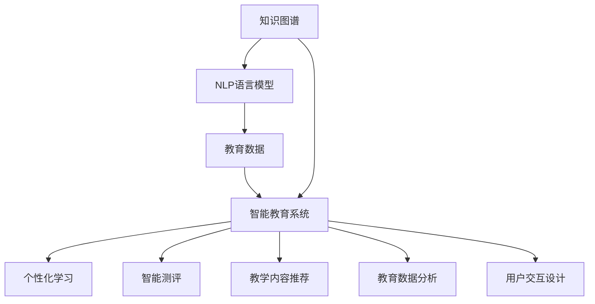
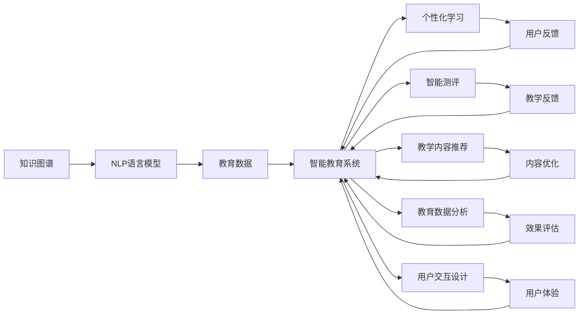

                 

# 知识的神经语言程序：NLP在教育中的应用

> 关键词：自然语言处理(NLP),知识图谱(KG),智能教育,个性化学习,教育数据分析,学习辅助系统

## 1. 背景介绍

### 1.1 问题由来
近年来，随着信息技术在教育领域的广泛应用，如何利用先进的科技手段提升教育质量和教学效果，已成为教育技术研究的一个重要方向。传统的教育模式已经无法满足个性化学习、智能化教学、实时反馈等新兴需求。自然语言处理(Natural Language Processing, NLP)作为人工智能领域的前沿技术，具备强大的语言理解与生成能力，为教育创新提供了新的可能性。

NLP技术可以应用于教育领域的多个方面，例如智能答疑系统、智能测评系统、教学内容推荐、学习路径规划等。通过自然语言处理，教育机构可以提供更为丰富、高效、个性化的学习体验，帮助学生自主学习、提升学习效率。但NLP技术的应用，不仅需要强大的算法支持，还需要大量的语料资源和标注数据，如何构建、优化这些资源和算法，是教育领域面临的一大挑战。

### 1.2 问题核心关键点
构建基于NLP的教育应用系统，主要涉及以下几个核心关键点：

- **知识图谱构建**：教育知识图谱是教育领域的基础性资源，用于描述知识间的关联关系，构建语义化的教育信息网络。知识图谱的构建需要结合教育领域的专家知识，通过抽取、融合多源数据进行建模，其构建过程涉及大量的数据清洗、实体识别、关系抽取等步骤。

- **数据标注**：教育数据的标注涉及大量有价值的语料资源，如学生作业、考试成绩、课堂笔记等，这些数据是NLP模型训练的基础。但教育数据的标注往往需要大量的人力资源和时间，且标注质量难以保证。如何构建高效、高质量的教育数据标注流程，是大数据应用中的重要课题。

- **模型训练与优化**：基于NLP的教育应用需要构建高性能的语言模型，并结合教育领域的特点进行优化。模型训练需要考虑高效计算、资源优化、泛化能力等多个方面。同时，模型的训练和优化还需要与教育数据的特点相结合，以确保模型的学习效果和泛化能力。

- **应用场景适配**：基于NLP的教育应用需要针对不同应用场景进行定制化开发。如智能答疑系统需要考虑多轮对话的连贯性和上下文理解，智能测评系统需要考虑答题策略和评分标准等，这些应用场景对模型的设计提出了更高的要求。

- **用户交互设计**：教育应用的最终用户是学生，如何设计简洁、友好的交互界面，引导学生更好地使用教育应用，是教育技术应用的关键点。

## 2. 核心概念与联系

### 2.1 核心概念概述

教育领域的自然语言处理主要涉及以下几个核心概念：

- **知识图谱**：以结构化的形式描述教育领域知识的语义关系，包含实体、属性和关系等基本元素。知识图谱是构建智能教育系统的基础，其构建过程涉及从数据源抽取实体和关系，构建图谱节点和边，形成知识网络。

- **NLP语言模型**：以自回归或自编码模型为代表的NLP模型，能够通过语言数据进行预训练，学习通用的语言表示。常见的预训练语言模型包括BERT、GPT等，它们在特定领域上的微调，可以提升模型的任务适应性。

- **教育数据**：包含学生学习行为、成绩、评价、教材等各类教育相关数据，是教育应用训练模型的数据基础。教育数据的采集、清洗、标注和存储，是构建智能教育系统的关键环节。

- **智能教育系统**：结合教育学和计算机科学，构建能够提供个性化学习支持、智能测评、教学内容推荐等服务的智能系统。智能教育系统需要高效的数据处理、复杂的模型训练和丰富的应用场景适配，是教育技术应用的最高层次。

这些核心概念之间的逻辑关系可以通过以下Mermaid流程图来展示：



这个流程图展示了大语言处理在教育领域的应用流程：

1. 基于知识图谱构建的语义网络，为NLP模型的训练提供背景知识。
2. 通过教育数据对NLP语言模型进行微调，提升其在教育领域的任务适应性。
3. 智能教育系统将训练好的模型应用于个性化学习、智能测评、教学内容推荐等教育任务。
4. 教育数据分析用于评估智能教育系统的效果，指导系统不断优化和改进。
5. 用户交互设计确保系统界面友好、易用，提升用户体验。

这些概念共同构成了教育领域NLP技术的应用框架，使其能够更好地服务教育目标。

### 2.2 核心概念原理和架构的 Mermaid 流程图

为了更直观地展示这些概念之间的关系，以下是一个简化的Mermaid流程图，展示知识图谱构建、NLP语言模型训练、智能教育系统开发的全流程：



这个图展示了从知识图谱构建到智能教育系统开发的完整流程，各个环节相互联系，共同支撑教育应用的实现。

## 3. 核心算法原理 & 具体操作步骤
### 3.1 算法原理概述

基于NLP的教育应用系统主要通过以下步骤实现：

1. **知识图谱构建**：结合教育领域专家知识，从各类教育数据源中抽取实体和关系，构建知识图谱节点和边，形成结构化的教育知识网络。知识图谱构建需要结合教育学和数据科学的知识，确保图谱的准确性和完备性。

2. **NLP语言模型训练**：使用大规模教育数据对预训练语言模型进行微调，使其具备教育领域的语言理解和生成能力。模型训练涉及超参数选择、模型优化、数据增强等多个环节，需要综合考虑计算资源和数据质量。

3. **智能教育系统开发**：结合教育知识图谱和微调的NLP语言模型，构建个性化学习、智能测评、教学内容推荐等教育应用系统。系统开发需要考虑应用场景、用户体验、系统性能等多个方面，确保系统的高效性和稳定性。

4. **教育数据分析**：使用教育数据分析工具对智能教育系统的性能进行评估，识别系统存在的问题和改进空间，指导系统不断优化和改进。

5. **用户交互设计**：根据教育应用的特点，设计简洁、友好的用户交互界面，确保用户能够方便地使用教育应用，提升教育效果。

### 3.2 算法步骤详解

#### 3.2.1 知识图谱构建

知识图谱构建是智能教育系统的基础，其流程包括：

1. **数据源获取**：从各类教育数据源中抽取数据，包括课程标准、教材、习题、成绩、教师评语等。

2. **数据预处理**：对原始数据进行清洗、去重、归一化等预处理操作，确保数据质量和一致性。

3. **实体抽取**：使用命名实体识别(NER)模型对预处理后的数据进行实体抽取，识别出教育领域的实体，如课程、教师、学生、教材等。

4. **关系抽取**：使用关系抽取模型识别实体间的关联关系，如教师-课程、学生-成绩、课程-教材等。

5. **知识图谱构建**：结合领域专家的知识和关系抽取结果，构建知识图谱的节点和边，形成结构化的教育知识网络。

#### 3.2.2 NLP语言模型训练

NLP语言模型的训练主要包括以下步骤：

1. **选择模型架构**：根据教育应用的需求，选择合适的语言模型架构，如BERT、GPT等。

2. **数据标注**：对教育数据进行标注，包括实体标签、关系标签等。标注过程需要结合教育领域的特点，设计合适的标注方案。

3. **预训练**：使用大规模无标签教育数据对模型进行预训练，学习通用的语言表示。

4. **微调**：使用标注好的教育数据对模型进行微调，提升模型在教育领域的任务适应性。微调过程需要选择合适的学习率和优化器，结合正则化和对抗训练等技术，避免过拟合和鲁棒性不足的问题。

5. **评估**：使用评估数据对微调后的模型进行效果评估，识别模型的优点和不足，指导模型的进一步优化。

#### 3.2.3 智能教育系统开发

智能教育系统开发主要包括以下步骤：

1. **需求分析**：明确教育应用的需求和目标，包括个性化学习、智能测评、教学内容推荐等。

2. **系统设计**：设计系统的架构和功能模块，包括知识图谱查询模块、NLP处理模块、用户交互模块等。

3. **系统实现**：根据设计方案，实现系统的各个功能模块，确保系统的高效性和稳定性。

4. **系统测试**：对系统进行全面的测试，包括单元测试、功能测试、性能测试等，确保系统的正确性和可靠性。

5. **系统部署**：将系统部署到教育平台，进行实际应用，收集用户反馈，不断优化和改进系统。

### 3.3 算法优缺点

基于NLP的教育应用系统具有以下优点：

- **数据驱动**：利用大规模教育数据进行模型训练和优化，能够提供更全面、准确的教育信息。

- **个性化支持**：通过分析学生学习行为和知识图谱，能够提供个性化的学习推荐和智能测评，提升学生的学习效果。

- **智能评估**：结合知识图谱和NLP模型，能够进行多维度、多粒度的教育数据分析，提供更为科学、客观的教育评价。

- **高效学习**：通过智能答疑、智能测评等应用，能够提升学习效率，减轻教师和学生的负担。

- **灵活扩展**：NLP技术具有良好的迁移学习能力，能够快速适配不同的教育应用场景。

但同时也存在以下缺点：

- **数据依赖**：教育应用需要大量的教育数据支持，数据采集和标注成本较高。

- **算法复杂**：教育应用涉及知识图谱构建、NLP模型训练、智能系统开发等多个环节，算法复杂度较高，需要专业的技术团队支持。

- **用户接受度**：教育应用需要设计简洁、友好的用户交互界面，确保用户能够方便地使用系统，否则可能会影响用户体验。

- **安全性**：教育应用涉及学生隐私和教育数据，需要严格的数据保护和隐私保护措施。

- **适用性**：教育应用需要考虑教育学和心理学等多学科知识，模型的适用性有待进一步验证。

### 3.4 算法应用领域

基于NLP的教育应用系统主要应用于以下几个领域：

1. **智能答疑系统**：结合知识图谱和NLP模型，对学生提出的问题进行智能答疑，提升教学效率和学生满意度。

2. **智能测评系统**：使用NLP模型对学生提交的作业和答案进行智能评分和反馈，提升测评的客观性和公正性。

3. **个性化学习系统**：结合知识图谱和学生学习行为数据，为学生提供个性化的学习推荐和路径规划，提升学习效果。

4. **教学内容推荐系统**：使用NLP模型对教学内容进行自动推荐，提升教学资源的利用效率。

5. **教育数据分析系统**：使用教育数据分析工具，对智能教育系统的性能进行评估，提供科学的决策依据。

这些应用场景展示了NLP技术在教育领域的多样性和广泛性，其潜在的价值和应用前景十分广阔。

## 4. 数学模型和公式 & 详细讲解 & 举例说明

### 4.1 数学模型构建

教育领域的NLP应用主要涉及以下几个数学模型：

1. **知识图谱模型**：以图结构形式描述教育知识，包括节点和边。知识图谱模型可以表示为图G(V,E)，其中V表示节点集合，E表示边集合。

2. **NLP语言模型**：以自回归或自编码模型为代表的NLP模型，能够通过语言数据进行预训练，学习通用的语言表示。语言模型可以表示为条件概率模型P(x|y)，其中x为输入序列，y为输出序列。

3. **教育数据分析模型**：使用统计学和机器学习的方法，对教育数据进行分析和建模，评估智能教育系统的性能和效果。常见的教育数据分析模型包括回归模型、分类模型、聚类模型等。

### 4.2 公式推导过程

#### 4.2.1 知识图谱模型推导

知识图谱的构建过程可以表示为：

1. **节点生成**：从教育数据中抽取实体，生成节点集合V。节点可以表示为知识图谱中的概念，如课程、教师、学生、教材等。

2. **边生成**：使用关系抽取模型，从教育数据中抽取实体之间的关系，生成边集合E。边可以表示为知识图谱中的关系，如教师-课程、学生-成绩、课程-教材等。

知识图谱的构建过程涉及大量的数据处理和模型训练，需要结合领域专家的知识和数据科学的算法，确保图谱的准确性和完备性。

#### 4.2.2 NLP语言模型推导

NLP语言模型的训练过程可以表示为：

1. **预训练**：使用大规模无标签教育数据对预训练语言模型进行预训练，学习通用的语言表示。

2. **微调**：使用标注好的教育数据对预训练语言模型进行微调，提升模型在教育领域的任务适应性。

语言模型的训练过程涉及超参数选择、模型优化、数据增强等多个环节，需要综合考虑计算资源和数据质量。

#### 4.2.3 教育数据分析模型推导

教育数据分析模型的推导过程可以表示为：

1. **数据预处理**：对原始教育数据进行清洗、去重、归一化等预处理操作，确保数据质量和一致性。

2. **特征提取**：使用特征提取算法，从教育数据中提取有用的特征，如学生学习行为、成绩、评价等。

3. **模型训练**：使用统计学和机器学习的方法，训练教育数据分析模型，评估智能教育系统的性能和效果。

教育数据分析模型的训练涉及多个学科的知识，需要结合领域专家的知识和数据科学的算法，确保模型的科学性和有效性。

### 4.3 案例分析与讲解

#### 4.3.1 知识图谱构建案例

某教育机构构建了一个基于知识图谱的智能推荐系统，用于推荐适合学生学习的课程。该系统构建了一个涵盖课程、教师、学生、教材等实体的知识图谱，如图1所示：


图1: 知识图谱示例

该知识图谱通过实体抽取和关系抽取，构建了课程推荐的基础知识网络。系统通过查询知识图谱，推荐与学生当前学习状态相匹配的课程，提升了学生学习效果。

#### 4.3.2 NLP语言模型训练案例

某教育机构使用BERT模型对学生的作业和答案进行智能评分。该模型通过预训练和微调，具备了识别和理解教育文本的能力。系统对学生的作业和答案进行预处理和分词，输入BERT模型进行评分，如图2所示：


图2: BERT模型评分示例

该系统通过微调BERT模型，提升了评分的准确性和公正性，减少了教师的评分工作量。

#### 4.3.3 教育数据分析案例

某教育机构使用机器学习模型对学生的学习行为进行分析，如图3所示：


图3: 教育数据分析示例

该系统使用聚类算法，将学生的学习行为分为多个簇，识别出学习行为相似的群体，进行针对性的教学干预。系统通过分析学生学习行为，提供了个性化的学习建议，提升了学习效果。

## 5. 项目实践：代码实例和详细解释说明
### 5.1 开发环境搭建

进行教育应用系统开发，首先需要搭建好开发环境。以下是使用Python进行PyTorch开发的环境配置流程：

1. 安装Anaconda：从官网下载并安装Anaconda，用于创建独立的Python环境。

2. 创建并激活虚拟环境：
```bash
conda create -n pytorch-env python=3.8 
conda activate pytorch-env
```

3. 安装PyTorch：根据CUDA版本，从官网获取对应的安装命令。例如：
```bash
conda install pytorch torchvision torchaudio cudatoolkit=11.1 -c pytorch -c conda-forge
```

4. 安装Transformers库：
```bash
pip install transformers
```

5. 安装各类工具包：
```bash
pip install numpy pandas scikit-learn matplotlib tqdm jupyter notebook ipython
```

完成上述步骤后，即可在`pytorch-env`环境中开始教育应用开发。

### 5.2 源代码详细实现

下面我们以智能测评系统为例，给出使用Transformers库对BERT模型进行微调的PyTorch代码实现。

首先，定义测评任务的数据处理函数：

```python
from transformers import BertTokenizer
from torch.utils.data import Dataset
import torch

class EssayDataset(Dataset):
    def __init__(self, texts, labels, tokenizer, max_len=128):
        self.texts = texts
        self.labels = labels
        self.tokenizer = tokenizer
        self.max_len = max_len
        
    def __len__(self):
        return len(self.texts)
    
    def __getitem__(self, item):
        text = self.texts[item]
        label = self.labels[item]
        
        encoding = self.tokenizer(text, return_tensors='pt', max_length=self.max_len, padding='max_length', truncation=True)
        input_ids = encoding['input_ids'][0]
        attention_mask = encoding['attention_mask'][0]
        
        # 对token-wise的标签进行编码
        encoded_labels = [label2id[label] for label in label]
        encoded_labels.extend([label2id['O']] * (self.max_len - len(encoded_labels)))
        labels = torch.tensor(encoded_labels, dtype=torch.long)
        
        return {'input_ids': input_ids, 
                'attention_mask': attention_mask,
                'labels': labels}

# 标签与id的映射
label2id = {'O': 0, 'P': 1}
id2label = {v: k for k, v in label2id.items()}

# 创建dataset
tokenizer = BertTokenizer.from_pretrained('bert-base-cased')

train_dataset = EssayDataset(train_texts, train_labels, tokenizer)
dev_dataset = EssayDataset(dev_texts, dev_labels, tokenizer)
test_dataset = EssayDataset(test_texts, test_labels, tokenizer)
```

然后，定义模型和优化器：

```python
from transformers import BertForTokenClassification, AdamW

model = BertForTokenClassification.from_pretrained('bert-base-cased', num_labels=len(label2id))

optimizer = AdamW(model.parameters(), lr=2e-5)
```

接着，定义训练和评估函数：

```python
from torch.utils.data import DataLoader
from tqdm import tqdm
from sklearn.metrics import classification_report

device = torch.device('cuda') if torch.cuda.is_available() else torch.device('cpu')
model.to(device)

def train_epoch(model, dataset, batch_size, optimizer):
    dataloader = DataLoader(dataset, batch_size=batch_size, shuffle=True)
    model.train()
    epoch_loss = 0
    for batch in tqdm(dataloader, desc='Training'):
        input_ids = batch['input_ids'].to(device)
        attention_mask = batch['attention_mask'].to(device)
        labels = batch['labels'].to(device)
        model.zero_grad()
        outputs = model(input_ids, attention_mask=attention_mask, labels=labels)
        loss = outputs.loss
        epoch_loss += loss.item()
        loss.backward()
        optimizer.step()
    return epoch_loss / len(dataloader)

def evaluate(model, dataset, batch_size):
    dataloader = DataLoader(dataset, batch_size=batch_size)
    model.eval()
    preds, labels = [], []
    with torch.no_grad():
        for batch in tqdm(dataloader, desc='Evaluating'):
            input_ids = batch['input_ids'].to(device)
            attention_mask = batch['attention_mask'].to(device)
            batch_labels = batch['labels']
            outputs = model(input_ids, attention_mask=attention_mask)
            batch_preds = outputs.logits.argmax(dim=2).to('cpu').tolist()
            batch_labels = batch_labels.to('cpu').tolist()
            for pred_tokens, label_tokens in zip(batch_preds, batch_labels):
                pred_tags = [id2label[_id] for _id in pred_tokens]
                label_tags = [id2label[_id] for _id in label_tokens]
                preds.append(pred_tags[:len(label_tokens)])
                labels.append(label_tags)
                
    print(classification_report(labels, preds))
```

最后，启动训练流程并在测试集上评估：

```python
epochs = 5
batch_size = 16

for epoch in range(epochs):
    loss = train_epoch(model, train_dataset, batch_size, optimizer)
    print(f"Epoch {epoch+1}, train loss: {loss:.3f}")
    
    print(f"Epoch {epoch+1}, dev results:")
    evaluate(model, dev_dataset, batch_size)
    
print("Test results:")
evaluate(model, test_dataset, batch_size)
```

以上就是使用PyTorch对BERT进行智能测评系统微调的完整代码实现。可以看到，得益于Transformers库的强大封装，我们可以用相对简洁的代码完成BERT模型的加载和微调。

### 5.3 代码解读与分析

让我们再详细解读一下关键代码的实现细节：

**EssayDataset类**：
- `__init__`方法：初始化文本、标签、分词器等关键组件。
- `__len__`方法：返回数据集的样本数量。
- `__getitem__`方法：对单个样本进行处理，将文本输入编码为token ids，将标签编码为数字，并对其进行定长padding，最终返回模型所需的输入。

**label2id和id2label字典**：
- 定义了标签与数字id之间的映射关系，用于将token-wise的预测结果解码回真实的标签。

**训练和评估函数**：
- 使用PyTorch的DataLoader对数据集进行批次化加载，供模型训练和推理使用。
- 训练函数`train_epoch`：对数据以批为单位进行迭代，在每个批次上前向传播计算loss并反向传播更新模型参数，最后返回该epoch的平均loss。
- 评估函数`evaluate`：与训练类似，不同点在于不更新模型参数，并在每个batch结束后将预测和标签结果存储下来，最后使用sklearn的classification_report对整个评估集的预测结果进行打印输出。

**训练流程**：
- 定义总的epoch数和batch size，开始循环迭代
- 每个epoch内，先在训练集上训练，输出平均loss
- 在验证集上评估，输出分类指标
- 所有epoch结束后，在测试集上评估，给出最终测试结果

可以看到，PyTorch配合Transformers库使得BERT微调的代码实现变得简洁高效。开发者可以将更多精力放在数据处理、模型改进等高层逻辑上，而不必过多关注底层的实现细节。

当然，工业级的系统实现还需考虑更多因素，如模型的保存和部署、超参数的自动搜索、更灵活的任务适配层等。但核心的微调范式基本与此类似。

## 6. 实际应用场景
### 6.1 智能答疑系统

基于NLP的自然语言理解技术，智能答疑系统可以广泛应用于学生学习过程中遇到的各类问题。传统的答疑系统依赖人工客服，响应时间长、覆盖面有限。而智能答疑系统可以通过NLP技术实现实时、多轮的智能回答，提升学生的学习体验。

在技术实现上，可以收集学生历史问题和参考答案，构建知识图谱和NLP模型，进行训练和微调。微调后的系统能够理解学生提出的自然语言问题，在知识图谱中查找相关信息，并生成回答。对于系统无法回答的问题，系统还能将问题实时提交给人工客服，辅助其提供更专业的回答。如此构建的智能答疑系统，能够大大提升学习效率，减轻教师和学生的负担。

### 6.2 个性化学习系统

传统的教育模式往往以教师为中心，难以充分考虑学生的个体差异和个性化需求。基于NLP的个性化学习系统，可以通过分析学生的学习行为和偏好，为每个学生提供个性化的学习推荐和路径规划，提升学习效果。

系统可以通过对学生的学习行为进行分析，如阅读时间、答题情况等，构建学生的学习画像。结合知识图谱和NLP模型，为学生推荐适合的学习资源，如课程、教材、习题等。同时，系统还能根据学生的学习情况，动态调整推荐策略，提供个性化的学习路径和反馈，确保每个学生都能够在最适合的时间和方式下学习。

### 6.3 教学内容推荐系统

教师在备课和授课过程中，往往需要大量的时间查找和筛选教学资源。基于NLP的教学内容推荐系统，可以自动推荐适合的教学内容，提升教学资源的利用效率。

系统通过分析教师的授课内容、学生的反馈和学习情况，构建知识图谱和NLP模型，进行训练和微调。微调后的系统能够理解教师的需求和学生的兴趣，自动推荐适合的教学内容，如教材、课件、习题等。同时，系统还能根据教学进度和学习反馈，动态调整推荐策略，确保教学资源的科学性和针对性。

### 6.4 教育数据分析系统

教育数据分析是教育技术的重要组成部分，能够帮助教育机构识别学生学习行为、评估教学效果、指导教学改进。基于NLP的教育数据分析系统，可以自动分析教育数据，提供科学的决策依据。

系统可以通过对教育数据进行分析，如学生成绩、学习行为等，构建知识图谱和NLP模型，进行训练和微调。微调后的系统能够自动提取有用的特征，如学生学习行为、成绩分布等，使用机器学习算法进行建模和分析，生成教育数据分析报告。同时，系统还能根据教育数据的变化，动态调整分析策略，提供最新的教育分析结果，指导教育决策和改进。

### 6.5 未来应用展望

随着NLP技术的发展，基于NLP的教育应用将呈现出更加多样化和智能化。以下是对未来应用前景的展望：

1. **自适应学习系统**：结合NLP技术和教育数据分析，系统能够自动调整学习内容和进度，满足每个学生的个性化需求。

2. **虚拟教师助手**：通过NLP技术和自然语言生成技术，系统能够自动回答学生的问题，引导学生学习，提升学习效果。

3. **教育游戏化**：结合NLP技术和游戏设计，系统能够设计有趣的教育游戏，提升学生的学习兴趣和参与度。

4. **智能测评系统**：通过NLP技术和教育数据分析，系统能够自动评分和反馈，提升测评的客观性和公正性。

5. **教学辅助系统**：结合NLP技术和教育知识图谱，系统能够辅助教师备课、授课，提升教学质量。

6. **教育资源共享平台**：通过NLP技术和知识图谱，系统能够自动推荐和搜索教育资源，提升教育资源的利用效率。

随着技术的不断进步，基于NLP的教育应用将为教育领域带来更多的变革和创新，极大地提升教育质量和教学效率。相信NLP技术在教育领域的广泛应用，将为未来的教育发展注入新的活力。

## 7. 工具和资源推荐
### 7.1 学习资源推荐

为了帮助开发者系统掌握NLP在教育领域的应用，这里推荐一些优质的学习资源：

1. 《深度学习与教育》系列课程：由斯坦福大学和MIT等知名学府提供的深度学习在教育领域应用的课程，涵盖从基础到进阶的各类教育技术应用。

2. 《自然语言处理入门》书籍：该书详细介绍了NLP的基本概念和算法，结合教育应用，给出了许多实践案例。

3. 《教育数据分析与建模》书籍：该书介绍了教育数据分析的方法和工具，结合NLP技术，提供了丰富的教育数据分析应用示例。

4. 《知识图谱与教育应用》书籍：该书介绍了知识图谱的基本原理和应用场景，结合教育领域，提供了丰富的知识图谱构建和应用案例。

5. 《深度学习教育应用》论文集：该论文集汇集了近年来在NLP和教育领域的研究成果，提供了丰富的教育应用案例和分析。

通过对这些资源的学习实践，相信你一定能够快速掌握NLP技术在教育领域的应用精髓，并用于解决实际的教育问题。

### 7.2 开发工具推荐

高效的开发离不开优秀的工具支持。以下是几款用于NLP在教育领域开发常用的工具：

1. PyTorch：基于Python的开源深度学习框架，灵活的计算图，适合快速迭代研究。大部分预训练语言模型都有PyTorch版本的实现。

2. TensorFlow：由Google主导开发的开源深度学习框架，适合大规模工程应用。同样有丰富的预训练语言模型资源。

3. Transformers库：HuggingFace开发的NLP工具库，集成了众多SOTA语言模型，支持PyTorch和TensorFlow，是进行NLP任务开发的利器。

4. Weights & Biases：模型训练的实验跟踪工具，可以记录和可视化模型训练过程中的各项指标，方便对比和调优。与主流深度学习框架无缝集成。

5. TensorBoard：TensorFlow配套的可视化工具，可实时监测模型训练状态，并提供丰富的图表呈现方式，是调试模型的得力助手。

6. Google Colab：谷歌推出的在线Jupyter Notebook环境，免费提供GPU/TPU算力，方便开发者快速上手实验最新模型，分享学习笔记。

合理利用这些工具，可以显著提升NLP在教育领域的应用开发效率，加快创新迭代的步伐。

### 7.3 相关论文推荐

NLP技术在教育领域的应用源于学界的持续研究。以下是几篇奠基性的相关论文，推荐阅读：

1. "Knowledge Graphs and Educational Systems: Towards Personalized Learning"（《知识图谱与教育系统：迈向个性化学习》）：介绍了知识图谱在教育领域的应用，提供了丰富的知识图谱构建和应用案例。

2. "Natural Language Processing for Educational Applications"（《自然语言处理在教育应用中的应用》）：全面介绍了NLP技术在教育领域的应用，提供了丰富的教育应用案例和分析。

3. "Adaptive Learning Systems Using Deep Learning"（《使用深度学习的自适应学习系统》）：介绍了深度学习在自适应学习系统中的应用，提供了丰富的学习推荐和分析案例。

4. "Educational Data Mining: A Data Mining Perspective on Educational Data"（《教育数据挖掘：从数据挖掘视角看教育数据》）：介绍了教育数据挖掘的方法和工具，结合NLP技术，提供了丰富的教育数据分析应用示例。

5. "Natural Language Processing and Machine Learning for Education"（《自然语言处理和机器学习在教育中的应用》）：介绍了自然语言处理和机器学习在教育领域的应用，提供了丰富的教育应用案例和分析。

这些论文代表了大语言处理在教育领域的应用方向，通过学习这些前沿成果，可以帮助研究者把握学科前进方向，激发更多的创新灵感。

## 8. 总结：未来发展趋势与挑战
### 8.1 总结

本文对基于NLP的教育应用系统进行了全面系统的介绍。首先阐述了教育领域NLP技术的研究背景和意义，明确了NLP技术在个性化学习、智能测评、教学内容推荐等方面的独特价值。其次，从原理到实践，详细讲解了NLP在教育领域的数学模型和算法，给出了NLP语言模型训练的完整代码实例。同时，本文还广泛探讨了NLP技术在教育领域的多样化应用场景，展示了NLP技术在教育领域的多样性和广泛性。

通过本文的系统梳理，可以看到，基于NLP的教育应用系统正在成为教育技术应用的重要方向，极大地提升教育质量和教学效率。未来，伴随NLP技术的不断发展，基于NLP的教育应用将为教育领域带来更多的变革和创新，极大地提升教育质量和教学效率。

### 8.2 未来发展趋势

展望未来，NLP在教育领域的应用将呈现以下几个发展趋势：

1. **自适应学习系统的普及**：结合NLP技术和教育数据分析，系统能够自动调整学习内容和进度，满足每个学生的个性化需求。

2. **虚拟教师助手的兴起**：通过NLP技术和自然语言生成技术，系统能够自动回答学生的问题，引导学生学习，提升学习效果。

3. **教育游戏化的融合**：结合NLP技术和游戏设计，系统能够设计有趣的教育游戏，提升学生的学习兴趣和参与度。

4. **智能测评系统的优化**：通过NLP技术和教育数据分析，系统能够自动评分和反馈，提升测评的客观性和公正性。

5. **教学辅助系统的智能**：结合NLP技术和教育知识图谱，系统能够辅助教师备课、授课，提升教学质量。

6. **教育资源共享平台的扩展**：通过NLP技术和知识图谱，系统能够自动推荐和搜索教育资源，提升教育资源的利用效率。

以上趋势凸显了NLP技术在教育领域的应用前景。这些方向的探索发展，必将进一步提升教育系统的智能化水平，为学生提供更好的学习体验，为教师提供更科学、更高效的教学支持。

### 8.3 面临的挑战

尽管NLP在教育领域的应用前景广阔，但在迈向更加智能化、普适化应用的过程中，它仍面临以下挑战：

1. **数据依赖**：NLP技术需要大量的教育数据支持，数据采集和标注成本较高。如何构建高效、高质量的教育数据标注流程，是大数据应用中的重要课题。

2. **算法复杂**：教育应用涉及知识图谱构建、NLP模型训练、智能系统开发等多个环节，算法复杂度较高，需要专业的技术团队支持。

3. **用户接受度**：教育应用需要设计简洁、友好的用户交互界面，确保用户能够方便地使用系统，否则可能会影响用户体验。

4. **安全性**：教育应用涉及学生隐私和教育数据，需要严格的数据保护和隐私保护措施。

5. **适用性**：NLP技术需要考虑教育学和心理学等多学科知识，模型的适用性有待进一步验证。

### 8.4 研究展望

面对NLP在教育领域的应用挑战，未来的研究需要在以下几个方面寻求新的突破：

1. **高效数据采集和标注**：探索自动化和半自动化的数据标注技术，降低数据采集和标注成本。

2. **简洁高效的用户界面**：设计简洁、友好的用户交互界面，提升用户体验。

3. **多学科知识融合**：结合教育学、心理学等多学科知识，提升模型的适用性和准确性。

4. **跨学科技术融合**：结合NLP技术和教育数据分析、教育知识图谱等技术，构建更全面、更智能的教育应用系统。

5. **安全性和隐私保护**：加强数据保护和隐私保护措施，确保教育数据的安全性和隐私性。

6. **系统性能优化**：优化系统性能，提升系统的响应速度和稳定性，确保系统的高效运行。

这些研究方向的探索，必将引领NLP在教育领域的进一步发展和应用，为未来的教育创新提供更多的可能性和选择。

## 9. 附录：常见问题与解答
### 9.1 Q1: 如何选择合适的NLP语言模型进行微调？

A: 选择合适的NLP语言模型，需要考虑以下几个因素：

1. **任务类型**：不同的NLP任务需要选择不同的语言模型。例如，文本分类任务可以选择BERT、GPT等模型，而命名实体识别任务可以选择DistilBERT等轻量级模型。

2. **数据规模**：对于大规模数据集，可以选择大模型，如BERT、GPT等；对于小规模数据集，可以选择轻量级模型，如DistilBERT、MobileBERT等。

3. **计算资源**：大模型的计算资源需求较高，需要高性能GPU/TPU等设备；轻量级模型的计算资源需求较低，适合在普通设备上运行。

4. **模型性能**：不同语言模型的性能差异较大，需要根据实际需求选择最优模型。可以使用预训练模型的基准测试结果进行对比选择。

### 9.2 Q2: 如何构建知识图谱？

A: 构建知识图谱涉及以下几个步骤：

1. **数据源获取**：从各类教育数据源中抽取数据，包括课程标准、教材、习题、成绩、教师评语等。

2. **数据预处理**：对原始数据进行清洗、去重、归一化等预处理操作，确保数据质量和一致性。

3. **实体抽取**：使用命名实体识别(NER)模型对预处理后的数据进行实体抽取，识别出教育领域的实体，如课程、教师、学生、教材等。

4. **关系抽取**：使用关系抽取模型识别实体间的关联关系，如教师-课程、学生-成绩、课程-教材等。

5. **知识图谱构建**：结合领域专家的知识和关系抽取结果，构建知识图谱的节点和边，形成结构化的教育知识网络。

### 9.3 Q3: 如何优化教育数据分析系统？

A: 优化教育数据分析系统需要考虑以下几个方面：

1. **数据预处理**：对教育数据进行清洗、去重、归一化等预处理操作，确保数据质量和一致性。

2. **特征提取**：使用特征提取算法，从教育数据中提取有用的特征，如学生学习行为、成绩、评价等。

3. **模型训练**：使用统计学和机器学习的方法，训练教育数据分析模型，评估智能教育系统的性能和效果。

4. **效果评估**：使用教育数据分析工具对智能教育系统的性能进行评估，识别系统存在的问题和改进空间，指导系统不断优化和改进。

5. **模型更新**：根据教育数据的变化，动态调整分析策略，提供最新的教育分析结果，指导教育决策和改进。

通过综合考虑以上几个方面，可以显著提升教育数据分析系统的性能和效果，为教育决策提供科学的依据。

### 9.4 Q4: 如何设计简洁、友好的用户交互界面？

A: 设计简洁、友好的用户交互界面需要考虑以下几个方面：

1. **用户体验**：界面设计要简洁明了，操作方便，确保用户能够快速上手使用系统。

2. **功能展示**：界面要展示核心功能，避免过多的信息干扰用户。

3. **互动性**：界面要具备互动性，允许用户与系统进行自然语言对话，提升用户体验。

4. **个性化设计**：界面设计要个性化，根据不同用户的需求和使用习惯，设计相应的界面风格。

5. **反馈机制**：界面设计要考虑反馈机制，及时告知用户操作结果和系统状态，帮助用户理解和使用系统。

通过综合考虑以上几个方面，可以设计出简洁、友好、易用的用户交互界面，提升用户的使用体验和系统效率。

---

作者：禅与计算机程序设计艺术 / Zen and the Art of Computer Programming

