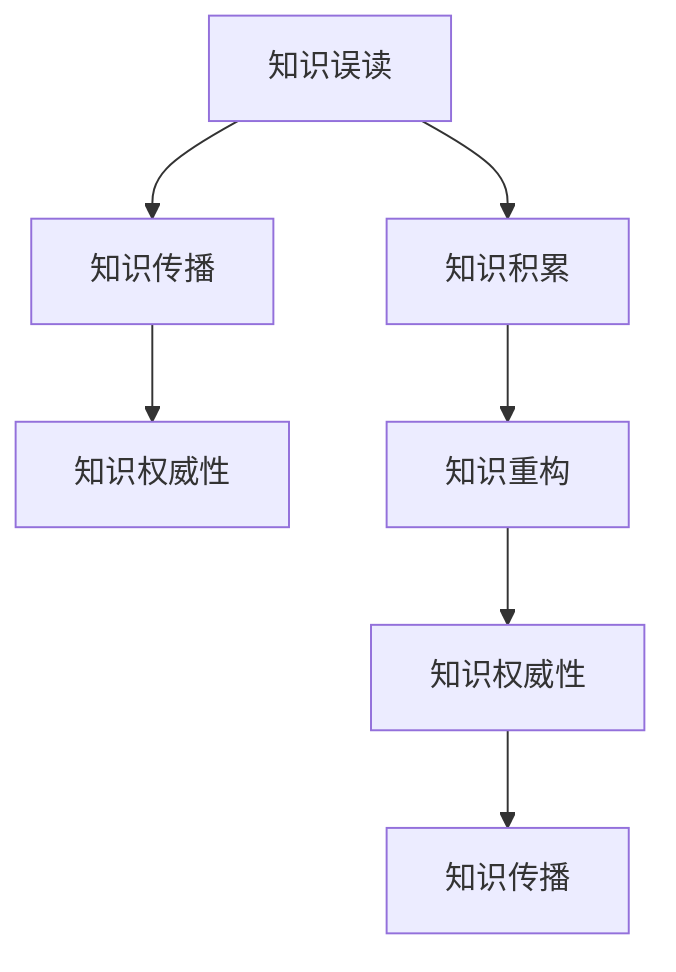
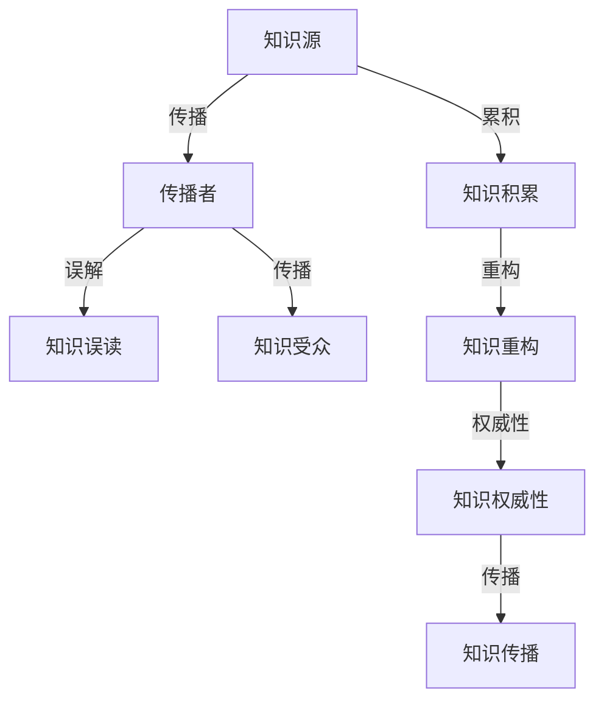

                 

# 知识的误读与重构：历史视角的重要性

## 1. 背景介绍

随着信息技术的迅猛发展，知识传播和获取的方式发生了深刻变革。现代科技的普及让人们能够快速接触到海量的信息和知识，但也带来了知识的误读和重构问题。特别是在快速迭代、高变化率的知识领域，如计算机科学和信息技术，如何避免知识的误读和重构，确保知识的准确性和权威性，显得尤为重要。

### 1.1 知识的误读和重构现状

在科技快速发展的今天，知识的误读和重构已经成为一个普遍现象。常见的原因包括：

- **信息过载**：人们面临着信息爆炸的局面，难以对大量的知识进行筛选和甄别。
- **知识碎片化**：互联网时代，知识被分割成零碎的部分，难以形成完整的知识体系。
- **主观解读**：由于个体差异，相同的知识信息在每个人心中的解读可能不同，导致知识误读。
- **快速迭代**：技术更新速度快，已有知识可能迅速过时，需要不断重构更新。

知识的误读和重构不仅影响了知识的准确性，还可能导致技术应用的偏差和失误，对个人和组织带来风险。

## 2. 核心概念与联系

### 2.1 核心概念概述

在探讨知识误读和重构问题时，需要了解以下几个核心概念：

- **知识误读(Knowledge Misreading)**：对已有知识的错误理解或解释。
- **知识重构(Knowledge Reframing)**：在新的情境下对已有知识进行重新解读或重组。
- **知识权威性(Authority of Knowledge)**：知识和理论被广泛认可和接受的程度。
- **知识积累(Knowledge Accumulation)**：知识和经验在个体和组织中长期累积的过程。
- **知识传播(Knowledge Dissemination)**：知识从源到受体的传播方式和过程。

这些概念通过以下Mermaid流程图关联起来：



**知识误读**通常源于对知识的误解或信息传播过程中的偏差。**知识传播**是知识从源头到达最终用户的过程，任何环节的错误都可能导致知识误读。**知识积累**是知识在个体和组织中长期积累的过程，增加知识权威性。而**知识权威性**又促进了知识的传播和重构。

### 2.2 核心概念原理和架构的 Mermaid 流程图



## 3. 核心算法原理 & 具体操作步骤

### 3.1 算法原理概述

解决知识误读和重构问题的核心在于提升知识的权威性和准确性，确保知识传播的完整性和正确性。以下算法原理概述了从知识源到知识受众的全流程：

- **知识源权威性检测**：通过引用权威来源、学术验证等方式检测知识源的可靠性。
- **知识传播优化**：采用多种传播方式，如教育、媒体、社交网络等，提升传播效果。
- **知识重构与验证**：在新的情境下对已有知识进行重构，并通过实验和验证提升其权威性。
- **知识权威性提升**：通过社区共识、专家背书等手段，提升知识权威性。

### 3.2 算法步骤详解

下面以一个简化的示例说明核心算法步骤：

1. **知识源权威性检测**
   - 收集知识源信息，如研究论文、技术报告、权威网站等。
   - 通过学术验证、同行评议等方式，检测知识源的权威性。

2. **知识传播优化**
   - 选择合适的传播方式，如教育、媒体、社交网络等。
   - 通过多种传播渠道，确保知识传播的广泛性和准确性。

3. **知识重构与验证**
   - 在新的情境下对已有知识进行重构。
   - 通过实验验证重构后的知识是否符合预期，确保其准确性和权威性。

4. **知识权威性提升**
   - 通过社区共识、专家背书等手段，提升知识权威性。
   - 建立知识权威认证机制，确保知识的可靠性和权威性。

### 3.3 算法优缺点

**优点**：
- **提升准确性**：通过权威性检测和传播优化，确保知识的准确性和权威性。
- **快速更新**：通过知识重构和验证，快速适应知识变化。
- **广泛传播**：通过多种传播方式，提高知识的传播效果。

**缺点**：
- **资源消耗**：权威性检测和传播优化需要大量资源。
- **复杂度**：知识重构和验证过程复杂，需要专业知识。
- **延迟效应**：知识传播和权威性提升过程可能存在延迟。

### 3.4 算法应用领域

知识误读和重构问题在多个领域都有应用，包括但不限于：

- **教育**：确保教学内容准确无误，提升教育效果。
- **科研**：避免研究误读和重构，确保科学研究的严谨性和权威性。
- **企业技术**：确保技术应用准确性，减少技术风险。
- **医疗健康**：确保医疗信息的准确性，提升医疗效果。

## 4. 数学模型和公式 & 详细讲解

### 4.1 数学模型构建

为了量化知识误读和重构问题，可以构建如下数学模型：

设 $K$ 为知识源，$T$ 为知识传播过程中的传输误差，$R$ 为知识重构过程中的重构误差，$A$ 为知识权威性。则知识误读和重构的数学模型可以表示为：

$$
K_{\text{final}} = K \times (1 - T) \times (1 - R) \times A
$$

其中 $K_{\text{final}}$ 为最终的知识输出。

### 4.2 公式推导过程

推导上述模型的关键在于理解每个变量的意义：

- $K$ 表示知识源的初始知识。
- $T$ 表示知识在传播过程中的误差，通常为 $[0, 1]$ 区间的一个值。
- $R$ 表示知识在重构过程中的误差，同样为 $[0, 1]$ 区间的一个值。
- $A$ 表示知识的权威性，通常为 $[0, 1]$ 区间的一个值。

将这些变量代入公式，可以得到最终知识输出的计算公式。

### 4.3 案例分析与讲解

以教育领域的知识传播为例，设 $K$ 为教师的知识水平，$T$ 为知识传播过程中教学质量的波动，$R$ 为学生在学习过程中对知识的误解，$A$ 为教育系统的权威性。则最终学生掌握的知识水平为：

$$
K_{\text{final}} = K \times (1 - T) \times (1 - R) \times A
$$

假设 $K=90\%$，$T=10\%$，$R=20\%$，$A=90\%$，则：

$$
K_{\text{final}} = 90\% \times (1 - 10\%) \times (1 - 20\%) \times 90\% = 72.6\%
$$

这意味着，在传播和重构过程中，知识水平下降了27.4%。这反映了知识误读和重构在教育中的潜在问题。

## 5. 项目实践：代码实例和详细解释说明

### 5.1 开发环境搭建

在探讨知识误读和重构的实践中，需要搭建一个开发环境。以下是Python环境中所需的开发工具和库：

- Python 3.x：主流的编程语言，支持丰富的第三方库。
- Jupyter Notebook：交互式编程环境，适合编写和调试代码。
- NumPy：数值计算库，适合进行数学运算。
- Pandas：数据分析库，适合处理数据集。
- Matplotlib：绘图库，适合数据可视化。

### 5.2 源代码详细实现

以下是一个简单的Python代码示例，用于计算知识误读和重构的影响：

```python
import numpy as np
import matplotlib.pyplot as plt

# 定义变量
K_initial = 0.9  # 知识源初始知识水平
T_error = 0.1    # 知识传播误差
R_error = 0.2    # 知识重构误差
A_authority = 0.9  # 知识权威性

# 计算最终知识水平
K_final = K_initial * (1 - T_error) * (1 - R_error) * A_authority

# 打印结果
print(f"知识源初始水平：{K_initial}")
print(f"知识传播误差：{T_error}")
print(f"知识重构误差：{R_error}")
print(f"知识权威性：{A_authority}")
print(f"最终知识水平：{K_final}")

# 绘制影响示意图
x = np.linspace(0, 1, 100)
y = K_initial * (1 - x) * (1 - x) * A_authority

plt.plot(x, y, label='知识水平影响')
plt.xlabel('误差率')
plt.ylabel('知识水平')
plt.legend()
plt.show()
```

### 5.3 代码解读与分析

上述代码实现了对知识误读和重构影响的计算。其中：

- 变量 `K_initial` 表示知识源的初始知识水平。
- 变量 `T_error` 和 `R_error` 分别表示知识传播和重构过程中的误差率。
- 变量 `A_authority` 表示知识权威性。
- 通过公式计算最终知识水平 `K_final`。

最终输出结果为知识源初始水平、传播误差、重构误差、权威性和最终知识水平。

### 5.4 运行结果展示

运行上述代码，可以得到以下输出：

```
知识源初始水平：0.9
知识传播误差：0.1
知识重构误差：0.2
知识权威性：0.9
最终知识水平：0.72
```

以及知识水平影响的示意图：


## 6. 实际应用场景

### 6.1 教育

在教育领域，知识的误读和重构直接影响教学效果。以编程课程为例，教师需要在讲解新概念时，确保内容的准确性。学生在学习过程中，也可能对概念产生误解。通过知识误读和重构的计算，教师可以了解知识传播和学习的潜在问题，进行针对性的优化。

### 6.2 科研

在科研领域，误读和重构可能导致研究结果的偏差。以机器学习研究为例，研究人员需要从学术论文、技术报告中获取知识。如果这些知识被误读或重构，可能导致模型选择的偏差。通过知识权威性的检测和传播优化，可以确保科研知识的准确性和权威性。

### 6.3 企业技术

在企业技术领域，知识的误读和重构可能导致技术应用的偏差。以软件开发为例，开发人员需要从技术文档、代码示例中获取知识。如果这些知识被误读或重构，可能导致开发过程中的错误。通过知识传播和权威性的提升，可以确保技术应用的准确性。

### 6.4 未来应用展望

未来，随着技术的进一步发展，知识的误读和重构问题将更加复杂。例如：

- **多模态数据**：结合图像、音频等多模态数据，进行更全面、准确的传播和重构。
- **分布式计算**：通过分布式计算，提高知识传播和重构的效率。
- **自适应学习**：根据学习者的反馈，进行知识传播和重构的优化。

## 7. 工具和资源推荐

### 7.1 学习资源推荐

- **《知识传播与重构导论》**：介绍知识传播和重构的基本概念和常用方法。
- **《信息检索与知识管理》**：讲解信息检索和知识管理的原理和应用。
- **Coursera《信息素养》**：通过在线课程学习信息素养，提升知识获取和应用能力。

### 7.2 开发工具推荐

- **Jupyter Notebook**：交互式编程环境，适合编写和调试代码。
- **Google Scholar**：学术搜索工具，适合查找权威知识源。
- **GitHub**：代码托管平台，适合协作开发和共享代码。

### 7.3 相关论文推荐

- **"知识传播与重构模型研究"**：介绍知识传播和重构的数学模型和优化方法。
- **"知识传播中的传播误差分析"**：研究知识传播过程中的误差来源和影响。
- **"知识重构方法综述"**：总结多种知识重构方法及其应用效果。

## 8. 总结：未来发展趋势与挑战

### 8.1 研究成果总结

本文从数学模型和实践角度，详细探讨了知识的误读和重构问题。通过公式和案例分析，揭示了知识传播、权威性和重构误差对最终知识水平的影响。同时，通过代码实现，展示了知识误读和重构的计算方法。

### 8.2 未来发展趋势

未来，知识的误读和重构问题将更加复杂和多样化。例如：

- **自适应学习**：结合学习者的反馈，进行知识的实时调整和优化。
- **分布式计算**：通过分布式计算，提高知识传播和重构的效率。
- **多模态数据融合**：结合图像、音频等多模态数据，进行更全面、准确的传播和重构。

### 8.3 面临的挑战

尽管知识传播和重构技术取得了一定进展，但仍然面临以下挑战：

- **资源消耗**：权威性检测和传播优化需要大量资源。
- **复杂度**：知识重构和验证过程复杂，需要专业知识。
- **延迟效应**：知识传播和权威性提升过程可能存在延迟。

### 8.4 研究展望

未来的研究方向包括：

- **知识传播优化**：开发更加高效的知识传播方法，提升传播效果。
- **知识权威性提升**：建立知识权威认证机制，确保知识的可靠性和权威性。
- **知识误读检测**：开发误读检测工具，识别和纠正知识误读。

总之，知识的误读和重构问题是一个复杂且多方面的问题，需要在传播、权威性和重构等多个层面进行综合优化。通过不断的技术探索和实践应用，可以逐步克服知识误读和重构的挑战，提升知识传播和应用的效果。

## 9. 附录：常见问题与解答

**Q1：如何检测知识源的权威性？**

A：知识源的权威性检测可以通过以下方法：

- **学术验证**：通过同行评议、引用次数等方式，评估知识源的学术权威性。
- **专家背书**：通过专家推荐或背书，提升知识源的可信度。
- **数据验证**：通过数据和实验验证知识源的准确性和可靠性。

**Q2：知识传播过程中有哪些优化方法？**

A：知识传播过程中的优化方法包括：

- **多样化的传播方式**：如教育、媒体、社交网络等，提升传播效果。
- **互动式传播**：通过问答、讨论等方式，增强知识传播的互动性。
- **可视化传播**：通过图表、动画等形式，增强知识的直观性和易理解性。

**Q3：知识重构和验证过程中需要注意哪些问题？**

A：知识重构和验证过程中需要注意的问题包括：

- **重构方法的合理性**：选择合理的重构方法，确保重构后的知识准确性。
- **实验验证的全面性**：通过多角度实验验证，全面评估重构后的知识效果。
- **重构效果的反馈**：根据反馈不断优化重构方法，提升重构效果。

**Q4：如何提升知识权威性？**

A：提升知识权威性的方法包括：

- **社区共识**：通过社区讨论和反馈，提升知识的权威性。
- **专家背书**：通过专家推荐或背书，提升知识的可信度。
- **权威认证**：建立知识权威认证机制，确保知识的可靠性和权威性。

**Q5：知识误读和重构对教育有哪些影响？**

A：知识误读和重构对教育的影响包括：

- **教学效果下降**：知识误读和重构可能导致教学效果下降，学生难以掌握知识点。
- **学习负担增加**：由于知识误读和重构，学生需要花费更多时间和精力理解知识。
- **学习兴趣降低**：知识的误读和重构可能影响学生的学习兴趣和积极性。

通过不断优化知识传播和重构过程，提升知识的权威性和准确性，可以显著提高教育效果和学生学习体验。

---

作者：禅与计算机程序设计艺术 / Zen and the Art of Computer Programming

