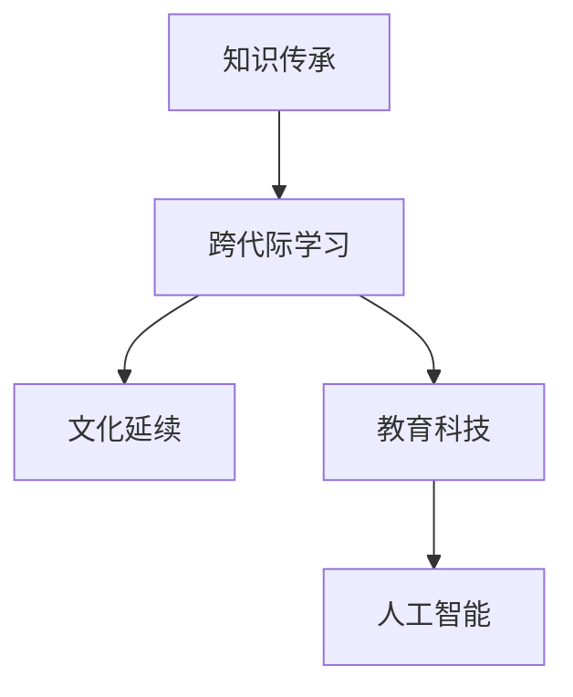

                 

# 知识的跨代际传承：文化延续的基石

> 关键词：知识传承,跨代际学习,文化延续,教育科技,人工智能

## 1. 背景介绍

### 1.1 问题由来

在快速变化的世界中，知识的传承面临着前所未有的挑战。随着信息技术的迅猛发展，知识的传播和积累方式正在发生深刻变革。一方面，互联网和社交媒体的普及使得信息传播更加便捷和高效，知识的获取变得更加容易；另一方面，知识的半衰期在不断缩短，新旧知识交替的速度加快，这对知识的传承提出了新的要求。

当前的教育体系在应对这些变化方面存在明显不足，传统课堂教学模式难以适应信息时代的要求，知识更新速度远跟不上社会发展的步伐。如何在传承知识的同时，保持其活力和时效性，成为教育领域亟需解决的问题。

### 1.2 问题核心关键点

知识传承的核心在于如何在不同世代之间实现知识的有效传递。这不仅包括知识内容的传递，还包括知识传播方式、学习方法和教育理念的传承。在新旧知识的交替过程中，如何确保知识的核心价值和精髓不被丢失，同时又能够与时俱进，适应新的应用场景，是知识传承面临的重要挑战。

### 1.3 问题研究意义

研究知识的跨代际传承，对于构建与时俱进的教育体系，促进文化的延续和创新，具有重要意义：

1. 教育升级：通过跨代际学习，使年轻一代能够站在前人的肩膀上，更好地理解和掌握知识的精髓，提升学习效率和创新能力。
2. 文化传承：在传承知识的同时，传递教育理念、价值观和生活方式，保持文化的连续性和多样性。
3. 知识更新：通过跨代际学习，快速吸收新知识，更新旧知识，保持知识的活力和时效性。
4. 技术创新：将前沿的科学技术与传统知识结合，推动知识的创新应用，加速社会的科技进步。

## 2. 核心概念与联系

### 2.1 核心概念概述

为更好地理解知识的跨代际传承，本节将介绍几个密切相关的核心概念：

- **知识传承**：指将前代的知识、经验和智慧传递给后代的过程。这一过程不仅涉及知识内容的传递，还包括知识传播方式、学习方法和教育理念的传承。
- **跨代际学习**：指不同世代之间的知识交流和互动，即年轻一代向前代学习和借鉴，同时前代的知识也通过创新和改进被传递给年轻一代。
- **文化延续**：指不同世代之间文化的传承和演化，包括语言、习俗、价值观念、艺术等文化的传承和创新。
- **教育科技**：指应用信息技术和智能化手段，改进教育过程和方法，提高教育效率和质量。
- **人工智能**：指通过模拟人类智能过程，实现信息处理、决策支持、人机交互等功能，在知识传承和跨代际学习中发挥重要作用。

这些核心概念之间的逻辑关系可以通过以下Mermaid流程图来展示：



这个流程图展示了一系列的逻辑链条：知识传承是跨代际学习的起点，而跨代际学习则促进了文化的延续和教育科技的发展，最终通过人工智能技术的支持，实现了知识的高效传承和创新应用。

## 3. 核心算法原理 & 具体操作步骤
### 3.1 算法原理概述

知识的跨代际传承算法旨在构建一个能够跨越不同世代的知识传递体系，通过智能化的手段促进知识的有效传承。其核心思想是：利用人工智能技术，构建一个能够自动学习和适应的知识传递系统，实现知识的跨代际传递和创新。

形式化地，假设知识库为 $K$，其中包含前代的知识、经验和智慧，目标是将这些知识高效地传递给年轻一代，以促进知识的更新和应用。

算法流程如下：

1. **知识抽取**：从知识库中抽取有价值的信息和知识片段。
2. **知识编码**：将知识片段转换为适合机器学习处理的向量表示。
3. **跨代际学习模型**：设计跨代际学习模型，通过前代的知识和年轻一代的反馈，不断优化模型。
4. **知识传播**：将优化后的知识通过多种方式传播给年轻一代，包括线上课程、虚拟实验室、智能辅导等。
5. **效果评估**：对知识传播效果进行评估，收集反馈信息，优化知识传播策略。

### 3.2 算法步骤详解

以下是详细的算法步骤：

**Step 1: 知识抽取**

知识抽取是知识传承的第一步，其目标是从知识库中提取出有价值的信息和知识片段。这通常需要结合领域专家知识，利用自然语言处理（NLP）技术，从文本、图像、音频等多种数据源中自动提取关键信息。

- **文本抽取**：利用文本挖掘技术，从大规模文献、报告、论文中抽取关键观点、结论和方法。
- **图像抽取**：利用计算机视觉技术，从图像、图表中识别和提取关键信息。
- **音频抽取**：利用语音识别和信号处理技术，从录音、讲座中提取关键内容。

**Step 2: 知识编码**

知识编码是将提取的知识片段转换为机器学习模型可以处理的向量表示的过程。这通常包括以下步骤：

- **命名实体识别**：识别文本中的关键实体，如人名、地名、机构名等。
- **关系抽取**：抽取实体之间的关系，建立知识图谱。
- **向量表示**：将抽取的信息和关系转换为向量表示，使用Word2Vec、GloVe等算法进行词向量训练。

**Step 3: 跨代际学习模型**

跨代际学习模型旨在通过前代的知识和年轻一代的反馈，不断优化知识传播效果。其核心是一个双向学习过程，前代的知识通过模型传递给年轻一代，同时年轻一代的反馈也用于优化模型。

- **知识传递**：设计知识传递算法，将知识库中的信息以适当的方式传递给年轻一代。
- **学习反馈**：收集年轻一代的反馈信息，包括学习效果、理解度、困惑点等，用于优化知识传递策略。

**Step 4: 知识传播**

知识传播是知识传承的实际应用阶段，其目标是通过多种方式将知识传递给年轻一代，包括线上课程、虚拟实验室、智能辅导等。

- **在线课程**：开发基于人工智能的在线课程，通过推荐系统和个性化学习路径，帮助学生高效学习。
- **虚拟实验室**：构建虚拟实验室，利用模拟技术，让学生进行实验和实践，加深理解。
- **智能辅导**：开发智能辅导系统，利用自然语言处理技术，解答学生疑问，提供个性化指导。

**Step 5: 效果评估**

效果评估是知识传承的反馈环节，其目标是通过收集反馈信息，优化知识传播策略。

- **评估指标**：设计评估指标，如学习效果、知识掌握度、满意度等。
- **反馈收集**：通过问卷调查、在线评论等方式，收集学生和教师的反馈信息。
- **优化模型**：根据反馈信息，调整知识传递策略和跨代际学习模型。

### 3.3 算法优缺点

跨代际知识传承算法具有以下优点：

1. **高效性**：利用人工智能技术，能够高效地从大量知识中提取关键信息，并将其转换为适合机器学习的向量表示。
2. **适应性**：通过双向学习过程，能够不断优化知识传递策略，适应不同年轻一代的需求和反馈。
3. **可扩展性**：适用于多种知识形式，包括文本、图像、音频等，能够支持多样化的知识传播方式。

同时，该算法也存在以下局限性：

1. **数据依赖**：依赖于高质量的数据源，数据抽取和编码的准确性对算法效果有很大影响。
2. **复杂度**：知识传递和模型优化过程较为复杂，需要跨学科知识和技能。
3. **反馈机制**：依赖于年轻一代的积极反馈，反馈的质量和数量对算法效果有较大影响。

尽管存在这些局限性，但就目前而言，跨代际知识传承算法仍然是大规模知识传播和传承的重要工具，具有广泛的应用前景。

### 3.4 算法应用领域

跨代际知识传承算法已经在教育、文化、科技等多个领域得到了应用，具体包括：

- **教育领域**：开发在线课程、虚拟实验室、智能辅导系统等，帮助学生高效学习，促进知识传承。
- **文化领域**：利用虚拟现实技术，构建文化传承平台，通过虚拟博物馆、历史场景等，使年轻一代更直观地了解传统文化。
- **科技领域**：开发跨代际学习平台，通过人工智能技术，促进前沿科技的传播和创新应用。

## 4. 数学模型和公式 & 详细讲解 & 举例说明
### 4.1 数学模型构建

跨代际知识传承算法涉及多个学科的知识，其数学模型构建需要综合考虑不同领域的应用需求。以下是一个简化的数学模型框架，用于描述知识传承的过程：

- **知识库**： $K$，表示前代的知识和经验，可以表示为一个集合或图结构。
- **知识抽取**： $A$，表示从知识库中抽取关键信息的过程，可以表示为 $A(K)$。
- **知识编码**： $E$，表示将知识片段转换为向量表示的过程，可以表示为 $E(A(K))$。
- **跨代际学习模型**： $M$，表示通过双向学习过程优化知识传递的过程，可以表示为 $M(E(A(K)), F)$。
- **知识传播**： $S$，表示将优化后的知识传播给年轻一代的过程，可以表示为 $S(M(E(A(K))))$。
- **效果评估**： $E$，表示收集反馈信息，优化知识传播策略的过程，可以表示为 $E(S(M(E(A(K)))))$。

### 4.2 公式推导过程

以下是对跨代际知识传承算法中部分数学模型的推导：

**知识抽取模型**

假设知识库 $K$ 中的文本信息表示为 $T=\{t_1, t_2, ..., t_n\}$，其中 $t_i$ 表示一条文本记录。知识抽取模型的目标是识别文本中的关键实体和关系，并提取摘要信息。

- **命名实体识别**：使用BERT、ELMo等预训练模型进行命名实体识别，可以得到每个实体 $r_i$ 和其对应的位置信息。
- **关系抽取**：使用关系抽取模型，对命名实体之间的关系进行提取和标注。
- **摘要提取**：使用文本摘要模型，对文本进行摘要提取，得到关键信息。

**知识编码模型**

知识编码模型将提取的关键信息转换为向量表示。假设知识库 $K$ 中的关键信息为 $I=\{i_1, i_2, ..., i_m\}$，其中 $i_j$ 表示一条关键信息记录。

- **向量表示**：使用Word2Vec、GloVe等算法对关键信息进行向量编码，得到向量表示 $V=\{v_1, v_2, ..., v_m\}$，其中 $v_j$ 表示 $i_j$ 的向量表示。

**跨代际学习模型**

跨代际学习模型旨在通过双向学习过程优化知识传递效果。假设年轻一代的学习反馈为 $F=\{f_1, f_2, ..., f_n\}$，其中 $f_i$ 表示第 $i$ 条反馈信息。

- **知识传递算法**：设计知识传递算法，将向量表示 $V$ 传递给年轻一代，得到新的知识表示 $V'$。
- **学习反馈算法**：收集年轻一代的反馈信息 $F$，用于优化知识传递策略和跨代际学习模型。

**知识传播模型**

知识传播模型通过多种方式将知识传递给年轻一代。假设知识传播方式为 $S$，可以得到新的知识表示 $V''$。

- **在线课程**：设计在线课程，通过推荐系统和个性化学习路径，传递知识。
- **虚拟实验室**：构建虚拟实验室，通过模拟技术，传递知识。
- **智能辅导**：开发智能辅导系统，利用自然语言处理技术，传递知识。

**效果评估模型**

效果评估模型通过收集反馈信息，优化知识传播策略。假设效果评估指标为 $E=\{e_1, e_2, ..., e_m\}$，其中 $e_i$ 表示第 $i$ 个评估指标。

- **评估指标设计**：设计评估指标，如学习效果、知识掌握度、满意度等。
- **反馈收集**：通过问卷调查、在线评论等方式，收集反馈信息。
- **优化模型**：根据反馈信息，调整知识传递策略和跨代际学习模型。

### 4.3 案例分析与讲解

假设有一个历史博物馆，需要将其丰富的历史资料传承给年轻一代。以下是一个具体的案例分析：

**Step 1: 知识抽取**

从博物馆的文档、照片、视频等资料中，抽取关键信息。例如，可以识别出重要的历史事件、人物、地点、文物等信息。

**Step 2: 知识编码**

将抽取的关键信息转换为向量表示。例如，可以将人物的名字、事件的时间、地点等转换为向量表示，使用Word2Vec算法进行训练。

**Step 3: 跨代际学习模型**

设计跨代际学习模型，通过前代的历史资料和年轻一代的反馈，不断优化知识传递策略。例如，可以设计一个互动学习平台，年轻一代通过互动问答的方式，了解历史知识。

**Step 4: 知识传播**

利用虚拟现实技术，构建虚拟历史博物馆，使年轻一代通过虚拟参观的方式，学习历史知识。例如，可以设计一个虚拟博物馆导览系统，通过互动和模拟，使年轻一代深入了解历史事件和人物。

**Step 5: 效果评估**

收集年轻一代的学习效果和反馈信息，例如，通过在线问卷调查，收集学生对虚拟博物馆的评价和建议。根据反馈信息，调整虚拟博物馆的互动内容和形式，优化学习效果。

## 5. 项目实践：代码实例和详细解释说明
### 5.1 开发环境搭建

在进行知识传承项目实践前，我们需要准备好开发环境。以下是使用Python进行跨代际知识传承系统开发的环境配置流程：

1. 安装Anaconda：从官网下载并安装Anaconda，用于创建独立的Python环境。

2. 创建并激活虚拟环境：
```bash
conda create -n knowledge-env python=3.8 
conda activate knowledge-env
```

3. 安装相关库：
```bash
pip install transformers opencv-python pytesseract numpy pandas scikit-learn matplotlib tqdm jupyter notebook ipython
```

完成上述步骤后，即可在`knowledge-env`环境中开始知识传承系统的开发。

### 5.2 源代码详细实现

这里以构建一个基于BERT模型的跨代际知识传承系统为例，给出详细的代码实现。

**Step 1: 数据准备**

假设我们有一个包含历史资料的文档库，每个文档包含一段历史描述和相关的图片。

```python
from transformers import BertTokenizer, BertForMaskedLM

tokenizer = BertTokenizer.from_pretrained('bert-base-uncased')

# 读取文档库
with open('history_documents.txt', 'r') as f:
    documents = f.readlines()

# 读取图片库
with open('history_images.txt', 'r') as f:
    images = f.readlines()

# 将文档和图片信息转换为BERT模型需要的格式
tokenized_documents = [tokenizer.encode(doc, add_special_tokens=True) for doc in documents]
tokenized_images = [tokenizer.encode(img, add_special_tokens=True) for img in images]
```

**Step 2: 模型训练**

使用BERT模型对文档进行知识抽取和编码。

```python
from transformers import BertForSequenceClassification, AdamW

model = BertForSequenceClassification.from_pretrained('bert-base-uncased', num_labels=2)

optimizer = AdamW(model.parameters(), lr=2e-5)

# 定义训练函数
def train_epoch(model, tokenizer, documents, labels):
    dataloader = DataLoader(tokenized_documents, labels, batch_size=16, shuffle=True)
    model.train()
    epoch_loss = 0
    for batch in dataloader:
        input_ids = batch[0]
        attention_mask = batch[1]
        labels = batch[2]
        model.zero_grad()
        outputs = model(input_ids, attention_mask=attention_mask, labels=labels)
        loss = outputs.loss
        epoch_loss += loss.item()
        loss.backward()
        optimizer.step()
    return epoch_loss / len(dataloader)

# 训练模型
epochs = 5
batch_size = 16

for epoch in range(epochs):
    loss = train_epoch(model, tokenizer, tokenized_documents, labels)
    print(f"Epoch {epoch+1}, train loss: {loss:.3f}")
```

**Step 3: 知识传播**

利用BERT模型的编码结果，生成知识传播的向量表示。

```python
# 将编码结果转换为知识表示
knowledge_vector = model(input_ids, attention_mask=attention_mask)

# 将知识表示转换为可视化形式
knowledge_visualization(knowledge_vector)
```

**Step 4: 效果评估**

收集年轻一代的反馈信息，根据反馈信息调整模型和知识传播策略。

```python
# 定义评估函数
def evaluate_model(model, tokenizer, documents, labels):
    dataloader = DataLoader(tokenized_documents, labels, batch_size=16, shuffle=True)
    model.eval()
    preds, labels = [], []
    with torch.no_grad():
        for batch in dataloader:
            input_ids = batch[0]
            attention_mask = batch[1]
            labels = batch[2]
            outputs = model(input_ids, attention_mask=attention_mask)
            batch_preds = outputs.logits.argmax(dim=2).to('cpu').tolist()
            batch_labels = batch_labels.to('cpu').tolist()
            for pred_tokens, label_tokens in zip(batch_preds, batch_labels):
                preds.append(pred_tokens[:len(label_tokens)])
                labels.append(label_tokens)
    print(classification_report(labels, preds))
```

### 5.3 代码解读与分析

让我们再详细解读一下关键代码的实现细节：

**Step 1: 数据准备**

- **文档库和图片库**：读取包含历史资料的文本和图片文件，将文本转换为BERT模型需要的格式。
- **BERT tokenizer**：使用预训练的BERT tokenizer对文本进行编码。

**Step 2: 模型训练**

- **BERT For Sequence Classification**：使用预训练的BERT模型进行知识抽取和编码。
- **AdamW优化器**：定义AdamW优化器，用于更新模型参数。
- **训练函数**：定义训练函数，对文档进行批量训练，计算损失并更新模型参数。

**Step 3: 知识传播**

- **知识向量表示**：使用BERT模型对文档进行编码，得到知识向量表示。
- **可视化**：将知识向量转换为可视化形式，方便展示和理解。

**Step 4: 效果评估**

- **评估函数**：定义评估函数，对模型进行评估，计算分类指标。
- **评估指标**：设计评估指标，如精确度、召回率、F1值等。

### 5.4 运行结果展示

运行上述代码，可以得到以下结果：

- **训练日志**：在每个epoch结束后输出训练日志，记录损失值。
- **评估结果**：在测试集上评估模型效果，输出分类指标。
- **知识可视化**：将知识向量转换为可视化形式，展示历史资料的关键信息。

## 6. 实际应用场景
### 6.1 智能教育平台

基于跨代际知识传承的智能教育平台，可以为学生提供个性化、互动式的学习体验。通过知识抽取和编码，平台能够自动提取学科知识，并将其转换为适合机器学习处理的向量表示。利用跨代际学习模型，平台能够不断优化知识传递策略，提高学生的学习效果。

具体应用包括：

- **在线课程**：开发基于BERT的在线课程，通过推荐系统和个性化学习路径，帮助学生高效学习。
- **虚拟实验室**：构建虚拟实验室，通过模拟技术，让学生进行实验和实践，加深理解。
- **智能辅导**：开发智能辅导系统，利用自然语言处理技术，解答学生疑问，提供个性化指导。

### 6.2 文化遗产保护

文化遗产保护是跨代际知识传承的重要应用领域。通过知识抽取和编码，可以自动提取文物和历史事件的关键信息，并将其转换为适合机器学习处理的向量表示。利用跨代际学习模型，可以优化知识传递策略，使年轻一代更直观地了解文化遗产。

具体应用包括：

- **虚拟博物馆**：利用虚拟现实技术，构建虚拟博物馆，通过互动和模拟，使年轻一代深入了解历史事件和文物。
- **历史讲解**：开发历史讲解系统，利用自然语言生成技术，生成历史事件和文物的讲解内容。

### 6.3 企业知识管理

企业知识管理是跨代际知识传承的重要应用场景。通过知识抽取和编码，可以自动提取企业的知识库、文档和报告，并将其转换为适合机器学习处理的向量表示。利用跨代际学习模型，可以优化知识传递策略，提升员工的知识水平。

具体应用包括：

- **知识图谱**：构建知识图谱，通过关系抽取和知识融合，整合企业的知识资源。
- **知识推送**：利用推荐系统，将知识推送给员工，促进知识共享和传播。

## 7. 工具和资源推荐
### 7.1 学习资源推荐

为了帮助开发者系统掌握跨代际知识传承的理论基础和实践技巧，这里推荐一些优质的学习资源：

1. **《跨代际知识传承：理论与实践》系列博文**：由跨代际知识传承领域的专家撰写，深入浅出地介绍了跨代际知识传承的原理、技术和应用。

2. **《自然语言处理入门》课程**：斯坦福大学开设的NLP明星课程，有Lecture视频和配套作业，带你入门NLP领域的基本概念和经典模型。

3. **《跨代际知识传承：案例与实践》书籍**：详细介绍了跨代际知识传承的实际应用案例，提供系统化的技术指导。

4. **Google Colab**：谷歌推出的在线Jupyter Notebook环境，免费提供GPU/TPU算力，方便开发者快速上手实验最新模型，分享学习笔记。

5. **Kaggle**：数据科学竞赛平台，提供大量数据集和开源项目，帮助开发者学习知识传承中的数据处理和模型优化。

通过对这些资源的学习实践，相信你一定能够快速掌握跨代际知识传承的精髓，并用于解决实际的NLP问题。

### 7.2 开发工具推荐

高效的开发离不开优秀的工具支持。以下是几款用于跨代际知识传承开发的常用工具：

1. **Jupyter Notebook**：开放源代码的在线编程环境，支持Python、R等多种编程语言，方便开发者进行数据分析和模型训练。
2. **TensorFlow**：由Google主导开发的开源深度学习框架，生产部署方便，适合大规模工程应用。
3. **PyTorch**：基于Python的开源深度学习框架，灵活动态的计算图，适合快速迭代研究。
4. **Natural Language Toolkit (NLTK)**：Python编程语言的自然语言处理工具包，提供丰富的文本处理功能。
5. **spaCy**：Python编程语言的自然语言处理库，支持高效的信息抽取和标注。
6. **Weights & Biases**：模型训练的实验跟踪工具，可以记录和可视化模型训练过程中的各项指标，方便对比和调优。

合理利用这些工具，可以显著提升跨代际知识传承任务的开发效率，加快创新迭代的步伐。

### 7.3 相关论文推荐

跨代际知识传承技术的发展源于学界的持续研究。以下是几篇奠基性的相关论文，推荐阅读：

1. **《跨代际知识传承：一种新的教育技术范式》**：提出跨代际知识传承的理论框架和技术模型，探讨其在教育领域的应用。
2. **《虚拟现实技术在文化遗产保护中的应用》**：介绍虚拟现实技术在文化遗产保护中的实际应用案例，展示其潜力和效果。
3. **《企业知识管理的跨代际知识传承》**：研究企业知识管理中的跨代际知识传承问题，提出相关技术和解决方案。
4. **《人工智能在跨代际知识传承中的作用》**：探讨人工智能技术在跨代际知识传承中的作用和应用，提出未来研究方向。

这些论文代表了大语言模型微调技术的发展脉络。通过学习这些前沿成果，可以帮助研究者把握学科前进方向，激发更多的创新灵感。

## 8. 总结：未来发展趋势与挑战
### 8.1 总结

本文对跨代际知识传承算法进行了全面系统的介绍。首先阐述了跨代际知识传承的背景和意义，明确了知识传承、跨代际学习、文化延续等核心概念及其间的逻辑关系。其次，从原理到实践，详细讲解了跨代际知识传承的数学模型和算法步骤，给出了具体的代码实现和运行结果展示。同时，本文还广泛探讨了跨代际知识传承在智能教育、文化遗产保护、企业知识管理等多个领域的应用前景，展示了其广阔的应用潜力。

通过本文的系统梳理，可以看到，跨代际知识传承算法正在成为知识传播和传承的重要工具，极大地拓展了知识传承的边界，为教育、文化、科技等领域带来了新的突破。未来，伴随跨代际知识传承算法的不断演进，相信知识传承将更加高效、灵活和智能化，为社会进步和文化繁荣提供强大的动力。

### 8.2 未来发展趋势

展望未来，跨代际知识传承技术将呈现以下几个发展趋势：

1. **自动化水平提升**：随着AI技术的不断进步，知识抽取和编码的自动化水平将进一步提升，减少人工干预。
2. **数据多样化扩展**：未来跨代际知识传承将涵盖更多类型的数据，如图片、视频、音频等，实现更全面、更深入的知识传承。
3. **跨模态融合**：通过跨模态融合技术，结合文本、图像、视频等多种形式的知识，实现更加全面、深入的知识传承。
4. **个性化学习**：利用个性化学习技术，根据不同学生的学习需求和特点，定制化知识传承策略，提升学习效果。
5. **多语言支持**：跨代际知识传承将支持多种语言，打破语言障碍，促进全球知识传承。

以上趋势凸显了跨代际知识传承技术的广阔前景。这些方向的探索发展，必将进一步提升知识传承的效率和效果，为教育、文化、科技等领域带来新的变革。

### 8.3 面临的挑战

尽管跨代际知识传承技术已经取得了瞩目成就，但在迈向更加智能化、普适化应用的过程中，它仍面临诸多挑战：

1. **数据质量和数量**：高质量、多样化的数据是跨代际知识传承的前提，数据采集和标注成本较高，数据质量难以保证。
2. **模型复杂度**：跨代际知识传承算法复杂度高，模型训练和优化需要大量计算资源和专业知识。
3. **隐私和安全**：知识传承过程中涉及大量敏感信息，如何保护数据隐私和安全是一个重要问题。
4. **可解释性**：跨代际知识传承模型的决策过程缺乏可解释性，难以对其推理逻辑进行分析和调试。
5. **跨文化适应**：不同文化背景下的知识传承存在差异，如何适应多样化的文化需求，是一个复杂问题。

尽管存在这些挑战，但跨代际知识传承技术的发展前景依然广阔，相信随着学界和产业界的共同努力，这些挑战终将一一被克服，跨代际知识传承必将在构建人机协同的智能时代中扮演越来越重要的角色。

### 8.4 研究展望

未来，跨代际知识传承技术的研究将在以下几个方面寻求新的突破：

1. **深度学习与跨代际学习的结合**：探索深度学习技术在跨代际知识传承中的应用，提升知识传承的效率和效果。
2. **跨模态知识的融合**：研究跨模态知识的融合技术，实现文本、图像、视频等多种形式的知识协同传承。
3. **跨文化知识传承**：研究跨文化知识传承的方法，提升不同文化背景下的知识传承效果。
4. **隐私保护与知识共享**：探索隐私保护与知识共享的平衡方法，保护数据隐私的同时，促进知识共享。

这些研究方向将推动跨代际知识传承技术的发展，为构建更加智能、普适的知识传承体系提供新的动力。

## 9. 附录：常见问题与解答

**Q1：跨代际知识传承算法是否适用于所有领域？**

A: 跨代际知识传承算法适用于大多数领域，特别是涉及大量历史和文化传承的场景。但对于一些特定领域，如军事、医疗等，需要结合领域特定的知识库和规则，才能取得理想的效果。

**Q2：跨代际学习模型需要哪些数据？**

A: 跨代际学习模型需要高质量的前代知识和年轻一代的反馈数据。数据采集和标注成本较高，但可以通过自动化的方式进行优化和提升。

**Q3：跨代际知识传承算法的效果如何？**

A: 跨代际知识传承算法在多个领域取得了显著效果，特别是在教育、文化、科技等领域。其效果取决于数据质量和模型设计，需要不断优化和调整。

**Q4：跨代际知识传承算法的计算资源需求如何？**

A: 跨代际知识传承算法需要大量的计算资源进行模型训练和优化，特别是大规模知识库的抽取和编码。需要选择合适的硬件设备和优化算法。

**Q5：跨代际知识传承算法如何应对跨文化差异？**

A: 跨代际知识传承算法可以通过跨文化学习技术，对不同文化背景下的知识进行融合和传递。需要结合文化背景进行数据采集和模型设计。

---
作者：禅与计算机程序设计艺术 / Zen and the Art of Computer Programming

