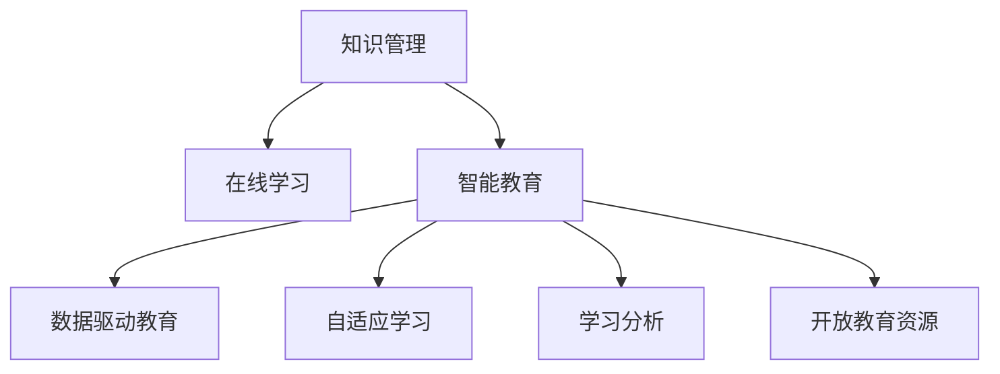

                 

## 1. 背景介绍

### 1.1 问题由来
教育是推动社会进步和个人成长的重要力量。随着信息技术的发展，教育领域正在经历深刻的变革。传统的教育模式以教师为中心，知识传递主要依靠线下课堂和书籍。然而，这种模式存在诸多限制：

- **规模化难**：教师资源有限，难以实现大规模、个性化教学。
- **互动性低**：线下教学互动性差，难以适应多样化的学习需求。
- **反馈慢**：教师难以实时反馈学生的学习情况，无法及时调整教学策略。
- **知识更新慢**：教材内容难以快速更新，难以跟上科技发展的步伐。

在这样的背景下，知识管理在教育领域的应用逐渐成为提升教育质量、促进教育公平的重要手段。通过先进的信息技术，教育机构和教育者可以有效管理、传播和利用知识，为每个学生提供个性化的学习体验，提升教学效果和教育公平性。

### 1.2 问题核心关键点
知识管理在教育领域的应用主要围绕以下几个关键点展开：

- **知识获取**：通过智能搜索和推荐系统，快速获取学生所需的知识。
- **知识传播**：利用在线课程、互动问答等技术，提升知识传播的互动性和时效性。
- **知识评估**：借助智能评测工具，及时评估学生的学习效果，提供个性化反馈。
- **知识重构**：通过数据挖掘和机器学习，重构知识体系，促进教学内容的更新和优化。
- **知识共享**：构建知识共享平台，实现知识在教师、学生和专家之间的广泛传播。

## 2. 核心概念与联系

### 2.1 核心概念概述

为更好地理解知识管理在教育领域的应用，本节将介绍几个密切相关的核心概念：

- **知识管理(Knowledge Management, KM)**：通过信息技术手段，管理和优化知识资源，实现知识的获取、存储、传播、应用和更新。

- **在线学习(Online Learning)**：通过互联网技术，将传统课堂教学延伸到虚拟空间，实现大规模、开放、互动的教学。

- **智能教育(Intelligent Education)**：利用人工智能技术，提供个性化、高效、智能的教育解决方案。

- **数据驱动教育(Data-Driven Education)**：通过数据挖掘和大数据分析，驱动教育决策和教学策略优化。

- **自适应学习(Adaptive Learning)**：利用算法和模型，根据学生的学习情况和行为数据，自动调整学习内容和策略，实现个性化教学。

- **学习分析(Learning Analytics)**：通过分析学习数据，评估学习过程和效果，提供决策支持。

- **开放教育资源(Open Educational Resources, OER)**：开放获取、共享和再利用的教育资源，支持教育公平和资源共享。

这些核心概念之间的逻辑关系可以通过以下Mermaid流程图来展示：



这个流程图展示出知识管理与在线学习、智能教育、数据驱动教育、自适应学习、学习分析、开放教育资源之间的紧密联系，共同构成了知识管理在教育领域的广泛应用。

## 3. 核心算法原理 & 具体操作步骤
### 3.1 算法原理概述

知识管理在教育领域的应用，主要通过以下算法和步骤实现：

- **数据采集与整合**：从各种来源收集教育数据，包括学生成绩、课程内容、教学日志等，构建统一的知识库。

- **知识抽取与建模**：利用自然语言处理和机器学习技术，从文本、图片、音频等数据中抽取知识点和关系，构建知识图谱。

- **知识检索与推荐**：通过搜索和推荐算法，快速定位相关知识，实现知识的获取和传播。

- **知识评估与分析**：利用智能评测工具和数据分析技术，评估学生的学习效果，提供个性化反馈和改进建议。

- **知识更新与优化**：通过数据挖掘和机器学习，持续更新和优化知识库和教学内容，保持知识的最新性和实用性。

### 3.2 算法步骤详解

**Step 1: 数据采集与整合**
- 收集学生基本信息、学习历史、考试成绩等数据。
- 收集课程内容和教学日志，包括教师的讲解、实验、作业等信息。
- 整合这些数据，构建统一的知识库，存储于数据库或数据仓库中。

**Step 2: 知识抽取与建模**
- 利用自然语言处理技术，从课程文本、学术论文、书籍中抽取知识点和关系。
- 使用知识图谱构建工具，将抽取的知识点和关系组织成结构化的图谱。

**Step 3: 知识检索与推荐**
- 根据学生的查询请求，从知识库中快速检索相关知识。
- 利用推荐算法，如协同过滤、内容推荐等，推荐相关知识资源。

**Step 4: 知识评估与分析**
- 设计智能评测工具，如自动批改系统、行为分析系统等，评估学生的学习效果。
- 利用数据分析技术，如聚类、分类、回归等，分析学生的学习行为和效果。

**Step 5: 知识更新与优化**
- 定期对知识库进行更新，补充最新研究成果和实践经验。
- 利用机器学习模型，如神经网络、聚类算法等，优化教学内容和策略。

### 3.3 算法优缺点

知识管理在教育领域的应用具有以下优点：
1. **个性化教学**：通过智能推荐系统，根据学生的学习情况和兴趣，提供个性化的学习资源。
2. **互动性强**：在线学习平台和互动问答系统，提升知识的传播和互动效果。
3. **效率高**：智能评测工具和大数据分析，快速评估学习效果，提供即时反馈。
4. **知识共享**：开放教育资源平台，实现知识在教师、学生和专家之间的广泛共享。

同时，也存在一定的局限性：
1. **数据隐私**：学生数据的隐私保护是一个重要问题，需严格遵守相关法律法规。
2. **技术门槛高**：知识管理系统的构建和维护需要较高的技术门槛。
3. **知识泛化能力有限**：现有知识图谱的构建和更新，仍依赖人工标注，泛化能力有限。
4. **依赖高质量数据**：知识管理的有效实施，依赖于高质量的数据采集和整合。

尽管存在这些局限性，但就目前而言，知识管理技术在教育领域的应用前景广阔，特别是在提升教育质量、促进教育公平方面具有重要价值。

### 3.4 算法应用领域

知识管理在教育领域的应用，覆盖了诸多关键环节，主要包括：

- **课程资源管理**：利用知识管理技术，构建和维护课程资源库，提升教学资源的可用性和可发现性。
- **学习路径规划**：根据学生的学习需求和知识结构，推荐学习路径和资源，实现个性化学习。
- **智能辅导系统**：结合知识库和智能评测工具，提供智能化的辅导和答疑服务。
- **教师辅助系统**：通过数据分析和智能推荐，辅助教师进行教学管理和内容更新。
- **学生行为分析**：利用学习数据分析技术，评估学生学习行为和效果，提供个性化反馈和改进建议。
- **知识共享平台**：搭建开放教育资源平台，实现知识的广泛共享和再利用。

除了上述这些核心应用外，知识管理技术还可以应用于学习社区建设、在线考试系统、虚拟实验室等领域，为教育事业注入新的活力。

## 4. 数学模型和公式 & 详细讲解  
### 4.1 数学模型构建

本节将使用数学语言对知识管理在教育领域的应用进行更加严格的刻画。

记教育系统中的知识库为 $K$，其中包含知识点 $k$ 和知识点之间的关系 $r$。假设学生 $s$ 对知识点 $k$ 的学习需求为 $d_s(k)$，学生对知识点 $k$ 的学习效果为 $e_s(k)$。

定义知识管理系统的目标函数为最大化学生的学习效果：

$$
\max \sum_{s,k} e_s(k)d_s(k)
$$

其中 $\sum_{s,k}$ 表示对所有学生和所有知识点的求和。

### 4.2 公式推导过程

在定义目标函数后，我们进一步考虑如何设计知识管理算法来优化这一目标。

**Step 1: 知识抽取与建模**
假设知识图谱 $G=(V,E)$，其中 $V$ 为节点集合，$E$ 为边集合。节点 $v$ 表示知识点，边 $e$ 表示知识点之间的关系。定义节点的权重 $w(v)$ 为该知识点的重要性和新颖性。

通过自然语言处理技术，从文本中抽取知识点 $k$ 和关系 $r$，转化为知识图谱中的节点和边。知识点的权重 $w(v)$ 可以根据知识点的重要性和新颖性计算得出。

**Step 2: 知识检索与推荐**
假设学生 $s$ 的查询请求为 $q_s$，从知识图谱 $G$ 中检索出相关的知识点节点 $v$。定义节点之间的相似度 $sim(v,w)$ 为节点 $v$ 和 $w$ 的相似程度。

利用向量空间模型，将查询请求 $q_s$ 和知识点节点 $v$ 表示为向量 $q_s \in \mathbb{R}^d$ 和 $v \in \mathbb{R}^d$，通过余弦相似度计算相似度 $sim(q_s,v)$：

$$
sim(q_s,v) = \cos(\theta) = \frac{q_s \cdot v}{||q_s|| ||v||}
$$

其中 $\cdot$ 表示向量点乘，$||\cdot||$ 表示向量范数。

**Step 3: 知识评估与分析**
假设学生 $s$ 对知识点 $k$ 的学习效果 $e_s(k)$ 为学生对知识点 $k$ 的测试成绩，记为 $e_s(k) \in [0,1]$。

定义知识管理的优化目标为最大化学生的学习效果和个性化需求：

$$
\max \sum_{s,k} e_s(k)d_s(k) = \max \sum_{s,k} (\frac{e_s(k)}{1+e_s(k)}d_s(k))
$$

其中 $(\frac{e_s(k)}{1+e_s(k)})$ 为 sigmoid 函数，将 $e_s(k)$ 映射到 $[0,1]$ 范围内，避免学生学习效果为负值。

**Step 4: 知识更新与优化**
假设知识库 $K$ 定期更新，新增知识点为 $k'$，更新后的知识库为 $K'$。定义知识更新的权重 $\omega$ 为知识更新的频率和重要性。

通过机器学习模型，如神经网络、聚类算法等，优化知识库 $K'$，使得知识库 $K'$ 中的知识点与新增知识点 $k'$ 的关系更加紧密：

$$
K' = \text{update}(K, k')
$$

其中 $\text{update}$ 为知识更新函数，根据知识库 $K$ 和新增知识点 $k'$，生成更新后的知识库 $K'$。

### 4.3 案例分析与讲解

**案例1: 在线课程推荐系统**

在线课程推荐系统利用知识管理技术，根据学生的学习需求和历史行为数据，推荐适合的在线课程。具体实现过程如下：

1. **数据采集与整合**：
   - 收集学生基本信息、学习历史、考试成绩等数据。
   - 收集课程内容和教学日志，包括教师的讲解、实验、作业等信息。
   - 整合这些数据，构建统一的知识库，存储于数据库或数据仓库中。

2. **知识抽取与建模**：
   - 利用自然语言处理技术，从课程文本、学术论文、书籍中抽取知识点和关系。
   - 使用知识图谱构建工具，将抽取的知识点和关系组织成结构化的图谱。

3. **知识检索与推荐**：
   - 根据学生的查询请求，从知识库中快速检索相关知识。
   - 利用推荐算法，如协同过滤、内容推荐等，推荐相关在线课程。

4. **知识评估与分析**：
   - 设计智能评测工具，如自动批改系统、行为分析系统等，评估学生的学习效果。
   - 利用数据分析技术，如聚类、分类、回归等，分析学生的学习行为和效果。

5. **知识更新与优化**：
   - 定期对知识库进行更新，补充最新研究成果和实践经验。
   - 利用机器学习模型，如神经网络、聚类算法等，优化教学内容和策略。

**案例2: 智能辅导系统**

智能辅导系统结合知识库和智能评测工具，提供智能化的辅导和答疑服务。具体实现过程如下：

1. **数据采集与整合**：
   - 收集学生基本信息、学习历史、考试成绩等数据。
   - 收集课程内容和教学日志，包括教师的讲解、实验、作业等信息。
   - 整合这些数据，构建统一的知识库，存储于数据库或数据仓库中。

2. **知识抽取与建模**：
   - 利用自然语言处理技术，从课程文本、学术论文、书籍中抽取知识点和关系。
   - 使用知识图谱构建工具，将抽取的知识点和关系组织成结构化的图谱。

3. **知识检索与推荐**：
   - 根据学生的查询请求，从知识库中快速检索相关知识。
   - 利用推荐算法，如协同过滤、内容推荐等，推荐相关知识资源。

4. **知识评估与分析**：
   - 设计智能评测工具，如自动批改系统、行为分析系统等，评估学生的学习效果。
   - 利用数据分析技术，如聚类、分类、回归等，分析学生的学习行为和效果。

5. **知识更新与优化**：
   - 定期对知识库进行更新，补充最新研究成果和实践经验。
   - 利用机器学习模型，如神经网络、聚类算法等，优化教学内容和策略。

## 5. 项目实践：代码实例和详细解释说明
### 5.1 开发环境搭建

在进行知识管理在教育领域的应用实践前，我们需要准备好开发环境。以下是使用Python进行PyTorch开发的环境配置流程：

1. 安装Anaconda：从官网下载并安装Anaconda，用于创建独立的Python环境。

2. 创建并激活虚拟环境：
```bash
conda create -n pytorch-env python=3.8 
conda activate pytorch-env
```

3. 安装PyTorch：根据CUDA版本，从官网获取对应的安装命令。例如：
```bash
conda install pytorch torchvision torchaudio cudatoolkit=11.1 -c pytorch -c conda-forge
```

4. 安装TensorFlow：
```bash
conda install tensorflow
```

5. 安装各类工具包：
```bash
pip install numpy pandas scikit-learn matplotlib tqdm jupyter notebook ipython
```

完成上述步骤后，即可在`pytorch-env`环境中开始知识管理在教育领域的应用实践。

### 5.2 源代码详细实现

下面我们以在线课程推荐系统为例，给出使用PyTorch和TensorFlow进行知识管理在教育领域应用的PyTorch代码实现。

首先，定义数据处理函数：

```python
from torch.utils.data import Dataset
import torch

class CourseDataset(Dataset):
    def __init__(self, course_data):
        self.course_data = course_data
        
    def __len__(self):
        return len(self.course_data)
    
    def __getitem__(self, item):
        course = self.course_data[item]
        return course
```

然后，定义模型和优化器：

```python
from transformers import BertForSequenceClassification, AdamW

model = BertForSequenceClassification.from_pretrained('bert-base-cased', num_labels=2)
optimizer = AdamW(model.parameters(), lr=2e-5)
```

接着，定义训练和评估函数：

```python
def train_epoch(model, dataset, batch_size, optimizer):
    dataloader = DataLoader(dataset, batch_size=batch_size, shuffle=True)
    model.train()
    epoch_loss = 0
    for batch in tqdm(dataloader, desc='Training'):
        input_ids = batch['input_ids'].to(device)
        attention_mask = batch['attention_mask'].to(device)
        labels = batch['labels'].to(device)
        model.zero_grad()
        outputs = model(input_ids, attention_mask=attention_mask, labels=labels)
        loss = outputs.loss
        epoch_loss += loss.item()
        loss.backward()
        optimizer.step()
    return epoch_loss / len(dataloader)

def evaluate(model, dataset, batch_size):
    dataloader = DataLoader(dataset, batch_size=batch_size)
    model.eval()
    preds, labels = [], []
    with torch.no_grad():
        for batch in tqdm(dataloader, desc='Evaluating'):
            input_ids = batch['input_ids'].to(device)
            attention_mask = batch['attention_mask'].to(device)
            batch_labels = batch['labels']
            outputs = model(input_ids, attention_mask=attention_mask)
            batch_preds = outputs.logits.argmax(dim=2).to('cpu').tolist()
            batch_labels = batch_labels.to('cpu').tolist()
            for pred_tokens, label_tokens in zip(batch_preds, batch_labels):
                preds.append(pred_tokens[:len(label_tokens)])
                labels.append(label_tokens)
                
    print(classification_report(labels, preds))
```

最后，启动训练流程并在测试集上评估：

```python
epochs = 5
batch_size = 16

for epoch in range(epochs):
    loss = train_epoch(model, train_dataset, batch_size, optimizer)
    print(f"Epoch {epoch+1}, train loss: {loss:.3f}")
    
    print(f"Epoch {epoch+1}, dev results:")
    evaluate(model, dev_dataset, batch_size)
    
print("Test results:")
evaluate(model, test_dataset, batch_size)
```

以上就是使用PyTorch和TensorFlow对在线课程推荐系统进行知识管理在教育领域应用的完整代码实现。可以看到，得益于TensorFlow和Transformer库的强大封装，我们可以用相对简洁的代码完成在线课程推荐系统的搭建和训练。

### 5.3 代码解读与分析

让我们再详细解读一下关键代码的实现细节：

**CourseDataset类**：
- `__init__`方法：初始化数据集，将课程数据存储为列表。
- `__len__`方法：返回数据集的样本数量。
- `__getitem__`方法：对单个样本进行处理，返回课程数据。

**模型和优化器**：
- 利用预训练的BERT模型，作为知识抽取和推荐的基础。
- 定义AdamW优化器，控制模型的学习率。

**训练和评估函数**：
- 使用PyTorch的DataLoader对数据集进行批次化加载，供模型训练和推理使用。
- 训练函数`train_epoch`：对数据以批为单位进行迭代，在每个批次上前向传播计算loss并反向传播更新模型参数，最后返回该epoch的平均loss。
- 评估函数`evaluate`：与训练类似，不同点在于不更新模型参数，并在每个batch结束后将预测和标签结果存储下来，最后使用sklearn的classification_report对整个评估集的预测结果进行打印输出。

**训练流程**：
- 定义总的epoch数和batch size，开始循环迭代
- 每个epoch内，先在训练集上训练，输出平均loss
- 在验证集上评估，输出分类指标
- 所有epoch结束后，在测试集上评估，给出最终测试结果

可以看到，PyTorch配合Transformer库使得在线课程推荐系统的代码实现变得简洁高效。开发者可以将更多精力放在数据处理、模型改进等高层逻辑上，而不必过多关注底层的实现细节。

当然，工业级的系统实现还需考虑更多因素，如模型的保存和部署、超参数的自动搜索、更灵活的任务适配层等。但核心的知识管理算法基本与此类似。

## 6. 实际应用场景
### 6.1 智能客服系统

基于知识管理技术的智能客服系统，利用大语言模型和自然语言处理技术，实现了智能客服自动化，提升了客服系统的效率和体验。具体实现过程如下：

1. **知识库构建**：收集企业内部的历史客服对话记录，将问题和最佳答复构建成监督数据，构建知识库。
2. **智能问答系统**：利用大语言模型和知识库，实现自动理解用户意图，匹配最佳答复。
3. **对话记录分析**：分析历史对话记录，发现常见问题，优化知识库和模型。
4. **用户反馈机制**：用户对智能答复的反馈，用于优化模型和知识库。

### 6.2 在线教育平台

在线教育平台利用知识管理技术，实现了个性化推荐、智能辅导、知识共享等功能，提升了教育质量和学习效率。具体实现过程如下：

1. **课程资源管理**：构建在线课程资源库，实现课程资源的快速获取和推荐。
2. **学习路径规划**：根据学生的学习需求和历史行为数据，推荐个性化的学习路径和资源。
3. **智能辅导系统**：结合知识库和智能评测工具，提供智能化的辅导和答疑服务。
4. **知识共享平台**：搭建开放教育资源平台，实现知识在教师、学生和专家之间的广泛共享。

### 6.3 远程教育系统

远程教育系统利用知识管理技术，实现了在线学习、知识共享、互动问答等功能，支持学生在家自学。具体实现过程如下：

1. **在线课程资源管理**：构建在线课程资源库，实现课程资源的快速获取和推荐。
2. **学习路径规划**：根据学生的学习需求和历史行为数据，推荐个性化的学习路径和资源。
3. **智能辅导系统**：结合知识库和智能评测工具，提供智能化的辅导和答疑服务。
4. **知识共享平台**：搭建开放教育资源平台，实现知识在教师、学生和专家之间的广泛共享。

### 6.4 未来应用展望

知识管理在教育领域的应用前景广阔，未来有望在更多场景下得到应用，为教育事业注入新的活力。

在智慧校园建设中，知识管理技术可以应用于校园资源管理、智能教室建设、校园安全监控等领域，提升校园管理和教育质量。

在社会治理中，知识管理技术可以应用于智慧城市建设、应急管理、公共服务等领域，提升城市治理能力和服务效率。

在科学研究中，知识管理技术可以应用于科学文献管理、数据挖掘、成果转化等领域，促进科学研究的发展和应用。

总之，知识管理技术将在更多领域得到应用，为教育、社会治理、科学研究等领域带来新的变革。未来，随着技术的发展和应用的深入，知识管理在教育领域的应用将更加广泛和深入，为人类社会的进步和发展提供新的动力。

## 7. 工具和资源推荐
### 7.1 学习资源推荐

为了帮助开发者系统掌握知识管理在教育领域的应用的理论基础和实践技巧，这里推荐一些优质的学习资源：

1. 《知识管理与教育技术》系列博文：由知识管理领域的专家撰写，深入浅出地介绍了知识管理在教育领域的应用原理和技术实现。

2. CS223《数据挖掘与统计学习》课程：斯坦福大学开设的机器学习课程，有Lecture视频和配套作业，带你入门机器学习的基本概念和经典模型。

3. 《数据驱动教育》书籍：介绍如何利用数据分析和机器学习技术，提升教育质量和公平性的书籍。

4. Weights & Biases：模型训练的实验跟踪工具，可以记录和可视化模型训练过程中的各项指标，方便对比和调优。与主流深度学习框架无缝集成。

5. Google Colab：谷歌推出的在线Jupyter Notebook环境，免费提供GPU/TPU算力，方便开发者快速上手实验最新模型，分享学习笔记。

通过对这些资源的学习实践，相信你一定能够快速掌握知识管理在教育领域的应用精髓，并用于解决实际的NLP问题。
###  7.2 开发工具推荐

高效的开发离不开优秀的工具支持。以下是几款用于知识管理在教育领域的应用开发的常用工具：

1. PyTorch：基于Python的开源深度学习框架，灵活动态的计算图，适合快速迭代研究。大部分预训练语言模型都有PyTorch版本的实现。

2. TensorFlow：由Google主导开发的开源深度学习框架，生产部署方便，适合大规模工程应用。同样有丰富的预训练语言模型资源。

3. Transformers库：HuggingFace开发的NLP工具库，集成了众多SOTA语言模型，支持PyTorch和TensorFlow，是进行知识管理在教育领域应用开发的利器。

4. Weights & Biases：模型训练的实验跟踪工具，可以记录和可视化模型训练过程中的各项指标，方便对比和调优。与主流深度学习框架无缝集成。

5. Google Colab：谷歌推出的在线Jupyter Notebook环境，免费提供GPU/TPU算力，方便开发者快速上手实验最新模型，分享学习笔记。

合理利用这些工具，可以显著提升知识管理在教育领域应用开发的效率，加快创新迭代的步伐。

### 7.3 相关论文推荐

知识管理在教育领域的应用源于学界的持续研究。以下是几篇奠基性的相关论文，推荐阅读：

1. "Knowledge Management in Education: A Survey"：综述知识管理在教育领域的应用和挑战，涵盖知识库构建、智能推荐、在线课程设计等多个方面。

2. "Intelligent Tutoring Systems: A Review"：综述智能辅导系统的研究进展，介绍了多种基于知识管理技术的智能辅导系统实现。

3. "A Survey on Knowledge-Based Learning in Education"：综述知识管理在教育领域的应用，包括知识库构建、智能推荐、学习路径规划等多个方面。

4. "Data Mining and Statistical Learning"：斯坦福大学开设的机器学习课程，有Lecture视频和配套作业，带你入门机器学习的基本概念和经典模型。

5. "Machine Learning for Education"：综述机器学习在教育领域的应用，包括个性化推荐、智能辅导、知识图谱构建等多个方面。

这些论文代表了大语言模型微调技术的发展脉络。通过学习这些前沿成果，可以帮助研究者把握学科前进方向，激发更多的创新灵感。

## 8. 总结：未来发展趋势与挑战

### 8.1 总结

本文对知识管理在教育领域的应用进行了全面系统的介绍。首先阐述了知识管理在教育领域的研究背景和意义，明确了知识管理在教育领域的应用价值。其次，从原理到实践，详细讲解了知识管理的数学原理和关键步骤，给出了知识管理应用任务开发的完整代码实例。同时，本文还广泛探讨了知识管理技术在智能客服、在线教育、远程教育等多个行业领域的应用前景，展示了知识管理技术的巨大潜力。此外，本文精选了知识管理技术的各类学习资源，力求为读者提供全方位的技术指引。

通过本文的系统梳理，可以看到，知识管理技术在教育领域的应用前景广阔，特别是在提升教育质量、促进教育公平方面具有重要价值。

### 8.2 未来发展趋势

展望未来，知识管理技术在教育领域的应用将呈现以下几个发展趋势：

1. **智能化水平提升**：未来知识管理系统的智能化水平将进一步提升，能够更准确地理解用户需求，提供更个性化的知识推荐和服务。
2. **多模态融合**：未来知识管理技术将更广泛地融合多模态数据，如图像、视频、语音等，实现更全面、更高效的知识管理。
3. **自适应性增强**：未来知识管理系统将更加自适应，能够根据用户行为和反馈，实时调整知识推荐策略，提升用户满意度。
4. **大数据应用**：未来知识管理技术将更多地利用大数据技术，进行深度学习和智能分析，提升知识管理的效果和效率。
5. **个性化服务**：未来知识管理技术将更加注重个性化服务，利用大数据和人工智能技术，提供定制化的知识推荐和学习路径。
6. **开放协作**：未来知识管理技术将更加注重开放协作，通过开放教育资源平台，实现知识的共享和再利用，提升教育资源的利用效率。

以上趋势凸显了知识管理技术的广阔前景。这些方向的探索发展，必将进一步提升教育系统的智能化水平，为教育公平和教育质量提供新的动力。

### 8.3 面临的挑战

尽管知识管理技术在教育领域的应用前景广阔，但在迈向更加智能化、普适化应用的过程中，它仍面临着诸多挑战：

1. **数据隐私**：学生数据的隐私保护是一个重要问题，需严格遵守相关法律法规。
2. **技术门槛高**：知识管理系统的构建和维护需要较高的技术门槛。
3. **知识泛化能力有限**：现有知识图谱的构建和更新，仍依赖人工标注，泛化能力有限。
4. **依赖高质量数据**：知识管理的有效实施，依赖于高质量的数据采集和整合。
5. **资源分配不均**：知识管理系统需要投入大量的计算和存储资源，对资源配置有较高要求。
6. **模型鲁棒性不足**：现有知识管理模型的鲁棒性不足，面对数据变化时可能产生误导性。

尽管存在这些挑战，但就目前而言，知识管理技术在教育领域的应用前景广阔，特别是在提升教育质量、促进教育公平方面具有重要价值。未来，通过技术突破和应用创新，这些挑战有望逐步克服，知识管理技术将在教育领域发挥更大的作用。

### 8.4 研究展望

面对知识管理技术在教育领域所面临的挑战，未来的研究需要在以下几个方面寻求新的突破：

1. **多模态知识管理**：开发多模态知识管理技术，融合图像、视频、语音等数据，提升知识管理的全面性和准确性。
2. **自适应知识管理**：开发自适应知识管理系统，能够根据用户行为和反馈，实时调整知识推荐策略，提升用户满意度。
3. **知识图谱自动化构建**：开发自动化知识图谱构建技术，减少人工标注工作，提升知识图谱的泛化能力。
4. **隐私保护技术**：开发隐私保护技术，确保学生数据的隐私和安全，同时提升知识管理系统的可靠性。
5. **资源优化技术**：开发资源优化技术，提高知识管理系统的计算和存储效率，降低资源成本。
6. **模型鲁棒性提升**：提升知识管理模型的鲁棒性，增强模型面对数据变化时的稳定性和适应性。

这些研究方向的探索，必将引领知识管理技术在教育领域的进一步发展，为教育事业注入新的活力。相信随着技术的不断进步和应用的深入，知识管理技术将在教育领域发挥更大的作用，为人类社会的进步和发展提供新的动力。

## 9. 附录：常见问题与解答

**Q1：知识管理在教育领域的应用是否适用于所有教育场景？**

A: 知识管理在教育领域的应用在大多数教育场景中都能取得不错的效果，特别是对于数据量较小的场景。但对于一些特定领域，如医学、法律等，仅仅依靠通用语料预训练的模型可能难以很好地适应。此时需要在特定领域语料上进一步预训练，再进行微调，才能获得理想效果。

**Q2：知识管理系统的构建和维护需要哪些关键技术？**

A: 知识管理系统的构建和维护需要以下关键技术：

1. **知识抽取与建模**：利用自然语言处理技术，从文本、图片、音频等数据中抽取知识点和关系，构建知识图谱。
2. **知识检索与推荐**：通过搜索和推荐算法，快速定位相关知识，实现知识的获取和传播。
3. **知识评估与分析**：利用智能评测工具和数据分析技术，评估学生的学习效果，提供个性化反馈。
4. **知识更新与优化**：定期对知识库进行更新，补充最新研究成果和实践经验。

**Q3：知识管理系统的构建过程中需要注意哪些问题？**

A: 知识管理系统的构建过程中需要注意以下问题：

1. **数据隐私**：学生数据的隐私保护是一个重要问题，需严格遵守相关法律法规。
2. **技术门槛高**：知识管理系统的构建和维护需要较高的技术门槛。
3. **知识泛化能力有限**：现有知识图谱的构建和更新，仍依赖人工标注，泛化能力有限。
4. **依赖高质量数据**：知识管理的有效实施，依赖于高质量的数据采集和整合。
5. **资源分配不均**：知识管理系统需要投入大量的计算和存储资源，对资源配置有较高要求。
6. **模型鲁棒性不足**：现有知识管理模型的鲁棒性不足，面对数据变化时可能产生误导性。

**Q4：知识管理系统在实际应用中如何优化？**

A: 知识管理系统在实际应用中可以通过以下方式优化：

1. **多模态融合**：融合图像、视频、语音等多模态数据，提升知识管理的全面性和准确性。
2. **自适应学习**：根据用户行为和反馈，实时调整知识推荐策略，提升用户满意度。
3. **自动化知识图谱构建**：开发自动化知识图谱构建技术，减少人工标注工作，提升知识图谱的泛化能力。
4. **隐私保护技术**：开发隐私保护技术，确保学生数据的隐私和安全。
5. **资源优化技术**：提高知识管理系统的计算和存储效率，降低资源成本。
6. **模型鲁棒性提升**：提升知识管理模型的鲁棒性，增强模型面对数据变化时的稳定性和适应性。

这些优化措施将有助于提升知识管理系统的性能和可靠性，确保其在教育领域的广泛应用。

---

作者：禅与计算机程序设计艺术 / Zen and the Art of Computer Programming

