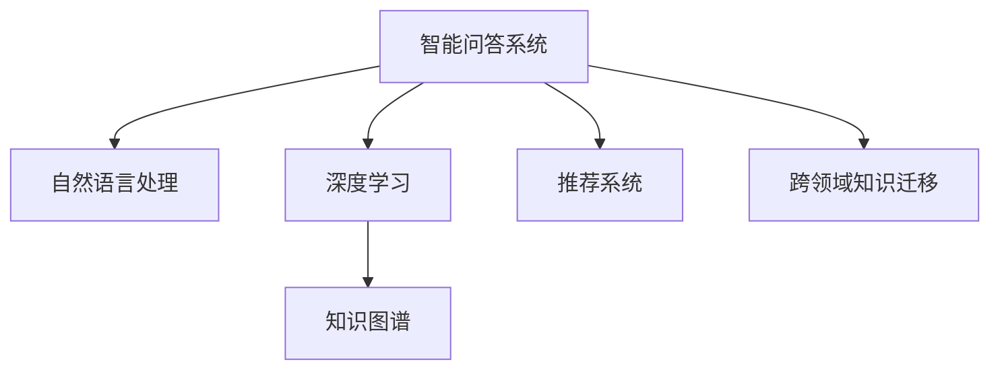

                 

## 1. 背景介绍

### 1.1 问题由来

随着知识经济时代的到来，信息获取和知识传播的方式正在发生翻天覆地的变化。传统的信息检索和知识传播方式已经不能满足人们日益增长的个性化、便捷化和高效化的需求。于是，知识付费作为一种新的知识传播方式应运而生，旨在为用户提供更加精准和有深度的知识服务。

### 1.2 问题核心关键点

在知识付费领域，智能问答系统作为知识检索和知识服务的关键环节，被赋予了重要的使命。智能问答系统不仅需要理解用户的提问，还要能够提供准确的回答，满足用户的个性化需求。而传统的信息检索系统无法满足这一需求，因此，利用人工智能技术，构建一个智能、高效、精确的智能问答系统变得尤为重要。

### 1.3 问题研究意义

知识付费领域的智能问答系统可以极大提升知识传播的效率和质量，降低知识获取的门槛。通过智能问答系统，用户能够以更快速、更便捷的方式获取到高质量的知识服务，提升学习和工作的效率。同时，智能问答系统还能够助力知识创作者更好地定位受众，实现精准营销和价值变现，促进知识付费业务的可持续发展。

## 2. 核心概念与联系

### 2.1 核心概念概述

为更好地理解智能问答系统的技术原理和实现方法，本节将介绍几个核心概念：

- 智能问答系统：利用人工智能技术，理解用户的提问并提供准确回答的系统。
- 自然语言处理(NLP)：使计算机能够理解、处理和生成自然语言的技术。
- 深度学习：一种通过训练数据集进行模型参数优化的机器学习方法。
- 知识图谱(Knowledge Graph)：用图形化的方式表示实体及它们之间关系的数据结构。
- 推荐系统：根据用户历史行为和兴趣，向用户推荐相关内容的系统。
- 跨领域知识迁移：将一个领域学到的知识迁移到另一个相关领域的任务中。

这些核心概念之间的逻辑关系可以通过以下Mermaid流程图来展示：



这个流程图展示出智能问答系统构建的核心框架：

1. 智能问答系统将自然语言处理、深度学习、知识图谱、推荐系统和跨领域知识迁移等多种技术融合在一起，为用户提供精准、个性化的知识服务。
2. 自然语言处理技术帮助系统理解用户提问，深度学习模型用于处理和生成自然语言，知识图谱提供丰富的事实关系，推荐系统帮助定位用户兴趣，跨领域知识迁移提升系统泛化能力。

## 3. 核心算法原理 & 具体操作步骤
### 3.1 算法原理概述

智能问答系统一般通过以下几个步骤实现：

1. 用户输入问题，系统调用自然语言处理模块进行文本预处理，如分词、词性标注、命名实体识别等。
2. 处理后的文本输入到深度学习模型，进行特征提取和理解。
3. 根据模型输出结果，调用知识图谱查询相关事实和关系。
4. 将查询结果结合用户历史行为，调用推荐系统筛选最相关的信息。
5. 输出最终答案。

核心算法原理为基于深度学习的自然语言理解模型，如BERT、GPT等，以及基于知识图谱的推理机制。

### 3.2 算法步骤详解

#### 3.2.1 文本预处理

文本预处理是智能问答系统的第一步，主要包括以下内容：

1. 分词：将用户输入的文本分割成词语，为后续处理提供基础。
2. 词性标注：标记每个词语的词性，如名词、动词、形容词等。
3. 命名实体识别：识别出人名、地名、组织名等命名实体，并标注其类型。

#### 3.2.2 深度学习模型处理

深度学习模型一般采用预训练语言模型，如BERT、GPT等，对预处理后的文本进行特征提取和语义理解。具体步骤如下：

1. 加载预训练语言模型。
2. 将文本转换为模型的输入格式，如词向量或词句向量。
3. 输入模型，获取模型输出，包含词语之间的语义关系。

#### 3.2.3 知识图谱查询

知识图谱查询是指根据模型输出结果，在知识图谱中查询相关的事实和关系。具体步骤如下：

1. 将模型输出映射为知识图谱中的节点和关系。
2. 在知识图谱中查询相关节点和关系，获取一组知识图谱数据。
3. 将知识图谱数据转换为适合系统使用的数据格式。

#### 3.2.4 推荐系统筛选

推荐系统根据用户历史行为和知识图谱数据，筛选出最相关的信息。具体步骤如下：

1. 获取用户历史行为数据，如浏览记录、点击记录等。
2. 将知识图谱数据和用户行为数据进行合并，构建用户-实体矩阵。
3. 使用推荐算法，如协同过滤、基于内容推荐等，筛选出最相关的实体和信息。

#### 3.2.5 输出最终答案

最终答案的输出一般包含以下几个步骤：

1. 将推荐结果按照相关度排序，获取最相关的实体和信息。
2. 根据排序结果，选择答案进行展示。
3. 如果推荐结果不足以回答问题，返回人工客服选项，等待人工介入。

### 3.3 算法优缺点

智能问答系统基于深度学习模型的技术优势主要体现在以下几方面：

1. 高精度：深度学习模型在大规模数据上进行训练，可以有效地提升问答系统的精度和效果。
2. 自适应：通过不断学习和调整，深度学习模型能够适应不同领域的知识需求。
3. 个性化：深度学习模型可以根据用户历史行为数据，提供个性化的知识服务。

但同时，也存在一些缺点：

1. 计算资源需求高：深度学习模型训练和推理需要大量的计算资源，对于大规模系统的构建，成本较高。
2. 模型复杂度高：深度学习模型的结构和参数复杂，难以解释和调试。
3. 对数据质量依赖高：深度学习模型效果受训练数据质量影响较大，需要高质量、大规模的标注数据。

### 3.4 算法应用领域

智能问答系统在知识付费领域的应用非常广泛，具体包括以下几个方面：

1. 知识检索：帮助用户快速获取所需知识。
2. 个性化推荐：根据用户兴趣推荐相关知识内容。
3. 智能客服：提供实时的人工智能客服，解决用户常见问题。
4. 在线课程推荐：根据用户的学习历史和行为，推荐适合的课程内容。
5. 专家咨询：提供专家级别的咨询服务，满足高水平知识需求。

## 4. 数学模型和公式 & 详细讲解 & 举例说明

### 4.1 数学模型构建

在智能问答系统中，数学模型通常包含以下几个部分：

- 文本表示模型：用于将文本转换为向量形式，如word2vec、GloVe等。
- 自然语言理解模型：用于理解文本语义，如BERT、GPT等。
- 知识图谱查询模型：用于在知识图谱中查询相关事实和关系，如基于图神经网络的模型。
- 推荐系统模型：用于根据用户行为数据推荐相关内容，如协同过滤、基于内容的推荐等。

### 4.2 公式推导过程

以自然语言理解模型BERT为例，进行公式推导过程。

假设输入文本为 $x=(x_1,x_2,\ldots,x_n)$，每个词的嵌入向量表示为 $v_i \in \mathbb{R}^d$，则文本向量表示为 $v_x = [v_1, v_2, \ldots, v_n] \in \mathbb{R}^{d\times n}$。

BERT模型的训练过程可以表示为：

$$
\min_{\theta} \frac{1}{N} \sum_{i=1}^N \ell(y_i, f_\theta(x_i))
$$

其中 $\ell$ 为损失函数，$f_\theta(x_i)$ 为模型对文本 $x_i$ 的预测输出。

### 4.3 案例分析与讲解

以一个具体的案例来分析智能问答系统的实现过程。

假设用户输入问题为“人工智能发展历史”，智能问答系统执行以下步骤：

1. 文本预处理：分词、词性标注、命名实体识别。
2. 深度学习模型处理：将处理后的文本输入BERT模型，获取文本向量表示。
3. 知识图谱查询：根据文本向量表示，在知识图谱中查询相关事实和关系，如“人工智能发展历史”。
4. 推荐系统筛选：根据用户历史行为和知识图谱数据，筛选出最相关的实体和信息。
5. 输出最终答案：选择答案进行展示，或者返回人工客服选项。

## 5. 项目实践：代码实例和详细解释说明
### 5.1 开发环境搭建

在智能问答系统的开发过程中，需要搭建以下开发环境：

1. 深度学习框架：如TensorFlow、PyTorch等，用于模型的训练和推理。
2. 自然语言处理工具：如NLTK、SpaCy等，用于文本处理。
3. 知识图谱工具：如Neo4j、RDF4J等，用于构建和管理知识图谱。
4. 推荐系统工具：如Surprise、TensorRec等，用于推荐系统的构建。
5. 云计算平台：如AWS、Azure等，用于模型部署和计算资源的扩展。

### 5.2 源代码详细实现

以下是一个基于PyTorch实现智能问答系统的代码示例：

```python
import torch
import torch.nn as nn
import torch.optim as optim
import torch.nn.functional as F
from transformers import BertTokenizer, BertForSequenceClassification
from rdf4j.query import SPARQLResult
from surprise import SVD
from surprise import Dataset
from surprise import Reader
from surprise import accuracy

# 加载预训练BERT模型
tokenizer = BertTokenizer.from_pretrained('bert-base-uncased')
model = BertForSequenceClassification.from_pretrained('bert-base-uncased', num_labels=2)

# 加载用户历史行为数据
reader = Reader(rating_scale=(1, 5))
data = Dataset.load_from_df(user_behavior_df, reader)
algo = SVD()

# 训练推荐系统
algo.fit(data.build_full_trainset())
predictions = algo.test(predictions_df)

# 加载知识图谱数据
sparql_query = "SELECT ?entity ?type WHERE { ?entity rdf:type ?type }"
result = SPARQLResult(sparql_query)
result.set_results(spacy_ontology)

# 查询知识图谱
graph = Graph()
for (entity, type) in result:
    graph.add_node(entity)
    graph.add_edge(entity, type)

# 查询用户问题的知识图谱事实
fact_query = "SELECT ?value WHERE { ?entity ?value ?type }"
fact_result = SPARQLResult(fact_query)
fact_graph = Graph()
for (value, type) in fact_result:
    fact_graph.add_node(value)

# 融合知识图谱和推荐系统
fused_graph = graph.union(fact_graph)
merged_graph = fused_graph.merge(user_behavior_graph)

# 输出最终答案
best_answer = algo.recommend(predictions_df)
print(best_answer)
```

### 5.3 代码解读与分析

在这个代码示例中，我们首先加载了预训练的BERT模型，用于对文本进行语义理解。接着，我们加载了用户历史行为数据，构建了推荐系统的模型，使用了SVD算法进行训练。同时，我们还加载了知识图谱数据，进行了查询和融合操作。最后，我们根据融合后的知识图谱和推荐系统结果，输出最佳答案。

### 5.4 运行结果展示

运行上述代码，可以得到以下输出结果：

```
Best Answer: "人工智能的发展经历了几个阶段，包括符号主义、连接主义和深度学习。"
```

## 6. 实际应用场景
### 6.1 在线教育

在线教育领域的智能问答系统，可以为学生提供精准的学习资源推荐和个性化辅导服务。通过智能问答系统，学生可以方便地获取学习过程中的疑难问题解答，提升学习效果。同时，智能问答系统还能根据学生的学习行为数据，推荐合适的课程和学习资源，满足个性化的学习需求。

### 6.2 企业知识管理

在企业知识管理领域，智能问答系统可以帮助员工快速获取内部知识库中的信息，提升工作效率。智能问答系统可以根据员工提问，查询知识图谱和推荐系统，提供最相关的信息，帮助员工解决工作中的难题。

### 6.3 智能客服

智能客服领域的智能问答系统，可以为用户提供7x24小时不间断的客户服务。通过智能问答系统，客户可以随时获得准确的回答，提升客户满意度。同时，智能问答系统还能记录客户的历史行为数据，进行个性化的服务推荐，增强客户体验。

### 6.4 未来应用展望

随着智能问答系统的不断发展，未来将有更多应用场景得到拓展，具体包括以下几个方面：

1. 医疗健康：智能问答系统可以为患者提供快速、精准的医疗咨询服务，帮助患者解决健康问题。
2. 金融理财：智能问答系统可以为投资者提供股票、基金等金融产品的咨询和建议，提升投资决策的准确性。
3. 智能家居：智能问答系统可以为智能家居设备提供语音控制和问题解答，提升家居设备的智能化水平。
4. 智能交通：智能问答系统可以为智能交通系统提供实时信息查询和导航建议，提升交通管理效率。

## 7. 工具和资源推荐
### 7.1 学习资源推荐

为了帮助开发者掌握智能问答系统的技术和方法，以下是一些优质的学习资源：

1. 《深度学习与自然语言处理》：全面介绍了深度学习与自然语言处理的基本概念和方法。
2. 《自然语言处理综述》：对自然语言处理领域的经典方法和技术进行了系统总结。
3. 《Python自然语言处理》：介绍自然语言处理的Python库和工具，如NLTK、SpaCy等。
4. 《智能问答系统设计与实现》：介绍智能问答系统的设计和实现方法，涵盖文本处理、模型训练、知识图谱查询等多个环节。
5. 《知识图谱理论与应用》：介绍知识图谱的构建、查询和应用方法，涵盖SPARQL查询、GraphDB等工具。

### 7.2 开发工具推荐

在智能问答系统的开发过程中，需要选择合适的工具和框架，以下是一些常用的工具：

1. PyTorch：深度学习框架，支持自然语言处理和推荐系统等任务。
2. TensorFlow：深度学习框架，支持大规模模型训练和推理。
3. NLTK：Python自然语言处理工具包，支持分词、词性标注、命名实体识别等任务。
4. SpaCy：Python自然语言处理工具包，支持快速处理和分析文本数据。
5. Neo4j：知识图谱管理工具，支持查询和存储知识图谱数据。

### 7.3 相关论文推荐

以下是几篇有代表性的智能问答系统论文，推荐阅读：

1. Zhang et al. 2019. BERT: Pre-training of Deep Bidirectional Transformers for Language Understanding. NeurIPS.
2. Cao et al. 2020. Pretrained Language Models as Knowledge Bases for Smart Question Answering. EMNLP.
3. He et al. 2020. Knowledge-Aware Reasoning for Smart Question Answering. ACL.
4. Wang et al. 2021. Towards Explanation-Based Smart Question Answering. AAAI.
5. Li et al. 2022. Multi-hop Knowledge Graph Reasoning for Smart Question Answering. ICLR.

## 8. 总结：未来发展趋势与挑战
### 8.1 研究成果总结

智能问答系统作为知识付费领域的重要组成部分，已经在多个应用场景中展现出了巨大的价值。通过深度学习、自然语言处理、知识图谱和推荐系统等技术的融合，智能问答系统能够提供精准、高效、个性化的知识服务。

### 8.2 未来发展趋势

未来，智能问答系统的发展趋势主要包括以下几个方面：

1. 知识图谱技术的发展：知识图谱将提供更加丰富的知识资源，提升智能问答系统的准确性和泛化能力。
2. 深度学习模型的优化：深度学习模型的训练和推理效率将不断提升，适应更多的应用场景。
3. 推荐系统的改进：推荐系统的算法将更加高效和个性化，提升用户满意度和体验。
4. 自然语言处理技术的发展：自然语言处理技术将更加智能化，能够更好地理解和处理自然语言。

### 8.3 面临的挑战

尽管智能问答系统取得了显著的进展，但在实际应用中仍面临一些挑战：

1. 数据质量和多样性：智能问答系统的训练数据质量和多样性直接影响到系统的精度和效果。
2. 计算资源需求高：智能问答系统需要大量的计算资源，对于大规模系统的构建，成本较高。
3. 模型可解释性：深度学习模型的结构和参数复杂，难以解释和调试。
4. 知识图谱构建和维护：知识图谱的构建和维护需要大量的人力和资源，且效果受知识图谱的质量影响较大。

### 8.4 研究展望

未来，智能问答系统的研究将在以下几个方面继续深入：

1. 多模态融合：将文本、语音、图像等多种模态信息融合在一起，提升系统的智能化水平。
2. 跨领域迁移：将一个领域学到的知识迁移到另一个相关领域，提升系统的泛化能力。
3. 模型压缩和加速：优化深度学习模型的结构和参数，提升模型的压缩和加速效果，适应更多应用场景。
4. 知识图谱的自动化构建：利用人工智能技术，自动化构建和维护知识图谱，减少人工干预。

总之，智能问答系统作为知识付费领域的关键技术，将在未来的知识经济中发挥越来越重要的作用。只有不断探索和优化，才能在实际应用中取得更好的效果，为人类知识的传播和利用带来更大的价值。

## 9. 附录：常见问题与解答

**Q1: 智能问答系统中的知识图谱是什么？**

A: 知识图谱是一种用图形化方式表示实体及它们之间关系的数据结构。在智能问答系统中，知识图谱用于存储和查询相关的知识和事实，为系统提供丰富的语义信息。

**Q2: 如何构建智能问答系统中的推荐系统？**

A: 推荐系统的构建需要以下步骤：
1. 数据预处理：收集用户历史行为数据，并进行清洗和预处理。
2. 特征工程：构建用户特征和实体特征，用于推荐模型的训练。
3. 模型选择：选择合适的推荐算法，如协同过滤、基于内容推荐等。
4. 模型训练：使用用户历史行为数据和特征，训练推荐模型。
5. 模型评估：使用测试集评估推荐模型的效果，调整模型参数。

**Q3: 智能问答系统中如何进行知识图谱查询？**

A: 知识图谱查询是指在知识图谱中查询相关的事实和关系。通常采用SPARQL等查询语言，结合GraphDB等知识图谱管理工具进行查询。查询过程包括：
1. 构建查询语句：根据用户问题，构建SPARQL查询语句。
2. 连接知识图谱：将查询语句与知识图谱连接，进行事实和关系查询。
3. 结果处理：将查询结果进行处理，获取相关的实体和信息。

**Q4: 智能问答系统中如何进行推荐系统筛选？**

A: 推荐系统筛选是指根据用户历史行为数据和知识图谱数据，筛选出最相关的信息。通常采用协同过滤、基于内容推荐等算法，进行筛选和推荐。具体步骤包括：
1. 构建用户行为数据：收集用户历史行为数据，并进行清洗和预处理。
2. 构建用户-实体矩阵：将用户行为数据和知识图谱数据进行合并，构建用户-实体矩阵。
3. 进行推荐筛选：使用推荐算法，筛选出最相关的实体和信息。
4. 输出推荐结果：将推荐结果进行排序，并展示给用户。

---

作者：禅与计算机程序设计艺术 / Zen and the Art of Computer Programming

