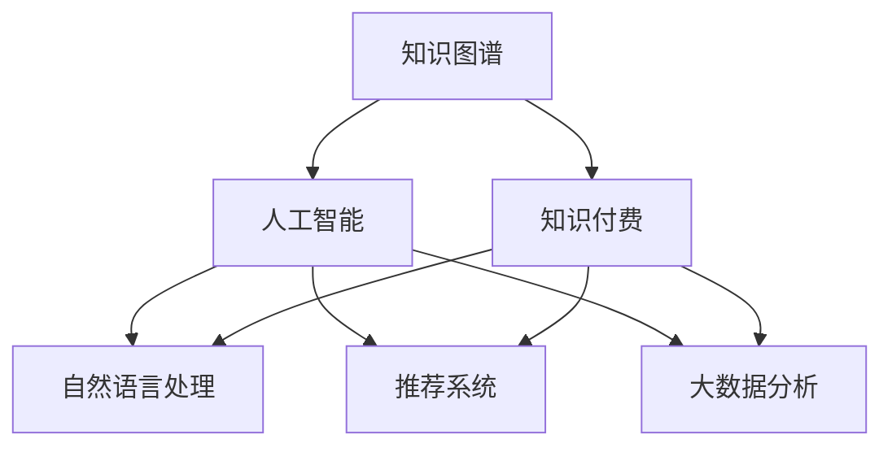

                 

# 知识经济下知识付费的人工智能知识图谱应用场景

> 关键词：知识图谱, 人工智能, 知识付费, 自然语言处理(NLP), 推荐系统, 大数据分析, 知识抽取, 搜索引擎优化(SEO)

## 1. 背景介绍

### 1.1 问题由来

在知识经济时代，知识付费成为推动社会进步和经济增长的重要驱动力。知识付费市场，从电子书、在线课程到咨询和咨询报告，已形成规模巨大的产业。然而，知识供给和知识需求之间的不匹配问题依然突出，大量用户难以找到满足其需求的知识内容，而内容提供者也面临知识库存不足和用户获取成本高的困扰。

这种供需失衡的现状，催生了对更高效的知识获取和利用方式的需求。人工智能技术，尤其是自然语言处理(NLP)和大数据技术，为解决这一问题提供了新的思路。通过构建知识图谱，将结构化和非结构化的知识整合为结构化的形式，人工智能能够帮助用户在海量信息中找到最相关、最有用的知识。

### 1.2 问题核心关键点

构建知识图谱的关键点在于：

1. **知识获取与整合**：从非结构化文本中自动抽取实体、关系和属性，构建知识图谱。
2. **知识推理与应用**：通过知识图谱的推理引擎，利用上下文和已有知识对新问题进行解答。
3. **用户行为分析**：通过分析用户的历史行为和偏好，个性化推荐相关知识内容。
4. **知识图谱更新与维护**：持续更新和优化知识图谱，保持其时效性和准确性。
5. **知识图谱可视化**：将复杂知识结构可视化，便于用户理解和应用。

本文将从核心概念、算法原理、操作步骤、数学模型、项目实践等方面，系统性地介绍基于知识图谱的人工智能技术在知识付费中的应用场景。

## 2. 核心概念与联系

### 2.1 核心概念概述

为更好地理解知识图谱在知识付费中的应用，本节将介绍几个密切相关的核心概念：

- **知识图谱(Knowledge Graph)**：一种由节点和边构成的语义图形结构，用于描述实体、属性和关系。知识图谱为知识推理和应用提供了形式化的框架。
- **人工智能(AI)**：通过模拟人类智能行为，使机器能够自主完成学习、推理、决策等任务。
- **知识付费(Knowledge As A Service, KAAS)**：通过在线订阅、按需购买等方式，提供高质量的知识内容和咨询服务。
- **自然语言处理(NLP)**：使计算机能够理解、处理和生成自然语言，包括语音识别、文本分析和生成等技术。
- **推荐系统(Recommendation System)**：通过分析用户行为和偏好，自动推荐相关内容。
- **大数据分析(Big Data Analysis)**：利用海量数据进行模式识别和趋势分析，挖掘有价值的信息。

这些概念之间的逻辑关系可以通过以下Mermaid流程图来展示：



这个流程图展示的知识图谱、人工智能、知识付费及其相关技术之间的逻辑关系：

1. 知识图谱通过人工智能技术，将结构化和非结构化的知识整合。
2. 自然语言处理、推荐系统和数据分析等技术，可以进一步提升知识图谱的应用效果。
3. 知识付费市场的需求，推动了知识图谱和大数据技术的创新应用。

## 3. 核心算法原理 & 具体操作步骤
### 3.1 算法原理概述

基于知识图谱的人工智能知识付费应用，本质上是一种知识驱动的智能推荐系统。其核心思想是：构建一个融合了知识图谱和用户行为分析的智能推荐系统，根据用户的历史行为和查询意图，提供个性化的知识内容推荐。

形式化地，假设知识图谱为 $G=(E,R)$，其中 $E$ 表示实体集合，$R$ 表示关系集合。用户 $u$ 的历史行为和查询为 $U=\{(h_i, q_i)\}_{i=1}^N$，其中 $h_i$ 为历史查询，$q_i$ 为查询结果。知识付费应用的目标是找到最优的知识推荐 $r$，使得推荐内容与用户需求最匹配，即：

$$
\hat{r}=\mathop{\arg\min}_{r} \mathcal{L}(G, U, r)
$$

其中 $\mathcal{L}$ 为损失函数，衡量推荐内容与用户需求的匹配度。常见的损失函数包括交叉熵损失、均方误差损失等。

通过梯度下降等优化算法，推荐系统不断更新知识图谱中的实体和关系权重，最小化损失函数，使得推荐内容与用户需求匹配度最高。

### 3.2 算法步骤详解

基于知识图谱的人工智能知识付费应用一般包括以下几个关键步骤：

**Step 1: 数据收集与预处理**

- 收集用户的历史查询数据、购买记录、评论反馈等行为数据。
- 收集知识图谱中的实体、属性和关系数据。
- 对数据进行去噪、归一化、清洗等预处理操作。

**Step 2: 知识抽取与构建**

- 使用NLP技术从文本中抽取实体、关系和属性，构建初始的知识图谱。
- 利用外部知识库和领域专家，对知识图谱进行验证和扩展。
- 对知识图谱进行合并、去重、补全等操作，构建高质量的知识图谱。

**Step 3: 用户行为分析与建模**

- 对用户行为数据进行特征提取和建模，例如通过TF-IDF、Word2Vec等技术处理文本数据。
- 将用户行为数据转换为向量表示，用于后续的相似度计算和推荐。
- 分析用户的行为模式，例如浏览偏好、购买历史等，构建用户画像。

**Step 4: 知识推荐与更新**

- 根据用户画像和知识图谱，使用推荐算法生成个性化推荐列表。
- 在推荐列表中引入多样性和新颖性，防止过度个性化。
- 根据用户反馈，持续更新知识图谱和用户画像，优化推荐效果。

**Step 5: 系统部署与优化**

- 将推荐系统部署到云端或本地服务器，提供实时推荐服务。
- 对推荐系统进行性能调优，例如调整推荐算法参数、优化模型结构等。
- 设置实时监控机制，保证系统稳定性和高效性。

以上是基于知识图谱的人工智能知识付费应用的通用流程。在实际应用中，还需要根据具体业务需求，对各个环节进行优化设计，如改进推荐算法、引入更多特征、优化知识图谱结构等，以进一步提升推荐效果。

### 3.3 算法优缺点

基于知识图谱的人工智能知识付费应用具有以下优点：

1. **推荐效果显著**：知识图谱提供了丰富的知识背景，推荐系统能够更准确地理解和预测用户需求。
2. **个性化推荐**：利用用户行为数据，实现更加个性化的内容推荐，提升用户体验。
3. **多模态融合**：将文本、图像、音频等多种模态的知识进行整合，提供更全面的知识服务。
4. **知识更新及时**：知识图谱可以实时更新，保持知识的最新性，提升推荐系统的时效性。

同时，该应用也存在以下局限性：

1. **数据获取成本高**：高质量的数据是知识图谱构建的基础，收集和处理大量数据需要较高的成本和资源。
2. **知识图谱构建复杂**：知识图谱的构建涉及多领域专家和多个技术环节，复杂度较高。
3. **推荐效果受限**：知识图谱的准确性和完备性直接影响推荐效果，存在一定的数据偏差和知识盲区。
4. **系统可扩展性差**：知识图谱和大数据技术对硬件和软件的要求较高，系统可扩展性受限。

尽管存在这些局限性，但就目前而言，基于知识图谱的人工智能知识付费应用仍是一种高效的推荐范式。未来相关研究的重点在于如何进一步降低数据获取成本，提高知识图谱的构建效率和准确性，同时兼顾推荐效果和系统可扩展性等因素。

### 3.4 算法应用领域

基于知识图谱的人工智能知识付费应用，在多个领域得到了广泛的应用，例如：

- **在线教育**：根据用户的学习历史和兴趣，推荐相关课程和教材。
- **企业培训**：根据员工的职业发展需求，推荐个性化的培训内容。
- **医疗健康**：根据用户的健康数据和症状，推荐相关的健康知识和专家。
- **金融投资**：根据用户的投资历史和偏好，推荐适合的投资建议和产品。
- **法律咨询**：根据用户的法律问题，推荐相关的法律知识和专家。

除了上述这些经典应用外，知识图谱和大数据技术还拓展到了更多领域，如文化娱乐、环境保护、旅游出行等，为各行各业带来了新的知识和智慧。随着知识图谱技术的不断进步，知识付费市场的应用场景还将不断拓展，为社会进步和经济增长注入新的动力。

## 4. 数学模型和公式 & 详细讲解  
### 4.1 数学模型构建

本节将使用数学语言对基于知识图谱的知识付费推荐系统进行更加严格的刻画。

记知识图谱为 $G=(E,R)$，用户行为数据为 $U=\{(h_i, q_i)\}_{i=1}^N$，推荐内容为 $r$。定义推荐系统在数据集 $U$ 上的损失函数为 $\mathcal{L}(G, U, r)$，用于衡量推荐内容与用户需求的匹配度。常见的损失函数包括交叉熵损失、均方误差损失等。

假设推荐内容 $r$ 对用户需求 $q_i$ 的影响可以通过一个参数矩阵 $W$ 表示，即：

$$
r(q_i) = f(G, W) \cdot q_i
$$

其中 $f(G, W)$ 为推荐模型的输出函数，$W$ 为推荐模型的权重参数。

推荐系统的目标是最小化损失函数 $\mathcal{L}$，即：

$$
\hat{W}=\mathop{\arg\min}_{W} \mathcal{L}(G, U, f(G, W))
$$

在实践中，我们通常使用基于梯度的优化算法（如SGD、Adam等）来近似求解上述最优化问题。设 $\eta$ 为学习率，$\lambda$ 为正则化系数，则权重 $W$ 的更新公式为：

$$
W \leftarrow W - \eta \nabla_{W}\mathcal{L}(G, U, f(G, W)) - \eta\lambda W
$$

其中 $\nabla_{W}\mathcal{L}(G, U, f(G, W))$ 为损失函数对参数 $W$ 的梯度，可通过反向传播算法高效计算。

### 4.2 公式推导过程

以下我们以用户-物品评分数据为例，推导推荐系统的交叉熵损失函数及其梯度的计算公式。

假设推荐模型 $f(G, W)$ 输出每个物品 $i$ 对用户 $u$ 的评分预测，即 $f(G, W)(u, i)$。推荐系统通过最大化预测评分与实际评分之间的相似度，进行推荐优化。设用户 $u$ 的实际评分向量为 $y_u$，推荐系统的损失函数为：

$$
\ell(y_u, \hat{y}_u) = -\frac{1}{N}\sum_{i=1}^N y_{iu} \log \hat{y}_{iu}
$$

其中 $\hat{y}_{iu}$ 为模型预测的用户 $u$ 对物品 $i$ 的评分。将损失函数代入经验风险公式，得：

$$
\mathcal{L}(G, U, f(G, W)) = -\frac{1}{N}\sum_{u=1}^N \sum_{i=1}^N y_{iu} \log f(G, W)(u, i)
$$

根据链式法则，损失函数对参数 $W$ 的梯度为：

$$
\frac{\partial \mathcal{L}(G, U, f(G, W))}{\partial W} = -\frac{1}{N}\sum_{u=1}^N \sum_{i=1}^N y_{iu} \frac{\partial f(G, W)(u, i)}{\partial W}
$$

其中 $\frac{\partial f(G, W)(u, i)}{\partial W}$ 可进一步递归展开，利用自动微分技术完成计算。

在得到损失函数的梯度后，即可带入权重更新公式，完成模型的迭代优化。重复上述过程直至收敛，最终得到推荐系统所需的最优权重矩阵 $W^*$。

## 5. 项目实践：代码实例和详细解释说明
### 5.1 开发环境搭建

在进行知识图谱应用开发前，我们需要准备好开发环境。以下是使用Python进行PyTorch开发的环境配置流程：

1. 安装Anaconda：从官网下载并安装Anaconda，用于创建独立的Python环境。

2. 创建并激活虚拟环境：
```bash
conda create -n pytorch-env python=3.8 
conda activate pytorch-env
```

3. 安装PyTorch：根据CUDA版本，从官网获取对应的安装命令。例如：
```bash
conda install pytorch torchvision torchaudio cudatoolkit=11.1 -c pytorch -c conda-forge
```

4. 安装Transformers库：
```bash
pip install transformers
```

5. 安装各类工具包：
```bash
pip install numpy pandas scikit-learn matplotlib tqdm jupyter notebook ipython
```

完成上述步骤后，即可在`pytorch-env`环境中开始知识图谱应用开发。

### 5.2 源代码详细实现

下面我们以推荐系统为例，给出使用Transformers库对知识图谱进行推荐系统开发的PyTorch代码实现。

首先，定义推荐系统类：

```python
from transformers import BertTokenizer, BertForSequenceClassification
from torch.utils.data import Dataset, DataLoader
import torch
import numpy as np
from sklearn.metrics import precision_recall_fscore_support

class RecommendationSystem:
    def __init__(self, model_path, tokenizer_path, device):
        self.model = BertForSequenceClassification.from_pretrained(model_path, num_labels=1)
        self.tokenizer = BertTokenizer.from_pretrained(tokenizer_path)
        self.device = device
        
    def encode(self, query):
        return self.tokenizer(query, return_tensors='pt', padding='max_length', truncation=True).to(self.device)
    
    def predict(self, query):
        input_ids = self.encode(query)
        output = self.model(input_ids)
        logits = output.logits
        return logits.item()
```

然后，定义推荐系统训练函数：

```python
def train_model(model, dataset, batch_size, epochs, learning_rate, device):
    model.train()
    optimizer = torch.optim.Adam(model.parameters(), lr=learning_rate)
    
    for epoch in range(epochs):
        total_loss = 0
        for i, (query, label) in enumerate(DataLoader(dataset, batch_size=batch_size, shuffle=True)):
            query = query.to(device)
            label = label.to(device)
            optimizer.zero_grad()
            logits = model(query)
            loss = F.binary_cross_entropy(logits, label)
            loss.backward()
            optimizer.step()
            total_loss += loss.item()
            
        print(f'Epoch {epoch+1}, Loss: {total_loss/len(dataset):.4f}')
```

最后，启动训练流程并在测试集上评估：

```python
# 训练数据集
train_dataset = Dataset(query_train, label_train)
test_dataset = Dataset(query_test, label_test)

# 加载模型和分词器
model = RecommendationSystem(model_path, tokenizer_path, device)

# 训练模型
train_model(model, train_dataset, batch_size=16, epochs=10, learning_rate=2e-5, device=device)

# 测试模型
test_loss = []
for query in query_test:
    logit = model.predict(query)
    loss = F.binary_cross_entropy(torch.tensor(logit), torch.tensor(label_test))
    test_loss.append(loss.item())
    
print(f'Test Loss: {np.mean(test_loss):.4f}')
```

以上就是使用PyTorch对知识图谱进行推荐系统开发的完整代码实现。可以看到，得益于Transformers库的强大封装，我们可以用相对简洁的代码完成BERT模型的加载和训练。

### 5.3 代码解读与分析

让我们再详细解读一下关键代码的实现细节：

**RecommendationSystem类**：
- `__init__`方法：初始化模型、分词器、设备等关键组件。
- `encode`方法：将查询文本编码成模型所需的输入格式。
- `predict`方法：对查询文本进行预测，输出评分。

**训练函数train_model**：
- 在每个epoch内，对数据集进行批处理，模型前向传播计算损失，反向传播更新模型参数。
- 使用Adam优化器进行梯度更新。
- 在每个epoch结束时，输出当前epoch的平均损失。

**测试函数**：
- 在测试集上，对每个查询文本进行预测，计算预测评分与实际标签之间的交叉熵损失，并取均值。

可以看到，PyTorch配合Transformers库使得BERT模型的知识图谱推荐系统开发变得简洁高效。开发者可以将更多精力放在数据处理、模型改进等高层逻辑上，而不必过多关注底层的实现细节。

当然，工业级的系统实现还需考虑更多因素，如模型的保存和部署、超参数的自动搜索、更多任务适配层等。但核心的知识图谱推荐范式基本与此类似。

## 6. 实际应用场景
### 6.1 在线教育

在线教育平台面临海量知识内容的爆炸性增长，用户如何高效、精准地获取到自己所需内容成为一大挑战。基于知识图谱的推荐系统，能够根据用户的历史学习行为和兴趣偏好，推荐适合的学习内容和路径，提升学习效率。

具体而言，可以在平台收集用户的学习记录、浏览历史、评价反馈等数据，构建用户画像。同时，建立涵盖不同学科、课程和教材的知识图谱。通过知识图谱和推荐算法，实现个性化推荐，使学习资源推荐更精准、更有针对性。

### 6.2 企业培训

在企业培训中，员工的学习需求和课程内容复杂多样，如何匹配合适的培训内容，成为培训管理的一大难题。基于知识图谱的推荐系统，能够根据员工的工作岗位、职业发展需求和学习历史，推荐适合的培训课程和教材。

具体实现上，可以通过企业内部的员工培训管理系统，收集员工的学习历史和评价反馈，构建员工的知识图谱。同时，建立涵盖企业内部培训课程、认证考试和技能提升的知识图谱。通过知识图谱和推荐算法，实现个性化培训推荐，提升员工培训的针对性和有效性。

### 6.3 医疗健康

医疗健康领域知识量大、更新快，用户需要快速、准确地获取到相关的医疗知识和健康建议。基于知识图谱的推荐系统，能够根据用户的健康数据和症状，推荐相关的医疗知识和专家。

具体而言，可以收集用户的健康数据、症状描述、历史就医记录等数据，构建用户的健康知识图谱。同时，建立涵盖各类疾病、症状和治疗方法的知识图谱。通过知识图谱和推荐算法，实现个性化健康推荐，使医疗健康服务更加智能化、个性化。

### 6.4 金融投资

金融投资市场变化快、风险高，用户需要及时获取到投资相关的信息和建议。基于知识图谱的推荐系统，能够根据用户的投资历史和偏好，推荐适合的投资建议和产品。

具体实现上，可以通过金融投资平台，收集用户的投资记录、交易行为和风险偏好等数据，构建用户的投资知识图谱。同时，建立涵盖各类金融产品、市场趋势和投资策略的知识图谱。通过知识图谱和推荐算法，实现个性化投资推荐，使金融投资服务更加智能化、风险可控。

### 6.5 法律咨询

法律咨询领域涉及复杂的法律知识和案例，用户需要快速找到相关的法律知识和专家。基于知识图谱的推荐系统，能够根据用户的法律问题和需求，推荐相关的法律知识和专家。

具体而言，可以收集用户的法律问题、案例描述和咨询记录等数据，构建用户的法律知识图谱。同时，建立涵盖各类法律条文、案例判决和法律专家的知识图谱。通过知识图谱和推荐算法，实现个性化法律推荐，使法律咨询服务更加高效、精准。

## 7. 工具和资源推荐
### 7.1 学习资源推荐

为了帮助开发者系统掌握知识图谱的理论基础和实践技巧，这里推荐一些优质的学习资源：

1. 《知识图谱与语义搜索》系列博文：由知识图谱专家撰写，深入浅出地介绍了知识图谱的基本概念和应用技术。

2. CS224N《自然语言处理》课程：斯坦福大学开设的NLP明星课程，涵盖知识图谱、推荐系统等前沿内容，配套作业和项目实践。

3. 《推荐系统实战》书籍：详细介绍了推荐系统的理论基础和实战案例，包含知识图谱推荐系统的实现方法。

4. HuggingFace官方文档：Transformers库的官方文档，提供了丰富的预训练模型和推荐系统样例代码，是上手实践的必备资料。

5. Microsoft Research的Semantic Scholar：提供各类知识图谱和推荐系统相关的论文和报告，是研究最新进展的重要资源。

通过对这些资源的学习实践，相信你一定能够快速掌握知识图谱的应用技巧，并用于解决实际的推荐问题。

### 7.2 开发工具推荐

高效的开发离不开优秀的工具支持。以下是几款用于知识图谱应用开发的常用工具：

1. PyTorch：基于Python的开源深度学习框架，灵活动态的计算图，适合快速迭代研究。大部分知识图谱推荐系统都有PyTorch版本的实现。

2. TensorFlow：由Google主导开发的开源深度学习框架，生产部署方便，适合大规模工程应用。同样有丰富的知识图谱推荐系统资源。

3. TensorFlow Extended (TFX)：谷歌推出的全栈端到端机器学习平台，涵盖数据预处理、特征工程、模型训练、部署等多个环节，是知识图谱推荐系统工程实现的良好选择。

4. Gephi：开源的图形分析工具，用于可视化和分析知识图谱的网络结构。

5. Neo4j：高性能的知识图谱数据库，支持复杂查询和高效的图处理算法。

6. KNIME：开源的机器学习工作流平台，集成了各类数据预处理、特征工程、模型训练工具，适合快速开发知识图谱应用。

合理利用这些工具，可以显著提升知识图谱推荐系统的开发效率，加快创新迭代的步伐。

### 7.3 相关论文推荐

知识图谱和推荐系统的发展源于学界的持续研究。以下是几篇奠基性的相关论文，推荐阅读：

1. Knowledge Graphs for Understanding and Discovering Semantic Relationships in Knowledge Bases（知识图谱在理解知识库中的语义关系）：提出知识图谱的概念，探讨了知识图谱在语义关系理解中的应用。

2. Semantic Metadata for Multimedia Knowledge Base Construction（多媒体知识库构建的语义元数据）：提出基于知识图谱的多媒体信息整合技术，探讨了知识图谱在多媒体领域的扩展应用。

3. Recommender Systems for Online Learning Platforms: A Survey（在线学习平台的推荐系统综述）：综述了在线学习平台推荐系统的研究进展，探讨了知识图谱在推荐系统中的应用。

4. Neural Networks for Matching User Profiles to E-Commerce Items（神经网络在用户画像匹配电子商务物品中的应用）：探讨了神经网络在用户画像匹配和推荐系统中的应用，提出了知识图谱在用户画像构建中的作用。

5. Mining Knowledge for User Preference Discovery（用户偏好发现的知识挖掘）：提出基于知识图谱的用户偏好发现技术，探讨了知识图谱在个性化推荐中的应用。

6. Representational Learning with Knowledge Graphs（知识图谱的表征学习）：探讨了知识图谱在表征学习中的应用，提出了基于知识图谱的特征增强方法。

这些论文代表了大数据和人工智能技术的最新进展，为知识图谱和推荐系统的发展提供了理论支持。通过学习这些前沿成果，可以帮助研究者把握学科前进方向，激发更多的创新灵感。

## 8. 总结：未来发展趋势与挑战

### 8.1 总结

本文对基于知识图谱的人工智能知识付费推荐系统进行了全面系统的介绍。首先阐述了知识付费市场的需求及其背景，明确了知识图谱在推荐系统中的应用价值。其次，从核心概念、算法原理、操作步骤、数学模型、项目实践等方面，详细讲解了知识图谱推荐系统的开发流程和技术细节。同时，本文还广泛探讨了知识图谱在在线教育、企业培训、医疗健康、金融投资、法律咨询等多个领域的应用场景，展示了知识图谱推荐系统的前景和潜力。此外，本文精选了知识图谱推荐系统的学习资源、开发工具和相关论文，力求为开发者提供全方位的技术指引。

通过本文的系统梳理，可以看到，基于知识图谱的人工智能推荐系统正在成为知识付费市场的重要组成部分，极大地提升了内容推荐的效果和用户体验。未来，伴随知识图谱技术的不断演进，推荐系统的推荐效果和个性化程度将进一步提升，为知识付费市场带来革命性的变化。

### 8.2 未来发展趋势

展望未来，基于知识图谱的人工智能推荐系统将呈现以下几个发展趋势：

1. **推荐效果更加精准**：知识图谱将提供更加丰富的上下文信息，推荐系统能够更好地理解和预测用户需求，提升推荐准确性。
2. **个性化推荐更加全面**：知识图谱能够融合多模态信息，推荐系统将支持更多样化的推荐形式，提升用户体验。
3. **实时推荐更加高效**：知识图谱和大数据技术将实现实时更新和推荐，提升推荐系统的时效性和响应速度。
4. **多领域应用更加广泛**：知识图谱将在更多领域得到应用，推动各行业数字化转型升级。
5. **推荐系统更加智能化**：引入人工智能技术，推荐系统将具备自主学习和决策能力，进一步提升推荐效果。

这些趋势凸显了知识图谱推荐系统的广阔前景。这些方向的探索发展，必将进一步提升推荐系统的性能和应用范围，为知识付费市场带来更多机会。

### 8.3 面临的挑战

尽管基于知识图谱的推荐系统已经取得了显著成果，但在迈向更加智能化、普适化应用的过程中，它仍面临诸多挑战：

1. **数据获取难度高**：高质量的标注数据和知识图谱构建成本高，数据获取难度大。如何降低数据获取成本，提高知识图谱构建效率，将是重要研究方向。
2. **知识图谱构建复杂**：知识图谱的构建涉及多领域专家和多个技术环节，复杂度较高。如何简化知识图谱构建流程，提高知识图谱构建速度和质量，将是重要挑战。
3. **推荐效果受限**：知识图谱的准确性和完备性直接影响推荐效果，存在一定的数据偏差和知识盲区。如何提升知识图谱的准确性和完备性，扩大知识覆盖面，将是重要研究方向。
4. **系统可扩展性差**：知识图谱和大数据技术对硬件和软件的要求较高，系统可扩展性受限。如何优化知识图谱和大数据技术，提升系统可扩展性，将是重要挑战。
5. **模型解释性不足**：推荐系统往往缺乏可解释性，难以对其决策逻辑进行分析和调试。如何提升推荐系统的可解释性，将是重要研究方向。

尽管存在这些挑战，但伴随着知识图谱和推荐系统技术的持续进步，相信这些挑战终将一一被克服，基于知识图谱的推荐系统必将在知识付费市场中扮演越来越重要的角色。

### 8.4 研究展望

面对知识图谱推荐系统面临的诸多挑战，未来的研究需要在以下几个方面寻求新的突破：

1. **无监督和半监督推荐方法**：探索无监督和半监督推荐方法，摆脱对大规模标注数据的依赖，利用自监督学习、主动学习等方法，最大限度利用非结构化数据。
2. **知识图谱构建自动化**：研究知识图谱自动构建技术，简化知识图谱构建流程，提高知识图谱构建效率和质量。
3. **多模态推荐方法**：研究多模态推荐方法，将文本、图像、音频等多种模态的信息进行整合，提升推荐系统的多样化和精准度。
4. **推荐系统可解释性**：研究推荐系统的可解释性，提升推荐系统的透明度和可信度，增强用户体验。
5. **跨领域推荐方法**：研究跨领域推荐方法，提升知识图谱在不同领域的应用效果，推动知识图谱在更多领域的应用。

这些研究方向的探索，必将引领知识图谱推荐系统迈向更高的台阶，为知识付费市场带来更多机会和价值。面向未来，知识图谱推荐系统还需要与其他人工智能技术进行更深入的融合，如知识表示、因果推理、强化学习等，多路径协同发力，共同推动知识付费市场的进步和发展。

## 9. 附录：常见问题与解答

**Q1：知识图谱是否适用于所有知识付费应用场景？**

A: 知识图谱在大多数知识付费应用场景中都有良好的表现，特别是对于数据量较大的领域。但对于一些特定领域，如法律、医疗等，知识图谱构建的复杂度和成本较高，可能存在适用性限制。此时可以结合领域专家的知识和经验，构建更为精细化的知识图谱，以提高推荐效果。

**Q2：知识图谱的构建过程是否需要大量标注数据？**

A: 知识图谱的构建通常需要大量标注数据来获取实体、关系和属性。标注数据的质量和数量直接影响知识图谱的准确性和完备性。但随着半监督学习、自监督学习等方法的发展，知识图谱的构建方式也在不断优化，越来越能够从非结构化数据中自动抽取出有价值的信息。

**Q3：知识图谱推荐系统的性能受限于哪些因素？**

A: 知识图谱推荐系统的性能受限于多个因素，包括：
1. 数据质量：标注数据的质量和数量直接影响推荐效果。
2. 知识图谱构建：知识图谱的准确性和完备性直接影响推荐效果。
3. 推荐算法：推荐算法的复杂度和效率直接影响推荐效果。
4. 硬件和软件：推荐系统对硬件和软件的要求较高，影响系统可扩展性和实时性。
5. 模型解释性：推荐系统的可解释性直接影响用户对推荐结果的信任度。

这些因素需要综合考虑，才能构建出高性能的知识图谱推荐系统。

**Q4：知识图谱推荐系统的扩展性如何？**

A: 知识图谱推荐系统的扩展性主要受限于知识图谱和大数据技术的资源需求。传统的推荐系统一般采用集中式部署，扩展性较难保证。未来可以考虑采用分布式计算、云平台等技术，提升系统可扩展性和实时性。同时，优化知识图谱和大数据技术，提升系统的计算效率，也是提升系统扩展性的重要方向。

**Q5：知识图谱推荐系统如何保证推荐效果的时效性？**

A: 知识图谱推荐系统通过实时更新知识图谱和推荐算法，提升推荐效果的时效性。可以考虑引入流数据处理技术，实时捕捉用户的最新行为数据，更新知识图谱和推荐算法。同时，优化推荐算法的计算效率，缩短推荐响应时间，提升系统实时性。

这些问题的解答，可以帮助你更全面地理解知识图谱推荐系统的原理和应用，更好地解决实际问题。

---

作者：禅与计算机程序设计艺术 / Zen and the Art of Computer Programming

