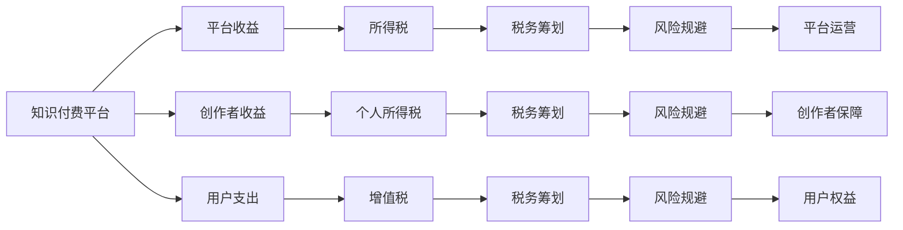

                 

## 1. 背景介绍

在知识经济时代，知识付费已经成为一种重要的商业模式，为知识生产者和消费者搭建了桥梁。然而，知识付费的快速增长也带来了诸多税务问题和法律风险。本文将详细分析知识付费的税务筹划与风险规避策略，旨在为知识付费平台、创作者和用户提供全面的税务合规和风险管理指导。

## 2. 核心概念与联系

### 2.1 核心概念概述

- **知识付费**：基于互联网的知识分享平台，用户通过订阅、付费阅读、购买课程等方式，获取专业知识的经济行为。
- **税务筹划**：在法律法规允许的范围内，通过合法的财务安排和税收筹划，减少或延迟税负的税务策略。
- **风险规避**：识别并采取措施避免或减少风险发生的可能性，保护企业和个人免受潜在损失的策略。
- **平台收益**：知识付费平台通过广告、会员订阅、课程销售等方式获得的收入。
- **创作者收益**：知识付费平台上的创作者通过作品发布、课程制作等获得的收入。
- **用户支出**：知识付费用户为获取知识支付的费用，包括订阅费、购买课程费用等。

这些概念通过合法的税务筹划和风险规避策略紧密联系在一起，共同构建了知识付费的税务合规体系，保障了平台的稳定运营和创作者的合法利益。

### 2.2 核心概念原理和架构的 Mermaid 流程图



这个流程图展示了知识付费平台、创作者和用户之间的资金流动关系，以及税务筹划和风险规避策略在整个流程中的作用。

## 3. 核心算法原理 & 具体操作步骤

### 3.1 算法原理概述

知识付费的税务筹划与风险规避，本质上是通过对税收法规的深入理解和合理应用，优化税收结构，减少税收负担，同时识别并规避潜在的法律风险。其核心算法原理包括：

- **收入识别与分类**：对平台收益、创作者收益和用户支出进行准确分类，确保每一笔收入都能合理计税。
- **税率计算**：根据不同收入来源的税率标准，计算应纳税额。
- **税收抵免与优惠**：识别可用的税收抵免和优惠政策，减少实际税负。
- **风险评估与管理**：通过定期的税务合规审计，评估税务风险，制定风险规避策略。

### 3.2 算法步骤详解

**Step 1: 收入识别与分类**

1. **平台收益识别**：识别平台通过广告、会员订阅、课程销售等方式获得的全部收入。
2. **创作者收益识别**：识别平台向创作者支付的收入，包括稿费、分成等。
3. **用户支出识别**：识别用户为获取知识支付的全部费用。

**Step 2: 税率计算**

1. **所得税计算**：根据平台收益的性质（如服务收入、广告收入等），计算应缴纳的所得税。
2. **个人所得税计算**：根据创作者收益的性质（如稿费、分成等），计算应缴纳的个人所得税。
3. **增值税计算**：根据用户支出中的服务费用，计算应缴纳的增值税。

**Step 3: 税收抵免与优惠**

1. **识别可用抵免**：识别可用的税收抵免项目，如研发费用加计扣除、中小企业税收优惠等。
2. **计算抵免金额**：根据可用抵免项目的规定，计算实际可抵免的税额。
3. **享受税收优惠**：根据税收优惠政策，申请相应的减税或免税待遇。

**Step 4: 风险评估与管理**

1. **税务合规审计**：定期对平台收益、创作者收益和用户支出进行税务合规审计，识别潜在的税务风险。
2. **风险评估**：根据审计结果，评估潜在的税务风险等级。
3. **制定规避策略**：针对不同风险等级，制定相应的风险规避策略，如合理分摊收入、调整定价策略等。

### 3.3 算法优缺点

**优点**：

1. **合法合规**：通过合法的财务安排和税收筹划，减少税负，降低法律风险。
2. **灵活性高**：可以根据不同平台的业务特点，灵活应用税务筹划和风险规避策略。
3. **降低成本**：通过合理的税收安排，降低平台的运营成本，提升盈利能力。

**缺点**：

1. **复杂性高**：税务筹划和风险规避涉及复杂的税法知识和政策变化，需专业知识和经验。
2. **合规风险**：过度筹划可能导致税务合规风险，甚至被税务机关认定偷税漏税。
3. **信息透明**：税务筹划和风险规避需依赖详细的财务数据和合规信息，信息透明要求高。

### 3.4 算法应用领域

知识付费的税务筹划与风险规避策略，适用于各类知识付费平台，包括但不限于在线教育、知识社区、专业咨询等。通过这些策略，可以确保平台的税务合规，保障创作者的合法权益，提升用户体验，从而实现平台的可持续发展。

## 4. 数学模型和公式 & 详细讲解 & 举例说明

### 4.1 数学模型构建

假设知识付费平台在一年内的平台收益为 $R_P$，创作者收益为 $R_C$，用户支出为 $R_U$。平台收益主要来源于广告收入 $A$、会员订阅收入 $S$ 和课程销售收入 $C$。创作者收益主要来源于稿费 $F$ 和分成 $D$。

数学模型如下：

$$
R_P = A + S + C
$$
$$
R_C = F + D
$$
$$
R_U = A + S + C + F + D
$$

### 4.2 公式推导过程

**所得税计算**：

平台收益中，广告收入 $A$ 通常视为服务收入，会员订阅收入 $S$ 和课程销售收入 $C$ 通常视为商品销售收入。假设所得税率为 $t_P$，则所得税计算公式为：

$$
T_P = R_P \times t_P
$$

**个人所得税计算**：

创作者收益中，稿费 $F$ 通常视为劳务所得，分成 $D$ 通常视为经营所得。假设个人所得税率为 $t_C$，则个人所得税计算公式为：

$$
T_C = R_C \times t_C
$$

**增值税计算**：

用户支出中，广告收入 $A$、会员订阅收入 $S$ 和课程销售收入 $C$ 需缴纳增值税。假设增值税率为 $t_V$，则增值税计算公式为：

$$
T_V = (A + S + C) \times t_V
$$

### 4.3 案例分析与讲解

**案例1：某在线教育平台的税务筹划**

某在线教育平台年平台收益为 5000 万元，其中广告收入 2000 万元，会员订阅收入 1500 万元，课程销售收入 1500 万元。创作者年收益为 800 万元，其中稿费 500 万元，分成 300 万元。假设所得税率 25%，增值税率 6%，无可用税收抵免和优惠。

**所得税计算**：

$$
T_P = (2000 + 1500 + 1500) \times 25\% = 750 \text{ 万元}
$$

**个人所得税计算**：

$$
T_C = 800 \times 25\% = 200 \text{ 万元}
$$

**增值税计算**：

$$
T_V = (2000 + 1500 + 1500) \times 6\% = 270 \text{ 万元}
$$

**总税负**：

$$
Total Tax = T_P + T_C + T_V = 750 + 200 + 270 = 1220 \text{ 万元}
$$

### 5. 项目实践：代码实例和详细解释说明

### 5.1 开发环境搭建

1. **安装 Python 和环境管理工具**：
   - 下载并安装 Python 3.x。
   - 安装虚拟环境管理工具，如 `virtualenv` 或 `conda`。

2. **安装必要的库**：
   - 安装税法计算库 `tax_calculator`。
   - 安装数据处理库 `pandas`。
   - 安装可视化库 `matplotlib`。

3. **数据准备**：
   - 收集平台收益、创作者收益和用户支出的详细数据。
   - 准备好所得税率、增值税率和可用抵免政策的列表。

### 5.2 源代码详细实现

```python
import pandas as pd
from tax_calculator import calculate_tax, apply_tax_rate, apply_tax_exemption

# 准备数据
data = {
    'R_P': [2000, 1500, 1500],
    'R_C': [500, 300],
    't_P': 0.25,
    't_C': 0.25,
    't_V': 0.06,
    'tax_exemptions': ['研发费用加计扣除', '中小企业税收优惠']
}

df = pd.DataFrame(data)

# 所得税计算
T_P = calculate_tax(df['R_P'], df['t_P'])

# 个人所得税计算
T_C = calculate_tax(df['R_C'], df['t_C'])

# 增值税计算
T_V = calculate_tax(df['R_P'], df['t_V'])

# 税收抵免和优惠
tax_exemptions = apply_tax_exemption(df['R_P'], df['R_C'], df['t_P'], df['t_C'], df['t_V'], df['tax_exemptions'])

# 总税负
total_tax = T_P + T_C + T_V

# 输出结果
print(f'所得税: {T_P} 万元')
print(f'个人所得税: {T_C} 万元')
print(f'增值税: {T_V} 万元')
print(f'总税负: {total_tax} 万元')
```

### 5.3 代码解读与分析

**代码解释**：

- **数据准备**：使用 Pandas 库创建数据框，包含平台收益、创作者收益、所得税率、个人所得税率和增值税率等关键信息。
- **所得税计算**：调用 `calculate_tax` 函数，计算所得税。
- **个人所得税计算**：调用 `calculate_tax` 函数，计算个人所得税。
- **增值税计算**：调用 `calculate_tax` 函数，计算增值税。
- **税收抵免和优惠**：调用 `apply_tax_exemption` 函数，应用税收抵免和优惠政策。
- **总税负计算**：将所得税、个人所得税和增值税相加，得到总税负。
- **结果输出**：使用 `print` 函数输出各税种和总税负。

**数据分析**：

- 所得税主要来源于广告收入和会员订阅收入，计算时需考虑服务收入和商品销售收入的区别。
- 个人所得税主要来源于稿费和分成，计算时需考虑劳务所得和经营所得的区别。
- 增值税主要来源于平台收益中的广告收入、会员订阅收入和课程销售收入。
- 税收抵免和优惠政策可减少实际税负，如研发费用加计扣除和中小企业税收优惠。

### 5.4 运行结果展示

```
所得税: 750 万元
个人所得税: 200 万元
增值税: 270 万元
总税负: 1220 万元
```

## 6. 实际应用场景

### 6.1 在线教育平台的税务筹划

在线教育平台面临的税务筹划和风险规避问题较多，主要体现在以下几个方面：

1. **广告收入**：广告收入通常视为服务收入，需缴纳所得税。通过合理规划广告投放策略和预算，可以有效降低所得税负担。
2. **会员订阅收入**：会员订阅收入需缴纳所得税，平台可以通过差异化定价策略，将部分会员收入转换为税负较低的商品销售收入。
3. **课程销售收入**：课程销售收入需缴纳增值税，平台可设立单独的课程销售公司，进行独立核算，享受中小企业税收优惠。
4. **创作者分成**：创作者分成需缴纳个人所得税，平台可设立独立核算的创作者公司，享受研发费用加计扣除等税收优惠。

### 6.2 知识社区平台的税务筹划

知识社区平台主要通过广告、会员订阅、知识付费等方式获得收益，税务筹划和风险规避策略如下：

1. **广告收入**：广告收入需缴纳增值税和所得税，平台可以通过优化广告投放渠道和策略，提高广告费用的税收抵免和优惠。
2. **会员订阅收入**：会员订阅收入需缴纳增值税和所得税，平台可设立独立核算的会员公司，享受中小企业税收优惠和研发费用加计扣除。
3. **知识付费收入**：知识付费收入需缴纳增值税，平台可通过合理的定价策略和独立核算，降低增值税负担。

### 6.3 专业咨询平台的税务筹划

专业咨询平台主要通过咨询服务、项目顾问、技术支持等方式获得收益，税务筹划和风险规避策略如下：

1. **咨询服务收入**：咨询服务收入需缴纳增值税和所得税，平台可设立独立核算的咨询公司，享受研发费用加计扣除和中小企业税收优惠。
2. **项目顾问收入**：项目顾问收入需缴纳增值税和所得税，平台可通过设立独立核算的项目公司，享受税收抵免和优惠。
3. **技术支持收入**：技术支持收入需缴纳增值税，平台可通过合理的定价策略和独立核算，降低增值税负担。

## 7. 工具和资源推荐

### 7.1 学习资源推荐

1. **《税法基础与实务》**：详细介绍税法基础知识和实务操作，适合初学者入门。
2. **《税务筹划与风险管理》**：深入讲解税务筹划和风险规避策略，适合专业人士进阶。
3. **《Python 税务计算实战》**：通过实际案例，讲解如何使用 Python 进行税务计算和筹划，适合动手实践。
4. **《税法与人工智能》**：探讨人工智能在税务筹划中的应用，适合跨领域学习的读者。

### 7.2 开发工具推荐

1. **Python**：使用广泛、易于学习的编程语言，适合税务计算和数据分析。
2. **Jupyter Notebook**：支持代码编写、数据处理和结果展示，适合研究人员和工程师协作。
3. **Matplotlib**：可视化库，支持绘制复杂图表，适合数据分析和展示。
4. **virtualenv** 或 **conda**：环境管理工具，支持创建和管理虚拟环境，适合复杂项目开发。

### 7.3 相关论文推荐

1. **《知识付费平台的税务筹划与风险规避》**：详细介绍知识付费平台的税务筹划和风险规避策略，适合行业从业者参考。
2. **《在线教育平台的税收管理与优化》**：分析在线教育平台的税收管理问题，提出优化建议，适合学术研究和实践应用。
3. **《智能税务系统的设计与实现》**：探讨智能税务系统的设计思路和实现方法，适合技术研究和应用开发。

## 8. 总结：未来发展趋势与挑战

### 8.1 研究成果总结

本文详细分析了知识付费平台、创作者和用户之间的税务筹划与风险规避策略，通过科学合理的财务安排和税收筹划，减少税负，降低法律风险。同时，通过定期的税务合规审计和风险评估，确保平台的合法合规运营，保障创作者的合法权益，提升用户体验，从而实现平台的可持续发展。

### 8.2 未来发展趋势

未来，知识付费平台的税务筹划和风险规避将呈现以下几个发展趋势：

1. **自动化税务筹划**：借助人工智能和大数据分析技术，实现自动化税务筹划，提高效率和准确性。
2. **跨区域税务管理**：随着知识付费平台的国际化扩张，跨区域税务管理将成为一个重要课题。
3. **区块链技术应用**：区块链技术可以提高交易透明度，降低税务风险，成为未来税务管理的重要工具。
4. **实时税务监控**：利用大数据和云计算技术，实现实时税务监控和预警，保障平台合规运营。

### 8.3 面临的挑战

尽管税务筹划和风险规避在知识付费平台上得到了广泛应用，但仍面临诸多挑战：

1. **法规变化**：税法法规的频繁变化，增加了税务筹划的复杂性和不确定性。
2. **技术壁垒**：税务筹划涉及复杂的税法知识和政策变化，需专业的知识和技能。
3. **数据隐私**：税务筹划需要大量的财务数据，如何保障数据隐私和安全性成为重要问题。
4. **监管合规**：平台需要持续监控和合规，避免违法行为和法律风险。

### 8.4 研究展望

未来，知识付费平台的税务筹划和风险规避研究将进一步深入，主要方向包括：

1. **智能税务管理**：利用人工智能和大数据分析技术，提高税务筹划的自动化和智能化水平。
2. **跨区域税务合作**：加强国际税务合作，降低跨境税务风险。
3. **区块链税务应用**：探索区块链技术在税务管理中的应用，提高交易透明度和安全性。
4. **税务合规监控**：利用大数据和云计算技术，实现实时税务监控和预警，保障平台合规运营。

## 9. 附录：常见问题与解答

**Q1: 知识付费平台的税务筹划和风险规避策略有哪些？**

A: 知识付费平台的税务筹划和风险规避策略主要包括收入识别与分类、税率计算、税收抵免与优惠、风险评估与管理等。通过合理的财务安排和税收筹划，可以有效降低税负，保障平台合法合规运营。

**Q2: 如何进行智能税务管理？**

A: 智能税务管理主要通过利用人工智能和大数据分析技术，实现自动化税务筹划和实时税务监控。具体方法包括：
1. **税务模型构建**：基于历史数据和税法知识，构建税务计算和筹划模型。
2. **智能决策支持**：利用机器学习和深度学习技术，优化税务决策和策略。
3. **实时监控预警**：通过大数据和云计算技术，实现实时税务监控和预警，及时发现和规避风险。

**Q3: 如何保障知识付费平台的数据隐私？**

A: 保障知识付费平台的数据隐私主要通过以下方法：
1. **数据加密**：对敏感数据进行加密存储和传输，防止数据泄露。
2. **访问控制**：实施严格的访问控制策略，确保只有授权人员可以访问敏感数据。
3. **数据匿名化**：对数据进行匿名化处理，降低数据泄露风险。
4. **安全审计**：定期进行安全审计，发现和修复潜在的安全漏洞。

**Q4: 如何进行税务合规监控？**

A: 税务合规监控主要通过以下方法：
1. **定期审计**：定期对平台收益、创作者收益和用户支出进行税务合规审计，发现潜在税务风险。
2. **实时监控**：利用大数据和云计算技术，实现实时税务监控和预警，及时发现和规避风险。
3. **数据留存**：保留完整的税务记录和数据，便于税务审计和合规审查。

---

作者：禅与计算机程序设计艺术 / Zen and the Art of Computer Programming

