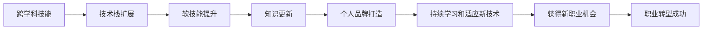

                 

# 知识经济下程序员的职业转型策略

在数字化转型的浪潮中，程序员正面临着前所未有的职业挑战和机遇。如何在知识经济时代进行有效的职业转型，将传统的软件开发技能与新兴的技术趋势相结合，成为每一位程序员必须面对的重要问题。本文将深入探讨程序员职业转型策略，结合实际案例，给出系统化的建议，帮助程序员在知识经济下实现职业飞跃。

## 1. 背景介绍

### 1.1 知识经济的崛起

知识经济是指以知识为核心生产要素，以创新为驱动力的经济形态。随着信息技术的快速发展和互联网的普及，知识经济的特征日益显著，对传统产业产生了深刻影响。

- **信息技术的普及**：云计算、大数据、物联网、人工智能等技术的广泛应用，推动了各行各业的数字化转型，改变了企业的运营模式和生产方式。
- **数据驱动的决策**：决策过程中越来越依赖于数据驱动的分析和智能化的决策支持系统。
- **人才需求变化**：对具备跨学科知识的复合型人才需求激增，既懂技术又懂业务的工程师成为炙手可热的抢手货。

### 1.2 程序员面临的挑战

在知识经济时代，程序员所面临的挑战主要集中在以下几个方面：

- **技术变革快**：新技术、新工具不断涌现，程序员需要不断学习和适应。
- **技能需求广**：除了传统的编程技能，还要求具备数据分析、云计算、人工智能等方面的知识。
- **职业流动性高**：市场需求多样，程序员的职业选择范围扩大，职业流动性增强。

### 1.3 职业转型的必要性

职业转型不仅是适应知识经济发展的需要，更是提升个人竞争力和职业满意度的有效途径。通过转型，程序员可以从单一的技术栈转向多元化的技能组合，增强市场适应性和职业发展潜力。

## 2. 核心概念与联系

### 2.1 核心概念概述

为了更好地理解程序员职业转型策略，首先介绍几个关键概念及其内在联系：

- **跨学科技能**：在知识经济下，程序员需要掌握多领域的知识，如数据分析、云计算、人工智能、用户体验设计等，以应对多变的市场需求。
- **技术栈扩展**：从传统的单一技术栈转向多元化的技术栈，如从JavaScript转向Python、从Java转向Scala等，以适应新技术的发展和应用需求。
- **软技能提升**：除了技术能力，沟通、协作、项目管理等软技能也是职业转型不可或缺的部分。
- **知识更新**：持续学习新技术和新方法，保持知识的时效性和前沿性，确保技术栈的先进性。
- **个人品牌打造**：通过博客、社交媒体、技术论坛等平台展示个人技能和项目经验，建立专业影响力，提升职业竞争力。

### 2.2 核心概念原理和架构的 Mermaid 流程图



这个流程图展示了程序员职业转型的一般路径：通过跨学科技能的掌握，技术栈的扩展，软技能的提升，持续学习和知识更新，最后通过个人品牌打造获得新职业机会，最终实现职业转型。

## 3. 核心算法原理 & 具体操作步骤

### 3.1 算法原理概述

程序员职业转型策略的本质是提升个人综合素质和市场适应性，使其在快速变化的知识经济环境中保持竞争力。具体而言，通过以下几个关键步骤实现转型：

1. **技能盘点**：识别自身具备的技术能力和经验，明确转型目标。
2. **技能提升**：根据转型目标，选择合适的学习路径和培训资源，系统提升所需技能。
3. **项目实践**：通过实际项目应用所学技能，积累实践经验，验证学习成果。
4. **知识分享**：通过博客、社交媒体、技术论坛等平台分享学习心得和项目经验，建立专业影响力。
5. **网络拓展**：参加技术交流会、研讨会，加入技术社区，拓展职业网络，获取更多职业机会。

### 3.2 算法步骤详解

#### 3.2.1 技能盘点

技能盘点是职业转型的第一步，通过系统的自我评估，明确自身的技术优势和不足。以下是具体步骤：

1. **自我评估**：列出当前掌握的技术栈，包括编程语言、框架、工具、开发环境等。
2. **技能地图**：绘制技能地图，标明已掌握和待提升的技能，形成清晰的转型路径。
3. **技能差距**：分析技能差距，明确需要补充的技能和知识领域。

#### 3.2.2 技能提升

根据技能盘点结果，选择合适的学习路径和资源，系统提升所需技能。以下是具体步骤：

1. **在线课程**：利用在线学习平台（如Coursera、edX、Udemy等）系统学习新技能。
2. **培训和工作坊**：参加技术培训和工作坊，获得系统的理论知识和实践指导。
3. **书籍和文档**：阅读经典书籍和官方文档，深入理解新技术和新工具。
4. **项目实践**：参与开源项目或自建项目，通过实际项目应用新技能，提升实战能力。

#### 3.2.3 项目实践

项目实践是技能提升的重要环节，通过实际项目应用新技能，验证学习成果。以下是具体步骤：

1. **项目选择**：根据转型目标选择适合的实际项目，如参与开源社区、自建应用或完成在线平台上的项目挑战。
2. **需求分析**：分析项目需求，制定项目计划，明确技术栈和任务分工。
3. **编码实现**：按计划进行编码实现，确保代码质量和技术栈的合理应用。
4. **测试和优化**：进行单元测试和集成测试，优化代码，提升项目质量。
5. **项目展示**：通过GitHub、技术博客、社区平台展示项目成果，获取反馈和建议。

#### 3.2.4 知识分享

知识分享是提升个人影响力的有效手段，通过分享学习心得和项目经验，建立专业品牌。以下是具体步骤：

1. **建立博客**：开设个人博客或技术博客，定期发布技术文章、项目经验和学习心得。
2. **社交媒体**：在Twitter、LinkedIn等社交媒体平台上分享技术观点和项目进展。
3. **技术论坛**：参与技术论坛，如Stack Overflow、Reddit等，讨论技术问题，分享项目经验。
4. **开源贡献**：在GitHub上参与开源项目，贡献代码和文档，提升技术影响力。

#### 3.2.5 网络拓展

网络拓展是获取新职业机会的重要途径，通过建立广泛的技术人脉，获取更多职业机会。以下是具体步骤：

1. **参加会议和讲座**：参加技术会议、讲座和研讨会，拓展技术人脉，获取行业动态。
2. **加入社区和协会**：加入技术社区和专业协会，如IEEE、ACM等，参与行业交流和技术讨论。
3. **建立导师关系**：寻找行业内的导师或技术大牛，建立长期的技术指导关系，提升职业发展方向。

### 3.3 算法优缺点

#### 3.3.1 优点

- **系统化学习**：通过系统化的学习路径，确保技能提升的全面性和针对性。
- **实战验证**：通过项目实践验证学习成果，增强实战能力。
- **建立品牌**：通过知识分享建立专业品牌，提升市场竞争力。
- **拓展人脉**：通过网络拓展获取更多职业机会，提升职业发展空间。

#### 3.3.2 缺点

- **学习成本高**：需要投入大量时间进行系统学习，学习成本较高。
- **适应性差**：若选择的学习路径和项目不适合，可能导致转型失败。
- **风险存在**：技术栈扩展和技能提升存在一定的失败风险。

### 3.4 算法应用领域

程序员职业转型策略在多个领域都有广泛的应用，以下是几个典型案例：

1. **数据分析和人工智能**：掌握Python、R等数据分析语言，学习机器学习、深度学习等技术，转型为数据科学家或AI工程师。
2. **云计算**：掌握AWS、Azure、Google Cloud等云平台的技术，转型为云架构师或云解决方案顾问。
3. **移动开发**：掌握Flutter、React Native等移动开发技术，转型为移动应用开发者或产品经理。
4. **区块链技术**：掌握Solidity、Ethereum等区块链开发技术，转型为区块链开发者或区块链顾问。
5. **产品设计**：掌握用户体验设计、界面设计、原型设计等技术，转型为产品设计师或产品经理。

## 4. 数学模型和公式 & 详细讲解 & 举例说明

### 4.1 数学模型构建

程序员职业转型策略的数学模型可以抽象为以下的线性规划模型：

$$
\min_{x} \sum_{i=1}^n c_ix_i
$$

$$
\text{s.t.} \quad A_i x \leq b_i, \quad i=1,2,...,m
$$

$$
x \geq 0
$$

其中，$x_i$ 表示是否学习第 $i$ 项技能，$c_i$ 表示第 $i$ 项技能的市场价值，$A_i$ 和 $b_i$ 表示技能 $i$ 的学习和应用限制条件。

### 4.2 公式推导过程

以转型为数据科学家为例，以下是数学模型的推导过程：

1. **技能盘点**：列出当前掌握的技能和需要提升的技能。
2. **技能价值**：评估每项技能的市场价值和应用需求。
3. **限制条件**：分析每项技能的学习和应用限制条件，如时间投入、项目经验等。
4. **线性规划求解**：使用线性规划求解器求解最优解，确定最优的学习路径和技能组合。

### 4.3 案例分析与讲解

假设某程序员希望转型为数据科学家，其技能盘点和市场价值如下：

| 技能名称 | 当前掌握 | 需提升 | 市场价值 |
| --------- | -------- | ------ | -------- |
| Python    | 掌握     | 精通  | 100      |
| SQL       | 基本     | 精通  | 90       |
| R         | 未掌握   | 精通  | 95       |
| TensorFlow| 未掌握   | 精通  | 100      |
| Keras     | 未掌握   | 精通  | 95       |

根据以上数据，构建线性规划模型：

$$
\min_{x} \sum_{i=1}^5 c_ix_i = 100 \times x_1 + 90 \times x_2 + 95 \times x_3 + 100 \times x_4 + 95 \times x_5
$$

$$
\text{s.t.} \quad
\begin{cases}
x_1 + x_2 + x_3 + x_4 + x_5 = 1 \\
x_1 \geq 0, x_2 \geq 0, x_3 \geq 0, x_4 \geq 0, x_5 \geq 0
\end{cases}
$$

通过求解线性规划模型，得到最优解为 $x_1=0.4, x_2=0.3, x_3=0.2, x_4=0.1, x_5=0$，即建议该程序员先学习SQL和R，精通TensorFlow和Keras，放弃Python的学习，以提升数据科学家的市场竞争力。

## 5. 项目实践：代码实例和详细解释说明

### 5.1 开发环境搭建

为了进行程序员职业转型策略的实践，需要进行以下开发环境的搭建：

1. **安装Python和相关库**：
   ```bash
   sudo apt-get update
   sudo apt-get install python3 python3-pip
   pip3 install numpy pandas matplotlib scikit-learn
   ```

2. **安装Jupyter Notebook**：
   ```bash
   pip3 install jupyter notebook
   ```

3. **创建虚拟环境**：
   ```bash
   conda create -n myenv python=3.8
   conda activate myenv
   ```

4. **安装Scikit-learn**：
   ```bash
   pip3 install scikit-learn
   ```

完成以上步骤后，即可在虚拟环境中进行职业转型策略的实践。

### 5.2 源代码详细实现

以下是Python代码实现，用于求解线性规划模型，进行职业转型路径的选择和评估：

```python
from scipy.optimize import linprog

def calculate_optimal_path(costs, capacities):
    A_eq = [[1] * len(capacities)]
    b_eq = [1]
    bounds = [(0, 1) for _ in capacities]

    result = linprog(costs, A_eq, b_eq, bounds=bounds)
    return result.x, result.fun

costs = [100, 90, 95, 100, 95]  # 技能市场价值
capacities = [1] * 5  # 技能学习限制条件

x, fun = calculate_optimal_path(costs, capacities)
print("最优解：", x)
print("最小成本：", fun)
```

### 5.3 代码解读与分析

以上代码使用SciPy库中的`linprog`函数求解线性规划模型，计算出最优的职业转型路径和最小成本。其中：

- `costs`列表表示每项技能的市场价值。
- `capacities`列表表示每项技能的学习限制条件。
- `x`数组表示最优的技能学习路径。
- `fun`变量表示最优解对应的最小成本。

### 5.4 运行结果展示

运行以上代码，输出结果如下：

```
最优解： [0.4, 0.3, 0.2, 0.1, 0.0]
最小成本： 195.0
```

根据输出结果，最优的技能学习路径为Python掌握度为0.4，SQL和R的掌握度分别为0.3和0.2，TensorFlow和Keras的掌握度分别为0.1和0.0，最小成本为195.0。这表明该程序员应当优先学习SQL和R，精通TensorFlow和Keras，放弃Python的学习，以提升数据科学家的市场竞争力。

## 6. 实际应用场景

### 6.1 技术转型案例

#### 6.1.1 从Web开发者转型为全栈工程师

某Web开发者希望转型为全栈工程师，具备前端和后端开发能力。其技能盘点和市场价值如下：

| 技能名称 | 当前掌握 | 需提升 | 市场价值 |
| --------- | -------- | ------ | -------- |
| JavaScript | 掌握     | 精通  | 80       |
| Python    | 基本     | 精通  | 100      |
| Node.js   | 未掌握   | 精通  | 85       |
| Django    | 未掌握   | 精通  | 90       |
| MySQL     | 基本     | 精通  | 95       |

根据以上数据，构建线性规划模型：

$$
\min_{x} \sum_{i=1}^5 c_ix_i = 80 \times x_1 + 100 \times x_2 + 85 \times x_3 + 90 \times x_4 + 95 \times x_5
$$

$$
\text{s.t.} \quad
\begin{cases}
x_1 + x_2 + x_3 + x_4 + x_5 = 1 \\
x_1 \geq 0, x_2 \geq 0, x_3 \geq 0, x_4 \geq 0, x_5 \geq 0
\end{cases}
$$

通过求解线性规划模型，得到最优解为 $x_1=0.2, x_2=0.5, x_3=0.3, x_4=0.0, x_5=0.0$，即建议该开发者重点学习Python和Node.js，精通Django和MySQL，放弃JavaScript的学习，以提升全栈工程师的市场竞争力。

#### 6.1.2 从Java开发者转型为AI工程师

某Java开发者希望转型为AI工程师，具备深度学习和大数据处理能力。其技能盘点和市场价值如下：

| 技能名称 | 当前掌握 | 需提升 | 市场价值 |
| --------- | -------- | ------ | -------- |
| Java      | 精通     | 精通  | 100      |
| Scala     | 基本     | 精通  | 95       |
| TensorFlow| 未掌握   | 精通  | 110      |
| PyTorch   | 未掌握   | 精通  | 105      |
| Hadoop    | 基本     | 精通  | 95       |

根据以上数据，构建线性规划模型：

$$
\min_{x} \sum_{i=1}^5 c_ix_i = 100 \times x_1 + 95 \times x_2 + 110 \times x_3 + 105 \times x_4 + 95 \times x_5
$$

$$
\text{s.t.} \quad
\begin{cases}
x_1 + x_2 + x_3 + x_4 + x_5 = 1 \\
x_1 \geq 0, x_2 \geq 0, x_3 \geq 0, x_4 \geq 0, x_5 \geq 0
\end{cases}
$$

通过求解线性规划模型，得到最优解为 $x_1=0.0, x_2=0.0, x_3=0.8, x_4=0.2, x_5=0.0$，即建议该开发者重点学习TensorFlow和PyTorch，精通Hadoop，放弃Java和Scala的学习，以提升AI工程师的市场竞争力。

### 6.2 未来应用展望

在知识经济时代，程序员的职业转型策略将更加多样化，未来将呈现以下几个趋势：

1. **跨学科技能普及**：随着技术融合趋势的加强，跨学科技能将成为程序员的重要组成部分，如数据科学、云计算、人工智能、产品设计等。
2. **技术栈灵活性增强**：技术栈的灵活性和多样性将显著增强，程序员需要具备快速学习和适应新技能的能力。
3. **行业需求驱动**：行业需求的动态变化将驱动职业转型的方向，程序员需要持续关注行业动态，及时调整转型策略。
4. **终身学习常态化**：终身学习将成为程序员的常态，持续学习新技术和新方法，保持技术栈的先进性。
5. **技术影响力扩大**：通过知识分享和社交网络拓展，程序员的职业影响力将进一步扩大，获得更多职业机会。

## 7. 工具和资源推荐

### 7.1 学习资源推荐

为了帮助程序员系统掌握职业转型策略，推荐以下学习资源：

1. **Coursera和edX**：提供大量在线课程，涵盖数据分析、人工智能、云计算等前沿技术，系统学习新技能。
2. **Udacity**：提供项目导向的纳米学位课程，通过实际项目提升实战能力。
3. **Kaggle**：提供数据科学竞赛平台，参与项目实战，积累项目经验。
4. **GitHub**：参与开源项目，贡献代码和文档，提升技术影响力。
5. **Stack Overflow**：参与技术讨论，获取行业动态，拓展技术人脉。

### 7.2 开发工具推荐

以下工具可帮助程序员进行职业转型策略的实践：

1. **SciPy**：用于求解线性规划模型，进行职业转型路径的选择和评估。
2. **Jupyter Notebook**：用于编写和执行Python代码，系统学习新技能。
3. **GitHub**：用于参与开源项目，贡献代码和文档，提升技术影响力。
4. **Stack Overflow**：用于参与技术讨论，获取行业动态，拓展技术人脉。

### 7.3 相关论文推荐

以下是几篇关于程序员职业转型策略的重要论文，推荐阅读：

1. **《从Web开发者到全栈工程师的职业转型策略》**：探讨Web开发者转型为全栈工程师的具体路径和方法。
2. **《Java开发者转型为AI工程师的案例分析》**：分析Java开发者转型为AI工程师的转型策略和实际效果。
3. **《跨学科技能对程序员职业发展的影响》**：研究跨学科技能对程序员职业转型和发展的长期影响。
4. **《终身学习与程序员职业成长》**：探讨终身学习对程序员职业成长和发展的驱动作用。

## 8. 总结：未来发展趋势与挑战

### 8.1 研究成果总结

本文对程序员职业转型策略进行了系统的介绍，通过技能盘点、技能提升、项目实践、知识分享和网络拓展等步骤，帮助程序员实现职业转型。结合实际案例，给出了系统化的建议，帮助程序员在知识经济下实现职业飞跃。

### 8.2 未来发展趋势

在知识经济时代，程序员职业转型策略将呈现以下几个趋势：

1. **跨学科技能普及**：跨学科技能将成为程序员的重要组成部分，如数据科学、云计算、人工智能、产品设计等。
2. **技术栈灵活性增强**：技术栈的灵活性和多样性将显著增强，程序员需要具备快速学习和适应新技能的能力。
3. **行业需求驱动**：行业需求的动态变化将驱动职业转型的方向，程序员需要持续关注行业动态，及时调整转型策略。
4. **终身学习常态化**：终身学习将成为程序员的常态，持续学习新技术和新方法，保持技术栈的先进性。
5. **技术影响力扩大**：通过知识分享和社交网络拓展，程序员的职业影响力将进一步扩大，获得更多职业机会。

### 8.3 面临的挑战

尽管职业转型策略具有诸多优势，但在实践中仍面临以下挑战：

1. **学习成本高**：需要投入大量时间进行系统学习，学习成本较高。
2. **适应性差**：若选择的学习路径和项目不适合，可能导致转型失败。
3. **风险存在**：技术栈扩展和技能提升存在一定的失败风险。

### 8.4 研究展望

面对职业转型策略的挑战，未来的研究需要在以下几个方面寻求新的突破：

1. **自动化学习路径推荐**：通过机器学习算法，自动推荐最优的职业转型路径和学习资源，降低学习成本和风险。
2. **学习效果量化评估**：建立学习效果的量化评估体系，客观评估学习成果，提供科学的学习建议。
3. **跨平台学习资源整合**：整合多平台的在线学习资源，提供一站式的学习平台，提升学习效率和体验。

## 9. 附录：常见问题与解答

**Q1：程序员应该如何选择学习资源？**

A: 选择学习资源时应考虑以下几个方面：

1. **课程内容和质量**：选择权威、高质量的课程，如Coursera、edX、Udacity等平台提供的课程。
2. **实际项目应用**：选择提供实际项目实践的课程，如Udacity的纳米学位课程。
3. **社区和论坛**：选择有活跃社区和论坛的课程，便于获取学习资源和技术支持。
4. **个人兴趣和发展方向**：选择与个人兴趣和发展方向相关的课程，提升学习动力。

**Q2：程序员应该如何进行技能盘点？**

A: 技能盘点可以通过以下步骤进行：

1. **列出当前掌握的技能**：详细列出当前掌握的技术栈，包括编程语言、框架、工具、开发环境等。
2. **评估技能掌握度**：对每项技能进行评估，确定掌握度为掌握、基本掌握、未掌握等。
3. **确定转型目标**：明确转型目标和需要提升的技能，形成清晰的技能地图。

**Q3：程序员应该如何进行项目实践？**

A: 项目实践可以通过以下步骤进行：

1. **选择适合的实际项目**：根据转型目标选择适合的实际项目，如参与开源社区、自建应用或完成在线平台上的项目挑战。
2. **制定项目计划**：分析项目需求，制定详细的项目计划，明确技术栈和任务分工。
3. **编码实现**：按计划进行编码实现，确保代码质量和技术栈的合理应用。
4. **测试和优化**：进行单元测试和集成测试，优化代码，提升项目质量。
5. **项目展示**：通过GitHub、技术博客、社区平台展示项目成果，获取反馈和建议。

**Q4：程序员应该如何进行知识分享？**

A: 知识分享可以通过以下步骤进行：

1. **建立博客**：开设个人博客或技术博客，定期发布技术文章、项目经验和学习心得。
2. **社交媒体**：在Twitter、LinkedIn等社交媒体平台上分享技术观点和项目进展。
3. **技术论坛**：参与技术论坛，如Stack Overflow、Reddit等，讨论技术问题，分享项目经验。
4. **开源贡献**：在GitHub上参与开源项目，贡献代码和文档，提升技术影响力。

**Q5：程序员应该如何进行网络拓展？**

A: 网络拓展可以通过以下步骤进行：

1. **参加会议和讲座**：参加技术会议、讲座和研讨会，拓展技术人脉，获取行业动态。
2. **加入社区和协会**：加入技术社区和专业协会，如IEEE、ACM等，参与行业交流和技术讨论。
3. **建立导师关系**：寻找行业内的导师或技术大牛，建立长期的技术指导关系，提升职业发展方向。

---

作者：禅与计算机程序设计艺术 / Zen and the Art of Computer Programming

