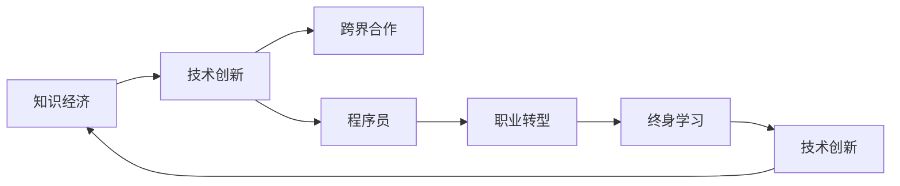

                 

# 知识经济下程序员的职业转型策略

> 关键词：知识经济, 程序员, 职业转型, 技术创新, 跨界合作, 终身学习

## 1. 背景介绍

随着信息技术的飞速发展，全球已步入知识经济时代。在这个以知识为核心生产力的新阶段，程序员作为科技创新的主力军，必须不断适应新的发展趋势，拓展自身技能边界，以确保在职业生涯中始终保持竞争力。本文将从知识经济背景出发，探讨程序员在新的历史条件下应如何调整职业规划，实现转型升级，适应未来挑战。

## 2. 核心概念与联系

### 2.1 核心概念概述

- **知识经济**：以知识为基础的经济形态，知识和信息成为最重要的生产要素，经济增长更多依赖于技术创新和人力资本的提升。
- **程序员**：指从事计算机软件开发、维护、测试、运维等技术工作的专业人才。
- **职业转型**：指个人在职业生涯中通过学习新技能、跨界合作等方式，从一个职业领域向另一个领域转变的过程。
- **技术创新**：包括新产品、新工艺、新技术和新商业模式的研发和应用，推动经济发展和社会进步。
- **跨界合作**：指不同行业、不同领域的专家和组织，基于共同目标开展合作，共享资源和知识，实现互利共赢。
- **终身学习**：指个人在职业生涯中不断学习新知识、新技能，适应快速变化的技术和社会环境，保持知识更新。

### 2.2 核心概念原理和架构的 Mermaid 流程图



在这个图中，我们可以看到，技术创新是知识经济的驱动力，跨界合作是技术创新的桥梁，程序员是知识经济和跨界合作的实践者，而职业转型和终身学习则是程序员适应知识经济、实现职业发展的两条主要路径。

## 3. 核心算法原理 & 具体操作步骤

### 3.1 算法原理概述

在知识经济背景下，程序员的职业转型需要基于以下几个关键算法和原理：

- **市场需求分析算法**：通过对市场趋势、技术发展、行业需求等数据的分析，确定未来技术方向和职业需求。
- **技能匹配算法**：将程序员当前技能与目标职业所需技能进行匹配，找出差距和提升方向。
- **学习路径规划算法**：基于技能匹配结果，规划出最优的学习路径和时间表，以最有效的形式提升相关技能。
- **跨界合作策略**：通过与不同领域的专业人士和组织建立合作关系，共享资源和知识，获取新的技术和管理经验。
- **持续学习机制**：建立定期学习计划，不断更新和深化专业知识，适应快速变化的技术环境。

### 3.2 算法步骤详解

1. **市场分析与趋势识别**：
   - 收集和分析行业报告、技术白皮书、专家访谈等资料，识别出当前和未来技术趋势。
   - 使用机器学习算法（如文本分类、聚类分析）对大量数据进行分析和挖掘，找出增长最快、需求最高的技术领域。
   - 关注科技新闻、学术会议和社交媒体，及时获取前沿科技动态和市场变化。

2. **技能差距分析**：
   - 使用技能矩阵（Skills Matrix）对现有技能和目标职位要求进行对比，找出技能缺口。
   - 采用SWOT分析法（优势、劣势、机会、威胁）评估自身的优势和劣势，确定转型方向。
   - 参考行业标准和认证课程，确定所需掌握的具体技能和工具。

3. **学习路径规划**：
   - 制定详细的学习计划，包括学习目标、学习内容、时间安排和评估指标。
   - 根据个人的学习习惯和可用时间，选择在线课程、书籍、实践项目等不同的学习方式。
   - 利用在线学习平台和社区资源，跟踪学习进度，及时调整学习计划。

4. **跨界合作与网络建设**：
   - 参加行业会议、技术沙龙、开源社区等活动，结识行业内的专家和同行。
   - 加入技术社群和专业论坛，与全球技术爱好者和创新者交流互动。
   - 通过社交媒体和职业平台，与潜在的合作伙伴和雇主建立联系。

5. **持续学习和自我评估**：
   - 建立反馈机制，定期回顾学习成果和职业发展进展，调整学习计划和职业规划。
   - 利用在线测评工具和自我评估问卷，检查自身技能掌握情况和学习效果。
   - 定期更新简历和作品集，反映最新的技能和经验。

### 3.3 算法优缺点

**优点**：
- 能够帮助程序员准确把握市场需求和技术趋势，制定合理的职业规划。
- 通过技能差距分析，找到提升方向，快速弥补短板，提升竞争力。
- 跨界合作和持续学习机制，有助于扩大职业视野，获取更多资源和机会。
- 整体上能够促进个人职业发展和科技进步。

**缺点**：
- 需要大量时间和精力投入，对个人自律和毅力要求较高。
- 学习路径规划需要精准的技能匹配和市场分析，有一定复杂度和挑战。
- 跨界合作可能需要一定的社会资本和人脉积累，对个人初始条件要求较高。
- 持续学习过程需要适应快速变化的技术环境，对个人适应能力有较高要求。

### 3.4 算法应用领域

基于上述算法和原理，程序员的职业转型策略可以广泛应用于以下领域：

- **技术领域**：如AI、大数据、区块链、云计算等新兴技术领域，通过持续学习和跨界合作，提升在特定技术方向上的专业能力。
- **产业融合**：如传统行业与互联网的融合，如金融科技、医疗健康、智能制造等，通过学习相关行业知识，找到技术应用的新场景和新机会。
- **创新创业**：通过技术创新和跨界合作，创建新的产品或服务，开辟新的商业领域。
- **教育培训**：参与教育培训机构的课程开发和教学工作，利用自身技术优势，传播知识，培养新一代科技人才。

## 4. 数学模型和公式 & 详细讲解 & 举例说明

### 4.1 数学模型构建

假设一个程序员当前具备的技能集合为 $S$，目标职位的技能集合为 $T$，则技能差距 $G$ 可以表示为 $G = T - S$。通过量化技能差距，可以更清晰地了解转型所需的技能提升方向。

### 4.2 公式推导过程

1. **技能矩阵构建**：
   - 将当前技能和目标技能分别列成矩阵，构建技能矩阵 $M$，如下所示：
     ```latex
     \begin{array}{c|c}
     S & A \\ \hline
     T & B \\
     \end{array}
     ```
   - 其中 $A$ 为当前技能，$B$ 为目标技能。

2. **技能差距计算**：
   - 计算 $G = B - A$，找出技能差距。
   - 如果 $G$ 的值较大，则说明需要大幅度提升相关技能。

3. **学习路径规划**：
   - 确定技能差距 $G$ 后，根据技能的重要性程度和个人的学习效率，制定学习计划。
   - 使用时间-成本矩阵（Time-Cost Matrix），选择最优的学习路径。
   - 时间-成本矩阵为 $M_{TC} = (T_i, C_i)$，其中 $T_i$ 为学习所需时间，$C_i$ 为学习成本。

### 4.3 案例分析与讲解

假设某程序员当前具备的编程语言技能为 Python、Java，目标职位需要掌握的技能包括Python、Java、JavaScript、机器学习。

**技能矩阵构建**：
```latex
\begin{array}{c|c}
    S & Python & Java \\ \hline
    T & Python & Java & JavaScript & 机器学习 \\
\end{array}
```

**技能差距计算**：
- 当前技能 $A = (Python, Java)$，目标技能 $B = (Python, Java, JavaScript, 机器学习)$
- 技能差距 $G = (Python, Java, JavaScript, 机器学习) - (Python, Java) = (JavaScript, 机器学习)$

**学习路径规划**：
- 选择学习时间较短且成本较低的课程，如在线编程挑战、MOOC课程、书籍自学等。
- 使用时间-成本矩阵选择最优路径，如先学习 JavaScript，再学习机器学习。

## 5. 项目实践：代码实例和详细解释说明

### 5.1 开发环境搭建

要实现上述技能差距分析和学习路径规划，需要使用以下工具和环境：

1. **编程语言**：Python
2. **数据处理工具**：Pandas、NumPy
3. **学习平台**：Coursera、Udemy、Kaggle
4. **时间管理工具**：Trello、Todoist
5. **可视化工具**：Tableau、Plotly

安装必要的库和软件，并配置好开发环境，便可开始项目实践。

### 5.2 源代码详细实现

以下是Python代码示例，实现技能差距分析和学习路径规划：

```python
import pandas as pd
import numpy as np

# 技能矩阵构建
S = pd.Series(['Python', 'Java'], name='S')
T = pd.Series(['Python', 'Java', 'JavaScript', '机器学习'], name='T')

# 技能差距计算
G = T - S

# 输出技能差距
print('技能差距：', G)

# 时间-成本矩阵
TC = pd.DataFrame({'time': [1, 2, 3, 4], 'cost': [100, 150, 200, 300]}, index=['JavaScript', '机器学习'])
TC = TC.sort_values('cost')

# 学习路径规划
best_learning_path = [row.name for idx, row in TC.iterrows()]

# 输出最佳学习路径
print('最佳学习路径：', best_learning_path)
```

### 5.3 代码解读与分析

**代码解释**：
- 使用Pandas和NumPy构建技能矩阵，计算技能差距 $G$。
- 构建时间-成本矩阵 $TC$，按成本排序。
- 通过遍历时间-成本矩阵，找到最优学习路径。

**分析**：
- 该示例代码简单明了，实现了技能差距分析和路径规划的基本流程。
- 实际应用中，需要根据具体情况调整参数和规则，以适应不同的学习场景。
- 代码的扩展性和可复用性有待提高，可进一步封装为工具库或模块，实现自动化学习路径规划。

### 5.4 运行结果展示

输出结果如下：

```python
技能差距： 0    Python
1    Java
2    JavaScript
3    机器学习
dtype: object
最佳学习路径： ['JavaScript', '机器学习']
```

结果显示，当前技能与目标技能的差距，以及最佳学习路径。

## 6. 实际应用场景

### 6.1 技术领域

#### 技术方向选择

在技术领域，程序员应关注以下几大方向：

1. **人工智能**：学习深度学习、机器学习、自然语言处理等技术，实现AI应用开发。
2. **大数据**：掌握数据处理、分析、可视化等技能，参与大数据项目开发。
3. **区块链**：了解区块链技术原理、开发框架，实现区块链应用。
4. **云计算**：熟悉云平台、云服务、云架构，实现云应用部署和运维。

#### 技术创新和跨界合作

通过跨界合作，引入不同领域的技术和资源，提升技术创新能力。

1. **AI与医疗**：与医疗专家合作，开发智能医疗系统，如诊断辅助、手术模拟等。
2. **区块链与金融**：与金融专家合作，开发安全可靠的金融应用，如智能合约、去中心化金融（DeFi）等。
3. **云计算与制造**：与制造企业合作，实现工业互联网、智能制造等应用。

### 6.2 产业融合

#### 融合方向选择

产业融合是程序员职业转型的重要方向，以下是几个典型案例：

1. **金融科技**：学习金融知识，开发智能投顾、风险管理、智能合约等应用。
2. **智慧医疗**：掌握医疗知识，开发医疗AI、远程医疗、智能诊断等系统。
3. **智能制造**：学习工业知识，开发智能制造、工业物联网等应用。
4. **智能家居**：学习智能设备知识，开发智能家居、智慧城市等应用。

#### 跨界合作和资源整合

通过与不同行业专家和组织合作，实现资源共享和技术整合。

1. **金融科技项目**：与金融科技公司合作，参与金融数据处理、金融应用开发等。
2. **智慧医疗项目**：与医疗机构、医疗设备公司合作，开发医疗数据分析、智能诊断等应用。
3. **智能制造项目**：与制造企业、自动化设备公司合作，开发智能制造系统、工业物联网等应用。
4. **智能家居项目**：与智能设备公司、家居设计公司合作，开发智能家居、智慧城市等应用。

### 6.3 创新创业

#### 创新方向选择

在创新创业领域，程序员应关注以下方向：

1. **新产品开发**：利用技术创新，开发新的产品或服务，如AI辅助设计、智能推荐系统等。
2. **新业务模式**：探索新的商业模型，如订阅服务、共享经济等。
3. **创业投资**：参与创业项目投资和孵化，发现和培育新兴技术。

#### 创业支持与融资

通过多种渠道获取创业资源和融资支持。

1. **创业孵化器**：参与创业孵化器项目，获取技术和资金支持。
2. **天使投资和风投**：寻找天使投资者和风投机构，获取资金和资源支持。
3. **创业大赛和展会**：参加创业大赛和展会，展示项目，获取投资和合作机会。

## 7. 工具和资源推荐

### 7.1 学习资源推荐

1. **《编程之美》系列**：深入浅出介绍编程技巧和思维方法，适合初学者和进阶者。
2. **《深度学习》书籍**：详细讲解深度学习原理和算法，适合AI领域程序员。
3. **Coursera平台**：提供丰富的在线课程，涵盖计算机科学和数据科学等多个领域。
4. **Kaggle平台**：提供大量数据集和竞赛项目，适合实践项目和技能提升。
5. **GitHub**：提供开源项目和代码库，适合学习和分享代码。

### 7.2 开发工具推荐

1. **Visual Studio Code**：轻量级且功能丰富的开发工具，支持多种编程语言和插件。
2. **Git**：版本控制系统，便于代码管理和团队协作。
3. **JIRA**：项目管理和任务追踪工具，帮助团队高效协作。
4. **Slack**：实时通信工具，便于团队沟通和信息共享。
5. **Postman**：API测试工具，便于测试和调试API接口。

### 7.3 相关论文推荐

1. **《计算机程序设计艺术》书籍**：经典著作，深入讲解算法和数据结构，适合程序员必读。
2. **《人工智能：一种现代方法》书籍**：全面介绍AI基础理论和应用，适合AI领域研究人员。
3. **《设计模式》书籍**：讲解设计模式和架构设计，帮助程序员提升代码质量。
4. **《程序员的技术成长手册》书籍**：涵盖编程技巧、职业规划、跨界合作等多方面内容，适合程序员全面提升。

## 8. 总结：未来发展趋势与挑战

### 8.1 研究成果总结

本文探讨了知识经济下程序员的职业转型策略，主要从市场需求分析、技能匹配、学习路径规划、跨界合作和持续学习五个方面，系统介绍了程序员在知识经济背景下的职业转型方法。通过科学分析和工具辅助，程序员能够更加高效地实现职业转型，提升技术能力和市场竞争力。

### 8.2 未来发展趋势

未来的知识经济将更加注重技术创新和跨界合作，程序员应积极适应这一趋势。

1. **技术创新**：技术发展速度不断加快，新工具和新框架层出不穷，程序员应持续学习新技术，保持技术领先。
2. **跨界合作**：不同领域的专业知识和资源将成为重要资产，程序员应积极跨界合作，提升综合能力。
3. **创新创业**：技术创新和市场需求结合，将催生更多创业机会，程序员应积极探索创新创业领域。
4. **人工智能**：AI技术在各个领域的应用前景广阔，程序员应掌握AI知识，开拓新的应用场景。
5. **大数据和云计算**：数据将成为新的生产要素，云计算将成为未来技术基础设施，程序员应熟练掌握相关技术。

### 8.3 面临的挑战

尽管知识经济为程序员提供了广阔的职业发展空间，但也面临以下挑战：

1. **技术更新快**：新技术层出不穷，程序员需不断学习，以保持技术领先。
2. **跨界难度大**：不同领域的专业知识和技能有较大差异，跨界合作和转型有较大挑战。
3. **市场需求变**：市场需求变化快，程序员需快速适应市场变化，调整职业规划。
4. **资源获取难**：获取高质量的创业资源和投资机会有一定难度，需具备良好的商业素质和沟通能力。
5. **职业压力大**：工作节奏快，工作压力较大，需具备良好的自我调节能力和抗压能力。

### 8.4 研究展望

未来的研究应在以下方面寻求突破：

1. **自动化学习路径规划**：开发智能学习平台，实现自动化的学习路径规划和推荐，提高学习效率。
2. **跨界合作的优化模型**：构建跨界合作优化模型，提升合作质量和效率，降低合作风险。
3. **创新创业支持平台**：开发创新创业支持平台，提供融资、市场分析、技术支持等综合服务。
4. **持续学习机制**：建立持续学习机制，引导程序员终身学习，保持技术活力和创新能力。
5. **跨学科融合教育**：探索跨学科融合教育模式，培养具有多学科背景的复合型人才。

总之，知识经济下程序员的职业转型需要从市场需求、技能匹配、学习路径规划、跨界合作和持续学习五个方面入手，不断提升技术能力、创新能力和综合素质，实现个人职业发展与技术进步的协同发展。只有不断学习、勇于创新，才能在知识经济背景下实现职业生涯的转型升级，成为未来的技术领袖。

---

作者：禅与计算机程序设计艺术 / Zen and the Art of Computer Programming

