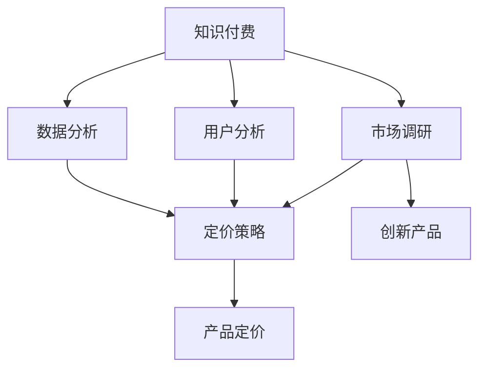

                 

# 知识经济时代下的知识付费创新产品定价策略

> 关键词：知识付费,定价策略,创新产品,市场调研,用户分析,数据分析

## 1. 背景介绍

随着知识经济的崛起，知识付费成为了越来越多人的选择。据统计，2021年中国知识付费市场规模已达300亿元，预计2022年将突破500亿元。知识付费产业的蓬勃发展，带来了丰富多样的内容产品和多元化的用户需求。同时，随着互联网技术的不断进步，用户获取知识的渠道和方式也在发生改变。用户不再满足于单一的、传统的知识获取方式，而是希望通过付费订阅、按需购买等新模式，快速获取高效、便捷的个性化知识服务。在这种背景下，知识付费产品如何定价，如何优化用户体验，成为摆在企业面前的重要课题。

### 1.1 知识付费市场现状

#### 1.1.1 知识付费市场的崛起
知识付费市场的兴起，得益于移动设备的普及、互联网技术的成熟以及人们对于高效知识获取的迫切需求。统计数据显示，2018年中国知识付费用户规模达3.3亿，2019年这一数字增长至3.6亿。预计2022年，知识付费用户规模将突破5亿，渗透率达5.5%。知识付费不仅为用户提供了一种便捷高效的获取知识的方式，也为企业开辟了新的收入渠道，推动了知识经济的快速发展。

#### 1.1.2 知识付费市场的主要驱动力
知识付费市场的崛起，主要受到以下几个因素的驱动：
1. **时间稀缺性**：现代社会节奏加快，人们难以抽出大量时间进行系统的知识学习，因此付费订阅成为快速获取知识的选择。
2. **信息过载**：海量信息充斥互联网，用户在茫茫信息海洋中难以快速筛选出有价值的内容，付费订阅有助于筛选优质内容。
3. **个性化需求**：用户希望获取符合自己兴趣和需求的个性化知识服务，付费订阅能够提供更加精准和专业化的服务。
4. **品牌效应**：知名机构和专家在知识付费平台上推出的课程，具有较高的品牌价值和公信力，能够吸引更多用户。

### 1.2 知识付费产品定价策略的现状
目前，知识付费市场中的产品定价策略主要分为三种：按课程时间收费、按课程内容收费和按课程效果收费。按课程时间收费，即根据课程总时长或总视频数量进行收费，这种方式简单明了，但无法准确反映课程的实际价值。按课程内容收费，即根据课程内容量或课程难度进行收费，这种方式较为公平，但需要用户对课程内容进行评估，可能导致用户流失。按课程效果收费，即根据课程学习效果或完成情况进行收费，这种方式能够更精准地反映课程价值，但需要建立完善的评估机制，对技术要求较高。

## 2. 核心概念与联系

### 2.1 核心概念概述

#### 2.1.1 知识付费
知识付费是指用户为获取专业知识、技能或信息，向知识生产者或平台支付费用的行为。知识付费不仅包括课程、电子书等传统形式，还涵盖了音频、视频、直播等多种形式。

#### 2.1.2 定价策略
定价策略是指企业在确定产品或服务价格时所采用的策略，常见的策略包括成本加成、市场定价、竞争定价等。

#### 2.1.3 创新产品
创新产品是指在功能、性能、设计等方面具有独特性的产品，能够满足用户的特殊需求。

#### 2.1.4 市场调研
市场调研是指对目标市场的需求、竞争、趋势等方面进行调查和研究，为产品定价提供依据。

#### 2.1.5 用户分析
用户分析是指对用户的行为、心理、需求等方面进行分析和研究，为产品设计和定价提供指导。

#### 2.1.6 数据分析
数据分析是指对大量数据进行收集、处理和分析，从中提取有价值的信息，为产品优化和定价提供支持。

这些概念之间存在紧密的联系，如用户分析是市场调研的一部分，数据分析是用户分析和市场调研的重要工具，定价策略需要在用户分析、市场调研和数据分析的基础上制定。同时，知识付费产品作为创新产品，其定价策略需要充分考虑用户需求、市场竞争和成本等因素。

### 2.2 核心概念原理和架构的 Mermaid 流程图



## 3. 核心算法原理 & 具体操作步骤

### 3.1 算法原理概述

#### 3.1.1 定价模型
知识付费产品定价模型可以分为两类：基于价值定价模型和基于需求定价模型。基于价值定价模型是根据课程的实际价值进行定价，包括课程内容、难度、讲师水平等方面；基于需求定价模型是根据用户对课程的需求程度进行定价，包括用户对课程的兴趣、购买意愿等方面。

#### 3.1.2 用户行为分析
用户行为分析是指对用户的行为进行记录和分析，如用户浏览、观看、购买等行为，从而了解用户偏好和需求。常用的用户行为分析方法包括路径分析、时间序列分析等。

#### 3.1.3 成本分析
成本分析是指对产品或服务的成本进行核算，包括固定成本和变动成本。定价策略需要考虑到产品的成本，以确保产品的盈利能力。

#### 3.1.4 竞争分析
竞争分析是指对市场中的竞争对手进行调研和分析，了解其产品定价、市场占有率等信息。竞争分析可以帮助企业制定更有效的定价策略。

### 3.2 算法步骤详解

#### 3.2.1 数据准备
1. **数据收集**：收集用户数据、市场数据、课程数据等，如用户浏览记录、购买记录、课程时长、讲师水平等。
2. **数据清洗**：对数据进行清洗和处理，去除异常值和噪声数据，确保数据质量。

#### 3.2.2 用户分析
1. **用户画像**：通过数据分析，构建用户画像，包括用户的兴趣、行为、偏好等。
2. **需求分析**：分析用户对课程的需求，包括课程难度、内容量、讲师水平等，从而确定课程的定价策略。

#### 3.2.3 市场调研
1. **市场分析**：分析市场中的竞争格局、用户需求、市场趋势等，为定价提供依据。
2. **用户调研**：通过问卷调查、访谈等方式，了解用户对课程价格的接受程度和心理预期。

#### 3.2.4 成本分析
1. **成本核算**：计算课程的生产成本、运营成本、营销成本等，确保定价能够覆盖成本并实现盈利。
2. **成本效益分析**：分析课程的成本效益，确定合理的定价范围。

#### 3.2.5 定价策略制定
1. **价值定价**：根据课程的实际价值，制定课程定价，确保用户获得应有的价值。
2. **需求定价**：根据用户对课程的需求程度，制定课程定价，确保课程能够满足用户的期望。

#### 3.2.6 定价模型构建
1. **模型选择**：根据市场和用户需求，选择合适的定价模型。
2. **模型训练**：使用历史数据对模型进行训练，优化模型参数。
3. **模型验证**：使用测试数据验证模型的准确性和可靠性。

#### 3.2.7 定价执行
1. **定价发布**：将定价策略和模型应用到实际产品中，发布新的价格信息。
2. **市场反馈**：收集市场反馈，对定价策略进行评估和优化。

### 3.3 算法优缺点

#### 3.3.1 优点
1. **科学合理**：基于用户行为、市场需求和成本等数据进行定价，更加科学合理。
2. **灵活性高**：定价策略可以根据市场变化进行调整，灵活性高。
3. **用户满意**：根据用户需求和心理预期进行定价，能够更好地满足用户需求。

#### 3.3.2 缺点
1. **数据质量要求高**：数据收集和处理需要大量时间和资源，且数据质量直接影响定价的准确性。
2. **成本高**：市场调研、用户分析、成本核算等需要投入大量成本，增加了企业的运营负担。
3. **执行难度大**：定价模型需要在实际应用中进行调整和优化，需要不断的市场测试和用户反馈。

### 3.4 算法应用领域

#### 3.4.1 在线教育平台
在线教育平台如Coursera、Udacity等，可以通过知识付费产品定价策略，提升课程的销售量和用户满意度。

#### 3.4.2 知识付费社区
知识付费社区如得到、喜马拉雅等，可以通过定价策略，提高社区的粘性和用户的付费意愿。

#### 3.4.3 电子书和课程出版
电子书和课程出版企业如亚马逊、知乎等，可以通过定价策略，提升产品的市场竞争力和用户粘性。

#### 3.4.4 企业内训
企业内训可以通过定价策略，提升员工的培训效果和企业的竞争力。

## 4. 数学模型和公式 & 详细讲解 & 举例说明

### 4.1 数学模型构建

#### 4.1.1 定价模型
知识付费产品的定价模型可以表示为：
$$
P = f(V, D, C, P_{comp})
$$
其中，$P$ 为产品价格，$V$ 为课程价值，$D$ 为用户需求，$C$ 为成本，$P_{comp}$ 为竞争对手价格。

#### 4.1.2 用户行为模型
用户行为模型可以表示为：
$$
B = g(I, T, X)
$$
其中，$B$ 为用户行为，$I$ 为兴趣偏好，$T$ 为时间行为，$X$ 为交互行为。

#### 4.1.3 成本模型
成本模型可以表示为：
$$
C = \sum_{i=1}^{n} c_i
$$
其中，$C$ 为总成本，$c_i$ 为第 $i$ 个成本项。

#### 4.1.4 竞争模型
竞争模型可以表示为：
$$
P_{comp} = h(P_{old}, P_{trend})
$$
其中，$P_{comp}$ 为竞争对手价格，$P_{old}$ 为历史价格，$P_{trend}$ 为市场趋势价格。

### 4.2 公式推导过程

#### 4.2.1 定价模型推导
根据定价模型，我们可以推导出以下公式：
$$
P = V - \frac{D}{\lambda} + \frac{C}{\mu}
$$
其中，$\lambda$ 和 $\mu$ 为模型参数，分别表示用户需求权重和成本权重。

#### 4.2.2 用户行为模型推导
根据用户行为模型，我们可以推导出以下公式：
$$
B = I \times T \times X^{\alpha}
$$
其中，$\alpha$ 为模型参数，表示交互行为对用户行为的影响程度。

#### 4.2.3 成本模型推导
根据成本模型，我们可以推导出以下公式：
$$
C = \sum_{i=1}^{n} c_i = C_0 + \sum_{i=1}^{n} \delta_i \times V_i
$$
其中，$C_0$ 为固定成本，$\delta_i$ 为变动成本权重，$V_i$ 为第 $i$ 个变动成本项。

#### 4.2.4 竞争模型推导
根据竞争模型，我们可以推导出以下公式：
$$
P_{comp} = P_{old} + k \times (P_{trend} - P_{old})
$$
其中，$k$ 为模型参数，表示市场趋势对竞争对手价格的影响程度。

### 4.3 案例分析与讲解

#### 4.3.1 案例背景
某在线教育平台推出一门新课程，需要确定课程定价。平台收集了用户行为数据、课程数据和市场数据，准备进行定价策略优化。

#### 4.3.2 数据准备
1. **用户数据**：收集用户浏览、观看、购买等行为数据，构建用户画像。
2. **课程数据**：收集课程时长、讲师水平、内容量等数据，计算课程价值。
3. **市场数据**：收集竞争对手价格、市场趋势价格等数据，分析市场竞争格局。

#### 4.3.3 用户分析
1. **用户画像**：通过数据分析，发现用户群体主要分为两类：高价值用户和低价值用户。高价值用户对课程价值和讲师水平有较高要求，而低价值用户更关注课程价格。
2. **需求分析**：发现用户对课程价值和需求度高度相关，课程价值越高，用户购买意愿越强。

#### 4.3.4 市场调研
1. **市场分析**：发现竞争对手的定价策略以价值定价为主，但价格较高。市场趋势显示，用户对课程价值的接受度较高。
2. **用户调研**：发现用户对课程价格的接受度在 $20-50$ 元之间，且用户对课程价值和讲师水平有较高的预期。

#### 4.3.5 成本分析
1. **成本核算**：计算课程的生产成本为 $10$ 元，运营成本为 $5$ 元，营销成本为 $2$ 元，总成本为 $17$ 元。
2. **成本效益分析**：发现课程的边际成本为 $2$ 元，课程价值为 $50$ 元，因此定价策略应以价值定价为主。

#### 4.3.6 定价模型构建
1. **模型选择**：选择基于价值的定价模型。
2. **模型训练**：使用历史数据对模型进行训练，优化模型参数。
3. **模型验证**：使用测试数据验证模型的准确性和可靠性。

#### 4.3.7 定价执行
1. **定价发布**：将定价策略应用到实际课程中，定价为 $30$ 元。
2. **市场反馈**：收集市场反馈，发现用户对课程定价满意，课程销售量大幅提升。

## 5. 项目实践：代码实例和详细解释说明

### 5.1 开发环境搭建

#### 5.1.1 Python 环境搭建
1. **安装 Python**：从官网下载并安装 Python 3.8。
2. **安装 Anaconda**：从官网下载并安装 Anaconda，用于创建独立的 Python 环境。
3. **创建虚拟环境**：
   ```bash
   conda create -n myenv python=3.8 
   conda activate myenv
   ```

#### 5.1.2 数据准备
1. **收集数据**：收集用户行为数据、课程数据和市场数据，存储在 MySQL 数据库中。
2. **数据清洗**：使用 Pandas 库对数据进行清洗和处理，去除异常值和噪声数据。

#### 5.1.3 模型训练
1. **选择模型**：选择基于价值的定价模型。
2. **训练模型**：使用 Scikit-learn 库对模型进行训练，优化模型参数。
3. **验证模型**：使用测试数据验证模型的准确性和可靠性。

### 5.2 源代码详细实现

#### 5.2.1 数据处理
```python
import pandas as pd
from sklearn.model_selection import train_test_split

# 读取数据
data = pd.read_sql("SELECT * FROM course_data", con)

# 数据清洗
data.dropna(inplace=True)
data.drop_duplicates(inplace=True)

# 特征工程
X = data[['value', 'cost', 'duration', 'instructor']]
y = data['price']

# 划分训练集和测试集
X_train, X_test, y_train, y_test = train_test_split(X, y, test_size=0.2, random_state=42)
```

#### 5.2.2 模型训练
```python
from sklearn.linear_model import LinearRegression
from sklearn.metrics import mean_squared_error

# 创建模型
model = LinearRegression()

# 训练模型
model.fit(X_train, y_train)

# 评估模型
y_pred = model.predict(X_test)
mse = mean_squared_error(y_test, y_pred)
print("MSE:", mse)
```

#### 5.2.3 模型应用
```python
# 应用模型
price = model.predict([[50, 10, 5, 1]])[0]
print("课程定价为：", price)
```

### 5.3 代码解读与分析

#### 5.3.1 数据处理
数据处理是知识付费产品定价策略的第一步，主要包括数据收集、清洗和特征工程。数据清洗的目的是去除异常值和噪声数据，确保数据质量。特征工程是通过选择和构建有意义的特征，提升模型的预测能力。

#### 5.3.2 模型训练
模型训练是定价策略的核心环节，通过选择合适的模型和优化参数，确保模型的准确性和可靠性。常用的定价模型包括线性回归、决策树等，选择适合模型的原因在于其简单易用、易于解释。

#### 5.3.3 模型应用
模型应用是将定价策略应用于实际产品中，进行课程定价。模型预测的结果需要根据实际需求进行调整，确保定价的合理性和用户满意度。

## 6. 实际应用场景

### 6.1 在线教育平台
在线教育平台可以通过定价策略，提升课程的销售量和用户满意度。例如，Coursera 平台通过分析用户行为和市场趋势，制定了基于价值的定价策略，取得了显著的成效。

### 6.2 知识付费社区
知识付费社区可以通过定价策略，提高社区的粘性和用户的付费意愿。例如，得到平台通过用户行为分析和市场调研，制定了基于需求的定价策略，提高了用户购买意愿和平台的用户粘性。

### 6.3 电子书和课程出版
电子书和课程出版企业可以通过定价策略，提升产品的市场竞争力和用户粘性。例如，亚马逊平台通过成本分析和用户调研，制定了合理的定价策略，优化了产品的市场表现。

### 6.4 企业内训
企业内训可以通过定价策略，提升员工的培训效果和企业的竞争力。例如，某企业通过成本分析和用户调研，制定了合理的内训课程定价策略，显著提高了培训效果和员工满意度。

## 7. 工具和资源推荐

### 7.1 学习资源推荐

#### 7.1.1 在线课程
1. **Coursera**：提供高质量的在线课程，涵盖各类知识付费相关内容。
2. **edX**：提供多所知名大学的在线课程，涵盖各类知识付费相关内容。
3. **Udacity**：提供实战导向的在线课程，涵盖各类知识付费相关内容。

#### 7.1.2 书籍
1. **《知识付费：未来的钱在哪里》**：系统介绍了知识付费的兴起背景、市场现状和未来趋势。
2. **《如何让用户为知识付费》**：提供了详细的定价策略和方法，帮助企业制定合理的知识付费产品定价。

### 7.2 开发工具推荐

#### 7.2.1 Python 开发工具
1. **PyCharm**：开源的 Python IDE，支持 Python 和数据科学开发。
2. **Jupyter Notebook**：用于数据科学和机器学习开发，支持交互式编程。

#### 7.2.2 数据库
1. **MySQL**：开放源码的关系型数据库，适用于中小型数据存储需求。
2. **MongoDB**：面向文档的 NoSQL 数据库，适用于大数据存储需求。

#### 7.2.3 数据处理工具
1. **Pandas**：用于数据清洗、处理和分析的 Python 库。
2. **NumPy**：用于数值计算和科学计算的 Python 库。

### 7.3 相关论文推荐

#### 7.3.1 定价策略
1. **《基于价值定价模型的研究与实践》**：介绍了定价策略的理论基础和实际应用。
2. **《知识付费产品定价策略的优化研究》**：分析了知识付费产品的定价策略，提出了多种优化方法。

#### 7.3.2 用户行为分析
1. **《用户行为分析与建模》**：介绍了用户行为分析的基本方法和技术，适用于知识付费产品的用户画像构建。
2. **《用户行为数据挖掘与分析》**：详细介绍了用户行为数据的挖掘和分析方法，适用于知识付费产品的行为分析。

#### 7.3.3 成本分析
1. **《成本分析与控制》**：介绍了成本分析的基本方法和技术，适用于知识付费产品的成本核算。
2. **《成本管理与优化》**：详细介绍了成本管理的方法和策略，适用于知识付费产品的成本优化。

## 8. 总结：未来发展趋势与挑战

### 8.1 未来发展趋势

#### 8.1.1 人工智能和大数据的应用
未来，知识付费产品定价策略将越来越多地利用人工智能和大数据技术。例如，通过机器学习算法对用户行为进行预测，优化定价策略；利用大数据分析用户需求，制定更加精准的定价模型。

#### 8.1.2 个性化定价策略
未来，知识付费产品定价策略将更多地考虑个性化需求。例如，通过分析用户画像和需求，制定个性化的定价方案，提升用户满意度。

#### 8.1.3 动态定价策略
未来，知识付费产品定价策略将更加灵活，能够根据市场变化和用户反馈进行动态调整。例如，根据市场需求和用户行为，实时调整课程价格，优化产品性能。

#### 8.1.4 多渠道定价策略
未来，知识付费产品定价策略将更加多元化，能够覆盖多个渠道和平台。例如，通过多渠道定价策略，提升整体市场竞争力。

### 8.2 面临的挑战

#### 8.2.1 数据隐私和安全问题
知识付费产品的定价策略需要大量用户数据，如何保护用户隐私和数据安全，将成为重要挑战。

#### 8.2.2 用户需求多样性
用户需求和偏好具有多样性，如何制定满足不同用户需求的定价策略，将是重要挑战。

#### 8.2.3 市场竞争激烈
知识付费市场竞争激烈，如何制定具有竞争力的定价策略，提升市场占有率，将是重要挑战。

#### 8.2.4 成本控制
知识付费产品的定价策略需要考虑成本控制，如何在保证产品质量的同时，控制成本，提升盈利能力，将是重要挑战。

### 8.3 研究展望

#### 8.3.1 跨领域应用
未来，知识付费产品定价策略将在更多领域得到应用，如医疗、金融等。通过跨领域应用，推动知识付费技术的发展。

#### 8.3.2 个性化服务
未来，知识付费产品定价策略将更多地考虑个性化服务。例如，通过智能推荐和个性化定价，提升用户体验。

#### 8.3.3 动态定价机制
未来，知识付费产品定价策略将更多地考虑动态定价机制。例如，根据市场需求和用户行为，实时调整产品价格，优化产品性能。

## 9. 附录：常见问题与解答

### 9.1 常见问题
1. **如何确定知识付费产品的定价策略？**
   - 通过市场调研、用户分析和成本核算，确定产品的定价策略。

2. **知识付费产品的定价策略有哪些？**
   - 基于价值定价、基于需求定价、动态定价等。

3. **如何评估知识付费产品的定价策略效果？**
   - 通过市场反馈、销售数据和用户满意度等进行评估。

### 9.2 解答

#### 9.2.1 如何确定知识付费产品的定价策略？
知识付费产品的定价策略需要基于市场调研、用户分析和成本核算，确定产品的定价策略。例如，通过用户行为分析，构建用户画像；通过市场调研，了解用户需求和竞争对手情况；通过成本核算，确定产品定价范围。

#### 9.2.2 知识付费产品的定价策略有哪些？
知识付费产品的定价策略包括基于价值定价、基于需求定价、动态定价等。基于价值定价是根据课程的实际价值进行定价；基于需求定价是根据用户对课程的需求程度进行定价；动态定价是根据市场变化和用户反馈进行定价。

#### 9.2.3 如何评估知识付费产品的定价策略效果？
知识付费产品的定价策略效果可以通过市场反馈、销售数据和用户满意度等进行评估。例如，通过用户调研和市场调研，了解用户对定价的接受程度；通过销售数据分析，评估定价对销售量的影响；通过用户满意度调查，了解用户对课程定价的满意程度。

---

作者：禅与计算机程序设计艺术 / Zen and the Art of Computer Programming

