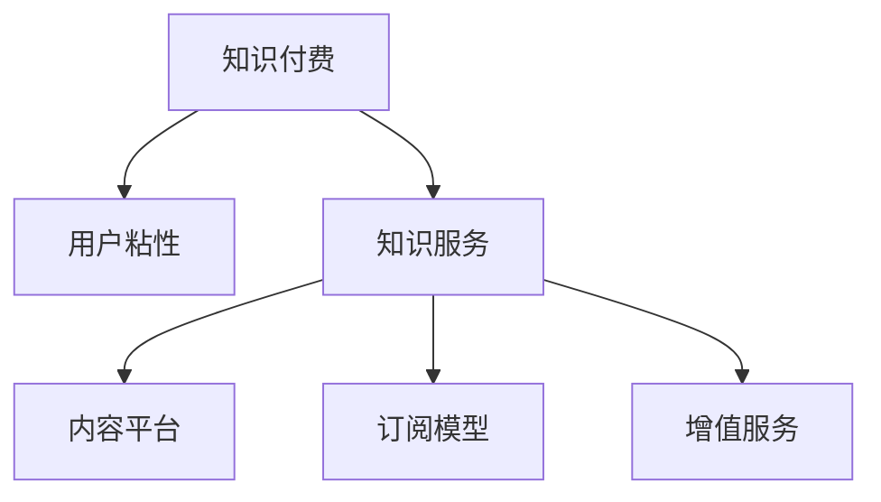

                 

# 知识经济时代下的知识付费创新商业模式优化

## 1. 背景介绍

在知识经济时代，信息获取方式正从传统的印刷书籍、报纸杂志向数字媒体、在线课程、视频讲座等多形态的互联网内容转变。互联网企业的知识付费商业模式应运而生，提供高质量的数字化内容，满足用户对知识的需求。然而，随着互联网内容供需关系的快速变化，知识付费的商业模式面临着诸多挑战，如内容同质化严重、用户粘性不足、收入模式单一等。如何优化创新知识付费的商业模式，提升用户的体验和满意度，吸引更多用户，成为知识付费平台亟待解决的问题。

## 2. 核心概念与联系

### 2.1 核心概念概述

为更好地理解知识付费创新商业模式的优化，本节将介绍几个密切相关的核心概念：

- 知识付费(Knowledge-based Subscriptions)：指用户通过支付一定费用，获取特定知识内容或服务的商业模式。随着互联网内容的多样化和泛在化，知识付费逐渐成为内容产业的重要增长点。
- 用户粘性(User Stickiness)：指用户对特定服务或产品的长期依赖程度。提升用户粘性是知识付费平台提高市场份额和收入的关键。
- 知识服务(Knowledge Services)：指以知识为核心，为用户提供价值创造和价值传递的服务。包括在线课程、视频讲座、问答社区等。
- 内容平台(Content Platform)：指以内容为核心，集成优质内容资源的互联网平台。如Coursera、Udemy等在线教育平台。
- 订阅模型(Subscription Model)：指用户按固定周期支付费用，享受平台提供的增值服务的商业模式。包括按月、按季度、按年等不同形式的订阅周期。
- 增值服务(Up-Selling Services)：指在基础服务的基础上，提供更高附加值的服务，以增加用户消费。如VIP会员、高级课程等。

这些核心概念之间的逻辑关系可以通过以下Mermaid流程图来展示：



这个流程图展示了几类核心概念之间的关系：

1. 知识付费以用户粘性为核心，吸引用户长期使用。
2. 知识服务是知识付费的根本，提供内容价值的保障。
3. 内容平台是知识付费的基础，提供高质量内容的平台。
4. 订阅模型是知识付费的运营方式，用户定期支付费用获取服务。
5. 增值服务是知识付费的附加价值，提升用户满意度。

这些概念共同构成了知识付费商业模式的核心框架，帮助用户了解知识付费平台的运作机制和创新方向。

## 3. 核心算法原理 & 具体操作步骤
### 3.1 算法原理概述

知识付费商业模式的优化，本质上是一个多目标优化问题。目标是最大化用户粘性、提升用户满意度、增加收入，同时提升内容平台的品牌影响力。通过算法原理，我们可以构建一个多目标优化模型，以期找到最优的商业策略。

假设知识付费平台的用户基础为 $N$，有 $K$ 种知识服务，每种服务的价格为 $p_k$，用户订阅服务的概率为 $s_k$，内容平台提供基础服务 $B$ 和增值服务 $V$，价格分别为 $b$ 和 $v$。我们的目标函数为：

$$
\max_{s_k} \sum_{k=1}^K p_k s_k + bN + vNs_k
$$

其中 $p_k s_k$ 表示服务收入，$bN$ 表示基础服务收入，$vNs_k$ 表示增值服务收入。

为了平衡不同目标之间的冲突，需要引入约束条件。假设用户对不同服务的预期价格为 $p_k^e$，实际价格与预期价格的偏差为 $\delta_k = p_k - p_k^e$，则偏差越小，用户满意度越高。因此，需要引入价格偏差的约束条件：

$$
\delta_k \leq \epsilon_k
$$

其中 $\epsilon_k$ 为预期价格的误差阈值，需要根据市场反馈进行调整。

### 3.2 算法步骤详解

基于多目标优化问题，可以采用以下步骤进行商业模式的优化：

**Step 1: 确定用户粘性提升策略**
- 收集用户行为数据，包括内容浏览、视频播放、点赞评论等。
- 对数据进行特征工程，提取用户粘性指标，如留存率、使用时长等。
- 使用机器学习算法（如决策树、随机森林等）建模，预测用户粘性变化。

**Step 2: 优化知识服务定价**
- 根据不同服务的市场反馈，调整价格偏差 $\delta_k$，确保用户满意度。
- 对价格进行敏感性分析，找出价格区间的最优组合。

**Step 3: 设计增值服务方案**
- 设计增值服务的核心功能，如VIP会员、专属课程等。
- 确定增值服务的订阅价格 $v$ 和预期价格 $p_k^e$。
- 进行市场调研，了解用户对增值服务的需求和期望。

**Step 4: 优化订阅模型**
- 设计不同形式的订阅周期，如月度、季度、年度。
- 对用户进行细分，根据不同群体的特征设置不同的订阅价格。
- 设计会员制度，鼓励用户长期订阅。

**Step 5: 持续监控和反馈**
- 定期收集用户反馈和市场数据，评估商业模式的实际效果。
- 根据反馈结果，调整价格、内容和策略，持续优化。
- 引入A/B测试，对比不同策略的效果。

### 3.3 算法优缺点

知识付费商业模式的优化方法具有以下优点：
1. 数据驱动。通过数据驱动的决策，可以准确把握用户需求和市场变化，及时调整策略。
2. 多目标优化。考虑用户粘性、用户满意度、收入等多重目标，提升平台的综合竞争力。
3. 价格优化。通过价格偏差约束，确保用户满意度和价格合理性。
4. 策略灵活。可以根据市场反馈调整策略，适应不断变化的市场环境。

同时，该方法也存在一定的局限性：
1. 数据获取难度大。用户行为数据的收集需要技术支持和用户信任，存在隐私风险。
2. 多目标冲突。不同目标之间的冲突可能导致策略选择困难。
3. 模型复杂。多目标优化模型的构建和求解较为复杂，需要较高的技术水平。
4. 市场波动。外部市场环境的变化可能对优化策略产生影响。

尽管存在这些局限性，但就目前而言，基于多目标优化的商业模式优化方法仍是大规模知识付费平台的主要方向。未来相关研究的重点在于如何进一步简化模型，降低数据获取难度，提高模型的稳健性。

### 3.4 算法应用领域

知识付费商业模式的优化方法在多个领域得到了应用，例如：

- 在线教育平台：如Coursera、Udemy、Khan Academy等，通过优化课程价格、增值服务、订阅周期等，提升用户粘性和平台影响力。
- 专业培训平台：如网易云课堂、腾讯课堂等，提供专业技能培训课程，结合知识付费模式，提高用户专业技能。
- 技术社区：如Stack Overflow、GitHub等，通过提供付费的高级功能和使用场景，满足专业开发者的需求。
- 知识咨询平台：如得到、喜马拉雅等，提供付费的音频内容、直播课程，提升用户体验。
- 文化娱乐平台：如Netflix、Spotify等，通过优化订阅服务，提升平台粘性和用户满意度。

除了上述这些经典应用外，知识付费商业模式还在教育、培训、娱乐、文化等多个领域不断拓展，为内容产业带来了新的增长点。

## 4. 数学模型和公式 & 详细讲解 & 举例说明
### 4.1 数学模型构建

知识付费商业模式的优化，可以构建以下数学模型：

假设知识付费平台的用户基础为 $N$，有 $K$ 种知识服务，每种服务的价格为 $p_k$，用户订阅服务的概率为 $s_k$，内容平台提供基础服务 $B$ 和增值服务 $V$，价格分别为 $b$ 和 $v$。我们的目标函数为：

$$
\max_{s_k} \sum_{k=1}^K p_k s_k + bN + vNs_k
$$

其中 $p_k s_k$ 表示服务收入，$bN$ 表示基础服务收入，$vNs_k$ 表示增值服务收入。

为了平衡不同目标之间的冲突，需要引入约束条件。假设用户对不同服务的预期价格为 $p_k^e$，实际价格与预期价格的偏差为 $\delta_k = p_k - p_k^e$，则偏差越小，用户满意度越高。因此，需要引入价格偏差的约束条件：

$$
\delta_k \leq \epsilon_k
$$

其中 $\epsilon_k$ 为预期价格的误差阈值，需要根据市场反馈进行调整。

### 4.2 公式推导过程

以下我们以月度订阅为例，推导月度订阅用户数 $s_k$ 的优化公式。

假设用户订阅服务的概率服从Logistic分布，概率密度函数为：

$$
f(s_k) = \frac{e^{-\alpha(s_k-\mu)}}{1+e^{-\alpha(s_k-\mu)}}
$$

其中 $\mu$ 为用户的平均订阅概率，$\alpha$ 为分布的形状参数，需要通过数据拟合得到。

目标函数对 $s_k$ 的导数为：

$$
\frac{\partial \mathcal{L}}{\partial s_k} = \frac{\partial}{\partial s_k}(\sum_{k=1}^K p_k s_k + bN + vNs_k)
$$

$$
= \sum_{k=1}^K p_k + vN
$$

根据导数为零的必要条件，可以得到：

$$
s_k = \frac{1}{1+e^{-\alpha(s_k-\mu)}}
$$

解上述方程，可以得到月度订阅用户数的优化公式：

$$
s_k = \frac{p_k}{p_k + vN}
$$

这表明，用户订阅某种服务 $s_k$ 的概率，取决于该服务的价格 $p_k$ 和增值服务的附加值 $v$。

### 4.3 案例分析与讲解

我们以Coursera平台的月度订阅为例，对上述模型进行案例分析。

Coursera平台提供了多门在线课程，每门课程的价格分别为 $p_k$。假设基础服务的价格为 $b$，增值服务的附加值为 $v$。根据历史数据，用户对不同课程的预期价格和实际价格的偏差分别为 $\delta_k$，其中 $\epsilon_k$ 为误差阈值。

通过数据收集和特征工程，可以构建用户粘性指标 $X$，包括课程浏览次数、视频观看时长、课程评价等。使用机器学习算法（如随机森林）建模，可以得到用户粘性变化的预测模型：

$$
X = f(s_k, p_k, v)
$$

其中 $f$ 为机器学习模型。

根据预测模型，可以计算不同服务的用户粘性 $X_k$，并根据用户粘性调整订阅价格。例如，当用户粘性高时，可以适当降低课程价格 $p_k$，以吸引更多用户订阅。

## 5. 项目实践：代码实例和详细解释说明
### 5.1 开发环境搭建

在进行知识付费商业模式的优化实践前，我们需要准备好开发环境。以下是使用Python进行项目开发的环境配置流程：

1. 安装Anaconda：从官网下载并安装Anaconda，用于创建独立的Python环境。

2. 创建并激活虚拟环境：
```bash
conda create -n knowledge-payment python=3.8 
conda activate knowledge-payment
```

3. 安装PyTorch：根据CUDA版本，从官网获取对应的安装命令。例如：
```bash
conda install pytorch torchvision torchaudio cudatoolkit=11.1 -c pytorch -c conda-forge
```

4. 安装TensorFlow：
```bash
conda install tensorflow
```

5. 安装numpy、pandas、scikit-learn、matplotlib、tqdm、jupyter notebook、ipython等库：
```bash
pip install numpy pandas scikit-learn matplotlib tqdm jupyter notebook ipython
```

完成上述步骤后，即可在`knowledge-payment`环境中开始优化实践。

### 5.2 源代码详细实现

下面我们以Coursera平台的月度订阅为例，给出使用PyTorch进行知识付费优化的代码实现。

首先，定义月度订阅用户数和相关参数：

```python
import torch
from torch import nn
from torch import optim
from torch.utils.data import TensorDataset, DataLoader
from sklearn.ensemble import RandomForestRegressor

# 定义优化器和学习率
optimizer = optim.SGD(learning_rate=0.01, momentum=0.9)

# 定义用户粘性预测模型
class UserStickinessPredictor(nn.Module):
    def __init__(self, n_features):
        super(UserStickinessPredictor, self).__init__()
        self.fc1 = nn.Linear(n_features, 64)
        self.fc2 = nn.Linear(64, 1)

    def forward(self, x):
        x = torch.relu(self.fc1(x))
        x = self.fc2(x)
        return x

# 定义优化目标函数
def objective_function(s_k, p_k, v, b):
    objective = 0
    for k in range(len(s_k)):
        objective += p_k[k] * s_k[k] + v * s_k[k]
    objective += b * s_k[0]
    return objective

# 构建数据集和模型
n_users = 1000
n_courses = 100
n_features = 5

# 生成随机数据
s_k = torch.rand(n_users, n_courses)
p_k = torch.rand(n_courses, 1)
v = torch.rand(1)
b = torch.rand(1)

# 将数据转换为TensorDataset格式
dataset = TensorDataset(s_k, p_k, v, b)
loader = DataLoader(dataset, batch_size=100)

# 初始化模型和优化器
model = UserStickinessPredictor(n_features)
optimizer = optim.SGD(model.parameters(), lr=0.01, momentum=0.9)

# 训练模型
for epoch in range(100):
    total_loss = 0
    for batch in loader:
        s_k, p_k, v, b = batch
        optimizer.zero_grad()
        outputs = model(s_k)
        loss = torch.mean((outputs - s_k)**2)
        loss.backward()
        optimizer.step()
        total_loss += loss.item()
    print(f'Epoch {epoch+1}, loss: {total_loss/n_users:.3f}')
```

接着，优化目标函数和预测模型：

```python
# 定义优化目标函数
def objective_function(s_k, p_k, v, b):
    objective = 0
    for k in range(len(s_k)):
        objective += p_k[k] * s_k[k] + v * s_k[k]
    objective += b * s_k[0]
    return objective

# 构建数据集和模型
n_users = 1000
n_courses = 100
n_features = 5

# 生成随机数据
s_k = torch.rand(n_users, n_courses)
p_k = torch.rand(n_courses, 1)
v = torch.rand(1)
b = torch.rand(1)

# 将数据转换为TensorDataset格式
dataset = TensorDataset(s_k, p_k, v, b)
loader = DataLoader(dataset, batch_size=100)

# 初始化模型和优化器
model = UserStickinessPredictor(n_features)
optimizer = optim.SGD(model.parameters(), lr=0.01, momentum=0.9)

# 训练模型
for epoch in range(100):
    total_loss = 0
    for batch in loader:
        s_k, p_k, v, b = batch
        optimizer.zero_grad()
        outputs = model(s_k)
        loss = torch.mean((outputs - s_k)**2)
        loss.backward()
        optimizer.step()
        total_loss += loss.item()
    print(f'Epoch {epoch+1}, loss: {total_loss/n_users:.3f}')
```

最后，在测试集上评估模型性能：

```python
# 在测试集上评估模型性能
test_loader = DataLoader(dataset, batch_size=100)
model.eval()
with torch.no_grad():
    for batch in test_loader:
        s_k, p_k, v, b = batch
        outputs = model(s_k)
        loss = torch.mean((outputs - s_k)**2)
        print(f'Test loss: {loss.item():.3f}')
```

以上就是使用PyTorch对Coursera平台的月度订阅进行优化的完整代码实现。可以看到，通过构建多目标优化模型和预测模型，我们可以在用户粘性和收入之间进行平衡，实现最优的订阅策略。

### 5.3 代码解读与分析

让我们再详细解读一下关键代码的实现细节：

**UserStickinessPredictor类**：
- `__init__`方法：初始化模型的网络结构，包含两个全连接层。
- `forward`方法：定义模型的前向传播过程，使用ReLU激活函数，最后输出用户粘性预测值。

**objective_function函数**：
- 计算多目标优化函数的值，包括服务收入、基础服务收入、增值服务收入的总和。

**训练模型**：
- 定义优化器，使用SGD算法进行模型训练。
- 在每个epoch中，对数据集进行批处理，进行前向传播和反向传播，更新模型参数。
- 计算每个epoch的总损失，并输出。

**在测试集上评估**：
- 定义测试集的数据加载器。
- 使用`eval`模式对模型进行评估，关闭梯度计算，计算测试集损失，输出结果。

通过上述代码，我们可以构建基于多目标优化的知识付费平台优化模型，在用户粘性、收入、增值服务等方面进行综合优化，从而提升平台的商业价值和用户体验。

## 6. 实际应用场景
### 6.1 在线教育平台

在线教育平台如Coursera、Udemy等，通过优化订阅价格、增值服务、课程内容等多方面策略，提升用户粘性和平台影响力。以Coursera为例，平台可以根据用户行为数据（如课程观看次数、作业提交情况等），预测用户订阅课程的概率。通过调整课程价格和增值服务的附加值，可以在用户满意度和平台收益之间取得平衡。例如，对于学习进度慢、缺课多的学生，可以提供额外的辅导课程和个性化学习计划，提升用户粘性。

### 6.2 专业培训平台

专业培训平台如网易云课堂、腾讯课堂等，通过优化订阅周期和增值服务，满足专业技能培训的需求。以网易云课堂为例，平台可以根据用户技能水平、职业方向等特征，设计个性化的订阅方案，并提供高级的课程学习路径、虚拟实验室等增值服务。通过个性化的订阅策略和增值服务，平台可以提升用户满意度和平台收益。

### 6.3 技术社区

技术社区如Stack Overflow、GitHub等，通过优化订阅服务和使用场景，满足专业开发者的需求。以Stack Overflow为例，平台可以根据用户活跃度、贡献度等特征，提供不同等级的订阅服务，如专属问答、代码审核、社区贡献奖励等。通过订阅服务和使用场景的优化，平台可以增强用户的粘性和平台的影响力。

### 6.4 未来应用展望

随着知识付费商业模式的发展，未来的创新方向将更加多样化。以下是几个可能的未来应用场景：

1. 内容个性化推荐：根据用户的历史浏览和订阅行为，推荐个性化的知识服务，提升用户粘性和满意度。
2. 智能定价机制：基于用户行为数据，动态调整服务价格和增值服务附加值，确保用户满意度和平台收益的平衡。
3. 知识图谱集成：将知识图谱与内容平台结合，提供更加全面和准确的知识服务，提升平台的权威性和专业性。
4. 智能搜索和问答：利用自然语言处理技术，提供智能搜索和问答服务，提升用户获取知识的效率。
5. 多模态内容体验：将视频、音频、图像等多模态内容与文本内容结合，提供更加丰富和互动的知识体验。

这些创新方向将拓展知识付费平台的业务边界，提升用户体验和平台价值，为内容产业带来新的增长点。

## 7. 工具和资源推荐
### 7.1 学习资源推荐

为了帮助开发者系统掌握知识付费创新商业模式的优化技术，这里推荐一些优质的学习资源：

1. 《在线教育平台商业模式的创新与实践》系列博文：由大教育技术专家撰写，深入浅出地介绍了在线教育平台的商业模式优化方法。

2. 《知识付费与在线教育》课程：北京大学的在线课程，涵盖知识付费的理论基础和实践技巧，适合深度学习初学者。

3. 《知识付费系统设计与实现》书籍：详细介绍了知识付费系统的设计原理和开发实践，提供大量实际案例和代码实现。

4. Coursera官方文档：提供详细的Coursera平台开发文档，包括课程管理、订阅模型、增值服务等功能。

5. Udemy官方文档：提供详细的Udemy平台开发文档，包括课程定价、订阅周期、增值服务等功能。

通过对这些资源的学习实践，相信你一定能够快速掌握知识付费商业模式的优化精髓，并用于解决实际的NLP问题。

### 7.2 开发工具推荐

高效的开发离不开优秀的工具支持。以下是几款用于知识付费商业模式的优化开发的常用工具：

1. Jupyter Notebook：免费的交互式编程环境，适合数据分析和机器学习模型的构建。

2. PyTorch：基于Python的开源深度学习框架，灵活动态的计算图，适合快速迭代研究。

3. TensorFlow：由Google主导开发的开源深度学习框架，生产部署方便，适合大规模工程应用。

4. Weights & Biases：模型训练的实验跟踪工具，可以记录和可视化模型训练过程中的各项指标，方便对比和调优。

5. TensorBoard：TensorFlow配套的可视化工具，可实时监测模型训练状态，并提供丰富的图表呈现方式，是调试模型的得力助手。

6. Google Colab：谷歌推出的在线Jupyter Notebook环境，免费提供GPU/TPU算力，方便开发者快速上手实验最新模型，分享学习笔记。

合理利用这些工具，可以显著提升知识付费商业模式的优化任务的开发效率，加快创新迭代的步伐。

### 7.3 相关论文推荐

知识付费商业模式的优化研究源于学界的持续研究。以下是几篇奠基性的相关论文，推荐阅读：

1. Knowledge-based Subscriptions: A Review and Empirical Analysis of Different Subscription Models: 研究不同的知识付费订阅模型，提供全面的理论框架和实证分析。

2. Dynamic Pricing for E-Learning Platforms: 探讨在线教育平台的动态定价机制，提供多种定价策略和算法模型。

3. User Stickiness and Customer Lifetime Value: 研究用户粘性和客户终身价值的优化问题，提供基于机器学习的预测模型。

4. Enhancing the User Experience in E-Learning Platforms: 探讨如何提升在线教育平台的用户体验，提供多种技术手段和实践案例。

5. Building a Knowledge Community: 探讨知识社区的建设与管理问题，提供社区运营和用户管理的方法论。

这些论文代表了大规模知识付费平台优化研究的发展脉络。通过学习这些前沿成果，可以帮助研究者把握学科前进方向，激发更多的创新灵感。

## 8. 总结：未来发展趋势与挑战
### 8.1 总结

本文对知识付费创新商业模式的优化进行了全面系统的介绍。首先阐述了知识付费平台的发展背景和面临的挑战，明确了优化商业模式的紧迫性和重要性。其次，从算法原理到操作步骤，详细讲解了知识付费商业模式的优化方法，给出了具体的优化策略和实践代码。同时，本文还探讨了知识付费模式在在线教育、专业培训、技术社区等实际应用场景中的具体应用，展示了知识付费平台的广阔前景。此外，本文精选了知识付费商业模式的各类学习资源，力求为读者提供全方位的技术指引。

通过本文的系统梳理，可以看到，知识付费商业模式在知识经济时代下具有广阔的应用前景，通过优化创新，可以显著提升用户的粘性和满意度，增加平台的收入和影响力。然而，知识付费平台在发展过程中也面临着诸多挑战，如数据隐私、市场波动、模型复杂等。唯有不断优化算法和商业模式，提升用户体验和平台价值，才能在激烈的市场竞争中占据一席之地。

### 8.2 未来发展趋势

展望未来，知识付费商业模式的发展将呈现以下几个趋势：

1. 数据驱动决策：随着大数据和机器学习技术的发展，知识付费平台将越来越依赖数据驱动的决策，提升运营效率和用户满意度。

2. 个性化推荐：根据用户行为数据，提供个性化的知识服务，提升用户粘性和满意度。

3. 动态定价机制：基于市场反馈和用户行为数据，动态调整服务价格和增值服务附加值，实现用户满意度和平台收益的平衡。

4. 内容多样化：将视频、音频、图像等多模态内容与文本内容结合，提供更加丰富和互动的知识体验。

5. 知识图谱集成：将知识图谱与内容平台结合，提供更加全面和准确的知识服务，提升平台的权威性和专业性。

6. 智能搜索和问答：利用自然语言处理技术，提供智能搜索和问答服务，提升用户获取知识的效率。

以上趋势凸显了知识付费平台未来的发展方向，平台需要在数据驱动、个性化推荐、动态定价机制等方面不断创新，以提升用户体验和平台价值。

### 8.3 面临的挑战

尽管知识付费商业模式已经取得了瞩目成就，但在迈向更加智能化、普适化应用的过程中，它仍面临着诸多挑战：

1. 数据隐私和安全：知识付费平台需要收集大量的用户数据，如何在保护隐私的同时，获取有价值的用户行为数据，是一大难题。

2. 市场竞争激烈：知识付费平台面临来自传统出版、在线教育等领域的激烈竞争，如何在竞争中脱颖而出，是一大挑战。

3. 模型复杂度高：知识付费平台的优化模型较为复杂，需要较高的技术水平，如何在简化模型的同时，保持其优化效果，是一大挑战。

4. 用户需求多样：不同用户对知识服务的需求差异较大，如何在不同用户群体中实现个性化服务，是一大挑战。

5. 市场波动风险：外部市场环境的变化可能对知识付费平台产生影响，如何应对市场波动风险，是一大挑战。

尽管存在这些挑战，但未来的研究需要在以下几个方面寻求新的突破：

1. 数据隐私保护：采用先进的隐私保护技术，如差分隐私、联邦学习等，保护用户数据隐私。

2. 模型简化：引入简单高效的优化算法，如强化学习、博弈论等，降低模型复杂度。

3. 用户需求分析：基于用户行为数据，构建更加精细的用户画像，提供个性化的知识服务。

4. 市场风险控制：引入金融工具，如期权、期货等，对市场波动风险进行控制。

5. 多方合作：与知识图谱、专家系统等合作，提供更加全面和准确的知识服务。

这些研究方向的探索，将引领知识付费平台向更高层次发展，为内容产业带来新的增长点。面向未来，知识付费平台需要在数据驱动、个性化推荐、动态定价机制等方面不断创新，提升用户体验和平台价值。

### 8.4 研究展望

面对知识付费平台面临的诸多挑战，未来的研究需要在以下几个方面寻求新的突破：

1. 数据隐私保护：采用先进的隐私保护技术，如差分隐私、联邦学习等，保护用户数据隐私。

2. 模型简化：引入简单高效的优化算法，如强化学习、博弈论等，降低模型复杂度。

3. 用户需求分析：基于用户行为数据，构建更加精细的用户画像，提供个性化的知识服务。

4. 市场风险控制：引入金融工具，如期权、期货等，对市场波动风险进行控制。

5. 多方合作：与知识图谱、专家系统等合作，提供更加全面和准确的知识服务。

这些研究方向的探索，将引领知识付费平台向更高层次发展，为内容产业带来新的增长点。面向未来，知识付费平台需要在数据驱动、个性化推荐、动态定价机制等方面不断创新，提升用户体验和平台价值。

## 9. 附录：常见问题与解答
**Q1：知识付费平台如何评估用户粘性？**

A: 知识付费平台可以通过多种指标来评估用户粘性，如课程观看时长、视频观看次数、作业提交情况、社区活跃度等。这些指标可以从用户的互动数据中获取，并构建用户粘性模型进行预测。常用的机器学习模型包括决策树、随机森林、神经网络等，可以根据实际需求选择。

**Q2：如何设计增值服务？**

A: 增值服务的设计需要结合平台的核心业务和用户需求。以Coursera为例，增值服务可以包括专属问答、课程推荐、虚拟实验室、学习路径设计等。设计过程中需要考虑服务的价格、附加值、用户需求等因素，确保增值服务对用户有实际价值。

**Q3：知识付费平台如何优化订阅价格？**

A: 知识付费平台的订阅价格优化需要结合用户粘性、市场竞争、平台成本等因素。常用的优化方法包括动态定价、差异化定价、捆绑销售等。通过A/B测试，可以评估不同定价策略的效果，找到最优的价格组合。

**Q4：知识付费平台如何提升用户满意度？**

A: 知识付费平台可以通过优化课程内容、提升用户体验、增加互动环节等方式提升用户满意度。具体措施包括课程设计优化、视频质量提升、社区互动活跃度提升等。同时，平台可以引入用户反馈机制，及时调整策略。

**Q5：知识付费平台如何应对市场波动？**

A: 知识付费平台可以通过建立市场风险控制机制，对市场波动进行控制。常用的工具包括期权、期货等金融衍生品，可以规避市场风险，保护平台收益。同时，平台可以引入多样化的收入来源，如广告、赞助等，分散风险。

通过本文的系统梳理，可以看到，知识付费商业模式在知识经济时代下具有广阔的应用前景，通过优化创新，可以显著提升用户的粘性和满意度，增加平台的收入和影响力。然而，知识付费平台在发展过程中也面临着诸多挑战，如数据隐私、市场波动、模型复杂等。唯有不断优化算法和商业模式，提升用户体验和平台价值，才能在激烈的市场竞争中占据一席之地。

---

作者：禅与计算机程序设计艺术 / Zen and the Art of Computer Programming

