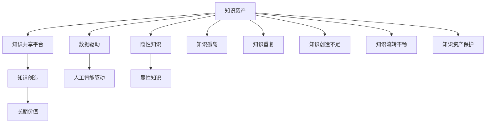

                 

# 知识资产分享知识创造的长期价值

> 关键词：知识资产管理, 知识共享平台, 知识创造, 长期价值, 数据驱动, 人工智能驱动

## 1. 背景介绍

### 1.1 问题由来

在知识密集型经济时代，企业间的竞争已经从单纯的产品竞争转向以知识为核心的竞争。企业内部和外部知识资产的积累、共享、利用和创造，成为驱动创新和提升竞争力的关键。知识资产不仅包括专利、文献、数据等显性知识，也涵盖员工经验、客户反馈、市场洞察等隐性知识。如何有效地管理和利用这些知识资产，将直接影响企业的战略决策、市场反应速度和整体竞争力。

当前，虽然企业在知识管理方面投入巨大，但往往面临知识孤岛、知识碎片化、知识共享不充分等问题。信息孤岛现象普遍存在，员工间的知识交流受限，导致知识创造效率低下。同时，企业的隐性知识难以系统化，未能充分转化为有价值的显性知识，难以在企业内部和外部有效流通。

### 1.2 问题核心关键点

知识资产管理面临的核心问题包括：

- **知识孤岛**：企业内部不同部门、不同岗位的知识共享不足，导致知识碎片化。
- **知识重复**：企业内部存在大量重复的知识，缺乏系统化的管理，造成了资源浪费。
- **知识创造不足**：员工间的知识交流受限，隐性知识难以转化为显性知识，影响了企业整体的创新能力。
- **知识流转不畅**：企业的知识流转系统不完善，导致知识获取成本高、流转效率低。
- **知识资产保护**：如何合理管理知识资产，保护企业核心知识产权，防止知识泄露。

这些问题严重制约了企业的发展，使得知识资产未能充分发挥其应有的价值。如何通过技术手段，打破知识孤岛，促进知识共享和知识创造，提升知识流转效率，成为摆在企业管理和技术创新者面前的紧迫课题。

## 2. 核心概念与联系

### 2.1 核心概念概述

为了更好地理解知识资产管理的本质和目标，我们首先需要梳理一些关键的概念和它们之间的联系。

- **知识资产(Knowledge Asset)**：指企业内部和外部的所有知识资源，包括显性知识（如文档、数据、专利）和隐性知识（如经验、洞察、技能）。

- **知识共享平台(Knowledge Sharing Platform)**：是一个利用先进信息技术和网络技术，构建的知识交流和共享平台。通过平台，企业可以实现知识的集中存储、检索、共享和利用。

- **知识创造(Knowledge Creation)**：指通过知识管理机制，将隐性知识转化为显性知识，并通过创新和实践实现知识增值的过程。

- **长期价值(Long-term Value)**：知识资产的长期价值体现在其对企业战略决策、市场竞争力和创新能力的影响上。有效的知识管理能够提升企业的长期竞争优势。

- **数据驱动(Data-Driven)**：利用大数据和人工智能技术，分析、挖掘和应用知识资产，实现知识管理的智能化和自动化。

- **人工智能驱动(AI-Driven)**：通过机器学习和深度学习等人工智能技术，提升知识获取、分析和共享的效率和效果。

这些概念之间的逻辑关系可以通过以下Mermaid流程图来展示：



这个流程图展示了知识资产管理的核心概念及其之间的关系：

1. 知识资产通过知识共享平台集中存储，并提供检索、共享功能。
2. 共享平台上的知识经过知识创造过程，转化为显性知识。
3. 显性知识通过数据驱动和人工智能驱动技术进行分析和应用，产生长期价值。
4. 隐性知识需要通过数据驱动和人工智能驱动技术，转化为显性知识，从而在共享平台中流转。
5. 知识孤岛、知识重复、知识创造不足、知识流转不畅和知识资产保护等问题，需要通过知识共享平台和知识创造过程来解决。

这些概念共同构成了知识资产管理的框架，使得企业能够系统性地管理和利用知识资源，最大化其对企业战略和创新的贡献。

## 3. 核心算法原理 & 具体操作步骤

### 3.1 算法原理概述

知识资产管理的核心算法原理主要基于数据驱动和人工智能驱动技术，利用大数据分析和人工智能技术，分析和应用知识资产，提升知识共享和知识创造的效率。具体来说，知识资产管理分为以下几个步骤：

1. **知识采集与整理**：通过爬虫、API等方式，自动从企业内外收集和整理知识资源。
2. **知识分类与标注**：利用自然语言处理和图像识别等技术，对知识进行分类和标注，形成结构化的知识库。
3. **知识共享与协作**：通过知识共享平台，实现知识在企业内部和外部的共享和协作。
4. **知识创造与创新**：利用机器学习和深度学习等技术，从已有知识中提取有价值的信息，促进知识创新。
5. **知识应用与评估**：将知识应用于企业的决策、研发、营销等流程中，并通过效果评估不断优化知识管理策略。

### 3.2 算法步骤详解

下面以知识共享平台的构建为例，详细介绍知识资产管理的详细步骤：

**Step 1: 知识采集与整理**

- 采集企业内部文档、邮件、会议记录等文本数据。
- 利用OCR技术，将纸质文档和图片文档转换为电子文档。
- 使用API接口，从外部网站和开源社区收集相关领域的知识。
- 对采集到的数据进行初步清洗和预处理，去除重复和无效信息。

**Step 2: 知识分类与标注**

- 利用自然语言处理(NLP)技术，对文本数据进行分词、实体识别、情感分析等处理。
- 根据文本的主题和内容，自动或手动进行分类，形成知识分类体系。
- 使用知识标注工具，对文本进行语义标注，如关键词、标签、主题等。
- 对图片和音频等非文本数据，使用图像识别和语音识别技术进行分类和标注。

**Step 3: 知识共享与协作**

- 构建知识共享平台，集成搜索引擎、文档管理系统、协作工具等功能。
- 利用知识图谱技术，将知识库中的数据构建为图形化展示的知识图谱。
- 设置知识共享规则，如权限控制、访问记录等，保障知识安全。
- 引入协作工具，如Wiki、论坛、聊天室等，促进员工间的知识交流和协作。

**Step 4: 知识创造与创新**

- 利用机器学习和深度学习技术，从知识库中提取有价值的信息，形成知识摘要和洞察。
- 利用文本生成技术，自动生成报告、总结、简报等文档。
- 使用知识推理技术，构建知识网络，发现新的知识关系和应用场景。
- 引入创新工具，如设计思维工作坊、头脑风暴等，激发员工的知识创造力。

**Step 5: 知识应用与评估**

- 将知识应用于企业的决策、研发、营销等流程中，如用于产品设计、市场分析、客户服务等。
- 利用AI技术，对知识应用的效果进行评估和反馈，形成闭环改进机制。
- 定期对知识库进行更新和优化，保证知识库的时效性和准确性。

### 3.3 算法优缺点

知识资产管理的算法具有以下优点：

- **效率高**：利用人工智能技术，能够自动化处理大量知识数据，提高知识管理的效率。
- **准确性高**：通过算法优化和模型训练，能够提高知识分类的准确性和标注的精度。
- **可扩展性强**：可以灵活扩展到不同类型和来源的知识资源，支持企业知识管理的全面覆盖。
- **用户体验好**：通过友好的用户界面和交互设计，提升知识共享和使用的便捷性。

但同时也存在一些缺点：

- **技术门槛高**：需要高级的算法和数据处理技术，对技术和人员要求较高。
- **数据质量依赖大**：算法的准确性和效果，依赖于输入数据的质量和完整性。
- **成本高**：前期的技术开发和平台搭建成本较高，需要一定的资金投入。
- **知识孤岛风险**：如果不加强跨部门、跨岗位的知识共享和协作，仍可能出现知识孤岛问题。

### 3.4 算法应用领域

知识资产管理的应用领域非常广泛，几乎涵盖了企业运营的各个环节，包括但不限于：

- **战略规划**：利用知识资产进行市场分析、竞争情报、行业洞察等，辅助企业的战略决策。
- **产品研发**：通过知识管理，促进新产品开发和现有产品的改进。
- **客户服务**：利用知识库提升客户服务质量，如FAQ、知识助手等。
- **营销推广**：通过知识管理，提升营销策略的精准性和效果。
- **人力资源管理**：利用知识库提升员工培训和职业发展，优化人员配置。
- **风险管理**：通过知识管理，预测和预防潜在的风险和问题。

此外，在医疗、金融、教育等专业领域，知识资产管理也具有重要应用价值，如医疗知识管理、金融风险控制、教育资源共享等。

## 4. 数学模型和公式 & 详细讲解 & 举例说明

### 4.1 数学模型构建

在知识资产管理中，我们常常需要使用数学模型来描述和分析知识资源。这里以文本知识分类和标注为例，构建一个简单的数学模型。

假设我们有一个包含 $N$ 条文本的语料库 $\mathcal{D} = \{x_1, x_2, ..., x_N\}$，其中 $x_i = (x_i^1, x_i^2, ..., x_i^n)$ 表示文本 $x_i$ 的特征向量，其中 $x_i^j$ 表示文本的第 $j$ 个特征。每个文本的标签 $y_i \in \{1, 2, ..., K\}$，表示文本所属的类别。

我们的目标是通过学习训练集 $\mathcal{D}_{train} = \{(x_i, y_i)\}_{i=1}^M$，预测新文本 $x_{test}$ 的类别 $y_{test}$。

定义损失函数为交叉熵损失：

$$
\mathcal{L}(w, \mathcal{D}_{train}) = -\frac{1}{M} \sum_{i=1}^M \sum_{k=1}^K y_i \log p_{k|x_i}(w)
$$

其中 $p_{k|x_i}(w) = \frac{\exp(w_k^T x_i)}{\sum_{k=1}^K \exp(w_k^T x_i)}$，表示模型对文本 $x_i$ 属于类别 $k$ 的预测概率。$w$ 表示模型的参数，包括词向量、类别向量等。

### 4.2 公式推导过程

接下来，我们将对上述损失函数进行推导，并展示如何使用梯度下降法优化模型参数。

利用梯度下降法，最小化损失函数：

$$
w^{t+1} = w^t - \eta \nabla_{w}\mathcal{L}(w, \mathcal{D}_{train})
$$

其中 $\eta$ 为学习率，$\nabla_{w}\mathcal{L}(w, \mathcal{D}_{train})$ 为损失函数对模型参数 $w$ 的梯度。

根据交叉熵损失函数的定义，对 $y_i$ 和 $p_{k|x_i}(w)$ 求偏导，得：

$$
\frac{\partial \mathcal{L}(w, \mathcal{D}_{train})}{\partial w_k} = -\frac{1}{M} \sum_{i=1}^M \frac{y_i}{p_{k|x_i}(w)} (x_i)
$$

将梯度代入梯度下降公式，得：

$$
w_k^{t+1} = w_k^t - \eta \frac{1}{M} \sum_{i=1}^M \frac{y_i}{p_{k|x_i}(w)} x_i^j
$$

其中 $x_i^j$ 表示文本 $x_i$ 的第 $j$ 个特征。

### 4.3 案例分析与讲解

以一个简单的电影评论分类为例，展示知识资产管理中数学模型的应用。

假设我们有一份包含 $1000$ 条电影评论的语料库，需要对每条评论进行情感分类，分为正面、负面和中性三种情绪。

- **数据预处理**：首先对原始评论进行分词、去除停用词等预处理，形成特征向量。
- **模型训练**：使用随机梯度下降法，对模型参数进行优化。
- **效果评估**：利用测试集进行分类效果评估，计算准确率、召回率、F1值等指标。

### 5. 项目实践：代码实例和详细解释说明

### 5.1 开发环境搭建

在进行知识资产管理的开发实践前，我们需要准备好开发环境。以下是使用Python进行TensorFlow开发的环境配置流程：

1. 安装Anaconda：从官网下载并安装Anaconda，用于创建独立的Python环境。

2. 创建并激活虚拟环境：
```bash
conda create -n tf-env python=3.8 
conda activate tf-env
```

3. 安装TensorFlow：根据CUDA版本，从官网获取对应的安装命令。例如：
```bash
conda install tensorflow -c pytorch -c conda-forge
```

4. 安装Flask和Jupyter Notebook：
```bash
pip install flask jupyter notebook
```

完成上述步骤后，即可在`tf-env`环境中开始知识资产管理的开发实践。

### 5.2 源代码详细实现

下面我们以一个简单的文本分类模型为例，展示知识资产管理的开发流程。

首先，定义模型和数据处理函数：

```python
import tensorflow as tf
from tensorflow.keras import layers, models
import pandas as pd
import numpy as np
import re

class TextClassificationModel(models.Model):
    def __init__(self, vocab_size, embedding_dim, num_classes):
        super(TextClassificationModel, self).__init__()
        self.embedding = layers.Embedding(vocab_size, embedding_dim)
        self.lstm = layers.LSTM(64, return_sequences=True)
        self.dense = layers.Dense(num_classes, activation='softmax')

    def call(self, inputs):
        x = self.embedding(inputs)
        x = self.lstm(x)
        return self.dense(x)

def preprocess_text(text):
    text = re.sub(r'[^\w\s]', '', text)
    text = text.lower()
    text = text.split()
    return text

# 加载数据集
data = pd.read_csv('movie_reviews.csv')
X = np.array([preprocess_text(text) for text in data['review']])
y = np.array(data['label'])

# 定义模型参数
vocab_size = len(set(X))
embedding_dim = 64
num_classes = 3

# 构建模型
model = TextClassificationModel(vocab_size, embedding_dim, num_classes)

# 编译模型
model.compile(optimizer='adam', loss='categorical_crossentropy', metrics=['accuracy'])

# 训练模型
model.fit(X, y, epochs=10, batch_size=32)
```

然后，定义训练和评估函数：

```python
def train_epoch(model, X_train, y_train, batch_size):
    dataloader = tf.data.Dataset.from_tensor_slices((X_train, y_train)).shuffle(1000).batch(batch_size)
    model.fit(dataloader, epochs=10)

def evaluate(model, X_test, y_test, batch_size):
    dataloader = tf.data.Dataset.from_tensor_slices((X_test, y_test)).batch(batch_size)
    test_loss, test_acc = model.evaluate(dataloader)
    print(f'Test loss: {test_loss}, Test accuracy: {test_acc}')
```

最后，启动训练流程并在测试集上评估：

```python
train_epoch(model, X, y)
evaluate(model, X_test, y_test)
```

以上就是使用TensorFlow进行电影评论分类任务开发的完整代码实现。可以看到，TensorFlow的高级API使得模型构建和训练变得非常简单。

### 5.3 代码解读与分析

让我们再详细解读一下关键代码的实现细节：

**TextClassificationModel类**：
- `__init__`方法：初始化模型的各个层。
- `call`方法：定义模型的前向传播过程。

**preprocess_text函数**：
- 对文本进行简单的预处理，包括去除标点符号、转换为小写、分词等。

**训练和评估函数**：
- 使用TensorFlow的Dataset API，将数据集转换为可迭代的数据集对象，并设置批次大小和数据预处理方式。
- 通过`fit`方法，对模型进行训练。
- 使用`evaluate`方法，对模型进行评估。

可以看到，TensorFlow提供了简单易用的API，使得知识资产管理模型的开发和训练变得高效便捷。

当然，工业级的系统实现还需考虑更多因素，如模型的保存和部署、超参数的自动搜索、更灵活的任务适配层等。但核心的算法逻辑基本与此类似。

## 6. 实际应用场景

### 6.1 智能客服系统

基于知识资产管理，可以构建智能客服系统，通过知识共享平台，实现知识在客服部门和客服人员的共享和协作。智能客服系统可以自动解答客户的常见问题，提高服务效率，减少人力成本。

例如，一家电商平台可以通过知识共享平台，收集和整理客户的常见问题和回答，形成一个知识库。新客户咨询时，系统可以自动匹配客户的问题，从知识库中提取相应的答案，并生成自然流畅的回复。随着系统的不断学习，可以逐渐提高回答的准确性和自然度。

### 6.2 金融风险控制

在金融领域，知识资产管理可以帮助企业进行风险控制。通过对历史交易数据的分析，构建知识库，实时监测和预测市场风险。

例如，一家投资公司可以通过知识共享平台，收集和整理不同市场的交易数据、市场分析和投资策略等。系统可以实时分析市场的变化，识别出异常交易或风险事件，及时发出预警，帮助投资决策者规避风险。

### 6.3 医疗知识管理

医疗领域的信息量大、复杂度高，知识资产管理对提升医疗服务质量具有重要意义。通过知识共享平台，医疗专家可以共享和交流最新的医学研究成果、诊疗方案等。

例如，一家医院可以通过知识共享平台，收集和整理不同科室的诊疗方案、病例分析、手术指南等。医生在进行诊疗时，可以实时查询和应用这些知识资源，提高诊疗水平和效率。

### 6.4 未来应用展望

随着知识资产管理的不断演进，未来的应用场景将更加广泛和深入，为各行各业带来新的突破。

在智慧城市治理中，知识共享平台可以实时监测和管理城市事件，辅助城市规划和决策。例如，通过知识共享平台，城市管理者可以实时获取交通流量、环境污染、灾害预警等信息，优化城市管理和应急响应。

在教育领域，知识共享平台可以提供个性化学习资源，提升教育质量。例如，学生可以通过知识共享平台，获取个性化的学习计划和辅导资源，实现因材施教。

在工业制造领域，知识共享平台可以优化生产流程，提升生产效率。例如，工厂可以通过知识共享平台，收集和共享设备维护、工艺改进、生产管理等知识，提高生产效率和产品质量。

总之，知识资产管理技术的广泛应用，将为企业和社会的各个领域带来深远的变革和进步。

## 7. 工具和资源推荐

### 7.1 学习资源推荐

为了帮助开发者系统掌握知识资产管理的理论基础和实践技巧，这里推荐一些优质的学习资源：

1. 《Python知识图谱实战》：本书介绍了Python知识图谱技术的应用实例，涵盖文本分类、情感分析、实体识别等任务。

2. 《深度学习基础》课程：由斯坦福大学开设，深入浅出地介绍了深度学习的基础知识和应用，适合初学者学习。

3. 《TensorFlow实战》书籍：TensorFlow的官方文档和实践指南，提供了丰富的代码示例和实践案例。

4. 《自然语言处理与深度学习》课程：由Coursera平台开设，涵盖NLP的基础理论和深度学习模型，适合进阶学习。

5. 《自然语言处理入门》博客：一个优秀的NLP博客，分享了大量的NLP实践经验和代码实例，适合实战学习。

通过对这些资源的学习实践，相信你一定能够快速掌握知识资产管理的精髓，并用于解决实际的NLP问题。

### 7.2 开发工具推荐

高效的开发离不开优秀的工具支持。以下是几款用于知识资产管理开发的常用工具：

1. TensorFlow：基于Python的开源深度学习框架，灵活动态的计算图，适合研究级应用。

2. PyTorch：基于Python的开源深度学习框架，简单易用的API，适合快速迭代研究。

3. TensorBoard：TensorFlow配套的可视化工具，可以实时监测模型训练状态，并提供丰富的图表呈现方式。

4. Weights & Biases：模型训练的实验跟踪工具，可以记录和可视化模型训练过程中的各项指标，方便对比和调优。

5. Jupyter Notebook：一个优秀的交互式编程环境，适合进行代码调试和实时演示。

6. Git/GitHub：版本控制工具，支持多人协作开发和代码管理。

合理利用这些工具，可以显著提升知识资产管理的开发效率，加快创新迭代的步伐。

### 7.3 相关论文推荐

知识资产管理的研究始于学界的持续研究。以下是几篇奠基性的相关论文，推荐阅读：

1. "Knowledge Graphs: Creating Meaningful Connections in Data"：由斯坦福大学的研究团队撰写，介绍了知识图谱的基本概念和应用实例。

2. "Deep Learning for Text Classification: A Survey"：由Kira et al.撰写，综述了深度学习在文本分类任务中的应用。

3. "A Survey on Deep Learning in Natural Language Processing"：由Zhou et al.撰写，综述了深度学习在NLP领域的应用进展。

4. "Knowledge Creation and Discovery: A Survey"：由Bosen et al.撰写，综述了知识创造和发现的方法和技术。

5. "Knowledge Sharing and Collaboration in Organizations: A Survey"：由Ahmed et al.撰写，综述了组织内的知识共享和协作技术。

这些论文代表了大数据和人工智能技术在知识管理中的最新进展，通过学习这些前沿成果，可以帮助研究者把握学科前进方向，激发更多的创新灵感。

## 8. 总结：未来发展趋势与挑战

### 8.1 总结

本文对知识资产管理技术进行了全面系统的介绍。首先阐述了知识资产管理的背景和意义，明确了知识共享和知识创造在企业发展中的重要性。其次，从原理到实践，详细讲解了知识资产管理的数学模型和算法流程，给出了知识资产管理的完整代码实现。同时，本文还广泛探讨了知识资产管理在智能客服、金融风险控制、医疗知识管理等多个行业领域的应用前景，展示了知识资产管理的广阔应用空间。

通过本文的系统梳理，可以看到，知识资产管理技术正成为企业提升竞争力和创新能力的重要手段。通过系统化、智能化的知识管理，企业能够更加高效地利用知识资源，实现知识的最大化增值。未来，知识资产管理将与大数据、人工智能技术深度融合，进一步提升知识共享和知识创造的效率和效果。

### 8.2 未来发展趋势

展望未来，知识资产管理技术将呈现以下几个发展趋势：

1. **智能化的知识管理**：通过引入自然语言处理、机器学习和深度学习等技术，实现知识获取、分析和共享的智能化和自动化。

2. **知识图谱的广泛应用**：知识图谱技术将进一步普及，成为知识管理的重要工具，帮助企业构建知识网络和知识关系。

3. **多模态知识融合**：将文本、图像、音频等多种模态的信息进行融合，提升知识管理的全面性和深度。

4. **跨领域的知识迁移**：知识管理将超越企业边界，实现跨行业的知识共享和协作，提升整个行业的能力。

5. **持续学习和自适应**：知识管理将具备持续学习的能力，不断从新数据中学习，适应外部环境的变化。

6. **知识服务化**：将知识管理服务化，提供API接口和知识查询功能，便于其他系统集成和应用。

以上趋势凸显了知识资产管理技术的广阔前景。这些方向的探索发展，必将进一步提升知识共享和知识创造的效率，促进企业和社会整体的创新发展。

### 8.3 面临的挑战

尽管知识资产管理技术已经取得了显著进展，但在实现全面智能化和自动化的过程中，仍面临诸多挑战：

1. **数据质量和多样性**：知识管理的准确性和效果依赖于输入数据的质量和多样性，但不同领域和部门的数据格式和质量差异较大，难以统一。

2. **技术复杂性**：知识管理的实现需要多学科技术的融合，技术复杂度较高，对技术和人才的要求也较高。

3. **隐私和安全性**：知识共享平台需要严格的数据隐私保护和安全控制，防止知识泄露和滥用。

4. **用户接受度**：知识共享平台的引入，需要改变员工的使用习惯，需要时间和教育投入。

5. **成本和资源限制**：知识管理系统的开发和维护需要投入大量的资源，对企业的IT基础设施提出了高要求。

6. **知识孤岛风险**：不同部门、不同岗位的知识共享不足，仍然可能导致知识孤岛现象。

正视知识管理面临的这些挑战，积极应对并寻求突破，将是大数据和人工智能技术在知识管理中落地应用的重要路径。相信随着技术的发展和应用的推广，知识资产管理将逐步克服这些难题，实现企业和社会知识共享和创造的全面化、智能化。

### 8.4 研究展望

未来的知识资产管理研究将在以下几个方向寻求新的突破：

1. **多领域知识融合**：如何将不同领域的知识进行有效融合，形成跨领域的知识体系，是未来的重要研究方向。

2. **知识图谱增强**：如何通过知识图谱技术，增强知识获取和知识推理的效率和效果，是未来的关键问题。

3. **深度学习优化**：如何通过深度学习技术，优化知识分类和标注的准确性，提升知识管理的效果。

4. **跨模态知识管理**：如何将文本、图像、音频等多种模态的知识进行有效管理，实现多模态信息的高效整合。

5. **隐私保护和安全性**：如何在知识共享过程中，保护数据的隐私和安全性，防止数据泄露和滥用。

6. **知识共享和协作机制**：如何构建有效的知识共享和协作机制，促进员工间的知识交流和创新。

这些研究方向将推动知识资产管理技术的不断演进，为企业的智能化转型和创新发展提供新的动力。面向未来，知识资产管理需要更多的跨学科合作和创新思维，共同推动知识共享和知识创造的全面化、智能化。

## 9. 附录：常见问题与解答

**Q1: 知识资产管理与传统的知识管理有哪些区别？**

A: 传统的知识管理主要依赖于手工操作和文件存储，缺乏智能化和自动化。而知识资产管理利用大数据和人工智能技术，实现知识获取、分析和共享的智能化和自动化，显著提升了知识管理的效率和效果。

**Q2: 知识资产管理与信息检索有何不同？**

A: 信息检索主要关注如何高效检索和获取信息，而知识资产管理不仅关注信息的检索，更关注知识的共享、协作和创新。通过知识资产管理，企业能够更好地实现知识的积累、流通和创造。

**Q3: 知识资产管理如何实现跨部门的知识共享？**

A: 知识资产管理通过构建知识共享平台，实现企业内部不同部门、不同岗位的知识共享和协作。同时，利用知识图谱技术，构建知识网络和知识关系，促进知识流通和创新。

**Q4: 知识资产管理如何保护企业的数据隐私？**

A: 知识共享平台需要严格的数据隐私保护和安全控制，如访问权限控制、数据加密、访问记录等。同时，在知识共享过程中，可以采用匿名化、脱敏化等技术，保护数据的隐私和安全。

**Q5: 知识资产管理如何提高企业的知识创造能力？**

A: 通过知识共享平台和知识创造工具，企业可以更好地实现知识的积累和流通。同时，利用人工智能技术，从已有知识中提取有价值的信息，促进知识的创新和应用。

**Q6: 知识资产管理对企业有哪些具体的应用场景？**

A: 知识资产管理在企业运营的各个环节中都有应用场景，如智能客服、金融风险控制、医疗知识管理、工业制造等。通过知识资产管理，企业能够更好地利用知识资源，提升整体竞争力和创新能力。

**Q7: 知识资产管理对个人的学习有哪些帮助？**

A: 知识资产管理可以帮助个人更好地整理和利用知识资源，提高学习效率和效果。同时，通过知识共享平台，个人可以获取更多的学习资源和知识共享，实现知识的最大化增值。

---

作者：禅与计算机程序设计艺术 / Zen and the Art of Computer Programming

