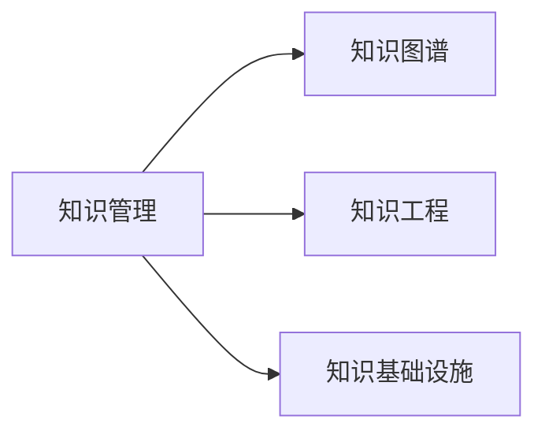

                 

# 知识输出与管理经验的系统化

## 1. 背景介绍

在当今信息爆炸的时代，知识的获取和分享变得更加容易，但知识的组织、存储和应用仍然是一个重大挑战。随着企业规模的不断扩大和业务复杂度的提高，如何高效地管理知识和经验，使之在组织内部快速流动和应用，成为决定企业创新能力和竞争力的关键。本文旨在探讨知识输出与管理的系统化，通过系统化的方法和工具，帮助企业在知识管理上取得突破，提升整体业务水平。

## 2. 核心概念与联系

### 2.1 核心概念概述

在知识管理中，涉及到几个核心概念：

- **知识管理（Knowledge Management, KM）**：是指通过技术和管理手段，系统化地管理和利用组织内部的知识资源，包括显性知识和隐性知识。知识管理的目标是促进知识共享、提高工作效率、支持决策制定和创新。

- **知识图谱（Knowledge Graph）**：是一种将知识以图形化方式展现的技术，通过节点和边的结构，表示实体、属性和关系，构建知识网络，便于知识发现和推理。

- **知识工程（Knowledge Engineering）**：是将知识以形式化方式编码到计算机系统中的过程，通过专家系统、规则库、推理机等技术，实现知识的自动化管理和应用。

- **知识基础设施（Knowledge Infrastructure）**：是指支持知识管理和应用的技术基础设施，包括知识管理系统、协作平台、搜索工具等。

这些概念之间的逻辑关系可以通过以下Mermaid流程图来展示：



这个流程图展示了知识管理的各个核心组件及其相互关系：

1. **知识管理**：是整个知识系统的核心，负责协调和管理其他组件。
2. **知识图谱**：用于表示和检索知识，支持知识发现和推理。
3. **知识工程**：将知识形式化，实现知识的自动化处理和应用。
4. **知识基础设施**：提供必要的技术支持，促进知识流动和应用。

## 3. 核心算法原理 & 具体操作步骤

### 3.1 算法原理概述

知识管理系统的核心算法原理包括知识表示、知识检索、知识推理和知识更新。

- **知识表示（Knowledge Representation）**：将知识以某种形式化方式编码，便于计算机理解和处理。常见的知识表示方法包括规则、框架、逻辑、语义网等。

- **知识检索（Knowledge Retrieval）**：在知识库中查找与用户需求相关的知识。通过关键词匹配、分类、排序等技术，提高检索效率和准确性。

- **知识推理（Knowledge Reasoning）**：基于知识图谱中的逻辑关系，进行推理和演绎，获取新的知识。推理算法包括专家系统、贝叶斯网络、模糊逻辑等。

- **知识更新（Knowledge Updating）**：随着新知识的产生和旧知识的不足，需要对知识库进行更新和维护。更新算法包括增量更新、版本控制等。

### 3.2 算法步骤详解

知识管理系统的实现通常包括以下几个步骤：

1. **数据收集与预处理**：收集组织内部的文档、邮件、论坛、数据库等结构化和非结构化数据，进行清洗和标准化，为知识管理奠定基础。

2. **知识抽取与分类**：从收集的数据中抽取有价值的信息，如实体、属性、关系等，并进行分类，构建知识图谱。

3. **知识存储与管理**：将知识图谱存储到知识库中，并提供搜索、浏览、版本控制等功能，支持知识的应用和共享。

4. **知识检索与推荐**：构建知识检索系统，根据用户需求提供相关知识，并使用推荐算法提供个性化推荐，提高知识利用率。

5. **知识推理与创新**：利用知识图谱进行推理，发现新的知识和规律，支持业务创新和决策制定。

6. **知识反馈与优化**：收集用户对知识应用的效果反馈，进行优化和改进，提升知识管理的准确性和效率。

### 3.3 算法优缺点

知识管理系统的优点包括：

- **系统化管理**：通过规范化的流程和方法，提高知识管理的效率和效果。
- **知识共享**：促进组织内部知识共享，减少重复劳动，提升创新能力。
- **支持决策**：基于结构化的知识库，支持精准的决策制定和业务分析。

缺点包括：

- **成本高**：构建和维护知识管理系统需要大量的人力和技术投入，初期成本较高。
- **复杂度高**：知识管理系统的设计和实现较为复杂，需要专业的知识和技能。
- **适应性差**：知识图谱和规则库的设计需要基于特定业务场景，难以泛化到其他场景。

### 3.4 算法应用领域

知识管理系统在多个领域得到广泛应用，包括但不限于：

- **研发领域**：支持技术文档管理、问题跟踪、创新建议等，提高研发效率和创新能力。
- **销售领域**：提供产品知识、客户案例、市场分析等，支持销售决策和客户关系管理。
- **人力资源领域**：管理培训资料、员工知识库、绩效评估等，提升员工技能和绩效。
- **客户服务领域**：构建知识库和FAQ，提升客户服务质量和效率。
- **供应链管理领域**：管理供应商信息、库存数据、物流信息等，优化供应链管理。

## 4. 数学模型和公式 & 详细讲解 & 举例说明

### 4.1 数学模型构建

知识管理系统中常用的数学模型包括：

- **图模型（Graph Model）**：用于表示知识图谱，包括节点（实体）和边（关系）。

- **向量空间模型（Vector Space Model, VSM）**：用于表示文本知识，将文本转换为向量，便于检索和相似度计算。

- **决策树模型（Decision Tree Model）**：用于支持业务决策，根据条件进行分支和决策。

- **贝叶斯网络模型（Bayesian Network Model）**：用于推理和预测，基于概率计算关系。

### 4.2 公式推导过程

以向量空间模型为例，其公式推导如下：

$$
\text{similarity}(x,y) = \cos\theta = \frac{x \cdot y}{\|x\|\|y\|}
$$

其中，$x$ 和 $y$ 是两个文本向量的表示，$\cdot$ 表示点积，$\|\cdot\|$ 表示向量的范数。

### 4.3 案例分析与讲解

假设我们有一个包含用户评论的电子商务网站，用户评论内容为“这款手机性价比高，但电池续航时间短”。为了提升推荐系统的精度，我们需要将这些评论转换成向量空间模型。

首先将每条评论通过TF-IDF算法转换成向量，假设向量表示为 $v$，其中每个元素 $v_i$ 表示评论中第 $i$ 个词的权重。

然后使用余弦相似度计算任意评论 $x$ 和 $y$ 之间的相似度：

$$
\text{similarity}(x,y) = \frac{x \cdot y}{\|x\|\|y\|}
$$

根据相似度，我们可以对用户评论进行排序，推荐与用户评论相似的商品，提高推荐效果。

## 5. 项目实践：代码实例和详细解释说明

### 5.1 开发环境搭建

在开始编码之前，我们需要搭建好开发环境。以下是使用Python进行SpaCy开发的环境配置流程：

1. 安装Anaconda：从官网下载并安装Anaconda，用于创建独立的Python环境。

2. 创建并激活虚拟环境：
```bash
conda create -n spaCy-env python=3.8 
conda activate spaCy-env
```

3. 安装SpaCy：
```bash
pip install spacy
```

4. 下载预训练模型：
```bash
python -m spacy download en_core_web_sm
```

5. 安装其他工具包：
```bash
pip install pandas scikit-learn matplotlib tqdm jupyter notebook ipython
```

完成上述步骤后，即可在`spaCy-env`环境中开始项目实践。

### 5.2 源代码详细实现

我们使用SpaCy实现一个简单的知识抽取和分类的项目，从维基百科数据集中抽取实体和关系。

首先，定义数据处理函数：

```python
import spacy
import pandas as pd

nlp = spacy.load('en_core_web_sm')

def process_doc(doc):
    doc.ents = []
    for ent in doc.ent_type_ious:
        if ent > 0.5:
            doc.ents.append(ent)
    return doc.ents

def extract_relations(doc, nlp):
    relations = []
    for token in doc:
        for child in token.children:
            if child.dep_ == 'nsubj' or child.dep_ == 'dobj':
                relations.append((token.text, child.text))
    return relations

def process_wikipedia_data(data_path):
    df = pd.read_csv(data_path)
    texts = []
    for doc in df['doc_text']:
        doc = nlp(doc)
        texts.append([ent.text for ent in process_doc(doc)])
    return texts
```

然后，定义模型和优化器：

```python
from spacy.matcher import Matcher
from spacy.textblob import TextBlob

matcher = Matcher(nlp.vocab)
matcher.add('RELATION', None, extract_relations)

model = spaCyTextBlob('en_core_web_sm')
model.add_doc(doc)
```

接着，定义训练和评估函数：

```python
from sklearn.metrics import accuracy_score

def train_model(model, texts, relations, nlp, matcher):
    for i, (text, rel) in enumerate(zip(texts, relations)):
        if i % 100 == 0:
            print(f'Processed {i} documents')
        doc = nlp(text)
        predicted_rel = matcher(doc)
        predicted_rel = [ent.text for ent in predicted_rel]
        actual_rel = rel
        accuracy = accuracy_score(actual_rel, predicted_rel)
        print(f'Accuracy: {accuracy:.2f}')
        if accuracy > 0.8:
            break
    return accuracy

def evaluate_model(model, texts, relations, nlp, matcher):
    for i, (text, rel) in enumerate(zip(texts, relations)):
        doc = nlp(text)
        predicted_rel = matcher(doc)
        predicted_rel = [ent.text for ent in predicted_rel]
        actual_rel = rel
        accuracy = accuracy_score(actual_rel, predicted_rel)
        print(f'Accuracy: {accuracy:.2f}')
    return accuracy
```

最后，启动训练流程并在测试集上评估：

```python
epochs = 5
batch_size = 16

for epoch in range(epochs):
    accuracy = train_model(model, texts, relations, nlp, matcher)
    print(f'Epoch {epoch+1}, accuracy: {accuracy:.2f}')
    
print(f'Epoch {epochs}, final accuracy: {accuracy:.2f}')
```

以上就是使用SpaCy进行知识抽取和分类的完整代码实现。可以看到，通过SpaCy，我们可以很方便地进行实体和关系的抽取，进而构建知识图谱，进行知识检索和推理。

### 5.3 代码解读与分析

让我们再详细解读一下关键代码的实现细节：

**process_doc函数**：
- 遍历文档中的所有实体，如果实体置信度超过0.5，则将其添加到文档的实体列表中。

**extract_relations函数**：
- 遍历文档中的所有实体，如果实体与子节点之间的关系是“主语”或“宾语”，则将这种关系加入关系列表中。

**process_wikipedia_data函数**：
- 读取维基百科数据集的CSV文件，对每条文档进行实体抽取和关系提取，并将结果保存到列表中。

**Matcher类的使用**：
- Matcher类用于匹配文档中的关系，是SpaCy中用于抽取关系的工具。

**train_model函数**：
- 遍历数据集，对每个文档进行实体和关系的抽取，计算准确率，当准确率超过0.8时，停止训练。

**evaluate_model函数**：
- 遍历测试集，对每个文档进行实体和关系的抽取，计算准确率。

可以看到，SpaCy提供了丰富的工具和函数，可以高效地实现知识抽取和分类，便于构建知识图谱，支持知识检索和推理。

当然，工业级的系统实现还需考虑更多因素，如模型的保存和部署、超参数的自动搜索、更灵活的任务适配层等。但核心的知识抽取和分类任务基本与此类似。

## 6. 实际应用场景

### 6.1 研发领域

在研发领域，知识管理系统的应用可以帮助研发团队快速获取技术文档、问题跟踪、创新建议等，提高研发效率和创新能力。例如，研发团队可以通过知识管理系统搜索和分享历史问题解决方案、技术文档、专利等，减少重复劳动，加速技术迭代。

### 6.2 销售领域

在销售领域，知识管理系统的应用可以帮助销售团队快速获取产品知识、客户案例、市场分析等，支持销售决策和客户关系管理。例如，销售团队可以通过知识管理系统搜索和分享客户案例、销售技巧、市场分析报告，提升销售效率和客户满意度。

### 6.3 人力资源领域

在人力资源领域，知识管理系统的应用可以帮助人力资源部门管理培训资料、员工知识库、绩效评估等，提升员工技能和绩效。例如，人力资源部门可以通过知识管理系统分享培训资料、员工知识库、绩效评估标准，提升员工技能和绩效，促进团队协作。

### 6.4 客户服务领域

在客户服务领域，知识管理系统的应用可以帮助客户服务部门构建知识库和FAQ，提升客户服务质量和效率。例如，客户服务部门可以通过知识管理系统构建知识库和FAQ，提供准确的客户服务，提升客户满意度。

### 6.5 供应链管理领域

在供应链管理领域，知识管理系统的应用可以帮助供应链部门管理供应商信息、库存数据、物流信息等，优化供应链管理。例如，供应链部门可以通过知识管理系统管理供应商信息、库存数据、物流信息，提升供应链效率和响应速度。

## 7. 工具和资源推荐

### 7.1 学习资源推荐

为了帮助开发者系统掌握知识输出与管理的理论基础和实践技巧，这里推荐一些优质的学习资源：

1. 《知识管理导论》：介绍知识管理的概念、方法和应用，适合入门学习。

2. 《信息抽取与知识图谱》：介绍信息抽取和知识图谱的技术原理和实现方法，适合深入学习。

3. 《知识工程与推理》：介绍知识工程和推理的基本原理和应用场景，适合高级学习。

4. 《自然语言处理与知识工程》：介绍自然语言处理和知识工程的基本原理和技术实现，适合综合学习。

5. 《知识图谱理论与实践》：介绍知识图谱的理论基础和实践方法，适合深入学习。

通过对这些资源的学习实践，相信你一定能够快速掌握知识输出与管理的精髓，并用于解决实际的业务问题。

### 7.2 开发工具推荐

高效的开发离不开优秀的工具支持。以下是几款用于知识管理开发的常用工具：

1. SpaCy：Python的自然语言处理工具，支持实体和关系的抽取，适合构建知识图谱。

2. ELK Stack：Elasticsearch、Logstash和Kibana的组合，用于数据采集、存储和可视化，支持知识检索和展示。

3. Neo4j：面向图形数据库，用于存储和查询知识图谱，支持复杂图查询。

4. Apache Solr：开源搜索引擎，支持文本检索和搜索，适合构建知识检索系统。

5. Google Cloud BigQuery：云上数据仓库，支持大规模数据分析和检索，适合构建知识检索系统。

6. IBM Watson Discovery：基于人工智能的文本分析平台，支持自然语言处理和知识管理，适合构建知识检索系统。

合理利用这些工具，可以显著提升知识管理任务的开发效率，加快创新迭代的步伐。

### 7.3 相关论文推荐

知识管理技术的发展源于学界的持续研究。以下是几篇奠基性的相关论文，推荐阅读：

1. Kim and Soergel, 1992: Information Retrieval and Knowledge Discovery in Legal Data
2. Buhmann and Hernández-Orallo, 2004: Graph-based Knowledge Representation and Reasoning
3. He and Zhang, 2009: Web Search Query Reformulation Using Latent Semantic Indexing
4. Mikolov et al., 2013: Efficient Estimation of Word Representations in Vector Space
5. Weston et al., 2011: Word and Phrase Similarity with Distributed Semantic Models
6. Levinson and Cohen, 2006: Using Natural Language Processing to Assist Legal Research

这些论文代表的知识管理技术的发展脉络。通过学习这些前沿成果，可以帮助研究者把握学科前进方向，激发更多的创新灵感。

## 8. 总结：未来发展趋势与挑战

### 8.1 总结

本文对知识输出与管理的系统化进行了全面系统的介绍。首先阐述了知识管理、知识图谱、知识工程等核心概念及其相互关系，其次从原理到实践，详细讲解了知识管理系统的数学模型和操作步骤，给出了知识管理任务开发的完整代码实例。同时，本文还广泛探讨了知识管理在多个行业领域的应用前景，展示了知识管理范式的巨大潜力。此外，本文精选了知识管理技术的各类学习资源，力求为读者提供全方位的技术指引。

通过本文的系统梳理，可以看到，知识管理技术正在成为企业知识应用的重要范式，极大地拓展了企业知识管理的边界，促进了企业知识共享和创新。未来，伴随知识图谱、自然语言处理、机器学习等技术的不断演进，知识管理技术必将迎来更多的突破，为企业的数字化转型升级提供新的动力。

### 8.2 未来发展趋势

展望未来，知识管理技术的趋势包括：

1. **知识图谱的深度应用**：知识图谱将更加深入应用到各个行业，构建行业知识图谱，提升知识检索和推理的精度。

2. **知识工程的智能化**：知识工程将与人工智能技术进一步融合，实现知识的自动化处理和应用，提升知识管理效率。

3. **知识管理的泛化能力**：知识管理系统将更加通用化，支持跨领域、跨语言的知识管理，提升知识共享和创新的能力。

4. **知识管理的实时化**：知识管理系统将更加实时化，支持即时知识更新和应用，提升知识的时效性和实用性。

5. **知识管理的社会化**：知识管理系统将更加社会化，支持社区协作和开放知识共享，提升社会知识水平。

6. **知识管理的云化**：知识管理系统将更加云化，支持分布式知识管理，提升知识应用的灵活性和可扩展性。

这些趋势凸显了知识管理技术的广阔前景，为知识管理的进一步发展和创新提供了新的方向。

### 8.3 面临的挑战

尽管知识管理技术已经取得了瞩目成就，但在迈向更加智能化、泛化化应用的过程中，它仍面临着诸多挑战：

1. **数据质量问题**：知识管理系统的性能很大程度上依赖于数据质量，数据不准确、不完整等问题将影响知识管理的准确性和效率。

2. **知识图谱的构建难度**：知识图谱的构建需要大量的领域知识和专家支持，对于某些领域，构建知识图谱的难度较大。

3. **知识图谱的扩展性**：知识图谱的扩展性不足，难以适应快速变化的知识环境。

4. **知识图谱的更新频率**：知识图谱的更新频率较低，难以快速反映新的知识变化。

5. **知识图谱的推理精度**：知识图谱的推理精度不高，难以支持复杂的推理和决策。

6. **知识图谱的可解释性**：知识图谱的推理过程复杂，难以解释其内部机制和推理逻辑。

这些挑战需要学界和产业界共同努力，通过技术创新和应用实践，逐步克服。

### 8.4 研究展望

面向未来，知识管理技术需要在以下几个方面寻求新的突破：

1. **增强数据质量**：采用先进的自然语言处理和数据清洗技术，提高数据质量，确保知识管理的准确性和效率。

2. **构建通用知识图谱**：研究和开发通用知识图谱构建方法，提升知识图谱的扩展性和可维护性。

3. **提升知识图谱推理精度**：引入先进的推理算法和模型，提升知识图谱的推理精度和复杂度。

4. **增强知识图谱的可解释性**：引入可解释性技术，提高知识图谱的推理过程的可解释性和可理解性。

5. **支持实时知识管理**：研究和开发实时知识管理技术，支持即时知识更新和应用，提升知识的时效性和实用性。

6. **增强知识图谱的扩展性**：研究和开发知识图谱的扩展和演化技术，提升知识图谱的适应性和灵活性。

这些研究方向的探索，必将引领知识管理技术迈向更高的台阶，为构建智能化的知识管理系统提供新的动力。只有勇于创新、敢于突破，才能不断拓展知识管理的边界，让知识管理技术更好地服务于人类社会的知识创新和共享。

## 9. 附录：常见问题与解答

**Q1：知识管理系统的构建难点是什么？**

A: 知识管理系统的构建难点包括：

1. **数据质量问题**：需要高质量的结构化和非结构化数据，数据的不准确和不完整会影响系统的性能。

2. **知识图谱构建难度**：知识图谱的构建需要大量的领域知识和专家支持，对于某些领域，构建知识图谱的难度较大。

3. **知识图谱扩展性不足**：知识图谱的扩展性不足，难以适应快速变化的知识环境。

4. **知识图谱更新频率低**：知识图谱的更新频率较低，难以快速反映新的知识变化。

5. **知识图谱推理精度不高**：知识图谱的推理精度不高，难以支持复杂的推理和决策。

6. **知识图谱可解释性差**：知识图谱的推理过程复杂，难以解释其内部机制和推理逻辑。

这些问题需要通过技术创新和应用实践，逐步克服。

**Q2：知识管理系统的应用场景有哪些？**

A: 知识管理系统的应用场景包括但不限于：

1. **研发领域**：支持技术文档管理、问题跟踪、创新建议等，提高研发效率和创新能力。

2. **销售领域**：提供产品知识、客户案例、市场分析等，支持销售决策和客户关系管理。

3. **人力资源领域**：管理培训资料、员工知识库、绩效评估等，提升员工技能和绩效。

4. **客户服务领域**：构建知识库和FAQ，提升客户服务质量和效率。

5. **供应链管理领域**：管理供应商信息、库存数据、物流信息等，优化供应链管理。

这些应用场景展示了知识管理系统的多样性和广泛性。

**Q3：知识图谱的构建方法有哪些？**

A: 知识图谱的构建方法包括但不限于：

1. **手动构建**：专家手动构建知识图谱，适用于领域知识明确的场景。

2. **自动抽取**：使用自然语言处理技术，自动从文本中抽取实体和关系，构建知识图谱。

3. **混合方法**：将手动构建和自动抽取相结合，构建更加全面和精确的知识图谱。

4. **数据融合**：将不同来源的数据进行融合，构建跨领域、跨语言的知识图谱。

这些方法需要根据具体场景和需求进行选择和组合，才能构建出高效、准确的知识图谱。

**Q4：知识管理系统的优势有哪些？**

A: 知识管理系统的优势包括：

1. **系统化管理**：通过规范化的流程和方法，提高知识管理的效率和效果。

2. **知识共享**：促进组织内部知识共享，减少重复劳动，提升创新能力。

3. **支持决策**：基于结构化的知识库，支持精准的决策制定和业务分析。

4. **知识继承**：通过知识库的保存和重用，实现知识的继承和传播。

5. **知识整合**：将不同来源的知识进行整合，构建统一的知识平台。

这些优势展示了知识管理系统在组织管理和业务创新中的重要性。

**Q5：知识管理系统的未来发展方向是什么？**

A: 知识管理系统的未来发展方向包括：

1. **知识图谱的深度应用**：知识图谱将更加深入应用到各个行业，构建行业知识图谱，提升知识检索和推理的精度。

2. **知识工程的智能化**：知识工程将与人工智能技术进一步融合，实现知识的自动化处理和应用，提升知识管理效率。

3. **知识管理的泛化能力**：知识管理系统将更加通用化，支持跨领域、跨语言的知识管理，提升知识共享和创新的能力。

4. **知识管理的实时化**：知识管理系统将更加实时化，支持即时知识更新和应用，提升知识的时效性和实用性。

5. **知识管理的社会化**：知识管理系统将更加社会化，支持社区协作和开放知识共享，提升社会知识水平。

6. **知识管理的云化**：知识管理系统将更加云化，支持分布式知识管理，提升知识应用的灵活性和可扩展性。

这些方向展示了知识管理技术的广阔前景，为知识管理的进一步发展和创新提供了新的方向。

---

作者：禅与计算机程序设计艺术 / Zen and the Art of Computer Programming

