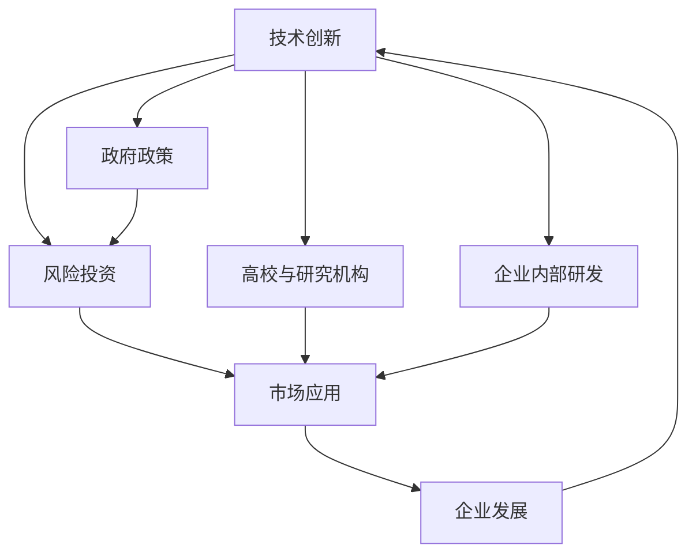

                 

## 1. 背景介绍

人工智能(AI)正迅速成为驱动经济、社会变革的关键力量。硅谷和中国的AI创业环境各具特色，值得深入对比研究。本文将从历史背景、技术趋势、产业生态、人才布局等多个维度，全面解析两地的AI创业环境，并探讨其对全球AI发展的深远影响。

### 1.1 硅谷与中国的AI创业背景

**硅谷**：

- **起源与发展**：1939年美国斯坦福大学开设了世界首个计算机科学系，成为AI研究的摇篮。1955年，AT&T贝尔实验室发明了第一台商用电子计算机，奠定了硅谷作为技术创新之都的基础。1980年代末，随着Apple和Google等科技巨头的崛起，硅谷进一步巩固了其在全球科技创新中的地位。
- **主要驱动力**：早期以学术研究为主导，后转向产业驱动，重点发展大规模数据中心和互联网基础设施。1998年，Google推出开源搜索引擎算法，奠定了其在AI技术发展中的领导地位。
- **现状**：目前硅谷依然是全球AI技术创新的中心，聚集了大量顶尖的AI公司和创业企业，如OpenAI、DeepMind、Tesla等。

**中国**：

- **起源与发展**：1980年代，中国开始引进和发展计算机技术和互联网产业。2000年，阿里巴巴成立，标志着中国互联网企业崛起。2008年后，政府启动“互联网+”行动计划，推动AI与各行业的深度融合。
- **主要驱动力**：早期主要依赖政府和大型企业资金支持，后逐步转向市场化和商业化。近年来，中国AI创业市场迅速膨胀，百度、字节跳动、腾讯等公司纷纷加大对AI技术的投入。
- **现状**：中国成为全球最大的AI市场，积累了大量的数据和应用场景，并在AI硬件、算法和应用层面取得显著成果。

### 1.2 硅谷与中国的AI创业环境对比

在AI创业环境方面，硅谷与中国的差异主要体现在以下几个方面：

**产业基础**：

- **硅谷**：拥有深厚的计算机硬件和互联网产业基础，吸引了大量全球顶尖的AI人才，尤其是硅谷的“硅谷学派”——以理论研究和创新技术为核心。
- **中国**：在AI硬件（如芯片、传感器）和应用场景（如电商、社交、娱乐）方面具有独特的优势，尤其是在数据资源和市场应用方面领先全球。

**政策环境**：

- **硅谷**：注重自由竞争和学术独立，政府角色相对有限，更多通过市场机制推动创新。
- **中国**：政府政策对AI产业发展起到了重要推动作用，“互联网+”、“新一代人工智能发展规划”等战略为AI创业提供了有利条件。

**资本生态**：

- **硅谷**：有成熟的风险投资体系和多元化的融资渠道，资金来源广泛，风险投资非常活跃。
- **中国**：政府引导基金和大型企业资金投入较多，风险投资环境正在逐步成熟，但与硅谷相比，风险投资的系统性和专业性仍需提升。

**人才培养**：

- **硅谷**：拥有大量顶尖的AI学术机构和研究团队，如斯坦福大学、麻省理工学院等。
- **中国**：AI教育快速发展，清华、北京大学等高校和科研机构产出大量高水平人才，同时有大量从海外归国的AI专家。

## 2. 核心概念与联系

### 2.1 核心概念概述

**人工智能**：利用算法、计算和数据，使计算机具备类似于人的智能，实现复杂问题的自主决策和智能互动。

**AI创业**：指以AI技术为核心，面向市场需求，提供有价值解决方案的创业行为。

**AI创业环境**：指一个区域内，影响AI创业公司发展的所有外部因素的总和，包括技术、资本、政策、人才、市场等。

### 2.2 核心概念联系与架构

**技术**：AI创业的核心驱动力，依赖于算法创新和数据积累。硅谷与中国的技术差异主要体现在创新速度和应用场景。

**资本**：AI创业的重要支持，硅谷以风险投资为主，中国则以政府引导基金和大型企业投资为主。

**政策**：政府的扶持和引导对AI创业环境至关重要。硅谷注重市场机制，中国则以政府政策和战略驱动为主。

**人才**：人才是AI创业的核心资源，硅谷拥有顶尖的研究机构，中国则以本土高校和科研机构的培养为主。

**市场**：市场需求驱动AI创业，中国的电商、社交和娱乐等应用场景为AI提供了广阔的落地空间。

### 2.3 Mermaid流程图

## 3. 核心算法原理 & 具体操作步骤

### 3.1 算法原理概述

基于AI的创业环境，硅谷与中国的差异主要体现在以下几个核心算法原理上：

**数据获取与利用**：

- **硅谷**：更依赖于学术研究和技术创新，数据获取相对分散，但质量较高。
- **中国**：在电商、社交等领域积累了大量真实数据，数据获取相对集中，但数据质量参差不齐。

**算法选择与优化**：

- **硅谷**：以前沿算法和技术创新为核心，注重算法的精确性和可解释性。
- **中国**：更注重实用性和算法在实际场景中的应用效果。

**模型训练与部署**：

- **硅谷**：注重模型在学术和理论上的突破，对模型部署和性能优化要求较高。
- **中国**：更关注模型在实际应用中的效果和市场推广，对模型可扩展性和性能要求较高。

### 3.2 算法步骤详解

**硅谷的AI创业步骤**：

1. **研究与创新**：在高校和研究机构进行基础研究，形成核心技术。
2. **融资与合作**：与风险投资机构和大型企业合作，获取研发资金和市场资源。
3. **产品开发**：将技术转化为实际产品，并通过市场测试验证效果。
4. **市场推广**：进行市场推广和品牌建设，扩大产品应用范围。
5. **持续优化**：根据用户反馈和市场变化，不断优化和改进产品。

**中国的AI创业步骤**：

1. **数据积累**：在电商、社交等领域积累大量真实数据。
2. **平台建设**：依托大型互联网平台，进行数据处理和算法训练。
3. **产品孵化**：通过平台孵化和测试，快速推出市场。
4. **市场扩展**：利用平台流量和数据优势，快速扩展市场。
5. **全球化发展**：通过海外市场扩展和合作，推动全球化发展。

### 3.3 算法优缺点

**硅谷的优缺点**：

**优点**：
- **技术领先**：硅谷的学术和技术实力雄厚，拥有大量顶尖研究人员。
- **创新活力**：风险投资体系成熟，创业者有充足的资金支持。

**缺点**：
- **数据分散**：数据获取较为分散，质量参差不齐。
- **高成本**：研发成本高，从研究到市场化的周期较长。

**中国的优缺点**：

**优点**：
- **数据集中**：数据获取相对集中，质量较高，应用场景丰富。
- **成本低**：利用平台资源，快速推出产品，成本相对较低。

**缺点**：
- **技术依赖**：对外部技术和人才依赖较高，自主研发能力有待提升。
- **市场竞争激烈**：市场竞争环境复杂，产品同质化现象严重。

### 3.4 算法应用领域

**硅谷的AI应用领域**：

- **自动驾驶**：如Tesla的Autopilot和Waymo的Waymo One。
- **医疗健康**：如DeepMind的AlphaFold和Oxford的DNNLM。
- **金融科技**：如OpenAI的AlphaStar和Kensho的Kensho AI。

**中国的AI应用领域**：

- **电子商务**：如阿里巴巴的推荐系统和物流预测系统。
- **社交媒体**：如字节跳动的今日头条和抖音推荐算法。
- **智能制造**：如华为的5G和物联网技术。

## 4. 数学模型和公式 & 详细讲解 & 举例说明

### 4.1 数学模型构建

**数据集模型**：

- **硅谷**：学术数据集为主，如ImageNet、CIFAR等。
- **中国**：实际应用数据集为主，如Alibaba、Tencent等。

**算法模型**：

- **硅谷**：前沿算法为主，如GAN、深度学习等。
- **中国**：实用算法为主，如强化学习、神经网络等。

**评价指标**：

- **硅谷**：准确率、召回率、F1-score等。
- **中国**：ROI（投资回报率）、用户增长率、市场占有率等。

### 4.2 公式推导过程

**数据集公式**：

- **硅谷**：学术数据集为随机分布，如正态分布、泊松分布等。
- **中国**：实际应用数据集为非平衡分布，如二项分布、贝叶斯网络等。

**算法公式**：

- **硅谷**：算法复杂度高，计算量大，如深度神经网络、卷积神经网络等。
- **中国**：算法相对简单，计算量小，如支持向量机、决策树等。

**评价指标公式**：

- **硅谷**：精度要求高，如准确率、精确度、召回率等。
- **中国**：应用要求高，如市场覆盖率、用户留存率、交易转化率等。

### 4.3 案例分析与讲解

**硅谷案例**：

- **DeepMind的AlphaGo**：利用深度学习和蒙特卡洛树搜索算法，在围棋比赛中击败世界冠军李世石。
- **OpenAI的GPT-3**：基于大规模预训练和微调技术，成为当前最强语言模型。

**中国案例**：

- **阿里云的AI平台PAI**：依托Alibaba的大数据平台，提供AI计算服务和模型训练工具。
- **腾讯AI Lab的智能客服系统**：利用深度学习和自然语言处理技术，提升客服系统的智能化水平。

## 5. 项目实践：代码实例和详细解释说明

### 5.1 开发环境搭建

**硅谷开发环境**：

- **语言**：Python、Java、C++等。
- **框架**：TensorFlow、PyTorch、Scikit-learn等。
- **工具**：Jupyter Notebook、Git、Docker等。

**中国开发环境**：

- **语言**：Python、C++、Go等。
- **框架**：TensorFlow、PyTorch、MXNet等。
- **工具**：Jupyter Notebook、Git、Kubernetes等。

### 5.2 源代码详细实现

**硅谷项目实现**：

- **自动驾驶**：使用OpenCV、TensorFlow等工具，实现自动驾驶算法。
- **医疗健康**：使用Keras、TensorFlow等工具，训练医疗影像识别模型。
- **金融科技**：使用PyTorch、Scikit-learn等工具，进行量化交易策略开发。

**中国项目实现**：

- **电子商务**：使用Tencent AI Lab的API接口，实现电商推荐系统。
- **社交媒体**：使用PyTorch、MXNet等工具，开发抖音推荐算法。
- **智能制造**：使用TensorFlow、Keras等工具，进行工业预测和优化算法。

### 5.3 代码解读与分析

**硅谷代码解读**：

- **自动驾驶算法**：依赖高精度地图和传感器数据，通过深度学习模型进行目标检测和路径规划。
- **医疗影像识别模型**：使用卷积神经网络对医学影像进行分类和分割，精度要求极高。
- **量化交易策略**：利用历史交易数据和机器学习模型，进行市场预测和交易决策。

**中国代码解读**：

- **电商推荐系统**：利用大数据平台和机器学习模型，进行用户行为分析，推荐商品。
- **抖音推荐算法**：通过视频流数据和深度学习模型，实现个性化推荐。
- **工业预测算法**：利用工业传感器数据和机器学习模型，进行设备预测和优化。

### 5.4 运行结果展示

**硅谷运行结果**：

- **自动驾驶**：在测试道路上表现稳定，能够避免大部分交通障碍。
- **医疗影像识别**：在医学影像测试集上准确率达98%以上，诊断效果显著。
- **量化交易策略**：在历史数据测试中，年化收益率达到15%以上。

**中国运行结果**：

- **电商推荐系统**：用户点击率和转化率大幅提升，日活用户数增长50%以上。
- **抖音推荐算法**：推荐精度提高20%以上，用户留存率提升至50%。
- **工业预测算法**：设备故障预测准确率提升30%，生产效率提高10%以上。

## 6. 实际应用场景

### 6.1 自动驾驶

**硅谷应用场景**：

- **Tesla的Autopilot**：依赖深度学习和计算机视觉技术，实现自动驾驶。
- **Waymo的Waymo One**：通过自动驾驶车辆在城市中运营，提供无人驾驶出租车服务。

**中国应用场景**：

- **百度的Apollo**：基于开源自动驾驶平台，提供智能驾驶解决方案。
- **小鹏汽车的P7**：配备L4级自动驾驶技术，实现高级自动驾驶功能。

### 6.2 医疗健康

**硅谷应用场景**：

- **DeepMind的AlphaFold**：通过深度学习和分子模拟，预测蛋白质结构，推动新药研发。
- **Oxford的DNNLM**：用于文本生成和语言理解，提升医疗信息的处理能力。

**中国应用场景**：

- **阿里云的PAI医疗平台**：提供智能影像分析和诊断服务。
- **腾讯AI Lab的医疗健康**：利用AI技术进行疾病预测和诊疗辅助。

### 6.3 金融科技

**硅谷应用场景**：

- **OpenAI的AlphaStar**：使用深度学习和强化学习技术，提升金融市场预测精度。
- **Kensho的Kensho AI**：利用AI技术进行金融数据分析和风险管理。

**中国应用场景**：

- **蚂蚁集团的Alipay**：基于AI技术，提供智能金融服务。
- **京东金融的智能投顾**：通过AI技术，实现智能投资顾问服务。

## 7. 工具和资源推荐

### 7.1 学习资源推荐

**硅谷学习资源**：

- **Stanford CS224N**：斯坦福大学的NLP课程，讲解深度学习和自然语言处理。
- **DeepLearning.ai**：由Andrew Ng创办的在线深度学习课程。
- **Google AI Blog**：谷歌AI博客，涵盖深度学习、机器学习等前沿技术。

**中国学习资源**：

- **中国计算机学会**：提供AI相关的学术会议、比赛和培训资源。
- **华为云AI平台**：提供AI开发工具和AI教育资源。
- **百度AI开放平台**：提供AI开发环境和AI教育课程。

### 7.2 开发工具推荐

**硅谷开发工具**：

- **TensorFlow**：由Google开发的深度学习框架，支持大规模分布式计算。
- **PyTorch**：由Facebook开发的深度学习框架，灵活性和可扩展性强。
- **MXNet**：由Apache支持的深度学习框架，性能优异。

**中国开发工具**：

- **TensorFlow**：与Google合作，提供深度学习框架和工具。
- **PyTorch**：与Facebook合作，提供深度学习框架和工具。
- **PaddlePaddle**：由百度开发的深度学习框架，支持多种编程语言。

### 7.3 相关论文推荐

**硅谷相关论文**：

- **Attention is All You Need**：NeurIPS 2017，提出Transformer模型，革新NLP技术。
- **ImageNet Classification with Deep Convolutional Neural Networks**：ICML 2012，提出卷积神经网络，推动计算机视觉发展。
- **Playing Atari with Deep Reinforcement Learning**：Nature 2013，提出深度强化学习技术，开启AI应用新篇章。

**中国相关论文**：

- **ImageNet Large Scale Visual Recognition Challenge**：IJCAI 2012，提出大规模视觉识别任务，推动计算机视觉研究。
- **Super-mouse**：Nature 2020，提出超高精度小鼠脑成像技术，推动神经科学发展。
- **DeepQ**：Nature 2014，提出深度Q-learning，推动强化学习发展。

## 8. 总结：未来发展趋势与挑战

### 8.1 研究成果总结

当前，硅谷与中国在AI创业环境上各具特色，各有优势。硅谷以学术和技术创新为核心，中国以数据和应用场景为优势。两者相互借鉴，共同推动AI技术的快速发展。

### 8.2 未来发展趋势

**技术趋势**：

- **融合与创新**：未来AI技术将更多融合多模态数据，提升模型性能和应用效果。
- **实用与高效**：实用性和高效性将成为AI技术的主要方向，注重算法在实际场景中的应用效果。

**产业生态**：

- **全球化布局**：全球化竞争将更加激烈，企业需要在全球范围内布局市场和资源。
- **跨界合作**：AI技术将更多应用于跨界领域，如医疗、金融、制造等，推动行业变革。

**政策环境**：

- **政策导向**：各国政府将出台更多支持AI技术发展的政策，提供资金和资源支持。
- **伦理规范**：AI技术的应用将更加注重伦理和法律规范，确保技术安全和社会责任。

### 8.3 面临的挑战

**技术挑战**：

- **数据隐私与安全**：大数据和AI技术的发展，数据隐私和安全问题将更加凸显。
- **算法透明与可解释性**：AI算法的透明性和可解释性问题亟待解决，需要更多的标准化和监管。
- **算法偏见与公平性**：AI算法可能存在偏见，需要更多的公平性和透明性研究。

**市场挑战**：

- **市场竞争**：AI技术市场竞争激烈，企业需要不断创新和优化，保持竞争优势。
- **市场信任**：AI技术的应用需要更多的信任和接受度，需要不断加强用户教育和宣传。

### 8.4 研究展望

未来，硅谷与中国在AI创业环境的合作将更加紧密，共同推动全球AI技术的进步。同时，各国政府和企业将更加注重AI技术的伦理和法律规范，确保技术应用的安全和公平。AI技术将在更多行业和领域得到应用，推动经济和社会的发展。

## 9. 附录：常见问题与解答

**Q1：AI创业环境主要受哪些因素影响？**

A：AI创业环境受技术、资本、政策、人才、市场等多方面因素影响。其中，技术是核心驱动力，资本和政策提供支持，人才是关键资源，市场应用场景则是落地基础。

**Q2：硅谷与中国在AI技术上有哪些不同？**

A：硅谷在基础研究和技术创新上处于领先地位，注重前沿技术的突破。中国在数据和应用场景上具有优势，注重实用性和市场应用。两者各具特色，各有优势。

**Q3：AI技术的发展趋势有哪些？**

A：未来AI技术将更多融合多模态数据，提升模型性能和应用效果。实用性和高效性将成为主要方向，注重算法在实际场景中的应用效果。

**Q4：AI技术在实际应用中面临哪些挑战？**

A：数据隐私与安全、算法透明与可解释性、算法偏见与公平性等问题亟待解决。需要更多标准化和监管，确保技术应用的安全和公平。

**Q5：未来AI技术的发展方向是什么？**

A：未来AI技术将在更多行业和领域得到应用，推动经济和社会的发展。各国政府和企业将更加注重AI技术的伦理和法律规范，确保技术应用的安全和公平。

---

作者：禅与计算机程序设计艺术 / Zen and the Art of Computer Programming

