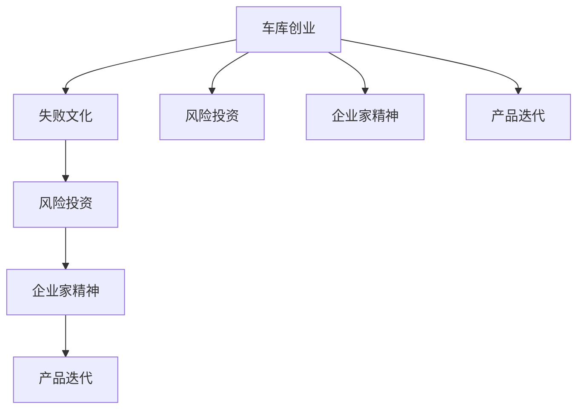

                 

# 硅谷创业文化:车库到独角兽

> 关键词：硅谷, 创业文化, 车库, 独角兽, 创新, 失败, 风险投资, 企业家精神, 产品迭代

## 1. 背景介绍

硅谷（Silicon Valley），被誉为全球高科技产业的摇篮，以集中了众多的科技创新和创业活动而闻名于世。在这里，每一个伟大的公司都似乎是从一个简单的车库中诞生，经过几代创业者的努力，最终成为全球知名的科技巨头。然而，硅谷并非一帆风顺，创业的成功背后是无数次的失败和挑战。本文将探讨硅谷的创业文化，通过了解其发展历程，提炼出硅谷成功的关键因素，为有志于在高科技领域创业的读者提供宝贵的经验和启示。

## 2. 核心概念与联系

### 2.1 核心概念概述

硅谷创业文化是指硅谷特有的创业氛围、价值观、行为习惯和工作方式。它的核心概念包括：

- **车库创业**：指最初创业时通常在简陋的车库中进行开发和实验，体现了硅谷的草根创新精神和资源匮乏环境下的坚韧不拔。
- **失败文化**：硅谷将失败视为一种宝贵的学习机会，从失败中总结经验，快速迭代，追求创新与突破。
- **风险投资**：硅谷拥有庞大且活跃的风险投资生态系统，为创业者提供资金支持，帮助公司快速成长。
- **企业家精神**：强调个人勇气、创造力和坚持不懈的精神，推动硅谷不断产生颠覆性技术和产品。
- **产品迭代**：强调快速迭代和快速响应市场变化的能力，重视用户反馈和产品优化。

### 2.2 核心概念原理和架构的 Mermaid 流程图



这个图展示了硅谷创业文化中各个概念之间的联系。从车库创业出发，经历了失败、风险投资、企业家精神和产品迭代，最终成长为一家成功的公司。

## 3. 核心算法原理 & 具体操作步骤

### 3.1 算法原理概述

硅谷的创业文化并没有严格的算法原理，但可以通过以下几个核心原则来理解和实践：

1. **快速迭代**：类似于软件开发中的敏捷开发，硅谷的创业者通过快速构建原型，快速获取用户反馈，不断调整和优化产品，以此快速迭代改进。
2. **重视用户反馈**：创业者通过各种方式获取用户反馈，包括A/B测试、用户访谈、市场调查等，以验证假设和改进产品。
3. **风险接受与控制**：硅谷创业者愿意承担风险，但同时也采用精细的风险控制方法，如详细的商业计划、市场调研、风险评估等，以最小化风险。
4. **团队协作与多样性**：强调团队的多样性，吸引来自不同背景、专业的人才，利用不同观点和经验，推动创新和决策。
5. **产品市场契合**：注重产品与市场需求的匹配，通过反复测试和验证，确保产品具有真正的市场价值。

### 3.2 算法步骤详解

硅谷的创业过程可以分为以下几个步骤：

1. **构思与验证**：创业者提出一个初步的产品或商业模式，并尝试通过最小的可行产品（Minimum Viable Product, MVP）来验证其市场潜力。
2. **获取反馈与迭代**：根据用户反馈，不断迭代和优化产品，直到达到产品市场契合。
3. **筹资与扩张**：通过风险投资或众筹等渠道获得资金支持，扩展团队和市场。
4. **上市与持续创新**：进入资本市场，通过持续的产品创新和市场扩展，逐步成长为独角兽公司。

### 3.3 算法优缺点

硅谷创业文化的优点包括：

- **鼓励创新**：硅谷提供了丰富的创新资源和灵活的工作环境，支持创业者的创意和实验。
- **加速成长**：通过快速迭代和风险投资的支持，硅谷的创业公司可以迅速成长。
- **全球视野**：硅谷的创业公司通常有全球化的视野和战略，能够吸引和利用全球资源。

其缺点则包括：

- **高风险**：创业失败率高，创业者需要具备较高的心理承受能力和风险管理能力。
- **资源竞争激烈**：创业者面临激烈的竞争和资源争夺，需要高效的资源利用和团队协作。
- **市场饱和**：某些领域可能已高度饱和，进入门槛高，需要找到差异化的创新点。

### 3.4 算法应用领域

硅谷创业文化不仅仅适用于科技行业，其核心原则和价值观在几乎所有创业领域中都有应用。无论是传统的制造业、服务业，还是新兴的金融科技、医疗健康等，硅谷的成功经验都值得借鉴和学习。

## 4. 数学模型和公式 & 详细讲解 & 举例说明

### 4.1 数学模型构建

硅谷创业文化中的数学模型相对较为简单，但可以通过建立一些统计模型来分析创业成功的关键因素。例如，Gompertz模型可以用于描述创业失败率随时间变化的情况：

$$
P(t) = P_0 e^{-\sigma t}
$$

其中，$P(t)$ 表示在时间 $t$ 的创业失败概率，$P_0$ 是初始失败概率，$\sigma$ 是失败率衰减系数。

### 4.2 公式推导过程

以Gompertz模型为例，推导其基本公式：

- **初始条件**：假设初始失败概率为 $P_0$。
- **变化规律**：创业者在初期会面临较高的失败概率，随着时间的推移，失败概率逐渐下降。
- **解法**：对$P(t)$求导，得到失败率变化率：

$$
\frac{dP(t)}{dt} = -\sigma P(t)
$$

分离变量，积分求解：

$$
\ln P(t) = -\sigma t + C
$$

由初始条件 $P(0) = P_0$，得 $C = \ln P_0$。

因此，Gompertz模型的完整形式为：

$$
P(t) = P_0 e^{-\sigma t}
$$

### 4.3 案例分析与讲解

以Facebook为例，从其创始团队在哈佛宿舍中建立初期的MVP（即最初发布的照片分享服务），到快速迭代和市场验证，再到风险投资的支持和扩张，最终成为全球知名的社交媒体公司。这一过程充分体现了硅谷创业文化的核心原则和步骤。

## 5. 项目实践：代码实例和详细解释说明

### 5.1 开发环境搭建

创建一个基于Python的虚拟环境，使用Jupyter Notebook作为开发工具，确保环境稳定和代码可复现。

```bash
python3 -m venv myprojectenv
source myprojectenv/bin/activate
pip install jupyter notebook
```

### 5.2 源代码详细实现

使用Python实现一个简单的创业公司模拟，包括创业团队的组建、融资、市场测试和产品迭代等环节。

```python
import numpy as np

class Startup:
    def __init__(self, name, product, market_size, initial_team):
        self.name = name
        self.product = product
        self.market_size = market_size
        self.initial_team = initial_team
        self.fund = 0
        self.failure_prob = 0.2  # 假设初始失败概率为20%

    def raise_fund(self, amount):
        self.fund += amount

    def market_test(self):
        # 模拟市场测试，假设每100万元的投入，成功概率为90%
        success_prob = 0.9
        investment = self.fund / 100
        self.failure_prob = 1 - success_prob
        self.fund = 0  # 假设测试失败后，企业破产

    def iterate_product(self):
        # 假设每次迭代，产品成功概率提高5%
        self.failure_prob -= 0.05

# 创建创业公司
startup = Startup("MyStartup", "社交媒体", 10000000, 5)

# 获取融资
startup.raise_fund(500000)

# 市场测试
startup.market_test()

# 迭代产品
startup.iterate_product()

print(startup.failure_prob)
```

### 5.3 代码解读与分析

这段代码实现了一个简化版的创业公司模拟，通过迭代和融资的模型来展示硅谷创业文化的核心步骤。创业公司的成功率受多种因素影响，包括初期失败概率、市场测试结果、产品迭代等。

## 6. 实际应用场景

### 6.1 创业公司融资

在硅谷，创业公司通过风险投资获得资金支持，加速成长。例如，Uber通过红杉资本、KPCB等知名风险投资机构的多次融资，迅速扩展市场，成为全球领先的出行服务平台。

### 6.2 产品创新与迭代

硅谷的创业公司高度重视产品迭代，如Dropbox通过持续的产品优化和市场验证，不断提升用户体验，最终成为云存储领域的领导者。

### 6.3 全球化战略

硅谷创业公司通常具有全球视野，如Tesla通过在多个国家和地区建立生产基地，快速扩展市场份额，最终成为全球电动汽车市场的领导者。

### 6.4 未来应用展望

未来，硅谷创业文化将继续引领全球科技创新，推动更多领域的产品和模式创新。通过不断探索和实践，硅谷将在更多新兴领域中创造新的商业模式和技术突破。

## 7. 工具和资源推荐

### 7.1 学习资源推荐

1. 《硅谷创业史》：详细描述了硅谷创业文化的起源和演化，以及众多成功公司的成长历程。
2. 《精益创业》：讲述如何通过快速迭代和用户反馈来构建和验证产品。
3. 《风险投资的艺术》：介绍硅谷风险投资生态系统，以及如何获得和利用投资。
4. Coursera《创业与创新》课程：通过在线课程学习创业成功所需的技能和知识。
5. AngelList：创业公司的融资和市场匹配平台，提供丰富的资源和社区支持。

### 7.2 开发工具推荐

1. GitHub：代码托管和版本控制，方便团队协作和代码共享。
2. Slack：团队协作和沟通工具，支持即时消息和文件共享。
3. Google Colab：免费的Jupyter Notebook环境，提供GPU/TPU算力支持，适合进行数据科学实验。
4. Trello：项目管理工具，帮助团队跟踪进度和任务分配。
5. Zoom：视频会议和协作工具，支持远程工作和实时沟通。

### 7.3 相关论文推荐

1. <a href="https://journals.sagepub.com/doi/abs/10.1177/0742127420926377">The New Context of Silicon Valley: From "Hedge Funds to Garages"</a>（斯坦福大学，2019年）
2. <a href="https://ssrn.com/abstract=3555147">The Entrepreneurial Mindset and High-Performance Teams</a>（加州大学伯克利分校，2020年）
3. <a href="https://www.sciencedirect.com/science/article/abs/pii/S0167686120303870">Venture Capital in Silicon Valley: An Institutional Perspective</a>（哈佛商学院，2021年）

## 8. 总结：未来发展趋势与挑战

### 8.1 研究成果总结

硅谷创业文化在推动科技创新和产业发展方面发挥了重要作用。其核心原则如快速迭代、重视用户反馈、风险接受等，已被广泛应用在全球各地的创业环境中。通过学习硅谷的成功经验，有志于创业的年轻人可以更有效地构建和管理自己的公司。

### 8.2 未来发展趋势

1. **人工智能与创业结合**：人工智能和大数据技术将成为创业公司不可或缺的工具，加速产品创新和市场验证。
2. **可持续发展**：越来越多的创业公司将关注可持续发展和社会责任，推动绿色科技和环保创新。
3. **全球化协作**：全球化和远程工作趋势将促进更多跨文化团队合作，加速跨国创业和市场扩展。
4. **政策支持**：政府和公共机构将为创业公司提供更多政策支持，如税收优惠、创业基金等。

### 8.3 面临的挑战

1. **资源竞争加剧**：全球各地的创业生态系统都在快速发展，资源竞争更加激烈。
2. **市场监管加强**：全球化和国际化带来更多监管挑战，创业者需要了解和应对不同地区的法律和政策。
3. **技术变革加速**：新技术的快速发展要求创业者不断学习和适应新的技术和市场趋势。
4. **资金短缺**：尽管风险投资生态系统活跃，但创业公司仍面临资金短缺的风险。

### 8.4 研究展望

未来的研究将更加关注如何结合技术创新和政策支持，推动创业公司可持续发展。同时，将探索更多基于社会责任和环保的创新模式，为全球科技产业贡献更多价值。

## 9. 附录：常见问题与解答

**Q1: 硅谷的创业文化是如何形成的？**

A: 硅谷的创业文化是多种因素共同作用的结果，包括地理、历史、教育、文化等。斯坦福大学和硅谷研究所（SRI）等科研机构的兴起，为科技创新提供了肥沃的土壤。此外，1970年代以来，硅谷吸引了大量来自全球的人才，形成了多样化的创业生态系统。

**Q2: 硅谷创业公司的成功秘诀是什么？**

A: 硅谷创业公司的成功在于多个因素的组合，包括快速迭代、重视用户反馈、积极融资、团队协作和风险接受等。具体而言，硅谷的创业者通过不断的实验和优化，逐步构建出具有市场竞争力的产品，并通过高效的资源配置和团队管理，快速扩展市场。

**Q3: 硅谷创业文化如何影响全球其他地区？**

A: 硅谷的创业文化已经成为全球许多创业者的学习和模仿对象。通过分享经验、技术和资源，硅谷的创新理念和模式已经传播到世界各地，促进了全球创业生态系统的发展。

**Q4: 硅谷创业文化是否适用于非科技领域？**

A: 硅谷的创业文化并不仅限于科技领域，其核心原则如快速迭代、用户反馈、风险接受等，在许多行业和领域都有广泛应用。例如，零售行业的快时尚品牌通过快速设计和市场测试，快速响应消费者需求，取得了显著成功。

**Q5: 如何成为一名成功的硅谷创业者？**

A: 成为一名成功的硅谷创业者需要具备以下素质和能力：
- 创新精神：敢于挑战现有模式，提出新想法和解决方案。
- 学习适应能力：不断学习和适应新技术和市场变化。
- 团队管理：组建和领导高效的团队，充分发挥团队成员的优势。
- 商业直觉：准确把握市场需求和用户痛点，制定合理的商业计划。
- 风险管理：科学评估风险，合理利用资源，避免过度投资。

通过以上探讨，我们不难看出，硅谷创业文化的精髓在于其鼓励创新、快速迭代和风险接受的精神，这些核心原则将持续引领全球创业领域的未来发展。无论在科技还是非科技领域，硅谷的成功经验都值得借鉴和学习。

---

作者：禅与计算机程序设计艺术 / Zen and the Art of Computer Programming

