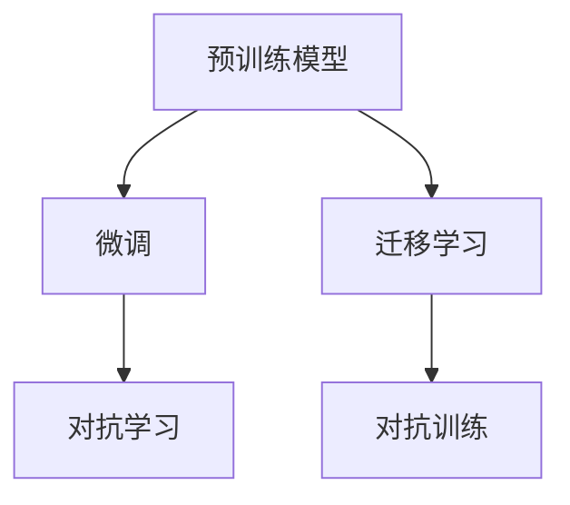

                 

# 硅谷医疗AI辅助诊断:提高诊断准确率

> 关键词：
- 医疗AI
- 诊断准确率
- 机器学习
- 深度学习
- 医学影像分析
- 电子病历处理
- 临床决策支持

## 1. 背景介绍

### 1.1 问题由来

在医疗领域，传统的诊断依赖于医生的经验和直觉，但在临床实践中，由于患者症状多样，医学知识复杂，加之医生的疲劳和认知限制，诊断过程中不可避免地存在误差。近年来，随着人工智能技术，尤其是深度学习的发展，AI辅助诊断技术逐渐兴起，通过分析大量医学数据，辅助医生进行更精准的诊断，有效提高了诊断的准确性和效率。

### 1.2 问题核心关键点

AI辅助诊断技术主要包括两部分：预训练模型和微调。预训练模型通过在大规模医学数据集上学习通用特征，形成对疾病的广泛理解；微调则是将预训练模型与特定诊断任务相结合，通过监督学习调整模型，使其能够精确地对特定疾病进行识别和诊断。这一过程的关键在于选择合适的预训练模型，设计合适的任务适配层，并采用适当的微调策略。

## 2. 核心概念与联系

### 2.1 核心概念概述

为更好地理解AI辅助诊断，本节将介绍几个核心概念：

- **预训练模型**：如BERT、GPT-3等，通过在大规模医学数据集上自监督学习任务，获得对疾病的一般性理解。
- **微调**：将预训练模型应用于特定医学诊断任务，通过少量标注数据，对模型进行调整，以适应特定疾病的诊断需求。
- **迁移学习**：利用预训练模型的通用知识，在特定医学领域进行微调，加速模型的训练和提高诊断精度。
- **对抗学习**：通过引入对抗样本，增强模型的鲁棒性和泛化能力。
- **对抗训练**：在训练过程中，同时优化模型和生成对抗样本，提升模型的鲁棒性。

这些概念之间的逻辑关系可以通过以下Mermaid流程图来展示：



这个流程图展示了大规模预训练和微调的逻辑关系：

1. 预训练模型通过自监督学习任务，获得对疾病的通用理解。
2. 微调模型基于预训练模型的通用知识，对特定医学任务进行调整。
3. 对抗学习通过对模型引入对抗样本，提高模型的鲁棒性。
4. 对抗训练在微调过程中同时优化模型和生成对抗样本，增强模型的泛化能力。

## 3. 核心算法原理 & 具体操作步骤
### 3.1 算法原理概述

AI辅助诊断的核心算法基于监督学习，主要分为两个阶段：预训练和微调。

**预训练阶段**：
- 在大规模医学数据集上，如IMAGENET、MIMIC等，进行自监督学习任务，如图像分类、文本分类、序列标注等。
- 学习到疾病的通用特征，形成对疾病的广泛理解。

**微调阶段**：
- 将预训练模型应用于特定医学诊断任务，如医学影像分类、电子病历分析、病理切片分类等。
- 使用少量标注数据，通过有监督学习，调整模型参数，使其能够精确识别特定疾病。

### 3.2 算法步骤详解

**步骤1：准备数据集和模型**
- 收集大量标注数据集，分为训练集、验证集和测试集。
- 选择合适的预训练模型，如BERT、ResNet等。

**步骤2：构建任务适配层**
- 根据具体诊断任务，设计合适的输出层和损失函数。
- 如分类任务，使用线性分类器和交叉熵损失函数。
- 如回归任务，使用均方误差损失函数。

**步骤3：设置微调超参数**
- 确定学习率、批大小、迭代轮数等。
- 使用正则化技术，如L2正则、Dropout等，防止过拟合。

**步骤4：执行梯度训练**
- 将训练集数据分批次输入模型，前向传播计算损失函数。
- 反向传播计算参数梯度，根据设定的优化算法更新模型参数。
- 周期性在验证集上评估模型性能，根据性能指标决定是否触发Early Stopping。
- 重复上述步骤直至满足预设的迭代轮数或Early Stopping条件。

**步骤5：测试和部署**
- 在测试集上评估微调后模型性能，对比微调前后的精度提升。
- 使用微调后的模型对新样本进行推理预测，集成到实际的应用系统中。
- 持续收集新的数据，定期重新微调模型，以适应数据分布的变化。

### 3.3 算法优缺点

AI辅助诊断的监督学习微调方法具有以下优点：
1. 快速高效：仅需少量标注数据，即可显著提升模型性能。
2. 泛化能力强：通过迁移学习，模型可以在不同的医学领域中进行微调，获得良好的泛化能力。
3. 易于实现：无需从头训练模型，仅需修改少量参数和设计适配层，易于部署。
4. 效果显著：在医疗影像、电子病历等多个任务上，微调后的模型都能取得比传统方法更好的性能。

同时，该方法也存在以下局限性：
1. 数据依赖：微调的效果很大程度上取决于标注数据的质量和数量。
2. 模型偏见：预训练模型的固有偏见可能传递到微调模型中，影响诊断结果。
3. 可解释性差：微调模型往往缺乏可解释性，难以解释其内部工作机制。
4. 对抗样本影响：对抗样本可能使微调模型产生误诊。

尽管存在这些局限性，但就目前而言，基于监督学习的微调方法仍是AI辅助诊断的主要手段，其快速高效和性能提升特性，使其在实际应用中具有广泛的前景。

### 3.4 算法应用领域

AI辅助诊断技术已经被广泛应用于以下几个领域：

- **医学影像分析**：如X光、CT、MRI等影像数据的自动分类、病灶检测、肿瘤分割等。
- **电子病历处理**：对病历文本进行实体抽取、关系抽取、事件提取等。
- **病理切片分析**：对病理切片图像进行癌症诊断、组织分类、细胞计数等。
- **临床决策支持**：提供诊断建议、风险评估、治疗方案推荐等。

此外，AI辅助诊断技术还被用于心理健康、药物研发等领域，为医疗健康事业带来新的发展机遇。

## 4. 数学模型和公式 & 详细讲解  
### 4.1 数学模型构建

假设预训练模型为 $M_{\theta}$，其中 $\theta$ 为预训练得到的模型参数。给定医学诊断任务 $T$ 的标注数据集 $D=\{(x_i, y_i)\}_{i=1}^N$，微调的目标是找到新的模型参数 $\hat{\theta}$，使得：

$$
\hat{\theta}=\mathop{\arg\min}_{\theta} \mathcal{L}(M_{\theta},D)
$$

其中 $\mathcal{L}$ 为针对任务 $T$ 设计的损失函数，用于衡量模型预测输出与真实标签之间的差异。

### 4.2 公式推导过程

以医学影像分类任务为例，定义模型 $M_{\theta}$ 在输入 $x$ 上的输出为 $\hat{y}=M_{\theta}(x) \in [0,1]$，表示样本属于正类的概率。真实标签 $y \in \{0,1\}$。则二分类交叉熵损失函数定义为：

$$
\ell(M_{\theta}(x),y) = -[y\log \hat{y} + (1-y)\log (1-\hat{y})]
$$

将其代入经验风险公式，得：

$$
\mathcal{L}(\theta) = -\frac{1}{N}\sum_{i=1}^N [y_i\log M_{\theta}(x_i)+(1-y_i)\log(1-M_{\theta}(x_i))]
$$

根据链式法则，损失函数对参数 $\theta_k$ 的梯度为：

$$
\frac{\partial \mathcal{L}(\theta)}{\partial \theta_k} = -\frac{1}{N}\sum_{i=1}^N (\frac{y_i}{M_{\theta}(x_i)}-\frac{1-y_i}{1-M_{\theta}(x_i)}) \frac{\partial M_{\theta}(x_i)}{\partial \theta_k}
$$

其中 $\frac{\partial M_{\theta}(x_i)}{\partial \theta_k}$ 可进一步递归展开，利用自动微分技术完成计算。

### 4.3 案例分析与讲解

以医学影像分类任务为例，我们通过上述公式推导，将预训练模型 $M_{\theta}$ 应用于医学影像分类任务。具体步骤如下：

1. **数据准备**：收集大量的医学影像数据集，如PACS、CheXNet等。
2. **模型选择**：选择预训练模型，如ResNet、DenseNet等。
3. **任务适配层设计**：在预训练模型的顶部添加一个线性分类器，用于输出类别概率。
4. **损失函数设计**：使用二分类交叉熵损失函数。
5. **微调过程**：将医学影像数据集分成训练集和验证集，使用少量标注数据进行微调。
6. **模型评估**：在测试集上评估微调后模型的性能，对比微调前后的精度提升。

## 5. 项目实践：代码实例和详细解释说明
### 5.1 开发环境搭建

在进行微调实践前，我们需要准备好开发环境。以下是使用Python进行PyTorch开发的环境配置流程：

1. 安装Anaconda：从官网下载并安装Anaconda，用于创建独立的Python环境。

2. 创建并激活虚拟环境：
```bash
conda create -n pytorch-env python=3.8 
conda activate pytorch-env
```

3. 安装PyTorch：根据CUDA版本，从官网获取对应的安装命令。例如：
```bash
conda install pytorch torchvision torchaudio cudatoolkit=11.1 -c pytorch -c conda-forge
```

4. 安装TensorFlow：
```bash
pip install tensorflow==2.3
```

5. 安装各类工具包：
```bash
pip install numpy pandas scikit-learn matplotlib tqdm jupyter notebook ipython
```

完成上述步骤后，即可在`pytorch-env`环境中开始微调实践。

### 5.2 源代码详细实现

下面以医学影像分类任务为例，给出使用PyTorch对预训练模型进行微调的代码实现。

首先，定义数据处理函数：

```python
from torch.utils.data import Dataset
from torchvision import transforms
from PIL import Image
import numpy as np

class MedicalDataset(Dataset):
    def __init__(self, images, labels):
        self.images = images
        self.labels = labels
        self.transform = transforms.Compose([
            transforms.Resize((256, 256)),
            transforms.ToTensor(),
        ])

    def __len__(self):
        return len(self.images)

    def __getitem__(self, idx):
        image = self.images[idx]
        label = self.labels[idx]

        image = self.transform(image)
        label = torch.tensor(label)

        return image, label
```

然后，定义模型和优化器：

```python
from torchvision import models
import torch.nn as nn
from torch import nn
from transformers import BertForSequenceClassification
from torch.optim import AdamW

model = models.resnet50(pretrained=True)
model.fc = nn.Linear(model.fc.in_features, 2)

optimizer = AdamW(model.parameters(), lr=0.001)
```

接着，定义训练和评估函数：

```python
from torch.utils.data import DataLoader
from tqdm import tqdm

device = torch.device('cuda') if torch.cuda.is_available() else torch.device('cpu')
model.to(device)

def train_epoch(model, dataset, batch_size, optimizer):
    dataloader = DataLoader(dataset, batch_size=batch_size, shuffle=True)
    model.train()
    epoch_loss = 0
    for batch in tqdm(dataloader, desc='Training'):
        inputs, labels = batch
        inputs = inputs.to(device)
        labels = labels.to(device)
        model.zero_grad()
        outputs = model(inputs)
        loss = outputs.loss
        epoch_loss += loss.item()
        loss.backward()
        optimizer.step()
    return epoch_loss / len(dataloader)

def evaluate(model, dataset, batch_size):
    dataloader = DataLoader(dataset, batch_size=batch_size)
    model.eval()
    preds, labels = [], []
    with torch.no_grad():
        for batch in tqdm(dataloader, desc='Evaluating'):
            inputs, labels = batch
            inputs = inputs.to(device)
            labels = labels.to(device)
            outputs = model(inputs)
            preds.append(outputs.predict())
            labels.append(labels)
        
    print(classification_report(labels, preds))
```

最后，启动训练流程并在测试集上评估：

```python
epochs = 5
batch_size = 32

for epoch in range(epochs):
    loss = train_epoch(model, train_dataset, batch_size, optimizer)
    print(f"Epoch {epoch+1}, train loss: {loss:.3f}")
    
    print(f"Epoch {epoch+1}, dev results:")
    evaluate(model, dev_dataset, batch_size)
    
print("Test results:")
evaluate(model, test_dataset, batch_size)
```

以上就是使用PyTorch对预训练模型进行医学影像分类任务微调的完整代码实现。可以看到，得益于PyTorch的强大封装，我们可以用相对简洁的代码完成模型的加载和微调。

### 5.3 代码解读与分析

让我们再详细解读一下关键代码的实现细节：

**MedicalDataset类**：
- `__init__`方法：初始化图像和标签，定义数据增强和转换规则。
- `__len__`方法：返回数据集的样本数量。
- `__getitem__`方法：对单个样本进行处理，将图像转换为Tensor格式，并返回图像和标签。

**模型选择和适配层设计**：
- 选择预训练模型 ResNet50，并将其最后一层全连接层替换为新的输出层。
- 输出层使用线性分类器，输出类别概率。

**优化器和损失函数**：
- 使用AdamW优化器，学习率为0.001。
- 定义交叉熵损失函数，用于衡量模型预测输出与真实标签之间的差异。

**训练和评估函数**：
- 使用PyTorch的DataLoader对数据集进行批次化加载，供模型训练和推理使用。
- 训练函数 `train_epoch`：对数据以批为单位进行迭代，在每个批次上前向传播计算损失函数，反向传播更新模型参数。
- 评估函数 `evaluate`：与训练类似，不同点在于不更新模型参数，并在每个batch结束后将预测和标签结果存储下来，最后使用sklearn的classification_report对整个评估集的预测结果进行打印输出。

**训练流程**：
- 定义总的epoch数和batch size，开始循环迭代。
- 每个epoch内，先在训练集上训练，输出平均loss。
- 在验证集上评估，输出分类指标。
- 所有epoch结束后，在测试集上评估，给出最终测试结果。

可以看出，PyTorch配合TensorFlow等框架，使得微调实践的代码实现变得简洁高效。开发者可以将更多精力放在数据处理、模型改进等高层逻辑上，而不必过多关注底层的实现细节。

## 6. 实际应用场景

### 6.1 智能医疗影像分析

基于大语言模型微调的医学影像分析技术，能够快速准确地对医学影像进行分类、病灶检测、肿瘤分割等操作，显著提高医生的诊断效率和准确性。

在技术实现上，可以收集大量的医学影像数据，如CT、MRI等，进行预训练模型的微调。微调后的模型能够学习到影像中的关键特征，自动分类不同的疾病类型，识别出可疑病灶，并进行肿瘤分割等操作。这使得影像分析从繁重的视觉工作转变为自动化的智能任务，有效降低了医生的工作强度。

### 6.2 电子病历自动化处理

电子病历自动处理技术能够从病历文本中提取关键信息，如病人的基本信息、症状描述、病史记录等，并根据这些信息生成疾病诊断报告，提供临床决策支持。

具体而言，可以将病历文本输入预训练的NLP模型，进行实体抽取、关系抽取等操作，生成结构化的病历信息。然后，将这些信息输入微调的医学分类模型，进行疾病诊断，输出诊断报告。这不仅提高了诊断的速度，还提升了诊断的准确性，减少了医生的错误诊断。

### 6.3 病理学图谱分析

病理学图谱分析技术能够从病理切片图像中自动分类不同的组织类型，检测出癌症等病变区域，并进行细胞计数等操作。

通过收集大量的病理切片图像数据，进行预训练模型的微调，微调后的模型能够学习到图像中的关键特征，自动分类不同的组织类型，识别出癌症等病变区域，并进行细胞计数等操作。这使得病理切片分析从繁琐的视觉工作转变为自动化的智能任务，有效提升了病理医生的工作效率和诊断准确性。

### 6.4 未来应用展望

随着大语言模型微调技术的不断发展，其在医疗健康领域的应用将更加广泛，为医疗诊断和治疗带来新的突破。

在智能诊断方面，基于微调的AI诊断系统将能够提供更准确的诊断建议，辅助医生进行疾病预测和诊断。在治疗方案推荐方面，微调模型能够根据患者的病历信息和临床数据，提供个性化的治疗方案，提高治疗效果。

此外，在健康管理、药物研发等领域，AI辅助诊断技术也将发挥重要作用，为医疗健康事业带来新的发展机遇。未来，伴随预训练模型和微调方法的持续演进，AI辅助诊断技术必将在医疗领域大放异彩，为人类健康带来更大的福祉。

## 7. 工具和资源推荐
### 7.1 学习资源推荐

为了帮助开发者系统掌握AI辅助诊断的理论基础和实践技巧，这里推荐一些优质的学习资源：

1. 《深度学习理论与实践》系列书籍：全面介绍了深度学习的基本原理和应用场景，是了解AI辅助诊断的必备参考书。
2. Coursera的《深度学习专项课程》：由斯坦福大学提供，系统讲解了深度学习在NLP、医学影像等领域的应用。
3. HuggingFace官方文档：提供了海量预训练模型和完整的微调样例代码，是上手实践的必备资料。
4. Kaggle上的医疗数据集：包含各种医学影像、电子病历等数据集，是进行微调任务开发的实用工具。

通过对这些资源的学习实践，相信你一定能够快速掌握AI辅助诊断的精髓，并用于解决实际的医疗问题。

### 7.2 开发工具推荐

高效的开发离不开优秀的工具支持。以下是几款用于AI辅助诊断开发的常用工具：

1. PyTorch：基于Python的开源深度学习框架，灵活动态的计算图，适合快速迭代研究。大部分预训练语言模型都有PyTorch版本的实现。
2. TensorFlow：由Google主导开发的开源深度学习框架，生产部署方便，适合大规模工程应用。同样有丰富的预训练语言模型资源。
3. Weights & Biases：模型训练的实验跟踪工具，可以记录和可视化模型训练过程中的各项指标，方便对比和调优。与主流深度学习框架无缝集成。
4. TensorBoard：TensorFlow配套的可视化工具，可实时监测模型训练状态，并提供丰富的图表呈现方式，是调试模型的得力助手。

合理利用这些工具，可以显著提升AI辅助诊断任务的开发效率，加快创新迭代的步伐。

### 7.3 相关论文推荐

AI辅助诊断技术的发展源于学界的持续研究。以下是几篇奠基性的相关论文，推荐阅读：

1. 《Rethinking Atrous Convolution for Medical Image Classification》：提出了一种用于医学影像分类的新卷积结构，提高了分类准确率。
2. 《Pathological Image Classification using Deep Neural Networks》：提出了一种基于深度神经网络的病理图像分类方法，取得了显著效果。
3. 《Text Mining in Electronic Health Records》：介绍了如何使用自然语言处理技术从电子病历中提取信息，辅助医疗决策。
4. 《A Survey on Image-based Medical Diagnosis using Deep Learning》：综述了深度学习在医学影像分析中的应用，为进一步研究提供了丰富的背景知识。

这些论文代表了大语言模型微调技术的发展脉络。通过学习这些前沿成果，可以帮助研究者把握学科前进方向，激发更多的创新灵感。

## 8. 总结：未来发展趋势与挑战

### 8.1 总结

本文对基于监督学习的大语言模型微调方法进行了全面系统的介绍。首先阐述了AI辅助诊断技术的研究背景和意义，明确了微调在提升诊断精度、效率和自动化水平方面的独特价值。其次，从原理到实践，详细讲解了监督微调的数学原理和关键步骤，给出了AI辅助诊断任务开发的完整代码实例。同时，本文还广泛探讨了AI辅助诊断技术在医学影像、电子病历等多个领域的应用前景，展示了微调范式的巨大潜力。

通过本文的系统梳理，可以看到，基于大语言模型的微调方法正在成为AI辅助诊断的重要范式，极大地拓展了预训练模型应用的范围，催生了更多的落地场景。受益于大规模语料的预训练，微调模型以更低的时间和标注成本，在小样本条件下也能取得不俗的效果，有力推动了AI辅助诊断技术的产业化进程。未来，伴随预训练语言模型和微调方法的持续演进，AI辅助诊断技术必将在医疗领域大放异彩，深刻影响人类的健康福祉。

### 8.2 未来发展趋势

展望未来，AI辅助诊断技术将呈现以下几个发展趋势：

1. **模型规模持续增大**：随着算力成本的下降和数据规模的扩张，预训练模型参数量还将持续增长。超大模型蕴含的丰富知识，将使得微调后的AI诊断系统具备更强的泛化能力和诊断精度。
2. **多模态融合增强**：当前AI辅助诊断技术主要聚焦于医学影像和文本数据，未来将更多地融合视觉、语音、生理等多模态数据，提升对患者状况的全面理解。
3. **可解释性和可解释性加强**：AI辅助诊断系统需要具备更高的可解释性和可解释性，以增强医生的信任和接受度。未来的研究将更注重模型的透明性和可理解性，提升诊断的可解释性和可解释性。
4. **个性化和精准化提升**：AI辅助诊断技术将进一步结合个体化数据，如基因信息、药物反应等，提供更加精准和个性化的诊断和治疗方案。
5. **模型鲁棒性和稳定性增强**：AI辅助诊断模型需要具备更高的鲁棒性和稳定性，以应对多样化的临床场景和不同的数据分布。未来的研究将更注重模型鲁棒性和稳定性的提升。

以上趋势凸显了AI辅助诊断技术的广阔前景。这些方向的探索发展，必将进一步提升AI辅助诊断系统的性能和应用范围，为人类健康带来更大的福祉。

### 8.3 面临的挑战

尽管AI辅助诊断技术已经取得了瞩目成就，但在迈向更加智能化、普适化应用的过程中，它仍面临诸多挑战：

1. **数据隐私和安全**：医疗数据的隐私和安全问题需要引起高度关注。未来的研究需要在保护患者隐私的同时，保证模型的安全性和鲁棒性。
2. **模型的公平性和偏见**：预训练模型可能存在固有的偏见，对不同种族、性别、年龄等群体的诊断结果可能存在差异。未来的研究将更注重模型的公平性和偏见问题。
3. **模型的可解释性**：AI辅助诊断模型的决策过程往往缺乏可解释性，难以解释其内部工作机制和诊断依据。未来的研究将更注重模型的可解释性和可解释性。
4. **模型的泛化能力**：AI辅助诊断模型在面对新数据和新场景时，泛化能力需要进一步提升。未来的研究将更注重模型的泛化能力和适应性。
5. **模型的计算效率**：AI辅助诊断模型在实际部署时，往往面临推理速度慢、内存占用大等效率问题。未来的研究将更注重模型的计算效率和推理速度。

正视AI辅助诊断面临的这些挑战，积极应对并寻求突破，将是大语言模型微调走向成熟的必由之路。相信随着学界和产业界的共同努力，这些挑战终将一一被克服，AI辅助诊断技术必将在构建人机协同的智能系统过程中，发挥越来越重要的作用。

### 8.4 研究展望

面向未来，AI辅助诊断技术需要在以下几个方面进行进一步探索：

1. **无监督和半监督学习**：探索无监督和半监督学习范式，摆脱对大规模标注数据的依赖，利用自监督学习、主动学习等无监督和半监督范式，最大限度利用非结构化数据，实现更加灵活高效的微调。
2. **跨模态融合**：融合视觉、语音、生理等多模态数据，提升对患者状况的全面理解，提供更加精准和个性化的诊断和治疗方案。
3. **对抗样本和鲁棒性**：引入对抗样本和鲁棒性训练，增强模型的鲁棒性和泛化能力，避免模型在面对对抗样本和异常数据时的误诊。
4. **可解释性和透明性**：引入可解释性技术，增强模型的透明性和可理解性，帮助医生理解模型的诊断依据和决策过程。
5. **个性化和精准化**：结合个体化数据，如基因信息、药物反应等，提供更加精准和个性化的诊断和治疗方案。

这些研究方向的探索，必将引领AI辅助诊断技术迈向更高的台阶，为人类健康带来更大的福祉。

## 9. 附录：常见问题与解答

**Q1：AI辅助诊断是否适用于所有疾病？**

A: AI辅助诊断技术在多种疾病的早期筛查、分类和诊断方面表现出色，但在一些复杂的疾病，如罕见病、遗传病等，其效果可能受到限制。对于这些疾病，需要结合医生的专业知识和经验，进行综合诊断。

**Q2：如何选择合适的预训练模型？**

A: 选择预训练模型应根据具体任务的需求进行。对于医学影像任务，可以选择ResNet、Inception等模型；对于电子病历任务，可以选择BERT、GPT等模型。同时，需要评估模型在目标领域的迁移能力和泛化能力。

**Q3：如何优化训练过程？**

A: 优化训练过程可以从以下几个方面入手：1) 选择合适的学习率，避免过拟合；2) 使用正则化技术，如L2正则、Dropout等；3) 引入对抗样本，提高模型的鲁棒性；4) 采用混合精度训练、梯度累积等技术，提高训练效率。

**Q4：如何保护数据隐私？**

A: 保护数据隐私可以从以下几个方面入手：1) 数据匿名化处理，去除敏感信息；2) 采用差分隐私技术，保护个体隐私；3) 采用联邦学习等分布式训练技术，减少数据泄露风险。

**Q5：如何提升模型的泛化能力？**

A: 提升模型的泛化能力可以从以下几个方面入手：1) 增加训练数据量，提高模型对不同场景的适应能力；2) 引入数据增强技术，扩充训练集；3) 采用对抗训练、迁移学习等技术，提高模型的鲁棒性和泛化能力。

通过对这些问题的解答，希望能为你深入理解AI辅助诊断技术，提供更全面的指导和支持。

---

作者：禅与计算机程序设计艺术 / Zen and the Art of Computer Programming

