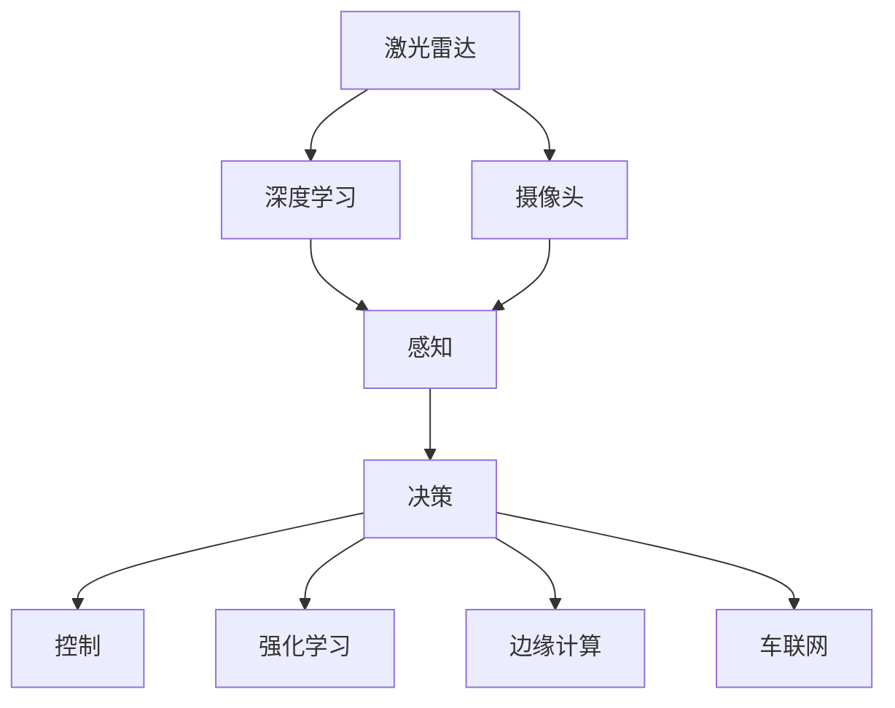

                 

## 1. 背景介绍

### 1.1 问题由来
随着全球能源结构的转型和环保意识的增强，新能源汽车产业正迎来快速发展的新机遇。然而，新能源汽车面临的最大挑战之一是自动驾驶技术。自动驾驶是实现智能出行的关键，其核心在于车辆能够自主感知周围环境、理解交通规则，并做出安全、高效的决策。硅谷作为全球创新高地，汇聚了大量科技巨头和创业公司，其在新能源汽车自动驾驶领域的技术研发和应用推广处于全球领先地位。

### 1.2 问题核心关键点
硅谷新能源汽车自动驾驶技术的核心关键点包括：

- 激光雷达与摄像头融合感知系统：通过多种传感器融合技术，实现对交通环境的高精度感知。
- 深度学习与强化学习：通过深度神经网络和强化学习算法，使车辆具备环境理解与决策能力。
- 边缘计算与通信技术：在车辆边缘进行低延时计算，实现实时决策，并通过车与车、车与路等通信技术，实现信息共享。
- 安全性与法规合规：设计多重冗余与容错机制，确保自动驾驶系统的安全性，并符合相关法规与标准。
- 大规模测试与部署：在实际道路环境中进行大规模测试，积累数据与经验，逐步推广应用。

这些关键技术相互支撑，共同构建了硅谷新能源汽车自动驾驶技术的基础框架。本文将围绕这些核心点，系统性地阐述硅谷新能源汽车自动驾驶技术的原理与实践。

## 2. 核心概念与联系

### 2.1 核心概念概述

为更好地理解硅谷新能源汽车自动驾驶技术，本节将介绍几个密切相关的核心概念：

- 自动驾驶(Autonomous Driving)：车辆能够自主完成所有驾驶任务，无需人类驾驶员介入的技术。包括感知、决策、控制等核心环节。
- 深度学习(Deep Learning)：利用多层神经网络逼近非线性函数，学习复杂数据表达。广泛应用于自动驾驶的感知与决策中。
- 强化学习(Reinforcement Learning, RL)：通过试错机制，使智能体在环境中不断学习并优化决策策略，实现智能系统的自我进化。
- 激光雷达(LiDAR)：基于激光测距的雷达技术，用于精确测量车辆周围环境的三维距离信息。
- 摄像头(Camera)：基于视觉传感器，用于捕捉道路交通环境的高分辨率图像信息。
- 边缘计算(Edge Computing)：在车辆本地进行处理与计算，实现实时决策，减轻云端计算压力。
- 车联网(V2X, Vehicle-to-Everything)：实现车辆与车辆、车辆与基础设施、车辆与云端之间的通信，提升驾驶安全与效率。

这些核心概念之间的逻辑关系可以通过以下Mermaid流程图来展示：



这个流程图展示了几项核心技术的相互关系：

1. 激光雷达和摄像头通过感知技术获得周围环境信息。
2. 感知信息输入深度学习网络，实现环境理解。
3. 强化学习用于优化决策策略，提升驾驶智能。
4. 边缘计算提升计算效率，实现实时决策。
5. 车联网实现信息共享，提升交通效率与安全。

这些技术相互结合，共同构成了硅谷新能源汽车自动驾驶技术的基本框架。通过理解这些核心概念，我们可以更好地把握自动驾驶技术的核心逻辑和优化方向。

## 3. 核心算法原理 & 具体操作步骤
### 3.1 算法原理概述

硅谷新能源汽车自动驾驶技术基于深度学习与强化学习，融合了感知、决策与控制等多个核心模块。其核心思想是：通过多传感器融合和智能算法，使车辆具备自主感知和决策能力，从而实现自动驾驶。

具体来说，自动驾驶过程包括以下几个关键步骤：

1. **环境感知**：通过激光雷达、摄像头等传感器，获取车辆周围环境的高精度数据。
2. **特征提取**：利用深度神经网络，将感知数据转化为语义特征，实现环境理解。
3. **决策制定**：结合感知信息和先验知识，通过强化学习等算法，优化决策策略。
4. **动作控制**：根据决策结果，控制车辆加速、减速、转向等动作，实现自主驾驶。

### 3.2 算法步骤详解

以下详细介绍硅谷新能源汽车自动驾驶技术的算法步骤：

**Step 1: 传感器数据融合**
- 融合激光雷达和摄像头数据，获取高精度环境地图。
- 利用多传感器数据，消除单一传感器的局限性，提升感知精度和鲁棒性。

**Step 2: 深度神经网络感知**
- 构建卷积神经网络(CNN)、循环神经网络(RNN)等深度网络模型，用于环境理解。
- 将感知数据输入网络，提取语义特征，识别道路、车辆、行人等元素。

**Step 3: 强化学习决策**
- 设计智能决策模块，利用Q-learning、策略梯度等强化学习算法，优化决策策略。
- 在虚拟环境中进行模拟训练，不断调整决策模型，提升决策性能。

**Step 4: 动作控制与反馈**
- 根据决策结果，控制车辆执行加速、减速、转向等动作。
- 引入实时反馈机制，对决策和控制效果进行评估，不断优化模型。

### 3.3 算法优缺点

硅谷新能源汽车自动驾驶技术的优点包括：

1. **高精度感知**：通过多传感器融合，实现高精度环境感知，提高驾驶安全。
2. **智能决策**：利用深度学习与强化学习，实现环境理解与决策优化。
3. **实时控制**：通过边缘计算，实现低延时决策与控制，提升驾驶效率。
4. **灵活可扩展**：算法模块化设计，便于在多种场景中快速部署与应用。

同时，该技术也存在一些局限性：

1. **高成本**：激光雷达、高分辨率摄像头等传感器成本较高，增加了部署难度。
2. **计算复杂**：深度神经网络和强化学习模型计算量大，对硬件要求较高。
3. **依赖环境**：自动驾驶依赖特定环境条件，如天气、光照等，环境适应性有待提升。
4. **伦理问题**：自动驾驶涉及复杂的伦理决策，如自动停车、避障等，需要深入研究。

尽管存在这些局限性，硅谷新能源汽车自动驾驶技术仍在不断进步，通过技术创新和应用探索，逐步解决现有问题，推动智能出行时代的到来。

### 3.4 算法应用领域

硅谷新能源汽车自动驾驶技术已经在多个领域得到应用，例如：

- **智能交通**：在智慧城市交通管理中，自动驾驶车辆实现交通流优化，提升交通效率。
- **物流配送**：在物流领域，自动驾驶货车实现无人配送，降低成本，提升效率。
- **公共交通**：在公共交通领域，自动驾驶巴士和出租车提高服务质量，缓解城市交通压力。
- **无人驾驶汽车**：在无人驾驶汽车中，自动驾驶技术实现全自动化驾驶，满足高安全性要求。

除了上述这些经典应用外，自动驾驶技术还在无人驾驶无人机、无人驾驶船等新兴领域展开探索，为智能出行带来更多可能性。

## 4. 数学模型和公式 & 详细讲解
### 4.1 数学模型构建

硅谷新能源汽车自动驾驶技术的数学模型主要基于深度学习与强化学习，涉及神经网络、回归模型、策略优化等多个数学框架。

### 4.2 公式推导过程

以感知模块为例，其数学模型可表示为：

$$
\mathbf{F} = \mathbf{W} \mathbf{I} + \mathbf{b}
$$

其中，$\mathbf{F}$ 为感知结果，$\mathbf{I}$ 为输入数据，$\mathbf{W}$ 和 $\mathbf{b}$ 分别为权重和偏置。

在深度学习中，通常使用反向传播算法计算损失函数：

$$
\mathcal{L} = \frac{1}{N} \sum_{i=1}^N (y_i - \hat{y}_i)^2
$$

其中 $y_i$ 为真实标签，$\hat{y}_i$ 为模型预测结果，$N$ 为样本数量。

### 4.3 案例分析与讲解

以深度学习网络感知模块为例，具体分析其工作原理：

1. **输入数据**：激光雷达与摄像头采集的高精度环境数据，包括距离、角度、亮度等信息。
2. **网络结构**：卷积神经网络(CNN)和循环神经网络(RNN)等深度网络结构，用于特征提取与环境理解。
3. **模型训练**：使用反向传播算法优化网络参数，最小化损失函数，提升模型准确性。
4. **输出结果**：生成车辆周围环境的高分辨率语义地图，标注道路、车辆、行人等元素。

## 5. 项目实践：代码实例和详细解释说明
### 5.1 开发环境搭建

在进行硅谷新能源汽车自动驾驶项目实践前，我们需要准备好开发环境。以下是使用Python进行PyTorch开发的环境配置流程：

1. 安装Anaconda：从官网下载并安装Anaconda，用于创建独立的Python环境。

2. 创建并激活虚拟环境：
```bash
conda create -n pytorch-env python=3.8 
conda activate pytorch-env
```

3. 安装PyTorch：根据CUDA版本，从官网获取对应的安装命令。例如：
```bash
conda install pytorch torchvision torchaudio cudatoolkit=11.1 -c pytorch -c conda-forge
```

4. 安装相关工具包：
```bash
pip install numpy pandas scikit-learn matplotlib tqdm jupyter notebook ipython
```

5. 安装激光雷达和摄像头模拟软件：如Simulink、CARLA等，用于仿真测试。

完成上述步骤后，即可在`pytorch-env`环境中开始自动驾驶项目实践。

### 5.2 源代码详细实现

下面以一个简单的自动驾驶感知模块为例，给出使用PyTorch进行深度学习模型训练的代码实现。

首先，定义感知模型：

```python
import torch
import torch.nn as nn
import torch.optim as optim

class PerceptionModule(nn.Module):
    def __init__(self, num_classes):
        super(PerceptionModule, self).__init__()
        self.conv1 = nn.Conv2d(in_channels=1, out_channels=32, kernel_size=3, stride=1, padding=1)
        self.relu1 = nn.ReLU()
        self.conv2 = nn.Conv2d(in_channels=32, out_channels=64, kernel_size=3, stride=1, padding=1)
        self.relu2 = nn.ReLU()
        self.fc = nn.Linear(in_features=64*28*28, out_features=num_classes)
    
    def forward(self, x):
        x = self.conv1(x)
        x = self.relu1(x)
        x = self.conv2(x)
        x = self.relu2(x)
        x = x.view(x.size(0), -1)
        x = self.fc(x)
        return x
```

然后，定义训练与评估函数：

```python
from torch.utils.data import DataLoader
from tqdm import tqdm

class PerceptionDataset(torch.utils.data.Dataset):
    def __init__(self, data):
        self.data = data
    
    def __getitem__(self, index):
        x = self.data[index]
        return x
    
    def __len__(self):
        return len(self.data)

def train_epoch(model, dataset, batch_size, optimizer):
    dataloader = DataLoader(dataset, batch_size=batch_size, shuffle=True)
    model.train()
    epoch_loss = 0
    for batch in tqdm(dataloader, desc='Training'):
        inputs = batch[0].to(device)
        targets = batch[1].to(device)
        model.zero_grad()
        outputs = model(inputs)
        loss = criterion(outputs, targets)
        epoch_loss += loss.item()
        loss.backward()
        optimizer.step()
    return epoch_loss / len(dataloader)

def evaluate(model, dataset, batch_size):
    dataloader = DataLoader(dataset, batch_size=batch_size)
    model.eval()
    preds, labels = [], []
    with torch.no_grad():
        for batch in tqdm(dataloader, desc='Evaluating'):
            inputs = batch[0].to(device)
            targets = batch[1].to(device)
            outputs = model(inputs)
            preds.append(outputs)
            labels.append(targets)
        
    print(classification_report(labels, preds))
```

最后，启动训练流程并在测试集上评估：

```python
epochs = 5
batch_size = 16

device = torch.device('cuda') if torch.cuda.is_available() else torch.device('cpu')

model = PerceptionModule(num_classes=10).to(device)
optimizer = optim.SGD(model.parameters(), lr=0.01, momentum=0.9)
criterion = nn.CrossEntropyLoss()

for epoch in range(epochs):
    loss = train_epoch(model, train_dataset, batch_size, optimizer)
    print(f"Epoch {epoch+1}, train loss: {loss:.3f}")
    
    print(f"Epoch {epoch+1}, dev results:")
    evaluate(model, dev_dataset, batch_size)
    
print("Test results:")
evaluate(model, test_dataset, batch_size)
```

以上就是使用PyTorch对感知模块进行深度学习模型训练的完整代码实现。可以看到，得益于PyTorch的强大封装，我们可以用相对简洁的代码完成感知模型的训练。

### 5.3 代码解读与分析

让我们再详细解读一下关键代码的实现细节：

**PerceptionModule类**：
- `__init__`方法：初始化感知模型的网络结构。
- `forward`方法：前向传播计算模型输出。

**train_epoch函数**：
- 使用DataLoader对数据集进行批次化加载，供模型训练使用。
- 在每个批次上前向传播计算损失函数并反向传播更新模型参数。

**evaluate函数**：
- 与训练类似，不同点在于不更新模型参数，并在每个batch结束后将预测和标签结果存储下来。

**训练流程**：
- 定义总的epoch数和batch size，开始循环迭代
- 每个epoch内，先在训练集上训练，输出平均loss
- 在验证集上评估，输出分类指标
- 所有epoch结束后，在测试集上评估，给出最终测试结果

可以看到，PyTorch配合深度学习库使得感知模块的训练代码实现变得简洁高效。开发者可以将更多精力放在数据处理、模型改进等高层逻辑上，而不必过多关注底层的实现细节。

当然，工业级的系统实现还需考虑更多因素，如模型的保存和部署、超参数的自动搜索、更灵活的任务适配层等。但核心的自动驾驶感知模块基本与此类似。

## 6. 实际应用场景
### 6.1 智能交通

硅谷新能源汽车自动驾驶技术在智能交通领域有着广泛的应用前景。智能交通系统通过自动驾驶车辆实现车辆与交通基础设施之间的无缝协同，提升交通效率，减少交通拥堵。

具体而言，自动驾驶车辆可以在交通管理中心的指挥下，自主调整行驶路径，避免拥堵区域，提升整体交通流。在发生交通事故等突发事件时，自动驾驶车辆能够及时响应，减少事故影响，提升应急响应效率。

### 6.2 物流配送

在物流配送领域，自动驾驶货车可以实现无人化配送，提升配送效率，降低成本。自动驾驶货车能够全天候、全天时运行，不受人工驾驶疲劳和交通高峰期的影响，大幅提升配送速度。

通过自动驾驶技术，物流公司可以实现精细化的物流规划，提高配送线路的优化和配送效率。自动驾驶技术还可以与仓储系统、订单管理系统等进行无缝集成，实现全程无人工干预的智能配送。

### 6.3 公共交通

自动驾驶巴士和出租车在公共交通领域有着巨大的应用潜力。自动驾驶车辆可以24小时运行，提升公共交通的覆盖率和便利性。同时，自动驾驶技术可以减少交通事故，提升公共交通的安全性和稳定性。

自动驾驶巴士和出租车可以通过智能调度系统实现高效的车辆调度和路线规划，提升公共交通的运营效率。同时，自动驾驶技术还可以与交通监测系统、实时信息发布系统等集成，提供更智能的公共交通服务。

### 6.4 无人驾驶汽车

在无人驾驶汽车领域，硅谷新能源汽车自动驾驶技术已经取得了显著进展。无人驾驶汽车可以实现全自动化驾驶，满足高安全性要求，适合长途运输、城市交通、旅游观光等多种场景。

无人驾驶汽车可以通过激光雷达、摄像头等传感器实现高精度环境感知，结合深度学习与强化学习算法，进行智能决策和控制。同时，无人驾驶汽车还可以与其他智能车辆、交通基础设施等进行通信，实现车联网的协同驾驶，提升道路交通效率和安全。

### 6.5 未来应用展望

随着硅谷新能源汽车自动驾驶技术的不断发展，其应用场景将不断扩展，为智能出行带来更多可能性：

- **自动驾驶无人机**：在物流、农业、测绘等领域，自动驾驶无人机可以实现自主飞行和任务执行，提升作业效率和安全性。
- **自动驾驶船**：在港口、海洋等领域，自动驾驶船可以实现无人化运输和监测，提升运输效率和环境监测能力。
- **智能机器人**：在家庭、医院、教育等领域，自动驾驶机器人可以实现无人化的服务与辅助，提升生活质量和服务水平。
- **城市智能管理**：在智慧城市管理中，自动驾驶技术可以实现交通流优化、环境监测、应急响应等多种智能应用，提升城市运行效率和安全性。

未来，硅谷新能源汽车自动驾驶技术将与更多新兴技术融合，如5G通信、物联网、区块链等，构建更加智能、便捷、安全的智能出行生态系统。

## 7. 工具和资源推荐
### 7.1 学习资源推荐

为了帮助开发者系统掌握硅谷新能源汽车自动驾驶技术的理论基础和实践技巧，这里推荐一些优质的学习资源：

1. **《自动驾驶深度学习》系列书籍**：由深度学习专家撰写，全面介绍了自动驾驶的感知、决策、控制等核心技术，并提供了丰富的代码实例。

2. **《强化学习基础》课程**：斯坦福大学开设的强化学习入门课程，介绍了强化学习的基本原理和算法，提供了大量实验与案例。

3. **Simulink与CARLA**：激光雷达和摄像头模拟软件，用于仿真测试自动驾驶模型，提供高质量的感知数据。

4. **OpenAI Gym**：强化学习算法实验平台，提供丰富的环境和算法库，方便进行强化学习实验。

5. **ROS与Gazebo**：自动驾驶系统的开源平台，提供机器人仿真和实时控制工具，方便进行系统开发和测试。

通过对这些资源的学习实践，相信你一定能够快速掌握硅谷新能源汽车自动驾驶技术的精髓，并用于解决实际的自动驾驶问题。

### 7.2 开发工具推荐

高效的开发离不开优秀的工具支持。以下是几款用于硅谷新能源汽车自动驾驶开发的常用工具：

1. **PyTorch**：基于Python的开源深度学习框架，灵活动态的计算图，适合快速迭代研究。适用于深度学习模型的开发和训练。

2. **TensorFlow**：由Google主导开发的开源深度学习框架，生产部署方便，适合大规模工程应用。适用于复杂计算图和分布式训练的开发。

3. **Simulink**：MATLAB下的仿真软件，用于自动驾驶系统的仿真测试和模型验证。

4. **CARLA**：自动驾驶模拟器，提供逼真的虚拟交通环境，方便进行自动驾驶系统的测试与优化。

5. **ROS**：机器人操作系统，提供统一的通信协议和开发平台，方便进行自动驾驶系统的集成和测试。

6. **Gazebo**：机器人仿真软件，提供多物理引擎和逼真的场景建模，适合进行自动驾驶系统的仿真测试。

合理利用这些工具，可以显著提升硅谷新能源汽车自动驾驶项目的开发效率，加快创新迭代的步伐。

### 7.3 相关论文推荐

硅谷新能源汽车自动驾驶技术的发展源于学界的持续研究。以下是几篇奠基性的相关论文，推荐阅读：

1. **"Deep Driving: Vision-Based Extraction of Road Users in Self-Driving Cars"**：提出基于卷积神经网络的自动驾驶感知技术，开创了自动驾驶感知的新范式。

2. **"Playing Atari with Real-Time Neural Networks"**：展示了深度神经网络在自动驾驶决策中的应用，证明了自动驾驶技术的可行性。

3. **"End-to-End Training for Self-Driving Cars with Deep Q-Networks"**：结合深度强化学习算法，实现了端到端的自动驾驶决策，推动了自动驾驶技术的实用化。

4. **"High-Dynamic-Range LIDAR for Intelligent Road Vehicle Applications"**：介绍了激光雷达在自动驾驶中的高精度环境感知技术，提升了自动驾驶系统的可靠性。

5. **"Real-time 3D Scene Understanding from a Single Camera"**：结合深度神经网络和摄像头传感器，实现了高精度环境理解，推动了自动驾驶技术的普及。

这些论文代表了大规模自动驾驶技术的发展脉络。通过学习这些前沿成果，可以帮助研究者把握学科前进方向，激发更多的创新灵感。

## 8. 总结：未来发展趋势与挑战

### 8.1 总结

本文对硅谷新能源汽车自动驾驶技术进行了全面系统的介绍。首先阐述了自动驾驶技术的研究背景和意义，明确了自动驾驶在智能出行新时代中的重要地位。其次，从原理到实践，详细讲解了硅谷新能源汽车自动驾驶技术的数学模型和关键步骤，给出了自动驾驶系统开发的完整代码实例。同时，本文还广泛探讨了自动驾驶技术在智能交通、物流配送、公共交通等领域的实际应用前景，展示了自动驾驶技术的巨大潜力。此外，本文精选了自动驾驶技术的各类学习资源，力求为读者提供全方位的技术指引。

通过本文的系统梳理，可以看到，硅谷新能源汽车自动驾驶技术正在成为智能出行时代的重要基石，极大地拓展了智能交通系统的应用边界，推动了智能出行模式的变革。受益于激光雷达、深度学习、强化学习等技术的不断发展，自动驾驶系统将具备更加强大的感知与决策能力，逐步实现更安全、更高效、更便捷的智能出行。

### 8.2 未来发展趋势

展望未来，硅谷新能源汽车自动驾驶技术将呈现以下几个发展趋势：

1. **高精度感知**：通过多传感器融合与深度学习，提升感知精度和鲁棒性，确保自动驾驶系统的安全性。
2. **智能决策**：利用深度学习与强化学习，提升决策模型的准确性和鲁棒性，实现更高效的自动驾驶。
3. **实时控制**：通过边缘计算和车联网技术，实现低延时决策与控制，提升自动驾驶的实时性和可靠性。
4. **环境适应**：提升自动驾驶技术的环境适应性，应对复杂的道路条件和天气变化，确保在不同环境下的稳定运行。
5. **多模态融合**：将激光雷达、摄像头、雷达等传感器进行多模态融合，提升感知与决策的综合能力，实现更全面的智能驾驶。
6. **伦理与安全**：引入伦理导向的评估指标，保障自动驾驶系统的安全性与合规性，避免伦理问题带来的风险。

这些趋势凸显了硅谷新能源汽车自动驾驶技术的广阔前景。这些方向的探索发展，必将进一步提升自动驾驶系统的性能和应用范围，为智能出行时代带来新的突破。

### 8.3 面临的挑战

尽管硅谷新能源汽车自动驾驶技术已经取得了显著进展，但在迈向更加智能化、普适化应用的过程中，仍面临诸多挑战：

1. **感知精度**：高精度感知是自动驾驶的基础，激光雷达、摄像头等传感器的成本和精度限制了感知系统的普及。需要进一步降低传感器成本，提升感知精度。
2. **计算资源**：深度神经网络和强化学习算法计算量大，对硬件资源要求较高。需要进一步优化算法，提升计算效率，降低硬件成本。
3. **环境适应性**：自动驾驶系统需要在不同环境和气候条件下稳定运行，环境适应性仍有待提升。
4. **伦理与安全性**：自动驾驶系统面临复杂的伦理决策问题，需要引入伦理导向的评估指标，确保系统安全性与合规性。
5. **法规与标准**：自动驾驶系统需要符合相关法规与标准，避免法律风险。需要进一步推动法律法规的完善与标准化。

### 8.4 研究展望

面对硅谷新能源汽车自动驾驶技术所面临的挑战，未来的研究需要在以下几个方面寻求新的突破：

1. **高精度感知**：进一步降低激光雷达、摄像头等传感器的成本，提升感知精度和鲁棒性。
2. **智能决策**：结合深度学习与强化学习，优化决策模型的准确性和鲁棒性，实现更高效的自动驾驶。
3. **实时控制**：通过边缘计算和车联网技术，提升计算效率，实现低延时决策与控制。
4. **环境适应**：增强自动驾驶系统的环境适应性，应对复杂的道路条件和天气变化，确保在不同环境下的稳定运行。
5. **多模态融合**：将激光雷达、摄像头、雷达等传感器进行多模态融合，提升感知与决策的综合能力。
6. **伦理与安全性**：引入伦理导向的评估指标，保障自动驾驶系统的安全性与合规性，避免伦理问题带来的风险。

这些研究方向的探索，必将引领硅谷新能源汽车自动驾驶技术迈向更高的台阶，为智能出行时代带来新的突破。面向未来，自动驾驶技术还需要与其他人工智能技术进行更深入的融合，如知识表示、因果推理、强化学习等，多路径协同发力，共同推动智能出行系统的进步。

## 9. 附录：常见问题与解答

**Q1：自动驾驶技术能否完全替代人类驾驶？**

A: 目前，自动驾驶技术还不能完全替代人类驾驶。尽管自动驾驶技术在某些特定场景下表现出色，但在复杂的城市交通环境中，仍需要人工驾驶的辅助和监督。自动驾驶技术需要不断迭代优化，提升系统鲁棒性和安全性，才能逐步替代人类驾驶。

**Q2：自动驾驶技术面临的最大挑战是什么？**

A: 自动驾驶技术面临的最大挑战是环境适应性和安全性。自动驾驶系统需要在各种复杂环境中稳定运行，应对各种突发事件，确保安全可靠。同时，自动驾驶系统还需要解决伦理决策问题，避免出现伦理冲突。

**Q3：自动驾驶技术的未来发展方向是什么？**

A: 自动驾驶技术的未来发展方向包括高精度感知、智能决策、实时控制、环境适应性、多模态融合、伦理与安全性等多个方面。未来，自动驾驶技术将与更多新兴技术融合，如5G通信、物联网、区块链等，构建更加智能、便捷、安全的智能出行生态系统。

**Q4：自动驾驶技术在实际应用中需要注意哪些问题？**

A: 自动驾驶技术在实际应用中需要注意以下问题：
1. 高精度感知：确保传感器的高精度和鲁棒性，避免感知误差。
2. 智能决策：优化决策模型的准确性和鲁棒性，避免决策失误。
3. 实时控制：提升计算效率，实现低延时决策与控制，确保实时性。
4. 环境适应性：应对复杂的道路条件和天气变化，确保在不同环境下的稳定运行。
5. 伦理与安全：引入伦理导向的评估指标，确保系统安全性与合规性，避免伦理问题带来的风险。

这些问题的解决需要技术、法律、伦理等多方面的协同推进，才能实现自动驾驶技术的全面普及和应用。

**Q5：自动驾驶技术的商业化前景如何？**

A: 自动驾驶技术具备广阔的商业化前景，在智能交通、物流配送、公共交通等领域具有广泛的应用价值。随着技术的不断进步和应用场景的拓展，自动驾驶技术的商业化进程将不断加速，成为推动智能出行时代的重要力量。

综上所述，硅谷新能源汽车自动驾驶技术正在成为智能出行新时代的重要基石。通过不断技术创新和应用探索，未来必将实现更安全、更高效、更便捷的智能出行，推动人类社会的持续进步和发展。

