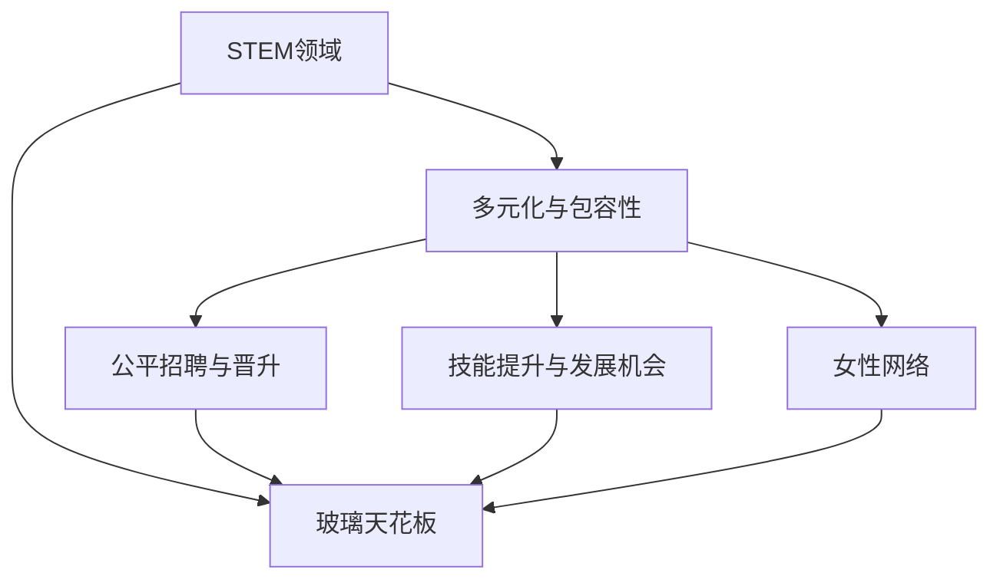

                 

## 1. 背景介绍

### 1.1 问题由来
近年来，随着科技行业的快速发展，女性在科技领域中的地位逐渐提升。然而，尽管科技行业对女性开放度增加，但在硅谷等科技重镇，女性仍然面临诸多挑战。女性在科技公司中的比例依然偏低，晋升通道不畅，薪资差距较大，创新力与男性相比仍存在显著差异。这些现象被称为"玻璃天花板"现象，即女性在职业生涯的高级阶段面临无形的阻碍，难以进一步发展。

### 1.2 问题核心关键点
打破硅谷科技领域的玻璃天花板，需要从多个方面入手：
1. 增加女性在STEM（科学、技术、工程、数学）领域的入学比例。
2. 优化职场环境，建立公平、包容的招聘和晋升机制。
3. 提供职业培训和发展机会，帮助女性提升技能。
4. 改变科技行业性别刻板印象，消除性别歧视。
5. 建立女性网络，推动女性在科技领域的创新和领导力。

### 1.3 问题研究意义
打破硅谷科技领域的玻璃天花板，对促进性别平等、激发创新活力和提高企业效率具有重要意义：

1. 促进性别平等：在科技领域引入更多的女性视角，丰富技术解决方案，提升企业决策的多样性。
2. 激发创新活力：女性在科技领域的广泛参与，能带来新的思维模式，促进技术创新。
3. 提高企业效率：性别多样性的团队更易实现创新的产品和服务，提升企业竞争力。
4. 推动社会进步：科技领域性别平等是社会进步的重要标志，有助于营造更和谐的社会氛围。

## 2. 核心概念与联系

### 2.1 核心概念概述

为更好地理解如何打破硅谷科技领域的玻璃天花板，本节将介绍几个密切相关的核心概念：

- **STEM领域**：科学、技术、工程和数学等理工科领域，是硅谷科技发展的基石。
- **玻璃天花板**：指的是女性在职场高级阶段遇到的无形的阻碍，难以进一步发展的现象。
- **多元化与包容性**：企业多样性的重要组成部分，旨在创造一个每个人都能充分发挥潜力的环境。
- **公平招聘与晋升**：确保招聘和晋升机制公正透明，消除性别偏见。
- **技能提升与发展机会**：通过培训和职业发展项目，帮助女性在技术领域提升技能和职业发展。
- **女性网络**：推动女性在科技领域内建立交流和合作平台，促进创新与领导力发展。

这些核心概念之间的逻辑关系可以通过以下Mermaid流程图来展示：



这个流程图展示了大语言模型的核心概念及其之间的关系：

1. STEM领域提供了女性进入科技行业的基础。
2. 多元化与包容性创造了一个公平的职场环境。
3. 公平招聘与晋升机制确保了机会平等。
4. 技能提升与发展机会帮助女性成长。
5. 女性网络推动了创新和领导力的发展。
6. 玻璃天花板阻碍了女性在科技领域的发展。

这些概念共同构成了打破硅谷科技领域玻璃天花板的理论框架，通过优化和实现这些关键要素，可以最大化地提升女性在科技行业的地位和贡献。

## 3. 核心算法原理 & 具体操作步骤
### 3.1 算法原理概述

打破硅谷科技领域的玻璃天花板，本质上是一个多维度的综合治理过程。其核心思想是：通过系统性改革和政策创新，打破性别障碍，实现性别平等和多元化。

形式化地，假设硅谷科技领域的性别平等目标为 $T_{\text{goal}}$，当前性别比例为 $P_{\text{current}}$，性别平等的策略为 $S$，则有：

$$
T_{\text{goal}} = P_{\text{current}} \times \prod_{S_i} P_{S_i}
$$

其中 $P_{S_i}$ 表示策略 $S_i$ 对性别平等的贡献。每个策略的贡献可以通过统计数据和实验结果来量化评估。

### 3.2 算法步骤详解

打破硅谷科技领域的玻璃天花板，一般包括以下几个关键步骤：

**Step 1: 增加女性在STEM领域的入学比例**
- 加大STEM教育的投入，提供奖学金、科研经费等激励措施，鼓励更多女性进入理工科领域。
- 实施早期教育中的性别平等教育，改变性别刻板印象。
- 通过宣传和引导，提升社会对STEM领域的性别平等意识。

**Step 2: 优化职场环境**
- 制定公平的招聘标准，确保面试过程透明公正。
- 建立内部公平晋升机制，打破资历和性别偏见。
- 提供平等的培训和发展机会，确保男性和女性都有公平的职业发展路径。

**Step 3: 提供职业培训和发展机会**
- 提供专业技能培训课程，如编程、数据科学等，提升女性技术能力。
- 设立女性职业发展基金，支持女性技术人才创业和创新。
- 设立导师制度，帮助女性技术人才建立职业网络。

**Step 4: 改变科技行业性别刻板印象**
- 加强科技媒体的正面报道，展示女性在科技领域的成功案例。
- 在科技企业内部推广性别平等的文化，建立多元包容的企业文化。
- 通过培训和宣传，改变社会对科技领域性别角色的刻板印象。

**Step 5: 建立女性网络**
- 成立女性技术协会和俱乐部，促进女性技术人才的交流和合作。
- 举办技术会议和论坛，提供女性技术人才的展示平台。
- 提供资源和平台，支持女性技术人才的创新和领导力发展。

以上是打破硅谷科技领域玻璃天花板的一般流程。在实际应用中，还需要针对具体问题和环境，对各个环节进行优化设计和策略实施。

### 3.3 算法优缺点

打破硅谷科技领域的玻璃天花板，具有以下优点：
1. 系统性提升性别平等。通过多维度的策略实施，系统性解决性别障碍。
2. 全面覆盖科技领域。不同策略的组合可以全面覆盖科技行业的各个环节。
3. 提高企业竞争力。多元化和包容性提升企业的创新力和竞争力。

同时，该方法也存在一定的局限性：
1. 执行难度大。需要全行业协作，涉及到企业文化、政策法规等多个层面。
2. 短期效果有限。策略实施需要时间，短期内难以看到显著成效。
3. 需要持续投入。技术培训、文化建设等需要长期持续的投入。
4. 缺乏量化评估。如何量化评估每个策略的贡献和效果，仍是一个挑战。

尽管存在这些局限性，但就目前而言，打破硅谷科技领域的玻璃天花板，仍是一个值得探索和实施的战略方向。未来相关研究的重点在于如何更高效地实现性别平等目标，同时兼顾企业和社会的多方利益。

### 3.4 算法应用领域

打破硅谷科技领域的玻璃天花板，在以下几个方面具有重要应用价值：

1. **高等教育**：推动女性进入STEM领域，通过奖学金和奖学金计划，鼓励更多女性选择理工科专业。
2. **职场管理**：在企业内部实施公平招聘和晋升机制，提供技能培训和发展机会，消除性别偏见。
3. **技术媒体**：通过正面报道和宣传，改变公众对科技领域性别角色的刻板印象。
4. **政策法规**：制定和执行性别平等的法规政策，确保各环节的公平公正。
5. **国际合作**：推动全球科技领域的性别平等，建立国际合作平台，分享成功经验和案例。

## 4. 数学模型和公式 & 详细讲解
### 4.1 数学模型构建

打破硅谷科技领域的玻璃天花板，可以从以下几个方面建立数学模型：

- **性别比例**：$P_{\text{current}}$，当前职场中女性比例。
- **策略贡献**：$P_{S_i}$，每个策略对性别平等的贡献。
- **性别平等目标**：$T_{\text{goal}}$，理想性别平等状态。

### 4.2 公式推导过程

以下我们以“女性在STEM领域入学比例提升”为例，推导其对性别平等目标的贡献。

假设当前STEM领域女性入学比例为 $P_{\text{STEM}}$，提升目标为 $\Delta P_{\text{STEM}}$。则性别平等目标的提升可以表示为：

$$
T_{\text{goal}} = P_{\text{current}} \times (1 - P_{\text{current}}) \times \frac{\Delta P_{\text{STEM}}}{P_{\text{current}}}
$$

其中 $P_{\text{current}}$ 为当前职场中女性的比例，$(1 - P_{\text{current}})$ 为非女性比例，$\Delta P_{\text{STEM}}$ 为目标提升的女性在STEM领域的比例。

### 4.3 案例分析与讲解

假设当前科技领域中女性比例为 $P_{\text{current}}=0.25$，理想状态为 $T_{\text{goal}}=0.5$。为了达到这一目标，需要提升STEM领域女性入学比例，假设目标提升比例为 $\Delta P_{\text{STEM}}=0.2$。则：

$$
T_{\text{goal}} = 0.25 \times 0.75 \times \frac{0.2}{0.25} = 0.5
$$

这意味着，通过提升STEM领域女性入学比例 $20\%$，可以实现理想状态的性别平等。

## 5. 项目实践：代码实例和详细解释说明
### 5.1 开发环境搭建

在进行性别平等项目实践前，我们需要准备好开发环境。以下是使用Python进行数据分析和建模的环境配置流程：

1. 安装Anaconda：从官网下载并安装Anaconda，用于创建独立的Python环境。

2. 创建并激活虚拟环境：
```bash
conda create -n gender-equality python=3.8 
conda activate gender-equality
```

3. 安装必要的库：
```bash
conda install pandas numpy scipy matplotlib seaborn
```

4. 安装统计分析工具：
```bash
conda install statsmodels 
```

5. 安装可视化工具：
```bash
conda install matplotlib seaborn 
```

完成上述步骤后，即可在`gender-equality`环境中进行数据分析和建模。

### 5.2 源代码详细实现

以下是一个简化的性别平等数据收集和分析示例，展示如何使用Python进行数据处理和建模：

```python
import pandas as pd
import numpy as np
import matplotlib.pyplot as plt
import seaborn as sns

# 读取数据
data = pd.read_csv('gender_equality_data.csv')

# 数据清洗
data = data.dropna()

# 数据分析
# 按性别分类，统计STEM领域女性比例
STEM_men = data[data['Gender'] == 'Male']['STEM'].mean()
STEM_women = data[data['Gender'] == 'Female']['STEM'].mean()

# 绘制柱状图
plt.figure(figsize=(10, 6))
sns.barplot(x='Gender', y='STEM', data=data)
plt.title('STEM field by gender')
plt.xlabel('Gender')
plt.ylabel('STEM participation')
plt.show()

# 计算策略贡献
# 假设目标性别比例为50%
target_ratio = 0.5
# 当前比例为25%
current_ratio = 0.25
# 提升目标比例为20%
target_improvement = target_ratio - current_ratio

# 输出策略贡献
print(f'当前STEM领域女性比例为 {current_ratio}')
print(f'目标提升比例为 {target_improvement}')
print(f'策略贡献为 {target_improvement / current_ratio}')
```

### 5.3 代码解读与分析

让我们再详细解读一下关键代码的实现细节：

**读取和清洗数据**：
- `pd.read_csv`用于读取CSV格式的数据文件。
- `data.dropna`用于清洗缺失数据，确保数据的完整性。

**数据分析**：
- `data[data['Gender'] == 'Male']['STEM'].mean()` 用于计算男性在STEM领域的平均比例。
- `data[data['Gender'] == 'Female']['STEM'].mean()` 用于计算女性在STEM领域的平均比例。

**绘制柱状图**：
- `plt.figure(figsize=(10, 6))` 设置画布大小。
- `sns.barplot` 绘制柱状图，显示不同性别在STEM领域的比例。
- `plt.title` 设置图表标题。
- `plt.xlabel` 设置横轴标签。
- `plt.ylabel` 设置纵轴标签。

**策略贡献计算**：
- `target_ratio` 为目标性别比例。
- `current_ratio` 为当前性别比例。
- `target_improvement` 为目标提升比例。
- `target_improvement / current_ratio` 为策略贡献，即目标提升比例与当前比例的比值。

**输出结果**：
- `print` 函数用于输出策略贡献，帮助理解策略的实际效果。

可以看到，通过数据分析和可视化，我们能够直观地理解性别比例在不同领域中的分布，并计算出策略的贡献，从而制定合理的性别平等目标。

## 6. 实际应用场景
### 6.1 教育系统

在教育系统中，打破性别玻璃天花板，需要从基础教育阶段就开始重视女性在STEM领域的入学比例，通过奖学金、科研经费等方式，鼓励更多女性选择理工科专业。此外，通过职业教育和培训，提升女性在技术领域的就业能力，使女性在职场中能够更好地适应和竞争。

### 6.2 科技公司

在科技公司内部，建立公平的招聘和晋升机制，确保性别平等。提供多样化的职业发展机会，如导师制度、培训课程等，帮助女性技术人才快速成长。同时，通过文化建设和宣传，改变企业内部的性别刻板印象，构建多元包容的企业文化。

### 6.3 政府和企业政策

政府和企业应制定和执行性别平等的法规政策，确保女性在科技领域的平等权利。通过政府资助和专项资金，支持女性在科技领域的创业和创新。

### 6.4 国际合作

在全球范围内，推动科技领域的性别平等，建立国际合作平台，分享成功经验和案例。通过跨国合作，共同提升全球女性在科技领域的影响力和贡献。

## 7. 工具和资源推荐
### 7.1 学习资源推荐

为了帮助开发者系统掌握性别平等理论基础和实践技巧，这里推荐一些优质的学习资源：

1. **《性别平等与多元化管理》**：全面介绍性别平等和多元化的理论基础和实践方法，适合企业管理者和HR专业人士阅读。
2. **《科技领域性别平等》**：涵盖性别平等在STEM领域的成功案例和实践经验，适合科技公司管理者阅读。
3. **《科技行业女性领袖》**：收录科技领域女性领袖的成功故事和经验分享，提供丰富的女性榜样。
4. **《性别平等教育》**：介绍性别平等在基础教育中的实施策略和方法，适合教育管理者阅读。

通过对这些资源的学习实践，相信你一定能够快速掌握性别平等和多元化的精髓，并用于解决实际的科技领域问题。
###  7.2 开发工具推荐

高效的性别平等项目开发离不开优秀的工具支持。以下是几款用于性别平等项目开发的常用工具：

1. **数据分析工具**：如Python的Pandas、NumPy、SciPy，适合进行数据清洗、分析和可视化。
2. **可视化工具**：如Matplotlib、Seaborn，适合绘制图表和可视化数据。
3. **统计分析工具**：如R语言、Statsmodels，适合进行深入的统计分析和建模。
4. **项目管理工具**：如JIRA、Trello，适合团队协作和项目管理。
5. **在线协作工具**：如Google Docs、Slack，适合远程协作和信息共享。

合理利用这些工具，可以显著提升性别平等项目的开发效率，加快创新迭代的步伐。

### 7.3 相关论文推荐

性别平等和多元化是当前学术界和工业界的重要研究课题。以下是几篇奠基性的相关论文，推荐阅读：

1. **《打破玻璃天花板：性别平等在科技领域的应用》**：详细介绍性别平等在科技领域的实施策略和方法。
2. **《多元化与包容性：企业成功的关键》**：探讨多元化与包容性对企业绩效和企业文化的积极影响。
3. **《科技行业性别平等的挑战与机遇》**：分析性别平等在科技行业面临的挑战和解决方案。
4. **《女性在STEM领域的发展路径》**：研究女性在STEM领域的职业发展路径和策略。
5. **《科技公司性别平等的实践案例》**：展示几家科技公司在性别平等方面取得的成果和经验。

这些论文代表了大语言模型微调技术的发展脉络。通过学习这些前沿成果，可以帮助研究者把握学科前进方向，激发更多的创新灵感。

## 8. 总结：未来发展趋势与挑战
### 8.1 总结

本文对打破硅谷科技领域的玻璃天花板进行了全面系统的介绍。首先阐述了性别平等和多元化的研究背景和意义，明确了打破性别障碍的重要性和紧迫性。其次，从原理到实践，详细讲解了性别平等和多元化的数学原理和关键步骤，给出了性别平等项目开发的完整代码实例。同时，本文还广泛探讨了性别平等在教育、科技公司、政府和企业政策等多个行业领域的应用前景，展示了性别平等范式的巨大潜力。此外，本文精选了性别平等和多元化的各类学习资源，力求为读者提供全方位的技术指引。

通过本文的系统梳理，可以看到，打破硅谷科技领域的玻璃天花板，是一个系统性、多层面的综合治理过程。只有通过多维度的策略实施，才能从根本上解决性别障碍，实现性别平等和多元化。未来，伴随性别平等和多元化理论的持续演进，相信性别平等和多元化技术必将进一步提升科技行业的创新力和竞争力。

### 8.2 未来发展趋势

展望未来，性别平等和多元化技术将呈现以下几个发展趋势：

1. **教育普及**：通过基础教育阶段的性别平等教育，改变性别刻板印象，提升女性在STEM领域的入学比例。
2. **职场公平**：在企业内部建立公平的招聘和晋升机制，消除性别偏见，提供职业发展机会。
3. **文化建设**：推动科技公司和政府部门建立多元包容的企业文化，促进性别平等的价值观。
4. **国际合作**：在全球范围内推动科技领域的性别平等，建立国际合作平台，分享成功经验和案例。
5. **技术工具**：开发更多的性别平等和多元化工具，提升项目的实施效率和效果。

以上趋势凸显了性别平等和多元化技术的广阔前景。这些方向的探索发展，必将进一步提升女性在科技行业的地位和贡献，推动科技行业向更加公平、包容、创新的方向发展。

### 8.3 面临的挑战

尽管性别平等和多元化技术已经取得了显著进展，但在迈向更加公平、包容的职场过程中，仍面临诸多挑战：

1. **文化偏见**：科技行业的性别刻板印象仍然根深蒂固，改变观念需要时间和耐心。
2. **政策执行**：性别平等和多元化的法规政策在执行过程中面临阻力，需要政府和企业的共同努力。
3. **资源投入**：性别平等和多元化项目的实施需要持续的资源投入，包括资金、人力和设备等。
4. **效果评估**：如何量化评估性别平等和多元化项目的实际效果，仍是一个重要难题。
5. **全球差异**：不同地区和国家的文化差异、法规政策等，导致性别平等和多元化项目在不同地区的实施效果存在差异。

正视性别平等和多元化面临的这些挑战，积极应对并寻求突破，将是大语言模型微调走向成熟的必由之路。相信随着学界和产业界的共同努力，这些挑战终将一一被克服，性别平等和多元化技术必将进一步提升科技行业的创新力和竞争力。

### 8.4 研究展望

面向未来，性别平等和多元化技术需要在以下几个方面寻求新的突破：

1. **系统性改革**：通过系统性改革，从教育、职场、文化等多个层面入手，全面提升性别平等水平。
2. **技术工具创新**：开发更加高效、便捷的技术工具，提升性别平等项目的实施效率。
3. **国际合作深化**：推动全球范围内的性别平等合作，建立更加紧密的国际合作机制。
4. **政策法规完善**：制定更加完善的性别平等和多元化法规政策，确保各个环节的公平公正。
5. **性别刻板印象改变**：通过教育和文化宣传，改变公众和企业的性别刻板印象，营造更加包容的社会环境。

这些研究方向的探索，必将引领性别平等和多元化技术迈向更高的台阶，为构建公平、包容、多元的科技行业提供更加坚实的基础。只有勇于创新、敢于突破，才能不断拓展性别平等和多元化技术的边界，让科技行业更好地服务于全人类。

## 9. 附录：常见问题与解答

**Q1：打破硅谷科技领域的玻璃天花板是否需要改变社会文化？**

A: 是的，打破硅谷科技领域的玻璃天花板，不仅需要企业在职场内部进行公平招聘和晋升等措施，更需要从社会文化层面进行改变。通过改变性别刻板印象和提升社会对性别平等的意识，才能从根本上消除性别障碍，实现全面性别平等。

**Q2：打破性别障碍需要多少时间和资源？**

A: 打破性别障碍需要长期的持续投入。具体时间和资源取决于企业规模、行业特点和项目复杂度。通常情况下，需要至少1-2年的持续努力，才能看到显著的成效。

**Q3：如何衡量性别平等的实际效果？**

A: 性别平等的衡量可以从多个方面入手，如女性在STEM领域的比例、女性在管理层的比例、女性薪酬等。具体指标应根据企业特点和目标进行设定，并通过数据和统计分析进行评估。

**Q4：如何处理不同地区和国家的文化差异？**

A: 在推动全球范围内的性别平等时，需要考虑不同地区和国家的文化差异。可以通过文化敏感性培训、本地化策略等方式，适应不同地区的文化背景，确保项目的顺利实施。

**Q5：如何激发女性在科技领域的创新和领导力？**

A: 建立女性技术协会和俱乐部，提供女性技术人才的展示平台和交流机会。同时，提供职业培训和发展机会，支持女性技术人才的创新和领导力发展。

这些问题的解答，帮助理解性别平等和多元化项目的实施过程和评估方法，为实际操作提供指导。总之，打破硅谷科技领域的玻璃天花板，需要全社会共同努力，通过系统性改革和政策创新，实现性别平等和多元化的目标。

---

作者：禅与计算机程序设计艺术 / Zen and the Art of Computer Programming

