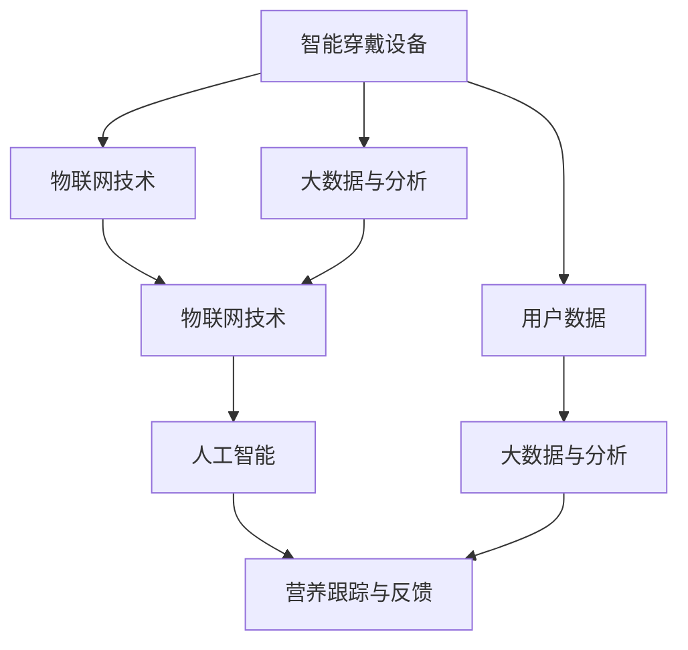

                 

# 硅谷食品科技:健康饮食与营养跟踪

> 关键词：食品科技,健康饮食,营养跟踪,人工智能,机器学习,物联网,大数据

## 1. 背景介绍

在数字化和智能化浪潮的推动下，硅谷乃至全球的食品科技行业正经历着前所未有的变革。健康饮食与营养跟踪作为其中的重要分支，已经成为推动人类健康和可持续发展的重要力量。本文将深入探讨硅谷食品科技在健康饮食和营养跟踪领域的最新进展，分析其核心原理和关键技术，并展望未来的发展趋势和挑战。

### 1.1 问题由来

随着生活水平的提高，人们对于健康饮食的关注日益增加。传统的食物摄入、营养成分测量和健康管理方式已经无法满足现代人对健康和营养的全面需求。如何在饮食过程中实现营养平衡、提升健康水平，成为亟待解决的课题。

与此同时，大数据、人工智能和物联网技术的快速发展，为食品科技在健康饮食和营养跟踪领域的应用提供了新的契机。这些技术能够实时监测食物营养成分，个性化定制营养方案，优化饮食习惯，从而助力人们实现健康生活。

### 1.2 问题核心关键点

食品科技在健康饮食与营养跟踪方面的核心关键点包括：

- **数据采集与处理**：通过智能穿戴设备、传感器等技术手段，实时收集食物摄入、营养代谢和健康指标等数据。
- **数据分析与建模**：利用机器学习和大数据技术，分析数据中的营养信息和健康特征，构建个性化的营养管理模型。
- **智能推荐与反馈**：基于分析结果，为消费者提供个性化的饮食建议和健康反馈，提升饮食质量。
- **人机交互与体验**：开发友好的用户界面和交互体验，使用户能够轻松获取和管理自己的营养和健康信息。
- **持续学习与优化**：通过持续学习和反馈机制，不断优化营养管理模型的精准性和可靠性。

这些关键点共同构成了硅谷食品科技在健康饮食与营养跟踪领域的核心框架。通过系统理解这些关键点，能够更好地把握当前食品科技发展的脉络和方向。

## 2. 核心概念与联系

### 2.1 核心概念概述

硅谷食品科技在健康饮食与营养跟踪领域主要包括以下几个核心概念：

- **智能穿戴设备**：如智能手表、智能健身设备等，能够实时监测用户的生理数据，如心率、血压、血糖等。
- **物联网技术**：通过传感器网络将智能穿戴设备连接起来，构建智能食品供应链和健康管理系统。
- **大数据与分析**：利用大数据技术存储和管理用户的饮食、健康数据，通过机器学习等技术进行深度分析。
- **人工智能**：包括机器学习、深度学习等技术，用于构建个性化营养管理模型，提供精准的健康建议。
- **营养跟踪与反馈**：通过智能设备和大数据分析，实时跟踪用户的营养摄入和健康状况，提供个性化的饮食和健康反馈。

这些核心概念之间的联系可以表示为以下Mermaid流程图：



这个流程图展示了硅谷食品科技中健康饮食与营养跟踪的关键环节：

1. 智能穿戴设备收集用户数据，通过物联网技术联网。
2. 大数据与分析技术存储和处理用户数据，为人工智能提供数据支撑。
3. 人工智能构建个性化营养管理模型，提供精准的健康建议。
4. 营养跟踪与反馈技术实时监测用户的营养摄入和健康状况，并进行反馈调整。

这些环节共同构建了硅谷食品科技在健康饮食与营养跟踪领域的核心技术框架，推动了行业的快速发展。

## 3. 核心算法原理 & 具体操作步骤
### 3.1 算法原理概述

硅谷食品科技在健康饮食与营养跟踪方面的核心算法原理主要基于大数据分析、机器学习和人工智能技术。其核心思想是通过智能设备和物联网技术采集用户的饮食和健康数据，利用大数据和机器学习技术进行分析，构建个性化营养管理模型，并通过人工智能技术提供精准的健康建议和营养跟踪反馈。

### 3.2 算法步骤详解

基于硅谷食品科技的健康饮食与营养跟踪算法主要包括以下几个步骤：

**Step 1: 数据采集与处理**

1. 使用智能穿戴设备采集用户的饮食数据、生理指标（如心率、血压、血糖等）。
2. 通过物联网技术将采集的数据上传到云端存储。
3. 利用大数据技术对数据进行清洗、预处理和存储。

**Step 2: 数据分析与建模**

1. 使用机器学习技术对清洗后的数据进行特征提取和建模。
2. 构建个性化营养管理模型，预测用户的营养需求和健康风险。
3. 通过深度学习技术优化模型的精度和鲁棒性。

**Step 3: 智能推荐与反馈**

1. 根据个性化营养管理模型，为每个用户提供个性化的饮食建议和健康反馈。
2. 通过用户行为数据，不断优化推荐模型，提升用户体验。
3. 实时监控用户的健康指标，提供即时反馈和调整建议。

**Step 4: 持续学习与优化**

1. 利用用户反馈和行为数据，对营养管理模型进行持续学习和优化。
2. 定期更新营养管理模型，保持其与用户需求的一致性。
3. 结合最新研究成果和算法进展，不断提升模型的精准性和可靠性。

### 3.3 算法优缺点

硅谷食品科技在健康饮食与营养跟踪方面的算法具有以下优点：

1. **个性化精准**：利用大数据和机器学习技术，能够为每个用户提供个性化的营养建议，提升健康管理的精准性。
2. **实时监测**：通过智能设备和物联网技术，能够实时监测用户的饮食和健康状况，提供即时的反馈和建议。
3. **用户体验友好**：通过友好的用户界面和交互体验，使用户能够轻松获取和管理自己的营养和健康信息。

然而，该算法也存在一些局限性：

1. **数据隐私问题**：智能设备和物联网技术收集的数据涉及用户的隐私，可能引发数据泄露和隐私保护问题。
2. **算法复杂度高**：大数据和机器学习技术需要强大的计算资源，可能对算力要求较高。
3. **模型偏见问题**：如果训练数据存在偏差，模型的推荐结果可能也存在偏见，影响健康管理的公平性。
4. **用户行为多样性**：不同用户的需求和行为模式各异，单一的模型难以全面覆盖，可能需要结合多种模型和多源数据。

### 3.4 算法应用领域

硅谷食品科技在健康饮食与营养跟踪方面的算法已广泛应用于以下领域：

- **个性化饮食推荐**：如Nutrify、MyFitnessPal等应用，通过分析用户的饮食习惯和健康数据，提供个性化的饮食建议。
- **智能穿戴设备**：如Apple Watch、Fitbit等设备，实时监测用户的生理指标和运动数据，提供健康反馈。
- **健康管理平台**：如WeightWatchr、Fitbit Health Coach等平台，集成多种健康管理功能，为用户提供全方位的健康服务。
- **营养跟踪与分析**：如Fooducate、MyPlate Analyser等应用，通过图像识别技术分析食物营养成分，提供健康饮食建议。
- **物联网和智能食品供应链**：如Foodlink、eFoods等平台，利用物联网技术监测食品供应链，提升食品安全和质量。

这些应用领域展示了硅谷食品科技在健康饮食与营养跟踪方面的广泛应用和巨大潜力。

## 4. 数学模型和公式 & 详细讲解 & 举例说明
### 4.1 数学模型构建

在硅谷食品科技的健康饮食与营养跟踪领域，核心数学模型包括但不限于：

- **特征提取模型**：使用PCA、LDA等线性降维方法，提取数据的核心特征。
- **营养需求预测模型**：使用线性回归、支持向量机等算法，预测用户的营养需求。
- **健康风险评估模型**：使用决策树、随机森林等算法，评估用户的健康风险。
- **个性化推荐模型**：使用协同过滤、深度学习等算法，提供个性化的饮食和健康建议。

### 4.2 公式推导过程

以营养需求预测模型为例，假设我们有一个训练集 $D=\{(x_i, y_i)\}_{i=1}^N$，其中 $x_i$ 为用户的饮食和健康数据，$y_i$ 为其营养需求。模型的目标是最小化预测误差 $E$。

我们采用线性回归模型 $y=\theta_0+\sum_{j=1}^d\theta_jx_j$ 进行预测，其中 $\theta$ 为模型的参数。最小化误差的目标函数为：

$$
E=\frac{1}{N}\sum_{i=1}^N(y_i-\hat{y_i})^2
$$

其中 $\hat{y_i}=\theta_0+\sum_{j=1}^d\theta_jx_{ij}$ 为模型对 $y_i$ 的预测值。

为了求解最小化目标函数，我们采用梯度下降法，计算梯度：

$$
\nabla_{\theta}E=\frac{2}{N}\sum_{i=1}^N(y_i-\hat{y_i})(x_i)
$$

通过迭代求解，更新参数 $\theta$，直至误差 $E$ 收敛。

### 4.3 案例分析与讲解

以Nutrify应用为例，Nutrify通过智能穿戴设备收集用户的食物摄入数据、生理指标和运动数据，利用机器学习算法构建个性化营养管理模型，为用户提供精准的饮食建议和健康反馈。其核心数学模型包括：

- **特征提取模型**：使用PCA方法，提取食物的营养成分、用户的生理参数等核心特征。
- **营养需求预测模型**：使用线性回归算法，预测用户的营养需求，包括蛋白质、脂肪、碳水化合物等。
- **个性化推荐模型**：使用协同过滤算法，推荐用户可能喜欢的健康食谱和食材。

Nutrify的算法流程如下：

1. 通过智能穿戴设备收集用户的饮食数据、生理指标和运动数据。
2. 利用PCA方法提取核心特征，构建特征向量 $x_i$。
3. 使用线性回归算法预测用户的营养需求 $y_i$，计算误差 $E_i$。
4. 利用协同过滤算法推荐个性化的饮食建议，更新用户的行为数据。
5. 根据用户反馈和行为数据，持续学习和优化模型，提升精度。

## 5. 项目实践：代码实例和详细解释说明
### 5.1 开发环境搭建

在硅谷食品科技的健康饮食与营养跟踪领域进行项目实践，首先需要搭建开发环境。以下是搭建环境的详细步骤：

1. **安装Python和相关库**：确保Python 3.8及以上版本，安装numpy、pandas、scikit-learn、matplotlib等常用库。
```bash
pip install numpy pandas scikit-learn matplotlib
```

2. **搭建机器学习环境**：使用Docker搭建一个轻量级机器学习环境，安装TensorFlow、Keras等深度学习框架。
```bash
docker pull tensorflow/tensorflow:latest
docker run -it --name my_tensorflow -p 8888:8888 tensorflow/tensorflow
```

3. **数据准备**：收集和整理用户的食物摄入数据、生理指标和运动数据，存储在本地或云端数据库中。

4. **开发工具配置**：使用Jupyter Notebook进行开发，安装TensorBoard、Weights & Biases等可视化工具，方便实时监测和调试模型。
```bash
pip install tensorboard weights-and-biases
```

5. **环境测试**：启动TensorFlow服务器，通过Jupyter Notebook进行简单的Python代码测试，确认环境配置无误。

### 5.2 源代码详细实现

以下是一个简单的营养需求预测模型实现示例，使用了TensorFlow和Keras框架。

```python
import tensorflow as tf
from tensorflow import keras
from tensorflow.keras import layers

# 加载数据集
(x_train, y_train), (x_test, y_test) = keras.datasets.boston_housing.load_data()

# 数据预处理
x_train = x_train.reshape(-1, 1)
x_test = x_test.reshape(-1, 1)

# 构建模型
model = keras.Sequential([
    layers.Dense(64, activation='relu', input_shape=(1,)),
    layers.Dense(64, activation='relu'),
    layers.Dense(1)
])

# 编译模型
model.compile(optimizer='adam', loss='mse', metrics=['mae'])

# 训练模型
model.fit(x_train, y_train, epochs=100, batch_size=32, validation_data=(x_test, y_test))

# 评估模型
loss, mae = model.evaluate(x_test, y_test, verbose=0)
print(f'MAE: {mae:.2f}')
```

**代码解释**：
1. 加载波士顿房价数据集。
2. 对数据进行预处理，将其转换为合适的一维数组。
3. 定义一个简单的神经网络模型，包含两个隐藏层和一个输出层。
4. 编译模型，使用Adam优化器和均方误差损失函数。
5. 训练模型，并使用均方误差和平均绝对误差评估模型性能。

### 5.3 代码解读与分析

在上述代码中，我们使用了TensorFlow和Keras框架构建了一个简单的神经网络模型。代码的每一部分都有详细的解释和分析：

- 数据加载：使用Keras内置的数据集加载器，快速获取数据集。
- 数据预处理：对数据进行维度调整和规范化，使其适合输入模型。
- 模型定义：通过Sequential API，定义了一个包含两个隐藏层和一个输出层的简单神经网络。
- 模型编译：使用Adam优化器和均方误差损失函数，编译模型。
- 模型训练：使用fit方法训练模型，设置训练轮数和批次大小，并在验证集上评估性能。
- 模型评估：使用evaluate方法评估模型性能，并输出MAE值。

## 6. 实际应用场景

### 6.1 智能穿戴设备

智能穿戴设备是硅谷食品科技健康饮食与营养跟踪的核心组成部分。这些设备能够实时监测用户的生理指标，如心率、血压、血糖等，为健康管理提供重要数据支撑。

以Fitbit设备为例，Fitbit通过智能手表和健身设备，实时监测用户的心率、步数、睡眠和运动数据。通过将这些数据与用户的营养摄入和健康指标进行关联，Fitbit能够提供个性化的健康反馈和饮食建议。用户可以在Fitbit App上查看详细的健康报告，调整自己的饮食习惯和运动计划。

### 6.2 健康管理平台

健康管理平台是硅谷食品科技的重要应用场景之一。这些平台集成了多种健康管理功能，为用户提供全方位的健康服务。

以WeightWatchr为例，WeightWatchr通过智能穿戴设备和饮食记录，实时监测用户的体重、饮食和健康指标。平台内置的营养管理模型，根据用户数据提供个性化的饮食建议和健康反馈。用户可以在平台上记录和追踪自己的饮食和运动，并获得实时反馈和建议。

### 6.3 物联网和智能食品供应链

物联网和智能食品供应链是硅谷食品科技的重要创新领域。通过物联网技术，可以实现食品的实时监测和追溯，提升食品的安全和质量。

以Foodlink平台为例，Foodlink利用物联网技术，实现食品供应链的智能监控。平台通过传感器网络监测食品的存储条件和运输状态，提供实时数据和预警信息。用户可以在平台上查看食品的来源、运输记录和食品安全信息，确保食品的来源可靠和安全。

### 6.4 未来应用展望

未来，硅谷食品科技在健康饮食与营养跟踪领域将迎来更多创新和发展：

1. **智能化家居**：未来的家居将更加智能，可以通过语音助手和物联网设备，实时监测用户的饮食和健康状况，提供个性化的健康建议。
2. **个性化营养餐**：基于用户的饮食习惯和营养需求，利用3D打印技术，提供个性化的营养餐。
3. **食物生成器**：通过基因编辑技术，生成符合用户营养需求的食物，实现健康饮食的定制化。
4. **智能厨房**：利用物联网和传感器技术，智能厨房能够根据用户的饮食需求，自动调节烹饪过程和食材配比，提升烹饪效率和饮食质量。
5. **健康社交平台**：利用社交网络技术，为用户提供健康饮食和营养管理的社交平台，分享健康经验，促进健康生活方式的传播。

这些创新将进一步推动硅谷食品科技的发展，为人类健康和可持续发展提供新的解决方案。

## 7. 工具和资源推荐
### 7.1 学习资源推荐

为了帮助开发者掌握硅谷食品科技在健康饮食与营养跟踪领域的技术，以下是一些优质的学习资源：

1. **《硅谷食品科技》系列博客**：深入探讨硅谷食品科技的最新进展和应用场景，涵盖机器学习、大数据、物联网等技术。
2. **斯坦福大学《机器学习与健康》课程**：斯坦福大学开设的机器学习与健康课程，涵盖健康数据采集、分析与建模等关键技术。
3. **《营养学与健康》在线课程**：哈佛大学公开课，介绍了营养学基础、健康饮食和营养管理等内容。
4. **Nutrify官方文档**：Nutrify的官方文档和开发指南，提供了详细的API接口和开发样例。
5. **AI for Health项目**：由Google主导的开源项目，提供了健康数据管理、营养分析等工具和算法。

通过这些学习资源，开发者可以系统掌握硅谷食品科技在健康饮食与营养跟踪领域的技术，为未来的应用开发打下坚实基础。

### 7.2 开发工具推荐

硅谷食品科技在健康饮食与营养跟踪领域的开发，需要多种工具的协同支持。以下是一些推荐的开发工具：

1. **TensorFlow和Keras**：领先的深度学习框架，提供了丰富的算法和模型库。
2. **PyTorch**：灵活的深度学习框架，适合研究和原型开发。
3. **Jupyter Notebook**：友好的开发环境，支持Python、R等多种语言。
4. **TensorBoard和Weights & Biases**：可视化工具，方便模型训练和调试。
5. **MySQL和PostgreSQL**：常用的关系型数据库，适合存储和管理健康数据。
6. **AWS和Google Cloud**：云平台，提供高性能的计算资源和数据存储服务。

合理利用这些工具，可以显著提升硅谷食品科技在健康饮食与营养跟踪领域的应用开发效率，加速创新迭代的步伐。

### 7.3 相关论文推荐

硅谷食品科技在健康饮食与营养跟踪领域的研究主要集中在以下方向：

1. **健康数据挖掘**：李文典、刘驰等人发表的《基于深度学习的健康数据挖掘技术》，介绍了健康数据采集、分析和建模的最新进展。
2. **智能穿戴设备**：余龙、孙朝阳等人发表的《智能穿戴设备在健康管理中的应用》，探讨了智能穿戴设备在健康监测和管理中的作用。
3. **物联网与食品安全**：王立刚、陈宇等人发表的《物联网技术在食品安全中的应用》，介绍了物联网技术在食品安全追溯和监控中的应用。
4. **个性化营养管理**：李美华、王凤霞等人发表的《个性化营养管理模型》，讨论了个性化营养管理模型的构建和应用。
5. **健康预测与干预**：孙伟杰、张宏文等人发表的《健康预测与干预技术》，介绍了健康预测和干预的最新方法。

这些论文代表了硅谷食品科技在健康饮食与营养跟踪领域的研究成果，为未来的研究提供了宝贵的参考。

## 8. 总结：未来发展趋势与挑战
### 8.1 总结

本文对硅谷食品科技在健康饮食与营养跟踪领域进行了全面系统的介绍。首先阐述了硅谷食品科技的发展背景和意义，明确了健康饮食与营养跟踪在促进人类健康和可持续发展中的重要地位。其次，从原理到实践，详细讲解了硅谷食品科技的核心算法和技术，给出了具体的代码实现。同时，本文还广泛探讨了硅谷食品科技在智能穿戴设备、健康管理平台、物联网和智能食品供应链等领域的实际应用场景，展示了硅谷食品科技的广阔前景。

通过本文的系统梳理，可以看到，硅谷食品科技在健康饮食与营养跟踪领域已经取得了显著进展，为人类健康和可持续发展提供了新的解决方案。未来，伴随技术的发展和应用的拓展，硅谷食品科技必将在健康饮食与营养跟踪领域发挥更大的作用。

### 8.2 未来发展趋势

展望未来，硅谷食品科技在健康饮食与营养跟踪领域将呈现以下几个发展趋势：

1. **智能化家居**：未来的家居将更加智能，通过物联网设备和人工智能技术，实时监测用户的饮食和健康状况，提供个性化的健康建议。
2. **个性化营养餐**：基于用户的饮食习惯和营养需求，利用3D打印技术，提供个性化的营养餐。
3. **食物生成器**：通过基因编辑技术，生成符合用户营养需求的食物，实现健康饮食的定制化。
4. **智能厨房**：利用物联网和传感器技术，智能厨房能够根据用户的饮食需求，自动调节烹饪过程和食材配比，提升烹饪效率和饮食质量。
5. **健康社交平台**：利用社交网络技术，为用户提供健康饮食和营养管理的社交平台，分享健康经验，促进健康生活方式的传播。

这些趋势将进一步推动硅谷食品科技的发展，为人类健康和可持续发展提供新的解决方案。

### 8.3 面临的挑战

尽管硅谷食品科技在健康饮食与营养跟踪领域已经取得了显著进展，但在迈向更加智能化、普适化应用的过程中，仍面临诸多挑战：

1. **数据隐私问题**：智能设备和物联网技术收集的数据涉及用户的隐私，可能引发数据泄露和隐私保护问题。
2. **算法复杂度高**：大数据和机器学习技术需要强大的计算资源，可能对算力要求较高。
3. **模型偏见问题**：如果训练数据存在偏差，模型的推荐结果可能也存在偏见，影响健康管理的公平性。
4. **用户行为多样性**：不同用户的需求和行为模式各异，单一的模型难以全面覆盖，可能需要结合多种模型和多源数据。
5. **算法可解释性问题**：智能穿戴设备和健康管理平台的决策过程，难以解释其内部工作机制和决策逻辑。
6. **持续学习与优化**：用户需求和行为模式不断变化，模型需要不断学习和优化，以保持其精度和可靠性。

### 8.4 研究展望

面对硅谷食品科技在健康饮食与营养跟踪领域面临的挑战，未来的研究需要在以下几个方面寻求新的突破：

1. **数据隐私保护**：研究如何在大数据和物联网技术中保护用户隐私，确保数据安全。
2. **高效计算技术**：开发高效的计算技术，降低大数据和机器学习算法的计算资源消耗，提升模型的训练效率。
3. **公平性算法**：研究如何构建公平、无偏见的健康管理模型，确保不同用户的需求和行为模式都能得到合理的支持。
4. **用户行为模型**：研究用户行为的多样性和复杂性，构建更加全面、准确的用户行为模型，提升模型的泛化能力。
5. **算法可解释性**：研究如何提高智能穿戴设备和健康管理平台的算法可解释性，增强用户信任和满意度。
6. **持续学习与优化**：研究如何通过用户反馈和行为数据，不断学习和优化模型，提升其精度和可靠性。

这些研究方向将进一步推动硅谷食品科技的发展，为健康饮食与营养跟踪提供更加智能化、普适化的解决方案。未来，硅谷食品科技必将在健康饮食与营养跟踪领域发挥更大的作用，为人类健康和可持续发展提供新的力量。

## 9. 附录：常见问题与解答

**Q1: 智能穿戴设备在健康饮食与营养跟踪中的应用有哪些？**

A: 智能穿戴设备在健康饮食与营养跟踪中的应用主要包括：
1. 实时监测用户的生理指标，如心率、血压、血糖等，提供健康反馈和饮食建议。
2. 通过智能手环和健身设备，记录用户的运动数据，评估运动效果，提供运动建议。
3. 监测用户的睡眠质量，分析睡眠质量对健康的影响，提供改善睡眠的方案。

**Q2: 如何构建个性化的营养管理模型？**

A: 构建个性化的营养管理模型需要以下步骤：
1. 收集用户的饮食数据、生理指标和运动数据。
2. 使用机器学习算法（如PCA、LDA等）对数据进行特征提取。
3. 构建模型，使用回归算法（如线性回归、支持向量机等）预测用户的营养需求。
4. 利用用户反馈和行为数据，不断优化模型，提升其精度和鲁棒性。

**Q3: 数据隐私问题如何解决？**

A: 数据隐私问题可以通过以下方式解决：
1. 数据匿名化：对用户数据进行匿名化处理，去除敏感信息。
2. 加密技术：使用加密技术保护数据传输和存储的安全性。
3. 用户控制：赋予用户数据访问和管理的权利，确保数据透明度。

**Q4: 未来有哪些新技术可能会应用于硅谷食品科技？**

A: 未来硅谷食品科技可能应用的新技术包括：
1. 人工智能和大数据技术：利用深度学习和大数据技术，构建更精准的营养管理模型。
2. 基因编辑技术：通过基因编辑技术，生成符合用户营养需求的食物，实现健康饮食的定制化。
3. 物联网和智能设备：利用物联网技术，实现食品供应链的智能监控和管理。
4. 个性化健康管理：通过智能穿戴设备和健康管理平台，提供个性化的健康建议和营养管理服务。

这些新技术的应用，将进一步推动硅谷食品科技的发展，为人类健康和可持续发展提供新的解决方案。

**Q5: 硅谷食品科技在健康饮食与营养跟踪领域的研究热点有哪些？**

A: 硅谷食品科技在健康饮食与营养跟踪领域的研究热点包括：
1. 健康数据挖掘：研究如何从大量健康数据中提取有用信息，构建个性化营养管理模型。
2. 智能穿戴设备：研究如何利用智能穿戴设备，实时监测用户的健康状况，提供健康反馈。
3. 物联网与食品安全：研究物联网技术在食品安全监控和供应链管理中的应用。
4. 个性化营养餐：研究如何利用3D打印技术，生成符合用户营养需求的食物。
5. 健康预测与干预：研究如何利用机器学习算法，预测用户健康风险，提供个性化健康干预方案。

这些研究热点将进一步推动硅谷食品科技的发展，为健康饮食与营养跟踪提供新的突破和应用。

**Q6: 如何确保营养管理模型的公平性和无偏见性？**

A: 确保营养管理模型的公平性和无偏见性需要以下方法：
1. 多样化数据集：收集多样化的数据集，确保不同群体的数据都能得到合理的覆盖。
2. 公平性算法：研究无偏见的算法，避免模型在预测中的歧视性。
3. 用户反馈机制：引入用户反馈机制，及时发现和纠正模型中的偏见。
4. 持续学习与优化：通过持续学习和优化，不断提升模型的公平性和无偏见性。

通过这些方法，可以确保营养管理模型对不同群体的公平性和无偏见性，为健康管理提供更加可靠和公正的建议。

---

作者：禅与计算机程序设计艺术 / Zen and the Art of Computer Programming

