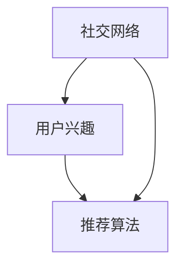

                 

## 1. 背景介绍

随着社交网络的迅猛发展和移动互联网的普及，人们获取信息的方式已经发生了根本性的变化。传统基于Web的搜索和内容推荐方式已经无法满足用户的个性化需求。社交网络推荐系统作为新兴的推荐技术，能够结合用户的兴趣和社交关系，更精准地推送个性化的内容，提升用户体验和平台活跃度。

推荐系统本质上是一种信息过滤技术，旨在从大量的信息流中，筛选出用户最感兴趣的内容，并推荐给用户。传统的推荐系统主要依赖于用户行为数据（如点击、浏览、购买等）和物品属性数据（如标签、描述、价格等）进行推荐。然而，这些方式往往难以捕捉到用户真实的兴趣偏好，且容易受到数据噪音的影响。

社交网络推荐系统正是在这种背景下应运而生的。它不仅能通过用户的浏览、点赞、评论等行为数据发现用户的兴趣，还能结合用户的社交网络关系，预测用户可能感兴趣的内容，提供更加个性化的推荐结果。这种基于社交关系的推荐方式，能够更好地满足用户的个性化需求，提升推荐系统的效果和用户体验。

## 2. 核心概念与联系

### 2.1 核心概念概述

为了更好地理解社交网络推荐系统，首先需要了解以下几个核心概念：

- **社交网络**：指用户之间的连接关系图，其中节点为用户，边为用户之间的关系（如好友、关注、点赞等）。
- **用户兴趣**：指用户对某些内容的偏好程度，通常通过用户的行为数据（如浏览、点赞、评论等）进行建模。
- **推荐算法**：指从大量数据中，挖掘出用户可能感兴趣的内容，并提供推荐的技术手段。

这些核心概念之间的联系可以通过以下Mermaid流程图来展示：



在这个流程图中，社交网络与用户兴趣共同构成推荐系统的数据基础。推荐算法则将这些数据转化为推荐结果，完成对用户的个性化推荐。

### 2.2 核心概念原理和架构的 Mermaid 流程图

社交网络推荐系统的架构如图2-1所示：


该架构由数据收集模块、社交关系建模模块、用户兴趣建模模块和推荐算法模块组成。数据收集模块负责收集用户的社交行为数据和内容互动数据，用于构建社交网络和用户兴趣模型。社交关系建模模块将用户的社交网络关系进行建模，形成用户之间的连接关系图。用户兴趣建模模块根据用户的行为数据，挖掘出用户的兴趣偏好，形成用户兴趣向量。推荐算法模块则根据社交关系和用户兴趣，预测用户可能感兴趣的内容，并生成推荐结果。

## 3. 核心算法原理 & 具体操作步骤

### 3.1 算法原理概述

社交网络推荐系统的核心算法原理包括社交关系传播、协同过滤、协同学习等。其中，社交关系传播通过模拟信息在社交网络中的传播路径，结合用户兴趣预测用户可能感兴趣的内容。协同过滤和协同学习则通过挖掘用户之间的相似性，利用相似用户的兴趣和行为，提升推荐系统的精准度。

### 3.2 算法步骤详解

#### 3.2.1 数据收集与预处理

社交网络推荐系统的第一步是数据收集与预处理。需要从社交网络中收集用户的社交行为数据（如好友、点赞、评论等）和内容互动数据（如浏览、点击、评分等）。这些数据需要进行清洗和标准化处理，去除噪声和异常值，形成推荐系统的输入数据。

#### 3.2.2 社交关系建模

社交关系建模是指将用户的社交网络关系转化为数学表示，形成社交关系图。社交关系图由节点和边组成，节点为用户，边为用户之间的关系（如好友、关注、点赞等）。常用的社交关系建模方法包括邻接矩阵、邻接表、图嵌入等。

#### 3.2.3 用户兴趣建模

用户兴趣建模是指根据用户的行为数据，挖掘出用户的兴趣偏好，形成用户兴趣向量。常用的用户兴趣建模方法包括基于内容的推荐、协同过滤、协同学习等。基于内容的推荐方法利用物品属性数据进行推荐，适用于物品属性丰富的场景。协同过滤方法通过挖掘用户之间的相似性，利用相似用户的兴趣和行为进行推荐。协同学习方法结合了用户和物品的隐含特征，能够更加准确地预测用户兴趣。

#### 3.2.4 推荐算法

推荐算法是社交网络推荐系统的核心部分，用于预测用户可能感兴趣的内容，并生成推荐结果。常用的推荐算法包括基于排序的推荐、基于矩阵分解的推荐、基于模型学习的推荐等。

### 3.3 算法优缺点

#### 3.3.1 优点

社交网络推荐系统具有以下优点：

- **个性化推荐**：结合用户兴趣和社交关系，能够提供更加个性化的推荐结果。
- **多模态数据融合**：利用社交网络中的多模态数据（如文本、图片、音频等）进行综合推荐，提升推荐效果。
- **社会信任**：利用社交关系中的信任因素，提升推荐结果的可靠性和可信度。

#### 3.3.2 缺点

社交网络推荐系统也存在以下缺点：

- **数据隐私问题**：用户社交行为数据的隐私问题较为敏感，如何保护用户隐私是关键挑战。
- **社交网络演化**：社交网络关系的变化对推荐结果有较大影响，需要实时更新社交关系图。
- **冷启动问题**：新用户的兴趣建模需要一定时间积累，难以快速提供推荐结果。

### 3.4 算法应用领域

社交网络推荐系统在以下几个领域得到了广泛应用：

- **内容推荐**：通过结合用户的社交关系和兴趣，推荐用户可能感兴趣的新闻、文章、视频等内容。
- **商品推荐**：结合用户的社交关系和购买历史，推荐用户可能感兴趣的电商商品。
- **社交网络服务**：根据用户的社交关系和兴趣，推荐可能感兴趣的好友、群组、活动等社交网络服务。
- **广告推荐**：利用社交网络中的用户兴趣和行为数据，推荐用户可能感兴趣的广告。

## 4. 数学模型和公式 & 详细讲解 & 举例说明

### 4.1 数学模型构建

社交网络推荐系统的数学模型主要由社交关系图和用户兴趣向量组成。社交关系图由节点和边组成，节点为用户，边为用户之间的关系。用户兴趣向量由用户的行为数据和社交关系数据挖掘得到。

### 4.2 公式推导过程

设社交关系图为 $G=(U, V, E)$，其中 $U$ 为用户节点集，$V$ 为关系节点集，$E$ 为边集。用户兴趣向量为 $\vec{x} \in \mathbb{R}^n$，其中 $n$ 为特征维度。推荐算法通过预测函数 $f$，根据社交关系图和用户兴趣向量，预测用户可能感兴趣的内容，生成推荐结果 $\hat{y}$。

推荐算法常用的预测函数包括线性回归、逻辑回归、神经网络等。以线性回归为例，推荐函数可以表示为：

$$
\hat{y} = f(\vec{x}, \vec{w})
$$

其中 $\vec{w}$ 为模型参数。通过最小化损失函数 $L(\hat{y}, y)$，训练得到最优模型参数 $\hat{w}$。

### 4.3 案例分析与讲解

#### 4.3.1 基于社交关系图的信息传播

社交关系图的信息传播过程如图4-1所示：


该过程由信息源节点、中间节点和目标节点组成。信息源节点为用户 $u$，中间节点为用户 $v$，目标节点为用户 $u'$。信息传播过程如下：

1. 从信息源节点 $u$ 开始，通过边的权重传播到中间节点 $v$。
2. 中间节点 $v$ 接收到信息后，通过边的权重传播到目标节点 $u'$。
3. 根据信息传播的权重，计算目标节点 $u'$ 的信息权重。
4. 根据目标节点 $u'$ 的信息权重，计算推荐结果。

#### 4.3.2 基于协同过滤的推荐

基于协同过滤的推荐算法包括用户协同过滤和物品协同过滤。以用户协同过滤为例，假设用户 $u$ 和用户 $v$ 对物品 $i$ 和物品 $j$ 的评分分别为 $r_{ui}$ 和 $r_{vj}$，物品 $i$ 和物品 $j$ 的评分相似度为 $s_{ij}$，用户 $u$ 和用户 $v$ 的相似度为 $s_{uv}$。推荐算法通过求解线性回归模型，预测用户 $u$ 对物品 $j$ 的评分 $r_{uj}$，生成推荐结果。

#### 4.3.3 基于协同学习的推荐

基于协同学习的推荐算法结合了用户和物品的隐含特征，通过学习用户和物品的分布式表示，预测用户对物品的评分。常用的协同学习算法包括矩阵分解、概率图模型等。以矩阵分解为例，推荐函数可以表示为：

$$
\hat{y} = \hat{\vec{x}} \cdot \hat{\vec{y}}^T
$$

其中 $\hat{\vec{x}}$ 和 $\hat{\vec{y}}$ 分别为用户和物品的隐含特征向量，通过最小化损失函数 $L(\hat{y}, y)$ 训练得到。

## 5. 项目实践：代码实例和详细解释说明

### 5.1 开发环境搭建

在进行社交网络推荐系统开发前，需要准备好开发环境。以下是使用Python进行PyTorch开发的环境配置流程：

1. 安装Anaconda：从官网下载并安装Anaconda，用于创建独立的Python环境。

2. 创建并激活虚拟环境：
```bash
conda create -n pytorch-env python=3.8 
conda activate pytorch-env
```

3. 安装PyTorch：根据CUDA版本，从官网获取对应的安装命令。例如：
```bash
conda install pytorch torchvision torchaudio cudatoolkit=11.1 -c pytorch -c conda-forge
```

4. 安装相关库：
```bash
pip install numpy pandas scikit-learn torchmetrics torchtext
```

完成上述步骤后，即可在`pytorch-env`环境中开始开发。

### 5.2 源代码详细实现

这里我们以基于协同过滤的推荐系统为例，给出使用PyTorch进行社交网络推荐系统的PyTorch代码实现。

首先，定义推荐系统类：

```python
import torch
import torch.nn as nn
import torch.optim as optim
from torchtext.data import Field, TabularDataset

class RecommendationSystem(nn.Module):
    def __init__(self, num_users, num_items, num_features):
        super(RecommendationSystem, self).__init__()
        self.user_embed = nn.Embedding(num_users, num_features)
        self.item_embed = nn.Embedding(num_items, num_features)
        self.user_item = nn.Linear(num_features, 1)
        
    def forward(self, user_ids, item_ids):
        user_embeds = self.user_embed(user_ids)
        item_embeds = self.item_embed(item_ids)
        user_item_scores = self.user_item(torch.cat([user_embeds, item_embeds], dim=1))
        return user_item_scores
```

然后，定义数据加载函数：

```python
from torchtext.data import DataLoader
from torchtext.data.functional import unzip

def load_data(path, batch_size=64):
    train_path = f"{path}/train.csv"
    test_path = f"{path}/test.csv"
    
    train_data, test_data = TabularDataset.splits(
        path=path,
        train=train_path,
        test=test_path,
        format='tsv',
        fields=[
            ('user_id', Field(sequential=True, use_vocab=False)),
            ('item_id', Field(sequential=True, use_vocab=False)),
            ('rating', Field(sequential=False, use_vocab=False))
        ]
    )
    
    train_data, val_data = train_data.split(validation_pct=0.1, shuffle=True)
    
    train_loader = DataLoader(train_data, batch_size=batch_size, shuffle=True)
    val_loader = DataLoader(val_data, batch_size=batch_size, shuffle=False)
    test_loader = DataLoader(test_data, batch_size=batch_size, shuffle=False)
    
    return train_loader, val_loader, test_loader
```

最后，启动训练流程：

```python
def train(model, optimizer, loss_fn, device, train_loader, val_loader, epochs=10, patience=5):
    best_loss = float('inf')
    patience_counter = 0
    
    for epoch in range(epochs):
        model.train()
        train_loss = 0
        for user_ids, item_ids, ratings in train_loader:
            user_ids = user_ids.to(device)
            item_ids = item_ids.to(device)
            ratings = ratings.to(device)
            optimizer.zero_grad()
            outputs = model(user_ids, item_ids)
            loss = loss_fn(outputs, ratings)
            loss.backward()
            optimizer.step()
            train_loss += loss.item()
        
        model.eval()
        val_loss = 0
        for user_ids, item_ids, ratings in val_loader:
            with torch.no_grad():
                user_ids = user_ids.to(device)
                item_ids = item_ids.to(device)
                ratings = ratings.to(device)
                outputs = model(user_ids, item_ids)
                loss = loss_fn(outputs, ratings)
                val_loss += loss.item()
        
        if val_loss < best_loss:
            best_loss = val_loss
            patience_counter = 0
        else:
            patience_counter += 1
            if patience_counter >= patience:
                break
        
    return model, best_loss
```

### 5.3 代码解读与分析

让我们再详细解读一下关键代码的实现细节：

**RecommendationSystem类**：
- `__init__`方法：初始化用户和物品嵌入层以及用户-物品交互层。
- `forward`方法：前向传播计算用户对物品的评分预测。

**load_data函数**：
- 定义数据加载函数，加载数据集，并划分为训练集、验证集和测试集。
- 定义数据加载器，并返回训练集、验证集和测试集的数据加载器。

**train函数**：
- 定义训练函数，循环迭代训练，并在每个epoch结束时评估验证集上的损失。
- 在训练过程中，通过正向传播计算损失，反向传播更新模型参数。
- 在验证过程中，通过前向传播计算损失，记录验证集上的损失。
- 根据验证集上的损失，判断是否触发Early Stopping。

通过这些代码实现，可以构建一个基本的社交网络推荐系统。开发者可以在此基础上进行更加复杂和深入的优化，以提高推荐系统的效果。

## 6. 实际应用场景

### 6.1 社交网络内容推荐

社交网络内容推荐是社交网络推荐系统的经典应用场景。通过结合用户的社交关系和兴趣，推荐用户可能感兴趣的新闻、文章、视频等内容，能够显著提升用户体验和平台活跃度。

例如，在Facebook上，用户可以关注好友和兴趣页面，查看好友和兴趣页面发布的内容。推荐系统根据用户的社交关系和兴趣，预测用户可能感兴趣的内容，并推荐给用户。用户还可以通过互动（如点赞、评论）来进一步增强推荐系统对用户兴趣的预测。

### 6.2 商品推荐

商品推荐是社交网络推荐系统在电商领域的重要应用。通过结合用户的社交关系和购买历史，推荐用户可能感兴趣的商品，能够提高电商平台的销售转化率和用户满意度。

例如，在Amazon上，用户可以查看好友和关注用户的购物清单，并查看相关商品的推荐。推荐系统根据用户的社交关系和购物历史，预测用户可能感兴趣的商品，并推荐给用户。用户还可以通过互动（如收藏、购买）来进一步增强推荐系统对用户兴趣的预测。

### 6.3 社交网络服务推荐

社交网络服务推荐是社交网络推荐系统在社交网络服务领域的重要应用。通过结合用户的社交关系和兴趣，推荐用户可能感兴趣的好友、群组、活动等社交网络服务，能够提升用户对平台的粘性。

例如，在Instagram上，用户可以查看好友和兴趣标签发布的内容，并查看相关内容的推荐。推荐系统根据用户的社交关系和兴趣，预测用户可能感兴趣的好友、群组、活动等社交网络服务，并推荐给用户。用户还可以通过互动（如点赞、评论）来进一步增强推荐系统对用户兴趣的预测。

### 6.4 广告推荐

广告推荐是社交网络推荐系统在广告领域的重要应用。通过结合用户的社交关系和行为数据，推荐用户可能感兴趣的广告，能够提高广告的点击率和转化率。

例如，在Facebook上，广告主可以根据用户的社交关系和兴趣，推荐合适的广告给用户。推荐系统根据用户的社交关系和行为数据，预测用户可能感兴趣的广告，并推荐给用户。用户还可以通过互动（如点击、购买）来进一步增强推荐系统对用户兴趣的预测。

## 7. 工具和资源推荐

### 7.1 学习资源推荐

为了帮助开发者系统掌握社交网络推荐系统的理论基础和实践技巧，这里推荐一些优质的学习资源：

1. 《推荐系统实战》系列博文：由大模型技术专家撰写，深入浅出地介绍了推荐系统原理、算法和实践技巧。

2. 《深度学习基础》课程：斯坦福大学开设的深度学习明星课程，有Lecture视频和配套作业，带你入门深度学习的基本概念和经典模型。

3. 《推荐系统》书籍：推荐系统领域的经典教材，全面介绍了推荐系统的理论、算法和应用案例。

4. KDD Cup 推荐系统竞赛：KDD Cup是数据挖掘领域的顶级竞赛，每年都会举办推荐系统竞赛，展示最新的推荐系统技术。

5. Kaggle推荐系统竞赛：Kaggle是数据科学领域的顶级平台，每年都会举办推荐系统竞赛，提供丰富的数据集和模型展示。

通过对这些资源的学习实践，相信你一定能够快速掌握社交网络推荐系统的精髓，并用于解决实际的推荐问题。

### 7.2 开发工具推荐

高效的开发离不开优秀的工具支持。以下是几款用于社交网络推荐系统开发的常用工具：

1. PyTorch：基于Python的开源深度学习框架，灵活动态的计算图，适合快速迭代研究。大部分预训练语言模型都有PyTorch版本的实现。

2. TensorFlow：由Google主导开发的开源深度学习框架，生产部署方便，适合大规模工程应用。同样有丰富的预训练语言模型资源。

3. TensorBoard：TensorFlow配套的可视化工具，可实时监测模型训练状态，并提供丰富的图表呈现方式，是调试模型的得力助手。

4. Weights & Biases：模型训练的实验跟踪工具，可以记录和可视化模型训练过程中的各项指标，方便对比和调优。与主流深度学习框架无缝集成。

5. Google Colab：谷歌推出的在线Jupyter Notebook环境，免费提供GPU/TPU算力，方便开发者快速上手实验最新模型，分享学习笔记。

合理利用这些工具，可以显著提升社交网络推荐系统的开发效率，加快创新迭代的步伐。

### 7.3 相关论文推荐

社交网络推荐系统的发展离不开学界的持续研究。以下是几篇奠基性的相关论文，推荐阅读：

1. Recommendation Systems in Social Networks: A Survey，由Ipeirotis等人在IEEE TKDD上发表，介绍了社交网络推荐系统的基本概念和应用场景。

2. Social Recommendation Algorithms: A Survey and Comparative Study，由Khan等人在IEEE TCSVC上发表，总结了社交网络推荐系统的常用算法和应用案例。

3. Collaborative Filtering in Recommendation Systems，由Herlocker等人在ACM TIR发表，介绍了协同过滤算法的原理和应用。

4. Learning from Social Networks for Recommendation，由Bennett等人在JASIS&T上发表，介绍了利用社交网络进行推荐的方法和效果。

5. The Collaborative Filtering Recommendation System，由Wang等人在ACM Trans AI Account发表，介绍了协同学习算法的原理和应用。

这些论文代表了大语言模型微调技术的发展脉络。通过学习这些前沿成果，可以帮助研究者把握学科前进方向，激发更多的创新灵感。

## 8. 总结：未来发展趋势与挑战

### 8.1 总结

本文对社交网络推荐系统进行了全面系统的介绍。首先阐述了社交网络推荐系统的研究背景和意义，明确了社交网络推荐系统在个性化推荐、多模态数据融合、社会信任等方面的独特优势。其次，从原理到实践，详细讲解了社交网络推荐系统的核心算法原理和具体操作步骤，给出了社交网络推荐系统开发的完整代码实例。同时，本文还广泛探讨了社交网络推荐系统在内容推荐、商品推荐、社交网络服务推荐、广告推荐等实际应用场景中的应用前景，展示了社交网络推荐系统的广阔前景。

通过本文的系统梳理，可以看到，社交网络推荐系统正成为个性化推荐技术的重要范式，极大地拓展了推荐系统的应用边界，提升了用户的个性化需求满足度。未来，伴随社交网络推荐系统的不断演进，相信推荐系统必将在更多领域得到应用，为人类认知智能的进化带来深远影响。

### 8.2 未来发展趋势

展望未来，社交网络推荐系统将呈现以下几个发展趋势：

1. 多模态数据融合：社交网络推荐系统将利用社交网络中的多模态数据（如文本、图片、音频等）进行综合推荐，提升推荐效果。

2. 个性化推荐：社交网络推荐系统将结合用户的社交关系和兴趣，提供更加个性化的推荐结果，提升用户体验。

3. 实时推荐：社交网络推荐系统将实现实时推荐，根据用户当前的社交行为和兴趣，快速生成推荐结果。

4. 数据隐私保护：社交网络推荐系统将加强数据隐私保护，防止用户隐私泄露和滥用。

5. 推荐算法优化：社交网络推荐系统将不断优化推荐算法，提升推荐效果和系统性能。

### 8.3 面临的挑战

尽管社交网络推荐系统已经取得了瞩目成就，但在迈向更加智能化、普适化应用的过程中，它仍面临着诸多挑战：

1. 数据隐私问题：用户社交行为数据的隐私问题较为敏感，如何保护用户隐私是关键挑战。

2. 社交网络演化：社交网络关系的变化对推荐结果有较大影响，需要实时更新社交关系图。

3. 冷启动问题：新用户的兴趣建模需要一定时间积累，难以快速提供推荐结果。

4. 推荐算法优化：推荐算法需要不断优化，提升推荐效果和系统性能。

### 8.4 研究展望

面对社交网络推荐系统所面临的挑战，未来的研究需要在以下几个方面寻求新的突破：

1. 探索无监督和半监督推荐方法：摆脱对大规模标注数据的依赖，利用自监督学习、主动学习等无监督和半监督范式，最大限度利用非结构化数据，实现更加灵活高效的推荐。

2. 研究多模态数据融合推荐算法：利用社交网络中的多模态数据进行综合推荐，提升推荐效果和系统性能。

3. 结合因果分析和博弈论工具：将因果分析方法引入推荐系统，识别出推荐系统决策的关键特征，增强推荐系统输出的解释性和可信度。

4. 融合知识图谱和规则库：将知识图谱、规则库等专家知识与推荐系统结合，形成更加全面、准确的信息整合能力。

5. 探索智能推荐算法：结合符号化的先验知识，引入智能推荐算法，提升推荐系统的智能化水平。

这些研究方向的探索，必将引领社交网络推荐系统技术迈向更高的台阶，为构建安全、可靠、可解释、可控的智能系统铺平道路。面向未来，社交网络推荐系统还需要与其他人工智能技术进行更深入的融合，如知识表示、因果推理、强化学习等，多路径协同发力，共同推动推荐系统技术的进步。只有勇于创新、敢于突破，才能不断拓展推荐系统的边界，让智能技术更好地造福人类社会。

## 9. 附录：常见问题与解答

**Q1：社交网络推荐系统是否适用于所有社交媒体平台？**

A: 社交网络推荐系统在大多数社交媒体平台上都有广泛的应用，如Facebook、Twitter、Instagram等。不同平台的特点和数据结构不同，需要根据平台的特点进行相应的算法优化。例如，在Instagram上，推荐系统可以根据用户的兴趣标签推荐相关内容，而在Facebook上，推荐系统可以根据用户的社交关系推荐好友和群组。

**Q2：社交网络推荐系统是否需要实时更新数据？**

A: 社交网络推荐系统需要实时更新数据，以反映用户兴趣的变化和社交关系的动态。可以通过定时抓取和异步更新等技术手段，实现数据的实时更新。此外，还需要设计高效的数据存储和处理机制，如分布式数据库和数据缓存，以支持大规模数据的实时处理。

**Q3：社交网络推荐系统如何避免推荐同质化问题？**

A: 同质化问题是社交网络推荐系统中的一个常见问题。可以通过引入多样性算法（如shuffle多样性、top-k多样性等），在推荐过程中引入多样性约束，避免推荐同质化内容。同时，还可以通过引入负样本、交叉推荐等手段，进一步提升推荐系统的多样性和公平性。

**Q4：社交网络推荐系统如何保证推荐结果的公正性？**

A: 推荐系统的公正性是一个重要问题，尤其是在电商、广告等领域。可以通过引入公平性算法（如freud算法、tightness算法等），在推荐过程中保证不同用户和群体的公平性。此外，还可以通过引入用户反馈机制，对推荐结果进行人工干预和调整，进一步提升推荐系统的公正性。

**Q5：社交网络推荐系统如何保护用户隐私？**

A: 用户隐私保护是社交网络推荐系统中的关键问题。可以通过数据匿名化、差分隐私等技术手段，保护用户的隐私数据。例如，在推荐系统中，可以将用户数据进行匿名化处理，避免泄露用户隐私。同时，还可以通过用户控制机制，让用户自行选择是否参与推荐系统，进一步保护用户隐私。

通过这些问题的解答，可以看到社交网络推荐系统在实际应用中需要考虑的诸多复杂因素。只有全面考虑这些因素，并采取相应的技术手段，才能真正实现社交网络推荐系统的智能化和普适化。

---

作者：禅与计算机程序设计艺术 / Zen and the Art of Computer Programming

