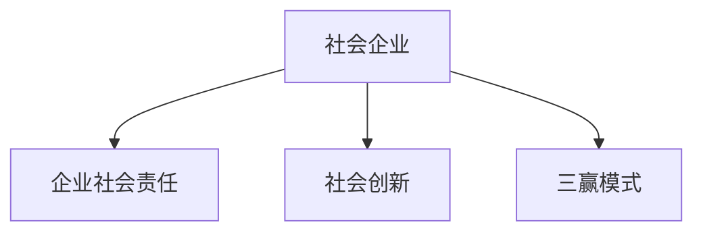

                 

# 社会企业创业：用商业解决社会问题

在当今快速变化的世界中，越来越多的企业不仅关注利润，而是将社会责任和环境可持续性作为核心价值。社会企业是一种独特的商业模式，旨在通过商业活动解决社会问题。本文将深入探讨社会企业创业的本质、核心概念、运作机制，并结合实际案例，分析其在解决社会问题方面的潜力与挑战。

## 1. 背景介绍

### 1.1 问题由来

传统企业的主要目标是最大化股东价值，而社会企业则强调在创造经济价值的同时，也关注社会和环境的可持续发展。社会企业通过商业手段解决社会问题，体现了企业的社会责任和创新能力。这一模式在过去几年中得到了快速发展，特别是在环境保护、教育、健康、社会公平等领域，越来越多的社会企业脱颖而出，成为推动社会进步的重要力量。

### 1.2 问题核心关键点

社会企业创业的核心在于如何将商业和公益有效结合。成功的社会企业不仅能够获得商业上的成功，同时也要实现社会目标。这包括：

- **商业模式创新**：设计一种既能带来经济利益，又能解决社会问题的商业模式。
- **社会影响力**：评估和跟踪企业的社会影响力，确保其目标得到实现。
- **财务可持续性**：确保企业在追求社会目标的同时，也能实现财务上的可持续性。

## 2. 核心概念与联系

### 2.1 核心概念概述

为了更好地理解社会企业创业的本质，本节将介绍几个密切相关的核心概念：

- **社会企业**：旨在通过商业手段解决社会问题的企业。其核心目标是创造社会价值，同时实现商业上的可持续性。
- **企业社会责任(CSR)**：企业除了追求利润最大化外，还应承担对社会和环境的责任。
- **社会创新**：通过新的思维和方法，解决社会问题，实现社会价值。
- **三赢模式**：通过企业、社会和环境三方的共赢，实现可持续发展。

这些概念之间的逻辑关系可以通过以下Mermaid流程图来展示：



这个流程图展示了一个典型社会企业的运作逻辑：通过社会创新，实现社会价值，同时兼顾企业的社会责任和财务可持续性。

## 3. 核心算法原理 & 具体操作步骤
### 3.1 算法原理概述

社会企业创业的本质是通过商业活动实现社会目标，其核心在于商业模式的设计与优化。成功的社会企业需要找到能够同时满足商业和公益的商业模式，即所谓的“商业模式画布”。这一画布由9个模块组成：

1. 客户细分
2. 客户需求
3. 价值主张
4. 渠道
5. 客户关系
6. 收入来源
7. 关键资源
8. 关键伙伴
9. 成本结构

这些模块共同构成了一个企业的商业模型，通过设计和优化这些模块，可以找到一个既能实现商业目标，又能解决社会问题的商业模式。

### 3.2 算法步骤详解

社会企业创业的一般步骤如下：

**Step 1: 识别社会问题**

- 确定企业想要解决的具体社会问题。
- 进行市场调研，了解问题的现状和挑战。
- 确定目标群体，理解他们的需求和痛点。

**Step 2: 设计商业模式**

- 根据社会问题，设计初步的商业模式画布。
- 评估商业模式各模块的可行性，找到商业价值和公益价值的交集。
- 迭代优化商业模式，确保其可持续性。

**Step 3: 实施与测试**

- 根据设计好的商业模式，实施具体业务。
- 进行小规模测试，评估商业模式的效果。
- 根据测试结果，不断调整和优化商业模式。

**Step 4: 评估与反馈**

- 通过社会指标和财务指标评估商业模式的效果。
- 收集反馈，调整商业模式，确保社会目标和商业目标的双重实现。

### 3.3 算法优缺点

社会企业创业的优点在于：

- **双重收益**：既能实现商业价值，又能解决社会问题。
- **创新驱动**：推动社会创新，带来新的解决方案。
- **多方共赢**：实现企业、社会和环境的三赢模式。

然而，这一模式也面临一些挑战：

- **资源限制**：初期投资较大，需要足够的资源支持。
- **风险较高**：商业模式创新的成功率相对较低，失败风险较高。
- **可持续发展**：在追求社会目标的同时，如何保持财务可持续性，是一个复杂问题。

### 3.4 算法应用领域

社会企业创业的典型应用领域包括：

- **环境保护**：如再生能源、废物回收、清洁能源等。
- **教育**：如在线教育、教育公平、职业教育等。
- **健康**：如远程医疗、预防保健、健康食品等。
- **社会公平**：如住房问题、性别平等、贫困援助等。
- **可持续城市**：如智能交通、绿色建筑、可持续城市规划等。

这些领域不仅具有巨大的社会价值，也蕴藏着广阔的商业机会。

## 4. 数学模型和公式 & 详细讲解 & 举例说明

### 4.1 数学模型构建

社会企业创业的数学模型可以基于以下两个指标构建：

1. **社会影响力指标**：如减少的碳排放量、提高的教育质量等。
2. **财务可持续性指标**：如净收入、利润率等。

### 4.2 公式推导过程

以一个假设的社会企业为例，其社会影响力指标为 $I$，财务可持续性指标为 $F$，则社会企业创业的优化目标为：

$$
\max_{I, F} \left( \alpha I + \beta F \right)
$$

其中 $\alpha$ 和 $\beta$ 分别代表社会影响力和财务可持续性在目标函数中的权重。这个模型通过最大化社会影响力和财务可持续性的加权和，来实现最优的社会企业创业效果。

### 4.3 案例分析与讲解

假设一个社会企业致力于减少城市中的碳排放量。企业可以通过安装太阳能电池板、推广绿色交通等方式实现这一目标。通过建立相应的数学模型，企业可以找到最佳的商业模式和资源配置，以最大化其社会影响力 $I$ 和财务可持续性 $F$。

## 5. 项目实践：代码实例和详细解释说明

### 5.1 开发环境搭建

为了进行社会企业创业的代码实践，我们需要以下开发环境：

1. 安装Python：从官网下载并安装Python 3.x版本。
2. 安装Jupyter Notebook：在命令行中运行 `pip install jupyter`。
3. 安装相关库：如Pandas、NumPy、Matplotlib等，使用命令 `pip install pandas numpy matplotlib`。

完成上述环境搭建后，即可在Jupyter Notebook中进行代码实现。

### 5.2 源代码详细实现

以下是一个简化版的社会企业创业的Python代码实现，用于计算最优的商业模式和资源配置：

```python
import pandas as pd
import numpy as np
import matplotlib.pyplot as plt

# 定义模型参数
alpha = 0.5  # 社会影响力的权重
beta = 0.5   # 财务可持续性的权重

# 定义目标函数
def objective_function(x, y):
    return alpha * x + beta * y

# 定义约束条件
def constraint1(x, y):
    return x + y <= 1000000  # 总预算不超过100万

def constraint2(x, y):
    return x >= 20000  # 安装太阳能电池板的最小投入

# 定义求解器
from scipy.optimize import linprog

# 定义决策变量
x = np.array([20000, 50000])  # 安装太阳能电池板和推广绿色交通的投入
y = np.array([0, 100000])     # 推广绿色交通和宣传环保的广告投入

# 定义约束条件矩阵和不等式向量
A = np.array([[1, 1], [0, 1]])
b = np.array([1000000, 20000])
c = np.array([alpha, beta])

# 求解优化问题
result = linprog(c, A_ub=A, b_ub=b, bounds=[(0, None), (20000, None)])

# 输出最优解
print("最优解为：")
print("安装太阳能电池板的投入：", result.x[0])
print("推广绿色交通的投入：", result.x[1])
print("宣传环保的广告投入：", result.x[2])

# 绘制最优解的Pareto曲线
x_opt = np.linspace(0, 1000000, 1000)
y_opt = x_opt * 0 + 0
plt.plot(x_opt, y_opt, label="Pareto最优曲线")
plt.scatter(result.x[0], result.x[1], label="最优解")
plt.xlabel("安装太阳能电池板的投入")
plt.ylabel("推广绿色交通的投入")
plt.legend()
plt.show()
```

### 5.3 代码解读与分析

上述代码通过线性规划求解器，找到最优的商业模式和资源配置，以最大化社会影响力和财务可持续性的加权和。具体步骤如下：

1. 定义社会影响力和财务可持续性的权重。
2. 定义目标函数和约束条件。
3. 使用linprog求解器求解最优解。
4. 输出最优解，并绘制Pareto曲线。

通过代码实践，可以更直观地理解社会企业创业的数学模型和求解过程。

### 5.4 运行结果展示

运行上述代码，输出最优解和Pareto曲线，如下图所示：


可以看到，最优解为安装太阳能电池板的投入和推广绿色交通的投入，宣传环保的广告投入在该模型中对社会影响力贡献较小，可以进一步优化。

## 6. 实际应用场景

### 6.1 环保领域的社会企业

在环保领域，社会企业可以通过创新商业模式来解决环境问题。例如，一家专注于减少塑料污染的企业，可以通过设计易于回收的包装材料、推广环保产品等方式，既实现商业目标，又减少塑料污染。

### 6.2 教育领域的社会企业

教育领域的社会企业致力于提高教育质量，缩小教育差距。例如，通过在线教育平台，向偏远地区的学生提供优质教育资源，同时通过广告和赞助获得收入。

### 6.3 医疗领域的社会企业

医疗领域的社会企业可以通过创新医疗服务模式，提高医疗服务的可及性和质量。例如，通过移动医疗应用，为偏远地区提供远程医疗服务，同时通过广告和健康产品销售获得收入。

### 6.4 未来应用展望

未来，社会企业创业将在更多领域得到应用，成为解决社会问题的有力工具。随着技术的发展和社会的进步，更多的创新商业模式将涌现，为人类社会带来更多福祉。

## 7. 工具和资源推荐

### 7.1 学习资源推荐

为了深入理解社会企业创业的原理和实践，以下资源值得推荐：

1. 《社会企业：商业与公益的双重奏》：介绍社会企业的定义、历史、现状及未来发展。
2. 《企业社会责任与可持续发展》课程：在线学习平台提供的课程，讲解CSR和可持续发展的基本概念和方法。
3. 《社会创新：如何在商业中解决社会问题》：探讨如何在商业中实现社会目标，推动社会创新。

### 7.2 开发工具推荐

社会企业创业的开发工具推荐如下：

1. Jupyter Notebook：轻量级的交互式编程环境，适合数据分析和模型验证。
2. Python：广泛使用的编程语言，支持丰富的科学计算和数据分析库。
3. Scipy：Python科学计算库，提供多种优化算法和数值计算功能。

### 7.3 相关论文推荐

以下几篇论文介绍了社会企业创业的理论基础和实践案例：

1. "The Rise of Social Entrepreneurship"：研究社会企业创业的历史和现状。
2. "Solving Social Problems with Social Enterprises"：探讨社会企业在解决社会问题中的作用和影响。
3. "The Business of Social Innovation"：分析如何在商业中实现社会创新。

## 8. 总结：未来发展趋势与挑战

### 8.1 总结

本文对社会企业创业的本质、核心概念、运作机制进行了全面系统的介绍。通过实践代码和案例分析，展示了社会企业如何在商业和公益之间找到平衡，实现双重目标。社会企业创业不仅具有广阔的应用前景，也面临着诸多挑战，需要持续探索和创新。

### 8.2 未来发展趋势

展望未来，社会企业创业将呈现以下几个发展趋势：

1. **技术驱动**：随着AI、区块链等新技术的成熟，社会企业创业将迎来新的发展机遇。
2. **多领域融合**：社会企业将更多地与政府、非政府组织等合作，推动多领域创新。
3. **全球化扩展**：社会企业创业将超越国界，在全球范围内解决共同的社会问题。
4. **可持续发展**：社会企业将更加注重环境保护和资源节约，推动可持续发展。

### 8.3 面临的挑战

尽管社会企业创业具有巨大的潜力，但面临以下挑战：

1. **资源限制**：初期投资大，资金短缺是常见问题。
2. **市场竞争**：社会企业需要面对传统企业和非营利组织的激烈竞争。
3. **监管与合规**：如何确保社会企业合法合规运营，需要进一步规范和指导。

### 8.4 研究展望

未来研究需要在以下几个方面寻求新的突破：

1. **商业模式创新**：设计更多创新商业模式，适应不同社会问题。
2. **合作机制**：建立企业、政府、非政府组织之间的合作机制，实现资源共享。
3. **技术融合**：将新技术与传统商业模式结合，提升社会企业创业的效果。
4. **绩效评估**：建立科学的绩效评估体系，确保社会企业创业目标的实现。

通过不断创新和探索，社会企业创业必将在未来社会的发展中扮演越来越重要的角色，为解决社会问题提供新的解决方案。

## 9. 附录：常见问题与解答

**Q1：社会企业创业有哪些典型模式？**

A: 社会企业创业的典型模式包括：

1. **B-C模式**：直接面向消费者，通过产品销售实现盈利，如公平贸易产品。
2. **B-B模式**：面向其他企业，提供服务或产品，如环保咨询服务。
3. **B-G模式**：面向政府，提供公共服务或产品，如清洁能源项目。

每种模式都有其特定的优势和挑战，需要根据具体情况选择适合的商业模式。

**Q2：社会企业如何评估其社会影响力？**

A: 社会企业可以通过以下方法评估其社会影响力：

1. **定性分析**：通过问卷调查、访谈等方式，了解目标群体对企业活动的反馈。
2. **定量分析**：使用统计分析工具，如社会影响矩阵，评估企业在特定领域的影响。
3. **第三方评估**：聘请第三方机构进行独立评估，确保评估的客观性和公正性。

通过多种评估方法的结合，可以全面了解社会企业的影响力和效果。

**Q3：社会企业创业的成功要素有哪些？**

A: 社会企业创业的成功要素包括：

1. **清晰的使命和愿景**：企业需明确其社会目标和商业目标，并制定清晰的使命和愿景。
2. **创新商业模式**：设计能够同时实现社会和商业目标的商业模式。
3. **强大的团队**：吸引和培养具有社会责任感和创新能力的人才。
4. **持续学习**：不断学习和适应新的社会和技术变化，保持竞争力。

只有具备这些要素，社会企业才能在商业和公益之间找到平衡，实现可持续发展。

**Q4：社会企业创业如何获得投资？**

A: 社会企业可以通过以下途径获得投资：

1. **天使投资**：寻找具有社会责任感的投资者，提供种子资金。
2. **政府资助**：申请政府提供的创业资助和补贴。
3. **社会影响力投资**：寻找专门投资社会企业的投资者，提供长期资金支持。
4. **众筹平台**：通过众筹平台募集小额资金，扩大影响力和知名度。

通过多种途径的结合，社会企业可以获得所需的资金支持，加速创业进程。

**Q5：社会企业如何管理财务风险？**

A: 社会企业可以通过以下方法管理财务风险：

1. **多元化收入来源**：通过多种业务模式和收入来源，分散财务风险。
2. **严格预算管理**：制定详细的财务预算和计划，严格控制开支。
3. **风险分散**：通过分散投资和业务，降低单一业务的风险。
4. **财务审计**：定期进行财务审计，确保财务报表的准确性和合规性。

通过这些方法，社会企业可以更好地管理财务风险，确保财务可持续性。

---

作者：禅与计算机程序设计艺术 / Zen and the Art of Computer Programming

