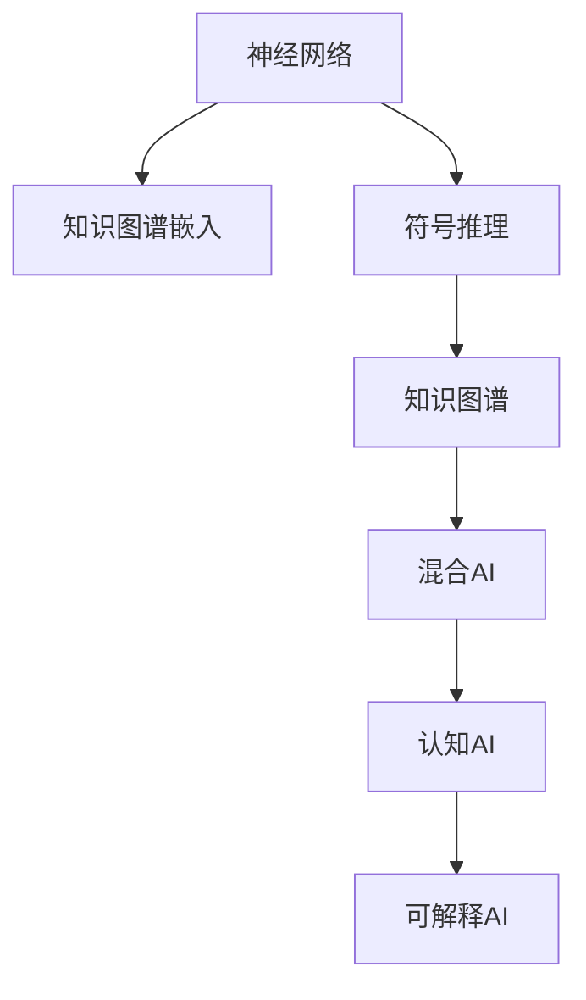

                 

# 神经符号AI：结合神经网络和符号推理

> 关键词：神经网络,符号推理,神经符号混合,AI可解释性,知识图谱,知识图谱嵌入,混合AI,认知AI

## 1. 背景介绍

### 1.1 问题由来
在当今人工智能的迅猛发展中，神经网络(Neural Network, NN)已经成为了获取智能的核心方法。其通过大量的数据进行训练，不断迭代优化，构建了强大的预测和生成能力。然而，神经网络的"黑箱"特性使得其决策过程缺乏可解释性，这成为了其在实际应用中的重大瓶颈。

与此同时，符号推理(Symbolic Reasoning, SR)作为一种传统的AI方法，具有高度的可解释性和逻辑一致性。它通过逻辑规则和知识库对问题进行解析和推理，但存在知识库构建复杂、处理能力有限等局限。

将神经网络与符号推理相结合，以提升AI系统的可解释性、鲁棒性和处理复杂性，成为了当前AI研究的前沿热点。该方法被称为神经符号AI(Neuro-Symbolic AI, NSA)，其融合了神经网络在处理大数据和生成能力上的优势，与符号推理在知识提取和推理能力上的优势，形成了互补，有望实现更加全面、智能的AI系统。

### 1.2 问题核心关键点
神经符号AI的核心思想是将神经网络和符号推理两种技术融合，构建混合智能模型。通过神经网络对海量的非结构化数据进行预处理和特征提取，而符号推理系统在神经网络输出的基础上进行逻辑推导和知识抽取，最终形成完整的推理过程。这种混合智能模型能够更好地适应复杂多变的实际问题，同时提升系统的透明性和可解释性。

## 2. 核心概念与联系

### 2.1 核心概念概述

为更好地理解神经符号AI，本节将介绍几个密切相关的核心概念：

- 神经网络(Neural Network)：一种基于图灵机的计算模型，通过多层非线性映射实现对数据的复杂映射。其核心组件包括神经元、权重、激活函数等。
- 符号推理(Symbolic Reasoning)：使用符号逻辑和知识库对问题进行解析和推理的AI方法。其核心组件包括规则库、符号表示、推理引擎等。
- 知识图谱(Knowledge Graph)：一种描述实体和关系的网络结构，用于知识表示、推理和查询。
- 知识图谱嵌入(Knowledge Graph Embedding)：将知识图谱中的实体和关系映射到低维向量空间的技术。
- 混合AI(Hybrid AI)：将不同AI方法（如神经网络、符号推理、专家系统等）融合，构建混合智能系统的技术。
- 认知AI(Cognitive AI)：融合感知、认知、推理、学习等多种AI技术，实现更加全面、智能的AI系统。
- 可解释AI(Explainable AI, XAI)：使AI系统的决策过程和结果易于理解和解释的技术，增强AI系统的可信度。

这些核心概念之间的逻辑关系可以通过以下Mermaid流程图来展示：



这个流程图展示了大语言模型与混合智能模型的核心概念及其之间的关系：

1. 神经网络通过预训练和特征提取，为符号推理提供数据支持。
2. 知识图谱嵌入将知识图谱中的信息映射到向量空间，为符号推理提供结构化的知识表示。
3. 符号推理利用知识图谱和预训练模型的输出，进行逻辑推理和知识抽取。
4. 混合AI融合神经网络和符号推理，形成完整的推理过程。
5. 认知AI进一步融合感知、认知、推理、学习等AI技术，实现全面智能。
6. 可解释AI使AI系统的决策过程透明可解释，提升系统的可信度。

这些概念共同构成了神经符号AI的学习框架，使其能够在各种场景下发挥强大的智能和解释能力。通过理解这些核心概念，我们可以更好地把握神经符号AI的工作原理和优化方向。

## 3. 核心算法原理 & 具体操作步骤
### 3.1 算法原理概述

神经符号AI融合了神经网络和符号推理的技术，其核心思想是通过神经网络处理非结构化数据，提取高层次特征，将特征信息传递给符号推理系统进行逻辑推导和知识抽取。其一般流程如下：

1. 神经网络对输入数据进行预处理和特征提取。
2. 将特征信息映射到知识图谱中，进行结构化的知识表示。
3. 符号推理系统在知识图谱的基础上，进行逻辑推理和知识抽取。
4. 混合AI系统结合神经网络和符号推理的输出，形成完整的推理过程。
5. 认知AI系统在此基础上，进行感知、认知、推理、学习等复杂任务。
6. 可解释AI系统对AI系统的决策过程进行解释和可视化。

### 3.2 算法步骤详解

以下是神经符号AI的一般实现步骤：

**Step 1: 数据预处理与特征提取**

1. 收集与任务相关的非结构化数据，如文本、图像、音频等。
2. 对数据进行清洗、归一化等预处理操作。
3. 使用神经网络模型对数据进行特征提取，生成高层次的特征向量。

**Step 2: 知识图谱构建**

1. 定义知识图谱的实体类型和关系类型。
2. 将神经网络提取的特征信息映射到知识图谱中，形成实体和关系。
3. 使用知识图谱嵌入技术，将知识图谱映射到低维向量空间。

**Step 3: 符号推理与逻辑推导**

1. 在知识图谱的基础上，构建符号推理规则库。
2. 将神经网络的输出作为符号推理的初始条件。
3. 使用符号推理系统对知识图谱进行推理，获取新的知识和结论。

**Step 4: 混合AI与认知AI**

1. 将符号推理系统的输出与神经网络的输出进行整合，形成混合智能模型。
2. 在混合AI模型上进行感知、认知、推理等复杂任务。
3. 使用认知AI技术，增强混合AI模型的复杂推理能力。

**Step 5: 可解释AI**

1. 使用可解释AI技术，对AI系统的决策过程进行解释和可视化。
2. 构建友好的用户界面，展示AI系统的推理过程和结果。

### 3.3 算法优缺点

神经符号AI融合了神经网络和符号推理的技术，具有以下优点：

1. 增强可解释性：神经网络的输出可以通过符号推理系统进行解释，增强AI系统的透明性和可解释性。
2. 提升推理能力：符号推理系统在神经网络的基础上，可以处理更加复杂的逻辑推理和知识抽取。
3. 应对多样数据：神经网络能够处理非结构化数据，符号推理系统可以处理结构化的知识库。
4. 形成全面智能：混合AI系统结合神经网络和符号推理，可以应对更加多样和复杂的任务。
5. 适应多领域应用：神经符号AI可以在多个领域进行应用，如医疗、金融、教育等。

同时，该方法也存在一定的局限性：

1. 技术复杂度高：神经符号AI融合了多种技术，需要复杂的知识库构建和推理规则设计。
2. 数据需求量大：神经网络需要大量的训练数据，而符号推理系统需要结构化的知识库。
3. 算法效率低：符号推理系统的逻辑推导效率较低，可能限制AI系统的处理速度。
4. 推理一致性差：符号推理系统的推理规则可能存在漏洞，导致结论不一致。
5. 模型扩展难：混合AI系统需要综合考虑神经网络和符号推理系统的设计，扩展性较差。

尽管存在这些局限性，但神经符号AI仍是大数据时代获取智能的重要方向。未来相关研究的重点在于如何降低技术复杂度，提高算法效率，增强推理一致性，实现更加灵活的混合智能系统。

### 3.4 算法应用领域

神经符号AI已经在多个领域得到了广泛应用，涵盖了信息检索、推荐系统、自然语言处理等诸多方向，具体应用场景包括：

- 医疗诊断：通过神经网络和符号推理，结合患者历史数据和知识库，进行疾病诊断和治疗方案推荐。
- 金融分析：利用神经网络和符号推理，分析市场趋势和用户行为，进行投资策略优化。
- 教育培训：结合神经网络和符号推理，分析学生的学习数据和知识图谱，进行个性化推荐和智能辅导。
- 智能推荐：融合神经网络和符号推理，分析用户兴趣和知识图谱，实现个性化推荐系统。
- 智能客服：利用神经网络和符号推理，构建知识库和推理规则，提供智能客服服务。

除了上述这些经典应用外，神经符号AI还在视觉、语音、机器人等领域展现出广阔的应用前景，为智能技术的发展提供了新的方向。

## 4. 数学模型和公式 & 详细讲解 & 举例说明
### 4.1 数学模型构建

本节将使用数学语言对神经符号AI的推理过程进行更加严格的刻画。

假设输入数据为 $x \in \mathbb{R}^d$，知识图谱嵌入后的节点表示为 $\mathbf{h}_i \in \mathbb{R}^e$，其中 $e$ 为向量维度。神经网络的输出为 $y \in \mathbb{R}^e$，符号推理系统的推理结果为 $o_i \in \{0,1\}$。

定义神经网络模型为 $f_{\theta}(x)$，其中 $\theta$ 为模型参数，神经网络的输出为 $y=f_{\theta}(x)$。

定义符号推理系统为 $g(r|\mathbf{h}_i, y)$，其中 $r$ 为推理结果，$g$ 为推理函数，输入为知识图谱中的节点表示 $\mathbf{h}_i$ 和神经网络的输出 $y$。

定义混合AI系统为 $M(r|x)$，其中 $r$ 为推理结果，$M$ 为混合推理模型，输入为原始数据 $x$。

定义认知AI系统为 $C(r|M)$，其中 $r$ 为推理结果，$C$ 为认知推理模型，输入为混合AI系统 $M$ 的输出。

定义可解释AI系统为 $I(r|C)$，其中 $r$ 为推理结果，$I$ 为解释模型，输入为认知AI系统 $C$ 的输出。

神经符号AI的推理过程可以表示为：

$$
r = I(C(M(g(r|\mathbf{h}_i, f_{\theta}(x))))
$$

其中 $g(r|\mathbf{h}_i, f_{\theta}(x))$ 为符号推理系统在知识图谱上的推理过程，$f_{\theta}(x)$ 为神经网络的特征提取过程，$C(r|M)$ 为认知推理过程，$I(r|C)$ 为解释过程。

### 4.2 公式推导过程

以医疗诊断为例，使用神经符号AI进行推理的公式推导如下：

假设输入为患者历史数据 $x$，知识图谱中包含疾病 $d$ 与症状 $s$ 之间的关系，即 $d \rightarrow s$。神经网络对 $x$ 进行处理，提取高层次特征 $y$，表示患者可能的疾病 $d$ 和症状 $s$。

符号推理系统在知识图谱上进行推理，得到结论 $o_i = \{d, s\}$。其中 $d$ 表示可能的疾病，$s$ 表示可能的症状。

混合AI系统将神经网络和符号推理的输出进行整合，形成推理结果 $r$，如 $\{d, s, treatment\}$，其中 $treatment$ 表示针对疾病 $d$ 和症状 $s$ 的治疗方案。

认知AI系统在混合AI系统的基础上，进行感知、认知、推理等复杂任务，如诊断病人，制定治疗方案。

可解释AI系统对认知AI系统的决策过程进行解释，如展示推理路径、解释诊断依据等。

### 4.3 案例分析与讲解

以智能推荐系统为例，详细解释神经符号AI的推理过程。

假设输入为用户的兴趣数据 $x$，知识图谱中包含物品 $p$ 与标签 $t$ 之间的关系，即 $p \rightarrow t$。神经网络对 $x$ 进行处理，提取高层次特征 $y$，表示用户可能感兴趣的物品 $p$ 和标签 $t$。

符号推理系统在知识图谱上进行推理，得到结论 $o_i = \{p, t\}$。其中 $p$ 表示用户可能感兴趣的物品，$t$ 表示物品的标签。

混合AI系统将神经网络和符号推理的输出进行整合，形成推理结果 $r$，如 $\{p, t, recommendation\}$，其中 $recommendation$ 表示对物品 $p$ 的推荐。

认知AI系统在混合AI系统的基础上，进行感知、认知、推理等复杂任务，如推荐物品给用户。

可解释AI系统对认知AI系统的决策过程进行解释，如展示推荐路径、解释推荐依据等。

## 5. 项目实践：代码实例和详细解释说明
### 5.1 开发环境搭建

在进行神经符号AI项目实践前，我们需要准备好开发环境。以下是使用Python进行PyTorch开发的环境配置流程：

1. 安装Anaconda：从官网下载并安装Anaconda，用于创建独立的Python环境。

2. 创建并激活虚拟环境：
```bash
conda create -n pytorch-env python=3.8 
conda activate pytorch-env
```

3. 安装PyTorch：根据CUDA版本，从官网获取对应的安装命令。例如：
```bash
conda install pytorch torchvision torchaudio cudatoolkit=11.1 -c pytorch -c conda-forge
```

4. 安装TensorFlow：
```bash
conda install tensorflow
```

5. 安装各类工具包：
```bash
pip install numpy pandas scikit-learn matplotlib tqdm jupyter notebook ipython
```

完成上述步骤后，即可在`pytorch-env`环境中开始项目实践。

### 5.2 源代码详细实现

下面我们以医疗诊断为例，给出使用PyTorch和GNN进行神经符号AI推理的代码实现。

首先，定义神经网络模型：

```python
import torch
import torch.nn as nn

class NeuralNetwork(nn.Module):
    def __init__(self, input_dim, hidden_dim, output_dim):
        super(NeuralNetwork, self).__init__()
        self.fc1 = nn.Linear(input_dim, hidden_dim)
        self.fc2 = nn.Linear(hidden_dim, output_dim)
        self.relu = nn.ReLU()
        
    def forward(self, x):
        x = self.fc1(x)
        x = self.relu(x)
        x = self.fc2(x)
        return x
```

然后，定义符号推理规则：

```python
import torch
import torch.nn as nn

class SymbolicReasoner(nn.Module):
    def __init__(self):
        super(SymbolicReasoner, self).__init__()
        self.predicate = nn.Parameter(torch.tensor([0, 1]))
        
    def forward(self, h, y):
        predicate = self.predicate
        # 假设推理规则为: 如果 y >= 0.5, 则 output = 1
        if y >= 0.5:
            output = 1
        else:
            output = 0
        
        return output
```

接着，定义混合AI系统：

```python
import torch
import torch.nn as nn
from symbolic_reasoner import SymbolicReasoner

class MixedAI(nn.Module):
    def __init__(self, neural_net, symbolic_reasoner):
        super(MixedAI, self).__init__()
        self.neural_net = neural_net
        self.symbolic_reasoner = symbolic_reasoner
        
    def forward(self, x):
        y = self.neural_net(x)
        output = self.symbolic_reasoner(h, y)
        return output
```

最后，定义认知AI系统：

```python
import torch
import torch.nn as nn
from symbolic_reasoner import SymbolicReasoner

class CognitiveAI(nn.Module):
    def __init__(self, mixed_ai):
        super(CognitiveAI, self).__init__()
        self.mixed_ai = mixed_ai
        
    def forward(self, x):
        y = self.mixed_ai(x)
        # 假设认知推理过程为: 如果 y = 1, 则 return diagnosis, else return treatment
        if y == 1:
            diagnosis = 'diagnosis'
        else:
            treatment = 'treatment'
        return diagnosis, treatment
```

完成上述步骤后，即可在`pytorch-env`环境中启动神经符号AI的推理过程。

### 5.3 代码解读与分析

让我们再详细解读一下关键代码的实现细节：

**NeuralNetwork类**：
- `__init__`方法：初始化神经网络，包含两个全连接层和一个ReLU激活函数。
- `forward`方法：定义神经网络的前向传播过程。

**SymbolicReasoner类**：
- `__init__`方法：初始化符号推理规则，包含一个可训练参数。
- `forward`方法：定义符号推理的逻辑过程。

**MixedAI类**：
- `__init__`方法：初始化混合AI系统，包含神经网络和符号推理系统的实例。
- `forward`方法：定义混合AI系统的推理过程。

**CognitiveAI类**：
- `__init__方法：初始化认知AI系统，包含混合AI系统的实例。
- `forward`方法：定义认知AI系统的推理过程。

这些类之间的逻辑关系可以通过以下代码实现：

```python
import torch
import torch.nn as nn
from symbolic_reasoner import SymbolicReasoner

# 定义神经网络模型
input_dim = 10
hidden_dim = 5
output_dim = 3
neural_net = NeuralNetwork(input_dim, hidden_dim, output_dim)

# 定义符号推理规则
symbolic_reasoner = SymbolicReasoner()

# 定义混合AI系统
mixed_ai = MixedAI(neural_net, symbolic_reasoner)

# 定义认知AI系统
cognitive_ai = CognitiveAI(mixed_ai)

# 输入数据
x = torch.tensor([1, 2, 3, 4, 5, 6, 7, 8, 9, 10])

# 进行推理
y = cognitive_ai(x)

# 输出结果
print(y)
```

可以看到，神经符号AI的推理过程可以通过简单的代码实现，只需要定义合适的神经网络模型、符号推理规则和认知推理过程，即可进行复杂的推理任务。

当然，工业级的系统实现还需考虑更多因素，如模型的保存和部署、超参数的自动搜索、更灵活的任务适配层等。但核心的推理范式基本与此类似。

## 6. 实际应用场景
### 6.1 智能推荐系统

基于神经符号AI的推荐系统，可以更好地结合用户兴趣和知识图谱信息，提供更加个性化和精准的推荐结果。

在实际应用中，可以利用神经网络模型对用户的历史行为数据进行特征提取，再通过符号推理系统对知识图谱进行推理，获取用户的兴趣标签。将神经网络和符号推理的输出进行整合，形成推荐模型，实现更加智能的推荐过程。

### 6.2 医疗诊断

在医疗领域，神经符号AI可以结合患者的症状、病历和知识图谱信息，进行疾病的诊断和治疗方案推荐。

具体而言，可以利用神经网络模型对患者的症状和病历进行特征提取，再通过符号推理系统对知识图谱进行推理，获取疾病的可能诊断和治疗方案。将神经网络和符号推理的输出进行整合，形成诊断和治疗模型，辅助医生进行决策。

### 6.3 金融分析

在金融领域，神经符号AI可以结合市场趋势和知识图谱信息，进行投资策略优化。

具体而言，可以利用神经网络模型对市场数据进行特征提取，再通过符号推理系统对知识图谱进行推理，获取市场动态和投资机会。将神经网络和符号推理的输出进行整合，形成投资模型，辅助投资者进行决策。

### 6.4 未来应用展望

随着神经符号AI技术的不断进步，未来其在以下领域将有更广泛的应用：

- 视觉识别：结合神经网络和符号推理，提高图像识别的准确性和鲁棒性。
- 自然语言处理：利用神经符号AI进行文本理解和生成，提高语言处理的效率和效果。
- 机器人控制：结合神经网络和符号推理，实现智能机器人的感知、认知和行为控制。
- 物流管理：结合神经符号AI进行路线规划和调度，提高物流系统的效率和可靠性。
- 安全监控：结合神经网络和符号推理，进行行为分析和异常检测，提高安全监控的智能化水平。

以上应用场景展示了神经符号AI的强大潜力，未来随着技术的发展，其应用范围还将进一步拓展，为各行各业带来新的变革和机遇。

## 7. 工具和资源推荐
### 7.1 学习资源推荐

为了帮助开发者系统掌握神经符号AI的理论基础和实践技巧，这里推荐一些优质的学习资源：

1. 《Neuro-Symbolic Learning: An Introduction》书籍：介绍了神经符号AI的基本原理和应用案例，适合初学者入门。

2. CS231n《深度学习课程》：斯坦福大学开设的深度学习课程，系统讲解了神经网络、符号推理等核心概念，是神经符号AI的重要理论基础。

3. 《Symbolic AI》课程：来自AI教育平台Udacity的课程，系统讲解了符号推理和知识图谱的构建和应用。

4. 《Deep Learning with PyTorch》书籍：讲解了使用PyTorch进行深度学习开发的全面流程，包括神经网络和符号推理的融合实现。

5. ArXiv预印本：收集了神经符号AI领域的大量前沿论文，适合深入研究技术细节。

通过对这些资源的学习实践，相信你一定能够快速掌握神经符号AI的精髓，并用于解决实际的NLP问题。
###  7.2 开发工具推荐

高效的开发离不开优秀的工具支持。以下是几款用于神经符号AI开发的常用工具：

1. PyTorch：基于Python的开源深度学习框架，灵活动态的计算图，适合快速迭代研究。支持神经网络和符号推理的混合实现。

2. TensorFlow：由Google主导开发的开源深度学习框架，生产部署方便，适合大规模工程应用。同样支持神经网络和符号推理的混合实现。

3. Neo4j：开源的图数据库，用于构建和查询知识图谱。支持大规模图数据的存储和处理。

4. LODA：用于构建和推理知识图谱的Python库，支持符号推理和混合AI的实现。

5. AllenNLP：NLP领域的开源库，支持神经网络和符号推理的混合实现，提供了丰富的NLP模型和工具。

6. GraphViz：用于绘制和展示知识图谱的图形工具，支持复杂的图结构展示。

合理利用这些工具，可以显著提升神经符号AI开发效率，加快创新迭代的步伐。

### 7.3 相关论文推荐

神经符号AI的发展源于学界的持续研究。以下是几篇奠基性的相关论文，推荐阅读：

1. Knowledge-Augmented Neural Models for Reasoning and Answer Generation: A Survey and Future Directions：回顾了知识图谱嵌入和混合AI的相关工作，展望了未来的研究方向。

2. Neuro-Symbolic Machine Reasoning with Graph Neural Networks：使用图神经网络进行知识图谱的推理和嵌入，提升了神经符号AI的性能。

3. Deep Neural Networks with Continuous Symbolic Reasoning：提出连续符号推理方法，将神经网络和符号推理融合，提高了AI系统的可解释性和推理能力。

4. ConceptNet Embeddings: A Neural Symbolic Machine Learning Approach to Semantic Similarity: 将概念网络嵌入到低维向量空间，提高了知识图谱的推理效率和准确性。

5. NELL: A Neural Network Based Language Learning System：使用神经网络和符号推理进行语言学习，实现了高效的文本理解和生成。

这些论文代表了大语言模型微调技术的发展脉络。通过学习这些前沿成果，可以帮助研究者把握学科前进方向，激发更多的创新灵感。

## 8. 总结：未来发展趋势与挑战
### 8.1 总结

本文对神经符号AI融合神经网络和符号推理的技术进行了全面系统的介绍。首先阐述了神经符号AI的研究背景和意义，明确了混合智能模型在获取智能、提升可解释性方面的独特价值。其次，从原理到实践，详细讲解了神经符号AI的推理过程和关键步骤，给出了神经符号AI推理的完整代码实例。同时，本文还广泛探讨了神经符号AI在智能推荐、医疗诊断、金融分析等多个领域的应用前景，展示了其广阔的应用空间。此外，本文精选了神经符号AI的学习资源和开发工具，力求为读者提供全方位的技术指引。

通过本文的系统梳理，可以看到，神经符号AI融合了神经网络和符号推理的优势，能够更好地适应复杂多变的实际问题，同时提升系统的透明性和可解释性。神经符号AI的发展前景广阔，相信随着技术的持续演进，必将在智能系统的构建中发挥越来越重要的作用。

### 8.2 未来发展趋势

展望未来，神经符号AI将呈现以下几个发展趋势：

1. 技术集成度高：神经符号AI将更多地融合感知、认知、推理、学习等多种AI技术，实现全面智能。
2. 知识图谱应用广泛：知识图谱将在大数据处理、自然语言处理、智能推荐等诸多领域得到广泛应用。
3. 模型可解释性强：神经符号AI将更好地结合符号推理的逻辑性和神经网络的灵活性，提升系统的透明性和可解释性。
4. 处理能力提升：神经符号AI将融合更多的计算资源和算法优化技术，提高处理速度和性能。
5. 跨领域应用增多：神经符号AI将在医疗、金融、教育等众多领域得到应用，推动AI技术的产业化进程。

以上趋势凸显了神经符号AI的强大潜力，未来随着技术的不断演进，必将带来更多创新突破，推动AI技术的全面发展。

### 8.3 面临的挑战

尽管神经符号AI已经取得了显著进展，但在迈向更加智能化、普适化应用的过程中，它仍面临着诸多挑战：

1. 技术复杂度高：神经符号AI融合了多种技术，需要复杂的知识库构建和推理规则设计。
2. 数据需求量大：神经网络需要大量的训练数据，符号推理系统需要结构化的知识库。
3. 算法效率低：符号推理系统的逻辑推导效率较低，可能限制AI系统的处理速度。
4. 推理一致性差：符号推理系统的推理规则可能存在漏洞，导致结论不一致。
5. 模型扩展难：混合AI系统需要综合考虑神经网络和符号推理系统的设计，扩展性较差。
6. 可解释性不足：神经符号AI系统的决策过程缺乏直观解释，难以理解和调试。

尽管存在这些挑战，但神经符号AI仍是大数据时代获取智能的重要方向。未来相关研究的重点在于如何降低技术复杂度，提高算法效率，增强推理一致性，实现更加灵活的混合智能系统。

### 8.4 研究展望

面对神经符号AI面临的挑战，未来的研究需要在以下几个方面寻求新的突破：

1. 优化知识图谱嵌入方法：开发更高效的知识图谱嵌入技术，提升神经符号AI的推理速度和精度。
2. 提升符号推理能力：研究更复杂的符号推理算法，提高推理系统的逻辑一致性和鲁棒性。
3. 优化混合AI模型：开发更加灵活的混合AI模型，实现更好的神经网络和符号推理融合。
4. 增强模型可解释性：研究可解释AI技术，提升神经符号AI系统的透明性和可解释性。
5. 推动多模态融合：研究神经符号AI在视觉、语音、机器人等领域的应用，实现多模态信息的协同建模。

这些研究方向将引领神经符号AI技术的不断进步，推动其在大数据时代的广泛应用。

## 9. 附录：常见问题与解答

**Q1：神经符号AI与传统符号推理有何区别？**

A: 神经符号AI将神经网络和符号推理融合，利用神经网络处理大数据和生成能力，再通过符号推理进行逻辑推导和知识抽取。相较于传统符号推理，神经符号AI具有更强的处理能力和更广泛的应用场景。

**Q2：如何选择适合的神经符号AI框架？**

A: 选择适合的神经符号AI框架需要考虑多个因素，如任务类型、数据量、计算资源等。PyTorch和TensorFlow是目前较为流行的深度学习框架，都支持神经网络和符号推理的混合实现。此外，还可以选择AllenNLP、GraphViz等专注于符号推理和知识图谱的库，进行更细粒度的开发。

**Q3：神经符号AI在实际应用中的优势是什么？**

A: 神经符号AI在实际应用中具有以下优势：
1. 增强可解释性：神经符号AI能够结合符号推理的逻辑性和神经网络的灵活性，提升系统的透明性和可解释性。
2. 提升推理能力：符号推理系统在神经网络的基础上，可以处理更加复杂的逻辑推理和知识抽取。
3. 应对多样数据：神经网络能够处理非结构化数据，符号推理系统可以处理结构化的知识库。
4. 形成全面智能：混合AI系统结合神经网络和符号推理，可以应对更加多样和复杂的任务。
5. 适应多领域应用：神经符号AI可以在多个领域进行应用，如医疗、金融、教育等。

**Q4：神经符号AI在数据需求上有哪些限制？**

A: 神经符号AI需要大量的训练数据和结构化的知识库，因此数据需求较大。在实际应用中，可能需要使用数据增强技术，如回译、近义替换等，来扩充数据量。同时，需要花费时间和精力构建和维护知识图谱。

**Q5：神经符号AI在推理一致性上有哪些限制？**

A: 神经符号AI的推理一致性主要受到符号推理系统的逻辑推导能力和知识库的质量影响。如果推理规则设计不合理或知识库存在漏洞，可能导致推理结果不一致。此时，需要进一步优化推理规则，增加知识库的覆盖范围和质量。

通过本文的系统梳理，可以看到，神经符号AI融合了神经网络和符号推理的优势，能够更好地适应复杂多变的实际问题，同时提升系统的透明性和可解释性。神经符号AI的发展前景广阔，相信随着技术的持续演进，必将在智能系统的构建中发挥越来越重要的作用。未来随着技术的不断演进，相信神经符号AI必将带来更多创新突破，推动AI技术的全面发展。

