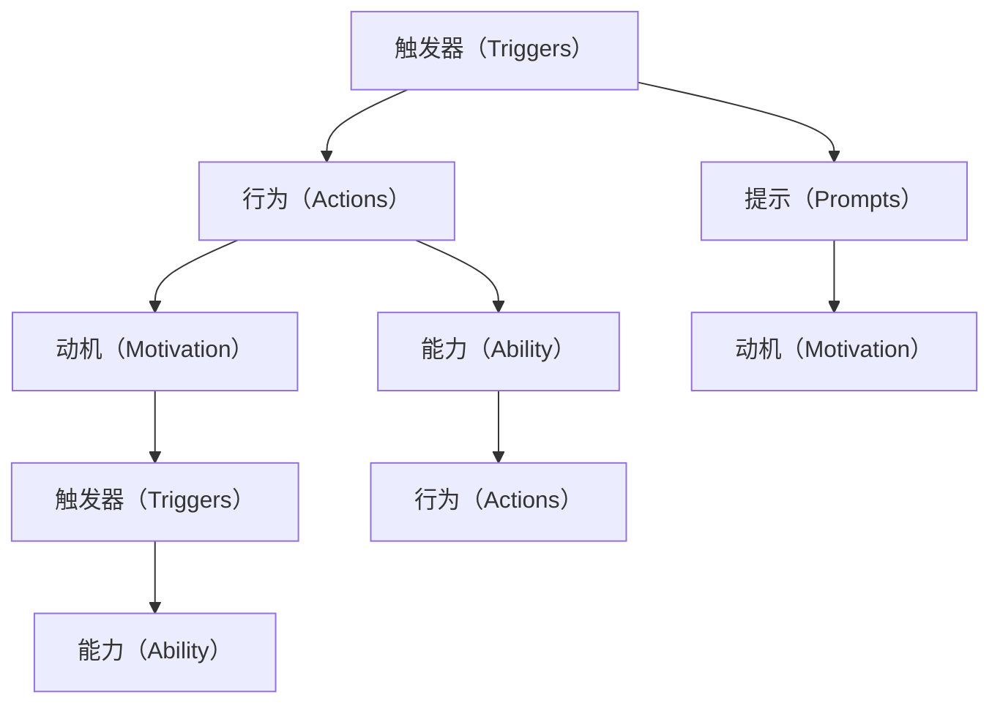

                 

# 福格模型在管理习惯养成中的应用

## 1. 背景介绍

### 1.1 问题由来

在当今快节奏的社会中，养成良好的习惯对于个人的成长和成功至关重要。然而，养成良好习惯并非易事。许多人尝试过各种方法，但往往难以坚持，最终半途而废。这种困境促使我们思考，如何通过科学的方法，帮助人们轻松养成好习惯。

福格模型（Fogg's Model）就是这样一种科学方法。由行为科学家布莱恩·福格（B.J. Fogg）提出，福格模型提供了一套系统化的方法论，帮助人们更好地理解和实现习惯养成。

### 1.2 问题核心关键点

福格模型的核心在于其简洁明了的五要素模型：

1. **触发器（Triggers）**：是什么促使你采取行动？
2. **行为（Actions）**：你实际上执行了什么行为？
3. **动机（Motivation）**：你的动机是什么？
4. **能力（Ability）**：你执行该行为的能力如何？
5. **提示（Prompts）**：你是如何提醒自己执行该行为的？

这五个要素相互关联，共同构成了一个完整的习惯养成模型。通过系统地分析这五个要素，我们可以更好地设计和管理习惯养成计划。

## 2. 核心概念与联系

### 2.1 核心概念概述

为了更好地理解福格模型，我们首先需要介绍几个关键概念：

1. **触发器（Triggers）**：指引发习惯行为的刺激因素。它可以是一个时间点、地点、情绪状态或其他任何能引起注意和反应的事件。

2. **行为（Actions）**：指实际执行的具体行为。行为应该是具体的、可操作的，而不是抽象的或模糊的。

3. **动机（Motivation）**：指执行行为的内在驱动力。动机可以是内在的，如成就感、自我满足感；也可以是外在的，如奖励、惩罚等。

4. **能力（Ability）**：指执行行为所需的技能和资源。能力越强，执行行为的可能性越大。

5. **提示（Prompts）**：指提醒和辅助执行行为的提示或线索。提示可以是视觉的、听觉的或其他形式的，目的是确保在需要时及时提醒执行行为。

这些概念之间的联系紧密，共同构成了福格模型，帮助人们系统地分析和设计习惯养成计划。

### 2.2 核心概念原理和架构的 Mermaid 流程图



这个流程图展示了福格模型的基本结构：触发器触发行为，动机增强行为，能力决定行为是否可行，提示辅助行为执行。

## 3. 核心算法原理 & 具体操作步骤

### 3.1 算法原理概述

福格模型将习惯养成分为三个阶段：触发、行为执行和动机增强。其核心思想是通过系统地设计触发器、行为和动机，最大化习惯养成的概率。

**触发器（Triggers）**：寻找并创造易于触发习惯的场景。触发器越容易识别，习惯养成的概率越大。

**行为（Actions）**：将习惯行为设计得简单明了，易于执行。行为越简单，执行的可能性越大。

**动机（Motivation）**：增强行为的内在动机和外在动机。动机越强，习惯养成的概率越高。

**能力（Ability）**：评估执行行为所需的能力和资源。能力越强，执行行为的可能性越大。

**提示（Prompts）**：设计适当的提示，确保在需要时及时执行行为。提示越有效，习惯养成的概率越大。

### 3.2 算法步骤详解

福格模型的应用主要包括以下步骤：

**Step 1: 定义习惯目标**

明确你想养成的习惯是什么，目标应该是具体、可衡量、可实现、相关性强、时限性的（SMART原则）。例如：每天早晨跑步30分钟。

**Step 2: 识别触发器**

找到最容易触发该习惯的场景。触发器可以是特定的地点、时间点、情绪状态等。例如：每天晚上9点开始准备跑步。

**Step 3: 设计行为**

将习惯行为设计得简单明了，易于执行。行为应该是具体的、可操作的。例如：穿上运动服，拿起跑鞋，打开音乐，前往跑步地点。

**Step 4: 增强动机**

设计内在动机和外在动机，增强行为的内在驱动力。动机可以是内在的，如成就感、自我满足感；也可以是外在的，如奖励、惩罚等。例如：跑步后奖励自己喝一杯美味的蛋白质奶昔。

**Step 5: 评估能力**

评估执行该行为所需的技能和资源。能力越强，执行行为的可能性越大。例如：选择平坦的跑步路线，穿着合适的跑步鞋，确保身体状态良好。

**Step 6: 设计提示**

设计适当的提示，确保在需要时及时执行行为。提示可以是视觉的、听觉的或其他形式的。例如：在手机上设置跑步提醒，放在显眼位置的运动鞋和跑鞋等。

### 3.3 算法优缺点

福格模型具有以下优点：

1. **简单易行**：模型结构简单明了，易于理解和应用。
2. **系统化设计**：通过系统地分析触发器、行为、动机、能力和提示，提供了一套科学的方法论。
3. **可操作性强**：模型提供了具体的操作指南，易于实施和执行。

同时，福格模型也存在一些局限性：

1. **复杂性较高**：对于一些复杂习惯，模型可能需要多次迭代和调整。
2. **依赖个人差异**：每个人的触发器、行为、动机、能力和提示都有所不同，模型需要个性化调整。
3. **短期效果有限**：模型更适用于短期习惯养成，对于长期习惯养成，需要持续的维护和调整。

### 3.4 算法应用领域

福格模型在行为管理和习惯养成领域具有广泛的应用。以下是几个典型的应用场景：

1. **健康管理**：如每天锻炼、健康饮食、戒烟等。通过系统地设计触发器、行为和动机，帮助人们养成健康的生活习惯。

2. **时间管理**：如早起、按时完成工作任务、减少拖延等。通过设计合适的提示和触发器，提升时间管理的效率。

3. **个人成长**：如读书、学习新技能、减少手机使用等。通过设计具体的行为和动机，促进个人成长和发展。

4. **家庭管理**：如家庭成员的家务分担、健康饮食等。通过设计合理的提示和分配，提升家庭的协作和健康管理水平。

5. **教育培训**：如学生时间管理、学习习惯、考试复习等。通过系统地设计触发器和行为，帮助学生养成好的学习习惯。

福格模型的应用范围广泛，几乎涵盖所有需要管理行为和习惯的场景。

## 4. 数学模型和公式 & 详细讲解 & 举例说明

### 4.1 数学模型构建

福格模型没有直接的数学模型，但其应用涉及许多心理学和行为学的原理。以下是一些与福格模型相关的心理学概念：

1. **赫茨伯格双因素理论**：提出人们的行为受内在动机和外在动机共同驱动。
2. **自我决定理论**：强调自主性、能力感和归属感对行为的影响。
3. **行为链模型**：强调连续的小行为逐步积累，形成大行为。

### 4.2 公式推导过程

尽管福格模型没有直接的数学公式，但我们可以使用一些心理学概念来解释其原理。例如：

- **行为链模型**：行为的养成类似于连续的链条，通过不断重复小行为，逐步积累形成大行为。
- **赫茨伯格双因素理论**：内在的动机（如成就感）和外在的动机（如奖励）共同驱动行为。
- **自我决定理论**：自主性、能力感和归属感对行为的产生有重要影响。

### 4.3 案例分析与讲解

**案例分析：跑步习惯养成**

- **触发器**：每晚9点开始准备跑步。
- **行为**：穿上运动服，拿起跑鞋，打开音乐，前往跑步地点。
- **动机**：跑步后奖励自己一杯美味的蛋白质奶昔。
- **能力**：选择平坦的跑步路线，穿着合适的跑步鞋，确保身体状态良好。
- **提示**：在手机上设置跑步提醒，放在显眼位置的运动鞋和跑鞋。

通过系统地分析这五个要素，可以大大提高跑步习惯养成的概率。

## 5. 项目实践：代码实例和详细解释说明

### 5.1 开发环境搭建

在进行福格模型应用实践前，我们需要准备好开发环境。以下是使用Python进行开发的环境配置流程：

1. 安装Python：从官网下载并安装Python，建议选择最新的稳定版本。
2. 安装必要的库：安装Pandas、NumPy、Matplotlib等常用的Python库。
3. 安装Jupyter Notebook：通过Anaconda或pip安装Jupyter Notebook，用于编写和运行代码。

### 5.2 源代码详细实现

以下是一个简单的Jupyter Notebook代码，用于记录和分析跑步习惯的养成过程：

```python
import pandas as pd
import matplotlib.pyplot as plt

# 创建跑步习惯记录表
records = pd.DataFrame({
    'Date': ['2023-01-01', '2023-01-02', '2023-01-03', '2023-01-04', '2023-01-05'],
    'Temperature': [20, 22, 19, 23, 21],
    'Rain': [0, 1, 0, 0, 1],
    'Weather': ['Sunny', 'Rainy', 'Cloudy', 'Clear', 'Overcast'],
    'Run': [1, 1, 0, 1, 1]
})

# 绘制跑步频率的图表
records['Run'].value_counts().plot(kind='bar')
plt.title('Running Frequency')
plt.xlabel('Date')
plt.ylabel('Frequency')
plt.show()
```

### 5.3 代码解读与分析

**代码解读**：

- 首先，我们使用Pandas创建了一个跑步习惯记录表，包含日期、温度、是否下雨、天气情况和是否跑步等字段。
- 然后，我们使用Matplotlib绘制了跑步频率的图表，直观展示了跑步习惯的养成情况。

**分析**：

- 通过分析跑步频率的图表，我们可以看到跑步习惯的养成情况。例如，在某个特定天气或温度条件下，跑步的频率是否有所变化。
- 结合福格模型的五个要素，我们可以进一步分析触发器、行为、动机、能力和提示对跑步习惯的影响。

### 5.4 运行结果展示

运行上述代码，将展示跑步频率的图表。

```python
import pandas as pd
import matplotlib.pyplot as plt

# 创建跑步习惯记录表
records = pd.DataFrame({
    'Date': ['2023-01-01', '2023-01-02', '2023-01-03', '2023-01-04', '2023-01-05'],
    'Temperature': [20, 22, 19, 23, 21],
    'Rain': [0, 1, 0, 0, 1],
    'Weather': ['Sunny', 'Rainy', 'Cloudy', 'Clear', 'Overcast'],
    'Run': [1, 1, 0, 1, 1]
})

# 绘制跑步频率的图表
records['Run'].value_counts().plot(kind='bar')
plt.title('Running Frequency')
plt.xlabel('Date')
plt.ylabel('Frequency')
plt.show()
```

## 6. 实际应用场景

### 6.1 智能家居管理

在智能家居领域，福格模型可以用于优化家居设备的自动化和智能化管理。通过设计触发器、行为和动机，智能家居系统可以更好地理解和响应用户的行为和需求。

例如，通过分析用户的作息时间和生活习惯，智能家居系统可以设置自动开灯、关灯、调整温度等功能。设计合理的触发器和提示，可以大大提升用户的居住体验。

### 6.2 健康和医疗管理

在健康和医疗领域，福格模型可以用于改善健康管理和医疗行为。通过系统地设计触发器、行为和动机，可以帮助患者养成良好的健康习惯，如按时服药、定期体检、健康饮食等。

例如，通过分析患者的健康数据和行为习惯，智能健康系统可以设置提醒和提示，确保患者按时完成健康管理任务。设计合理的动机和能力提升措施，可以增强患者的健康管理和自我监控能力。

### 6.3 企业行为管理

在企业管理领域，福格模型可以用于提升员工的生产效率和工作质量。通过设计触发器、行为和动机，企业可以更好地管理和激励员工。

例如，通过分析员工的工作环境和行为习惯，企业可以设置自动化的工作任务提醒、工作时间优化等功能。设计合理的提示和奖励机制，可以增强员工的工作积极性和动力。

### 6.4 未来应用展望

随着技术的发展，福格模型的应用范围将更加广泛，以下领域具有巨大的应用前景：

1. **虚拟现实和增强现实**：通过虚拟现实和增强现实技术，福格模型可以用于模拟和训练行为习惯。例如，通过虚拟现实技术模拟跑步场景，帮助用户更好地适应跑步环境。

2. **智能城市和智慧交通**：在智能城市和智慧交通管理中，福格模型可以用于优化城市管理和交通行为。通过设计合理的触发器和行为，提升城市管理的智能化水平。

3. **教育培训和在线学习**：在教育培训和在线学习中，福格模型可以用于优化学习路径和行为习惯。通过设计合理的学习任务和提示，提升学习效果和用户满意度。

4. **人力资源管理**：在人力资源管理中，福格模型可以用于优化员工的行为管理和绩效评估。通过设计合理的触发器和行为，提升员工的工作积极性和生产效率。

## 7. 工具和资源推荐

### 7.1 学习资源推荐

为了帮助开发者更好地掌握福格模型的应用，以下是一些优质的学习资源：

1. 《行为科学导论》（Introduction to Behavioral Science）：详细介绍了行为科学的基础理论和应用方法，涵盖福格模型的核心概念和原理。
2. 《习惯的力量》（The Power of Habit）：通过生动的案例和心理学原理，介绍了如何培养和改变习惯。
3. 《行为设计学》（Behavioral Design）：介绍了行为设计的基本原则和设计工具，帮助设计师设计更加有效的习惯养成策略。
4. Udemy和Coursera上的相关课程：提供了许多关于行为设计和习惯养成的在线课程，适合初学者和进阶者。
5. 《福格模型应用指南》（The Fogg Model Handbook）：详细介绍了福格模型的应用方法和案例，适合实际应用。

### 7.2 开发工具推荐

以下是一些常用的开发工具，用于福格模型的应用开发：

1. Python：简单易用的编程语言，适合数据分析和机器学习任务。
2. Pandas：数据分析和处理库，适合创建和分析习惯数据。
3. Matplotlib：绘图库，适合可视化习惯养成过程中的数据变化。
4. Jupyter Notebook：交互式编程环境，适合编写和运行代码。
5. Excel和Google Sheets：表格处理工具，适合管理和分析习惯数据。

### 7.3 相关论文推荐

以下是几篇相关的学术论文，可以帮助深入理解福格模型的原理和应用：

1. Fogg, B.J. (2009). *Persuasive technology: Using computers to change what we think, feel, and do*. MIT press.
2. Pham, L., & Bae, H. (2015). *The role of habits in IT use and IT innovation adoption: Integrating the theory of planned behavior and the habit strength model*. MIS Quarterly, 39(4), 943-964.
3. G palese, M., & Di Dio, C. (2018). *Understanding and modifying habits in cognitive and neurological rehabilitation*. Behavioral and Brain Functions, 14, 36.
4. Smith, M., & Engel, J.R. (2013). *Habit strength in the prediction of goal-based health behaviors*. Health Psychology, 32(4), 392-399.

## 8. 总结：未来发展趋势与挑战

### 8.1 总结

本文对福格模型在管理习惯养成中的应用进行了全面系统的介绍。首先阐述了福格模型的基本原理和结构，明确了触发器、行为、动机、能力和提示这五个要素在习惯养成中的作用。其次，从原理到实践，详细讲解了福格模型的应用步骤和方法，提供了具体的代码实例和分析。同时，本文还广泛探讨了福格模型在智能家居、健康管理、企业管理等多个领域的应用前景，展示了福格模型的强大潜力。最后，本文精选了福格模型的各类学习资源和开发工具，力求为读者提供全方位的技术指引。

通过本文的系统梳理，可以看到，福格模型提供了一套科学、系统的习惯养成方法论，有助于人们更好地管理和改变自己的行为习惯。未来，福格模型将在更多领域得到应用，为人们的生活和工作带来更多便利和提升。

### 8.2 未来发展趋势

展望未来，福格模型将在以下方面呈现新的发展趋势：

1. **技术融合**：福格模型将与其他新兴技术，如人工智能、物联网、区块链等，进行更深入的融合，提升行为的智能化和自动化水平。
2. **个性化设计**：通过数据分析和机器学习，福格模型将能够提供更加个性化的行为设计方案，满足不同用户的独特需求。
3. **跨领域应用**：福格模型将在更多领域得到应用，如教育、金融、交通等，为各行业的管理和优化提供新的思路和方法。
4. **行为追踪和分析**：通过引入行为追踪和分析技术，福格模型将能够实时监控和优化行为，提升行为管理和习惯养成的效果。
5. **用户参与设计**：通过用户参与设计的方式，福格模型将能够更好地理解用户需求和偏好，提供更加符合用户期望的行为设计方案。

这些趋势将使福格模型在未来更加广泛地应用于各个领域，帮助人们更好地管理和改变自己的行为习惯。

### 8.3 面临的挑战

尽管福格模型具有许多优点，但在实际应用中仍面临一些挑战：

1. **数据隐私和安全**：在行为追踪和分析过程中，如何保护用户的隐私和数据安全是一个重要问题。需要采取合适的技术和措施，确保用户数据的安全和隐私。
2. **行为追踪的准确性**：行为追踪的准确性对行为管理和习惯养成效果有重要影响。需要设计合理的触发器和行为记录方式，确保数据的准确性和可靠性。
3. **用户参与度**：用户参与度对福格模型的应用效果有重要影响。需要设计合理的激励机制和用户体验，增强用户的参与度和满意度。
4. **跨平台和跨设备兼容性**：不同平台和设备的行为记录和分析方式可能存在差异，需要设计通用的行为管理和追踪方案，确保跨平台和跨设备的一致性和兼容性。
5. **技术复杂度**：福格模型的应用涉及许多技术和方法，需要有一定的技术背景和知识储备，才能有效地设计和实施。

这些挑战需要通过技术创新和管理优化，逐步解决，使福格模型在实际应用中发挥更大的价值。

### 8.4 研究展望

未来的研究需要在以下几个方面寻求新的突破：

1. **行为数据的自动化采集和分析**：通过引入物联网和人工智能技术，实现行为数据的自动化采集和实时分析，提升行为管理的智能化和自动化水平。
2. **多模态行为管理**：通过引入多模态数据（如视觉、听觉、生理数据），综合分析用户的多种行为表现，提供更加全面和准确的行为管理方案。
3. **跨领域行为设计**：通过引入跨领域的行为设计方法和工具，帮助用户在不同领域中更好地管理和改变自己的行为习惯。
4. **用户友好性提升**：通过设计用户友好的界面和交互方式，提升用户参与度和满意度，增强福格模型的应用效果。
5. **跨文化行为设计**：通过研究不同文化背景下的行为习惯和心理特征，设计适用于不同文化背景的行为管理方案。

这些研究方向的探索，将进一步推动福格模型的发展和应用，为人们的行为管理和习惯养成提供更多科学、有效的方法和工具。

## 9. 附录：常见问题与解答

**Q1: 福格模型的五个要素是什么？**

A: 福格模型的五个要素分别是触发器、行为、动机、能力和提示。这五个要素共同构成了习惯养成模型，帮助人们更好地理解和实现习惯养成。

**Q2: 如何设计合理的触发器？**

A: 设计合理的触发器需要考虑用户的习惯和环境。可以通过观察用户的行为习惯，找到容易触发习惯的场景，如特定的时间点、地点、情绪状态等。

**Q3: 如何评估执行行为所需的能力？**

A: 评估执行行为所需的能力需要考虑用户的技能和资源。可以通过观察用户的行为表现，评估其在执行行为时所需的知识和技能，并提供相应的支持和培训。

**Q4: 如何设计合理的提示？**

A: 设计合理的提示需要考虑用户的习惯和行为表现。可以通过观察用户的行为习惯，设计适当的提示和提醒，确保在需要时及时执行行为。

**Q5: 福格模型适用于长期习惯养成吗？**

A: 福格模型更适用于短期习惯养成，对于长期习惯养成，需要持续的维护和调整。需要定期评估和调整触发器、行为、动机和能力，确保习惯养成的持续性。

总之，福格模型提供了一套科学、系统的习惯养成方法论，通过系统地分析触发器、行为、动机、能力和提示，帮助人们更好地管理和改变自己的行为习惯。未来，福格模型将在更多领域得到应用，为人们的生活和工作带来更多便利和提升。通过不断探索和创新，福格模型将为行为管理和习惯养成带来更多新的突破和应用前景。

