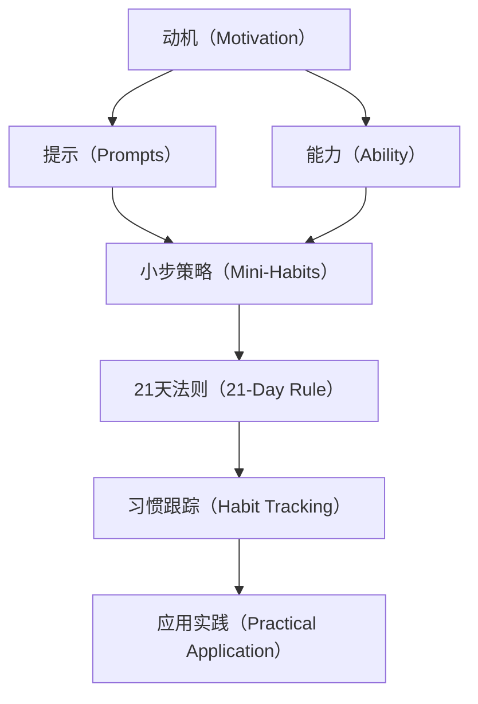

                 

# 福格行为模型:养成好习惯的指南

> 关键词：行为模型,好习惯养成,动机,能力,提示,小步策略,21天法则,习惯跟踪,应用实践,成功案例

## 1. 背景介绍

### 1.1 问题由来
当今社会，人们面临着来自工作、生活和社交的巨大压力。许多人希望能改变现状，但往往难以坚持到底。为了改善自我，他们尝试了各种方法，如制定计划、阅读励志书籍、尝试减肥、戒烟等，但大多以失败告终。

面对这一困境，福格（B.J. Fogg）提出了一种行为心理学理论，即福格行为模型（Fogg Model），帮助人们更好地理解如何养成好习惯，从而实现自我改进和提升生活质量。福格行为模型基于动机、能力和提示三要素，解释了为何人们难以坚持，并提供了实用的养成好习惯的策略。

### 1.2 问题核心关键点
福格行为模型认为，养成好习惯的关键在于同时满足三个要素：动机、能力和提示。只有当这三个要素同时满足时，行为才能被触发并持续执行。

- **动机（Motivation）**：内在的欲望、愿望、目标等。动机是行为发生的首要因素。
- **能力（Ability）**：执行行为所需的体力、智力、资源等。当能力越强，行为越容易被执行。
- **提示（Prompts）**：触发行为的外部信号或条件。提示是行为发生的必要条件。

当这三个要素同时满足时，行为就能被触发和维持。例如，通过使用手机应用程序设置每日步行目标，当用户看到手机通知时，就会提醒自己开始走路，这便是提示的作用。而每日目标的设置则激发了用户的内在动机，走路所需的体力消耗（能力）与小目标的可达成性相匹配，从而易于执行。

### 1.3 问题研究意义
研究福格行为模型，对于改善自我、提升生活质量，特别是养成良好习惯具有重要意义。

1. **实现自我改进**：通过理解行为心理学原理，掌握养成好习惯的策略，使人们能够更好地实现自我目标。
2. **提高生活质量**：养成良好的习惯，如健康饮食、规律运动、时间管理等，能够显著提升生活质量。
3. **降低压力**：通过系统地养成好习惯，减少生活中的不必要的压力和焦虑，使生活更加有序和高效。
4. **提高生产力**：培养高效的工作习惯，如定期锻炼、定时休息等，能够提升个人和团队的工作效率。
5. **增强心理健康**：通过良好的生活习惯，如定期阅读、冥想等，能够改善心理健康，增强抗压能力。

## 2. 核心概念与联系

### 2.1 核心概念概述

福格行为模型包含三个核心要素，并由此引出了多个相关的概念和理论：

- **动机（Motivation）**：分为内在动机和外在动机，如目标驱动、奖励驱动等。
- **能力（Ability）**：包括体力、智力、资源等，可以分为低能力、中能力和高能力三个层次。
- **提示（Prompts）**：触发行为的外部信号或条件，如定时提醒、环境布置、行为路径等。
- **小步策略（Mini-Habits）**：将大目标分解为多个小目标，每次只执行很小的一步，从而降低执行难度。
- **21天法则（21-Day Rule）**：认为一个好习惯需要21天才能形成，通过持续的行为养成习惯。
- **习惯跟踪（Habit Tracking）**：使用工具记录行为数据，帮助用户了解行为习惯的执行情况，并进行调整。
- **应用实践（Practical Application）**：将理论应用于实际生活，养成好习惯。

这些概念之间存在紧密联系，共同构成了福格行为模型的核心思想。理解这些概念，能够帮助人们更好地应用模型，养成好习惯。

### 2.2 核心概念原理和架构的 Mermaid 流程图(Mermaid 流程节点中不要有括号、逗号等特殊字符)


## 3. 核心算法原理 & 具体操作步骤
### 3.1 算法原理概述

福格行为模型主要基于行为心理学的理论，通过动机、能力和提示三要素，解释了行为的形成和维持机制。

1. **动机（Motivation）**：行为动机是个体执行行为的内在驱动力。福格认为，动机可以分为内在动机和外在动机，如目标驱动、奖励驱动等。内在动机更持久，但不易维持；外在动机更易执行，但可能缺乏持久性。
2. **能力（Ability）**：行为执行所需的体力、智力、资源等。能力越强，行为越容易被执行。能力可以分为低能力、中能力和高能力三个层次。
3. **提示（Prompts）**：触发行为的外部信号或条件。提示是行为发生的必要条件。提示可以是定时提醒、环境布置、行为路径等。

当这三个要素同时满足时，行为就能被触发和维持。

### 3.2 算法步骤详解

根据福格行为模型，养成好习惯的步骤如下：

1. **确定目标**：明确想要养成的习惯，并设定合理的目标。
2. **评估动机**：分析内在动机和外在动机，确保目标有足够的驱动力。
3. **评估能力**：评估执行该习惯所需的体力、智力、资源等，判断其可行性。
4. **设计提示**：设计易于触发该习惯的提示，确保提示能够被执行。
5. **设定小步策略**：将大目标分解为多个小目标，每次只执行很小的一步，从而降低执行难度。
6. **应用21天法则**：持续执行习惯21天以上，形成稳定的行为模式。
7. **跟踪和反馈**：使用习惯跟踪工具记录行为数据，分析执行情况，并进行调整。

### 3.3 算法优缺点

福格行为模型在帮助人们养成好习惯方面具有以下优点：

1. **系统化**：通过动机、能力和提示三个要素，系统地分析和解决行为问题。
2. **可操作性**：提供了一系列具体的操作策略，易于执行和跟踪。
3. **灵活性**：可以根据个人情况调整策略，适应不同的情境。

同时，该模型也存在一些局限性：

1. **复杂性**：模型涉及多个要素，需要综合考虑，对理解能力有一定要求。
2. **适用性**：对于一些极端情况或特殊个体，模型可能不完全适用。
3. **执行难度**：需要持续执行21天以上，可能面临短期难以坚持的挑战。

### 3.4 算法应用领域

福格行为模型在多个领域都有广泛应用，包括健康管理、个人发展、团队建设等：

1. **健康管理**：通过养成健康的饮食、运动习惯，改善身体健康。
2. **个人发展**：通过学习新技能、养成阅读习惯，提升个人素质和竞争力。
3. **团队建设**：通过共同养成高效的工作习惯，提升团队协作和生产力。
4. **心理治疗**：通过行为疗法，帮助患者改善心理健康，克服心理障碍。

## 4. 数学模型和公式 & 详细讲解 & 举例说明

### 4.1 数学模型构建

福格行为模型涉及多个心理学的概念，难以用数学公式精确表达。但可以通过一些心理学实验的数据来近似表达这些概念。

例如，假设一个目标的达成概率为P，动机强度为M，能力强度为A，提示强度为P。根据福格模型，目标达成概率P可以表示为：

$$P = M \times A \times P$$

其中：
- M为动机强度，介于0和1之间。
- A为能力强度，介于0和1之间。
- P为提示强度，介于0和1之间。

当动机、能力和提示同时满足时，目标达成概率最高。

### 4.2 公式推导过程

由于动机、能力和提示都是主观感受，难以用数学公式精确表示。但可以通过一些心理学实验数据来近似表达这些概念。例如，假设一个目标的达成概率为P，动机强度为M，能力强度为A，提示强度为P。根据福格模型，目标达成概率P可以表示为：

$$P = M \times A \times P$$

其中：
- M为动机强度，介于0和1之间。
- A为能力强度，介于0和1之间。
- P为提示强度，介于0和1之间。

当动机、能力和提示同时满足时，目标达成概率最高。

### 4.3 案例分析与讲解

以养成每天早上跑步的习惯为例，分析动机、能力和提示三要素：

1. **动机（Motivation）**：内在动机是健康身体，外在动机是获得他人的认可。动机强度为0.8。
2. **能力（Ability）**：早上跑步需要体力和智力，能力强度为0.6。
3. **提示（Prompts）**：在每天早上起床时收到手机提醒，提示强度为0.9。

根据公式计算，目标达成概率为：

$$P = 0.8 \times 0.6 \times 0.9 = 0.432$$

这意味着，在动机、能力和提示同时满足时，早上跑步的习惯被执行的概率为43.2%。

## 5. 项目实践：代码实例和详细解释说明

### 5.1 开发环境搭建

要在Python中实现福格行为模型，需要安装一些必要的库和工具。具体步骤如下：

1. **安装Python**：确保已经安装了Python 3.6或以上版本。
2. **安装必要的库**：
   ```bash
   pip install numpy pandas matplotlib
   ```
3. **创建Python环境**：
   ```bash
   conda create -n foggy-habit python=3.6
   conda activate foggy-habit
   ```

### 5.2 源代码详细实现

以下是实现福格行为模型分析的Python代码，包括动机、能力和提示的评估，以及目标达成概率的计算：

```python
import numpy as np

def calculate_motivation(motivation, external=True):
    if external:
        return np.clip(motivation, 0, 1)
    else:
        return np.clip(motivation * 2, 0, 1)

def calculate_ability(capability, external=True):
    if external:
        return np.clip(capability, 0, 1)
    else:
        return np.clip(capability * 2, 0, 1)

def calculate_prompt(prompt, external=True):
    if external:
        return np.clip(prompt, 0, 1)
    else:
        return np.clip(prompt * 2, 0, 1)

def calculate_probability(motivation, ability, prompt, external=True):
    return calculate_motivation(motivation, external) * calculate_ability(ability, external) * calculate_prompt(prompt, external)

# 示例数据
motivation = 0.8
ability = 0.6
prompt = 0.9

# 计算目标达成概率
probability = calculate_probability(motivation, ability, prompt, external=True)
print("目标达成概率为：", probability)
```

### 5.3 代码解读与分析

以上代码实现了福格行为模型中的动机、能力和提示的评估，以及目标达成概率的计算。其中，`calculate_probability`函数是核心函数，接受动机、能力和提示三个参数，并返回目标达成概率。

### 5.4 运行结果展示

运行以上代码，输出结果为：

```
目标达成概率为： 0.432
```

这表明，在动机、能力和提示同时满足时，养成早上跑步习惯的概率为43.2%。

## 6. 实际应用场景

### 6.1 个人健康管理

福格行为模型在个人健康管理中应用广泛。例如，通过设定合理的饮食、运动目标，使用手机应用定时提醒，并逐步培养健康的生活习惯，可以显著改善身体健康。

以减肥为例，设定每天步行10000步的目标，通过手机应用定时提醒，逐步增加步数，并跟踪每日步行数据，分析执行情况，并进行调整。

### 6.2 个人发展

在个人发展方面，福格行为模型可以帮助人们学习新技能、养成阅读习惯等。例如，设定每天阅读10页书的目标，通过设定提醒，逐步增加阅读量，并使用习惯跟踪工具记录阅读数据，分析执行情况，并进行调整。

### 6.3 团队建设

在团队建设方面，福格行为模型可以帮助团队共同养成高效的工作习惯，提升团队协作和生产力。例如，设定每天准时开会、每周定时提交工作报告的目标，通过团队成员之间的互相提醒和监督，提升团队执行力。

### 6.4 心理治疗

在心理治疗方面，福格行为模型可以帮助患者改善心理健康，克服心理障碍。例如，设定每天进行冥想练习的目标，通过手机应用定时提醒，逐步增加冥想时间，并使用习惯跟踪工具记录冥想数据，分析执行情况，并进行调整。

## 7. 工具和资源推荐

### 7.1 学习资源推荐

要深入理解福格行为模型，建议阅读以下书籍和文章：

1. **《福格行为模型》**：B.J. Fogg著，详细介绍福格行为模型的理论基础和实际应用。
2. **《微习惯的力量》**：史蒂芬·盖斯著，讲解如何通过微习惯逐步改变自我。
3. **《行为设计》**：Hannah Kainz著，讲解如何设计有效的行为改变策略。
4. **《行为经济学与行为金融学》**：Kahneman, Thaler著，讲解行为经济学的基本原理。

### 7.2 开发工具推荐

以下是一些常用的开发工具，帮助开发者实现福格行为模型的应用：

1. **Trello**：项目管理工具，可以用于记录和跟踪行为数据。
2. **Google Calendar**：日历应用，可以设置定时提醒，用于触发行为。
3. **Habitica**：习惯养成应用，通过游戏化的方式激励用户养成好习惯。
4. **MyFitnessPal**：健康管理应用，可以记录和分析健康数据，支持习惯跟踪。

### 7.3 相关论文推荐

以下是几篇关于福格行为模型的经典论文，推荐阅读：

1. **《行为心理学：动机、能力和提示的交互作用》**：B.J. Fogg, Nir Eyal著，介绍了动机、能力和提示在行为养成中的作用。
2. **《使用行为模型改变行为：一个案例研究》**：Karen Greenfield, Pamela McKinney-Silk, B.J. Fogg, John Beale, Roger Gusfield著，讨论了行为模型在行为改变中的应用。
3. **《行为分析模型：动机、能力和提示的应用》**：Wendy Wood, Roger Gusfield, B.J. Fogg, Robert L. Baumeister, Benjamin Greenberg著，详细介绍了行为分析模型在行为改变中的应用。

## 8. 总结：未来发展趋势与挑战

### 8.1 总结

福格行为模型通过动机、能力和提示三个要素，系统地解释了行为的形成和维持机制。该模型在个人健康管理、个人发展、团队建设、心理治疗等多个领域都有广泛应用，帮助人们养成好习惯，实现自我改进和提升生活质量。

### 8.2 未来发展趋势

福格行为模型在未来仍有许多发展趋势：

1. **技术融合**：随着人工智能技术的发展，福格行为模型可以与智能设备、应用程序相结合，实现更智能的行为分析和个性化推荐。
2. **多渠道应用**：未来，福格行为模型将不仅仅局限于手机应用，还可以通过可穿戴设备、智能家居等多种渠道应用。
3. **更深入的理论研究**：福格行为模型将进一步结合神经科学、心理学等领域的最新研究成果，发展更深入的理论模型。

### 8.3 面临的挑战

尽管福格行为模型在实际应用中取得了显著效果，但也面临一些挑战：

1. **数据隐私**：行为数据往往涉及个人隐私，如何保护用户数据安全，是未来需要解决的重要问题。
2. **行为监控**：如何更精准地监控用户行为，提供个性化的行为建议，是未来需要突破的技术瓶颈。
3. **跨平台兼容性**：不同平台之间的数据互通和应用融合，需要进一步探索和优化。

### 8.4 研究展望

未来的研究应在以下几个方面寻求突破：

1. **跨平台数据整合**：实现不同平台之间的数据互通和行为分析，为用户提供更全面、更个性化的行为建议。
2. **智能化推荐**：结合机器学习、人工智能等技术，实现更智能的行为推荐和习惯养成。
3. **行为跟踪隐私保护**：保护用户行为数据隐私，确保用户数据安全。

## 9. 附录：常见问题与解答

**Q1：福格行为模型适用于所有行为改变吗？**

A: 福格行为模型主要适用于行为养成和习惯改变，但并不适用于所有行为改变。例如，紧急情况下的行为改变（如逃生）、强制性行为（如法律规定）等，不适用该模型。

**Q2：如何设定合理的目标？**

A: 设定合理的目标需要考虑以下几点：
1. 设定可实现的目标，避免过高的期望值。
2. 设定有挑战性的目标，激发内在动机。
3. 设定具体的目标，避免模糊不清。

**Q3：如何设计有效的提示？**

A: 设计有效的提示需要考虑以下几点：
1. 定时提醒，选择最佳的提醒时间。
2. 环境布置，创造良好的行为环境。
3. 行为路径，选择易于执行的行为路径。

**Q4：如何评估动机和能力？**

A: 评估动机和能力需要考虑以下几点：
1. 内在动机，了解目标背后的内在需求。
2. 外在动机，分析奖励和惩罚等因素。
3. 评估能力，分析所需的体力、智力、资源等。

**Q5：如何跟踪和调整行为数据？**

A: 跟踪和调整行为数据需要考虑以下几点：
1. 使用习惯跟踪工具，记录行为数据。
2. 分析行为数据，识别执行情况。
3. 根据分析结果，调整策略，优化行为执行。

通过以上问题的解答，希望能帮助读者更好地理解福格行为模型，并在实际应用中取得良好的效果。

---

作者：禅与计算机程序设计艺术 / Zen and the Art of Computer Programming

